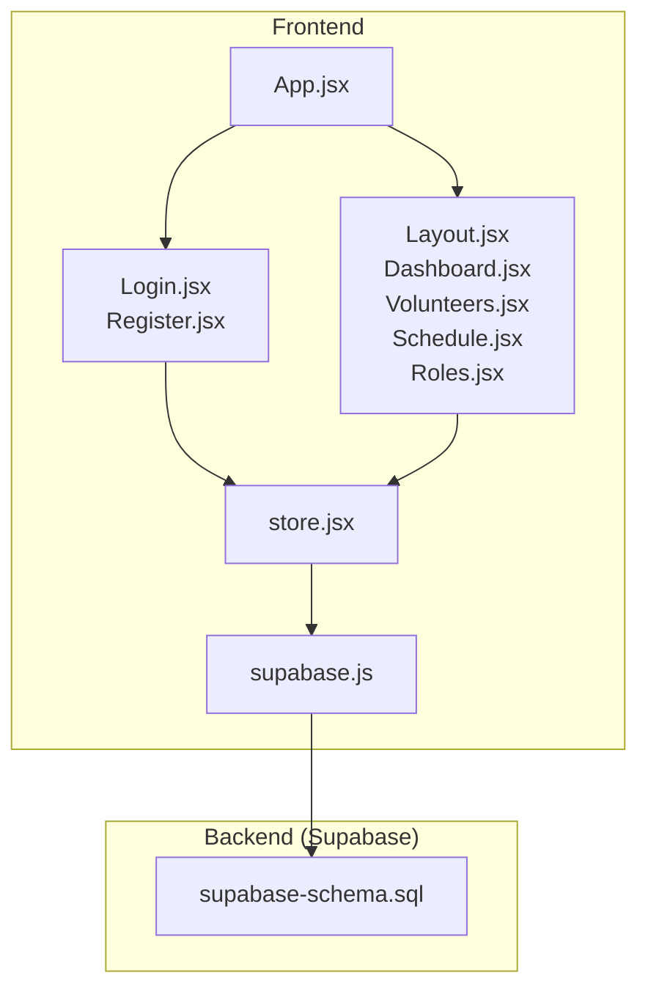
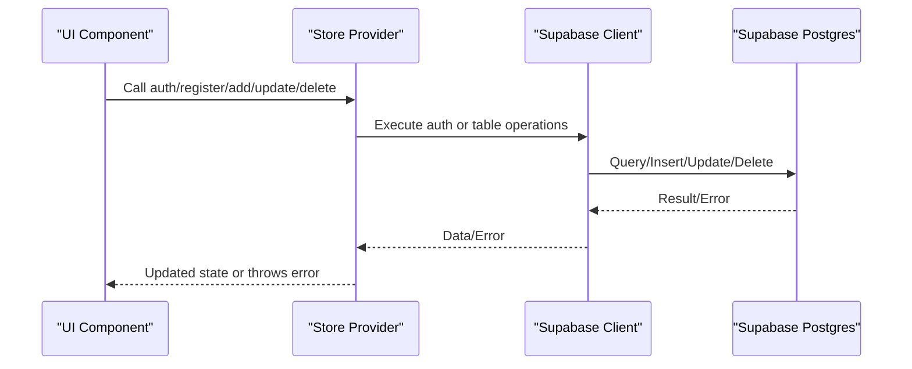
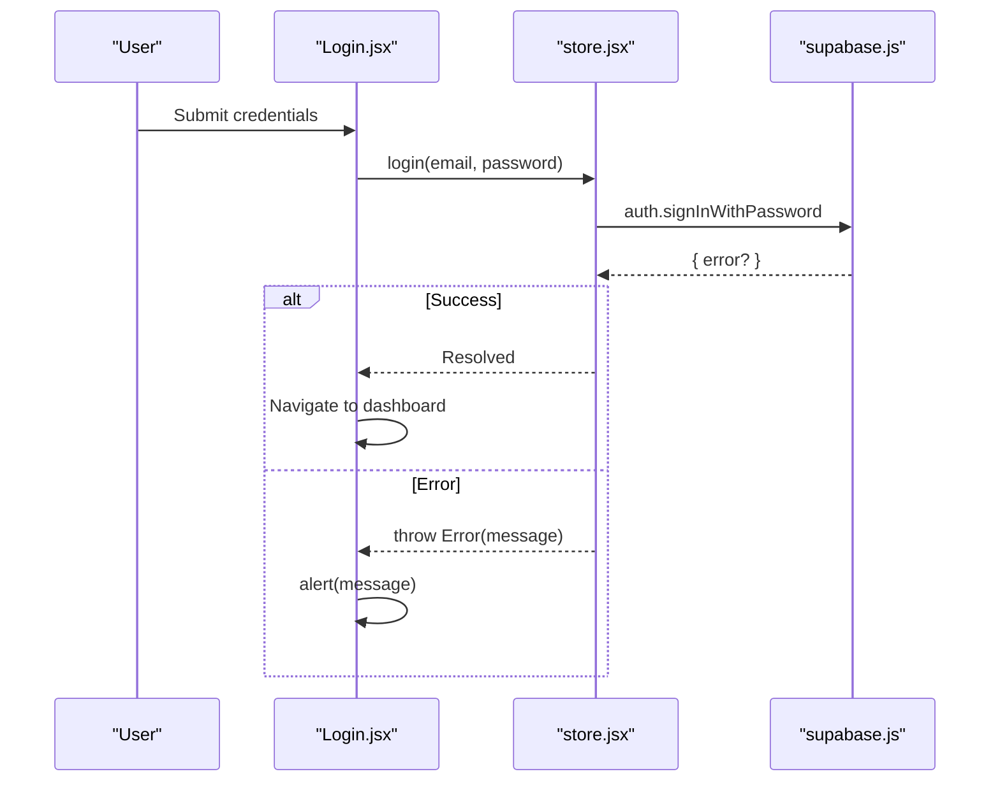
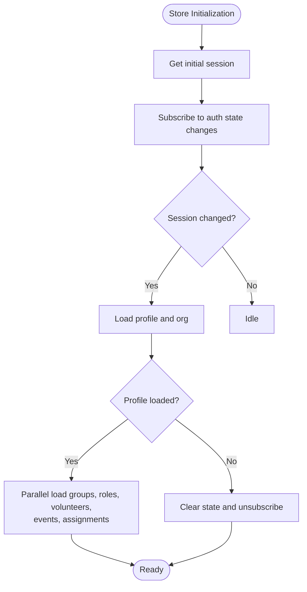
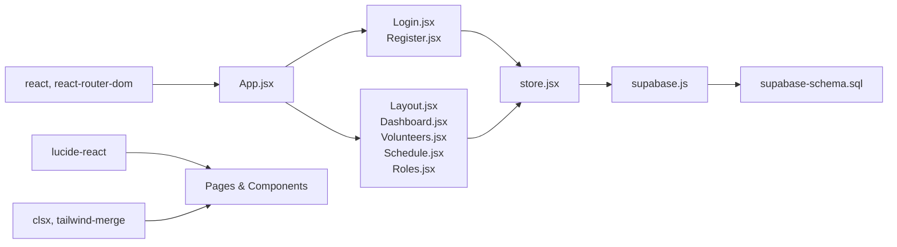

# API Reference

<cite>
**Referenced Files in This Document**
- [supabase.js](file://src/services/supabase.js)
- [store.jsx](file://src/services/store.jsx)
- [supabase-schema.sql](file://supabase-schema.sql)
- [Login.jsx](file://src/pages/Login.jsx)
- [Register.jsx](file://src/pages/Register.jsx)
- [App.jsx](file://src/App.jsx)
- [Layout.jsx](file://src/components/Layout.jsx)
- [AuthLayout.jsx](file://src/components/AuthLayout.jsx)
- [Dashboard.jsx](file://src/pages/Dashboard.jsx)
- [Volunteers.jsx](file://src/pages/Volunteers.jsx)
- [Schedule.jsx](file://src/pages/Schedule.jsx)
- [Roles.jsx](file://src/pages/Roles.jsx)
- [.env.example](file://.env.example)
- [package.json](file://package.json)
</cite>

## Table of Contents
1. [Introduction](#introduction)
2. [Project Structure](#project-structure)
3. [Core Components](#core-components)
4. [Architecture Overview](#architecture-overview)
5. [Detailed Component Analysis](#detailed-component-analysis)
6. [Dependency Analysis](#dependency-analysis)
7. [Performance Considerations](#performance-considerations)
8. [Troubleshooting Guide](#troubleshooting-guide)
9. [Conclusion](#conclusion)
10. [Appendices](#appendices)

## Introduction
This document provides comprehensive API documentation for RosterFlow’s database and service interfaces. It covers:
- Supabase database API: table schemas, query patterns, and row-level security policies
- Authentication API endpoints for login, registration, and session management
- Custom store provider API: state management, data access methods, and event handlers
- Real-time subscription API for live data synchronization and event handling
- Error handling patterns, response formats, and status codes
- Rate limiting, authentication requirements, and security considerations
- API versioning strategy and backward compatibility guarantees
- Debugging tools and monitoring approaches

## Project Structure
RosterFlow is a React application that integrates with Supabase for authentication and data persistence. The key modules are:
- Supabase client initialization and environment configuration
- Centralized store provider encapsulating authentication and CRUD operations
- Page components consuming the store for UI interactions
- Supabase SQL schema defining tables, relationships, and RLS policies

**Diagram sources**
- [App.jsx](file://src/App.jsx#L13-L34)
- [Login.jsx](file://src/pages/Login.jsx#L5-L25)
- [Register.jsx](file://src/pages/Register.jsx#L5-L27)
- [Layout.jsx](file://src/components/Layout.jsx#L14-L31)
- [Dashboard.jsx](file://src/pages/Dashboard.jsx#L21-L28)
- [Volunteers.jsx](file://src/pages/Volunteers.jsx#L7-L12)
- [Schedule.jsx](file://src/pages/Schedule.jsx#L7-L13)
- [Roles.jsx](file://src/pages/Roles.jsx#L6-L7)
- [store.jsx](file://src/services/store.jsx#L1-L12)
- [supabase.js](file://src/services/supabase.js#L1-L12)
- [supabase-schema.sql](file://supabase-schema.sql#L1-L251)

**Section sources**
- [App.jsx](file://src/App.jsx#L13-L34)
- [store.jsx](file://src/services/store.jsx#L1-L12)
- [supabase.js](file://src/services/supabase.js#L1-L12)
- [supabase-schema.sql](file://supabase-schema.sql#L1-L251)

## Core Components
- Supabase client: initialized with environment variables and exported for use across the app
- Store provider: manages authentication state, loads organization and profile data, and exposes CRUD methods for groups, roles, volunteers, events, and assignments
- Authentication pages: login and registration flows integrated with the store
- Protected layout: enforces authentication and navigation

Key responsibilities:
- Environment validation and client creation
- Centralized auth state and session lifecycle
- Parallel data loading and transformations
- Error propagation and logging
- UI-driven method dispatch to Supabase

**Section sources**
- [supabase.js](file://src/services/supabase.js#L1-L12)
- [store.jsx](file://src/services/store.jsx#L6-L34)
- [store.jsx](file://src/services/store.jsx#L78-L111)
- [store.jsx](file://src/services/store.jsx#L114-L124)
- [store.jsx](file://src/services/store.jsx#L126-L159)
- [Login.jsx](file://src/pages/Login.jsx#L5-L25)
- [Register.jsx](file://src/pages/Register.jsx#L5-L27)
- [Layout.jsx](file://src/components/Layout.jsx#L14-L31)

## Architecture Overview
The application follows a layered architecture:
- Presentation layer: React components and pages
- Domain layer: Store provider orchestrating data and auth
- Data access layer: Supabase client and SQL schema
- Security layer: Row-level security policies and function-based access checks

**Diagram sources**
- [store.jsx](file://src/services/store.jsx#L114-L124)
- [store.jsx](file://src/services/store.jsx#L126-L159)
- [store.jsx](file://src/services/store.jsx#L162-L194)
- [store.jsx](file://src/services/store.jsx#L245-L264)
- [store.jsx](file://src/services/store.jsx#L295-L314)

## Detailed Component Analysis

### Supabase Database API
- Tables and relationships
  - organizations: primary key id, name, created_at
  - profiles: primary key id (references auth.users), org_id, name, role, created_at
  - groups: primary key id, org_id, name, created_at
  - roles: primary key id, org_id, group_id, name, created_at
  - volunteers: primary key id, org_id, name, email, phone, created_at
  - volunteer_roles: composite primary key (volunteer_id, role_id)
  - events: primary key id, org_id, title, date, time, created_at
  - assignments: primary key id, org_id, event_id, role_id, volunteer_id, status, created_at

- Row-level security (RLS)
  - Each table enables RLS
  - Policies restrict access to records belonging to the authenticated user’s organization
  - Helper function get_user_org_id() resolves org_id for the current auth user

- Query patterns
  - Select with ordering and filtering
  - Upserts and inserts with single-row selection
  - Deletes with equality filters
  - Many-to-many joins via volunteer_roles

- Real-time subscriptions
  - Not implemented in the frontend code; Supabase supports real-time via channels and Postgres publication/subscription
  - The store subscribes to auth state changes but does not subscribe to table changes

- Example query patterns
  - Load profile with organization: select profiles join organizations
  - Load all organization data in parallel: groups, roles, volunteers, events, assignments
  - Insert volunteer with many-to-many: insert volunteer then insert volunteer_roles rows

**Section sources**
- [supabase-schema.sql](file://supabase-schema.sql#L7-L251)
- [store.jsx](file://src/services/store.jsx#L54-L68)
- [store.jsx](file://src/services/store.jsx#L82-L88)
- [store.jsx](file://src/services/store.jsx#L167-L174)
- [store.jsx](file://src/services/store.jsx#L183-L191)

### Authentication API
- Environment configuration
  - VITE_SUPABASE_URL and VITE_SUPABASE_ANON_KEY must be set
  - Missing values produce a warning during initialization

- Endpoints and flows
  - Login: signInWithPassword
  - Logout: signOut
  - Registration: signUp followed by organization and profile creation

- Error handling
  - Errors thrown as JavaScript Error with message extracted from Supabase error
  - UI surfaces errors via alerts

- Response formats
  - Auth responses include user/session data or error object
  - Registration returns auth data and creates org/profile

- Status codes
  - Supabase returns HTTP-like status codes; client-side code surfaces errors as thrown exceptions

- Example usage
  - Login form calls store.login and navigates on success
  - Registration form calls store.registerOrganization and navigates on success

**Diagram sources**
- [Login.jsx](file://src/pages/Login.jsx#L14-L25)
- [store.jsx](file://src/services/store.jsx#L114-L117)
- [supabase.js](file://src/services/supabase.js#L1-L12)

**Section sources**
- [.env.example](file://.env.example#L1-L5)
- [supabase.js](file://src/services/supabase.js#L3-L8)
- [Login.jsx](file://src/pages/Login.jsx#L14-L25)
- [store.jsx](file://src/services/store.jsx#L114-L124)
- [store.jsx](file://src/services/store.jsx#L126-L159)

### Custom Store Provider API
- State management
  - Session, profile, organization, loading state
  - Lists: groups, roles, volunteers, events, assignments
  - Derived user object for UI compatibility

- Initialization and lifecycle
  - On mount: fetch initial session, subscribe to auth state changes
  - On session change: load profile and organization
  - On profile change: load all organization data in parallel

- Data access methods
  - Volunteers: add, update, delete with volunteer_roles handling
  - Events: add, update, delete
  - Assignments: create/update
  - Roles: add, update, delete
  - Groups: add, update, delete
  - Utility: refreshData

- Error handling
  - Logs errors to console
  - Throws Error with message for UI handling
  - Clears data on logout

- Event handlers
  - Auth state subscription for reactive session updates

**Diagram sources**
- [store.jsx](file://src/services/store.jsx#L21-L34)
- [store.jsx](file://src/services/store.jsx#L37-L52)
- [store.jsx](file://src/services/store.jsx#L78-L111)

**Section sources**
- [store.jsx](file://src/services/store.jsx#L6-L34)
- [store.jsx](file://src/services/store.jsx#L37-L52)
- [store.jsx](file://src/services/store.jsx#L78-L111)
- [store.jsx](file://src/services/store.jsx#L114-L124)
- [store.jsx](file://src/services/store.jsx#L162-L194)
- [store.jsx](file://src/services/store.jsx#L245-L264)
- [store.jsx](file://src/services/store.jsx#L295-L314)
- [store.jsx](file://src/services/store.jsx#L331-L375)
- [store.jsx](file://src/services/store.jsx#L378-L422)

### Real-time Subscription API
- Current implementation
  - Auth state subscription via supabase.auth.onAuthStateChange
  - No table-level real-time subscriptions in the store

- Recommended approach
  - Use Supabase Realtime channels to subscribe to tables or views
  - Combine with RLS to ensure clients only receive permitted rows
  - Handle reconnection and presence for collaborative editing

- Event handling
  - React to insert/update/delete events
  - Update local state atomically and optimistically where appropriate

[No sources needed since this section provides general guidance]

### API Versioning and Compatibility
- Database migrations
  - Use Supabase SQL migrations to evolve schema safely
  - Keep RLS policies aligned with schema changes

- Frontend compatibility
  - Maintain stable store method signatures
  - Provide deprecation warnings for renamed methods
  - Preserve backward-compatible data shapes where possible

[No sources needed since this section provides general guidance]

## Dependency Analysis
- External dependencies
  - @supabase/supabase-js for client operations
  - react-router-dom for routing and navigation
  - lucide-react for UI icons
  - clsx and tailwind-merge for utility classes

- Internal dependencies
  - Pages depend on the store provider
  - Store depends on the Supabase client
  - Auth pages render protected layout conditionally

**Diagram sources**
- [package.json](file://package.json#L15-L24)
- [App.jsx](file://src/App.jsx#L1-L37)
- [store.jsx](file://src/services/store.jsx#L1-L4)
- [supabase.js](file://src/services/supabase.js#L1-L12)
- [supabase-schema.sql](file://supabase-schema.sql#L1-L251)

**Section sources**
- [package.json](file://package.json#L15-L24)
- [App.jsx](file://src/App.jsx#L1-L37)
- [store.jsx](file://src/services/store.jsx#L1-L4)
- [supabase.js](file://src/services/supabase.js#L1-L12)

## Performance Considerations
- Parallel data loading
  - Use Promise.all to fetch groups, roles, volunteers, events, assignments concurrently
- Optimistic updates
  - Consider optimistic UI for quick feedback; reconcile with server on conflict
- Pagination and filtering
  - Implement server-side pagination for large datasets
- Caching
  - Cache frequently accessed lists (roles, groups) in memory
- Debounced search
  - Debounce filter inputs to reduce unnecessary queries

[No sources needed since this section provides general guidance]

## Troubleshooting Guide
- Environment variables missing
  - Symptom: Warning about VITE_SUPABASE_URL or VITE_SUPABASE_ANON_KEY
  - Fix: Set values in .env file and rebuild

- Authentication failures
  - Symptom: Errors on login/register
  - Fix: Verify credentials, network connectivity, and Supabase project settings

- Data not loading
  - Symptom: Empty lists despite existing data
  - Fix: Confirm RLS policies allow access; check org_id resolution

- Real-time updates not appearing
  - Symptom: UI not reflecting changes made by others
  - Fix: Implement Supabase Realtime subscriptions and ensure proper channel setup

**Section sources**
- [supabase.js](file://src/services/supabase.js#L6-L8)
- [store.jsx](file://src/services/store.jsx#L90-L110)
- [store.jsx](file://src/services/store.jsx#L114-L124)

## Conclusion
RosterFlow’s API stack combines Supabase’s authentication and database capabilities with a centralized store provider that simplifies state management and data access. The schema enforces strong isolation via RLS, while the store orchestrates parallel loading and robust error handling. Extending the system with Supabase Realtime channels would enable live collaboration and improved responsiveness.

[No sources needed since this section summarizes without analyzing specific files]

## Appendices

### Authentication Requirements and Security Considerations
- Authentication
  - All operations require a valid session established via login or registration
- Authorization
  - RLS policies restrict access to organization-scoped records
  - Helper function get_user_org_id ensures policy enforcement
- Secrets
  - Never expose anon key or JWT tokens in client code
- Rate limiting
  - Supabase enforces limits; implement client-side throttling for bulk operations

**Section sources**
- [supabase-schema.sql](file://supabase-schema.sql#L88-L251)
- [store.jsx](file://src/services/store.jsx#L37-L52)

### Monitoring and Debugging Tools
- Browser DevTools
  - Network tab to inspect Supabase requests and responses
  - Console for logged errors and warnings
- Supabase Dashboard
  - Logs, metrics, and audit trails for database and auth
- React Developer Tools
  - Inspect store state and component props

**Section sources**
- [store.jsx](file://src/services/store.jsx#L90-L110)
- [store.jsx](file://src/services/store.jsx#L114-L124)