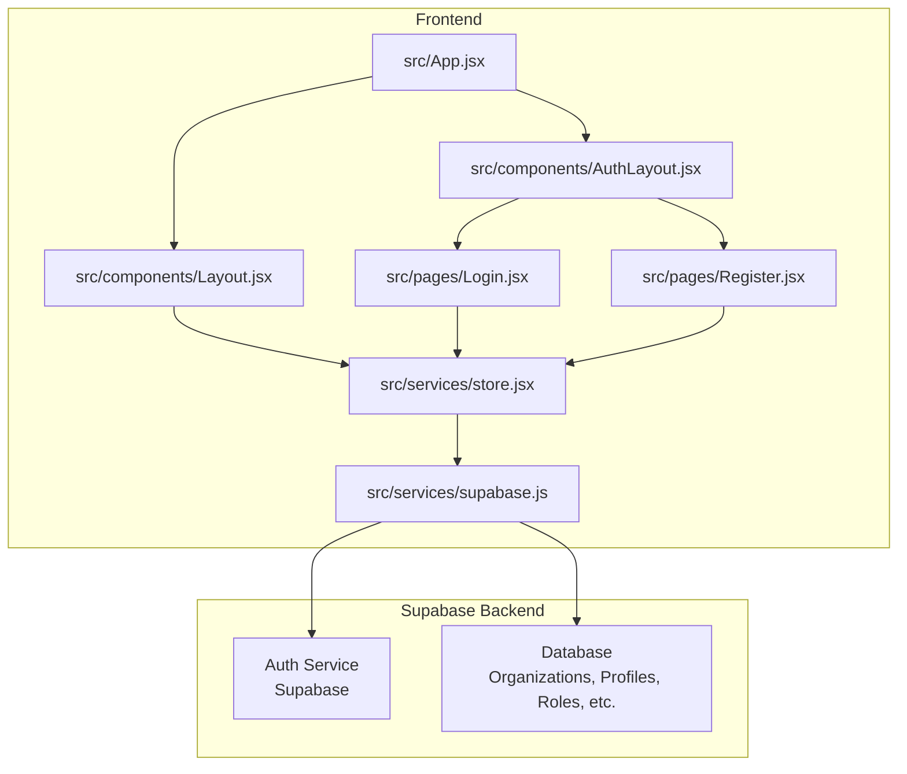
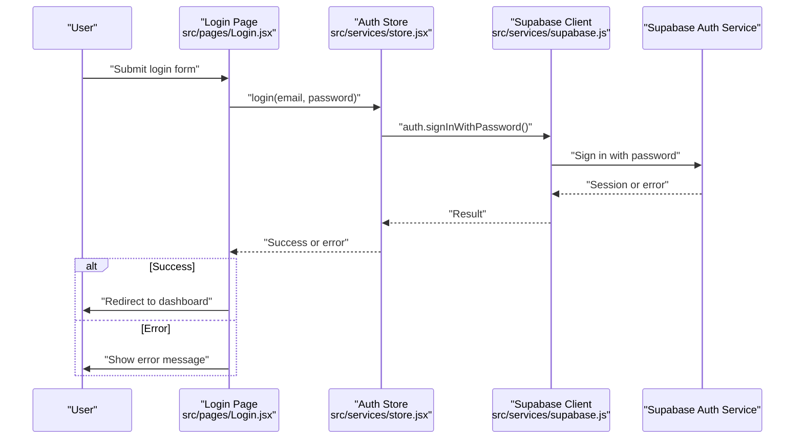
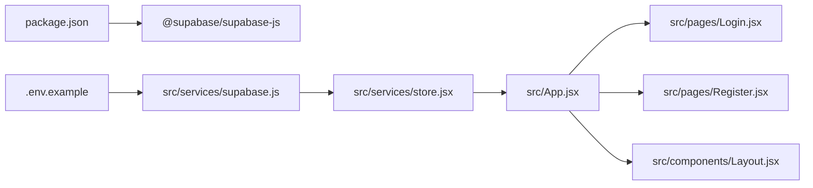
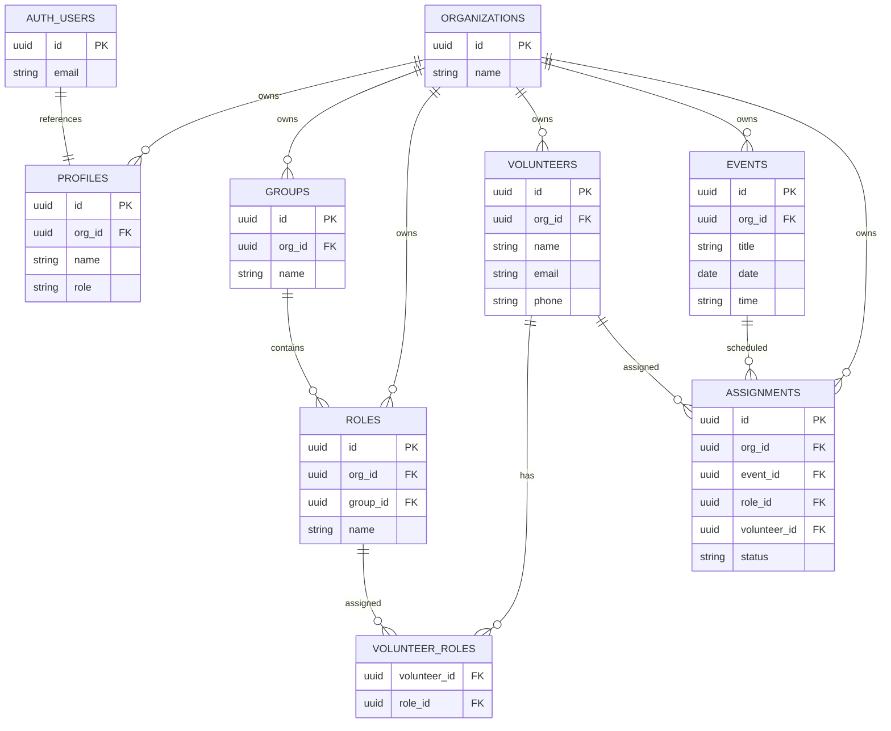

# Authentication API

<cite>
**Referenced Files in This Document**
- [src/services/supabase.js](file://src/services/supabase.js)
- [src/services/store.jsx](file://src/services/store.jsx)
- [src/pages/Login.jsx](file://src/pages/Login.jsx)
- [src/pages/Register.jsx](file://src/pages/Register.jsx)
- [src/App.jsx](file://src/App.jsx)
- [src/components/Layout.jsx](file://src/components/Layout.jsx)
- [src/components/AuthLayout.jsx](file://src/components/AuthLayout.jsx)
- [supabase-schema.sql](file://supabase-schema.sql)
- [.env.example](file://.env.example)
- [package.json](file://package.json)
</cite>

## Table of Contents
1. [Introduction](#introduction)
2. [Project Structure](#project-structure)
3. [Core Components](#core-components)
4. [Architecture Overview](#architecture-overview)
5. [Detailed Component Analysis](#detailed-component-analysis)
6. [Dependency Analysis](#dependency-analysis)
7. [Performance Considerations](#performance-considerations)
8. [Troubleshooting Guide](#troubleshooting-guide)
9. [Conclusion](#conclusion)
10. [Appendices](#appendices)

## Introduction
This document describes the authentication API and user management system for RosterFlow. It covers login, logout, and registration flows, session and token handling, authentication state persistence, role-based access control (RBAC), and related workflows such as password reset and email verification. It also provides integration guidance for client-side flows and server-side validation, along with security considerations.

RosterFlow integrates with Supabase for authentication, session management, and row-level security policies. The frontend uses React with React Router and a centralized store to manage authentication state and user data.

## Project Structure
The authentication system spans several frontend components and a shared Supabase client. The backend is powered by Supabase’s authentication service and database with Row Level Security (RLS) policies.

**Diagram sources**
- [src/App.jsx](file://src/App.jsx#L13-L34)
- [src/components/AuthLayout.jsx](file://src/components/AuthLayout.jsx#L4-L24)
- [src/components/Layout.jsx](file://src/components/Layout.jsx#L14-L107)
- [src/pages/Login.jsx](file://src/pages/Login.jsx#L5-L25)
- [src/pages/Register.jsx](file://src/pages/Register.jsx#L5-L27)
- [src/services/store.jsx](file://src/services/store.jsx#L6-L34)
- [src/services/supabase.js](file://src/services/supabase.js#L1-L13)

**Section sources**
- [src/App.jsx](file://src/App.jsx#L13-L34)
- [src/components/AuthLayout.jsx](file://src/components/AuthLayout.jsx#L4-L24)
- [src/components/Layout.jsx](file://src/components/Layout.jsx#L14-L107)
- [src/pages/Login.jsx](file://src/pages/Login.jsx#L5-L25)
- [src/pages/Register.jsx](file://src/pages/Register.jsx#L5-L27)
- [src/services/store.jsx](file://src/services/store.jsx#L6-L34)
- [src/services/supabase.js](file://src/services/supabase.js#L1-L13)

## Core Components
- Supabase client initialization and environment configuration
- Centralized authentication store managing session, profile, organization, and data loading
- Public authentication routes (login, register) and protected route layout
- Logout handler and navigation guard

Key responsibilities:
- Initialize Supabase client with environment variables
- Manage authentication state and persist it across the app lifecycle
- Provide login, logout, and organization registration functions
- Enforce access control via Supabase RLS policies

**Section sources**
- [src/services/supabase.js](file://src/services/supabase.js#L1-L13)
- [src/services/store.jsx](file://src/services/store.jsx#L6-L34)
- [src/services/store.jsx](file://src/services/store.jsx#L114-L124)
- [src/services/store.jsx](file://src/services/store.jsx#L126-L159)
- [src/components/Layout.jsx](file://src/components/Layout.jsx#L17-L30)
- [src/App.jsx](file://src/App.jsx#L18-L30)

## Architecture Overview
The authentication architecture leverages Supabase’s auth service for credentials-based sign-in and sign-up, and RLS for data isolation. The store subscribes to auth state changes and loads user profile and organization data upon sign-in.

**Diagram sources**
- [src/pages/Login.jsx](file://src/pages/Login.jsx#L14-L25)
- [src/services/store.jsx](file://src/services/store.jsx#L114-L117)
- [src/services/supabase.js](file://src/services/supabase.js#L10)

**Section sources**
- [src/pages/Login.jsx](file://src/pages/Login.jsx#L14-L25)
- [src/services/store.jsx](file://src/services/store.jsx#L114-L117)
- [src/services/supabase.js](file://src/services/supabase.js#L10)

## Detailed Component Analysis

### Supabase Client Initialization
- Reads Supabase URL and anonymous key from environment variables
- Creates a Supabase client instance
- Emits a warning if environment variables are missing

Security considerations:
- Keep anonymous keys secret in production
- Configure environment variables per deployment

**Section sources**
- [src/services/supabase.js](file://src/services/supabase.js#L3-L10)
- [.env.example](file://.env.example#L1-L5)

### Authentication Store
Responsibilities:
- Initialize session state and subscribe to auth state changes
- Load profile and organization data when a session exists
- Provide login, logout, and organization registration functions
- Clear data on logout

Auth functions:
- login(email, password): Sign in with email and password
- logout(): Sign out and clear local state
- registerOrganization({ orgName, adminName, email, password }): Create a new user, organization, and profile; auto-login

Data loading:
- loadProfile(): Fetch profile and organization linked to the current user
- loadAllData(): Parallel load of groups, roles, volunteers, events, and assignments

Access control:
- Uses Supabase RLS policies to restrict data visibility and mutations to the user’s organization

**Section sources**
- [src/services/store.jsx](file://src/services/store.jsx#L21-L34)
- [src/services/store.jsx](file://src/services/store.jsx#L54-L68)
- [src/services/store.jsx](file://src/services/store.jsx#L78-L111)
- [src/services/store.jsx](file://src/services/store.jsx#L114-L124)
- [src/services/store.jsx](file://src/services/store.jsx#L126-L159)

### Login Endpoint
- Frontend form captures email and password
- Calls store.login(email, password)
- On success, navigates to the dashboard
- On error, displays the error message

Validation rules:
- Email and password are required
- Password strength is enforced by Supabase

**Section sources**
- [src/pages/Login.jsx](file://src/pages/Login.jsx#L8-L25)
- [src/services/store.jsx](file://src/services/store.jsx#L114-L117)

### Registration Endpoint
- Frontend form captures organization name, admin name, work email, and password
- Calls store.registerOrganization(payload)
- On success, navigates to the dashboard

Registration flow:
- Create auth user (Supabase)
- Create organization record
- Create profile with role set to admin
- Auto-login and load profile

Validation rules:
- All fields are required
- Password strength is enforced by Supabase

**Section sources**
- [src/pages/Register.jsx](file://src/pages/Register.jsx#L7-L27)
- [src/services/store.jsx](file://src/services/store.jsx#L126-L159)

### Logout Endpoint
- Calls store.logout()
- Clears profile, organization, and data
- Navigates to landing page

**Section sources**
- [src/components/Layout.jsx](file://src/components/Layout.jsx#L27-L30)
- [src/services/store.jsx](file://src/services/store.jsx#L119-L124)

### Session Management and State Persistence
- Initializes session state on app startup
- Subscribes to auth state changes and updates session accordingly
- Loads profile and organization when session.user is present
- Clears data when session is absent

Navigation guard:
- Protected layout redirects unauthenticated users to landing

**Section sources**
- [src/services/store.jsx](file://src/services/store.jsx#L21-L34)
- [src/services/store.jsx](file://src/services/store.jsx#L36-L52)
- [src/components/Layout.jsx](file://src/components/Layout.jsx#L19-L23)

### Role-Based Access Control (RBAC)
- Profiles table defines user roles: admin and member
- Supabase RLS policies restrict data access to the user’s organization
- Application logic enforces organization-scoped operations

Data model highlights:
- profiles.role column with allowed values
- RLS policies for all tables using get_user_org_id() and auth.uid()

**Section sources**
- [supabase-schema.sql](file://supabase-schema.sql#L14-L21)
- [supabase-schema.sql](file://supabase-schema.sql#L108-L119)
- [supabase-schema.sql](file://supabase-schema.sql#L88-L97)

### Password Reset and Email Verification
- Supabase handles password reset flows via its auth service
- Email verification is managed by Supabase; RLS ensures data access only for verified users

Note: The frontend does not expose explicit password reset or email verification endpoints. These are handled by Supabase.

**Section sources**
- [src/services/supabase.js](file://src/services/supabase.js#L10)
- [package.json](file://package.json#L16)

### Token Handling and Secure Storage
- Supabase manages session tokens internally
- The store subscribes to auth state changes to keep session state synchronized
- No manual token manipulation is performed in the frontend

Security considerations:
- Do not log tokens
- Ensure HTTPS in production
- Use Supabase’s built-in session management

**Section sources**
- [src/services/store.jsx](file://src/services/store.jsx#L21-L34)
- [src/services/store.jsx](file://src/services/store.jsx#L114-L117)

### Multi-Factor Authentication (MFA)
- Supabase supports MFA; enable it in the Supabase dashboard
- The frontend does not implement MFA-specific flows

**Section sources**
- [package.json](file://package.json#L16)

### Session Timeout Handling
- Supabase manages session lifecycles
- The store listens for auth state changes; timeouts will result in session becoming null
- Protected routes redirect to landing when user is null

**Section sources**
- [src/services/store.jsx](file://src/services/store.jsx#L21-L34)
- [src/components/Layout.jsx](file://src/components/Layout.jsx#L19-L23)

### Integration Examples

#### Client-Side Authentication Flows
- Login: Submit email and password; on success, navigate to dashboard
- Registration: Submit organization and admin details; on success, navigate to dashboard
- Logout: Call logout; clear state and navigate to landing

#### Server-Side Validation
- Supabase RLS policies enforce organization scoping
- Use auth.uid() and get_user_org_id() to validate ownership and access

**Section sources**
- [src/pages/Login.jsx](file://src/pages/Login.jsx#L14-L25)
- [src/pages/Register.jsx](file://src/pages/Register.jsx#L16-L27)
- [src/components/Layout.jsx](file://src/components/Layout.jsx#L27-L30)
- [supabase-schema.sql](file://supabase-schema.sql#L88-L97)

## Dependency Analysis
- Frontend depends on @supabase/supabase-js for authentication and database operations
- Environment variables configure Supabase client
- Supabase backend provides auth service and RLS policies

**Diagram sources**
- [package.json](file://package.json#L15-L24)
- [.env.example](file://.env.example#L1-L5)
- [src/services/supabase.js](file://src/services/supabase.js#L1-L13)
- [src/services/store.jsx](file://src/services/store.jsx#L1-L2)
- [src/App.jsx](file://src/App.jsx#L1-L11)

**Section sources**
- [package.json](file://package.json#L15-L24)
- [src/services/supabase.js](file://src/services/supabase.js#L1-L13)
- [src/App.jsx](file://src/App.jsx#L1-L11)

## Performance Considerations
- Auth state subscription runs once at startup; minimal overhead
- Data loading uses parallel queries for groups, roles, volunteers, events, and assignments
- Keep environment variables configured to avoid runtime warnings

## Troubleshooting Guide
Common issues and resolutions:
- Missing environment variables: Ensure VITE_SUPABASE_URL and VITE_SUPABASE_ANON_KEY are set
- Login errors: Verify credentials and network connectivity
- Registration errors: Confirm password meets Supabase requirements and organization creation succeeds
- Navigation to protected routes: Unauthenticated users are redirected to landing

**Section sources**
- [src/services/supabase.js](file://src/services/supabase.js#L6-L8)
- [src/pages/Login.jsx](file://src/pages/Login.jsx#L20-L24)
- [src/pages/Register.jsx](file://src/pages/Register.jsx#L22-L26)
- [src/components/Layout.jsx](file://src/components/Layout.jsx#L20-L23)

## Conclusion
RosterFlow’s authentication system is built on Supabase, providing secure, scalable user management with robust session handling and organization-scoped RBAC via RLS. The frontend integrates seamlessly with Supabase through a centralized store, exposing simple login, logout, and registration flows while maintaining strong security practices.

## Appendices

### API Definitions

- POST /login
  - Request body: { email: string, password: string }
  - Response: Success or error message
  - Validation: Required fields; password strength enforced by Supabase

- POST /register
  - Request body: { orgName: string, adminName: string, email: string, password: string }
  - Response: Success or error message
  - Validation: All fields required; password strength enforced by Supabase

- POST /logout
  - Request body: none
  - Response: Success or error message
  - Behavior: Clears local state and navigates to landing

**Section sources**
- [src/pages/Login.jsx](file://src/pages/Login.jsx#L8-L25)
- [src/pages/Register.jsx](file://src/pages/Register.jsx#L7-L27)
- [src/services/store.jsx](file://src/services/store.jsx#L114-L124)

### Data Model Overview

**Diagram sources**
- [supabase-schema.sql](file://supabase-schema.sql#L7-L76)