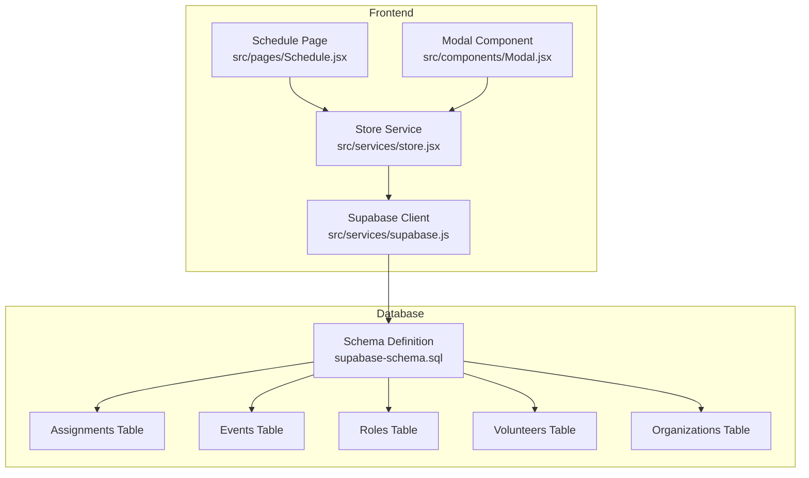
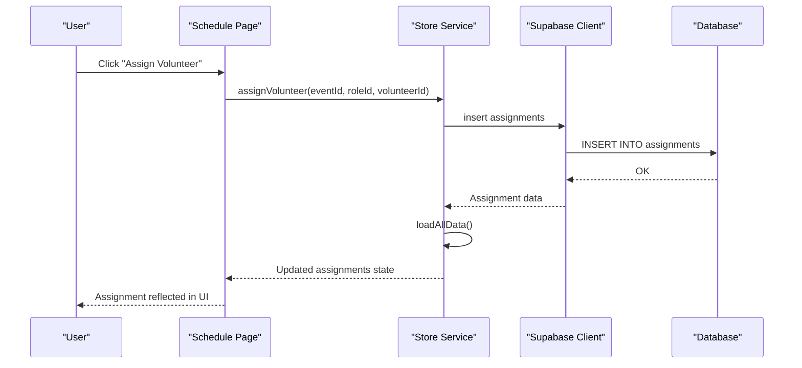
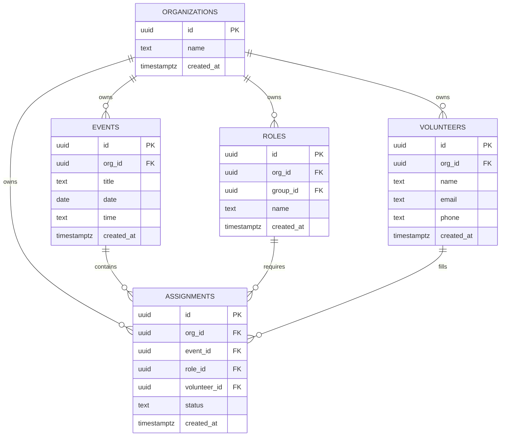
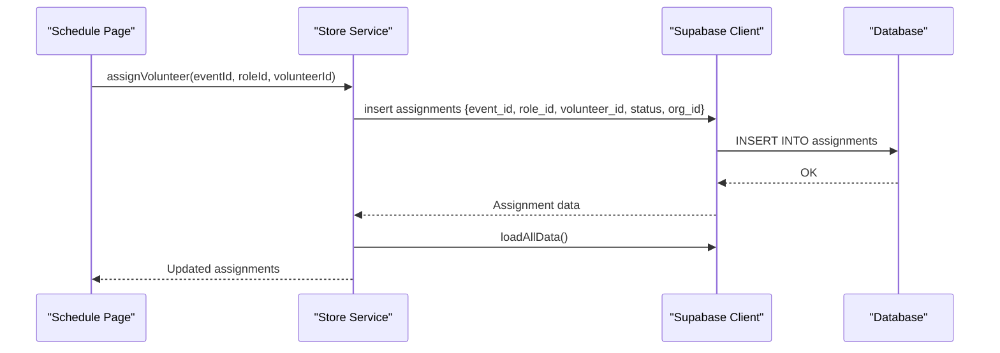
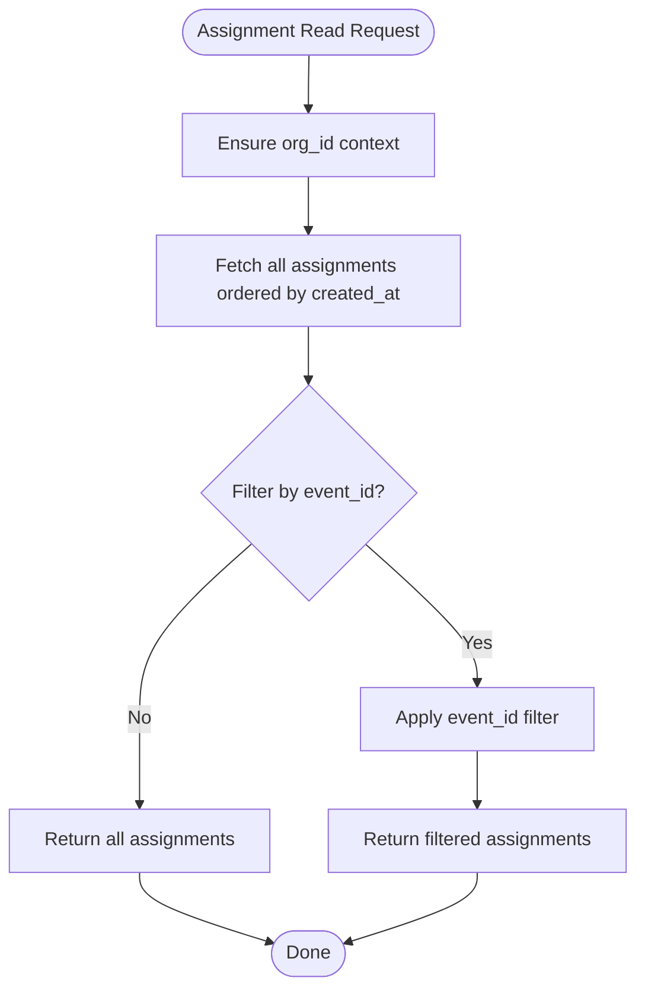
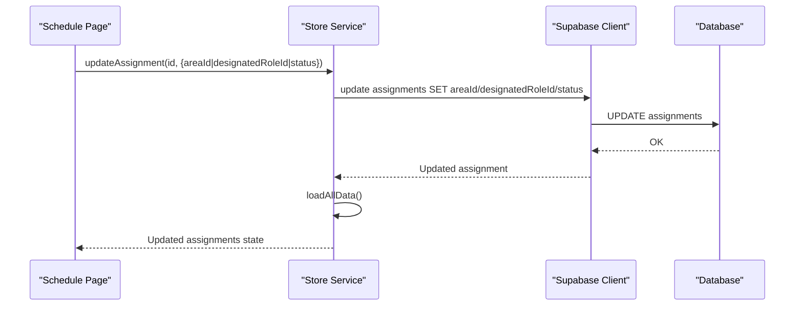
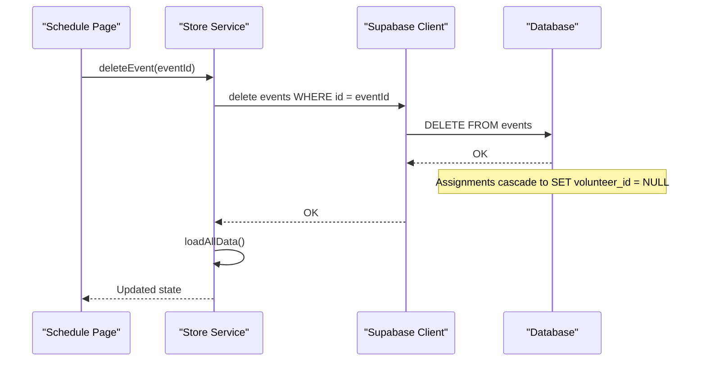
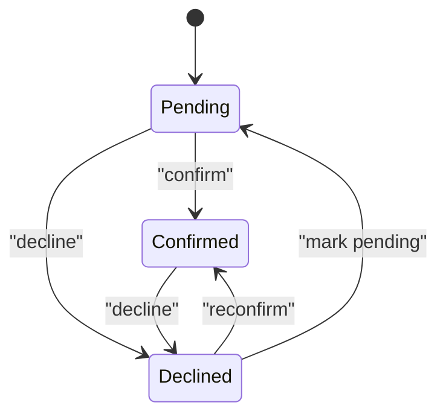
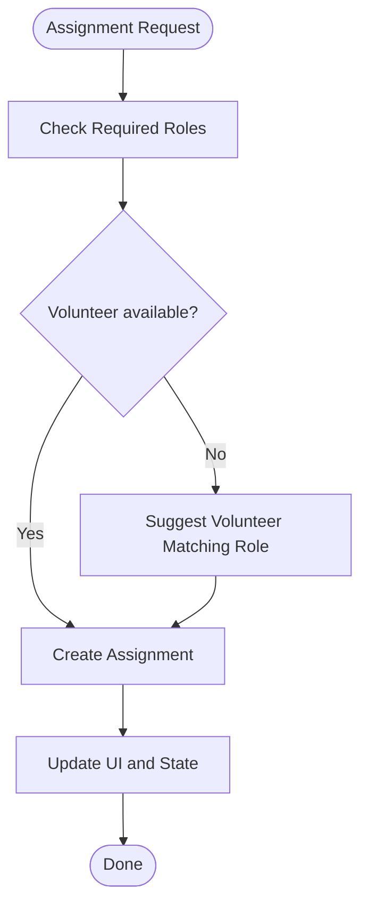
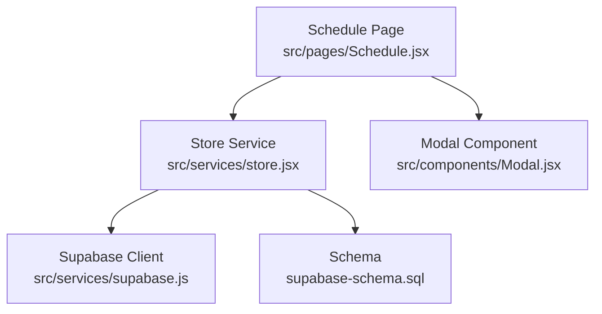

# Assignment CRUD Operations

<cite>
**Referenced Files in This Document**
- [supabase-schema.sql](file://supabase-schema.sql)
- [store.jsx](file://src/services/store.jsx)
- [schedule.jsx](file://src/pages/Schedule.jsx)
- [supabase.js](file://src/services/supabase.js)
- [modal.jsx](file://src/components/Modal.jsx)
</cite>

## Table of Contents
1. [Introduction](#introduction)
2. [Project Structure](#project-structure)
3. [Core Components](#core-components)
4. [Architecture Overview](#architecture-overview)
5. [Detailed Component Analysis](#detailed-component-analysis)
6. [Dependency Analysis](#dependency-analysis)
7. [Performance Considerations](#performance-considerations)
8. [Troubleshooting Guide](#troubleshooting-guide)
9. [Conclusion](#conclusion)

## Introduction
This document provides comprehensive coverage of assignment CRUD operations in RosterFlow, focusing on the assignments table and its relationships with organizations, events, roles, and volunteers. It explains create, read, update, and delete operations, volunteer-role-event relationships, assignment status tracking, conflict resolution, and query patterns for listing, scheduling, and availability checking. It also documents assignment creation with volunteer-role-event matching, assignment updates for status changes, assignment deletion with cascade handling, assignment notifications, status workflows, and assignment history tracking.

## Project Structure
RosterFlow implements assignment management through a frontend store service that integrates with Supabase for persistence. The assignments table is defined in the database schema and accessed via Supabase queries. The Schedule page provides the primary UI for managing assignments, while the store service encapsulates CRUD operations and maintains reactive state.

**Diagram sources**
- [schedule.jsx](file://src/pages/Schedule.jsx#L1-L731)
- [store.jsx](file://src/services/store.jsx#L1-L662)
- [supabase.js](file://src/services/supabase.js#L1-L13)
- [supabase-schema.sql](file://supabase-schema.sql#L67-L76)

**Section sources**
- [schedule.jsx](file://src/pages/Schedule.jsx#L1-L731)
- [store.jsx](file://src/services/store.jsx#L1-L662)
- [supabase.js](file://src/services/supabase.js#L1-L13)
- [supabase-schema.sql](file://supabase-schema.sql#L67-L76)

## Core Components
- Assignments table: central entity linking events, roles, and volunteers with status tracking.
- Store service: manages CRUD operations for assignments and maintains reactive state.
- Schedule page: provides UI for assignment listing, creation, updates, and deletion.
- Supabase client: connects to the backend database and enforces row-level security policies.

Key assignment attributes:
- id: unique identifier
- org_id: organization context for RLS
- event_id: foreign key to events
- role_id: foreign key to roles
- volunteer_id: foreign key to volunteers (nullable)
- status: confirmed, pending, declined
- created_at: audit timestamp

**Section sources**
- [supabase-schema.sql](file://supabase-schema.sql#L67-L76)
- [store.jsx](file://src/services/store.jsx#L419-L471)
- [schedule.jsx](file://src/pages/Schedule.jsx#L27-L49)

## Architecture Overview
The assignment lifecycle flows through the Schedule page, store service, and Supabase. Organization context is enforced via org_id and RLS policies. Assignment updates support areaId and designatedRoleId associations for enhanced scheduling.

**Diagram sources**
- [schedule.jsx](file://src/pages/Schedule.jsx#L37-L49)
- [store.jsx](file://src/services/store.jsx#L419-L452)
- [supabase.js](file://src/services/supabase.js#L1-L13)

**Section sources**
- [schedule.jsx](file://src/pages/Schedule.jsx#L37-L49)
- [store.jsx](file://src/services/store.jsx#L419-L452)
- [supabase.js](file://src/services/supabase.js#L1-L13)

## Detailed Component Analysis

### Assignments Table and Relationships
The assignments table defines the core relationships:
- Organization context: org_id ensures per-organization isolation.
- Event linkage: event_id connects assignments to specific events.
- Role linkage: role_id connects assignments to required roles.
- Volunteer linkage: volunteer_id optionally links to assigned volunteers.
- Status tracking: status supports confirmed, pending, declined states.
- Cascade behavior: volunteer_id uses SET NULL on delete, ensuring historical records remain intact.

**Diagram sources**
- [supabase-schema.sql](file://supabase-schema.sql#L7-L86)
- [supabase-schema.sql](file://supabase-schema.sql#L67-L76)

**Section sources**
- [supabase-schema.sql](file://supabase-schema.sql#L67-L76)

### Assignment Creation (Create)
Assignment creation occurs when a volunteer is assigned to a specific role for an event. The process:
- Validates organization context via org_id.
- Inserts a new assignment with status defaults to confirmed.
- Triggers a reload of all data to reflect the change.

**Diagram sources**
- [schedule.jsx](file://src/pages/Schedule.jsx#L42-L49)
- [store.jsx](file://src/services/store.jsx#L419-L452)

**Section sources**
- [schedule.jsx](file://src/pages/Schedule.jsx#L37-L49)
- [store.jsx](file://src/services/store.jsx#L419-L452)

### Assignment Reading (Read)
Assignment retrieval patterns:
- Listing assignments: fetch all assignments ordered by created_at for audit/history.
- Event-specific listing: filter assignments by event_id for scheduling views.
- Organization-scoped: rely on RLS policies to restrict results to the current user's organization.

**Diagram sources**
- [store.jsx](file://src/services/store.jsx#L137-L166)
- [supabase-schema.sql](file://supabase-schema.sql#L208-L223)

**Section sources**
- [store.jsx](file://src/services/store.jsx#L137-L166)
- [supabase-schema.sql](file://supabase-schema.sql#L208-L223)

### Assignment Updates (Update)
Assignment updates support:
- Status changes: update status to confirmed, pending, or declined.
- Area association: update areaId to link to a group/team.
- Designated role: update designatedRoleId to refine role mapping.
- Cascade handling: volunteer_id uses SET NULL on volunteer deletion, preserving historical context.

**Diagram sources**
- [schedule.jsx](file://src/pages/Schedule.jsx#L438-L461)
- [store.jsx](file://src/services/store.jsx#L454-L471)

**Section sources**
- [schedule.jsx](file://src/pages/Schedule.jsx#L438-L461)
- [store.jsx](file://src/services/store.jsx#L454-L471)

### Assignment Deletion (Delete)
Assignment deletion:
- Removes the assignment record.
- Cascades appropriately: volunteer_id is set to NULL on volunteer deletion; event and role records remain intact for historical reporting.

**Diagram sources**
- [schedule.jsx](file://src/pages/Schedule.jsx#L144-L150)
- [store.jsx](file://src/services/store.jsx#L399-L417)
- [supabase-schema.sql](file://supabase-schema.sql#L71-L73)

**Section sources**
- [schedule.jsx](file://src/pages/Schedule.jsx#L144-L150)
- [store.jsx](file://src/services/store.jsx#L399-L417)
- [supabase-schema.sql](file://supabase-schema.sql#L71-L73)

### Assignment Status Tracking and Workflows
Status tracking supports three states: confirmed, pending, declined. Workflows:
- Initial creation defaults to confirmed.
- Pending indicates tentative assignments awaiting confirmation.
- Declined marks assignments as unavailable.

**Diagram sources**
- [supabase-schema.sql](file://supabase-schema.sql#L74)

**Section sources**
- [supabase-schema.sql](file://supabase-schema.sql#L74)

### Conflict Resolution
Conflict resolution in assignment scheduling:
- Required roles: The Schedule page defines a set of required roles for standard services, enabling progress tracking and conflict detection.
- Volunteer-role matching: Assignments link volunteers to specific roles for events.
- Availability filtering: While the frontend does not implement explicit availability checks, the assignment model supports filtering by event and role to identify conflicts.

**Diagram sources**
- [schedule.jsx](file://src/pages/Schedule.jsx#L34-L49)

**Section sources**
- [schedule.jsx](file://src/pages/Schedule.jsx#L34-L49)

### Query Patterns
Common query patterns for assignments:
- Organization context: Use org_id to scope queries to the current organization.
- Assignment listing: Retrieve all assignments ordered by created_at for audit/history.
- Assignment scheduling: Filter assignments by event_id to display role slots and volunteer assignments.
- Assignment availability: Combine event_id and role_id filters to identify open slots.

These patterns leverage Supabase client methods and RLS policies to ensure secure and efficient data access.

**Section sources**
- [store.jsx](file://src/services/store.jsx#L137-L166)
- [supabase.js](file://src/services/supabase.js#L1-L13)
- [supabase-schema.sql](file://supabase-schema.sql#L208-L223)

### Assignment Notifications and History Tracking
Notifications:
- The Schedule page includes an email composition modal for notifying team members about event assignments.
- Notifications are generated from assignment data for a selected event.

History tracking:
- Assignments are ordered by created_at, enabling chronological tracking of changes.
- RLS policies ensure organization-scoped visibility of historical records.

**Section sources**
- [schedule.jsx](file://src/pages/Schedule.jsx#L62-L95)
- [schedule.jsx](file://src/pages/Schedule.jsx#L193-L216)
- [store.jsx](file://src/services/store.jsx#L137-L166)
- [supabase-schema.sql](file://supabase-schema.sql#L208-L223)

## Dependency Analysis
Assignment operations depend on:
- Supabase client for database connectivity and RLS enforcement.
- Store service for state management and CRUD orchestration.
- Schedule page for user interactions and UI rendering.
- Modal component for focused assignment creation and updates.

**Diagram sources**
- [schedule.jsx](file://src/pages/Schedule.jsx#L1-L731)
- [store.jsx](file://src/services/store.jsx#L1-L662)
- [supabase.js](file://src/services/supabase.js#L1-L13)
- [modal.jsx](file://src/components/Modal.jsx#L1-L50)
- [supabase-schema.sql](file://supabase-schema.sql#L67-L76)

**Section sources**
- [schedule.jsx](file://src/pages/Schedule.jsx#L1-L731)
- [store.jsx](file://src/services/store.jsx#L1-L662)
- [supabase.js](file://src/services/supabase.js#L1-L13)
- [modal.jsx](file://src/components/Modal.jsx#L1-L50)
- [supabase-schema.sql](file://supabase-schema.sql#L67-L76)

## Performance Considerations
- Data fetching: The store loads all data in parallel, which is efficient for moderate datasets but may need pagination for large organizations.
- UI updates: Assignment updates trigger a full reload; consider targeted updates for improved responsiveness.
- RLS overhead: RLS policies ensure security but add minor overhead; optimize queries with appropriate filters.

## Troubleshooting Guide
Common issues and resolutions:
- Missing environment variables: If VITE_SUPABASE_URL or VITE_SUPABASE_ANON_KEY are not set, the app runs in demo mode. Configure environment variables for full functionality.
- Assignment not appearing: Verify org_id context and RLS policies; ensure the user belongs to the correct organization.
- Volunteer deletion behavior: When a volunteer is deleted, their assignments' volunteer_id is set to NULL; confirm historical records remain intact.

**Section sources**
- [supabase.js](file://src/services/supabase.js#L6-L8)
- [store.jsx](file://src/services/store.jsx#L54-L76)
- [supabase-schema.sql](file://supabase-schema.sql#L71-L73)

## Conclusion
RosterFlow provides a robust foundation for assignment management through a well-defined schema, secure RLS policies, and a responsive UI. The assignment CRUD operations support organization-scoped workflows, role-slot management, status tracking, and historical auditing. By leveraging the store service and Supabase client, developers can extend functionality with advanced conflict resolution, availability checks, and notification systems tailored to organizational needs.