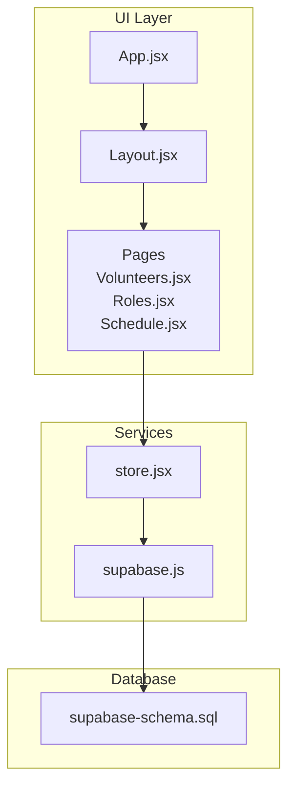
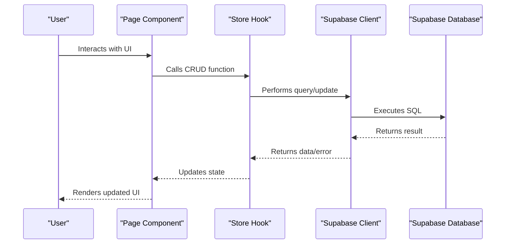
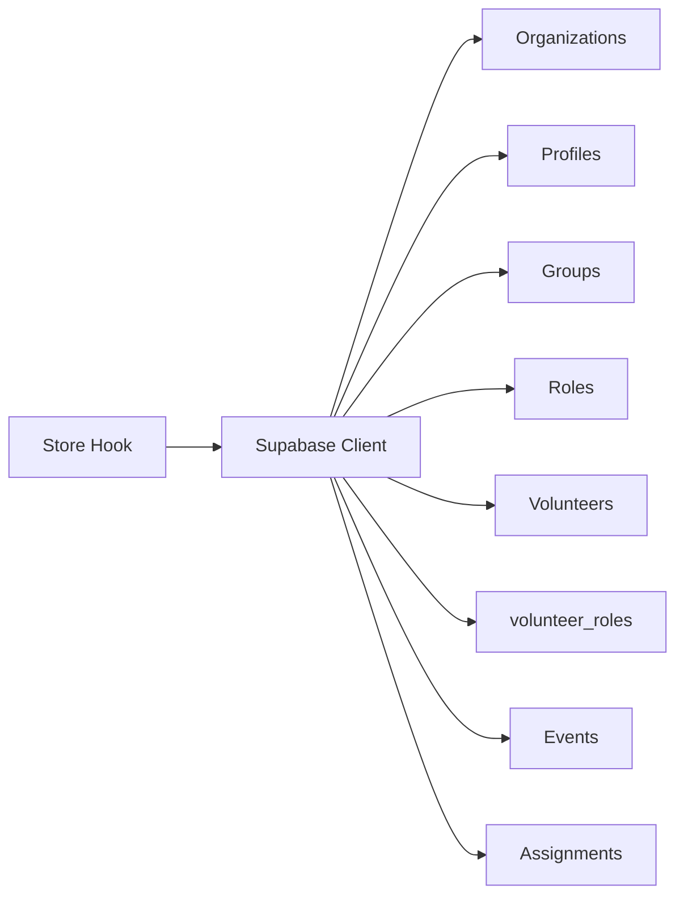

# CRUD Operations

<cite>
**Referenced Files in This Document**
- [supabase-schema.sql](file://supabase-schema.sql)
- [supabase.js](file://src/services/supabase.js)
- [store.jsx](file://src/services/store.jsx)
- [App.jsx](file://src/App.jsx)
- [Layout.jsx](file://src/components/Layout.jsx)
- [Volunteers.jsx](file://src/pages/Volunteers.jsx)
- [Roles.jsx](file://src/pages/Roles.jsx)
- [Schedule.jsx](file://src/pages/Schedule.jsx)
- [Login.jsx](file://src/pages/Login.jsx)
- [Register.jsx](file://src/pages/Register.jsx)
</cite>

## Table of Contents
1. [Introduction](#introduction)
2. [Project Structure](#project-structure)
3. [Core Components](#core-components)
4. [Architecture Overview](#architecture-overview)
5. [Detailed Component Analysis](#detailed-component-analysis)
6. [Dependency Analysis](#dependency-analysis)
7. [Performance Considerations](#performance-considerations)
8. [Troubleshooting Guide](#troubleshooting-guide)
9. [Conclusion](#conclusion)

## Introduction
This document provides comprehensive CRUD operation documentation for all database tables in RosterFlow. It covers create, read, update, and delete operations for organizations, profiles, groups, roles, volunteers, events, and assignments. It explains Supabase JavaScript client integration, how database operations are abstracted through a custom store hook, and how query patterns, filtering, sorting, and pagination are implemented. It also documents complex queries involving joins, aggregations, and organization-scoped filtering, along with error handling, transaction management, and optimistic concurrency control strategies.

## Project Structure
RosterFlow is a React application that integrates with Supabase for authentication and relational data storage. The application is organized around pages that consume a centralized store hook for data and operations. Supabase is configured via environment variables and exposed as a singleton client. The store encapsulates all CRUD operations and maintains local state synchronized with Supabase.

**Diagram sources**
- [App.jsx](file://src/App.jsx#L13-L34)
- [Layout.jsx](file://src/components/Layout.jsx#L14-L107)
- [store.jsx](file://src/services/store.jsx#L1-L556)
- [supabase.js](file://src/services/supabase.js#L1-L13)
- [supabase-schema.sql](file://supabase-schema.sql#L1-L251)

**Section sources**
- [App.jsx](file://src/App.jsx#L1-L37)
- [Layout.jsx](file://src/components/Layout.jsx#L1-L108)
- [store.jsx](file://src/services/store.jsx#L1-L556)
- [supabase.js](file://src/services/supabase.js#L1-L13)
- [supabase-schema.sql](file://supabase-schema.sql#L1-L251)

## Core Components
- Supabase client initialization and environment configuration
- Centralized store providing CRUD operations and derived state
- Page components that render UI and orchestrate user actions
- Authentication flows for login, registration, and logout

Key responsibilities:
- Supabase client: Provides typed database access and auth APIs
- Store: Encapsulates CRUD, data synchronization, and organization scoping
- Pages: Implement UI, form handling, and call store functions

**Section sources**
- [supabase.js](file://src/services/supabase.js#L1-L13)
- [store.jsx](file://src/services/store.jsx#L1-L556)
- [Volunteers.jsx](file://src/pages/Volunteers.jsx#L1-L354)
- [Roles.jsx](file://src/pages/Roles.jsx#L1-L386)
- [Schedule.jsx](file://src/pages/Schedule.jsx#L1-L731)
- [Login.jsx](file://src/pages/Login.jsx#L1-L80)
- [Register.jsx](file://src/pages/Register.jsx#L1-L101)

## Architecture Overview
RosterFlow uses a layered architecture:
- UI layer: Pages and components
- Service layer: Store hook managing state and operations
- Data layer: Supabase client and database schema

**Diagram sources**
- [store.jsx](file://src/services/store.jsx#L109-L166)
- [Volunteers.jsx](file://src/pages/Volunteers.jsx#L45-L66)
- [Roles.jsx](file://src/pages/Roles.jsx#L62-L78)
- [Schedule.jsx](file://src/pages/Schedule.jsx#L158-L177)

## Detailed Component Analysis

### Organizations
- Purpose: Root entity representing an organization
- Primary keys: id (UUID)
- Relationships: profiles, groups, roles, volunteers, events, assignments via org_id
- RLS: Row-level security policies restrict access to current user’s organization

CRUD operations:
- Create: Registration flow inserts an organization and creates a profile for the admin user
- Read: Profile load selects organization data via join
- Update: Not exposed in UI; policy allows updates within organization context
- Delete: Not exposed in UI; policy allows deletion within organization context

Query patterns:
- Join selection: profiles select with organizations
- Organization-scoped filters: org_id equality checks
- Sorting: Not applicable for organizations

Complex queries:
- Join with profiles to fetch organization details for the authenticated user
- Organization-scoped where clause using org_id

Error handling:
- Registration throws errors if auth or insert fails
- Profile fetch logs and handles errors

Optimistic concurrency:
- Not applicable for organizations

**Section sources**
- [supabase-schema.sql](file://supabase-schema.sql#L7-L12)
- [supabase-schema.sql](file://supabase-schema.sql#L109-L120)
- [store.jsx](file://src/services/store.jsx#L219-L242)
- [store.jsx](file://src/services/store.jsx#L109-L123)

### Profiles
- Purpose: Extends Supabase auth.users with organization membership and role
- Primary keys: id (foreign key to auth.users)
- Relationships: belongs to organizations via org_id

CRUD operations:
- Create: During registration, a profile is inserted with role and org_id
- Read: Profile loaded on auth state change; includes organization details
- Update: Only self-profile updates allowed by policy
- Delete: Cascades with auth user

Query patterns:
- Single-row selection by user id
- Join with organizations for display

Complex queries:
- Select with join to fetch organization details alongside profile

Error handling:
- Logs and returns on profile fetch errors

**Section sources**
- [supabase-schema.sql](file://supabase-schema.sql#L14-L21)
- [supabase-schema.sql](file://supabase-schema.sql#L108-L119)
- [store.jsx](file://src/services/store.jsx#L229-L239)
- [store.jsx](file://src/services/store.jsx#L109-L123)

### Groups
- Purpose: Ministry teams or departments
- Primary keys: id (UUID)
- Relationships: roles belong to groups (optional)

CRUD operations:
- Create: addGroup inserts with org_id
- Read: loadAllData orders by name
- Update: updateGroup modifies name
- Delete: deleteGroup removes group; roles referencing are set to NULL

Query patterns:
- Order by name ascending
- Organization-scoped filters

Complex queries:
- Grouped roles display by group name

Error handling:
- Logs and rethrows errors during updates/deletes

**Section sources**
- [supabase-schema.sql](file://supabase-schema.sql#L23-L29)
- [supabase-schema.sql](file://supabase-schema.sql#L121-L136)
- [store.jsx](file://src/services/store.jsx#L462-L506)
- [store.jsx](file://src/services/store.jsx#L137-L139)
- [Roles.jsx](file://src/pages/Roles.jsx#L28-L41)

### Roles
- Purpose: Specific positions within groups
- Primary keys: id (UUID)
- Relationships: assignments link roles to volunteers for events

CRUD operations:
- Create: addRole inserts with org_id and optional group_id
- Read: loadAllData orders by name
- Update: updateRole modifies name and group_id
- Delete: deleteRole removes role; assignments referencing are set to NULL

Query patterns:
- Order by name ascending
- Organization-scoped filters
- Grouping roles by group for UI

Complex queries:
- Grouped roles display by group name
- Filtering by group name during search

Error handling:
- Logs and rethrows errors during updates/deletes

**Section sources**
- [supabase-schema.sql](file://supabase-schema.sql#L31-L38)
- [supabase-schema.sql](file://supabase-schema.sql#L138-L153)
- [store.jsx](file://src/services/store.jsx#L414-L459)
- [store.jsx](file://src/services/store.jsx#L139-L139)
- [Roles.jsx](file://src/pages/Roles.jsx#L23-L41)

### Volunteers
- Purpose: Individuals who can be assigned to roles for events
- Primary keys: id (UUID)
- Relationships: volunteer_roles junction table links volunteers to roles

CRUD operations:
- Create: addVolunteer inserts volunteer and sets org_id; then inserts volunteer_roles entries
- Read: loadAllData selects volunteers with embedded role ids via volunteer_roles join
- Update: updateVolunteer updates attributes; replaces volunteer_roles if roles array provided
- Delete: deleteVolunteer removes volunteer and cascades to assignments

Query patterns:
- Join with volunteer_roles to expose roles as an array of role ids
- Order by name ascending

Complex queries:
- Volunteer-role join to support multi-select role assignment
- CSV import parsing and batch insert

Error handling:
- Logs and rethrows errors during inserts/updates/deletes
- CSV import validates headers and basic fields

**Section sources**
- [supabase-schema.sql](file://supabase-schema.sql#L40-L48)
- [supabase-schema.sql](file://supabase-schema.sql#L50-L55)
- [supabase-schema.sql](file://supabase-schema.sql#L155-L170)
- [store.jsx](file://src/services/store.jsx#L246-L326)
- [store.jsx](file://src/services/store.jsx#L140-L140)
- [Volunteers.jsx](file://src/pages/Volunteers.jsx#L77-L121)

### Events
- Purpose: Scheduled services or events
- Primary keys: id (UUID)
- Relationships: assignments link events to roles and volunteers

CRUD operations:
- Create: addEvent inserts with org_id
- Read: loadAllData orders by date descending
- Update: updateEvent modifies title/date/time
- Delete: deleteEvent removes event and cascades to assignments

Query patterns:
- Order by date descending
- Organization-scoped filters

Complex queries:
- Event expansion to show assignments and progress indicators

Error handling:
- Logs and rethrows errors during updates/deletes

**Section sources**
- [supabase-schema.sql](file://supabase-schema.sql#L57-L65)
- [supabase-schema.sql](file://supabase-schema.sql#L191-L206)
- [store.jsx](file://src/services/store.jsx#L328-L376)
- [store.jsx](file://src/services/store.jsx#L141-L141)
- [Schedule.jsx](file://src/pages/Schedule.jsx#L27-L29)

### Assignments
- Purpose: Links volunteers to roles for specific events
- Primary keys: id (UUID)
- Relationships: references events, roles, and volunteers

CRUD operations:
- Create: assignVolunteer inserts with org_id, status defaults to confirmed
- Read: loadAllData orders by created_at descending
- Update: updateAssignment modifies areaId and designatedRoleId
- Delete: Not exposed in UI; policy allows deletion within organization context

Query patterns:
- Order by created_at descending
- Organization-scoped filters

Complex queries:
- Assignment aggregation by event to compute progress
- Email composition using assignments and related entities

Error handling:
- Logs and rethrows errors during updates

**Section sources**
- [supabase-schema.sql](file://supabase-schema.sql#L67-L76)
- [supabase-schema.sql](file://supabase-schema.sql#L208-L223)
- [store.jsx](file://src/services/store.jsx#L378-L412)
- [store.jsx](file://src/services/store.jsx#L142-L142)
- [Schedule.jsx](file://src/pages/Schedule.jsx#L42-L49)

### Query Builders, Where Clauses, Order By, Limit/Offset
- Where clauses: eq(id), eq(org_id), eq(volunteer_id), eq(event_id), eq(role_id)
- Order by: order(name), order(date, { ascending: false }), order(created_at, { ascending: false })
- Limit/offset: Not used; relies on client-side filtering and ordering
- Joins: select('*, organizations(*)'), select('*, volunteer_roles(role_id)')
- Aggregations: computed in UI (e.g., progress percentage)

Examples of query patterns:
- Single row by id: select('*').eq('id', id).single()
- Organization-scoped reads: select('*').eq('org_id', orgId).order(...)
- Join reads: select('*, volunteer_roles(role_id)').order('name')

Pagination strategies:
- Not implemented server-side; client-side filtering and virtualization could be considered

**Section sources**
- [store.jsx](file://src/services/store.jsx#L110-L123)
- [store.jsx](file://src/services/store.jsx#L137-L166)
- [store.jsx](file://src/services/store.jsx#L251-L258)
- [store.jsx](file://src/services/store.jsx#L332-L339)
- [store.jsx](file://src/services/store.jsx#L382-L390)

### Supabase JavaScript Client Integration
- Initialization: createClient with VITE_SUPABASE_URL and VITE_SUPABASE_ANON_KEY
- Environment validation: warns if variables are missing
- Singleton export: shared client instance across the app

Integration points:
- Auth: getSession, onAuthStateChange, signInWithPassword, signOut, signUp
- Database: from(table).select(...).eq(...).order(...).insert(...).update(...).delete()

**Section sources**
- [supabase.js](file://src/services/supabase.js#L1-L13)
- [store.jsx](file://src/services/store.jsx#L55-L76)
- [store.jsx](file://src/services/store.jsx#L169-L196)
- [store.jsx](file://src/services/store.jsx#L211-L242)

### Authentication and Authorization
- Login: signInWithPassword; redirects to dashboard on success
- Registration: signUp; creates user, organization, and profile; loads profile
- Logout: signOut; clears local state
- RLS: Policies enforce organization-scoped access for all tables

**Section sources**
- [Login.jsx](file://src/pages/Login.jsx#L14-L25)
- [Register.jsx](file://src/pages/Register.jsx#L16-L27)
- [store.jsx](file://src/services/store.jsx#L169-L196)
- [store.jsx](file://src/services/store.jsx#L198-L243)
- [supabase-schema.sql](file://supabase-schema.sql#L78-L224)

### Error Handling and Transaction Management
- Error handling: Errors are logged and rethrown; UI surfaces messages via alerts
- Transactions: Supabase client does not expose explicit transaction APIs; operations are executed individually
- Optimistic concurrency: Not implemented; conflicts are handled by logging and rethrowing errors

Recommendations:
- Wrap multi-step operations (e.g., volunteer insert + volunteer_roles insert) in a single transaction if supported by backend
- Implement retry logic for transient failures
- Consider optimistic UI updates with rollback on error

**Section sources**
- [store.jsx](file://src/services/store.jsx#L260-L263)
- [store.jsx](file://src/services/store.jsx#L288-L291)
- [store.jsx](file://src/services/store.jsx#L341-L344)
- [store.jsx](file://src/services/store.jsx#L406-L409)

## Dependency Analysis
The store depends on the Supabase client and orchestrates CRUD operations across all tables. Pages depend on the store for data and actions. Authentication state drives data loading and UI routing.

**Diagram sources**
- [store.jsx](file://src/services/store.jsx#L1-L556)
- [supabase-schema.sql](file://supabase-schema.sql#L7-L76)

**Section sources**
- [store.jsx](file://src/services/store.jsx#L1-L556)
- [supabase-schema.sql](file://supabase-schema.sql#L7-L76)

## Performance Considerations
- Client-side filtering: Pages filter lists locally; consider server-side filtering for large datasets
- Parallel loads: loadAllData uses Promise.all to fetch multiple tables concurrently
- Ordering: Prefer ordering on indexed columns (e.g., date, created_at) to improve UI responsiveness
- Virtualization: For large lists, implement virtualized rendering to reduce DOM overhead
- Debounced search: Apply debounced input for search fields to minimize frequent queries

[No sources needed since this section provides general guidance]

## Troubleshooting Guide
Common issues and resolutions:
- Missing environment variables: Ensure VITE_SUPABASE_URL and VITE_SUPABASE_ANON_KEY are set; the app warns if missing
- Authentication failures: Verify credentials; check network connectivity and Supabase status
- Data not loading: Confirm organization is created and profile is inserted; verify RLS policies
- CSV import errors: Ensure CSV contains required headers (Name, Email); validate entries before import
- Update/delete errors: Check organization context; ensure org_id matches current user’s organization

**Section sources**
- [supabase.js](file://src/services/supabase.js#L6-L8)
- [store.jsx](file://src/services/store.jsx#L169-L196)
- [store.jsx](file://src/services/store.jsx#L198-L243)
- [Volunteers.jsx](file://src/pages/Volunteers.jsx#L77-L121)

## Conclusion
RosterFlow implements robust CRUD operations across organizations, profiles, groups, roles, volunteers, events, and assignments using Supabase. The store abstracts database interactions and enforces organization-scoped access via RLS. While server-side pagination is not implemented, the application leverages client-side filtering and parallel data loading for responsive UI. Error handling is centralized, and the architecture supports future enhancements such as transactions, optimistic concurrency, and advanced query patterns.