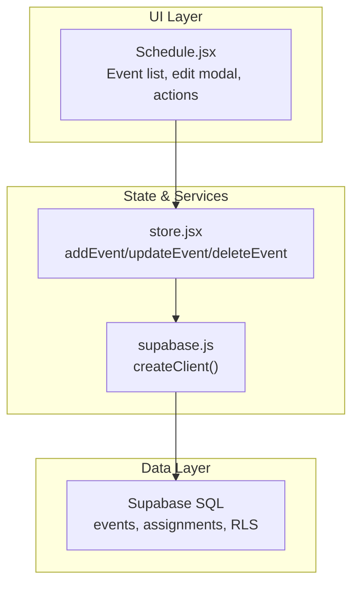
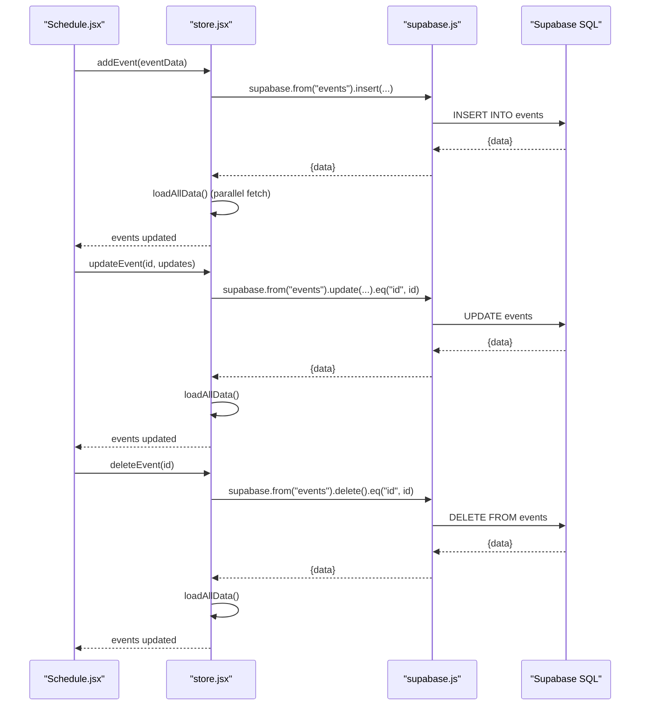
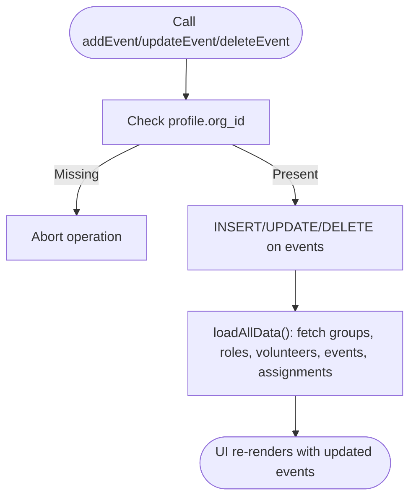
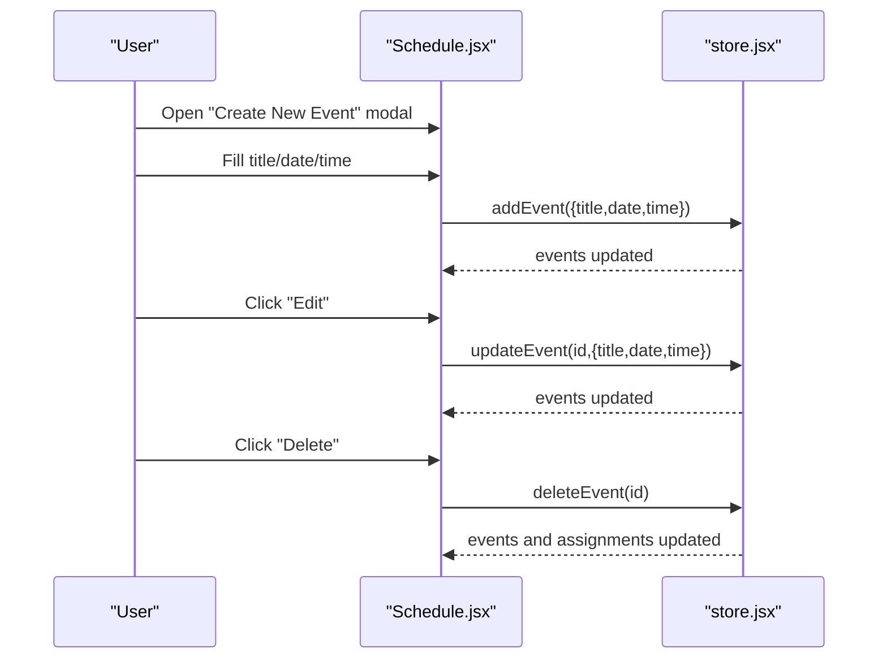
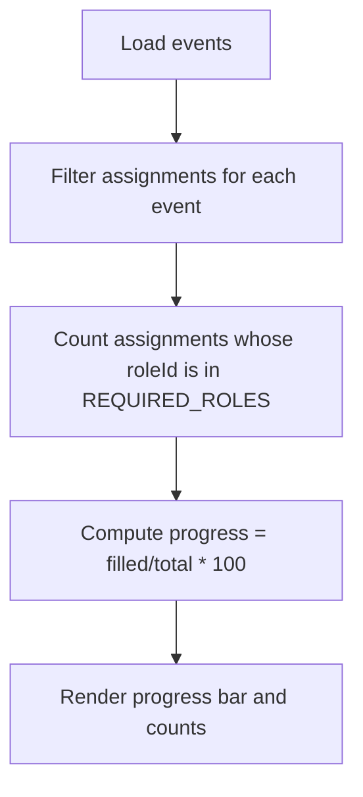
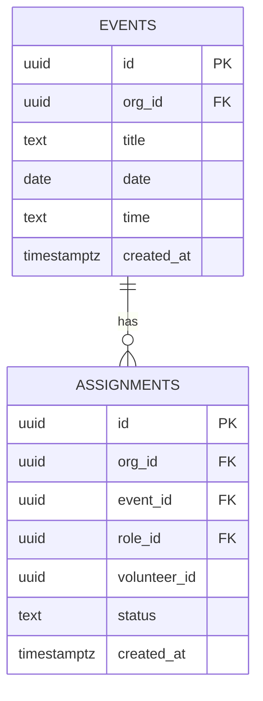
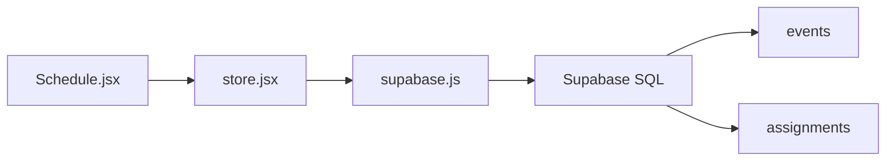

# Event CRUD Operations

<cite>
**Referenced Files in This Document**
- [supabase-schema.sql](file://supabase-schema.sql)
- [supabase.js](file://src/services/supabase.js)
- [store.jsx](file://src/services/store.jsx)
- [Schedule.jsx](file://src/pages/Schedule.jsx)
- [App.jsx](file://src/App.jsx)
</cite>

## Table of Contents
1. [Introduction](#introduction)
2. [Project Structure](#project-structure)
3. [Core Components](#core-components)
4. [Architecture Overview](#architecture-overview)
5. [Detailed Component Analysis](#detailed-component-analysis)
6. [Dependency Analysis](#dependency-analysis)
7. [Performance Considerations](#performance-considerations)
8. [Troubleshooting Guide](#troubleshooting-guide)
9. [Conclusion](#conclusion)

## Introduction
This document explains event CRUD operations in RosterFlow, focusing on the events table and related workflows. It covers create, read, update, and delete operations, scheduling and date/time handling, capacity tracking via assignments, and query patterns for listing, calendar views, and availability checks. It also documents role requirements for events, schedule change updates, and deletion with assignment cleanup. Examples include organization-scoped queries, date-range filtering, and role assignment lookups. Additional topics include recurrence patterns, timezone handling, and event status management.

## Project Structure
RosterFlow is a React application with a centralized store that integrates with Supabase for persistence. The event domain spans:
- Database schema for events and assignments
- Supabase client initialization
- Store module implementing CRUD and derived logic
- UI page for schedule management and event editing/modals

**Diagram sources**
- [Schedule.jsx](file://src/pages/Schedule.jsx#L1-L731)
- [store.jsx](file://src/services/store.jsx#L1-L662)
- [supabase.js](file://src/services/supabase.js#L1-L13)
- [supabase-schema.sql](file://supabase-schema.sql#L57-L76)

**Section sources**
- [App.jsx](file://src/App.jsx#L1-L37)
- [store.jsx](file://src/services/store.jsx#L1-L662)
- [supabase.js](file://src/services/supabase.js#L1-L13)
- [supabase-schema.sql](file://supabase-schema.sql#L57-L76)

## Core Components
- Events table: stores event metadata (title, date, time) scoped to an organization via org_id.
- Assignments table: links events to roles and volunteers, with status tracking.
- Store event CRUD: addEvent, updateEvent, deleteEvent integrate with Supabase and refresh derived data.
- Schedule page: renders events, supports editing and deletion, and computes capacity based on required roles.

Key implementation references:
- Events table definition and RLS policies
- Store event CRUD functions
- Schedule page form submission and modal handling

**Section sources**
- [supabase-schema.sql](file://supabase-schema.sql#L57-L76)
- [store.jsx](file://src/services/store.jsx#L348-L417)
- [Schedule.jsx](file://src/pages/Schedule.jsx#L158-L177)

## Architecture Overview
The event lifecycle flows from UI to store to Supabase and back to UI via reactive state updates.

**Diagram sources**
- [Schedule.jsx](file://src/pages/Schedule.jsx#L158-L177)
- [store.jsx](file://src/services/store.jsx#L348-L417)
- [supabase.js](file://src/services/supabase.js#L1-L13)

## Detailed Component Analysis

### Events Table and RLS
- Events table includes org_id foreign key, ensuring per-organization isolation.
- Row-level security policies restrict select/update/delete to records within the authenticated user’s organization.
- Triggers and helper functions assist org_id propagation during inserts.

Operational implications:
- All queries should be organization-scoped.
- Deletions cascade to assignments due to foreign key constraints.

**Section sources**
- [supabase-schema.sql](file://supabase-schema.sql#L57-L65)
- [supabase-schema.sql](file://supabase-schema.sql#L191-L206)
- [supabase-schema.sql](file://supabase-schema.sql#L225-L250)

### Event CRUD in Store
- addEvent: Inserts event with org_id and refreshes data.
- updateEvent: Updates event fields and refreshes data.
- deleteEvent: Deletes event and cascades to assignments; refreshes data.

**Diagram sources**
- [store.jsx](file://src/services/store.jsx#L348-L417)
- [store.jsx](file://src/services/store.jsx#L133-L166)

**Section sources**
- [store.jsx](file://src/services/store.jsx#L348-L417)

### Schedule Page: Event Editing and Deletion
- Event creation/editing modal captures title, date, and time.
- On submit, the page invokes addEvent or updateEvent via the store.
- Deletion triggers a confirmation and calls deleteEvent, which removes the event and cleans up related assignments.

**Diagram sources**
- [Schedule.jsx](file://src/pages/Schedule.jsx#L158-L177)
- [store.jsx](file://src/services/store.jsx#L348-L417)

**Section sources**
- [Schedule.jsx](file://src/pages/Schedule.jsx#L158-L177)

### Capacity Tracking and Required Roles
- The schedule view computes capacity by counting confirmed assignments for a predefined set of required roles.
- Progress percentage reflects how many required slots are filled.

**Diagram sources**
- [Schedule.jsx](file://src/pages/Schedule.jsx#L327-L332)

**Section sources**
- [Schedule.jsx](file://src/pages/Schedule.jsx#L327-L332)

### Query Patterns and Organization Context
Common Supabase query patterns used by the store and enforced by RLS:
- Fetch all events ordered by date descending for the schedule view.
- Fetch assignments ordered by created_at descending for recent activity.
- Organization-scoped filters via org_id and RLS policies.

**Diagram sources**
- [supabase-schema.sql](file://supabase-schema.sql#L57-L76)

**Section sources**
- [store.jsx](file://src/services/store.jsx#L137-L142)
- [supabase-schema.sql](file://supabase-schema.sql#L191-L206)

### Event Scheduling, Date/Time Management, and Availability
- Date and time are stored separately as DATE and TEXT fields. The UI uses HTML date and time inputs.
- The schedule page displays localized date strings and renders time values.
- Availability checks rely on assignment presence for required roles; the UI highlights unfilled slots.

Recommendations:
- Normalize time storage to include timezone-aware timestamps for accurate cross-timezone scheduling.
- Implement recurring event modeling (e.g., series table) and expansion logic for calendar views.

**Section sources**
- [supabase-schema.sql](file://supabase-schema.sql#L62-L63)
- [Schedule.jsx](file://src/pages/Schedule.jsx#L357-L370)
- [Schedule.jsx](file://src/pages/Schedule.jsx#L327-L332)

### Event Status Management
- Assignments include a status field with allowed values: confirmed, pending, declined.
- The store creates assignments with a default status of confirmed.
- The UI allows updating assignment attributes (areaId, designatedRoleId) but does not expose status toggles in the shown code.

**Section sources**
- [supabase-schema.sql](file://supabase-schema.sql#L74-L75)
- [store.jsx](file://src/services/store.jsx#L420-L452)
- [Schedule.jsx](file://src/pages/Schedule.jsx#L440-L460)

### Recurrence Patterns and Timezone Handling
- Current schema and UI do not model recurring events or timezone-aware timestamps.
- To support recurrences, introduce a recurrence pattern table and expand occurrences for calendar views.
- For timezone handling, store timestamps with timezone offset or UTC and render localized times in the UI.

[No sources needed since this section provides general guidance]

### Examples: Queries and Workflows
- Organization-scoped event listing:
  - Select events ordered by date descending, scoped to org_id via RLS.
- Date range filtering:
  - Extend the events select with range conditions on date.
- Role assignment lookups:
  - Join assignments with roles and volunteers to display role names and volunteer details.

**Section sources**
- [store.jsx](file://src/services/store.jsx#L137-L142)
- [supabase-schema.sql](file://supabase-schema.sql#L191-L206)

## Dependency Analysis
- Schedule.jsx depends on store hooks for events, assignments, roles, volunteers, and CRUD functions.
- store.jsx depends on supabase.js for database operations and on RLS policies for access control.
- supabase.js depends on environment variables for Supabase URL and anon key.

**Diagram sources**
- [Schedule.jsx](file://src/pages/Schedule.jsx#L7-L8)
- [store.jsx](file://src/services/store.jsx#L1-L662)
- [supabase.js](file://src/services/supabase.js#L1-L13)
- [supabase-schema.sql](file://supabase-schema.sql#L57-L76)

**Section sources**
- [Schedule.jsx](file://src/pages/Schedule.jsx#L7-L8)
- [store.jsx](file://src/services/store.jsx#L1-L662)
- [supabase.js](file://src/services/supabase.js#L1-L13)

## Performance Considerations
- Parallel data loading: The store fetches groups, roles, volunteers, events, and assignments concurrently to reduce latency.
- UI sorting: Sorting events by date in memory is efficient for small to medium datasets; consider server-side ordering and pagination for larger datasets.
- Re-rendering: Keep event lists optimized; avoid unnecessary re-computations when props change.

[No sources needed since this section provides general guidance]

## Troubleshooting Guide
- Environment variables missing:
  - If VITE_SUPABASE_URL or VITE_SUPABASE_ANON_KEY are not set, the app runs in demo mode and does not connect to Supabase.
- RLS policy violations:
  - Ensure the authenticated user belongs to the same organization as the event data; otherwise, reads/writes will be blocked by RLS.
- Deletion side effects:
  - Deleting an event removes related assignments due to foreign key cascade; confirm this behavior before bulk deletions.

**Section sources**
- [supabase.js](file://src/services/supabase.js#L6-L8)
- [store.jsx](file://src/services/store.jsx#L39-L37)
- [supabase-schema.sql](file://supabase-schema.sql#L191-L206)

## Conclusion
RosterFlow implements robust event CRUD through a clean separation of concerns: UI-driven forms, a centralized store managing Supabase interactions, and strong organization-scoped RLS policies. While the current schema and UI support basic scheduling and capacity tracking, extending support for recurring events and timezone-aware timestamps would improve scheduling accuracy and usability. The provided query patterns and architectural insights enable safe, scalable enhancements aligned with the existing codebase.