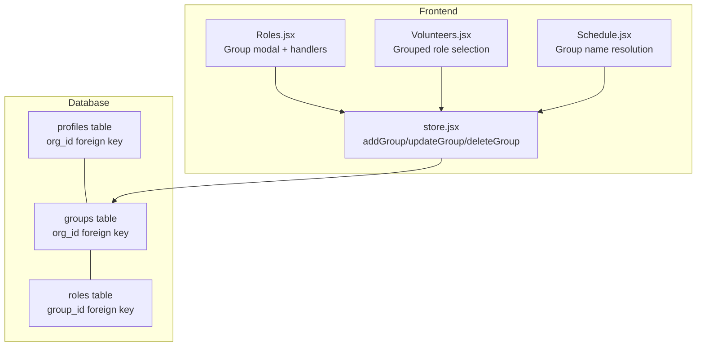
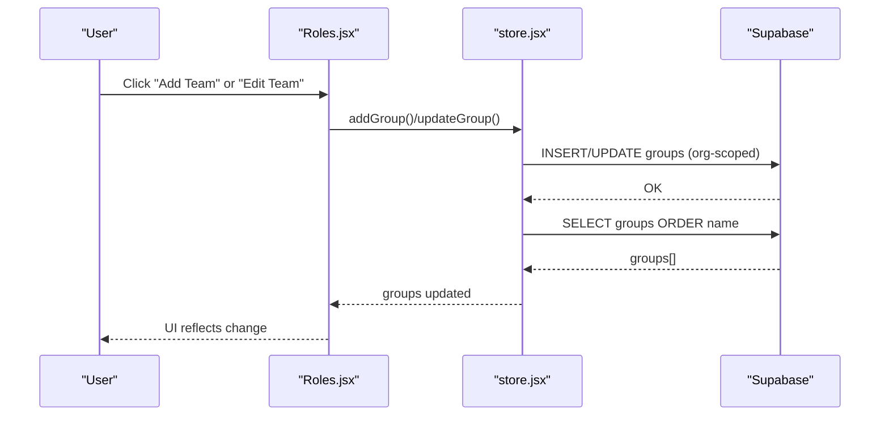
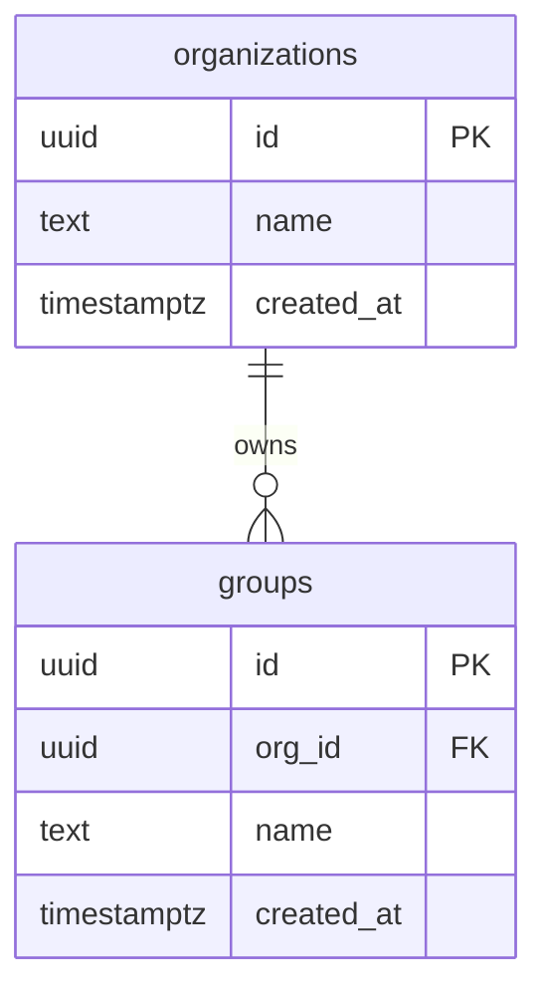
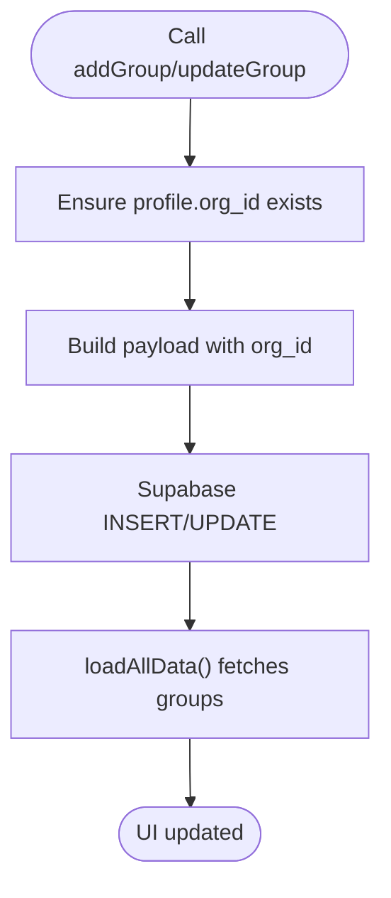
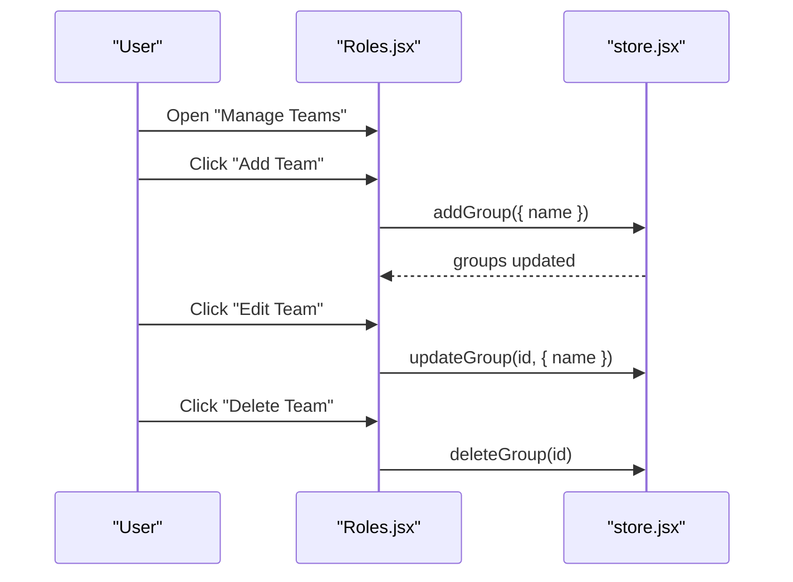
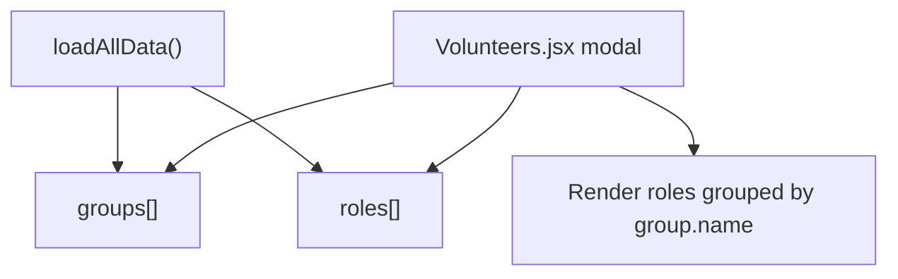
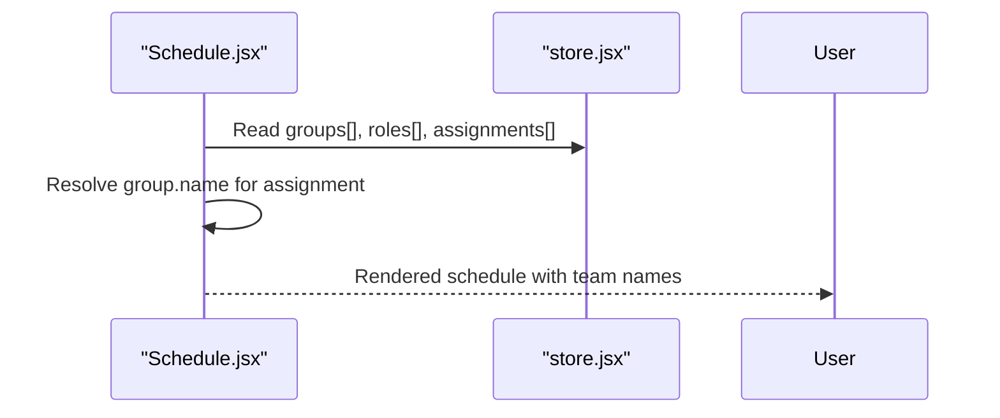
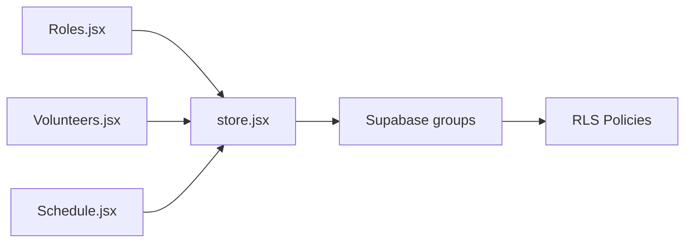

# Group CRUD Operations

<cite>
**Referenced Files in This Document**
- [supabase-schema.sql](file://supabase-schema.sql)
- [store.jsx](file://src/services/store.jsx)
- [Roles.jsx](file://src/pages/Roles.jsx)
- [Volunteers.jsx](file://src/pages/Volunteers.jsx)
- [Schedule.jsx](file://src/pages/Schedule.jsx)
</cite>

## Table of Contents
1. [Introduction](#introduction)
2. [Project Structure](#project-structure)
3. [Core Components](#core-components)
4. [Architecture Overview](#architecture-overview)
5. [Detailed Component Analysis](#detailed-component-analysis)
6. [Dependency Analysis](#dependency-analysis)
7. [Performance Considerations](#performance-considerations)
8. [Troubleshooting Guide](#troubleshooting-guide)
9. [Conclusion](#conclusion)

## Introduction
This document explains how group CRUD operations are implemented in RosterFlow. It covers create, read, update, and delete operations for the groups table, how groups relate to roles and volunteers, and how organization-scoped access control is enforced. It also documents query patterns for listing groups, grouping roles by teams, and filtering by organization context. Finally, it outlines visibility and access control patterns via Row Level Security (RLS) policies.

## Project Structure
RosterFlow organizes group management across:
- Database schema: groups table with organization scoping and RLS policies
- Frontend store: centralized state and group CRUD actions
- Pages:
  - Roles page: manage teams and roles, including group creation/edit/delete
  - Volunteers page: display roles grouped by teams during volunteer management
  - Schedule page: resolve group names for schedule rendering

**Diagram sources**
- [supabase-schema.sql](file://supabase-schema.sql#L23-L29)
- [store.jsx](file://src/services/store.jsx#L540-L605)
- [Roles.jsx](file://src/pages/Roles.jsx#L80-L111)
- [Volunteers.jsx](file://src/pages/Volunteers.jsx#L288-L331)
- [Schedule.jsx](file://src/pages/Schedule.jsx#L265-L284)

**Section sources**
- [supabase-schema.sql](file://supabase-schema.sql#L23-L29)
- [store.jsx](file://src/services/store.jsx#L540-L605)
- [Roles.jsx](file://src/pages/Roles.jsx#L80-L111)
- [Volunteers.jsx](file://src/pages/Volunteers.jsx#L288-L331)
- [Schedule.jsx](file://src/pages/Schedule.jsx#L265-L284)

## Core Components
- Groups table: stores teams with organization scoping and timestamps.
- Store actions: addGroup, updateGroup, deleteGroup wrap Supabase queries and refresh data.
- Roles page: exposes UI to create, edit, and delete groups; triggers store actions.
- Volunteers page: renders roles grouped by team during volunteer creation/edit.
- Access control: RLS policies restrict groups to the current user’s organization.

Key implementation references:
- Groups table definition and RLS policies
- Group CRUD actions in the store
- Group management UI handlers

**Section sources**
- [supabase-schema.sql](file://supabase-schema.sql#L23-L29)
- [supabase-schema.sql](file://supabase-schema.sql#L121-L136)
- [store.jsx](file://src/services/store.jsx#L540-L605)
- [Roles.jsx](file://src/pages/Roles.jsx#L80-L111)

## Architecture Overview
Group CRUD follows a straightforward flow:
- UI triggers handlers in Roles.jsx
- Handlers call store actions (addGroup/updateGroup/deleteGroup)
- Store performs Supabase inserts/updates/deletes scoped to the current organization
- Store reloads data to reflect changes

**Diagram sources**
- [Roles.jsx](file://src/pages/Roles.jsx#L100-L111)
- [store.jsx](file://src/services/store.jsx#L540-L605)
- [store.jsx](file://src/services/store.jsx#L137-L146)

## Detailed Component Analysis

### Groups Table and Organization Scoping
- The groups table includes an organization foreign key and is protected by RLS policies.
- A helper function and triggers assist in setting org_id on insert for groups and other entities.

**Diagram sources**
- [supabase-schema.sql](file://supabase-schema.sql#L7-L12)
- [supabase-schema.sql](file://supabase-schema.sql#L23-L29)
- [supabase-schema.sql](file://supabase-schema.sql#L225-L250)

**Section sources**
- [supabase-schema.sql](file://supabase-schema.sql#L23-L29)
- [supabase-schema.sql](file://supabase-schema.sql#L225-L250)

### Group CRUD Implementation in Store
- addGroup: inserts a new group with org_id derived from the current profile.
- updateGroup: updates an existing group by ID.
- deleteGroup: deletes a group by ID; downstream cascading depends on server-side constraints.

**Diagram sources**
- [store.jsx](file://src/services/store.jsx#L540-L605)
- [store.jsx](file://src/services/store.jsx#L133-L166)

**Section sources**
- [store.jsx](file://src/services/store.jsx#L540-L605)
- [store.jsx](file://src/services/store.jsx#L133-L166)

### Group Management UI (Roles Page)
- The “Manage Teams” modal lists groups and supports add/edit/delete.
- Handlers call store actions and confirm destructive operations.

**Diagram sources**
- [Roles.jsx](file://src/pages/Roles.jsx#L80-L111)
- [store.jsx](file://src/services/store.jsx#L540-L605)

**Section sources**
- [Roles.jsx](file://src/pages/Roles.jsx#L80-L111)

### Grouped Role Display (Volunteers Page)
- During volunteer creation/edit, roles are grouped by team in the modal.
- This relies on the groups and roles arrays from the store.

**Diagram sources**
- [store.jsx](file://src/services/store.jsx#L133-L166)
- [Volunteers.jsx](file://src/pages/Volunteers.jsx#L288-L331)

**Section sources**
- [store.jsx](file://src/services/store.jsx#L133-L166)
- [Volunteers.jsx](file://src/pages/Volunteers.jsx#L288-L331)

### Schedule Rendering and Group Visibility
- Schedule rendering resolves group names for display alongside roles and volunteers.
- This demonstrates how group metadata is used for visibility in views.

**Diagram sources**
- [Schedule.jsx](file://src/pages/Schedule.jsx#L265-L284)
- [store.jsx](file://src/services/store.jsx#L133-L166)

**Section sources**
- [Schedule.jsx](file://src/pages/Schedule.jsx#L265-L284)

## Dependency Analysis
- Roles.jsx depends on store hooks for groups and group actions.
- Volunteers.jsx depends on groups and roles for role grouping.
- Store depends on Supabase client and the current profile’s org_id.
- Database enforces organization scoping and RLS policies for groups.

**Diagram sources**
- [Roles.jsx](file://src/pages/Roles.jsx#L6-L7)
- [Volunteers.jsx](file://src/pages/Volunteers.jsx#L7-L8)
- [store.jsx](file://src/services/store.jsx#L1-L2)
- [supabase-schema.sql](file://supabase-schema.sql#L121-L136)

**Section sources**
- [Roles.jsx](file://src/pages/Roles.jsx#L6-L7)
- [Volunteers.jsx](file://src/pages/Volunteers.jsx#L7-L8)
- [store.jsx](file://src/services/store.jsx#L1-L2)
- [supabase-schema.sql](file://supabase-schema.sql#L121-L136)

## Performance Considerations
- Group listing uses a single ordered query per load; keep the number of groups reasonable for UI responsiveness.
- Cascading deletes for groups are handled server-side; ensure appropriate constraints are defined to avoid orphaned records.
- Parallel data loading (used for groups, roles, volunteers, events, assignments) minimizes latency on initial load.

[No sources needed since this section provides general guidance]

## Troubleshooting Guide
Common issues and resolutions:
- Permission denied when creating/updating/deleting groups
  - Cause: Current user’s org_id mismatch or missing RLS policy enforcement.
  - Resolution: Verify the user profile and org_id are loaded; ensure RLS policies are enabled for groups.
  - References:
    - [supabase-schema.sql](file://supabase-schema.sql#L121-L136)
    - [store.jsx](file://src/services/store.jsx#L540-L605)
- Group not visible after creation
  - Cause: Data refresh did not occur or organization mismatch.
  - Resolution: Confirm loadAllData runs after write operations and profile.org_id is set.
  - References:
    - [store.jsx](file://src/services/store.jsx#L540-L605)
    - [store.jsx](file://src/services/store.jsx#L133-L166)
- Deleting a group leaves orphaned roles
  - Behavior: Roles retain groupId; UI groups orphaned roles under “Other”.
  - Resolution: Update roles to remove groupId or reassign to another group before deletion.
  - References:
    - [Roles.jsx](file://src/pages/Roles.jsx#L87-L92)
    - [Volunteers.jsx](file://src/pages/Volunteers.jsx#L313-L331)

**Section sources**
- [supabase-schema.sql](file://supabase-schema.sql#L121-L136)
- [store.jsx](file://src/services/store.jsx#L540-L605)
- [store.jsx](file://src/services/store.jsx#L133-L166)
- [Roles.jsx](file://src/pages/Roles.jsx#L87-L92)
- [Volunteers.jsx](file://src/pages/Volunteers.jsx#L313-L331)

## Conclusion
RosterFlow implements group CRUD with clear separation of concerns: the store encapsulates Supabase interactions and refresh logic, while the Roles page provides a focused UI for managing teams. Organization scoping is enforced via RLS policies and helper functions, ensuring data isolation. The Volunteers and Schedule pages consume groups to render grouped roles and contextual team names. For robustness, ensure proper cascading behavior on group deletion and maintain clean role-to-group associations.