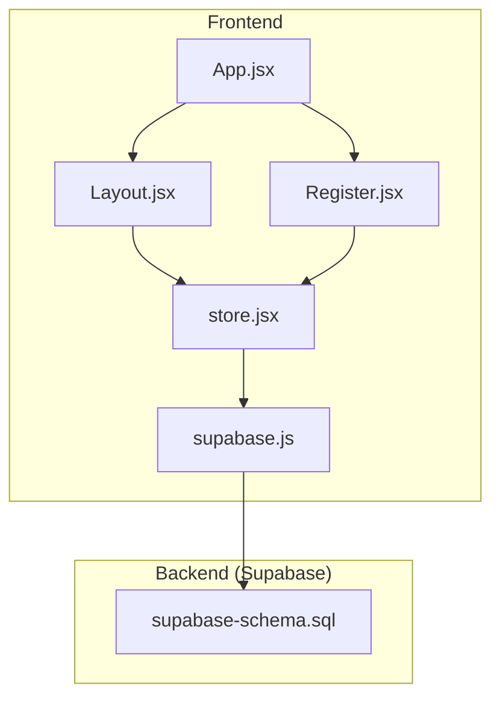
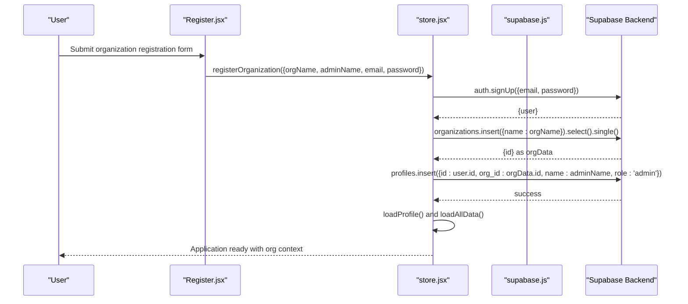
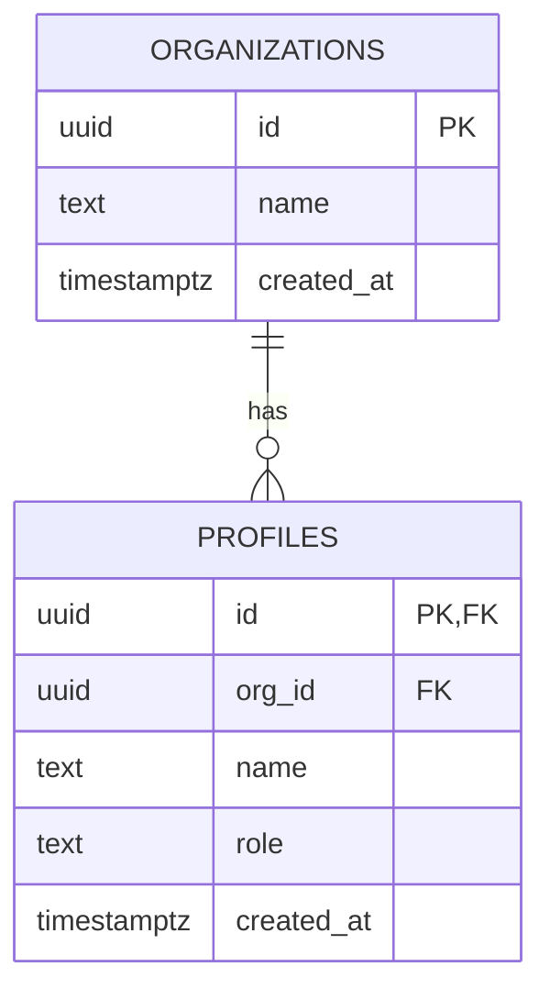
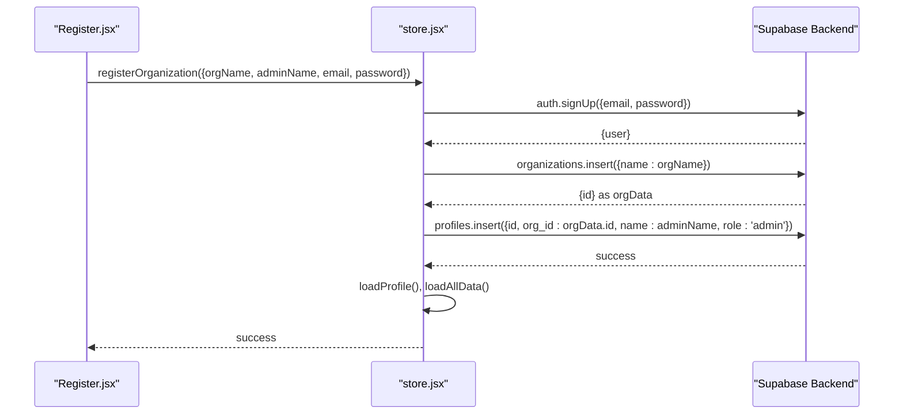
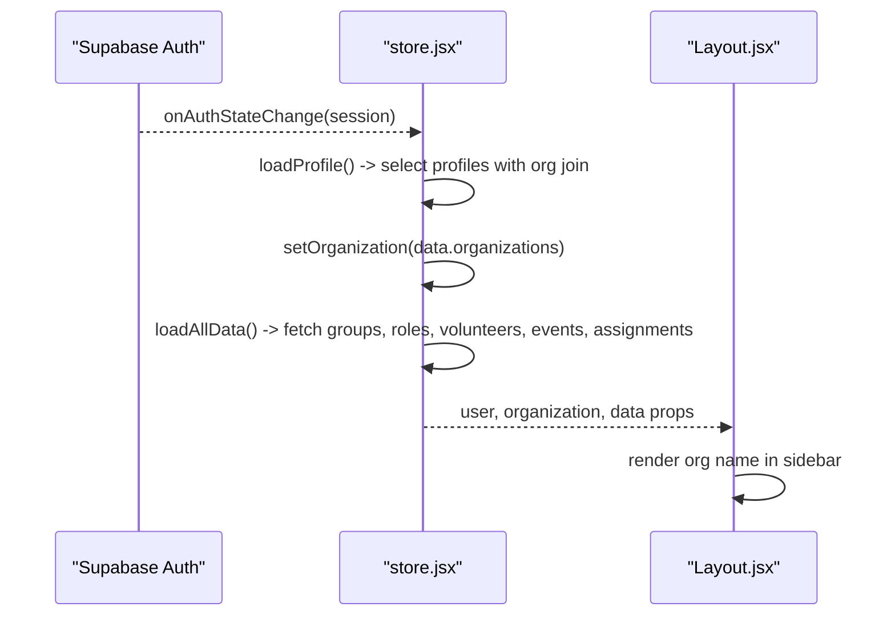
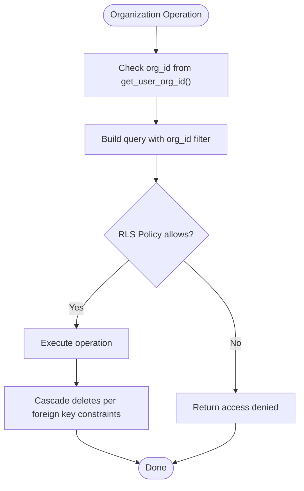
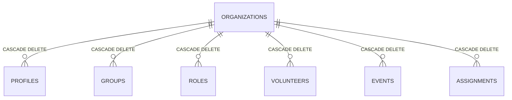
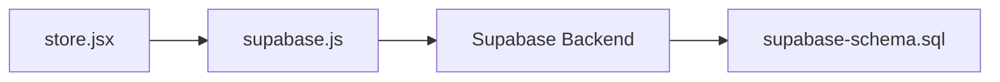

# Organization CRUD Operations

<cite>
**Referenced Files in This Document**
- [supabase-schema.sql](file://supabase-schema.sql)
- [store.jsx](file://src/services/store.jsx)
- [supabase.js](file://src/services/supabase.js)
- [Register.jsx](file://src/pages/Register.jsx)
- [Layout.jsx](file://src/components/Layout.jsx)
- [Dashboard.jsx](file://src/pages/Dashboard.jsx)
</cite>

## Table of Contents
1. [Introduction](#introduction)
2. [Project Structure](#project-structure)
3. [Core Components](#core-components)
4. [Architecture Overview](#architecture-overview)
5. [Detailed Component Analysis](#detailed-component-analysis)
6. [Dependency Analysis](#dependency-analysis)
7. [Performance Considerations](#performance-considerations)
8. [Troubleshooting Guide](#troubleshooting-guide)
9. [Conclusion](#conclusion)

## Introduction
This document explains how organization CRUD operations are implemented in RosterFlow, focusing on the organizations table and how tenant isolation is enforced. It covers:
- Create, read, update, and delete operations for organizations
- Tenant isolation via Supabase Row Level Security (RLS) policies and the get_user_org_id() helper function
- How organization context is maintained across all data operations
- Query patterns for organization creation, profile association, and organization-level filtering
- Relationship between organizations and user profiles, including admin role assignment during organization creation
- Examples of organization-specific queries using Supabase RLS policies and context-aware filtering
- Deletion constraints and cascade handling for related data

## Project Structure
RosterFlow organizes organization-related logic primarily in the central store service and Supabase schema:
- Supabase schema defines tables, foreign keys, RLS policies, and helper functions
- The store service orchestrates authentication, loads profile and organization context, and performs CRUD operations scoped to the current organization
- Pages and components consume the store to render and modify data

**Diagram sources**
- [App.jsx](file://src/App.jsx#L1-L37)
- [Layout.jsx](file://src/components/Layout.jsx#L1-L108)
- [Register.jsx](file://src/pages/Register.jsx#L1-L101)
- [store.jsx](file://src/services/store.jsx#L1-L615)
- [supabase.js](file://src/services/supabase.js#L1-L13)
- [supabase-schema.sql](file://supabase-schema.sql#L1-L251)

**Section sources**
- [supabase-schema.sql](file://supabase-schema.sql#L1-L251)
- [store.jsx](file://src/services/store.jsx#L1-L615)
- [supabase.js](file://src/services/supabase.js#L1-L13)
- [Register.jsx](file://src/pages/Register.jsx#L1-L101)
- [Layout.jsx](file://src/components/Layout.jsx#L1-L108)

## Core Components
- Supabase schema and RLS policies define tenant isolation and enforce org-scoped access
- The store service manages authentication state, loads profile and organization context, and executes organization-scoped queries
- Registration flow creates the organization and profile, assigning the admin role

Key implementation highlights:
- Organizations table with id, name, and timestamps
- Profiles table linked to auth.users and organizations with role enforcement
- RLS policies that filter all queries by get_user_org_id()
- Helper function get_user_org_id() resolves the current user’s org_id from profiles
- Registration flow inserts organization, then profile with role set to admin

**Section sources**
- [supabase-schema.sql](file://supabase-schema.sql#L7-L21)
- [supabase-schema.sql](file://supabase-schema.sql#L88-L97)
- [supabase-schema.sql](file://supabase-schema.sql#L100-L120)
- [store.jsx](file://src/services/store.jsx#L198-L243)

## Architecture Overview
The organization CRUD flow integrates frontend store operations with Supabase backend policies and triggers.

**Diagram sources**
- [Register.jsx](file://src/pages/Register.jsx#L16-L27)
- [store.jsx](file://src/services/store.jsx#L198-L243)
- [supabase.js](file://src/services/supabase.js#L1-L13)

## Detailed Component Analysis

### Organizations Table and Tenant Isolation
- Table definition enforces primary key and timestamps
- RLS enabled on organizations and all related tables
- get_user_org_id() function returns the current user’s org_id for policy evaluation
- RLS policies restrict SELECT/INSERT/UPDATE/DELETE to records matching the current org_id

**Diagram sources**
- [supabase-schema.sql](file://supabase-schema.sql#L7-L21)

**Section sources**
- [supabase-schema.sql](file://supabase-schema.sql#L7-L21)
- [supabase-schema.sql](file://supabase-schema.sql#L78-L97)
- [supabase-schema.sql](file://supabase-schema.sql#L100-L120)

### Organization Creation Flow
- Registration page collects orgName, adminName, email, and password
- Store signs up the user, creates the organization, creates the profile with role admin, and loads the user’s organization context

**Diagram sources**
- [Register.jsx](file://src/pages/Register.jsx#L16-L27)
- [store.jsx](file://src/services/store.jsx#L198-L243)

**Section sources**
- [Register.jsx](file://src/pages/Register.jsx#L16-L27)
- [store.jsx](file://src/services/store.jsx#L198-L243)

### Organization Context Maintenance Across Operations
- Authentication state drives organization context:
  - On auth state change, the store loads the user’s profile and organization
  - All subsequent queries are scoped to the current org_id
- The store exposes derived user object containing orgId for UI rendering
- Layout redirects unauthenticated users and displays organization name in the sidebar

**Diagram sources**
- [store.jsx](file://src/services/store.jsx#L78-L107)
- [store.jsx](file://src/services/store.jsx#L109-L123)
- [store.jsx](file://src/services/store.jsx#L133-L166)
- [Layout.jsx](file://src/components/Layout.jsx#L17-L29)

**Section sources**
- [store.jsx](file://src/services/store.jsx#L78-L107)
- [store.jsx](file://src/services/store.jsx#L109-L123)
- [store.jsx](file://src/services/store.jsx#L133-L166)
- [Layout.jsx](file://src/components/Layout.jsx#L17-L29)

### Organization-Level Data Filtering and Query Patterns
- All organization-scoped tables enforce RLS using org_id equality to get_user_org_id()
- The set_org_id() trigger auto-populates org_id on insert for groups, roles, volunteers, events, and assignments when not provided
- Example query patterns:
  - Create organization: organizations.insert({ name })
  - Create profile (admin): profiles.insert({ id, org_id, name, role: 'admin' })
  - Read organization data: groups.select().order(name), roles.select().order(name), etc.
  - Update/delete: operations constrained by org_id policy

**Diagram sources**
- [supabase-schema.sql](file://supabase-schema.sql#L88-L97)
- [supabase-schema.sql](file://supabase-schema.sql#L100-L120)
- [supabase-schema.sql](file://supabase-schema.sql#L225-L251)

**Section sources**
- [supabase-schema.sql](file://supabase-schema.sql#L78-L97)
- [supabase-schema.sql](file://supabase-schema.sql#L100-L120)
- [supabase-schema.sql](file://supabase-schema.sql#L225-L251)

### Organization Deletion Constraints and Cascade Handling
- Organizations are referenced by profiles (ON DELETE CASCADE), groups (ON DELETE CASCADE), roles (ON DELETE CASCADE), volunteers (ON DELETE CASCADE), events (ON DELETE CASCADE), and assignments (ON DELETE CASCADE)
- Deleting an organization will cascade-delete all related records due to foreign key constraints
- RLS policies still apply to prevent unauthorized access during cascading

**Diagram sources**
- [supabase-schema.sql](file://supabase-schema.sql#L14-L76)

**Section sources**
- [supabase-schema.sql](file://supabase-schema.sql#L14-L76)

## Dependency Analysis
- Frontend depends on Supabase client for authenticated requests
- Supabase enforces tenant isolation via RLS policies and helper functions
- The store service centralizes organization-scoped operations and maintains context

**Diagram sources**
- [store.jsx](file://src/services/store.jsx#L1-L6)
- [supabase.js](file://src/services/supabase.js#L1-L13)
- [supabase-schema.sql](file://supabase-schema.sql#L1-L251)

**Section sources**
- [store.jsx](file://src/services/store.jsx#L1-L6)
- [supabase.js](file://src/services/supabase.js#L1-L13)
- [supabase-schema.sql](file://supabase-schema.sql#L1-L251)

## Performance Considerations
- Parallel loading of organization data reduces round trips
- RLS adds minimal overhead; ensure indexes on org_id and frequently-filtered columns
- Triggers like set_org_id() avoid redundant client-side org_id propagation

## Troubleshooting Guide
Common issues and resolutions:
- Access denied errors: Verify the user’s profile has a valid org_id and that RLS policies are applied
- Missing organization context: Confirm loadProfile() runs after auth state changes and that loadAllData() is invoked when profile.org_id is available
- Cascading deletes: Deleting an organization removes all related records; confirm foreign key constraints are intact

**Section sources**
- [store.jsx](file://src/services/store.jsx#L78-L107)
- [store.jsx](file://src/services/store.jsx#L109-L123)
- [store.jsx](file://src/services/store.jsx#L133-L166)
- [supabase-schema.sql](file://supabase-schema.sql#L14-L76)

## Conclusion
RosterFlow implements robust organization CRUD with strong tenant isolation:
- Organizations are created during registration and associated with the admin profile
- All operations are scoped by org_id via RLS policies and helper functions
- The store service maintains organization context across the app lifecycle
- Foreign key constraints ensure cascading cleanup when organizations are deleted