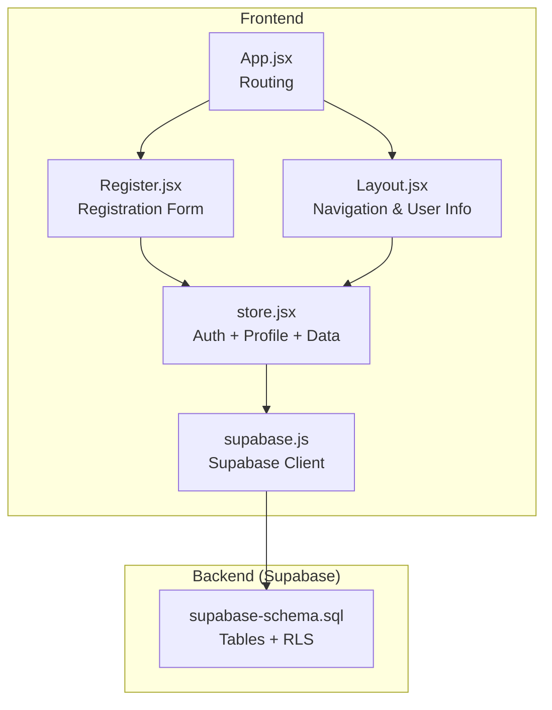
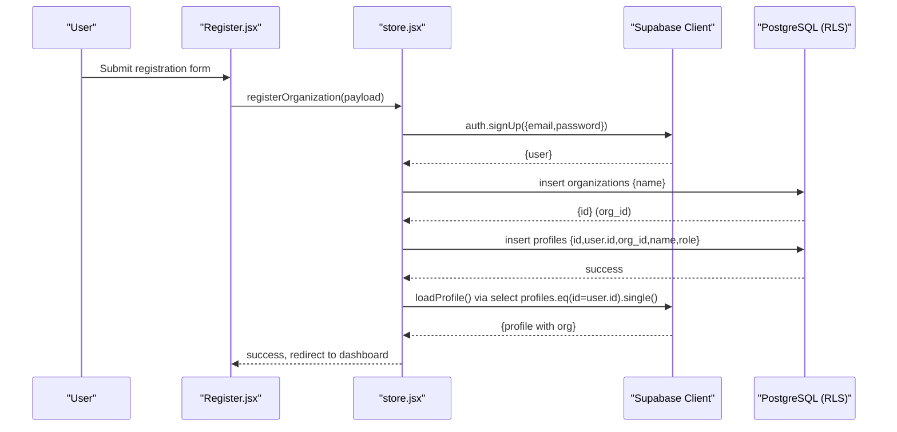
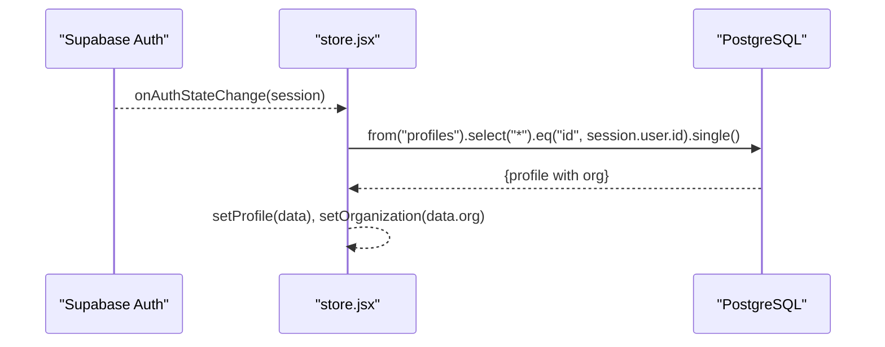
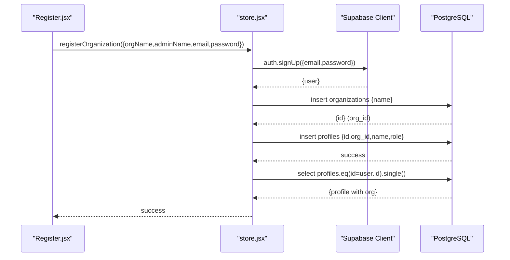
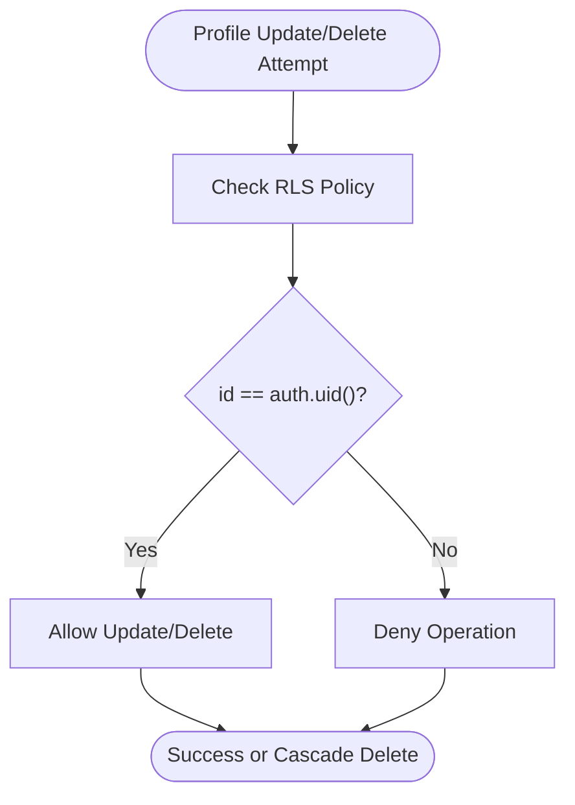
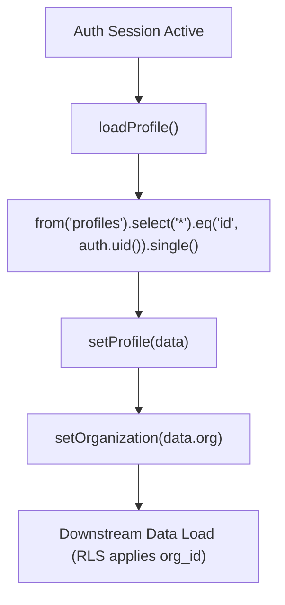
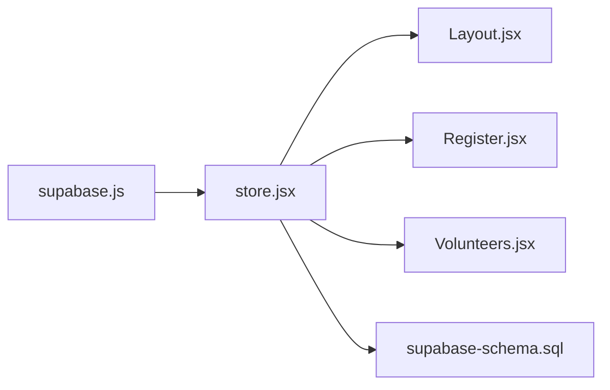

# Profile CRUD Operations

<cite>
**Referenced Files in This Document**
- [supabase-schema.sql](file://supabase-schema.sql)
- [store.jsx](file://src/services/store.jsx)
- [supabase.js](file://src/services/supabase.js)
- [Register.jsx](file://src/pages/Register.jsx)
- [App.jsx](file://src/App.jsx)
- [Layout.jsx](file://src/components/Layout.jsx)
- [Volunteers.jsx](file://src/pages/Volunteers.jsx)
</cite>

## Table of Contents
1. [Introduction](#introduction)
2. [Project Structure](#project-structure)
3. [Core Components](#core-components)
4. [Architecture Overview](#architecture-overview)
5. [Detailed Component Analysis](#detailed-component-analysis)
6. [Dependency Analysis](#dependency-analysis)
7. [Performance Considerations](#performance-considerations)
8. [Troubleshooting Guide](#troubleshooting-guide)
9. [Conclusion](#conclusion)

## Introduction
This document explains profile CRUD operations in RosterFlow, focusing on how profiles are created during user registration, retrieved for dashboard usage, and synchronized with authentication. It documents the underlying database schema, Supabase Row Level Security (RLS) policies, and the frontend store/service layer that orchestrates profile operations. It also outlines query patterns for retrieving profiles by user ID, organization-scoped contexts, and permission checks enforced by the backend.

## Project Structure
RosterFlow organizes profile-related logic across three primary areas:
- Database schema and RLS policies for profiles and organization scoping
- Supabase client initialization and authentication
- Frontend store/service that performs profile reads, writes, and synchronization with auth sessions

**Diagram sources**
- [App.jsx](file://src/App.jsx#L13-L36)
- [Layout.jsx](file://src/components/Layout.jsx#L14-L108)
- [Register.jsx](file://src/pages/Register.jsx#L5-L101)
- [store.jsx](file://src/services/store.jsx#L39-L76)
- [supabase.js](file://src/services/supabase.js#L1-L13)
- [supabase-schema.sql](file://supabase-schema.sql#L14-L21)

**Section sources**
- [App.jsx](file://src/App.jsx#L13-L36)
- [Layout.jsx](file://src/components/Layout.jsx#L14-L108)
- [Register.jsx](file://src/pages/Register.jsx#L5-L101)
- [store.jsx](file://src/services/store.jsx#L39-L76)
- [supabase.js](file://src/services/supabase.js#L1-L13)
- [supabase-schema.sql](file://supabase-schema.sql#L14-L21)

## Core Components
- Profiles table and RLS policies define ownership and visibility rules scoped to organizations.
- Supabase client encapsulates connection and authentication.
- Store manages auth state, loads the profile upon login, and exposes profile-aware data loading.

Key responsibilities:
- Profile creation during registration: inserts a row into profiles with id matching the auth user and org_id derived from the newly created organization.
- Profile retrieval: fetches the profile for the current auth user and joins organization details.
- Organization context: all downstream data is filtered by org_id via RLS.

**Section sources**
- [supabase-schema.sql](file://supabase-schema.sql#L14-L21)
- [supabase-schema.sql](file://supabase-schema.sql#L108-L119)
- [supabase.js](file://src/services/supabase.js#L1-L13)
- [store.jsx](file://src/services/store.jsx#L109-L123)
- [store.jsx](file://src/services/store.jsx#L198-L243)

## Architecture Overview
The profile lifecycle integrates authentication, database operations, and UI routing:

**Diagram sources**
- [Register.jsx](file://src/pages/Register.jsx#L16-L27)
- [store.jsx](file://src/services/store.jsx#L198-L243)
- [supabase.js](file://src/services/supabase.js#L1-L13)
- [supabase-schema.sql](file://supabase-schema.sql#L14-L21)

## Detailed Component Analysis

### Profiles Table and RLS Policies
- Profiles table extends the Supabase auth.users table and is linked to organizations.
- Constraints:
  - id references auth.users with cascade delete.
  - org_id references organizations with cascade delete.
  - role defaults to admin and is constrained to a fixed set.
  - created_at defaults to current timestamp.
- RLS policies:
  - Select: users can view profiles within their organization.
  - Insert: users can insert their own profile (id must match auth.uid()).
  - Update: users can update their own profile (id equals auth.uid()).

These policies enforce per-user isolation and organization scoping.

**Section sources**
- [supabase-schema.sql](file://supabase-schema.sql#L14-L21)
- [supabase-schema.sql](file://supabase-schema.sql#L108-L119)

### Profile Retrieval on Login
- The store listens to Supabase auth state and, when a session exists, loads the profile for the current user.
- Query pattern:
  - Select profiles with organization details joined.
  - Filter by id equal to the authenticated user id.
  - Single-row response to populate the profile and organization state.

**Diagram sources**
- [store.jsx](file://src/services/store.jsx#L71-L76)
- [store.jsx](file://src/services/store.jsx#L109-L123)

**Section sources**
- [store.jsx](file://src/services/store.jsx#L71-L76)
- [store.jsx](file://src/services/store.jsx#L109-L123)

### Profile Creation During Registration
- Registration flow:
  - Creates an auth user.
  - Creates an organization.
  - Inserts a profile row with id=user.id, org_id=org.id, name=adminName, role=admin.
  - Loads the profile to initialize the app state.

**Diagram sources**
- [Register.jsx](file://src/pages/Register.jsx#L16-L27)
- [store.jsx](file://src/services/store.jsx#L198-L243)
- [supabase-schema.sql](file://supabase-schema.sql#L14-L21)

**Section sources**
- [Register.jsx](file://src/pages/Register.jsx#L16-L27)
- [store.jsx](file://src/services/store.jsx#L198-L243)
- [supabase-schema.sql](file://supabase-schema.sql#L14-L21)

### Profile Updates and Deletion
- Update policy: users can update only their own profile (id equals auth.uid()).
- Delete policy: profiles are deleted via cascade when the associated auth user is removed.
- Current frontend code does not expose explicit profile update/delete UI in the analyzed files. The store’s profile state is populated from the database and used for UI rendering and organization scoping.

**Diagram sources**
- [supabase-schema.sql](file://supabase-schema.sql#L117-L119)

**Section sources**
- [supabase-schema.sql](file://supabase-schema.sql#L117-L119)
- [store.jsx](file://src/services/store.jsx#L109-L123)

### Query Patterns and Organization Context Filtering
Common query patterns observed in the store and schema:
- Retrieve profile by user ID:
  - from("profiles").select("*").eq("id", userId).single()
- Organization-scoped visibility:
  - All tables enforce RLS using get_user_org_id(), ensuring users see only records where org_id matches their organization.
- Join organization details:
  - The profile load joins organizations(*) to expose organization metadata alongside profile data.

**Diagram sources**
- [store.jsx](file://src/services/store.jsx#L109-L123)
- [supabase-schema.sql](file://supabase-schema.sql#L88-L97)
- [supabase-schema.sql](file://supabase-schema.sql#L108-L111)

**Section sources**
- [store.jsx](file://src/services/store.jsx#L109-L123)
- [supabase-schema.sql](file://supabase-schema.sql#L88-L97)
- [supabase-schema.sql](file://supabase-schema.sql#L108-L111)

### Privacy Settings and Data Protection Considerations
- Data minimization: The profile includes id, org_id, name, role, and timestamps. No sensitive fields are present in the schema.
- Access control: RLS policies restrict profile access to the owning user and organization-wide visibility for profile viewing within the org.
- Authentication linkage: Profile id references auth.users, ensuring that only authenticated users can have associated profiles.
- Organization boundary: All downstream data is filtered by org_id, preventing cross-organization data leakage.

**Section sources**
- [supabase-schema.sql](file://supabase-schema.sql#L14-L21)
- [supabase-schema.sql](file://supabase-schema.sql#L108-L111)

## Dependency Analysis
- store.jsx depends on supabase.js for client initialization and auth/session management.
- store.jsx triggers profile retrieval after successful registration and login.
- Layout.jsx displays user name and organization name derived from the store’s profile state.
- Register.jsx invokes the store’s registration function.

**Diagram sources**
- [supabase.js](file://src/services/supabase.js#L1-L13)
- [store.jsx](file://src/services/store.jsx#L39-L76)
- [Layout.jsx](file://src/components/Layout.jsx#L14-L108)
- [Register.jsx](file://src/pages/Register.jsx#L5-L101)
- [Volunteers.jsx](file://src/pages/Volunteers.jsx#L7-L8)
- [supabase-schema.sql](file://supabase-schema.sql#L14-L21)

**Section sources**
- [supabase.js](file://src/services/supabase.js#L1-L13)
- [store.jsx](file://src/services/store.jsx#L39-L76)
- [Layout.jsx](file://src/components/Layout.jsx#L14-L108)
- [Register.jsx](file://src/pages/Register.jsx#L5-L101)
- [Volunteers.jsx](file://src/pages/Volunteers.jsx#L7-L8)
- [supabase-schema.sql](file://supabase-schema.sql#L14-L21)

## Performance Considerations
- Profile retrieval uses a single-row query filtered by the authenticated user id, minimizing overhead.
- Downstream data loading occurs in parallel after profile/org are established, improving perceived performance.
- RLS enforcement happens server-side; ensure indexes on frequently-filtered columns (e.g., org_id) for optimal query performance.

## Troubleshooting Guide
- Profile not loading after login:
  - Verify that the session exists and that loadProfile() executes after auth state changes.
  - Confirm that the profiles table contains a row for the authenticated user id.
- Registration fails:
  - Check for errors returned by auth.signUp and organization insert.
  - Ensure the profiles insert completes successfully and that loadProfile() is invoked afterward.
- Permission denied:
  - RLS policies restrict profile access to the owning user. Confirm that the id equals auth.uid().

**Section sources**
- [store.jsx](file://src/services/store.jsx#L71-L76)
- [store.jsx](file://src/services/store.jsx#L109-L123)
- [store.jsx](file://src/services/store.jsx#L198-L243)
- [supabase-schema.sql](file://supabase-schema.sql#L117-L119)

## Conclusion
RosterFlow’s profile CRUD is anchored by a clean schema and strict RLS policies that enforce per-user and organization-scoped access. Registration creates both the auth user and the associated profile, while the store synchronizes the profile into the app state for UI rendering and downstream data filtering. While explicit profile update/delete UI is not present in the analyzed files, the backend policies permit these operations for the authenticated user, and the organization context ensures data integrity across the system.