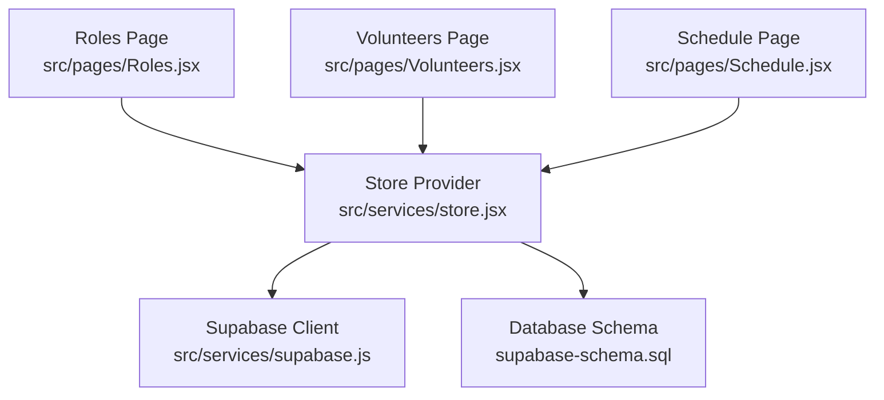
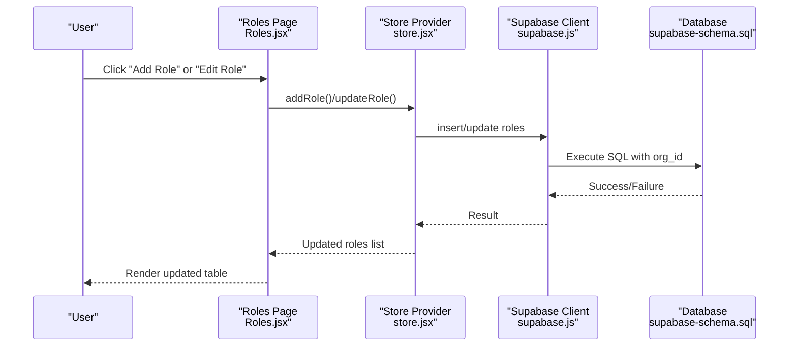
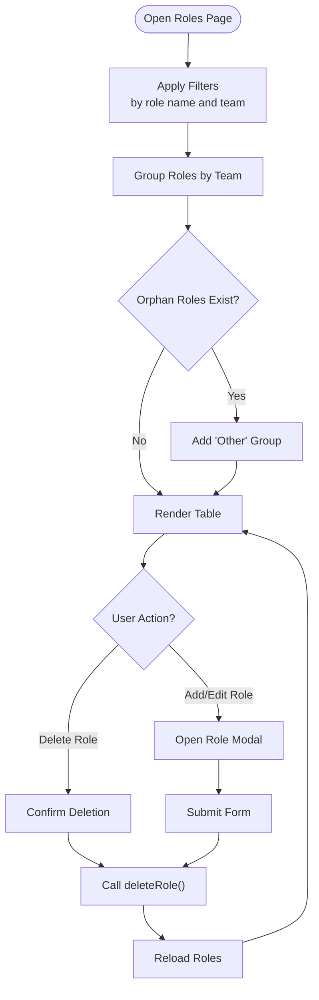
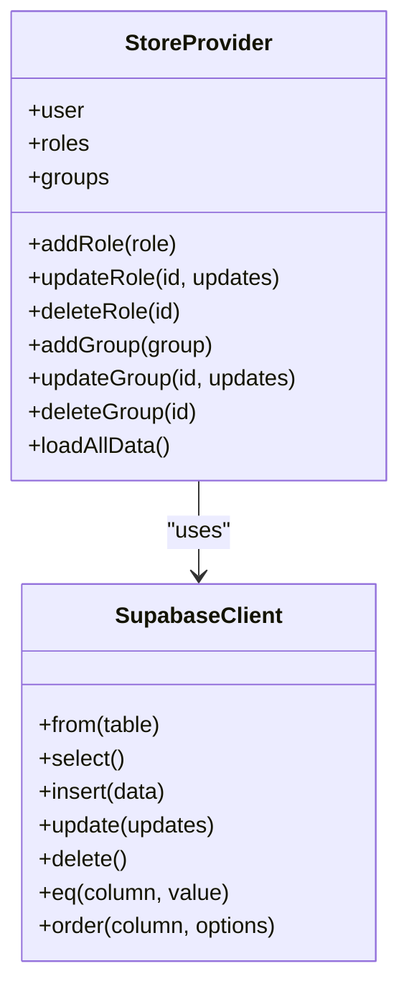
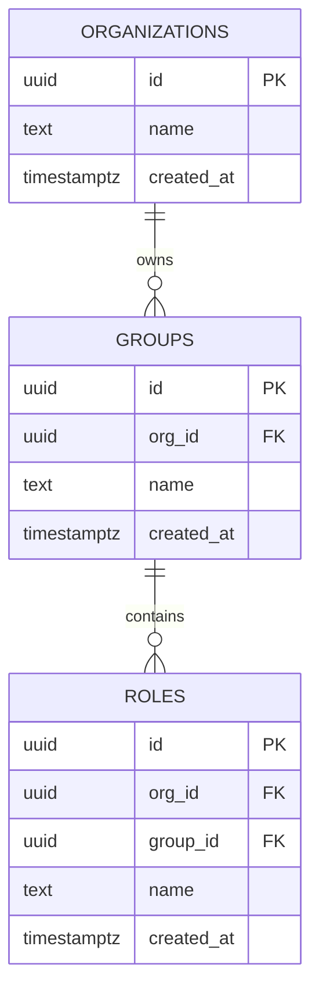
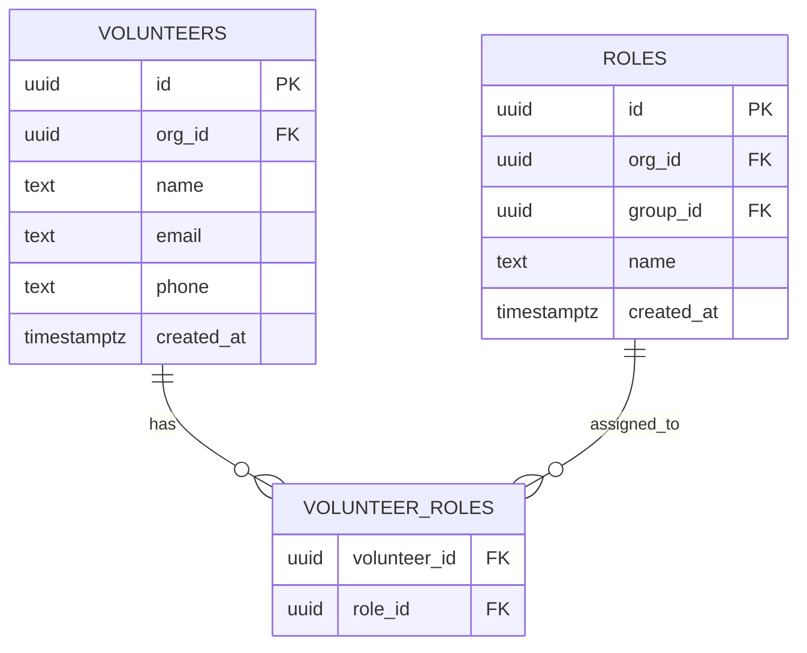
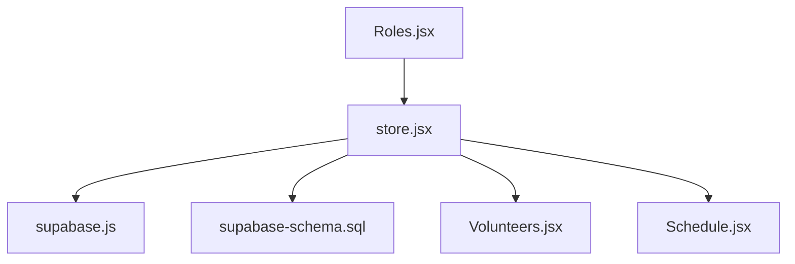

# Role CRUD Operations

<cite>
**Referenced Files in This Document**
- [Roles.jsx](file://src/pages/Roles.jsx)
- [store.jsx](file://src/services/store.jsx)
- [supabase.js](file://src/services/supabase.js)
- [supabase-schema.sql](file://supabase-schema.sql)
- [Volunteers.jsx](file://src/pages/Volunteers.jsx)
- [Schedule.jsx](file://src/pages/Schedule.jsx)
</cite>

## Table of Contents
1. [Introduction](#introduction)
2. [Project Structure](#project-structure)
3. [Core Components](#core-components)
4. [Architecture Overview](#architecture-overview)
5. [Detailed Component Analysis](#detailed-component-analysis)
6. [Dependency Analysis](#dependency-analysis)
7. [Performance Considerations](#performance-considerations)
8. [Troubleshooting Guide](#troubleshooting-guide)
9. [Conclusion](#conclusion)

## Introduction
This document provides comprehensive coverage of role CRUD operations in RosterFlow. It explains how roles are created, read, updated, and deleted within the application, including role hierarchy, permission levels, and role assignment patterns within groups. It also documents query patterns for role listing, role permissions retrieval, and role-based access control, along with examples of role queries with organization context and group membership filtering. Finally, it addresses role inheritance patterns and permission validation logic.

## Project Structure
RosterFlow organizes role management across several key files:
- UI page for managing roles and teams
- Centralized store for data operations and synchronization
- Supabase client for database connectivity
- Database schema defining roles, groups, and relationships
- Supporting pages for volunteers and scheduling that rely on roles

**Diagram sources**
- [Roles.jsx](file://src/pages/Roles.jsx#L1-L386)
- [store.jsx](file://src/services/store.jsx#L1-L662)
- [supabase.js](file://src/services/supabase.js#L1-L13)
- [supabase-schema.sql](file://supabase-schema.sql#L1-L251)

**Section sources**
- [Roles.jsx](file://src/pages/Roles.jsx#L1-L386)
- [store.jsx](file://src/services/store.jsx#L1-L662)
- [supabase.js](file://src/services/supabase.js#L1-L13)
- [supabase-schema.sql](file://supabase-schema.sql#L1-L251)

## Core Components
- Roles Page: Provides UI for creating, editing, and deleting roles, and for managing teams (groups). It filters roles by name and team, groups roles under teams, and handles orphan roles (roles without a team).
- Store Provider: Centralizes data operations for roles and groups, including add, update, delete, and list operations. It integrates with Supabase for persistence and organization scoping.
- Supabase Client: Manages connection to the Supabase backend and exposes the supabase client instance used by the store.
- Database Schema: Defines the roles table, groups table, and their relationships, including foreign keys and row-level security policies.

Key responsibilities:
- Role CRUD: Creation, reading, updating, and deletion of roles with organization scoping.
- Group Management: Creation, editing, and deletion of teams (groups) that roles belong to.
- Role-Group Relationship: Roles can be associated with a group or marked as orphaned if no group is assigned.
- Organization Context: All role operations are scoped to the authenticated user's organization.

**Section sources**
- [Roles.jsx](file://src/pages/Roles.jsx#L1-L386)
- [store.jsx](file://src/services/store.jsx#L474-L538)
- [supabase.js](file://src/services/supabase.js#L1-L13)
- [supabase-schema.sql](file://supabase-schema.sql#L31-L38)

## Architecture Overview
The role management architecture follows a unidirectional data flow:
- UI triggers actions via handlers in the Roles page.
- Store executes Supabase queries for role and group operations.
- Database schema enforces organization scoping and referential integrity.
- UI re-renders based on updated state.

**Diagram sources**
- [Roles.jsx](file://src/pages/Roles.jsx#L62-L78)
- [store.jsx](file://src/services/store.jsx#L474-L519)
- [supabase.js](file://src/services/supabase.js#L1-L13)
- [supabase-schema.sql](file://supabase-schema.sql#L138-L153)

## Detailed Component Analysis

### Roles Page (UI)
The Roles page provides:
- Role listing with filtering by role name and team name.
- Grouping of roles under teams and display of orphan roles.
- Modal forms for adding/editing roles and managing teams.
- Handlers for edit, delete, and form submission.

Key behaviors:
- Filtering: Roles are filtered by name and team name before grouping.
- Grouping: Roles are grouped by team name; orphan roles appear under "Other".
- Form handling: Adds or updates roles with name and optional group association.
- Deletion: Confirms deletion and invokes store delete function.

**Diagram sources**
- [Roles.jsx](file://src/pages/Roles.jsx#L23-L41)
- [Roles.jsx](file://src/pages/Roles.jsx#L44-L78)
- [Roles.jsx](file://src/pages/Roles.jsx#L50-L54)

**Section sources**
- [Roles.jsx](file://src/pages/Roles.jsx#L1-L386)

### Store Provider (Data Layer)
The Store Provider encapsulates role and group operations:
- addRole: Inserts a role with org_id and reloads data.
- updateRole: Updates role fields and reloads data.
- deleteRole: Deletes a role and reloads data.
- addGroup/updateGroup/deleteGroup: Similar operations for teams.
- loadAllData: Loads roles and groups with organization scoping.

Organization scoping:
- All role operations are scoped to the authenticated user's organization via org_id.
- The store sets org_id during inserts using a helper function and triggers.

**Diagram sources**
- [store.jsx](file://src/services/store.jsx#L474-L538)
- [store.jsx](file://src/services/store.jsx#L133-L166)
- [supabase.js](file://src/services/supabase.js#L1-L13)

**Section sources**
- [store.jsx](file://src/services/store.jsx#L474-L538)
- [store.jsx](file://src/services/store.jsx#L133-L166)

### Database Schema (Roles and Groups)
The schema defines:
- roles table with org_id foreign key and optional group_id foreign key.
- groups table with org_id foreign key.
- Row-level security policies that scope access to the user's organization.
- Triggers to automatically set org_id on insert for roles and groups.

**Diagram sources**
- [supabase-schema.sql](file://supabase-schema.sql#L7-L38)
- [supabase-schema.sql](file://supabase-schema.sql#L138-L153)

**Section sources**
- [supabase-schema.sql](file://supabase-schema.sql#L31-L38)
- [supabase-schema.sql](file://supabase-schema.sql#L138-L153)

### Role Assignment Patterns and Permissions
While the roles table itself does not define permissions, role assignment occurs through the volunteer_roles junction table and is used by other parts of the system:
- Volunteers are associated with roles via volunteer_roles.
- Scheduling relies on roles to assign volunteers to events.
- The system demonstrates role-based assignment patterns without explicit permission definitions.

**Diagram sources**
- [supabase-schema.sql](file://supabase-schema.sql#L40-L55)
- [store.jsx](file://src/services/store.jsx#L139-L159)

**Section sources**
- [supabase-schema.sql](file://supabase-schema.sql#L50-L55)
- [store.jsx](file://src/services/store.jsx#L139-L159)

### Query Patterns for Role Listing and Filtering
- Role listing: The store loads roles ordered by name.
- Role filtering: The UI filters roles by name and team name before grouping.
- Group membership filtering: Roles are grouped by team; orphan roles are displayed separately.

Example patterns:
- List roles with organization scoping: select roles where org_id equals the user's org_id.
- Filter roles by name/team: client-side filtering on roles and group names.
- Group roles by team: server-side grouping in UI logic.

**Section sources**
- [store.jsx](file://src/services/store.jsx#L139-L149)
- [Roles.jsx](file://src/pages/Roles.jsx#L23-L41)

### Role-Based Access Control (RLS)
Row-level security policies ensure that:
- Users can only view, insert, update, and delete roles within their organization.
- Organization scoping is enforced at the database level.
- A helper function retrieves the user's organization ID for policy evaluation.

Policy highlights:
- Select roles where org_id equals get_user_org_id().
- Insert roles with org_id equal to get_user_org_id().
- Update and delete roles constrained by org_id.

**Section sources**
- [supabase-schema.sql](file://supabase-schema.sql#L138-L153)
- [supabase-schema.sql](file://supabase-schema.sql#L88-L97)

### Role Creation with Permission Definitions
- Role creation: The store inserts a role with org_id and optional group_id.
- Permission definitions: The schema does not define role permissions; permissions are not modeled in the database.
- Practical implication: Role assignment is handled via volunteer_roles; no explicit permission checks are present in the schema.

**Section sources**
- [store.jsx](file://src/services/store.jsx#L474-L500)
- [supabase-schema.sql](file://supabase-schema.sql#L31-L38)

### Role Updates for Permission Changes
- Role updates: The store updates role fields (name, group_id) and reloads data.
- Permission changes: Since permissions are not defined in the schema, no permission update logic exists.

**Section sources**
- [store.jsx](file://src/services/store.jsx#L502-L519)

### Role Deletion with Dependency Handling
- Role deletion: The store deletes a role and reloads data.
- Dependencies: The schema defines group_id as optional; deleting a role does not cascade to volunteers. The UI notes that deleting a group moves associated roles to "Other".

**Section sources**
- [store.jsx](file://src/services/store.jsx#L521-L538)
- [Roles.jsx](file://src/pages/Roles.jsx#L87-L92)

### Examples of Role Queries with Organization Context
- Listing roles scoped to organization: select roles where org_id equals the user's org_id.
- Filtering roles by name and team: client-side filtering on role name and group name.
- Group membership filtering: group roles by group_id; orphan roles are shown separately.

**Section sources**
- [store.jsx](file://src/services/store.jsx#L139-L149)
- [Roles.jsx](file://src/pages/Roles.jsx#L23-L41)

### Role Inheritance Patterns and Permission Validation Logic
- Inheritance: The schema does not define role inheritance; roles are standalone entities with optional group membership.
- Permission validation: There is no explicit permission validation logic in the schema or store; access control is enforced via RLS policies.

**Section sources**
- [supabase-schema.sql](file://supabase-schema.sql#L31-L38)
- [supabase-schema.sql](file://supabase-schema.sql#L138-L153)

## Dependency Analysis
The Roles page depends on the Store Provider for data operations, which in turn depends on the Supabase client and the database schema. The schema enforces organization scoping and referential integrity.

**Diagram sources**
- [Roles.jsx](file://src/pages/Roles.jsx#L1-L386)
- [store.jsx](file://src/services/store.jsx#L1-L662)
- [supabase.js](file://src/services/supabase.js#L1-L13)
- [supabase-schema.sql](file://supabase-schema.sql#L1-L251)

**Section sources**
- [Roles.jsx](file://src/pages/Roles.jsx#L1-L386)
- [store.jsx](file://src/services/store.jsx#L1-L662)
- [supabase.js](file://src/services/supabase.js#L1-L13)
- [supabase-schema.sql](file://supabase-schema.sql#L1-L251)

## Performance Considerations
- Client-side filtering: Filtering and grouping occur in the UI; for large datasets, consider server-side filtering and pagination.
- Parallel loading: The store loads multiple collections concurrently; ensure database indexes support efficient queries.
- Organization scoping: RLS adds overhead; ensure policies are efficient and avoid unnecessary joins.

## Troubleshooting Guide
Common issues and resolutions:
- Role not appearing: Verify organization scoping; ensure the user belongs to the correct organization.
- Group association lost: Deleting a group moves roles to "Other"; reassign roles to a valid group.
- Permission denied: Confirm RLS policies are correctly configured and the user has appropriate access.

**Section sources**
- [store.jsx](file://src/services/store.jsx#L133-L166)
- [Roles.jsx](file://src/pages/Roles.jsx#L87-L92)
- [supabase-schema.sql](file://supabase-schema.sql#L138-L153)

## Conclusion
RosterFlow implements robust role CRUD operations with organization-scoped access control through Supabase RLS. Roles are managed via a dedicated UI page and centralized store, with clear separation between role definition and assignment. While the schema does not define explicit permissions, role assignment patterns are supported through the volunteer_roles junction table and are used throughout the application for scheduling and volunteer management.