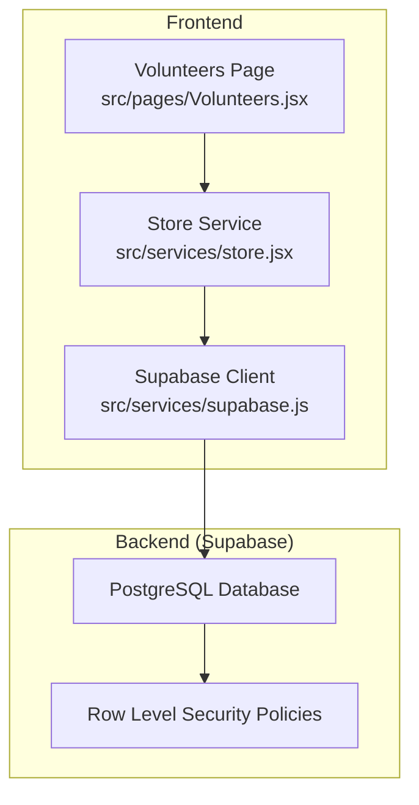
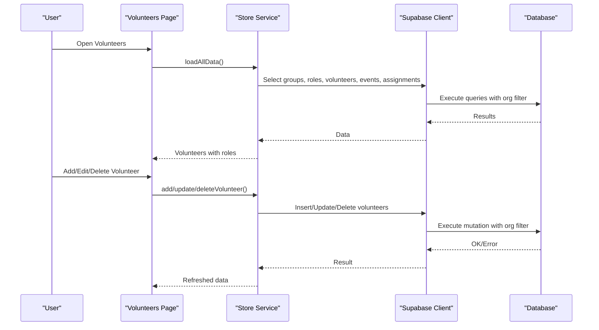
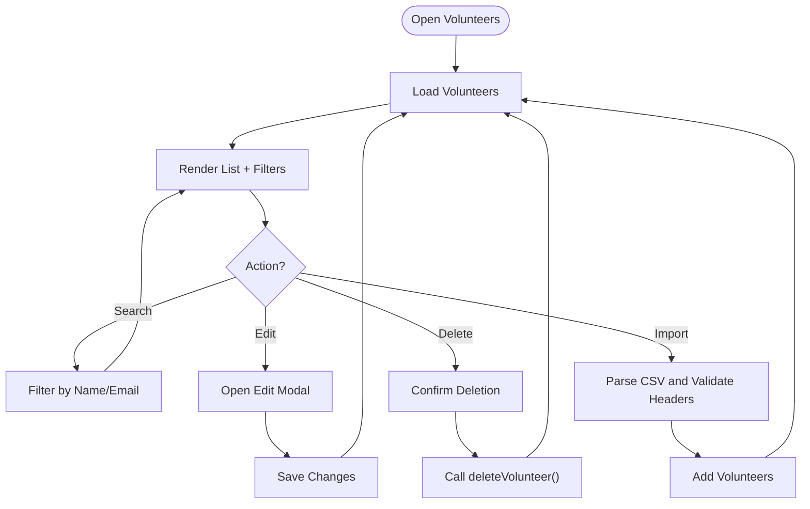
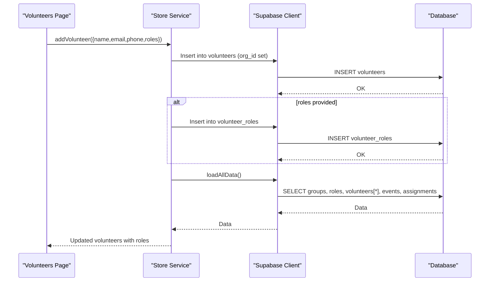
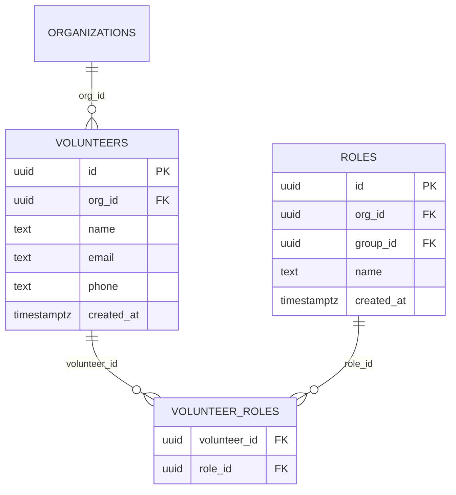
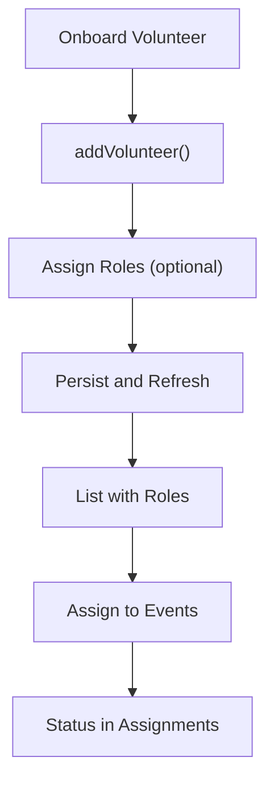
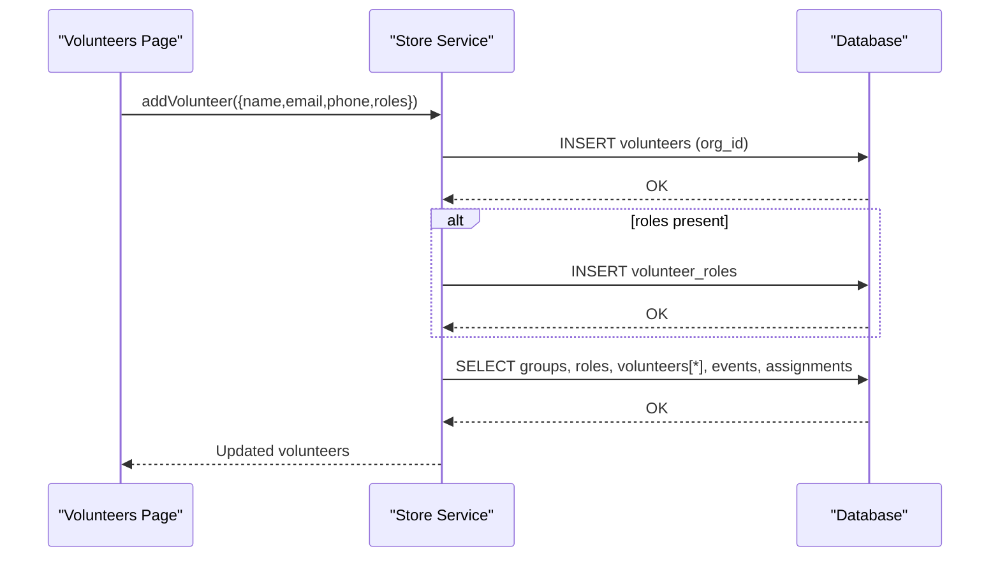
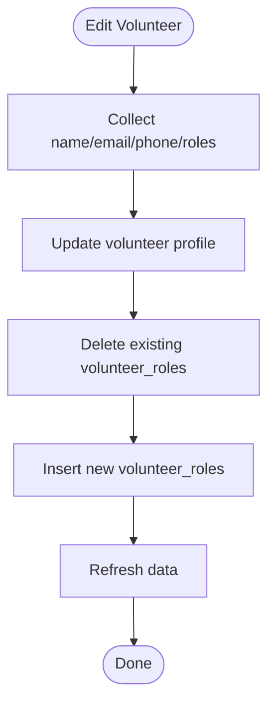
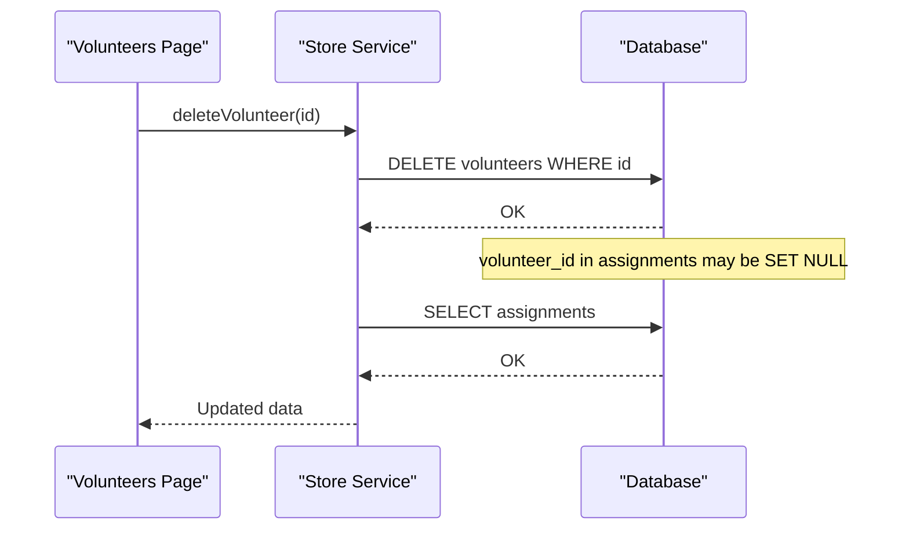
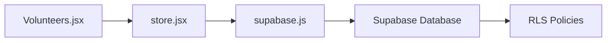

# Volunteer CRUD Operations

<cite>
**Referenced Files in This Document**
- [Volunteers.jsx](file://src/pages/Volunteers.jsx)
- [store.jsx](file://src/services/store.jsx)
- [supabase.js](file://src/services/supabase.js)
- [supabase-schema.sql](file://supabase-schema.sql)
- [Schedule.jsx](file://src/pages/Schedule.jsx)
</cite>

## Table of Contents
1. [Introduction](#introduction)
2. [Project Structure](#project-structure)
3. [Core Components](#core-components)
4. [Architecture Overview](#architecture-overview)
5. [Detailed Component Analysis](#detailed-component-analysis)
6. [Dependency Analysis](#dependency-analysis)
7. [Performance Considerations](#performance-considerations)
8. [Troubleshooting Guide](#troubleshooting-guide)
9. [Conclusion](#conclusion)

## Introduction
This document explains volunteer CRUD operations in RosterFlow, focusing on the volunteers table and related workflows. It covers create, read, update, and delete operations; onboarding processes; contact information management; volunteer status tracking; query patterns for listing and searching; availability checks via assignments; import/export functionality; and data validation rules enforced by the frontend and backend.

## Project Structure
Volunteer management is implemented in a React page component that integrates with a centralized store service. The store service communicates with Supabase for persistence and enforces row-level security policies at the database level. The volunteers table is part of a broader schema that includes organizations, groups, roles, events, and assignments.

**Diagram sources**
- [Volunteers.jsx](file://src/pages/Volunteers.jsx#L1-L354)
- [store.jsx](file://src/services/store.jsx#L1-L662)
- [supabase.js](file://src/services/supabase.js#L1-L13)
- [supabase-schema.sql](file://supabase-schema.sql#L1-L251)

**Section sources**
- [Volunteers.jsx](file://src/pages/Volunteers.jsx#L1-L354)
- [store.jsx](file://src/services/store.jsx#L1-L662)
- [supabase.js](file://src/services/supabase.js#L1-L13)
- [supabase-schema.sql](file://supabase-schema.sql#L1-L251)

## Core Components
- Volunteers Page: Provides the UI for listing, searching, editing, and deleting volunteers, plus importing volunteers from CSV.
- Store Service: Centralizes data fetching, transformations, and CRUD operations against Supabase. Handles organization-scoped queries and many-to-many volunteer-role relationships.
- Supabase Client: Initializes the Supabase connection using environment variables.
- Database Schema: Defines the volunteers table, volunteer_roles junction table, and RLS policies ensuring data isolation per organization.

Key responsibilities:
- Create: Adds a volunteer record and associated role relationships.
- Read: Loads volunteers with role associations and supports client-side filtering.
- Update: Updates volunteer profile and replaces role associations atomically.
- Delete: Removes a volunteer; the database cascade handles dependent role associations.
- Import: Reads CSV files and bulk adds volunteers with basic validation.
- Export: Not implemented in the current codebase; only CSV import is present.

**Section sources**
- [Volunteers.jsx](file://src/pages/Volunteers.jsx#L1-L354)
- [store.jsx](file://src/services/store.jsx#L245-L346)
- [supabase.js](file://src/services/supabase.js#L1-L13)
- [supabase-schema.sql](file://supabase-schema.sql#L40-L55)

## Architecture Overview
The volunteer lifecycle flows through the UI to the store service, which executes Supabase queries. Organization scoping is enforced by:
- Frontend: The store loads only data where the current user’s organization ID matches records.
- Backend: Supabase RLS policies restrict visibility and mutations to the user’s organization.

**Diagram sources**
- [Volunteers.jsx](file://src/pages/Volunteers.jsx#L1-L354)
- [store.jsx](file://src/services/store.jsx#L133-L166)
- [supabase.js](file://src/services/supabase.js#L1-L13)
- [supabase-schema.sql](file://supabase-schema.sql#L155-L170)

## Detailed Component Analysis

### Volunteers Page (UI)
Responsibilities:
- Render volunteer list with contact info and role badges.
- Filter volunteers by name or email.
- Edit volunteer details and role associations.
- Delete volunteers with confirmation.
- Import volunteers from CSV with basic validation.

Implementation highlights:
- Filtering: Client-side filter on name and email.
- Editing: Opens modal with pre-filled form; toggles roles via checkboxes grouped by group.
- Import: Validates CSV headers and adds volunteers in bulk.

**Diagram sources**
- [Volunteers.jsx](file://src/pages/Volunteers.jsx#L15-L121)

**Section sources**
- [Volunteers.jsx](file://src/pages/Volunteers.jsx#L1-L354)

### Store Service (CRUD and Data Loading)
Responsibilities:
- Load all domain data in parallel: groups, roles, volunteers, events, assignments.
- Transform volunteer records to include role IDs from the volunteer_roles junction.
- Provide add/update/delete functions for volunteers.
- Enforce organization scoping via org_id on inserts and RLS policies.

Key operations:
- addVolunteer: Inserts volunteer and then inserts role associations.
- updateVolunteer: Updates volunteer profile and replaces role associations by deleting old and inserting new.
- deleteVolunteer: Deletes a volunteer; cascading rules handle role associations.
- loadAllData: Queries volunteers with volunteer_roles embedded and transforms to role arrays.

**Diagram sources**
- [store.jsx](file://src/services/store.jsx#L245-L346)
- [supabase-schema.sql](file://supabase-schema.sql#L50-L55)

**Section sources**
- [store.jsx](file://src/services/store.jsx#L133-L166)
- [store.jsx](file://src/services/store.jsx#L245-L346)

### Database Schema (volunteers and relationships)
Schema highlights:
- volunteers: id, org_id, name, email, phone, created_at.
- volunteer_roles: junction table for many-to-many volunteer-role associations.
- RLS policies: enforce per-organization access for volunteers and volunteer_roles.

**Diagram sources**
- [supabase-schema.sql](file://supabase-schema.sql#L40-L55)
- [supabase-schema.sql](file://supabase-schema.sql#L31-L38)

**Section sources**
- [supabase-schema.sql](file://supabase-schema.sql#L40-L55)
- [supabase-schema.sql](file://supabase-schema.sql#L155-L170)

### Volunteer Onboarding, Contact Management, Status Tracking
- Onboarding: Add new volunteers via the UI; optionally assign roles during creation.
- Contact info: name, email, and phone are editable; displayed in the list with icons.
- Status tracking: Volunteer status is tracked via the assignments table. The assignments table includes a status field with allowed values and links volunteers to events and roles.

**Diagram sources**
- [store.jsx](file://src/services/store.jsx#L245-L288)
- [supabase-schema.sql](file://supabase-schema.sql#67-L76)

**Section sources**
- [store.jsx](file://src/services/store.jsx#L245-L346)
- [supabase-schema.sql](file://supabase-schema.sql#L67-L76)

### Query Patterns and Examples
- Volunteer listing with organization context:
  - The store loads volunteers with embedded role associations and orders by name.
  - Example path: [loadAllData() volunteers query](file://src/services/store.jsx#L140)
- Volunteer search with filters:
  - Client-side filter by name or email in the Volunteers page.
  - Example path: [filter logic](file://src/pages/Volunteers.jsx#L15-L18)
- Group membership filtering:
  - Roles are grouped by group in the edit modal; filtering occurs in the UI.
  - Example path: [grouped roles rendering](file://src/pages/Volunteers.jsx#L289-L311)
- Role assignment lookups:
  - Role names are resolved from the roles collection using role IDs.
  - Example path: [role name lookup](file://src/pages/Volunteers.jsx#L20)

Note: Availability checking is not implemented as a dedicated query in the current codebase. Availability can be inferred from assignments where a volunteer is linked to an event/role.

**Section sources**
- [store.jsx](file://src/services/store.jsx#L133-L166)
- [Volunteers.jsx](file://src/pages/Volunteers.jsx#L15-L18)
- [Volunteers.jsx](file://src/pages/Volunteers.jsx#L289-L311)
- [Volunteers.jsx](file://src/pages/Volunteers.jsx#L20)

### Volunteer Creation with Profile Associations
- Creation process:
  - The UI collects name, email, phone, and selected roles.
  - The store inserts the volunteer and then inserts role associations.
- Profile associations:
  - Profiles are separate from volunteers; volunteers are organization-scoped and role-associated via volunteer_roles.

**Diagram sources**
- [Volunteers.jsx](file://src/pages/Volunteers.jsx#L56-L63)
- [store.jsx](file://src/services/store.jsx#L245-L288)
- [supabase-schema.sql](file://supabase-schema.sql#L50-L55)

**Section sources**
- [Volunteers.jsx](file://src/pages/Volunteers.jsx#L45-L66)
- [store.jsx](file://src/services/store.jsx#L245-L288)

### Volunteer Updates for Contact Changes
- Updating contact info:
  - The UI submits name, email, phone, and roles; the store updates the volunteer and replaces role associations.
- Role updates:
  - The store deletes existing volunteer_roles entries and inserts new ones based on the submitted roles.

**Diagram sources**
- [Volunteers.jsx](file://src/pages/Volunteers.jsx#L49-L55)
- [store.jsx](file://src/services/store.jsx#L290-L327)

**Section sources**
- [Volunteers.jsx](file://src/pages/Volunteers.jsx#L49-L55)
- [store.jsx](file://src/services/store.jsx#L290-L327)

### Volunteer Deletion with Assignment Cleanup
- Deletion:
  - The UI triggers deleteVolunteer; the store deletes the volunteer.
- Assignment cleanup:
  - The assignments table has a volunteer_id column that can be set to NULL when a volunteer is deleted (SET NULL on delete), preventing orphaned assignments while preserving historical records.

**Diagram sources**
- [Volunteers.jsx](file://src/pages/Volunteers.jsx#L33-L36)
- [store.jsx](file://src/services/store.jsx#L329-L346)
- [supabase-schema.sql](file://supabase-schema.sql#L72-L74)

**Section sources**
- [Volunteers.jsx](file://src/pages/Volunteers.jsx#L33-L36)
- [store.jsx](file://src/services/store.jsx#L329-L346)
- [supabase-schema.sql](file://supabase-schema.sql#L72-L74)

### Volunteer Import/Export Functionality
- Import:
  - CSV import is supported with a header validator requiring "Name" and "Email".
  - Example path: [CSV import handler](file://src/pages/Volunteers.jsx#L77-L121)
- Export:
  - No export functionality is implemented in the current codebase.

**Section sources**
- [Volunteers.jsx](file://src/pages/Volunteers.jsx#L77-L121)

### Data Validation Rules
- Frontend validation:
  - Required fields: name and email when submitting the form.
  - CSV import requires "Name" and "Email" headers.
- Backend validation:
  - Database constraints: volunteers.name is NOT NULL; volunteers.email and phone are optional.
  - RLS policies ensure organization scoping for volunteers and volunteer_roles.

**Section sources**
- [Volunteers.jsx](file://src/pages/Volunteers.jsx#L47)
- [Volunteers.jsx](file://src/pages/Volunteers.jsx#L91-L94)
- [supabase-schema.sql](file://supabase-schema.sql#L44-L46)
- [supabase-schema.sql](file://supabase-schema.sql#L155-L170)

## Dependency Analysis
- UI depends on the store for data and actions.
- Store depends on Supabase client for database operations.
- Supabase client depends on environment variables for initialization.
- Database depends on RLS policies for organization scoping.

**Diagram sources**
- [Volunteers.jsx](file://src/pages/Volunteers.jsx#L1-L354)
- [store.jsx](file://src/services/store.jsx#L1-L662)
- [supabase.js](file://src/services/supabase.js#L1-L13)
- [supabase-schema.sql](file://supabase-schema.sql#L155-L170)

**Section sources**
- [Volunteers.jsx](file://src/pages/Volunteers.jsx#L1-L354)
- [store.jsx](file://src/services/store.jsx#L1-L662)
- [supabase.js](file://src/services/supabase.js#L1-L13)
- [supabase-schema.sql](file://supabase-schema.sql#L155-L170)

## Performance Considerations
- Parallel data loading: The store fetches groups, roles, volunteers, events, and assignments concurrently to reduce latency.
- Client-side filtering: Filtering volunteers by name or email occurs in memory; consider server-side filtering for very large datasets.
- Bulk import: CSV parsing happens in memory; large files may impact responsiveness.

[No sources needed since this section provides general guidance]

## Troubleshooting Guide
- Supabase environment variables missing:
  - The client logs a warning if VITE_SUPABASE_URL or VITE_SUPABASE_ANON_KEY are not set.
  - Example path: [environment check](file://src/services/supabase.js#L6-L8)
- Errors during volunteer operations:
  - The store logs errors when adding/updating/deleting volunteers and throws exceptions for UI handling.
  - Example path: [error logging in add/update/delete](file://src/services/store.jsx#L270-L273), (file://src/services/store.jsx#L303-L306), (file://src/services/store.jsx#L340-L343)
- CSV import issues:
  - Missing required headers cause an alert; ensure CSV contains "Name" and "Email".
  - Example path: [header validation](file://src/pages/Volunteers.jsx#L91-L94)

**Section sources**
- [supabase.js](file://src/services/supabase.js#L6-L8)
- [store.jsx](file://src/services/store.jsx#L270-L273)
- [store.jsx](file://src/services/store.jsx#L303-L306)
- [store.jsx](file://src/services/store.jsx#L340-L343)
- [Volunteers.jsx](file://src/pages/Volunteers.jsx#L91-L94)

## Conclusion
RosterFlow implements robust volunteer CRUD operations with organization-scoped data isolation via Supabase RLS. The Volunteers page provides a practical interface for managing contacts, roles, and onboarding, while the store service centralizes data access and transformations. Availability tracking is supported through the assignments table, and import functionality enables efficient onboarding from CSV. Export is not currently implemented. The system balances frontend UX with backend enforcement to maintain data integrity and security.