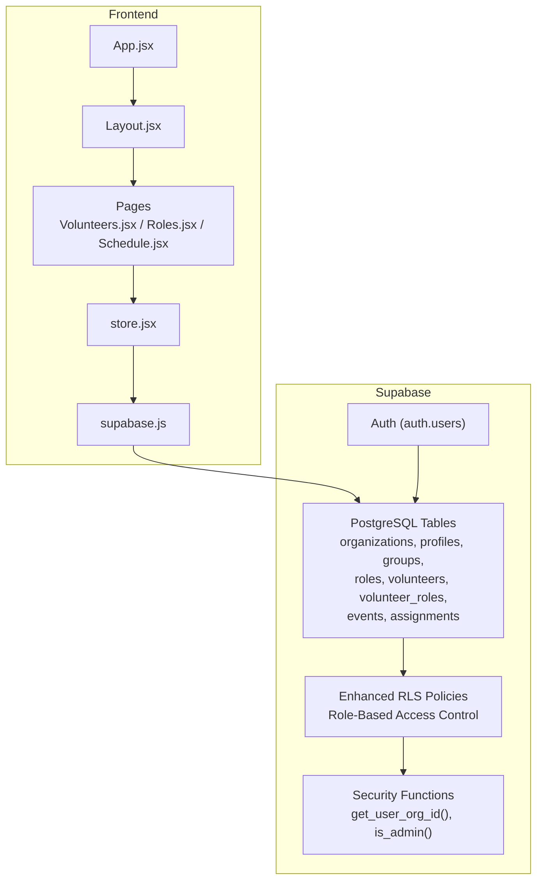
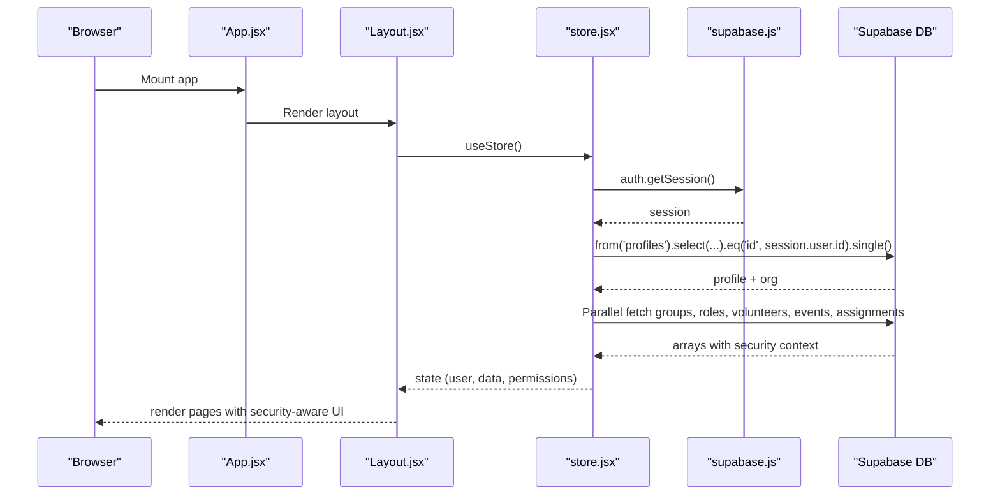
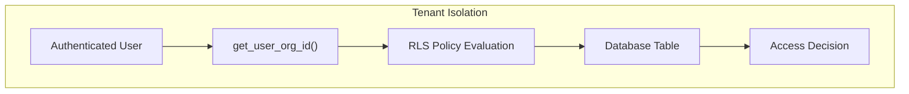
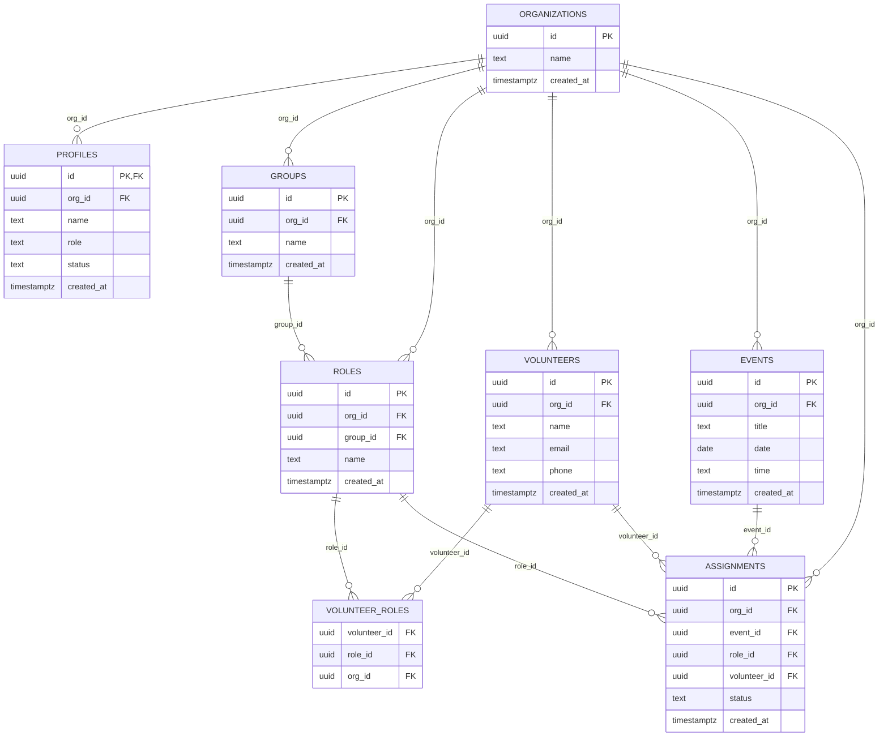
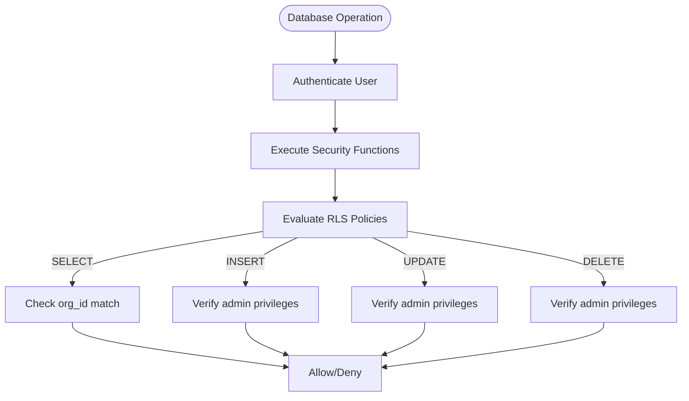
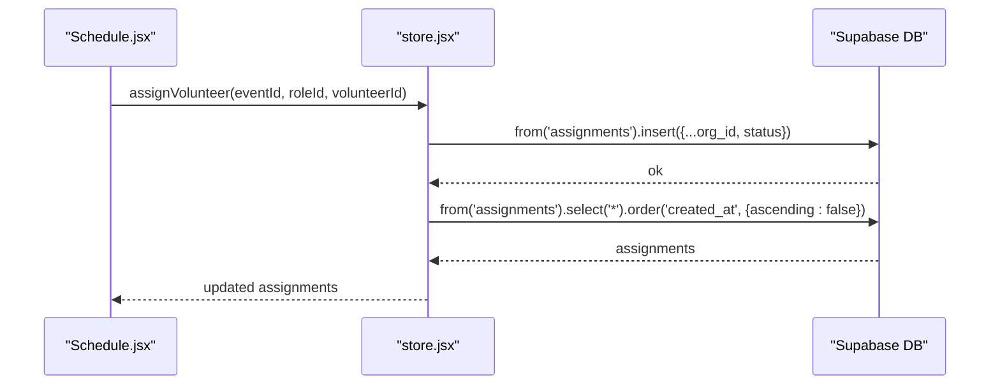
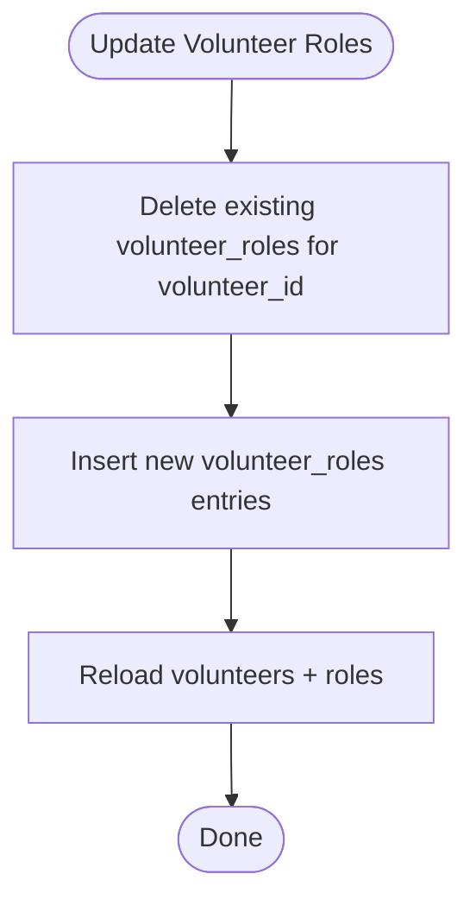
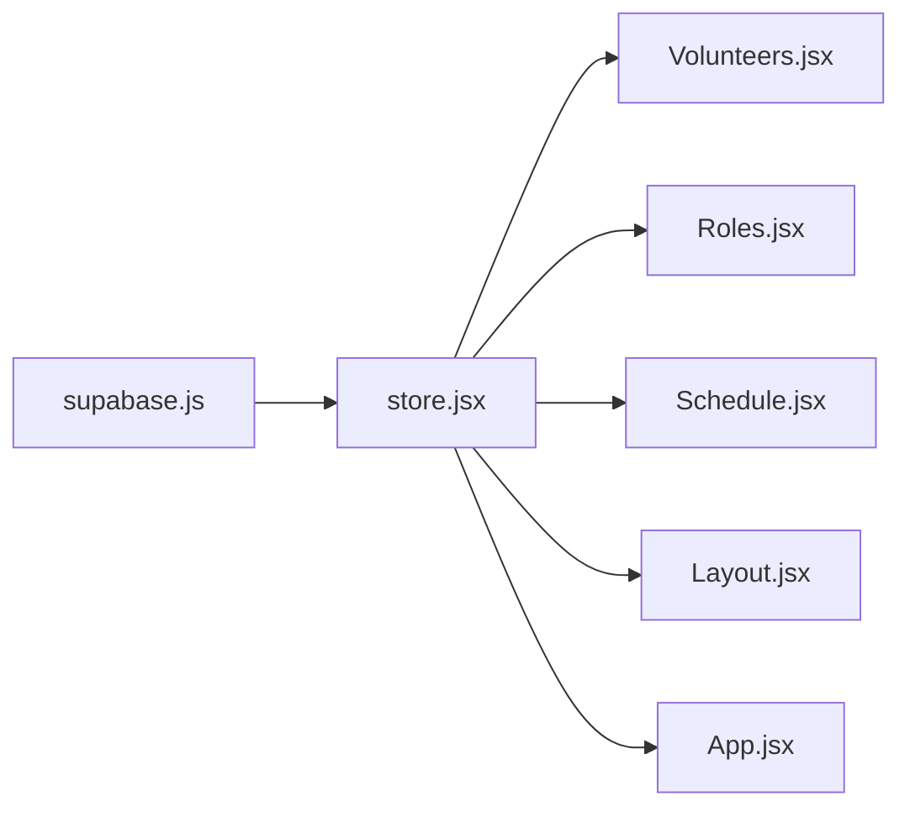

# Database API

<cite>
**Referenced Files in This Document**
- [supabase-schema.sql](file://supabase-schema.sql)
- [supabase-role-policies.sql](file://supabase-role-policies.sql)
- [store.jsx](file://src/services/store.jsx)
- [supabase.js](file://src/services/supabase.js)
- [Volunteers.jsx](file://src/pages/Volunteers.jsx)
- [Roles.jsx](file://src/pages/Roles.jsx)
- [Schedule.jsx](file://src/pages/Schedule.jsx)
- [Layout.jsx](file://src/components/Layout.jsx)
- [App.jsx](file://src/App.jsx)
</cite>

## Update Summary
**Changes Made**
- Enhanced Row Level Security (RLS) policies documentation with comprehensive security model
- Added detailed coverage of role-based access control (RBAC) implementation
- Updated security enforcement mechanisms for all core database tables
- Expanded authentication and authorization flow documentation
- Added comprehensive policy evaluation examples and security considerations

## Table of Contents
1. [Introduction](#introduction)
2. [Project Structure](#project-structure)
3. [Core Components](#core-components)
4. [Architecture Overview](#architecture-overview)
5. [Enhanced Security Model](#enhanced-security-model)
6. [Detailed Component Analysis](#detailed-component-analysis)
7. [Dependency Analysis](#dependency-analysis)
8. [Performance Considerations](#performance-considerations)
9. [Troubleshooting Guide](#troubleshooting-guide)
10. [Conclusion](#conclusion)
11. [Appendices](#appendices)

## Introduction
This document provides comprehensive database API documentation for RosterFlow's Supabase integration. It covers the database schema, relationships, enhanced Row Level Security (RLS) policies, role-based access control (RBAC), CRUD operations, query patterns, filtering, sorting, pagination, and real-time behavior. The system implements a comprehensive security model with tenant isolation, role-based permissions, and fine-grained access controls across all core tables.

## Project Structure
RosterFlow is a React application that integrates with Supabase for authentication and relational data. The database schema is defined in two SQL scripts: the main schema and comprehensive RLS policies. The frontend interacts with Supabase through a centralized store service with robust authentication state management and security enforcement.

**Diagram sources**
- [App.jsx:13-34](file://src/App.jsx#L13-L34)
- [Layout.jsx:14-107](file://src/components/Layout.jsx#L14-L107)
- [store.jsx:6-467](file://src/services/store.jsx#L6-L467)
- [supabase.js:1-13](file://src/services/supabase.js#L1-L13)
- [supabase-schema.sql:1-286](file://supabase-schema.sql#L1-L286)
- [supabase-role-policies.sql:1-269](file://supabase-role-policies.sql#L1-L269)

**Section sources**
- [App.jsx:1-37](file://src/App.jsx#L1-L37)
- [Layout.jsx:1-108](file://src/components/Layout.jsx#L1-L108)
- [store.jsx:1-472](file://src/services/store.jsx#L1-L472)
- [supabase.js:1-13](file://src/services/supabase.js#L1-L13)
- [supabase-schema.sql:1-286](file://supabase-schema.sql#L1-L286)
- [supabase-role-policies.sql:1-269](file://supabase-role-policies.sql#L1-L269)

## Core Components
- Supabase client initialization with comprehensive environment validation
- Centralized store managing authentication state, organization context, and secure CRUD operations
- Role-based access control system with admin/member permissions
- Page components orchestrating UI interactions with security-aware data mutations

Key responsibilities:
- Supabase client: Provides authenticated client access with error handling and environment validation
- Store: Implements comprehensive security checks, manages auth state, performs secure CRUD operations, and refreshes data after mutations
- Pages: Implement UI logic with security awareness and delegate data operations to the store

**Section sources**
- [supabase.js:1-37](file://src/services/supabase.js#L1-L37)
- [store.jsx:6-467](file://src/services/store.jsx#L6-L467)
- [Volunteers.jsx:1-354](file://src/pages/Volunteers.jsx#L1-L354)
- [Roles.jsx:1-386](file://src/pages/Roles.jsx#L1-L386)
- [Schedule.jsx:1-731](file://src/pages/Schedule.jsx#L1-L731)

## Architecture Overview
The application follows a reactive pattern with comprehensive security enforcement:
- On auth state change, the store validates user profile and organization
- Data is fetched in parallel with security context
- All writes trigger comprehensive validation and reload to maintain security
- Role-based access control determines UI capabilities and data access

**Diagram sources**
- [store.jsx:21-111](file://src/services/store.jsx#L21-L111)
- [supabase.js:1-13](file://src/services/supabase.js#L1-L13)

**Section sources**
- [store.jsx:21-111](file://src/services/store.jsx#L21-L111)
- [supabase.js:1-13](file://src/services/supabase.js#L1-L13)

## Enhanced Security Model

### Comprehensive Row Level Security (RLS) Implementation

The system implements a sophisticated security model with tenant isolation and role-based access control:

#### Core Security Functions

**get_user_org_id()**: Resolves the current authenticated user's organization ID
- Returns org_id from profiles table where id = auth.uid()
- Used as the primary tenant isolation mechanism

**is_admin()**: Checks if current user has administrative privileges
- Returns boolean based on profile.role = 'admin'
- Used for write operations and sensitive data access

#### Tenant Isolation Strategy

All tables implement comprehensive RLS policies with tenant isolation:

**Diagram sources**
- [supabase-schema.sql:96-105](file://supabase-schema.sql#L96-L105)
- [supabase-role-policies.sql:16-27](file://supabase-role-policies.sql#L16-L27)

#### Role-Based Access Control (RBAC)

**Admin Users (role = 'admin')**:
- Full read/write access to all organization data
- Can manage profiles, organizations, and system settings
- Can perform administrative operations across all tables

**Member Users (role = 'member')**:
- Read-only access to organization data
- Limited write access to specific tables (primarily volunteers)
- Cannot modify organizational structure or other users

**Anonymous Users**:
- Minimal access for organization listing during registration
- Limited to public organization data

#### Table-Level Security Policies

**Profiles Table**:
- View: Users can only view profiles in their organization
- Insert: Only users can insert their own profile
- Update: Only admins can update profiles (for role/status changes)
- Delete: Only admins can delete profiles

**Volunteers Table**:
- View: Everyone in organization can view volunteers
- Insert: Only admins can create volunteers
- Update: Only admins can modify volunteer information
- Delete: Only admins can remove volunteers

**Events Table**:
- View: Organization members can view events
- Insert: Only admins can create events
- Update: Only admins can modify events
- Delete: Only admins can delete events

**Assignments Table**:
- View: Organization members can view assignments
- Insert: Only admins can create assignments
- Update: Only admins can modify assignments
- Delete: Only admins can delete assignments

**Roles Table**:
- View: Organization members can view roles
- Insert: Only admins can create roles
- Update: Only admins can modify roles
- Delete: Only admins can delete roles

**Groups Table**:
- View: Organization members can view groups
- Insert: Only admins can create groups
- Update: Only admins can modify groups
- Delete: Only admins can delete groups

**Organizations Table**:
- View: Users can view their own organization
- Insert: Registration flow allows organization creation
- Update: Only admins can modify organization settings
- Delete: Protected from deletion

**Section sources**
- [supabase-role-policies.sql:4-57](file://supabase-role-policies.sql#L4-L57)
- [supabase-role-policies.sql:63-86](file://supabase-role-policies.sql#L63-L86)
- [supabase-role-policies.sql:92-115](file://supabase-role-policies.sql#L92-L115)
- [supabase-role-policies.sql:121-144](file://supabase-role-policies.sql#L121-L144)
- [supabase-role-policies.sql:149-173](file://supabase-role-policies.sql#L149-L173)
- [supabase-role-policies.sql:179-202](file://supabase-role-policies.sql#L179-L202)
- [supabase-role-policies.sql:208-218](file://supabase-role-policies.sql#L208-L218)

## Detailed Component Analysis

### Database Schema and Relationships
The schema defines comprehensive tenant isolation via organization-scoped tables and enforces RLS across all tables. Many-to-many relationships are modeled explicitly (e.g., volunteer_roles). Triggers assist with automatic org_id population.

**Diagram sources**
- [supabase-schema.sql:7-84](file://supabase-schema.sql#L7-L84)

**Section sources**
- [supabase-schema.sql:7-84](file://supabase-schema.sql#L7-L84)

### Enhanced Row Level Security (RLS) and Tenant Isolation

The enhanced security model implements comprehensive RLS policies with role-based access control:

#### Security Policy Framework

**Function-Based Security**:
- `get_user_org_id()`: Core tenant isolation function
- `is_admin()`: Administrative privilege checker
- Both functions use SECURITY DEFINER for reliable execution

**Comprehensive Policy Coverage**:
- All 8 core tables have dedicated RLS policies
- Select policies allow broad access for organization members
- Insert/update/delete policies restrict to administrative users
- Special handling for organizations table during registration

#### Policy Evaluation Flow

**Diagram sources**
- [supabase-schema.sql:86-253](file://supabase-schema.sql#L86-L253)
- [supabase-role-policies.sql:4-57](file://supabase-role-policies.sql#L4-L57)

**Section sources**
- [supabase-schema.sql:86-286](file://supabase-schema.sql#L86-L286)
- [supabase-role-policies.sql:4-269](file://supabase-role-policies.sql#L4-L269)

### Real-Time Subscriptions
- Auth state subscription: The store subscribes to auth state changes and refreshes data accordingly
- Database subscriptions: There are no explicit Postgres publication/subscription listeners in the current codebase. Data updates are reflected by reloading all tables after mutations

Recommendations:
- For real-time updates, enable Supabase Realtime channels per table and listen for INSERT/UPDATE/DELETE events
- Alternatively, use Supabase's built-in Postgres replication with serverless functions to publish changes to a Pub/Sub topic

**Section sources**
- [store.jsx:28-34](file://src/services/store.jsx#L28-L34)
- [store.jsx:193-242](file://src/services/store.jsx#L193-L242)

### CRUD Operations and Query Patterns

#### Organizations
- Purpose: Root tenant container with registration support
- Typical queries:
  - Select by org_id (via policy)
  - Insert during organization registration flow
  - Registration flow requires special policy allowance
- Constraints: name is required; created_at defaults to now

**Section sources**
- [supabase-schema.sql:7-12](file://supabase-schema.sql#L7-L12)
- [store.jsx:126-159](file://src/services/store.jsx#L126-L159)

#### Profiles
- Purpose: Extends auth.users with org association and role metadata
- Typical queries:
  - Select self by auth.uid()
  - Insert self on sign-up
  - Update self profile
  - Admin updates for role/status changes
- Constraints: role is constrained to admin/member; status constrained to pending/approved/rejected; org_id must match user's org

**Section sources**
- [supabase-schema.sql:14-22](file://supabase-schema.sql#L14-L22)
- [store.jsx:54-68](file://src/services/store.jsx#L54-L68)
- [store.jsx:146-158](file://src/services/store.jsx#L146-L158)

#### Groups
- Purpose: Ministry teams with role organization
- Typical queries:
  - List all groups ordered by name
  - CRUD with org_id enforcement
  - Group-based role organization
- Constraints: name required; org_id required on insert; group_id on roles references groups

**Section sources**
- [supabase-schema.sql:30-36](file://supabase-schema.sql#L30-L36)
- [store.jsx:378-422](file://src/services/store.jsx#L378-L422)

#### Roles
- Purpose: Specific positions within groups with team organization
- Typical queries:
  - List roles ordered by name
  - CRUD with org_id enforcement
  - Group association for team-based organization
- Constraints: name required; org_id required on insert; optional group_id for team association

**Section sources**
- [supabase-schema.sql:38-45](file://supabase-schema.sql#L38-L45)
- [store.jsx:330-375](file://src/services/store.jsx#L330-L375)

#### Volunteers
- Purpose: Team members with role associations
- Typical queries:
  - List volunteers ordered by name
  - CRUD with org_id enforcement
  - Join with volunteer_roles to resolve role memberships
  - Role-based volunteer management
- Constraints: name required; org_id required on insert; role membership managed via volunteer_roles

**Section sources**
- [supabase-schema.sql:47-55](file://supabase-schema.sql#L47-L55)
- [store.jsx:161-242](file://src/services/store.jsx#L161-L242)

#### Volunteer-Roles (Many-to-Many)
- Purpose: Junction table linking volunteers to roles with organization context
- Typical queries:
  - Upsert relationships after volunteer update
  - Enforce org_id containment for inserts/deletes
  - Role membership resolution
- Constraints: composite primary key on (volunteer_id, role_id); org_id on junction table

**Section sources**
- [supabase-schema.sql:57-63](file://supabase-schema.sql#L57-L63)
- [store.jsx:181-225](file://src/services/store.jsx#L181-L225)

#### Events
- Purpose: Scheduled services/events with timing information
- Typical queries:
  - List events ordered by date descending
  - CRUD with org_id enforcement
  - Event-based assignment management
- Constraints: title and date required; org_id required on insert; time optional

**Section sources**
- [supabase-schema.sql:65-73](file://supabase-schema.sql#L65-L73)
- [store.jsx:244-292](file://src/services/store.jsx#L244-L292)

#### Assignments
- Purpose: Volunteer-role assignments for events with status tracking
- Typical queries:
  - List assignments ordered by created_at descending
  - CRUD with org_id enforcement
  - Status constrained to confirmed/pending/declined
  - Event-role-volunteer coordination
- Constraints: event_id, role_id required; optional volunteer_id; org_id required on insert; status enum validation

**Section sources**
- [supabase-schema.sql:75-84](file://supabase-schema.sql#L75-L84)
- [store.jsx:294-328](file://src/services/store.jsx#L294-L328)

### Filtering, Sorting, and Pagination
- Filtering:
  - Equality filters via eq() on id, org_id, and foreign keys
  - Pattern matching via text search on name/email for volunteers
  - Group-based filtering for roles
- Sorting:
  - Order by name for groups/roles/volunteers
  - Order by date desc for events
  - Order by created_at desc for assignments
- Pagination:
  - Not implemented in current code. Use Supabase's range or page-based approaches if needed

**Section sources**
- [store.jsx:82-88](file://src/services/store.jsx#L82-L88)
- [Volunteers.jsx:15-18](file://src/pages/Volunteers.jsx#L15-L18)
- [Schedule.jsx:27-29](file://src/pages/Schedule.jsx#L27-L29)

### Common Workflows and Examples

#### Volunteer Scheduling
- Steps:
  - Create an event (events)
  - Assign volunteers to roles for the event (assignments)
  - Update assignment details (status)
- UI flow:
  - Schedule page renders events and allows role-slot selection
  - Assignments are updated via updateAssignment with security validation

**Diagram sources**
- [Schedule.jsx:37-49](file://src/pages/Schedule.jsx#L37-L49)
- [store.jsx:294-314](file://src/services/store.jsx#L294-L314)

**Section sources**
- [Schedule.jsx:37-49](file://src/pages/Schedule.jsx#L37-L49)
- [store.jsx:294-328](file://src/services/store.jsx#L294-L328)

#### Role Assignments
- Steps:
  - Update volunteer roles by deleting old entries and inserting new ones
  - Ensure org_id containment for volunteer_roles
- UI flow:
  - Volunteers page allows selecting roles grouped by teams
  - Role membership management with security validation

**Diagram sources**
- [Volunteers.jsx:68-75](file://src/pages/Volunteers.jsx#L68-L75)
- [store.jsx:196-227](file://src/services/store.jsx#L196-L227)

**Section sources**
- [Volunteers.jsx:68-75](file://src/pages/Volunteers.jsx#L68-L75)
- [store.jsx:196-227](file://src/services/store.jsx#L196-L227)

#### Ministry Organization Management
- Steps:
  - Create/update/delete groups and roles
  - Assign roles to groups; orphan roles are grouped under "Other"
- UI flow:
  - Roles page organizes roles by team and supports editing/deleting
  - Group management with role organization

**Section sources**
- [Roles.jsx:28-41](file://src/pages/Roles.jsx#L28-L41)
- [store.jsx:330-422](file://src/services/store.jsx#L330-L422)

### Data Validation Rules
- Enum constraints:
  - profiles.role: admin, member
  - profiles.status: pending, approved, rejected
  - assignments.status: confirmed, pending, declined
- Required fields:
  - organizations.name
  - profiles.name, role
  - groups.name
  - roles.name
  - volunteers.name
  - events.title, date
  - assignments.event_id, role_id
- Foreign keys:
  - org_id on groups, roles, volunteers, events, assignments
  - group_id on roles (nullable)
  - volunteer_id on assignments (nullable)
  - volunteer_roles junction table with org_id

**Section sources**
- [supabase-schema.sql:18-20](file://supabase-schema.sql#L18-L20)
- [supabase-schema.sql:34-37](file://supabase-schema.sql#L34-L37)
- [supabase-schema.sql:43-47](file://supabase-schema.sql#L43-L47)
- [supabase-schema.sql:59-64](file://supabase-schema.sql#L59-L64)
- [supabase-schema.sql:70-74](file://supabase-schema.sql#L70-L74)

### Indexing Strategies and Performance
Current code does not define custom indexes. Recommended indexes for frequent queries:
- profiles(id) — primary key
- profiles(org_id) — for org-scoped selects
- volunteers(org_id) — for org-scoped selects
- events(org_id, date) — for date-range queries
- assignments(org_id, event_id, role_id) — for join-heavy reporting
- volunteer_roles(volunteer_id, role_id) — for membership queries

These would improve performance for:
- Listing records by org_id
- Join-heavy schedules and reports
- Role membership resolution

### Complex Queries (Joins and Aggregations)
Examples of typical complex queries (described):
- Volunteer schedule summary:
  - Join assignments with events, roles, and volunteers
  - Group by event and role to compute coverage
- Role coverage metrics:
  - Count assigned vs total required slots per event
- Team assignments:
  - Join assignments with groups via areaId and designatedRoleId

## Dependency Analysis
- Frontend depends on Supabase client for auth and database operations with comprehensive security
- Store coordinates auth state, organization context, and secure CRUD operations
- Pages depend on store for data and actions with role-based UI capabilities

**Diagram sources**
- [supabase.js:1-13](file://src/services/supabase.js#L1-L13)
- [store.jsx:1-472](file://src/services/store.jsx#L1-L472)
- [Volunteers.jsx:1-354](file://src/pages/Volunteers.jsx#L1-L354)
- [Roles.jsx:1-386](file://src/pages/Roles.jsx#L1-L386)
- [Schedule.jsx:1-731](file://src/pages/Schedule.jsx#L1-L731)
- [Layout.jsx:1-108](file://src/components/Layout.jsx#L1-L108)
- [App.jsx:1-37](file://src/App.jsx#L1-L37)

**Section sources**
- [supabase.js:1-13](file://src/services/supabase.js#L1-L13)
- [store.jsx:1-472](file://src/services/store.jsx#L1-L472)
- [App.jsx:1-37](file://src/App.jsx#L1-L37)

## Performance Considerations
- Prefer equality filters on org_id for fast tenant isolation
- Use targeted selects with order by clauses to minimize payload
- Batch operations where possible (e.g., reload all data after mutation)
- Consider adding indexes for frequently joined columns (see previous section)
- Leverage Supabase's built-in RLS for efficient tenant isolation

## Troubleshooting Guide
- Environment variables:
  - Ensure VITE_SUPABASE_URL and VITE_SUPABASE_ANON_KEY are configured; otherwise, a warning is logged
- Auth state:
  - Auth subscription triggers data reloads; verify session exists before mutating data
- Mutations:
  - After insert/update/delete, the store reloads all data to reflect changes
- Security errors:
  - RLS denials occur if org_id mismatches or user lacks required privileges
  - Role-based access errors indicate insufficient permissions
  - Constraint violations arise from missing required fields or invalid enums
- Registration flow:
  - Organizations table has special policies allowing initial creation during registration

**Section sources**
- [supabase.js:6-8](file://src/services/supabase.js#L6-L8)
- [store.jsx:21-52](file://src/services/store.jsx#L21-L52)
- [store.jsx:193-242](file://src/services/store.jsx#L193-L242)
- [supabase-role-policies.sql:208-218](file://supabase-role-policies.sql#L208-L218)

## Conclusion
RosterFlow's Supabase integration centers around a strict tenant model with comprehensive security enforcement through enhanced RLS policies and role-based access control. The system implements a sophisticated security framework with tenant isolation, administrative privileges, and fine-grained access controls across all core tables. The schema supports ministry organization, volunteer scheduling, and role assignments with clear constraints and relationships. Real-time updates are not currently implemented in the frontend; enabling Supabase Realtime channels would enhance responsiveness. With proper indexing and targeted queries, the system scales effectively for small to medium-sized churches while maintaining robust security and compliance.

## Appendices

### Appendix A: Environment Variables
- VITE_SUPABASE_URL
- VITE_SUPABASE_ANON_KEY

**Section sources**
- [supabase.js:3-4](file://src/services/supabase.js#L3-L4)

### Appendix B: Security Function Reference
- `get_user_org_id()`: Returns current user's organization ID for tenant isolation
- `is_admin()`: Returns boolean indicating administrative privileges

**Section sources**
- [supabase-schema.sql:96-105](file://supabase-schema.sql#L96-L105)
- [supabase-role-policies.sql:5-14](file://supabase-role-policies.sql#L5-L14)