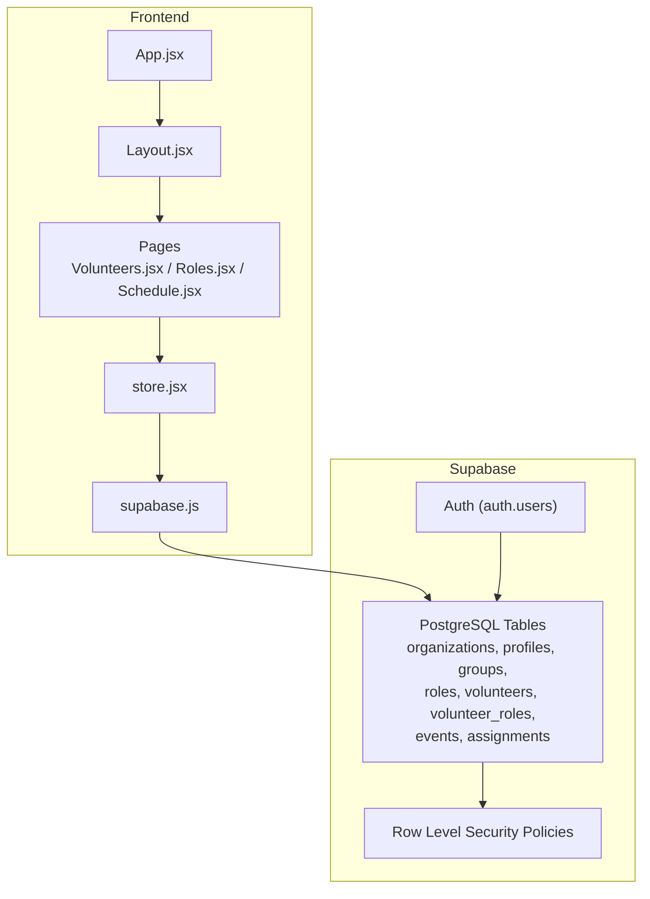
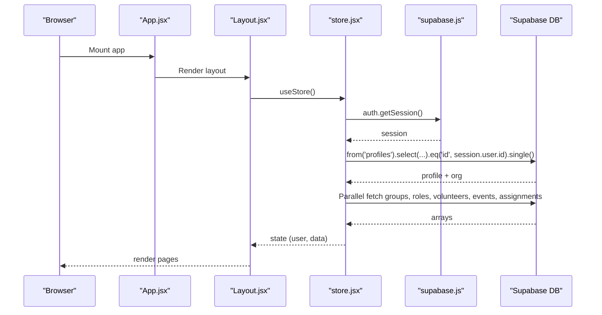
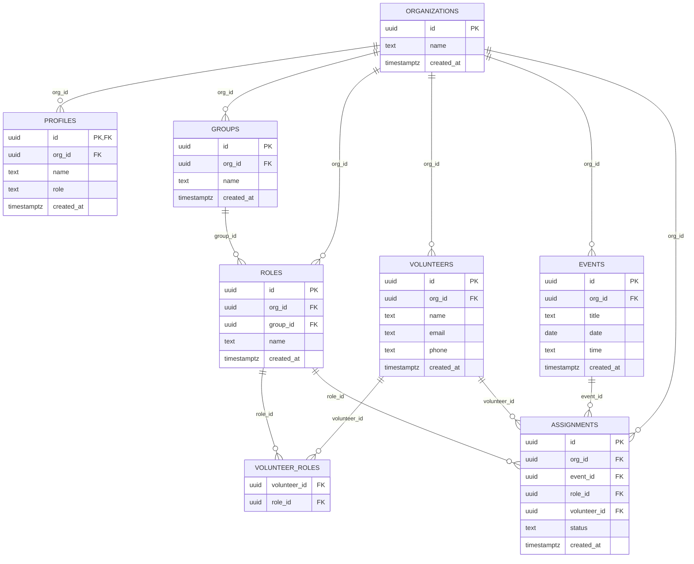
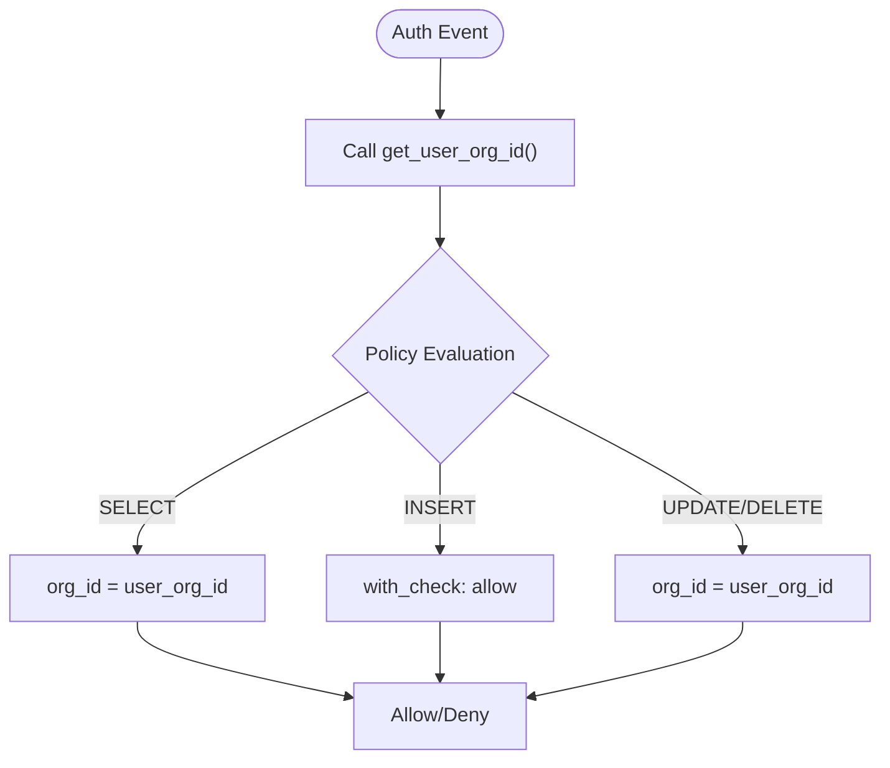
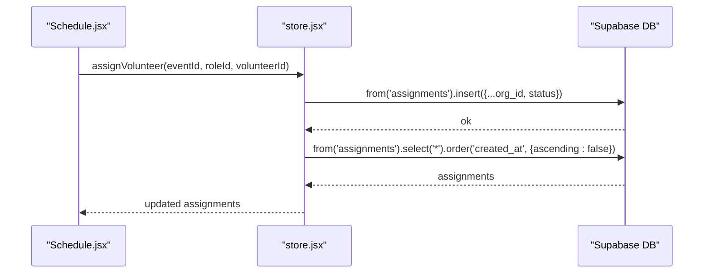
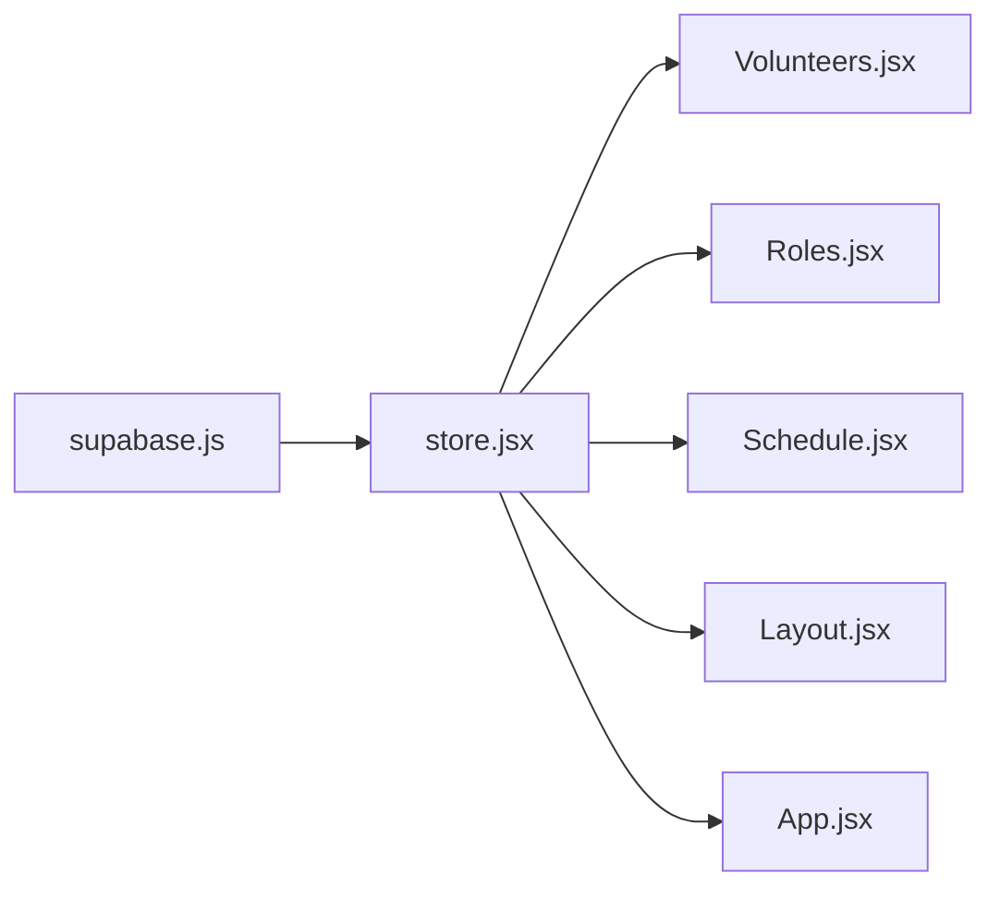

# Database API

<cite>
**Referenced Files in This Document**
- [supabase-schema.sql](file://supabase-schema.sql)
- [store.jsx](file://src/services/store.jsx)
- [supabase.js](file://src/services/supabase.js)
- [Volunteers.jsx](file://src/pages/Volunteers.jsx)
- [Roles.jsx](file://src/pages/Roles.jsx)
- [Schedule.jsx](file://src/pages/Schedule.jsx)
- [Layout.jsx](file://src/components/Layout.jsx)
- [App.jsx](file://src/App.jsx)
</cite>

## Table of Contents
1. [Introduction](#introduction)
2. [Project Structure](#project-structure)
3. [Core Components](#core-components)
4. [Architecture Overview](#architecture-overview)
5. [Detailed Component Analysis](#detailed-component-analysis)
6. [Dependency Analysis](#dependency-analysis)
7. [Performance Considerations](#performance-considerations)
8. [Troubleshooting Guide](#troubleshooting-guide)
9. [Conclusion](#conclusion)
10. [Appendices](#appendices)

## Introduction
This document provides comprehensive database API documentation for RosterFlow’s Supabase integration. It covers the database schema, relationships, Row Level Security (RLS) policies, CRUD operations, query patterns, filtering, sorting, pagination, and real-time behavior. It also includes practical examples for common operations such as volunteer scheduling, role assignments, and ministry organization management.

## Project Structure
RosterFlow is a React application that integrates with Supabase for authentication and relational data. The database schema is defined in a single SQL script, and the frontend interacts with Supabase through a centralized store service. Authentication state changes trigger data reloads, and CRUD actions are performed via Supabase client methods.

**Diagram sources**
- [App.jsx](file://src/App.jsx#L13-L34)
- [Layout.jsx](file://src/components/Layout.jsx#L14-L107)
- [store.jsx](file://src/services/store.jsx#L6-L467)
- [supabase.js](file://src/services/supabase.js#L1-L13)
- [supabase-schema.sql](file://supabase-schema.sql#L1-L251)

**Section sources**
- [App.jsx](file://src/App.jsx#L1-L37)
- [Layout.jsx](file://src/components/Layout.jsx#L1-L108)
- [store.jsx](file://src/services/store.jsx#L1-L472)
- [supabase.js](file://src/services/supabase.js#L1-L13)
- [supabase-schema.sql](file://supabase-schema.sql#L1-L251)

## Core Components
- Supabase client initialization and environment configuration.
- Centralized store managing authentication state, organization context, and CRUD operations.
- Page components orchestrating UI interactions and delegating data mutations to the store.

Key responsibilities:
- Supabase client: Provides authenticated client access to Supabase services.
- Store: Loads profile and organization, initializes auth listeners, performs CRUD operations, and refreshes data after mutations.
- Pages: Implement UI logic and delegate data operations to the store.

**Section sources**
- [supabase.js](file://src/services/supabase.js#L1-L13)
- [store.jsx](file://src/services/store.jsx#L6-L467)
- [Volunteers.jsx](file://src/pages/Volunteers.jsx#L1-L354)
- [Roles.jsx](file://src/pages/Roles.jsx#L1-L386)
- [Schedule.jsx](file://src/pages/Schedule.jsx#L1-L731)

## Architecture Overview
The application follows a reactive pattern:
- On auth state change, the store loads the user’s profile and organization.
- Data is fetched in parallel for groups, roles, volunteers, events, and assignments.
- All writes trigger a reload to reflect changes consistently.

**Diagram sources**
- [store.jsx](file://src/services/store.jsx#L21-L111)
- [supabase.js](file://src/services/supabase.js#L1-L13)

**Section sources**
- [store.jsx](file://src/services/store.jsx#L21-L111)
- [supabase.js](file://src/services/supabase.js#L1-L13)

## Detailed Component Analysis

### Database Schema and Relationships
The schema defines tenant isolation via organization-scoped tables and enforces RLS. Many-to-many relationships are modeled explicitly (e.g., volunteer_roles). Triggers assist with automatic org_id population.

**Diagram sources**
- [supabase-schema.sql](file://supabase-schema.sql#L7-L76)

**Section sources**
- [supabase-schema.sql](file://supabase-schema.sql#L7-L76)

### Row Level Security (RLS) and Tenant Isolation
RLS policies ensure each user can only access data within their organization. A helper function resolves the current user’s org_id, and policies use it for enforcement.

- Function: get_user_org_id() returns the org_id for the authenticated user.
- Policies:
  - SELECT: users can only view records where org_id equals get_user_org_id().
  - INSERT: with_check conditions allow controlled creation; application logic sets org_id.
  - UPDATE/DELETE: scoped to records within the user’s org_id.

**Diagram sources**
- [supabase-schema.sql](file://supabase-schema.sql#L88-L251)

**Section sources**
- [supabase-schema.sql](file://supabase-schema.sql#L88-L251)

### Real-Time Subscriptions
- Auth state subscription: The store subscribes to auth state changes and refreshes data accordingly.
- Database subscriptions: There are no explicit Postgres publication/subscription listeners in the current codebase. Data updates are reflected by reloading all tables after mutations.

Recommendations:
- For real-time updates, enable Supabase Realtime channels per table and listen for INSERT/UPDATE/DELETE events.
- Alternatively, use Supabase’s built-in Postgres replication with serverless functions to publish changes to a Pub/Sub topic.

**Section sources**
- [store.jsx](file://src/services/store.jsx#L28-L34)
- [store.jsx](file://src/services/store.jsx#L193-L242)

### CRUD Operations and Query Patterns

#### Organizations
- Purpose: Root tenant container.
- Typical queries:
  - Select by org_id (via policy).
  - Insert during organization registration flow.
- Constraints: name is required; created_at defaults to now.

**Section sources**
- [supabase-schema.sql](file://supabase-schema.sql#L7-L12)
- [store.jsx](file://src/services/store.jsx#L126-L159)

#### Profiles
- Purpose: Extends auth.users with org association and role metadata.
- Typical queries:
  - Select self by auth.uid().
  - Insert self on sign-up.
  - Update self profile.
- Constraints: role is constrained to admin/member; org_id must match user’s org.

**Section sources**
- [supabase-schema.sql](file://supabase-schema.sql#L14-L21)
- [store.jsx](file://src/services/store.jsx#L54-L68)
- [store.jsx](file://src/services/store.jsx#L146-L158)

#### Groups
- Purpose: Ministry teams.
- Typical queries:
  - List all groups ordered by name.
  - CRUD with org_id enforcement.
- Constraints: name required; org_id required on insert.

**Section sources**
- [supabase-schema.sql](file://supabase-schema.sql#L23-L29)
- [store.jsx](file://src/services/store.jsx#L378-L422)

#### Roles
- Purpose: Specific positions within groups.
- Typical queries:
  - List roles ordered by name.
  - CRUD with org_id enforcement.
- Constraints: name required; org_id required on insert; optional group_id.

**Section sources**
- [supabase-schema.sql](file://supabase-schema.sql#L31-L38)
- [store.jsx](file://src/services/store.jsx#L330-L375)

#### Volunteers
- Purpose: Team members.
- Typical queries:
  - List volunteers ordered by name.
  - CRUD with org_id enforcement.
  - Join with volunteer_roles to resolve role memberships.
- Constraints: name required; org_id required on insert.

**Section sources**
- [supabase-schema.sql](file://supabase-schema.sql#L40-L48)
- [store.jsx](file://src/services/store.jsx#L161-L242)

#### Volunteer-Roles (Many-to-Many)
- Purpose: Junction table linking volunteers to roles.
- Typical queries:
  - Upsert relationships after volunteer update.
  - Enforce org_id containment for inserts/deletes.
- Constraints: composite primary key on (volunteer_id, role_id).

**Section sources**
- [supabase-schema.sql](file://supabase-schema.sql#L50-L55)
- [store.jsx](file://src/services/store.jsx#L181-L225)

#### Events
- Purpose: Scheduled services/events.
- Typical queries:
  - List events ordered by date descending.
  - CRUD with org_id enforcement.
- Constraints: title and date required; org_id required on insert.

**Section sources**
- [supabase-schema.sql](file://supabase-schema.sql#L57-L65)
- [store.jsx](file://src/services/store.jsx#L244-L292)

#### Assignments
- Purpose: Volunteer-role assignments for events.
- Typical queries:
  - List assignments ordered by created_at descending.
  - CRUD with org_id enforcement.
  - Status constrained to confirmed/pending/declined.
- Constraints: event_id, role_id required; optional volunteer_id; org_id required on insert.

**Section sources**
- [supabase-schema.sql](file://supabase-schema.sql#L67-L76)
- [store.jsx](file://src/services/store.jsx#L294-L328)

### Filtering, Sorting, and Pagination
- Filtering:
  - Equality filters via eq() on id, org_id, and foreign keys.
  - Pattern matching via text search on name/email for volunteers.
- Sorting:
  - Order by name for groups/roles/volunteers.
  - Order by date desc for events.
  - Order by created_at desc for assignments.
- Pagination:
  - Not implemented in current code. Use Supabase’s range or page-based approaches if needed.

**Section sources**
- [store.jsx](file://src/services/store.jsx#L82-L88)
- [Volunteers.jsx](file://src/pages/Volunteers.jsx#L15-L18)
- [Schedule.jsx](file://src/pages/Schedule.jsx#L27-L29)

### Common Workflows and Examples

#### Volunteer Scheduling
- Steps:
  - Create an event (events).
  - Assign volunteers to roles for the event (assignments).
  - Update assignment details (areaId, designatedRoleId).
- UI flow:
  - Schedule page renders events and allows role-slot selection.
  - Assignments are updated via updateAssignment.

**Diagram sources**
- [Schedule.jsx](file://src/pages/Schedule.jsx#L37-L49)
- [store.jsx](file://src/services/store.jsx#L294-L314)

**Section sources**
- [Schedule.jsx](file://src/pages/Schedule.jsx#L37-L49)
- [store.jsx](file://src/services/store.jsx#L294-L328)

#### Role Assignments
- Steps:
  - Update volunteer roles by deleting old entries and inserting new ones.
  - Ensure org_id containment for volunteer_roles.
- UI flow:
  - Volunteers page allows selecting roles grouped by teams.

**Diagram sources**
- [Volunteers.jsx](file://src/pages/Volunteers.jsx#L68-L75)
- [store.jsx](file://src/services/store.jsx#L196-L227)

**Section sources**
- [Volunteers.jsx](file://src/pages/Volunteers.jsx#L68-L75)
- [store.jsx](file://src/services/store.jsx#L196-L227)

#### Ministry Organization Management
- Steps:
  - Create/update/delete groups and roles.
  - Assign roles to groups; orphan roles are grouped under “Other”.
- UI flow:
  - Roles page organizes roles by team and supports editing/deleting.

**Section sources**
- [Roles.jsx](file://src/pages/Roles.jsx#L28-L41)
- [store.jsx](file://src/services/store.jsx#L330-L422)

### Data Validation Rules
- Enum constraints:
  - profiles.role: admin, member
  - assignments.status: confirmed, pending, declined
- Required fields:
  - organizations.name
  - profiles.name, role
  - groups.name
  - roles.name
  - volunteers.name
  - events.title, date
  - assignments.event_id, role_id
- Foreign keys:
  - org_id on groups, roles, volunteers, events, assignments
  - group_id on roles (nullable)
  - volunteer_id on assignments (nullable)

**Section sources**
- [supabase-schema.sql](file://supabase-schema.sql#L18-L20)
- [supabase-schema.sql](file://supabase-schema.sql#L34-L37)
- [supabase-schema.sql](file://supabase-schema.sql#L43-L47)
- [supabase-schema.sql](file://supabase-schema.sql#L59-L64)
- [supabase-schema.sql](file://supabase-schema.sql#L70-L74)

### Indexing Strategies and Performance
Current code does not define custom indexes. Recommended indexes for frequent queries:
- profiles(id) — primary key
- profiles(org_id) — for org-scoped selects
- volunteers(org_id) — for org-scoped selects
- events(org_id, date) — for date-range queries
- assignments(org_id, event_id, role_id) — for join-heavy reporting
- volunteer_roles(volunteer_id, role_id) — for membership queries

These would improve performance for:
- Listing records by org_id
- Join-heavy schedules and reports
- Role membership resolution

[No sources needed since this section provides general guidance]

### Complex Queries (Joins and Aggregations)
Examples of typical complex queries (described):
- Volunteer schedule summary:
  - Join assignments with events, roles, and volunteers.
  - Group by event and role to compute coverage.
- Role coverage metrics:
  - Count assigned vs total required slots per event.
- Team assignments:
  - Join assignments with groups via areaId and designatedRoleId.

[No sources needed since this section provides general guidance]

## Dependency Analysis
- Frontend depends on Supabase client for auth and database operations.
- Store coordinates auth state, organization context, and CRUD operations.
- Pages depend on store for data and actions.

**Diagram sources**
- [supabase.js](file://src/services/supabase.js#L1-L13)
- [store.jsx](file://src/services/store.jsx#L1-L472)
- [Volunteers.jsx](file://src/pages/Volunteers.jsx#L1-L354)
- [Roles.jsx](file://src/pages/Roles.jsx#L1-L386)
- [Schedule.jsx](file://src/pages/Schedule.jsx#L1-L731)
- [Layout.jsx](file://src/components/Layout.jsx#L1-L108)
- [App.jsx](file://src/App.jsx#L1-L37)

**Section sources**
- [supabase.js](file://src/services/supabase.js#L1-L13)
- [store.jsx](file://src/services/store.jsx#L1-L472)
- [App.jsx](file://src/App.jsx#L1-L37)

## Performance Considerations
- Prefer equality filters on org_id for fast tenant isolation.
- Use targeted selects with order by clauses to minimize payload.
- Batch operations where possible (e.g., reload all data after mutation).
- Consider adding indexes for frequently joined columns (see previous section).

[No sources needed since this section provides general guidance]

## Troubleshooting Guide
- Environment variables:
  - Ensure VITE_SUPABASE_URL and VITE_SUPABASE_ANON_KEY are configured; otherwise, a warning is logged.
- Auth state:
  - Auth subscription triggers data reloads; verify session exists before mutating data.
- Mutations:
  - After insert/update/delete, the store reloads all data to reflect changes.
- Common errors:
  - RLS denials occur if org_id mismatches.
  - Constraint violations arise from missing required fields or invalid enums.

**Section sources**
- [supabase.js](file://src/services/supabase.js#L6-L8)
- [store.jsx](file://src/services/store.jsx#L21-L52)
- [store.jsx](file://src/services/store.jsx#L193-L242)

## Conclusion
RosterFlow’s Supabase integration centers around a strict tenant model enforced by RLS and a centralized store that handles auth, organization context, and CRUD operations. The schema supports ministry organization, volunteer scheduling, and role assignments with clear constraints and relationships. Real-time updates are not currently implemented in the frontend; enabling Supabase Realtime channels would enhance responsiveness. With proper indexing and targeted queries, the system scales effectively for small to medium-sized churches.

## Appendices

### Appendix A: Environment Variables
- VITE_SUPABASE_URL
- VITE_SUPABASE_ANON_KEY

**Section sources**
- [supabase.js](file://src/services/supabase.js#L3-L4)