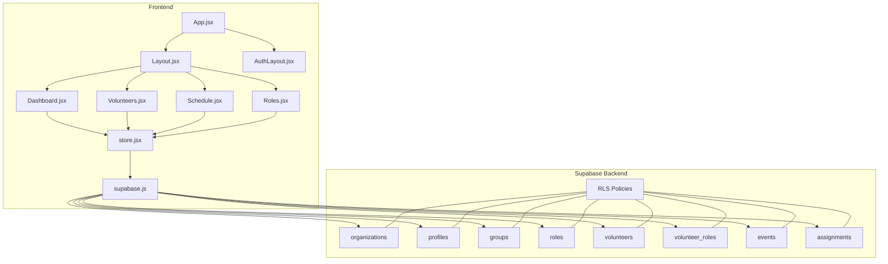
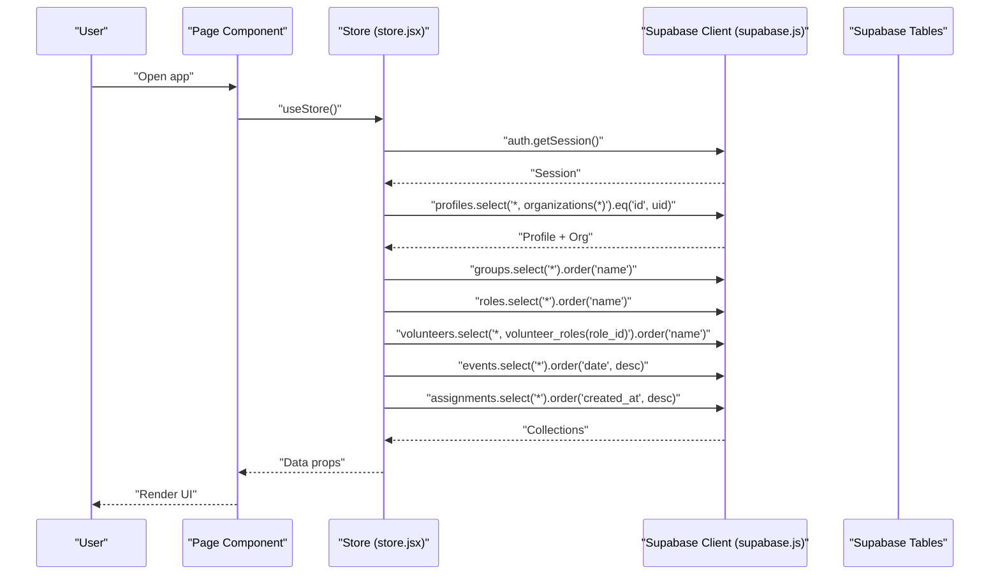
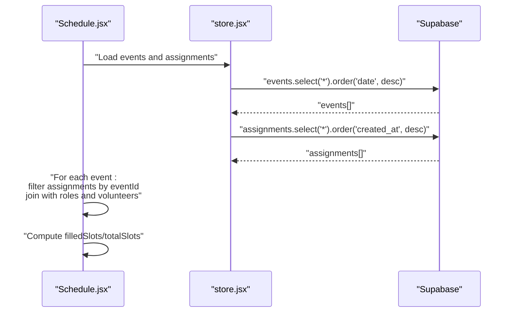
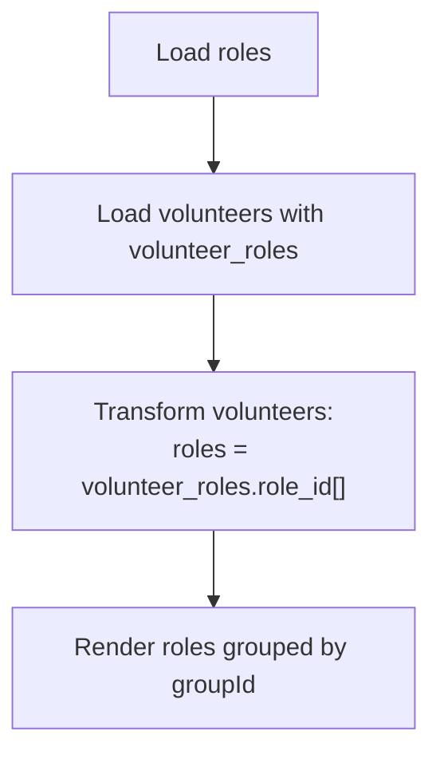
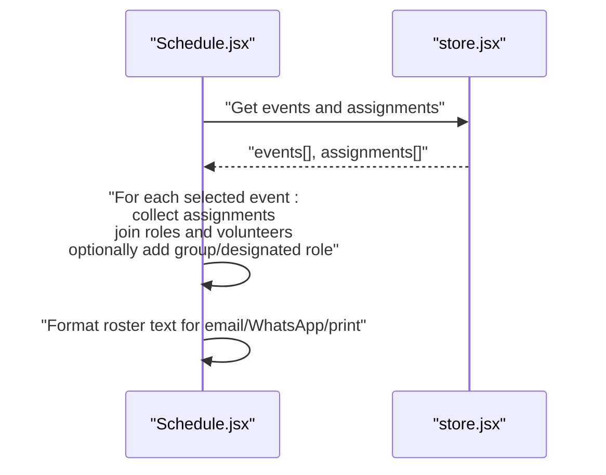
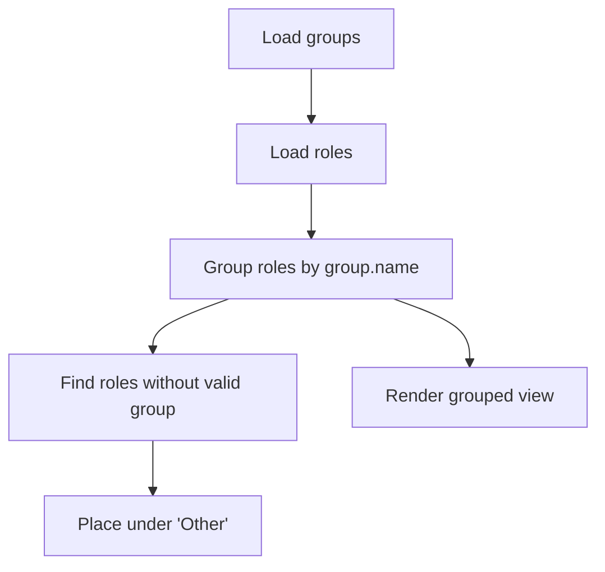
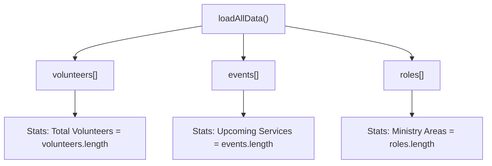
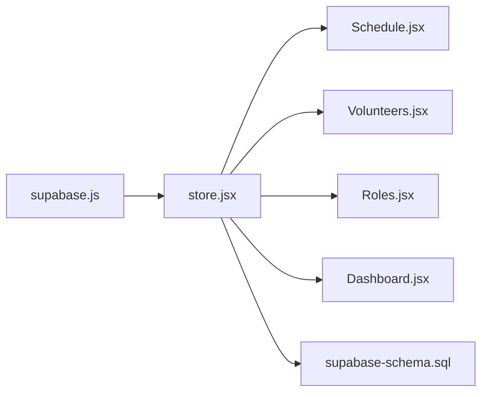
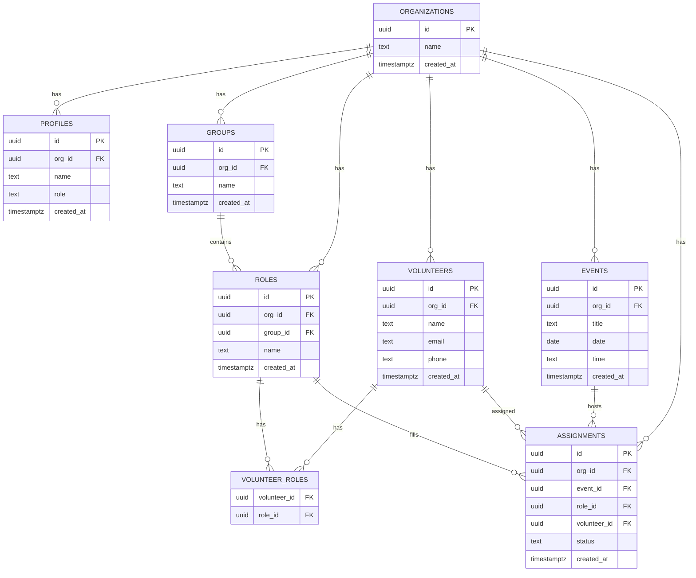

# Query Patterns

<cite>
**Referenced Files in This Document**
- [supabase-schema.sql](file://supabase-schema.sql)
- [store.jsx](file://src/services/store.jsx)
- [supabase.js](file://src/services/supabase.js)
- [Schedule.jsx](file://src/pages/Schedule.jsx)
- [Volunteers.jsx](file://src/pages/Volunteers.jsx)
- [Roles.jsx](file://src/pages/Roles.jsx)
- [Dashboard.jsx](file://src/pages/Dashboard.jsx)
- [App.jsx](file://src/App.jsx)
</cite>

## Table of Contents
1. [Introduction](#introduction)
2. [Project Structure](#project-structure)
3. [Core Components](#core-components)
4. [Architecture Overview](#architecture-overview)
5. [Detailed Component Analysis](#detailed-component-analysis)
6. [Dependency Analysis](#dependency-analysis)
7. [Performance Considerations](#performance-considerations)
8. [Troubleshooting Guide](#troubleshooting-guide)
9. [Conclusion](#conclusion)
10. [Appendices](#appendices)

## Introduction
This document catalogs the common query patterns used throughout RosterFlow. It focuses on how the frontend interacts with the Supabase backend to support volunteer scheduling, role assignment lookups, event planning reports, and ministry organization views. It explains join strategies, filtering patterns scoped to the user’s organization, aggregation-style computations performed client-side, and recommended performance optimizations. It also provides examples of dashboard queries, export operations, and administrative reporting queries.

## Project Structure
RosterFlow is a React application that integrates with Supabase for authentication and data persistence. The store module orchestrates data fetching and transformations, while page components render UI and drive user actions. The Supabase schema defines the relational model and Row Level Security (RLS) policies.

**Diagram sources**
- [App.jsx](file://src/App.jsx#L13-L34)
- [store.jsx](file://src/services/store.jsx#L133-L166)
- [supabase.js](file://src/services/supabase.js#L1-L13)
- [supabase-schema.sql](file://supabase-schema.sql#L7-L251)

**Section sources**
- [App.jsx](file://src/App.jsx#L1-L37)
- [store.jsx](file://src/services/store.jsx#L133-L166)
- [supabase.js](file://src/services/supabase.js#L1-L13)
- [supabase-schema.sql](file://supabase-schema.sql#L1-L251)

## Core Components
- Supabase client initialization and environment configuration
- Centralized store for authentication state, organization context, and all domain collections
- Page components that render lists, forms, and actions, delegating data operations to the store

Key responsibilities:
- Authentication and session lifecycle
- Organization-scoped data loading and caching
- CRUD operations against Supabase tables
- Client-side joins and aggregations for UI rendering

**Section sources**
- [supabase.js](file://src/services/supabase.js#L1-L13)
- [store.jsx](file://src/services/store.jsx#L39-L107)
- [store.jsx](file://src/services/store.jsx#L133-L166)
- [store.jsx](file://src/services/store.jsx#L245-L346)
- [store.jsx](file://src/services/store.jsx#L348-L417)
- [store.jsx](file://src/services/store.jsx#L419-L453)
- [store.jsx](file://src/services/store.jsx#L455-L500)
- [store.jsx](file://src/services/store.jsx#L502-L547)

## Architecture Overview
RosterFlow follows a thin-client pattern:
- The store fetches organization-scoped data from Supabase using RLS-protected tables.
- Client-side transformations convert many-to-many relationships into denormalized arrays for convenient rendering.
- UI components orchestrate user interactions and delegate persistence to the store.

**Diagram sources**
- [store.jsx](file://src/services/store.jsx#L109-L123)
- [store.jsx](file://src/services/store.jsx#L133-L166)

## Detailed Component Analysis

### Volunteer Scheduling Queries
Volunteer scheduling involves:
- Loading events and assignments
- Joining assignments to roles and volunteers
- Filtering by organization and date ranges
- Aggregating counts for progress indicators

Common patterns:
- Fetch all events ordered by date descending
- Fetch all assignments ordered by created_at descending
- Client-side join assignments to roles and volunteers
- Filter assignments by event ID for a given event
- Compute filled slots vs required slots for progress bars

**Diagram sources**
- [store.jsx](file://src/services/store.jsx#L137-L142)
- [Schedule.jsx](file://src/pages/Schedule.jsx#L27-L32)
- [Schedule.jsx](file://src/pages/Schedule.jsx#L326-L332)

**Section sources**
- [store.jsx](file://src/services/store.jsx#L133-L166)
- [Schedule.jsx](file://src/pages/Schedule.jsx#L27-L32)
- [Schedule.jsx](file://src/pages/Schedule.jsx#L326-L332)
- [Schedule.jsx](file://src/pages/Schedule.jsx#L391-L410)

### Role Assignment Lookups
Role assignment lookups combine:
- Roles table for role metadata
- Volunteer-Roles junction for many-to-many relationships
- Volunteers for contact details

Patterns:
- Fetch roles ordered by name
- Fetch volunteers with embedded role IDs from the junction table
- Client-side transform to expand roles per volunteer
- Filter roles by group for display grouping

**Diagram sources**
- [store.jsx](file://src/services/store.jsx#L137-L142)
- [store.jsx](file://src/services/store.jsx#L151-L159)
- [Volunteers.jsx](file://src/pages/Volunteers.jsx#L288-L331)
- [Roles.jsx](file://src/pages/Roles.jsx#L28-L41)

**Section sources**
- [store.jsx](file://src/services/store.jsx#L137-L142)
- [store.jsx](file://src/services/store.jsx#L151-L159)
- [Volunteers.jsx](file://src/pages/Volunteers.jsx#L288-L331)
- [Roles.jsx](file://src/pages/Roles.jsx#L28-L41)

### Event Planning Reports
Event planning reports involve:
- Aggregating assignments per event
- Rendering rosters with role names, volunteer names, and optional area/designated role details
- Export-like operations (formatting for email, WhatsApp, or print)

Patterns:
- For selected events, collect assignments and join with roles and volunteers
- Optionally enrich with group and designated role details
- Format text for sharing or printing

**Diagram sources**
- [store.jsx](file://src/services/store.jsx#L137-L142)
- [Schedule.jsx](file://src/pages/Schedule.jsx#L193-L230)
- [Schedule.jsx](file://src/pages/Schedule.jsx#L231-L303)

**Section sources**
- [store.jsx](file://src/services/store.jsx#L137-L142)
- [Schedule.jsx](file://src/pages/Schedule.jsx#L193-L230)
- [Schedule.jsx](file://src/pages/Schedule.jsx#L231-L303)

### Ministry Organization Views
Ministry organization views include:
- Teams/groups management
- Roles grouped by teams
- Volunteers grouped by roles

Patterns:
- Fetch groups and roles
- Group roles by group name
- Render orphan roles under “Other” when group is missing or invalid
- Provide add/edit/delete operations scoped to organization

**Diagram sources**
- [store.jsx](file://src/services/store.jsx#L137-L139)
- [Roles.jsx](file://src/pages/Roles.jsx#L28-L41)

**Section sources**
- [store.jsx](file://src/services/store.jsx#L137-L139)
- [Roles.jsx](file://src/pages/Roles.jsx#L28-L41)

### Dashboard Queries
Dashboard statistics rely on:
- Counting volunteers, events, and roles from loaded collections
- Displaying quick stats cards

Patterns:
- Use length of volunteers array for total volunteers
- Use length of events array for upcoming services
- Use length of roles array for ministry areas

**Diagram sources**
- [store.jsx](file://src/services/store.jsx#L133-L166)
- [Dashboard.jsx](file://src/pages/Dashboard.jsx#L24-L28)

**Section sources**
- [store.jsx](file://src/services/store.jsx#L133-L166)
- [Dashboard.jsx](file://src/pages/Dashboard.jsx#L24-L28)

## Dependency Analysis
- The store depends on the Supabase client initialized in the dedicated module.
- Page components depend on the store for data and actions.
- Supabase tables define the data model and RLS policies that enforce organization scoping.

**Diagram sources**
- [supabase.js](file://src/services/supabase.js#L1-L13)
- [store.jsx](file://src/services/store.jsx#L1-L4)
- [Schedule.jsx](file://src/pages/Schedule.jsx#L1-L10)
- [Volunteers.jsx](file://src/pages/Volunteers.jsx#L1-L10)
- [Roles.jsx](file://src/pages/Roles.jsx#L1-L10)
- [Dashboard.jsx](file://src/pages/Dashboard.jsx#L1-L10)
- [supabase-schema.sql](file://supabase-schema.sql#L7-L251)

**Section sources**
- [supabase.js](file://src/services/supabase.js#L1-L13)
- [store.jsx](file://src/services/store.jsx#L1-L4)
- [supabase-schema.sql](file://supabase-schema.sql#L7-L251)

## Performance Considerations
- Network efficiency
  - Load all primary collections in parallel during initialization to minimize round trips.
  - Keep queries minimal; avoid unnecessary columns and use ordering to reduce client sorting overhead.
- Client-side computation
  - Transform many-to-many relationships once after fetch to avoid repeated joins in render loops.
  - Use memoization or derived computations for expensive filters/aggregations.
- Pagination and limits
  - For large datasets, consider server-side pagination and limits on event/assignment queries.
- Indexing and RLS
  - Ensure RLS policies are efficient; leverage indexes on commonly filtered columns (e.g., org_id, date).
  - Consider composite indexes for frequent filter-and-sort patterns (e.g., org_id + date on events).
- Caching
  - Reuse fetched collections and invalidate selectively on mutations.
  - Debounce rapid UI filters to avoid repeated recomputation.

[No sources needed since this section provides general guidance]

## Troubleshooting Guide
Common issues and resolutions:
- Missing environment variables
  - Symptom: Supabase client warns about missing URL or anonymous key.
  - Resolution: Set VITE_SUPABASE_URL and VITE_SUPABASE_ANON_KEY in .env.
- Authentication failures
  - Symptom: Login/register errors.
  - Resolution: Verify credentials and network connectivity; check Supabase auth logs.
- Empty or stale data
  - Symptom: UI shows no volunteers/events/roles.
  - Resolution: Ensure organization is loaded and data refresh is triggered after mutations.
- RLS policy violations
  - Symptom: Select/update/delete fails unexpectedly.
  - Resolution: Confirm org_id is set and matches the authenticated user’s organization.

**Section sources**
- [supabase.js](file://src/services/supabase.js#L6-L8)
- [store.jsx](file://src/services/store.jsx#L169-L183)
- [store.jsx](file://src/services/store.jsx#L133-L166)
- [store.jsx](file://src/services/store.jsx#L420-L438)
- [supabase-schema.sql](file://supabase-schema.sql#L78-L251)

## Conclusion
RosterFlow’s query patterns center on organization-scoped reads, client-side joins, and simple aggregations to power scheduling, role management, and reporting views. By leveraging Supabase’s RLS and the store’s centralized data management, the app maintains clean separation of concerns while enabling responsive UIs. Adopting the recommended performance strategies and indexing approaches will help sustain smooth operation as data volumes grow.

[No sources needed since this section summarizes without analyzing specific files]

## Appendices

### Appendix A: Data Model Overview

**Diagram sources**
- [supabase-schema.sql](file://supabase-schema.sql#L7-L76)

### Appendix B: Typical Query Workflows
- Initialization
  - Fetch profiles with organization, then load groups, roles, volunteers, events, and assignments in parallel.
- Scheduling
  - Load events and assignments; compute progress per event by counting required role slots filled.
- Role Management
  - Load groups and roles; group roles by team; show orphan roles separately.
- Volunteers
  - Load volunteers with embedded role IDs; transform to roles array for rendering; apply local filters.

**Section sources**
- [store.jsx](file://src/services/store.jsx#L109-L123)
- [store.jsx](file://src/services/store.jsx#L133-L166)
- [Schedule.jsx](file://src/pages/Schedule.jsx#L326-L332)
- [Roles.jsx](file://src/pages/Roles.jsx#L28-L41)
- [Volunteers.jsx](file://src/pages/Volunteers.jsx#L15-L18)