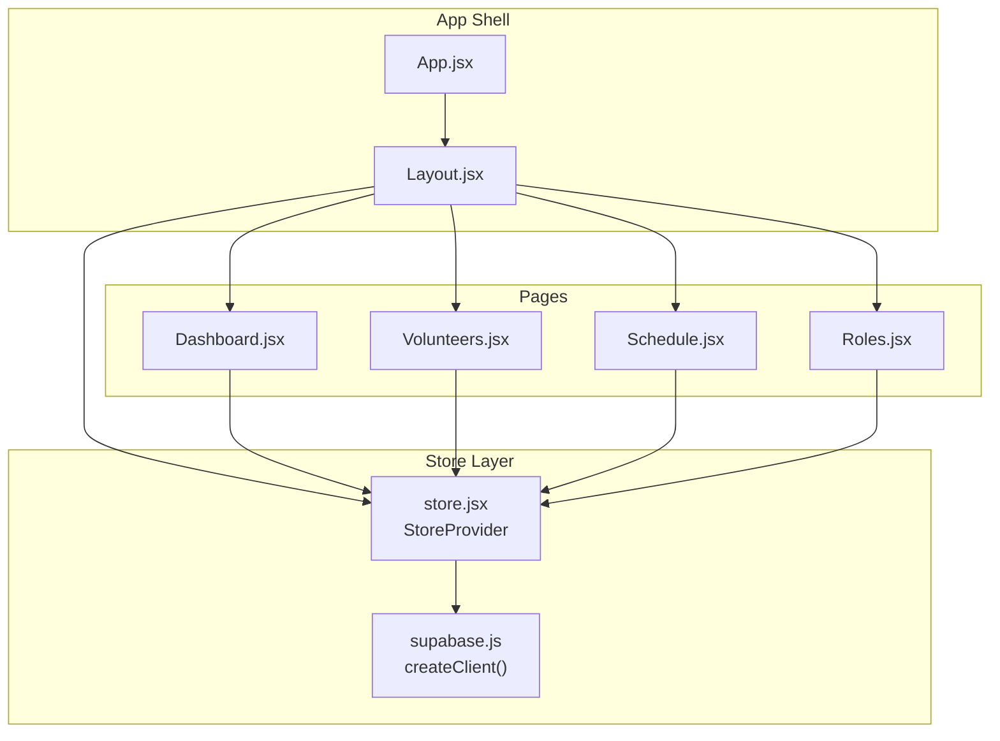
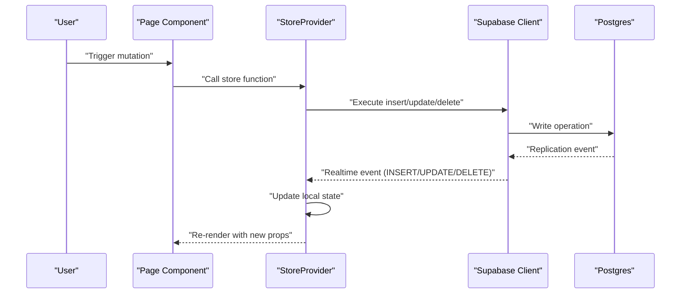
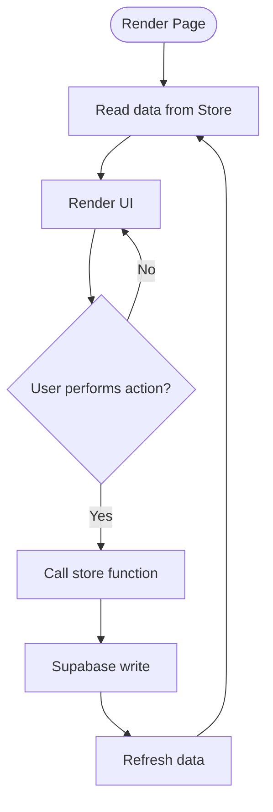
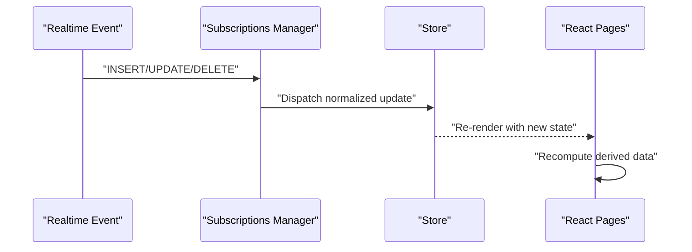
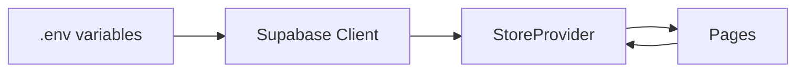

# Real-time Subscriptions

<cite>
**Referenced Files in This Document**
- [src/services/supabase.js](file://src/services/supabase.js)
- [src/services/store.jsx](file://src/services/store.jsx)
- [src/App.jsx](file://src/App.jsx)
- [src/pages/Dashboard.jsx](file://src/pages/Dashboard.jsx)
- [src/pages/Volunteers.jsx](file://src/pages/Volunteers.jsx)
- [src/pages/Schedule.jsx](file://src/pages/Schedule.jsx)
- [src/pages/Roles.jsx](file://src/pages/Roles.jsx)
- [src/components/Layout.jsx](file://src/components/Layout.jsx)
- [supabase-schema.sql](file://supabase-schema.sql)
</cite>

## Table of Contents
1. [Introduction](#introduction)
2. [Project Structure](#project-structure)
3. [Core Components](#core-components)
4. [Architecture Overview](#architecture-overview)
5. [Detailed Component Analysis](#detailed-component-analysis)
6. [Dependency Analysis](#dependency-analysis)
7. [Performance Considerations](#performance-considerations)
8. [Troubleshooting Guide](#troubleshooting-guide)
9. [Conclusion](#conclusion)

## Introduction
This document explains how RosterFlow integrates Supabase Postgres Realtime for real-time data synchronization. It covers how the application initializes Supabase, sets up subscriptions, manages channels and event lifecycles, propagates updates through React components, and handles connection lifecycle and error recovery. It also provides guidance on organizing subscriptions per organization, managing concurrent updates, and optimizing performance.

## Project Structure
RosterFlow is a React application that centralizes data access and real-time updates in a single store provider. Supabase is initialized once and shared across the app. Pages consume data from the store, which internally orchestrates server queries and real-time subscriptions.

**Diagram sources**
- [src/App.jsx](file://src/App.jsx#L13-L34)
- [src/components/Layout.jsx](file://src/components/Layout.jsx#L14-L107)
- [src/services/store.jsx](file://src/services/store.jsx#L39-L571)
- [src/services/supabase.js](file://src/services/supabase.js#L1-L13)
- [src/pages/Dashboard.jsx](file://src/pages/Dashboard.jsx#L21-L89)
- [src/pages/Volunteers.jsx](file://src/pages/Volunteers.jsx#L7-L354)
- [src/pages/Schedule.jsx](file://src/pages/Schedule.jsx#L7-L731)
- [src/pages/Roles.jsx](file://src/pages/Roles.jsx#L6-L386)

**Section sources**
- [src/App.jsx](file://src/App.jsx#L13-L34)
- [src/components/Layout.jsx](file://src/components/Layout.jsx#L14-L107)
- [src/services/store.jsx](file://src/services/store.jsx#L39-L571)
- [src/services/supabase.js](file://src/services/supabase.js#L1-L13)

## Core Components
- Supabase client initialization: Creates a singleton client using environment variables and guards missing configuration.
- Store provider: Centralizes application state, loads initial data, and exposes CRUD functions. It currently does not set up Postgres Realtime subscriptions but is structured to support them.

Key responsibilities:
- Initialize Supabase client and guard missing environment variables.
- Manage authentication state and listen for auth changes.
- Load organization-scoped data in parallel when a profile is available.
- Expose CRUD functions for groups, roles, volunteers, events, and assignments.
- Provide a refresh hook to reload data after mutations.

**Section sources**
- [src/services/supabase.js](file://src/services/supabase.js#L1-L13)
- [src/services/store.jsx](file://src/services/store.jsx#L39-L571)

## Architecture Overview
RosterFlow’s real-time architecture can be layered as follows:
- Supabase client: Provides Postgres Realtime subscriptions and database operations.
- Store provider: Orchestrates data loading, mutation, and subscription management.
- React pages: Consume data from the store and render UI reflecting live updates.

**Diagram sources**
- [src/services/store.jsx](file://src/services/store.jsx#L133-L166)
- [src/services/store.jsx](file://src/services/store.jsx#L246-L346)
- [src/services/store.jsx](file://src/services/store.jsx#L348-L479)
- [src/services/store.jsx](file://src/services/store.jsx#L481-L526)

## Detailed Component Analysis

### Supabase Client Initialization
- Reads Supabase URL and anonymous key from environment variables.
- Warns if environment variables are missing.
- Exports a singleton client instance for use across the app.

Operational implications:
- Environment misconfiguration disables real-time and database features.
- The client supports Postgres Realtime channels and replication events.

**Section sources**
- [src/services/supabase.js](file://src/services/supabase.js#L1-L13)

### Store Provider: Data Loading and Organization Scope
- Loads profile and organization on auth session change.
- On successful profile load, fetches organization-scoped data in parallel:
  - groups
  - roles
  - volunteers (with volunteer_roles joined)
  - events
  - assignments
- Provides CRUD functions that write to the database and then refresh data.

Real-time readiness:
- The store is organized around organization-scoped tables and a user’s org_id.
- This makes it straightforward to scope Postgres Realtime subscriptions to a single organization.

**Section sources**
- [src/services/store.jsx](file://src/services/store.jsx#L54-L99)
- [src/services/store.jsx](file://src/services/store.jsx#L101-L107)
- [src/services/store.jsx](file://src/services/store.jsx#L133-L166)

### Page Components: Consuming Store Data
- Dashboard, Volunteers, Schedule, and Roles pages consume data from the store and render lists and forms.
- They rely on the store to keep UI in sync with backend changes.

**Diagram sources**
- [src/pages/Dashboard.jsx](file://src/pages/Dashboard.jsx#L21-L89)
- [src/pages/Volunteers.jsx](file://src/pages/Volunteers.jsx#L7-L354)
- [src/pages/Schedule.jsx](file://src/pages/Schedule.jsx#L7-L731)
- [src/pages/Roles.jsx](file://src/pages/Roles.jsx#L6-L386)
- [src/services/store.jsx](file://src/services/store.jsx#L246-L346)

**Section sources**
- [src/pages/Dashboard.jsx](file://src/pages/Dashboard.jsx#L21-L89)
- [src/pages/Volunteers.jsx](file://src/pages/Volunteers.jsx#L7-L354)
- [src/pages/Schedule.jsx](file://src/pages/Schedule.jsx#L7-L731)
- [src/pages/Roles.jsx](file://src/pages/Roles.jsx#L6-L386)

### Subscription Setup and Channel Management
Recommended approach for implementing Postgres Realtime subscriptions:
- Create a dedicated subscriptions manager module that:
  - Initializes a single Supabase client instance.
  - Manages a map of active subscriptions keyed by organization ID.
  - Creates channels scoped to the current organization.
  - Registers listeners for INSERT, UPDATE, DELETE events on each relevant table.
  - Handles payload parsing and dispatches normalized updates to the store.

Channel scoping:
- Use organization-scoped tables and filters to ensure events apply to the current user’s organization.
- Example filters: append org_id to WHERE clauses or rely on Row Level Security policies.

Event types:
- INSERT: Add new records to the store.
- UPDATE: Merge partial updates into existing records.
- DELETE: Remove records from the store.

Payload handling:
- Normalize payloads to match the shape used by the store.
- De-duplicate and batch updates to avoid excessive re-renders.

Lifecycle management:
- Create subscriptions when the organization is loaded.
- Unsubscribe when the organization changes or the user logs out.
- Clean up subscriptions on component unmount.

Connection handling and error recovery:
- Implement retry logic with exponential backoff.
- Surface errors to the UI and allow manual refresh.
- Gracefully degrade to polling if Realtime is unavailable.

**Section sources**
- [src/services/store.jsx](file://src/services/store.jsx#L101-L107)
- [supabase-schema.sql](file://supabase-schema.sql#L78-L224)

### Propagation Through Application State
- Store updates trigger React component re-renders.
- Pages subscribe to store state via hooks and recompute derived data (e.g., filtered lists, grouped roles).
- UI reflects real-time changes immediately after the store updates.

**Diagram sources**
- [src/services/store.jsx](file://src/services/store.jsx#L133-L166)

### Concurrent Updates and Conflict Resolution
- Strategies:
  - Optimistic updates: Apply UI changes immediately, then reconcile with server response.
  - Last-write-wins: Accept server state on conflict.
  - Operational transforms: For complex collaborative edits (not applicable here).
- For RosterFlow, optimistic updates followed by refresh are suitable for most mutations.

**Section sources**
- [src/services/store.jsx](file://src/services/store.jsx#L246-L346)
- [src/services/store.jsx](file://src/services/store.jsx#L348-L479)
- [src/services/store.jsx](file://src/services/store.jsx#L481-L526)

### Cleanup and Lifecycle Hooks
- Unsubscribe when:
  - Organization changes.
  - User signs out.
  - Component unmounts.
- Ensure subscriptions are tied to the current org ID and cleaned up when that changes.

**Section sources**
- [src/services/store.jsx](file://src/services/store.jsx#L75-L76)
- [src/services/store.jsx](file://src/services/store.jsx#L94-L98)

## Dependency Analysis
- Supabase client depends on environment variables for configuration.
- Store provider depends on Supabase client for auth and data operations.
- Pages depend on the store for data and actions.

**Diagram sources**
- [src/services/supabase.js](file://src/services/supabase.js#L1-L13)
- [src/services/store.jsx](file://src/services/store.jsx#L39-L571)

**Section sources**
- [src/services/supabase.js](file://src/services/supabase.js#L1-L13)
- [src/services/store.jsx](file://src/services/store.jsx#L39-L571)

## Performance Considerations
- Connection limits:
  - Supabase Realtime enforces connection limits per project. Prefer a single client instance and reuse channels.
- Channel scope:
  - Subscribe to organization-scoped tables and filters to minimize event volume.
- Payload size:
  - Limit SELECT fields in subscriptions to only what the UI needs.
- Batch updates:
  - Debounce frequent updates to reduce re-renders.
- Pagination and caching:
  - Use server-side pagination for large datasets; cache recent data locally.
- RLS and triggers:
  - Keep Row Level Security policies efficient; avoid heavy triggers on write paths.

[No sources needed since this section provides general guidance]

## Troubleshooting Guide
- Missing environment variables:
  - Symptom: Warnings about missing Supabase URL or anonymous key; demo mode activates.
  - Resolution: Set VITE_SUPABASE_URL and VITE_SUPABASE_ANON_KEY.
- Authentication state changes:
  - The store listens for auth state changes and updates session/profile accordingly.
- Real-time not updating:
  - Verify that subscriptions are created after organization is loaded.
  - Confirm that RLS policies permit the current user to receive events for their org_id.
- Error handling:
  - Store functions log errors during reads/writes. Wrap UI actions to surface user-friendly messages.

**Section sources**
- [src/services/supabase.js](file://src/services/supabase.js#L6-L8)
- [src/services/store.jsx](file://src/services/store.jsx#L54-L76)
- [src/services/store.jsx](file://src/services/store.jsx#L116-L119)
- [src/services/store.jsx](file://src/services/store.jsx#L145-L165)

## Conclusion
RosterFlow’s architecture is primed for Supabase Postgres Realtime integration. The store provider already organizes data around organization-scoped tables and exposes a clean API for mutations. By adding a subscriptions manager that creates scoped channels, registers listeners for INSERT/UPDATE/DELETE events, and normalizes payloads into the store, the app can achieve seamless real-time synchronization. Proper lifecycle management, error recovery, and performance tuning will ensure a robust and responsive user experience.