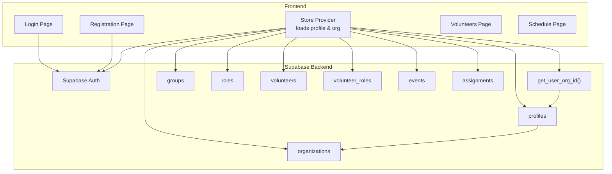
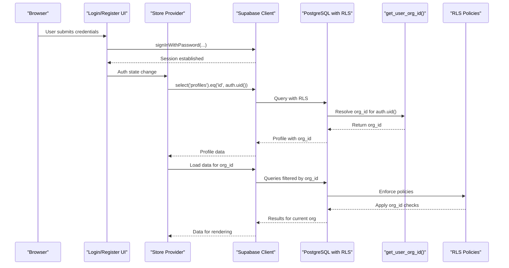
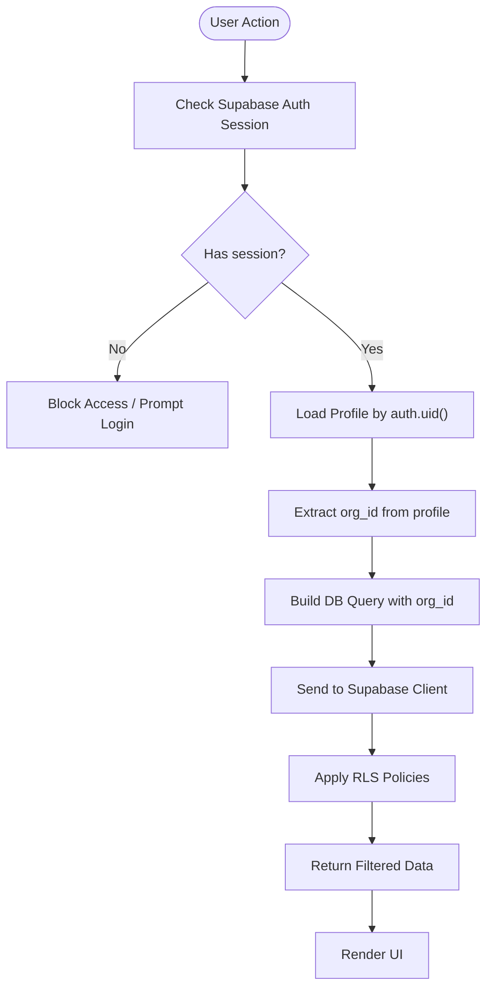
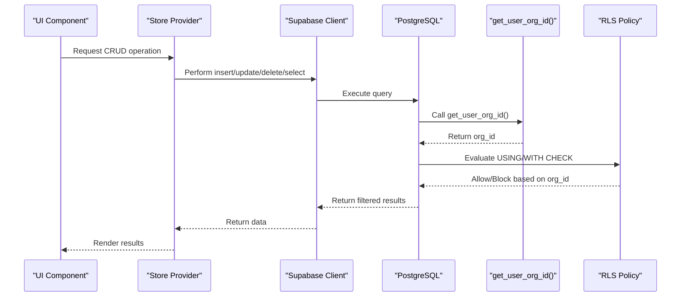
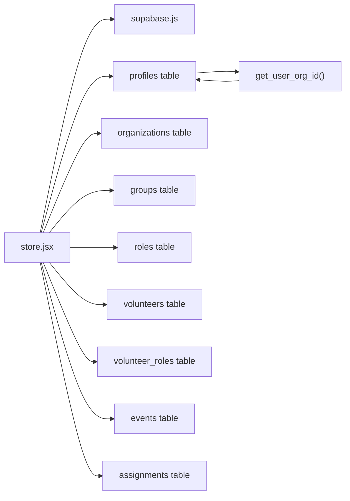

# Row Level Security Policies

<cite>
**Referenced Files in This Document**
- [supabase-schema.sql](file://supabase-schema.sql)
- [store.jsx](file://src/services/store.jsx)
- [supabase.js](file://src/services/supabase.js)
- [Login.jsx](file://src/pages/Login.jsx)
- [Register.jsx](file://src/pages/Register.jsx)
- [Volunteers.jsx](file://src/pages/Volunteers.jsx)
- [Schedule.jsx](file://src/pages/Schedule.jsx)
</cite>

## Table of Contents
1. [Introduction](#introduction)
2. [Project Structure](#project-structure)
3. [Core Components](#core-components)
4. [Architecture Overview](#architecture-overview)
5. [Detailed Component Analysis](#detailed-component-analysis)
6. [Dependency Analysis](#dependency-analysis)
7. [Performance Considerations](#performance-considerations)
8. [Troubleshooting Guide](#troubleshooting-guide)
9. [Conclusion](#conclusion)

## Introduction
This document explains RosterFlow’s Row Level Security (RLS) implementation that enforces tenant isolation using organization-based access control. It details how the system ensures users can only access data within their assigned organization, documents all RLS policies per table, and describes the policy enforcement mechanism integrated with Supabase authentication. It also provides examples of policy evaluation and best practices for maintaining data isolation across multiple organizations.

## Project Structure
RosterFlow’s RLS is implemented in the Supabase backend schema and enforced by the frontend through Supabase client usage. The key elements are:
- Supabase schema with RLS enabled and policies
- A helper function to resolve the current user’s organization ID
- Frontend store that loads user profile and organization, and performs CRUD operations scoped to the user’s organization

**Diagram sources**
- [supabase-schema.sql](file://supabase-schema.sql#L88-L97)
- [store.jsx](file://src/services/store.jsx#L109-L123)
- [supabase.js](file://src/services/supabase.js#L1-L13)
- [Login.jsx](file://src/pages/Login.jsx#L1-L80)
- [Register.jsx](file://src/pages/Register.jsx#L1-L101)

**Section sources**
- [supabase-schema.sql](file://supabase-schema.sql#L1-L251)
- [store.jsx](file://src/services/store.jsx#L1-L556)
- [supabase.js](file://src/services/supabase.js#L1-L13)

## Core Components
- Organization-based access control: Users are associated with an organization via their profile. All data tables include an org_id column and RLS policies enforce that users can only access rows where org_id matches their organization.
- Helper function: get_user_org_id() resolves the current user’s organization ID by querying the profiles table using the authenticated user ID.
- Frontend store: Loads the authenticated user’s profile and organization, and performs all database operations with org_id constraints.

**Section sources**
- [supabase-schema.sql](file://supabase-schema.sql#L88-L97)
- [store.jsx](file://src/services/store.jsx#L109-L123)

## Architecture Overview
The RLS architecture combines Supabase authentication, a server-side helper function, and per-table policies. The frontend relies on Supabase client calls that are automatically filtered by RLS policies.

**Diagram sources**
- [store.jsx](file://src/services/store.jsx#L109-L123)
- [supabase-schema.sql](file://supabase-schema.sql#L88-L97)
- [supabase-schema.sql](file://supabase-schema.sql#L109-L120)
- [supabase.js](file://src/services/supabase.js#L1-L13)

## Detailed Component Analysis

### Organization-Based Access Control Model
- Each user belongs to exactly one organization via their profile record.
- All data tables include org_id and RLS policies that restrict access to rows where org_id equals the current user’s organization ID.
- The helper function get_user_org_id() returns the organization ID for the currently authenticated user.

**Diagram sources**
- [store.jsx](file://src/services/store.jsx#L109-L123)
- [supabase-schema.sql](file://supabase-schema.sql#L88-L97)

**Section sources**
- [supabase-schema.sql](file://supabase-schema.sql#L88-L97)
- [store.jsx](file://src/services/store.jsx#L109-L123)

### RLS Policies by Table
Below are the RLS policies for each table, including select, insert, update, and delete permissions. All policies rely on org_id equality or the helper function get_user_org_id().

- organizations
  - Select: Users can view their own organization.
  - Insert: Initial creation allowed; application logic controls assignment.
  - Update/Delete: Not defined in the provided schema; defaults apply.

- profiles
  - Select: Users can view profiles within their organization.
  - Insert: Users can insert their own profile (id must match auth.uid()).
  - Update: Users can update their own profile (id must match auth.uid()).

- groups
  - Select: Users can view groups within their organization.
  - Insert: Users can insert groups within their organization.
  - Update: Users can update groups within their organization.
  - Delete: Users can delete groups within their organization.

- roles
  - Select: Users can view roles within their organization.
  - Insert: Users can insert roles within their organization.
  - Update: Users can update roles within their organization.
  - Delete: Users can delete roles within their organization.

- volunteers
  - Select: Users can view volunteers within their organization.
  - Insert: Users can insert volunteers within their organization.
  - Update: Users can update volunteers within their organization.
  - Delete: Users can delete volunteers within their organization.

- volunteer_roles
  - Select: Users can view volunteer_roles where the volunteer belongs to their organization.
  - Insert: Users can insert volunteer_roles where the volunteer belongs to their organization.
  - Delete: Users can delete volunteer_roles where the volunteer belongs to their organization.

- events
  - Select: Users can view events within their organization.
  - Insert: Users can insert events within their organization.
  - Update: Users can update events within their organization.
  - Delete: Users can delete events within their organization.

- assignments
  - Select: Users can view assignments within their organization.
  - Insert: Users can insert assignments within their organization.
  - Update: Users can update assignments within their organization.
  - Delete: Users can delete assignments within their organization.

Notes:
- The helper function get_user_org_id() is used to resolve the current user’s organization ID.
- Some tables include WITH CHECK clauses to enforce org_id during inserts.
- The volunteer_roles policy uses a subquery to ensure the volunteer belongs to the current user’s organization.

**Section sources**
- [supabase-schema.sql](file://supabase-schema.sql#L99-L224)

### Policy Enforcement Mechanism and Supabase Authentication Integration
- Supabase authentication supplies the current user ID (auth.uid()) to the backend.
- The get_user_org_id() helper function queries the profiles table to return the user’s org_id.
- RLS policies evaluate USING conditions against org_id and the helper function result.
- Frontend store loads the user’s profile and organization, then performs all CRUD operations scoped to org_id.

**Diagram sources**
- [store.jsx](file://src/services/store.jsx#L133-L166)
- [supabase-schema.sql](file://supabase-schema.sql#L88-L97)
- [supabase-schema.sql](file://supabase-schema.sql#L109-L120)

**Section sources**
- [store.jsx](file://src/services/store.jsx#L133-L166)
- [supabase.js](file://src/services/supabase.js#L1-L13)

### Example Policy Evaluations and Common Access Scenarios
- Scenario A: Admin user views volunteers
  - The frontend loads the user’s profile and organization, then queries volunteers with org_id equal to the user’s org_id. The RLS policy allows select for rows where org_id matches the helper-derived org_id.
- Scenario B: Admin user creates a new volunteer
  - The frontend inserts a volunteer row with org_id set to the user’s org_id. The RLS policy allows insert for rows where org_id equals the helper-derived org_id.
- Scenario C: Admin user deletes a volunteer
  - The frontend deletes the volunteer by id. The RLS policy allows delete for rows where org_id equals the helper-derived org_id.
- Scenario D: Cross-organization access attempt
  - If a user attempts to access a row from another organization, the RLS policy blocks the query because org_id does not match the helper-derived org_id.

These scenarios demonstrate how the helper function and RLS policies together ensure tenant isolation.

**Section sources**
- [supabase-schema.sql](file://supabase-schema.sql#L155-L171)
- [store.jsx](file://src/services/store.jsx#L246-L278)

### Triggers for Automatic org_id Setting
The schema includes triggers that automatically set org_id on insert for several tables when it is not provided. These triggers call the set_org_id() function, which uses get_user_org_id() to populate org_id.

- Tables with triggers: groups, roles, volunteers, events, assignments
- Purpose: Reduce client-side errors and ensure consistent org_id propagation

**Section sources**
- [supabase-schema.sql](file://supabase-schema.sql#L225-L251)

## Dependency Analysis
- Frontend depends on Supabase client for authentication and database operations.
- Backend depends on RLS policies and helper functions to enforce tenant isolation.
- The store module orchestrates auth state, profile loading, and data fetching scoped to org_id.

**Diagram sources**
- [store.jsx](file://src/services/store.jsx#L1-L556)
- [supabase.js](file://src/services/supabase.js#L1-L13)
- [supabase-schema.sql](file://supabase-schema.sql#L88-L97)

**Section sources**
- [store.jsx](file://src/services/store.jsx#L1-L556)
- [supabase.js](file://src/services/supabase.js#L1-L13)
- [supabase-schema.sql](file://supabase-schema.sql#L88-L97)

## Performance Considerations
- RLS adds minimal overhead compared to application-level filtering; it is enforced server-side.
- Use targeted queries with org_id filters to minimize result sets.
- Batch operations (e.g., loading multiple tables in parallel) are acceptable as long as each query respects org_id.

[No sources needed since this section provides general guidance]

## Troubleshooting Guide
Common issues and resolutions:
- No Supabase environment variables configured
  - Symptom: Warning logged and demo mode activated.
  - Resolution: Set VITE_SUPABASE_URL and VITE_SUPABASE_ANON_KEY in .env.
- User cannot see data after login
  - Symptom: Blank lists despite having data.
  - Resolution: Verify profile load succeeds and org_id is present; ensure RLS policies are enabled on all tables.
- Insert fails with org_id mismatch
  - Symptom: Insert rejected by RLS.
  - Resolution: Ensure org_id is set to the user’s org_id; triggers can auto-populate org_id on insert.
- Cross-organization access denied
  - Symptom: Attempted access blocked.
  - Resolution: Expected behavior; users can only access their organization’s data.

**Section sources**
- [store.jsx](file://src/services/store.jsx#L35-L37)
- [store.jsx](file://src/services/store.jsx#L109-L123)
- [supabase-schema.sql](file://supabase-schema.sql#L78-L86)

## Conclusion
RosterFlow achieves robust tenant isolation by combining Supabase authentication, a helper function to resolve the current user’s organization ID, and per-table RLS policies. The frontend store coordinates authentication, profile loading, and data operations scoped to the user’s organization. Together, these mechanisms ensure that users can only access data within their assigned organization, maintaining strong data isolation across multiple organizations.