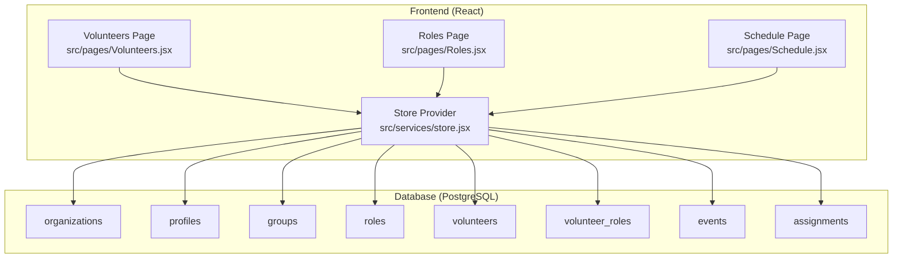
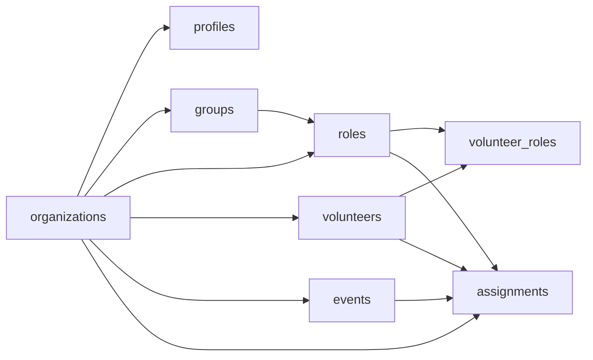

# Table Schemas

<cite>
**Referenced Files in This Document**
- [supabase-schema.sql](file://supabase-schema.sql)
- [store.jsx](file://src/services/store.jsx)
- [Volunteers.jsx](file://src/pages/Volunteers.jsx)
- [Roles.jsx](file://src/pages/Roles.jsx)
- [Schedule.jsx](file://src/pages/Schedule.jsx)
</cite>

## Table of Contents
1. [Introduction](#introduction)
2. [Project Structure](#project-structure)
3. [Core Components](#core-components)
4. [Architecture Overview](#architecture-overview)
5. [Detailed Component Analysis](#detailed-component-analysis)
6. [Dependency Analysis](#dependency-analysis)
7. [Performance Considerations](#performance-considerations)
8. [Troubleshooting Guide](#troubleshooting-guide)
9. [Conclusion](#conclusion)

## Introduction
This document provides comprehensive table schema documentation for RosterFlow’s database structure. It covers each table involved in church volunteer management, including organizations, profiles, groups, roles, volunteers, events, and assignments. It explains primary keys, foreign key relationships, referential integrity rules, constraints, and the UUID-based primary key strategy. It also documents the many-to-many relationship between volunteers and roles through the volunteer_roles junction table, and outlines the auto-generated timestamps behavior. Finally, it includes practical examples of typical record structures and describes the purpose of each field in the context of managing church ministries.

## Project Structure
RosterFlow uses a Supabase backend with a PostgreSQL schema that defines the database tables and policies. The frontend interacts with these tables through a centralized store module that encapsulates CRUD operations and data transformations.



**Diagram sources**
- [supabase-schema.sql](file://supabase-schema.sql#L7-L76)
- [store.jsx](file://src/services/store.jsx#L133-L166)
- [Volunteers.jsx](file://src/pages/Volunteers.jsx#L1-L354)
- [Roles.jsx](file://src/pages/Roles.jsx#L1-L386)
- [Schedule.jsx](file://src/pages/Schedule.jsx#L1-L731)

**Section sources**
- [supabase-schema.sql](file://supabase-schema.sql#L1-L251)
- [store.jsx](file://src/services/store.jsx#L1-L527)

## Core Components
This section summarizes the core tables and their roles in the system.

- organizations: Top-level tenant container for churches/organizations.
- profiles: Extends Supabase auth.users with organization membership and role.
- groups: Ministry teams or departments.
- roles: Specific positions within groups.
- volunteers: Individuals who serve.
- volunteer_roles: Junction table for many-to-many relationship between volunteers and roles.
- events: Occurrences such as services or meetings.
- assignments: Links events, roles, and volunteers with status.

Key design decisions:
- UUID primary keys with automatic generation.
- Auto-generated created_at timestamps.
- Row Level Security (RLS) policies for tenant isolation.
- Triggers to auto-fill org_id on inserts for certain tables.

**Section sources**
- [supabase-schema.sql](file://supabase-schema.sql#L7-L76)
- [store.jsx](file://src/services/store.jsx#L133-L166)

## Architecture Overview
The database architecture enforces tenant isolation via org_id and RLS. The frontend store loads and manipulates data, transforming arrays of junction records into simpler structures for UI consumption.

```mermaid
erDiagram
ORGANIZATIONS {
uuid id PK
text name
timestamptz created_at
}
PROFILES {
uuid id PK
uuid org_id FK
text name
text role
timestamptz created_at
}
GROUPS {
uuid id PK
uuid org_id FK
text name
timestamptz created_at
}
ROLES {
uuid id PK
uuid org_id FK
uuid group_id FK
text name
timestamptz created_at
}
VOLUNTEERS {
uuid id PK
uuid org_id FK
text name
text email
text phone
timestamptz created_at
}
VOLUNTEER_ROLES {
uuid volunteer_id FK
uuid role_id FK
PRIMARY KEY (volunteer_id, role_id)
}
EVENTS {
uuid id PK
uuid org_id FK
text title
date date
text time
timestamptz created_at
}
ASSIGNMENTS {
uuid id PK
uuid org_id FK
uuid event_id FK
uuid role_id FK
uuid volunteer_id FK
text status
timestamptz created_at
}
ORGANIZATIONS ||--o{ PROFILES : "has"
ORGANIZATIONS ||--o{ GROUPS : "has"
ORGANIZATIONS ||--o{ ROLES : "has"
ORGANIZATIONS ||--o{ VOLUNTEERS : "has"
ORGANIZATIONS ||--o{ EVENTS : "has"
ORGANIZATIONS ||--o{ ASSIGNMENTS : "has"
GROUPS ||--o{ ROLES : "contains"
VOLUNTEERS ||--o{ VOLUNTEER_ROLES : "has"
ROLES ||--o{ VOLUNTEER_ROLES : "has"
EVENTS ||--o{ ASSIGNMENTS : "occurrences"
ROLES ||--o{ ASSIGNMENTS : "fills"
VOLUNTEERS ||--o{ ASSIGNMENTS : "assigned"
```

**Diagram sources**
- [supabase-schema.sql](file://supabase-schema.sql#L7-L76)

## Detailed Component Analysis

### organizations
- Purpose: Tenant container for churches/organizations.
- Primary key: id (UUID, auto-generated).
- Fields:
  - id: UUID, primary key, default generated.
  - name: text, not null.
  - created_at: timestamptz, default now().
- Constraints:
  - Not null on name.
  - Default generated id.
- Relationships:
  - Foreign keys in profiles, groups, roles, volunteers, events, assignments link to org_id.
- Notes:
  - RLS enabled; policies restrict access to current user’s organization.

Typical record example:
- id: "a1b2c3d4-e5f6-7890-abcd-ef1234567890"
- name: "Grace Community Church"
- created_at: "2025-01-15T09:00:00+00:00"

**Section sources**
- [supabase-schema.sql](file://supabase-schema.sql#L7-L12)
- [supabase-schema.sql](file://supabase-schema.sql#L78-L86)

### profiles
- Purpose: Extends Supabase auth.users with organization membership and role.
- Primary key: id (UUID, references auth.users(id)).
- Fields:
  - id: UUID, primary key, references auth.users(id) with cascade delete.
  - org_id: UUID, references organizations(id) with cascade delete.
  - name: text, not null.
  - role: text, default 'admin', check constraint in ('admin','member').
  - created_at: timestamptz, default now().
- Constraints:
  - Not null on name.
  - Check on role.
  - Foreign key to auth.users(id) with cascade delete.
  - Foreign key to organizations(id) with cascade delete.
- Relationships:
  - One-to-one with auth.users.
  - Many-to-one with organizations.
- Notes:
  - RLS enabled; policies restrict visibility and updates to current user.

Typical record example:
- id: "f0e9d8c7-b6a5-4321-fedc-ba9876543210"
- org_id: "a1b2c3d4-e5f6-7890-abcd-ef1234567890"
- name: "Pastor John"
- role: "admin"
- created_at: "2025-01-15T09:00:00+00:00"

**Section sources**
- [supabase-schema.sql](file://supabase-schema.sql#L14-L21)
- [supabase-schema.sql](file://supabase-schema.sql#L78-L86)

### groups
- Purpose: Ministry teams or departments (e.g., Worship, Production, Hospitality).
- Primary key: id (UUID, auto-generated).
- Fields:
  - id: UUID, primary key, default generated.
  - org_id: UUID, not null, references organizations(id) with cascade delete.
  - name: text, not null.
  - created_at: timestamptz, default now().
- Constraints:
  - Not null on name and org_id.
  - Foreign key to organizations(id) with cascade delete.
- Relationships:
  - Many-to-one with organizations.
  - Many-to-one with roles (via group_id).
- Notes:
  - RLS enabled; policies restrict access to current user’s organization.

Typical record example:
- id: "11223344-5566-7788-99aa-bbccddeeff00"
- org_id: "a1b2c3d4-e5f6-7890-abcd-ef1234567890"
- name: "Worship Team"
- created_at: "2025-01-15T09:00:00+00:00"

**Section sources**
- [supabase-schema.sql](file://supabase-schema.sql#L23-L29)
- [supabase-schema.sql](file://supabase-schema.sql#L78-L86)

### roles
- Purpose: Specific positions within groups (e.g., Worship Leader, Sound Engineer).
- Primary key: id (UUID, auto-generated).
- Fields:
  - id: UUID, primary key, default generated.
  - org_id: UUID, not null, references organizations(id) with cascade delete.
  - group_id: UUID, references groups(id) with set null on delete.
  - name: text, not null.
  - created_at: timestamptz, default now().
- Constraints:
  - Not null on name and org_id.
  - Foreign key to organizations(id) with cascade delete.
  - Foreign key to groups(id) with set null on delete.
- Relationships:
  - Many-to-one with organizations.
  - Many-to-one with groups.
  - Many-to-one with assignments.
  - Many-to-many with volunteers via volunteer_roles.
- Notes:
  - RLS enabled; policies restrict access to current user’s organization.

Typical record example:
- id: "22334455-6677-8899-aabb-ccddeeff0011"
- org_id: "a1b2c3d4-e5f6-7890-abcd-ef1234567890"
- group_id: "11223344-5566-7788-99aa-bbccddeeff00"
- name: "Worship Leader"
- created_at: "2025-01-15T09:00:00+00:00"

**Section sources**
- [supabase-schema.sql](file://supabase-schema.sql#L31-L38)
- [supabase-schema.sql](file://supabase-schema.sql#L78-L86)

### volunteers
- Purpose: Individuals who serve in the organization.
- Primary key: id (UUID, auto-generated).
- Fields:
  - id: UUID, primary key, default generated.
  - org_id: UUID, not null, references organizations(id) with cascade delete.
  - name: text, not null.
  - email: text.
  - phone: text.
  - created_at: timestamptz, default now().
- Constraints:
  - Not null on name and org_id.
  - Foreign key to organizations(id) with cascade delete.
- Relationships:
  - Many-to-one with organizations.
  - Many-to-many with roles via volunteer_roles.
  - Many-to-one with assignments (optional).
- Notes:
  - RLS enabled; policies restrict access to current user’s organization.

Typical record example:
- id: "33445566-7788-99aa-bbcc-ddeeff001122"
- org_id: "a1b2c3d4-e5f6-7890-abcd-ef1234567890"
- name: "Alice Johnson"
- email: "alice@example.com"
- phone: "555-0101"
- created_at: "2025-01-15T09:00:00+00:00"

**Section sources**
- [supabase-schema.sql](file://supabase-schema.sql#L40-L48)
- [supabase-schema.sql](file://supabase-schema.sql#L78-L86)

### volunteer_roles (junction table)
- Purpose: Many-to-many relationship between volunteers and roles.
- Composite primary key: (volunteer_id, role_id).
- Fields:
  - volunteer_id: UUID, references volunteers(id) with cascade delete.
  - role_id: UUID, references roles(id) with cascade delete.
- Constraints:
  - Composite primary key on (volunteer_id, role_id).
  - Foreign key to volunteers(id) with cascade delete.
  - Foreign key to roles(id) with cascade delete.
- Relationships:
  - Links volunteers to roles.
- Notes:
  - RLS enabled; policies restrict access to current user’s organization.

Typical record example:
- volunteer_id: "33445566-7788-99aa-bbcc-ddeeff001122"
- role_id: "22334455-6677-8899-aabb-ccddeeff0011"

**Section sources**
- [supabase-schema.sql](file://supabase-schema.sql#L50-L55)
- [supabase-schema.sql](file://supabase-schema.sql#L78-L86)

### events
- Purpose: Occurrences such as services or meetings.
- Primary key: id (UUID, auto-generated).
- Fields:
  - id: UUID, primary key, default generated.
  - org_id: UUID, not null, references organizations(id) with cascade delete.
  - title: text, not null.
  - date: date, not null.
  - time: text.
  - created_at: timestamptz, default now().
- Constraints:
  - Not null on title, date, and org_id.
  - Foreign key to organizations(id) with cascade delete.
- Relationships:
  - Many-to-one with organizations.
  - Many-to-one with assignments.
- Notes:
  - RLS enabled; policies restrict access to current user’s organization.

Typical record example:
- id: "44556677-8899-aabb-ccdd-eeff00112233"
- org_id: "a1b2c3d4-e5f6-7890-abcd-ef1234567890"
- title: "Sunday Service"
- date: "2025-02-23"
- time: "09:00"
- created_at: "2025-01-15T09:00:00+00:00"

**Section sources**
- [supabase-schema.sql](file://supabase-schema.sql#L57-L65)
- [supabase-schema.sql](file://supabase-schema.sql#L78-L86)

### assignments
- Purpose: Links events, roles, and volunteers with status.
- Primary key: id (UUID, auto-generated).
- Fields:
  - id: UUID, primary key, default generated.
  - org_id: UUID, not null, references organizations(id) with cascade delete.
  - event_id: UUID, not null, references events(id) with cascade delete.
  - role_id: UUID, not null, references roles(id) with cascade delete.
  - volunteer_id: UUID, references volunteers(id) with set null on delete.
  - status: text, default 'confirmed', check constraint in ('confirmed','pending','declined').
  - created_at: timestamptz, default now().
- Constraints:
  - Not null on org_id, event_id, role_id.
  - Check on status.
  - Foreign key to organizations(id) with cascade delete.
  - Foreign key to events(id) with cascade delete.
  - Foreign key to roles(id) with cascade delete.
  - Foreign key to volunteers(id) with set null on delete.
- Relationships:
  - Many-to-one with organizations.
  - Many-to-one with events.
  - Many-to-one with roles.
  - Many-to-one with volunteers (optional).
- Notes:
  - RLS enabled; policies restrict access to current user’s organization.

Typical record example:
- id: "55667788-99aa-bbcc-ddee-ff0011223344"
- org_id: "a1b2c3d4-e5f6-7890-abcd-ef1234567890"
- event_id: "44556677-8899-aabb-ccdd-eeff00112233"
- role_id: "22334455-6677-8899-aabb-ccddeeff0011"
- volunteer_id: "33445566-7788-99aa-bbcc-ddeeff001122"
- status: "confirmed"
- created_at: "2025-01-15T09:00:00+00:00"

**Section sources**
- [supabase-schema.sql](file://supabase-schema.sql#L67-L76)
- [supabase-schema.sql](file://supabase-schema.sql#L78-L86)

## Dependency Analysis
The following diagram shows the foreign key dependencies among tables.



**Diagram sources**
- [supabase-schema.sql](file://supabase-schema.sql#L7-L76)

**Section sources**
- [supabase-schema.sql](file://supabase-schema.sql#L7-L76)

## Performance Considerations
- Indexes: Consider adding indexes on frequently filtered columns such as org_id, name, and foreign keys (e.g., org_id on groups, roles, volunteers, events, assignments) to improve query performance.
- RLS Overhead: Row Level Security adds overhead; ensure policies are efficient and avoid unnecessary joins in policy definitions.
- Data Volume: For large datasets, paginate queries and limit joins. The frontend already loads data in parallel; ensure database-side limits and ordering are used appropriately.
- Triggers: The set_org_id triggers simplify inserts but add server-side processing; monitor their impact on write throughput.

[No sources needed since this section provides general guidance]

## Troubleshooting Guide
Common issues and resolutions:
- RLS Policy Violations: If a user cannot see or modify data, verify that their profile.org_id matches the record’s org_id and that the get_user_org_id function resolves correctly.
- Missing org_id on Insert: Ensure org_id is provided or rely on the set_org_id triggers for groups, roles, volunteers, events, and assignments.
- Many-to-Many Relationship: When updating volunteer roles, delete existing entries and re-insert the new set to maintain consistency.
- Status Values: Ensure status values conform to the allowed set ('confirmed','pending','declined').

**Section sources**
- [supabase-schema.sql](file://supabase-schema.sql#L225-L250)
- [store.jsx](file://src/services/store.jsx#L264-L282)

## Conclusion
RosterFlow’s database schema is designed around UUID primary keys, tenant isolation via org_id, and RLS policies. The relationships are straightforward and support the core workflows of managing groups, roles, volunteers, events, and assignments. The volunteer_roles junction table enables flexible role qualification tracking. The frontend store handles data transformations and ensures consistent behavior across the UI.