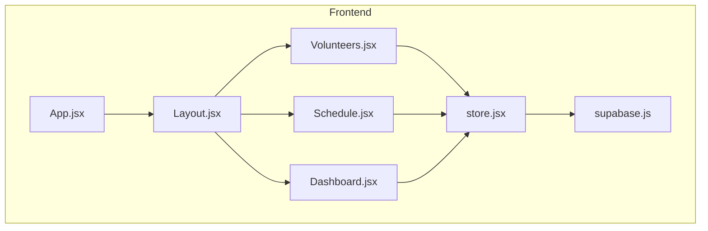
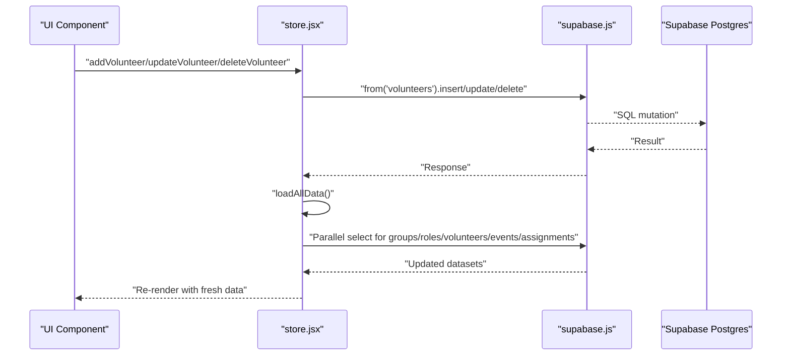
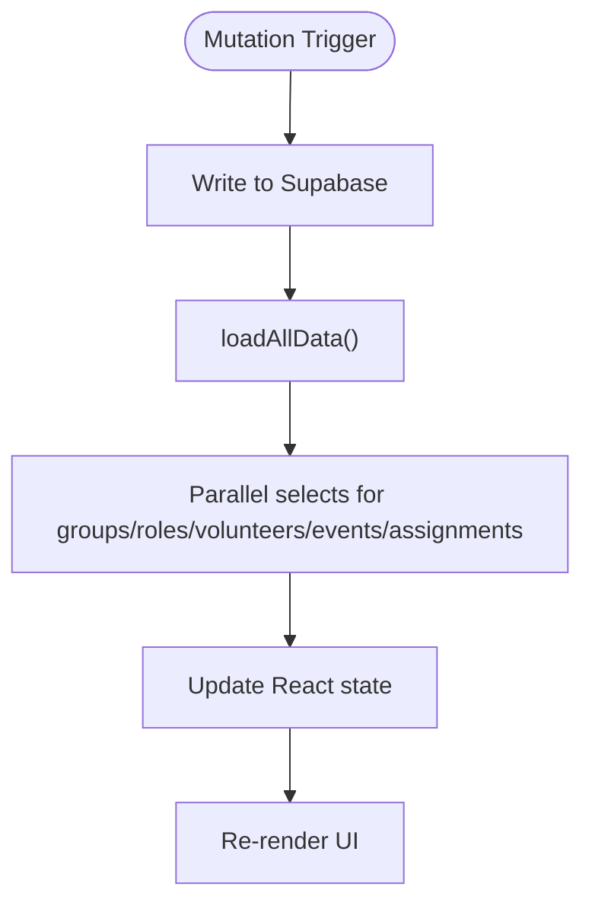
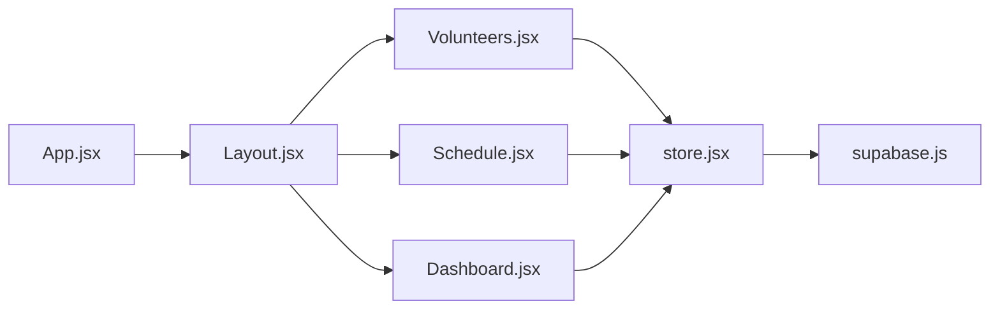

# Real-time API

<cite>
**Referenced Files in This Document**
- [supabase.js](file://src/services/supabase.js)
- [store.jsx](file://src/services/store.jsx)
- [Volunteers.jsx](file://src/pages/Volunteers.jsx)
- [Schedule.jsx](file://src/pages/Schedule.jsx)
- [Dashboard.jsx](file://src/pages/Dashboard.jsx)
- [App.jsx](file://src/App.jsx)
- [Layout.jsx](file://src/components/Layout.jsx)
- [supabase-schema.sql](file://supabase-schema.sql)
</cite>

## Table of Contents
1. [Introduction](#introduction)
2. [Project Structure](#project-structure)
3. [Core Components](#core-components)
4. [Architecture Overview](#architecture-overview)
5. [Detailed Component Analysis](#detailed-component-analysis)
6. [Dependency Analysis](#dependency-analysis)
7. [Performance Considerations](#performance-considerations)
8. [Troubleshooting Guide](#troubleshooting-guide)
9. [Conclusion](#conclusion)
10. [Appendices](#appendices)

## Introduction
This document provides comprehensive real-time API documentation for RosterFlow’s live data synchronization system. It explains how Supabase Realtime channels are used, how subscriptions are managed, and how event-driven updates propagate across volunteers, schedules, and organizational data. It also covers the subscription lifecycle, event types and payload patterns, filtering strategies, error handling, performance considerations, memory management, offline fallbacks, and debugging/monitoring approaches.

Important note: The current codebase does not implement explicit Supabase Realtime subscriptions. Instead, it performs server-side reads and writes via the Supabase client and refreshes local state by reloading data after mutations. This document therefore documents the current behavior and provides guidance for evolving to a true real-time model while remaining consistent with the existing architecture.

## Project Structure
RosterFlow is a React application structured around a central store that orchestrates authentication, data loading, and mutation operations. Real-time capabilities are not currently implemented in the frontend; instead, the store reloads data after each write operation. The Supabase client initialization and environment configuration are centralized.

**Diagram sources**
- [App.jsx](file://src/App.jsx#L13-L34)
- [Layout.jsx](file://src/components/Layout.jsx#L14-L107)
- [Volunteers.jsx](file://src/pages/Volunteers.jsx#L1-L354)
- [Schedule.jsx](file://src/pages/Schedule.jsx#L1-L324)
- [Dashboard.jsx](file://src/pages/Dashboard.jsx#L1-L90)
- [store.jsx](file://src/services/store.jsx#L1-L472)
- [supabase.js](file://src/services/supabase.js#L1-L13)

**Section sources**
- [App.jsx](file://src/App.jsx#L1-L37)
- [Layout.jsx](file://src/components/Layout.jsx#L1-L108)
- [store.jsx](file://src/services/store.jsx#L1-L472)
- [supabase.js](file://src/services/supabase.js#L1-L13)

## Core Components
- Supabase client initialization and environment configuration
- Centralized store managing auth state, organization/profile resolution, and CRUD operations
- Page components consuming the store for rendering and user actions

Key behaviors:
- Authentication state changes are subscribed to and cleaned up automatically.
- Data is loaded initially and refreshed after each mutation.
- There are no explicit Realtime subscriptions in the current codebase.

**Section sources**
- [supabase.js](file://src/services/supabase.js#L1-L13)
- [store.jsx](file://src/services/store.jsx#L21-L45)
- [store.jsx](file://src/services/store.jsx#L78-L111)

## Architecture Overview
The current architecture is reactive but not real-time. Mutations trigger a reload of dependent datasets, ensuring eventual consistency. To evolve to real-time, the store can subscribe to Supabase Realtime channels for each table and apply incremental updates to local state.

**Diagram sources**
- [store.jsx](file://src/services/store.jsx#L162-L242)
- [store.jsx](file://src/services/store.jsx#L78-L111)
- [supabase.js](file://src/services/supabase.js#L1-L13)

## Detailed Component Analysis

### Supabase Client Initialization
- Reads Vite environment variables for Supabase URL and anonymous key.
- Creates a client instance exported for use across the app.
- Emits a warning if environment variables are missing.

Operational implications:
- Real-time requires a valid Supabase Realtime endpoint and credentials.
- Environment misconfiguration will prevent real-time connections.

**Section sources**
- [supabase.js](file://src/services/supabase.js#L3-L10)

### Store Provider and Auth Subscriptions
- Initializes session state and subscribes to auth state changes.
- Automatically unsubscribes on cleanup.
- Loads profile and organization when a session exists.
- Clears data and resets state on sign-out.

Real-time relevance:
- Auth state changes can be used to trigger re-authentication of real-time subscriptions.
- Current implementation reloads data after auth changes; real-time would update subscriptions dynamically.

**Section sources**
- [store.jsx](file://src/services/store.jsx#L21-L45)
- [store.jsx](file://src/services/store.jsx#L119-L124)

### Data Loading and Mutation Flow
- Initial dataset loading uses parallel queries for groups, roles, volunteers, events, and assignments.
- Volunteers include a join to volunteer_roles to compute roles for UI compatibility.
- Mutations (add/update/delete) for volunteers, events, assignments, roles, and groups are implemented.
- After each mutation, the store reloads all datasets to maintain consistency.

Real-time relevance:
- Current reload-after-mutation pattern ensures correctness but is less efficient than targeted real-time updates.
- Real-time subscriptions could replace reloads with incremental updates.

**Diagram sources**
- [store.jsx](file://src/services/store.jsx#L78-L111)
- [store.jsx](file://src/services/store.jsx#L162-L242)

**Section sources**
- [store.jsx](file://src/services/store.jsx#L78-L111)
- [store.jsx](file://src/services/store.jsx#L162-L242)

### Volunteers Page
- Uses the store to render a searchable, editable list of volunteers.
- Supports CSV import and inline editing.
- Delegates add/update/delete to the store.

Real-time relevance:
- With real-time, edits would immediately reflect across clients without manual reload.

**Section sources**
- [Volunteers.jsx](file://src/pages/Volunteers.jsx#L1-L354)
- [store.jsx](file://src/services/store.jsx#L162-L242)

### Schedule Page
- Renders events and assignments, supports adding/updating events, and assigning volunteers.
- Relies on store-provided datasets for rendering.

Real-time relevance:
- Real-time would enable live assignment updates and immediate event changes.

**Section sources**
- [Schedule.jsx](file://src/pages/Schedule.jsx#L1-L324)
- [store.jsx](file://src/services/store.jsx#L244-L292)
- [store.jsx](file://src/services/store.jsx#L294-L330)

### Dashboard Page
- Displays quick stats derived from store-provided datasets.

Real-time relevance:
- Real-time updates would keep stats current without reloads.

**Section sources**
- [Dashboard.jsx](file://src/pages/Dashboard.jsx#L21-L58)

### Database Schema and Row-Level Security
- Defines organizations, profiles, groups, roles, volunteers, volunteer_roles, events, and assignments.
- Enforces Row Level Security policies so users only access their organization’s data.
- Provides helper functions and triggers to enforce org_id on inserts.

Real-time relevance:
- Real-time subscriptions should be scoped per organization to respect RLS policies.
- Channel topics should include org_id to isolate streams.

**Section sources**
- [supabase-schema.sql](file://supabase-schema.sql#L7-L251)

## Dependency Analysis
- App and Layout provide routing and navigation; they depend on the store for user and data state.
- Pages consume the store for rendering and user actions.
- The store depends on the Supabase client for auth and data operations.

**Diagram sources**
- [App.jsx](file://src/App.jsx#L13-L34)
- [Layout.jsx](file://src/components/Layout.jsx#L14-L107)
- [Volunteers.jsx](file://src/pages/Volunteers.jsx#L1-L354)
- [Schedule.jsx](file://src/pages/Schedule.jsx#L1-L324)
- [Dashboard.jsx](file://src/pages/Dashboard.jsx#L1-L90)
- [store.jsx](file://src/services/store.jsx#L1-L472)
- [supabase.js](file://src/services/supabase.js#L1-L13)

**Section sources**
- [App.jsx](file://src/App.jsx#L1-L37)
- [Layout.jsx](file://src/components/Layout.jsx#L1-L108)
- [store.jsx](file://src/services/store.jsx#L1-L472)

## Performance Considerations
Current behavior:
- Parallel loads reduce round-trips during initial load.
- After each mutation, the entire dataset is reloaded, which is simple but can be inefficient as data grows.

Recommendations for real-time:
- Subscribe to individual tables and apply incremental updates to minimize bandwidth and CPU.
- Use table-level filters to limit event volume (e.g., org_id).
- Debounce UI updates when multiple related events arrive rapidly.
- Implement optimistic updates in the UI with rollback on server conflict.

Memory management:
- Unsubscribe from channels when components unmount or when the user logs out.
- Avoid retaining references to old subscriptions or stale data.

Offline fallback:
- Persist a minimal cache of recent data to enable partial offline usability.
- Queue local mutations and replay them when connectivity is restored.

[No sources needed since this section provides general guidance]

## Troubleshooting Guide
Common issues and remedies:
- Missing environment variables: The Supabase client warns if URL or anonymous key are not configured. Ensure Vite environment variables are present.
- Auth state changes: The store listens for auth changes and cleans up subscriptions on unmount. Verify that subscriptions are properly disposed.
- Mutation errors: The store logs errors during data operations. Inspect the console for detailed messages.
- Real-time connectivity: If adopting real-time, monitor connection status and implement retry/backoff strategies.

Debugging tools and monitoring:
- Browser DevTools Network tab to inspect Supabase requests/responses.
- Supabase Dashboard logs for database activity and policy violations.
- Add logging around store mutations and data loads to trace state transitions.

**Section sources**
- [supabase.js](file://src/services/supabase.js#L6-L8)
- [store.jsx](file://src/services/store.jsx#L90-L110)
- [store.jsx](file://src/services/store.jsx#L204-L206)

## Conclusion
RosterFlow currently relies on periodic data reloads rather than real-time updates. The store and pages are structured to accommodate a real-time evolution: clear separation of concerns, centralized auth and data operations, and modular page components. By introducing Supabase Realtime subscriptions scoped to organization boundaries and applying incremental updates, the system can achieve low-latency synchronization while preserving correctness and performance.

[No sources needed since this section summarizes without analyzing specific files]

## Appendices

### Appendix A: Proposed Real-time Subscription Model
- Channels: One channel per table/topic (e.g., “realtime:public:volunteers”, “realtime:public:events”).
- Filters: Filter by org_id to respect RLS policies.
- Lifecycle:
  - Connect on auth state change and organization load.
  - Subscribe to relevant tables.
  - Apply server-sent events to local state.
  - Unsubscribe on logout/unmount.

[No sources needed since this section proposes conceptual changes]

### Appendix B: Event Types and Payload Patterns
- Event types: INSERT, UPDATE, DELETE.
- Payload: Supabase Realtime event envelope includes schema, table, filter, and record snapshot.
- Update patterns: Compute diffs and update arrays/maps incrementally; avoid full reloads.

[No sources needed since this section describes conceptual patterns]