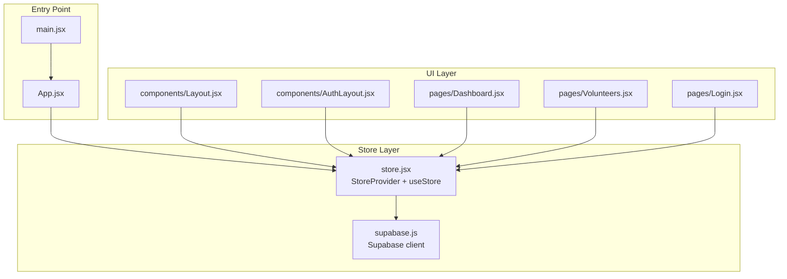
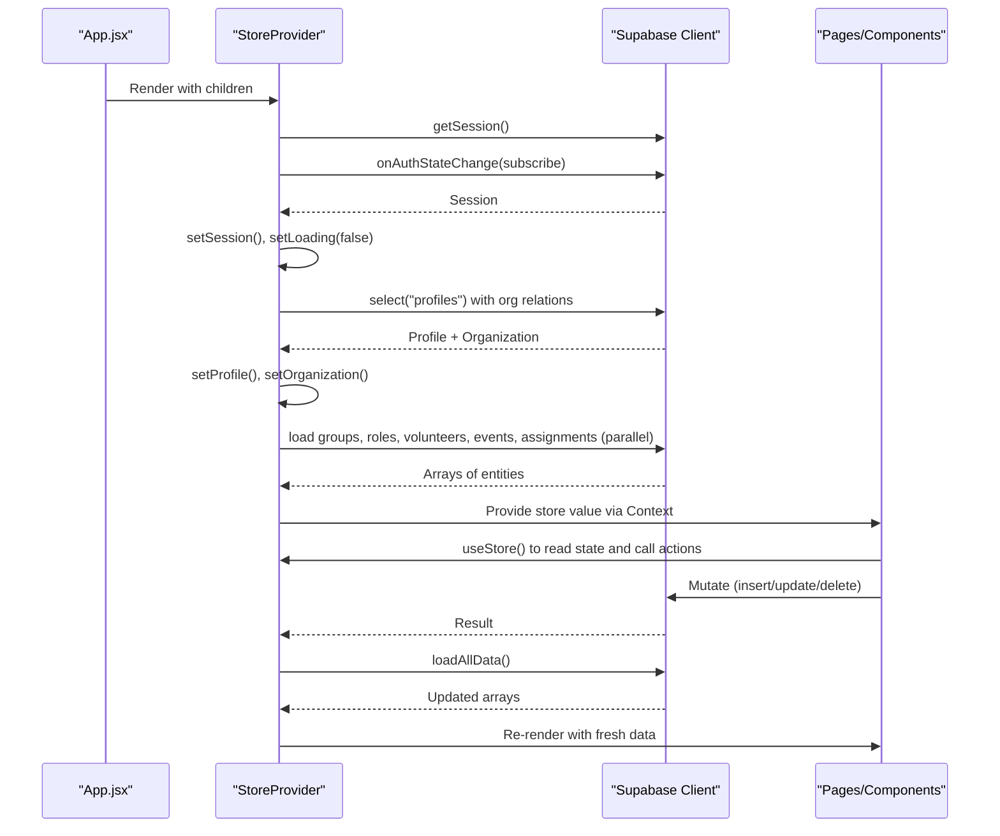
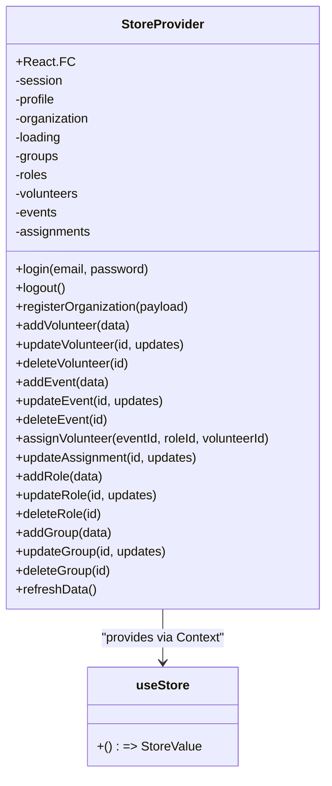
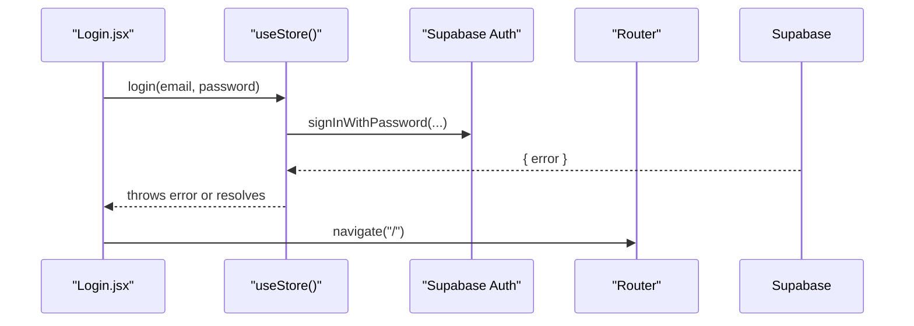
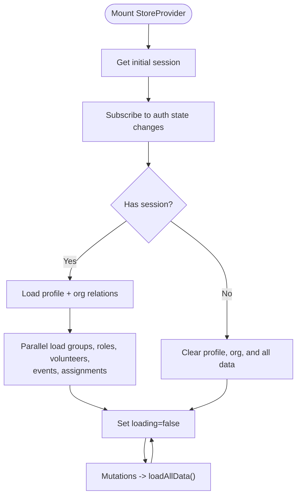
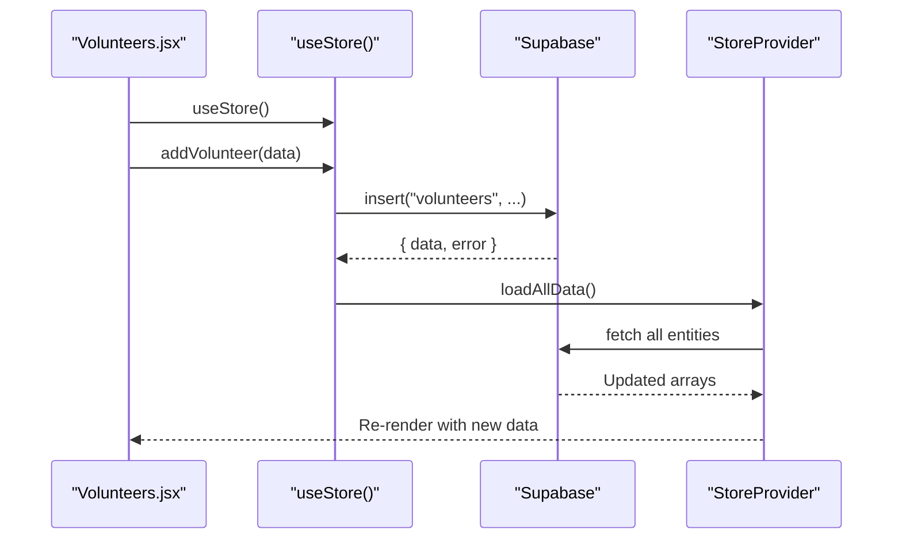
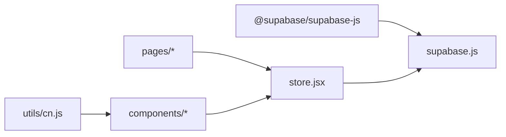

# Store Provider API

<cite>
**Referenced Files in This Document**
- [store.jsx](file://src/services/store.jsx)
- [supabase.js](file://src/services/supabase.js)
- [App.jsx](file://src/App.jsx)
- [main.jsx](file://src/main.jsx)
- [Dashboard.jsx](file://src/pages/Dashboard.jsx)
- [Volunteers.jsx](file://src/pages/Volunteers.jsx)
- [Login.jsx](file://src/pages/Login.jsx)
- [Layout.jsx](file://src/components/Layout.jsx)
- [AuthLayout.jsx](file://src/components/AuthLayout.jsx)
- [cn.js](file://src/utils/cn.js)
- [package.json](file://package.json)
</cite>

## Table of Contents
1. [Introduction](#introduction)
2. [Project Structure](#project-structure)
3. [Core Components](#core-components)
4. [Architecture Overview](#architecture-overview)
5. [Detailed Component Analysis](#detailed-component-analysis)
6. [Dependency Analysis](#dependency-analysis)
7. [Performance Considerations](#performance-considerations)
8. [Troubleshooting Guide](#troubleshooting-guide)
9. [Conclusion](#conclusion)
10. [Appendices](#appendices)

## Introduction
This document describes RosterFlow’s custom store provider API built on React Context. It explains how the store initializes authentication state, loads organizational and operational data, exposes data access and mutation functions, and integrates with Supabase for backend operations. It also documents consumer patterns, hook usage, error handling, loading states, optimistic updates, performance optimizations, and extension guidelines.

## Project Structure
RosterFlow organizes the store provider under a dedicated services module and exposes a simple hook for consumers. Pages and components consume the store via the hook to render UI and trigger mutations.

**Diagram sources**
- [main.jsx](file://src/main.jsx#L1-L11)
- [App.jsx](file://src/App.jsx#L1-L37)
- [store.jsx](file://src/services/store.jsx#L1-L472)
- [supabase.js](file://src/services/supabase.js#L1-L13)
- [Layout.jsx](file://src/components/Layout.jsx#L1-L108)
- [AuthLayout.jsx](file://src/components/AuthLayout.jsx#L1-L26)
- [Dashboard.jsx](file://src/pages/Dashboard.jsx#L1-L90)
- [Volunteers.jsx](file://src/pages/Volunteers.jsx#L1-L354)
- [Login.jsx](file://src/pages/Login.jsx#L1-L80)

**Section sources**
- [main.jsx](file://src/main.jsx#L1-L11)
- [App.jsx](file://src/App.jsx#L1-L37)
- [store.jsx](file://src/services/store.jsx#L1-L472)

## Core Components
- StoreProvider: Wraps the app with a React Context, manages auth and data lifecycles, and exposes a consolidated store value.
- useStore: Consumer hook returning the store value for components.

Key responsibilities:
- Authentication lifecycle: initialize session, subscribe to auth state changes, and clear data on sign-out.
- Data initialization: load profiles, organizations, and all domain entities (groups, roles, volunteers, events, assignments) in parallel.
- Mutation operations: CRUD for volunteers, events, assignments, roles, and groups; registration flow for new organizations.
- Derived user object: compatibility wrapper for downstream components.

**Section sources**
- [store.jsx](file://src/services/store.jsx#L6-L472)

## Architecture Overview
The store orchestrates reactive state updates driven by Supabase. Consumers subscribe via useStore and receive both data and functions to mutate it. The provider coordinates initialization, error logging, and data refresh.

**Diagram sources**
- [App.jsx](file://src/App.jsx#L11-L34)
- [store.jsx](file://src/services/store.jsx#L21-L111)
- [supabase.js](file://src/services/supabase.js#L1-L13)
- [Dashboard.jsx](file://src/pages/Dashboard.jsx#L22-L22)
- [Volunteers.jsx](file://src/pages/Volunteers.jsx#L8-L8)
- [Login.jsx](file://src/pages/Login.jsx#L7-L7)

## Detailed Component Analysis

### StoreProvider and useStore Hook
- Context creation and provider wrapping: The provider creates a context and passes a value object containing derived user, auth state, and all data plus mutation functions.
- Initialization and subscriptions:
  - Retrieves initial session and sets loading state.
  - Subscribes to auth state changes and updates session accordingly.
  - Clears profile, organization, and all data when user logs out.
- Data loading:
  - Loads profile with organization relations when session is present.
  - Parallelizes loading of groups, roles, volunteers, events, and assignments.
  - Transforms volunteer roles relationship into a flat roles array for compatibility.
- Mutations:
  - Volunteer CRUD with explicit handling of volunteer_roles relationships.
  - Event, role, group, and assignment CRUD.
  - Registration flow for new organizations (user creation, organization creation, profile creation, auto-login).
- Exposed API surface:
  - Auth: login, logout, registerOrganization.
  - Data getters: groups, roles, volunteers, events, assignments, profile, organization, user, loading.
  - Mutations: add/update/delete for volunteers, events, assignments, roles, groups.
  - Utilities: refreshData.

**Diagram sources**
- [store.jsx](file://src/services/store.jsx#L6-L472)

**Section sources**
- [store.jsx](file://src/services/store.jsx#L6-L472)

### Authentication Flow
- Initial session retrieval and auth subscription occur during mount.
- On successful login, navigation occurs after the promise resolves.
- Logout clears profile, organization, and all data, then unsubscribes from auth changes.

**Diagram sources**
- [Login.jsx](file://src/pages/Login.jsx#L14-L25)
- [store.jsx](file://src/services/store.jsx#L114-L124)
- [supabase.js](file://src/services/supabase.js#L1-L13)

**Section sources**
- [Login.jsx](file://src/pages/Login.jsx#L1-L80)
- [store.jsx](file://src/services/store.jsx#L114-L124)

### Data Loading and Refresh
- Profile and organization are loaded upon session presence.
- All domain entities are fetched in parallel and stored in state.
- After mutations, the store refreshes all data to keep the UI consistent.

**Diagram sources**
- [store.jsx](file://src/services/store.jsx#L21-L111)

**Section sources**
- [store.jsx](file://src/services/store.jsx#L21-L111)

### Consumer Patterns and Hook Usage
- Pages and components import useStore and destructure the fields they need.
- Example consumers:
  - Dashboard reads user, volunteers, events, roles.
  - Volunteers lists, edits, deletes, and bulk-imports volunteers.
  - Login handles form submission and navigation.
  - Layout enforces auth guards and provides logout.

**Diagram sources**
- [Volunteers.jsx](file://src/pages/Volunteers.jsx#L45-L66)
- [store.jsx](file://src/services/store.jsx#L162-L194)

**Section sources**
- [Dashboard.jsx](file://src/pages/Dashboard.jsx#L21-L28)
- [Volunteers.jsx](file://src/pages/Volunteers.jsx#L1-L354)
- [Login.jsx](file://src/pages/Login.jsx#L1-L80)
- [Layout.jsx](file://src/components/Layout.jsx#L14-L30)

### Error Handling and Loading States
- Errors from Supabase operations are logged and re-thrown for callers to handle.
- Loading state is toggled during session initialization and while performing mutations.
- Auth guard in layout redirects unauthenticated users to landing.

**Section sources**
- [store.jsx](file://src/services/store.jsx#L54-L68)
- [store.jsx](file://src/services/store.jsx#L90-L111)
- [store.jsx](file://src/services/store.jsx#L114-L124)
- [Layout.jsx](file://src/components/Layout.jsx#L19-L23)

### Optimistic Updates and Consistency
- The store does not implement optimistic UI updates. Instead, it performs mutations and then refreshes all data to ensure consistency.
- This approach simplifies correctness but may introduce latency; consider adding optimistic updates for better UX if needed.

**Section sources**
- [store.jsx](file://src/services/store.jsx#L162-L194)
- [store.jsx](file://src/services/store.jsx#L245-L292)
- [store.jsx](file://src/services/store.jsx#L295-L328)
- [store.jsx](file://src/services/store.jsx#L331-L375)
- [store.jsx](file://src/services/store.jsx#L378-L422)

### Side Effects and Async Operations
- Effects orchestrate session, profile, and data loading.
- Mutations are async and coordinate related relational writes (e.g., volunteer roles).
- Navigation and redirects are handled in components after store operations succeed.

**Section sources**
- [store.jsx](file://src/services/store.jsx#L21-L52)
- [store.jsx](file://src/services/store.jsx#L181-L191)
- [Layout.jsx](file://src/components/Layout.jsx#L27-L30)
- [Login.jsx](file://src/pages/Login.jsx#L14-L25)

## Dependency Analysis
- External dependencies:
  - @supabase/supabase-js for authentication and database operations.
  - react-router-dom for routing and navigation.
  - Tailwind-based UI utilities and icons.
- Internal dependencies:
  - store.jsx depends on supabase.js for the Supabase client.
  - Pages and components depend on store.jsx via useStore.

**Diagram sources**
- [package.json](file://package.json#L15-L24)
- [supabase.js](file://src/services/supabase.js#L1-L13)
- [store.jsx](file://src/services/store.jsx#L1-L4)
- [Dashboard.jsx](file://src/pages/Dashboard.jsx#L3-L3)
- [Volunteers.jsx](file://src/pages/Volunteers.jsx#L2-L2)
- [Login.jsx](file://src/pages/Login.jsx#L3-L3)
- [Layout.jsx](file://src/components/Layout.jsx#L4-L4)
- [AuthLayout.jsx](file://src/components/AuthLayout.jsx#L1-L26)
- [cn.js](file://src/utils/cn.js#L1-L7)

**Section sources**
- [package.json](file://package.json#L15-L24)
- [supabase.js](file://src/services/supabase.js#L1-L13)
- [store.jsx](file://src/services/store.jsx#L1-L4)

## Performance Considerations
- Parallel data loading: Groups, roles, volunteers, events, and assignments are fetched concurrently to reduce initialization time.
- Minimal re-renders: Consumers should keep renders lightweight and avoid unnecessary computations inside render scope.
- Memoization strategies:
  - Use useMemo for derived computations (e.g., filtered volunteers) in components.
  - Use useCallback for handlers passed to child components to prevent prop drift.
  - Consider splitting large components to reduce re-render scope.
- Persistence:
  - Current store does not persist state locally. Consider integrating local storage or IndexedDB for offline resilience if needed.
- Network efficiency:
  - Batch related writes (e.g., volunteer roles) in a single operation when possible.
  - Debounce search/filter operations in UI to reduce frequent re-computation.

[No sources needed since this section provides general guidance]

## Troubleshooting Guide
Common issues and resolutions:
- Missing Supabase credentials:
  - Ensure VITE_SUPABASE_URL and VITE_SUPABASE_ANON_KEY are configured. The client warns if missing.
- Authentication errors:
  - Login errors are thrown and surfaced to the caller; display user-friendly messages.
- Data not loading:
  - Verify session presence and that profile/org are loaded before attempting mutations.
- Mutation failures:
  - Errors are logged and re-thrown; handle them in components with alerts or retry logic.
- Auth guard redirect loop:
  - Ensure unauthenticated users are redirected to landing and authenticated users can access protected routes.

**Section sources**
- [supabase.js](file://src/services/supabase.js#L6-L8)
- [store.jsx](file://src/services/store.jsx#L114-L124)
- [store.jsx](file://src/services/store.jsx#L54-L68)
- [Layout.jsx](file://src/components/Layout.jsx#L19-L23)

## Conclusion
RosterFlow’s store provider offers a clean, centralized state management layer built on React Context and Supabase. It provides robust authentication, efficient parallel data loading, and a comprehensive set of mutation functions. Consumers use a simple hook to access state and actions, while the provider ensures consistent data refresh after mutations. For future enhancements, consider adding optimistic updates, memoization helpers, and optional persistence to improve UX and performance.

[No sources needed since this section summarizes without analyzing specific files]

## Appendices

### API Reference: Store Value
- Auth
  - login(email, password): Promise<void> | throws on error
  - logout(): Promise<void>
  - registerOrganization({ orgName, adminName, email, password }): Promise<void>
- Data Accessors
  - user: object | null
  - profile: object | null
  - organization: object | null
  - loading: boolean
  - groups: array
  - roles: array
  - volunteers: array
  - events: array
  - assignments: array
- Mutations
  - addVolunteer(data): Promise<void>
  - updateVolunteer(id, updates): Promise<void>
  - deleteVolunteer(id): Promise<void>
  - addEvent(data): Promise<void>
  - updateEvent(id, updates): Promise<void>
  - deleteEvent(id): Promise<void>
  - assignVolunteer(eventId, roleId, volunteerId): Promise<void>
  - updateAssignment(id, updates): Promise<void>
  - addRole(data): Promise<void>
  - updateRole(id, updates): Promise<void>
  - deleteRole(id): Promise<void>
  - addGroup(data): Promise<void>
  - updateGroup(id, updates): Promise<void>
  - deleteGroup(id): Promise<void>
  - refreshData(): Promise<void>

**Section sources**
- [store.jsx](file://src/services/store.jsx#L432-L460)

### Consumer Usage Examples
- Reading data and rendering:
  - Dashboard consumes user, volunteers, events, roles via useStore.
- Handling forms and mutations:
  - Volunteers component builds forms, toggles roles, and calls addVolunteer/updateVolunteer/deleteVolunteer.
- Authentication flow:
  - Login component calls login and navigates on success.

**Section sources**
- [Dashboard.jsx](file://src/pages/Dashboard.jsx#L21-L28)
- [Volunteers.jsx](file://src/pages/Volunteers.jsx#L45-L66)
- [Login.jsx](file://src/pages/Login.jsx#L14-L25)

### Extending the Store
Guidelines for adding new features while maintaining type safety:
- Define new entity schemas in Supabase and add corresponding CRUD functions in the store.
- Add new state slices and loaders in the provider.
- Export new selectors/mutations via the store value object.
- Update consumers to use the new hook fields.
- For type safety:
  - Prefer TypeScript in your project to annotate store value and mutation signatures.
  - Use discriminated unions for mutation results if needed.
  - Centralize shared types in a dedicated module and import them into pages/components.

[No sources needed since this section provides general guidance]