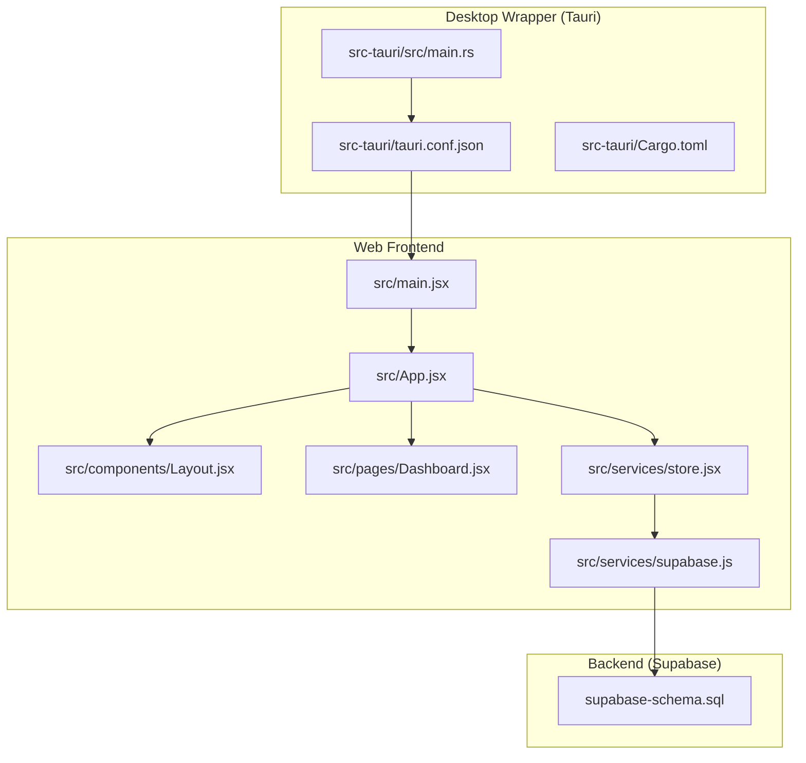
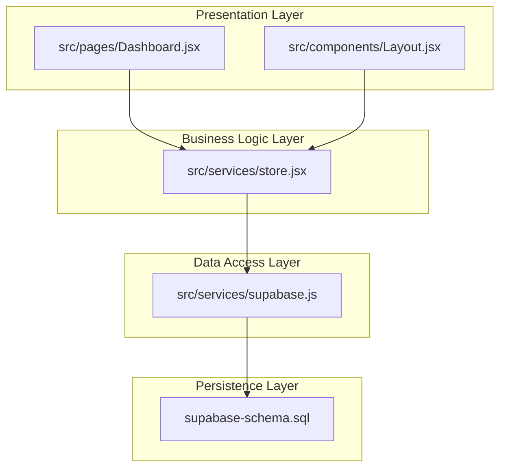
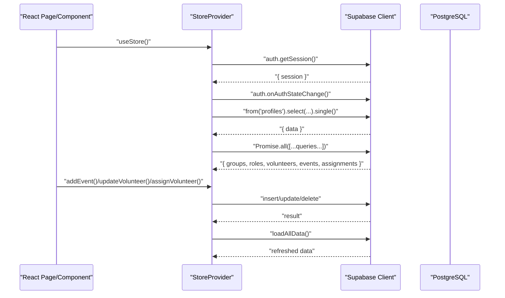
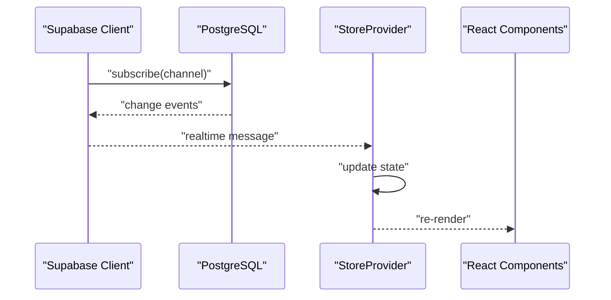
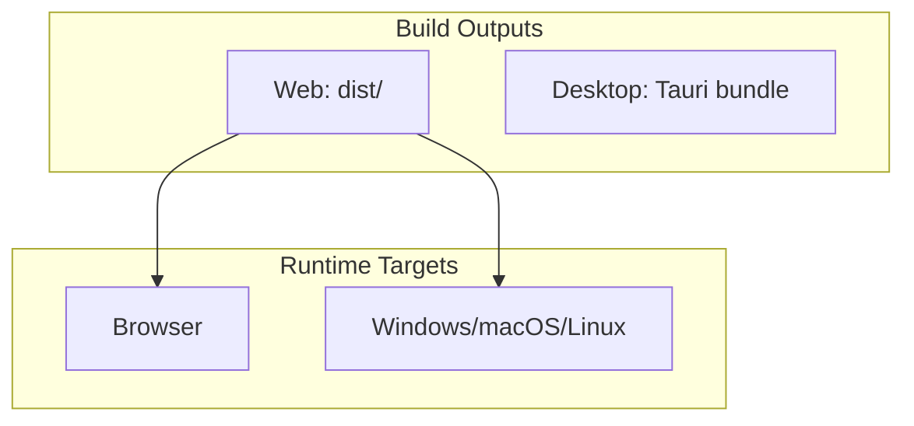
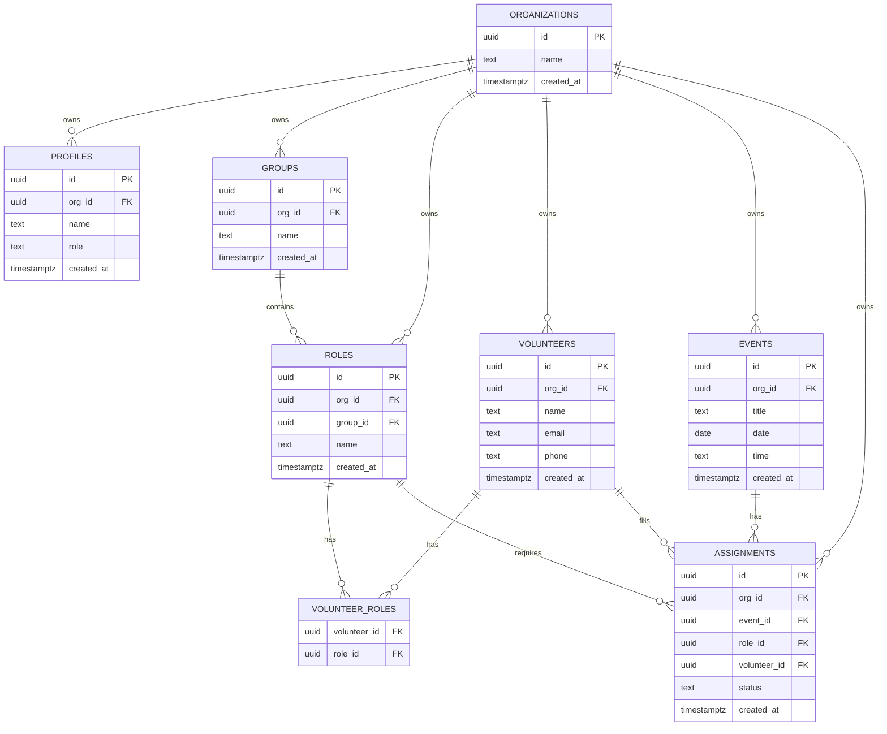
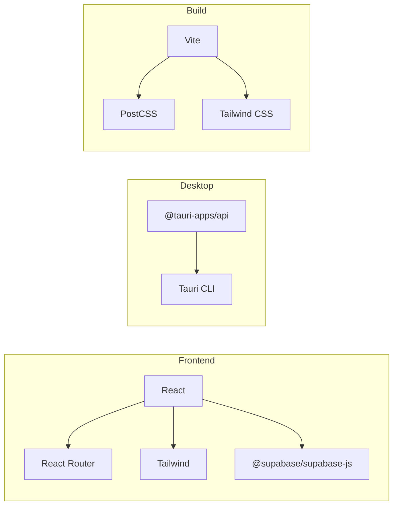

# Architecture Overview

<cite>
**Referenced Files in This Document**
- [package.json](file://package.json)
- [vite.config.js](file://vite.config.js)
- [src/main.jsx](file://src/main.jsx)
- [src/App.jsx](file://src/App.jsx)
- [src/components/Layout.jsx](file://src/components/Layout.jsx)
- [src/pages/Dashboard.jsx](file://src/pages/Dashboard.jsx)
- [src/services/store.jsx](file://src/services/store.jsx)
- [src/services/supabase.js](file://src/services/supabase.js)
- [src-tauri/tauri.conf.json](file://src-tauri/tauri.conf.json)
- [src-tauri/src/main.rs](file://src-tauri/src/main.rs)
- [src-tauri/Cargo.toml](file://src-tauri/Cargo.toml)
- [supabase-schema.sql](file://supabase-schema.sql)
</cite>

## Table of Contents
1. [Introduction](#introduction)
2. [Project Structure](#project-structure)
3. [Core Components](#core-components)
4. [Architecture Overview](#architecture-overview)
5. [Detailed Component Analysis](#detailed-component-analysis)
6. [Dependency Analysis](#dependency-analysis)
7. [Performance Considerations](#performance-considerations)
8. [Troubleshooting Guide](#troubleshooting-guide)
9. [Conclusion](#conclusion)
10. [Appendices](#appendices)

## Introduction
This document presents the architecture of RosterFlow, a multi-platform scheduling application for managing volunteers, roles, groups, events, and assignments. The system follows a layered design:
- Presentation Layer: React application with routing and UI components
- Business Logic Layer: Centralized store provider encapsulating application state and domain actions
- Data Access Layer: Supabase client for authentication, database queries, and real-time subscriptions
- Persistence Layer: PostgreSQL database with Row Level Security (RLS) policies

RosterFlow supports deployment across web, desktop, and mobile environments:
- Web: Built with Vite and served via browser
- Desktop: Wrapped with Tauri, bundling the web assets into a native executable
- Mobile: Supported by the underlying Supabase infrastructure and React stack

Real-time synchronization is achieved through Supabase’s Postgres-based subscriptions, enabling live updates across clients.

## Project Structure
The repository is organized into:
- Frontend (React + Vite): Application entry, routing, components, pages, and services
- Backend (Supabase): Authentication, database schema, and RLS policies
- Desktop Wrapper (Tauri): Native packaging configuration and Rust runtime

**Diagram sources**
- [src/main.jsx](file://src/main.jsx#L1-L11)
- [src/App.jsx](file://src/App.jsx#L1-L37)
- [src/components/Layout.jsx](file://src/components/Layout.jsx#L1-L102)
- [src/pages/Dashboard.jsx](file://src/pages/Dashboard.jsx#L1-L90)
- [src/services/store.jsx](file://src/services/store.jsx#L1-L472)
- [src/services/supabase.js](file://src/services/supabase.js#L1-L13)
- [src-tauri/src/main.rs](file://src-tauri/src/main.rs#L1-L7)
- [src-tauri/tauri.conf.json](file://src-tauri/tauri.conf.json#L1-L35)
- [src-tauri/Cargo.toml](file://src-tauri/Cargo.toml#L1-L26)
- [supabase-schema.sql](file://supabase-schema.sql#L1-L251)

**Section sources**
- [package.json](file://package.json#L1-L44)
- [vite.config.js](file://vite.config.js#L1-L10)
- [src/main.jsx](file://src/main.jsx#L1-L11)
- [src/App.jsx](file://src/App.jsx#L1-L37)
- [src-tauri/tauri.conf.json](file://src-tauri/tauri.conf.json#L1-L35)

## Core Components
- React Application Bootstrap: Initializes the root and mounts the App component.
- Routing and Layout: Defines routes, protected layout, and navigation.
- Store Provider: Centralizes authentication state, organization/profile data, and CRUD operations for groups, roles, volunteers, events, and assignments.
- Supabase Client: Provides typed database access and auth integration.
- Tauri Runtime: Bridges the web assets to a native desktop shell.

Key responsibilities:
- Presentation Layer: Renders UI, handles navigation, and displays derived data.
- Business Logic Layer: Encapsulates domain actions (login/register, CRUD), orchestrates data fetching, and exposes a simple hook-based API.
- Data Access Layer: Uses Supabase client for queries and auth operations.
- Persistence Layer: PostgreSQL schema with RLS policies enforcing per-organization isolation.

**Section sources**
- [src/main.jsx](file://src/main.jsx#L1-L11)
- [src/App.jsx](file://src/App.jsx#L1-L37)
- [src/components/Layout.jsx](file://src/components/Layout.jsx#L1-L102)
- [src/pages/Dashboard.jsx](file://src/pages/Dashboard.jsx#L1-L90)
- [src/services/store.jsx](file://src/services/store.jsx#L1-L472)
- [src/services/supabase.js](file://src/services/supabase.js#L1-L13)

## Architecture Overview
RosterFlow employs a clean, layered architecture with explicit boundaries:
- Presentation Layer: React components and pages consume the Store API
- Business Logic Layer: StoreProvider manages state transitions and orchestrates data operations
- Data Access Layer: Supabase client abstracts database and auth operations
- Persistence Layer: PostgreSQL with RLS policies ensures tenant isolation

**Diagram sources**
- [src/pages/Dashboard.jsx](file://src/pages/Dashboard.jsx#L1-L90)
- [src/components/Layout.jsx](file://src/components/Layout.jsx#L1-L102)
- [src/services/store.jsx](file://src/services/store.jsx#L1-L472)
- [src/services/supabase.js](file://src/services/supabase.js#L1-L13)
- [supabase-schema.sql](file://supabase-schema.sql#L1-L251)

## Detailed Component Analysis

### Store Provider and Data Flow
The StoreProvider coordinates:
- Authentication state initialization and change listening
- Profile and organization resolution
- Bulk data loading for groups, roles, volunteers, events, and assignments
- CRUD operations with optimistic updates and subsequent reloads

**Diagram sources**
- [src/services/store.jsx](file://src/services/store.jsx#L20-L111)
- [src/services/store.jsx](file://src/services/store.jsx#L113-L375)
- [src/services/supabase.js](file://src/services/supabase.js#L1-L13)

**Section sources**
- [src/services/store.jsx](file://src/services/store.jsx#L1-L472)

### Real-Time Synchronization
Supabase enables real-time updates through Postgres-based subscriptions. The Store listens for authentication state changes and loads data upon session establishment. While the current implementation primarily relies on polling via bulk loads, the Supabase client supports subscriptions for reactive updates. Integrating subscriptions would involve:
- Subscribing to tables of interest (e.g., events, assignments)
- Applying filters scoped to the current organization
- Updating local state on incoming events

[No sources needed since this diagram shows conceptual workflow, not actual code structure]

### Cross-Platform Deployment Strategy
- Web: Vite builds static assets into the dist directory; the app runs in a browser.
- Desktop (Tauri): The tauri.conf.json configures the packaged app, pointing to the dist directory for frontend assets and defining window properties. The Rust entry point delegates to the application library.
- Mobile: The React stack and Supabase backend support mobile web experiences; native mobile apps could reuse the same backend.

**Diagram sources**
- [vite.config.js](file://vite.config.js#L1-L10)
- [src-tauri/tauri.conf.json](file://src-tauri/tauri.conf.json#L6-L9)
- [src-tauri/src/main.rs](file://src-tauri/src/main.rs#L1-L7)

**Section sources**
- [vite.config.js](file://vite.config.js#L1-L10)
- [src-tauri/tauri.conf.json](file://src-tauri/tauri.conf.json#L1-L35)
- [src-tauri/src/main.rs](file://src-tauri/src/main.rs#L1-L7)

### Data Model and Security
The database schema defines core entities and enforces per-user organization isolation via RLS policies. The model supports:
- Organizations owning all records
- Profiles extending auth users with organization membership
- Hierarchical grouping: Groups -> Roles, and many-to-many mapping via volunteer_roles
- Events and Assignments linking roles to volunteers

**Diagram sources**
- [supabase-schema.sql](file://supabase-schema.sql#L7-L76)

**Section sources**
- [supabase-schema.sql](file://supabase-schema.sql#L1-L251)

## Dependency Analysis
External dependencies and integrations:
- React ecosystem: React, React Router DOM, Tailwind-based styling
- Supabase: Authentication and database client
- Tauri: Desktop packaging and runtime
- Build tooling: Vite, PostCSS, Tailwind CSS

**Diagram sources**
- [package.json](file://package.json#L15-L38)
- [src-tauri/Cargo.toml](file://src-tauri/Cargo.toml#L20-L26)

**Section sources**
- [package.json](file://package.json#L1-L44)
- [src-tauri/Cargo.toml](file://src-tauri/Cargo.toml#L1-L26)

## Performance Considerations
- Data Loading: The Store performs parallel queries for initial data, reducing total latency. Consider pagination and selective re-fetching for large datasets.
- Rendering: Keep components pure and memoize derived data to minimize re-renders.
- Network Efficiency: Batch writes and avoid redundant reloads after mutations.
- Real-time Updates: Introduce targeted Supabase subscriptions to push updates instead of polling.
- Desktop Packaging: Optimize asset sizes and leverage Tauri’s minimal runtime overhead.

[No sources needed since this section provides general guidance]

## Troubleshooting Guide
Common issues and remedies:
- Missing Supabase Environment Variables: Ensure Vite environment variables are configured; the client warns when URL or anonymous key are missing.
- Authentication State Not Persisting: Verify auth session retrieval and subscription handling in the Store.
- Data Not Reflecting Changes: Confirm that mutations trigger data refresh and that RLS policies permit the current user to access updated rows.
- Desktop Window Issues: Validate tauri.conf.json window configuration and frontend build path.

**Section sources**
- [src/services/supabase.js](file://src/services/supabase.js#L1-L13)
- [src/services/store.jsx](file://src/services/store.jsx#L20-L52)
- [src-tauri/tauri.conf.json](file://src-tauri/tauri.conf.json#L6-L9)

## Conclusion
RosterFlow’s architecture cleanly separates concerns across presentation, business logic, data access, and persistence layers. It leverages Supabase for scalable authentication and database operations with robust tenant isolation via RLS. The Tauri wrapper enables efficient desktop distribution while maintaining a unified React codebase. Extending real-time capabilities through Supabase subscriptions and optimizing data flows will further improve responsiveness and scalability.

[No sources needed since this section summarizes without analyzing specific files]

## Appendices

### Technology Stack Rationale
- React + Vite: Rapid development, strong ecosystem, and efficient builds
- Supabase: Full-stack solution integrating auth, database, and real-time
- Tauri: Lightweight desktop packaging with native OS integration
- Tailwind CSS: Utility-first styling for rapid UI iteration

[No sources needed since this section provides general guidance]