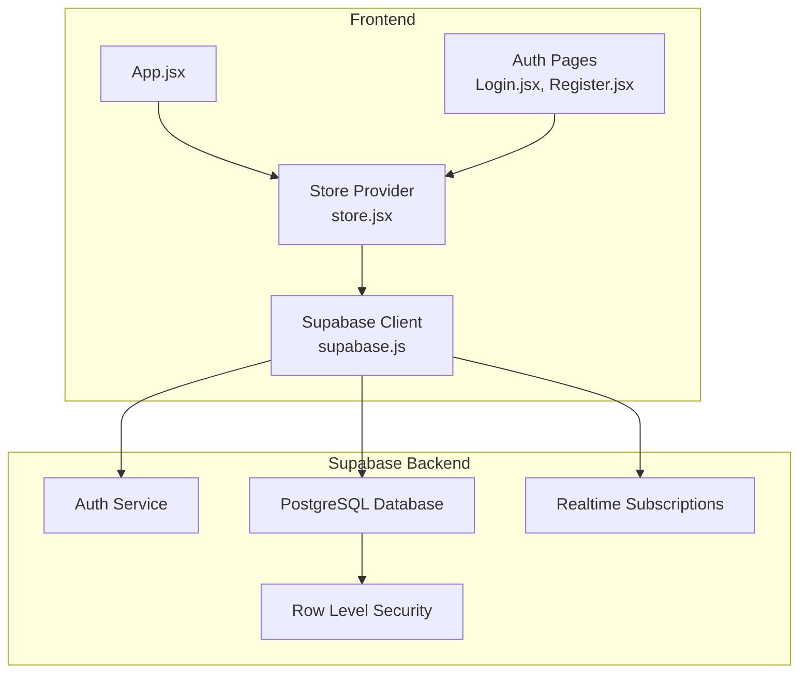
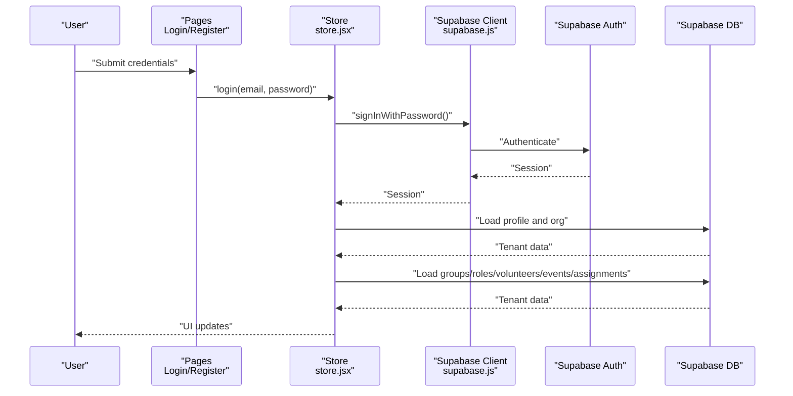
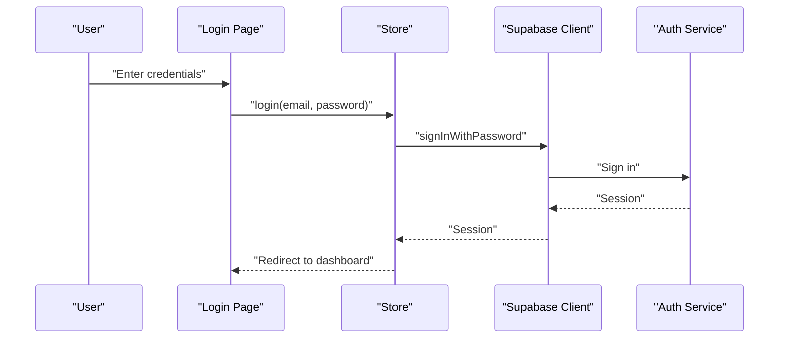
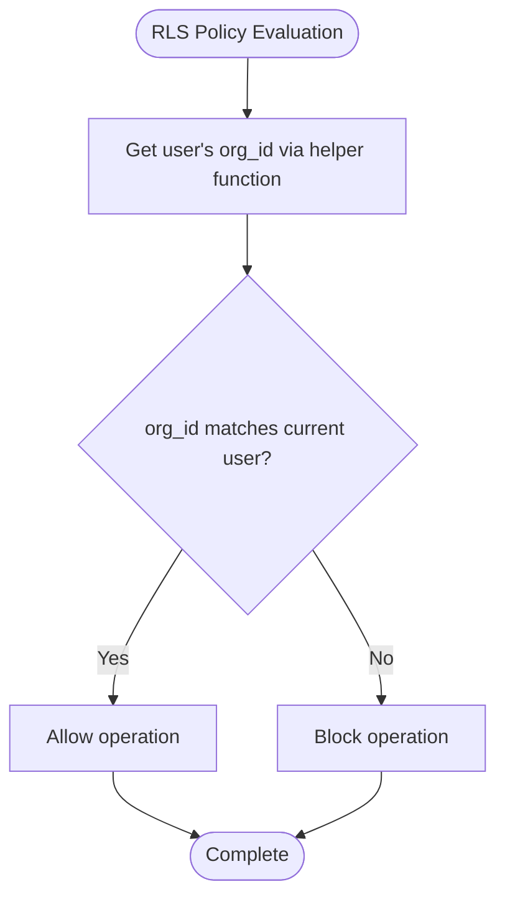
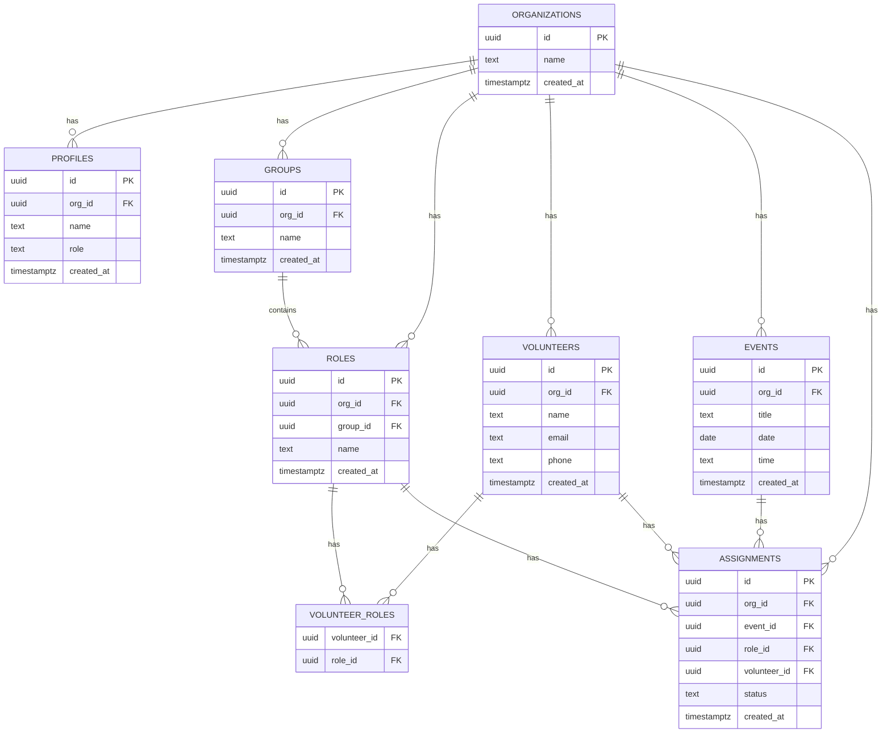
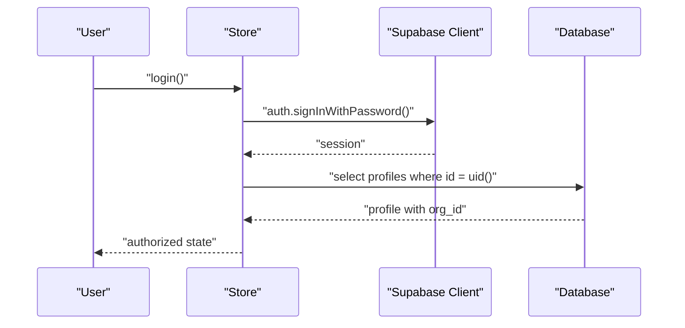
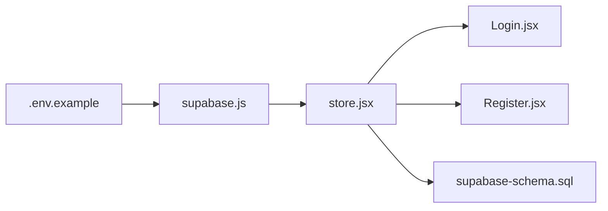

# Backend Architecture

<cite>
**Referenced Files in This Document**
- [supabase.js](file://src/services/supabase.js)
- [store.jsx](file://src/services/store.jsx)
- [supabase-schema.sql](file://supabase-schema.sql)
- [.env.example](file://.env.example)
- [package.json](file://package.json)
- [Login.jsx](file://src/pages/Login.jsx)
- [Register.jsx](file://src/pages/Register.jsx)
- [App.jsx](file://src/App.jsx)
</cite>

## Table of Contents
1. [Introduction](#introduction)
2. [Project Structure](#project-structure)
3. [Core Components](#core-components)
4. [Architecture Overview](#architecture-overview)
5. [Detailed Component Analysis](#detailed-component-analysis)
6. [Dependency Analysis](#dependency-analysis)
7. [Performance Considerations](#performance-considerations)
8. [Troubleshooting Guide](#troubleshooting-guide)
9. [Conclusion](#conclusion)

## Introduction
This document describes the backend architecture of RosterFlow’s Supabase-powered system. It covers Supabase client configuration, authentication and session handling, Row Level Security (RLS) for tenant isolation, database schema design, and frontend integration patterns. It also outlines real-time capabilities, API endpoint design principles, validation strategies, scalability, backups, and monitoring approaches.

## Project Structure
RosterFlow is a frontend-first application that integrates with Supabase for authentication, database, and real-time features. The backend is entirely serverless via Supabase, while the frontend manages state, UI routing, and user interactions.

**Diagram sources**
- [App.jsx](file://src/App.jsx#L1-L37)
- [Login.jsx](file://src/pages/Login.jsx#L1-L80)
- [Register.jsx](file://src/pages/Register.jsx#L1-L101)
- [store.jsx](file://src/services/store.jsx#L1-L472)
- [supabase.js](file://src/services/supabase.js#L1-L13)
- [supabase-schema.sql](file://supabase-schema.sql#L1-L251)

**Section sources**
- [App.jsx](file://src/App.jsx#L1-L37)
- [store.jsx](file://src/services/store.jsx#L1-L472)
- [supabase.js](file://src/services/supabase.js#L1-L13)

## Core Components
- Supabase client initialization and environment configuration
- Authentication and session management
- Tenant isolation via Row Level Security
- Data access layer with CRUD operations
- Real-time subscriptions for live updates

**Section sources**
- [supabase.js](file://src/services/supabase.js#L1-L13)
- [store.jsx](file://src/services/store.jsx#L1-L472)
- [supabase-schema.sql](file://supabase-schema.sql#L78-L251)

## Architecture Overview
RosterFlow uses Supabase as a backend-as-a-service. The frontend initializes the Supabase client, authenticates users, loads tenant-aware data, and subscribes to real-time updates. Supabase enforces tenant isolation through RLS policies and triggers.

**Diagram sources**
- [Login.jsx](file://src/pages/Login.jsx#L14-L25)
- [store.jsx](file://src/services/store.jsx#L114-L124)
- [store.jsx](file://src/services/store.jsx#L23-L34)
- [store.jsx](file://src/services/store.jsx#L54-L68)
- [store.jsx](file://src/services/store.jsx#L78-L111)

## Detailed Component Analysis

### Supabase Client Configuration
- Environment variables are loaded from the frontend build environment and passed to the Supabase client.
- The client is created once and exported for use across the app.
- Missing environment variables produce a warning to aid local development setup.

Implementation highlights:
- Client creation and environment variable usage
- Early warning for missing configuration

**Section sources**
- [supabase.js](file://src/services/supabase.js#L1-L13)
- [.env.example](file://.env.example#L1-L5)

### Authentication and Session Management
- Authentication state is initialized by fetching the current session.
- An auth state change listener keeps the UI synchronized with login/logout events.
- Login uses a password-based sign-in method.
- Registration performs a multi-step process: create auth user, create organization, create profile, and auto-load profile.

**Diagram sources**
- [Login.jsx](file://src/pages/Login.jsx#L14-L25)
- [store.jsx](file://src/services/store.jsx#L114-L124)
- [store.jsx](file://src/services/store.jsx#L23-L34)

**Section sources**
- [store.jsx](file://src/services/store.jsx#L21-L34)
- [store.jsx](file://src/services/store.jsx#L114-L124)
- [store.jsx](file://src/services/store.jsx#L126-L159)

### Tenant Isolation with Row Level Security (RLS)
- All tables enable RLS.
- A helper function retrieves the current user’s organization ID.
- Policies restrict reads/writes to rows where the organization ID matches the current user’s org_id.
- Additional policies govern inserts and updates, ensuring data integrity and tenant boundaries.

**Diagram sources**
- [supabase-schema.sql](file://supabase-schema.sql#L88-L97)
- [supabase-schema.sql](file://supabase-schema.sql#L100-L106)
- [supabase-schema.sql](file://supabase-schema.sql#L121-L136)
- [supabase-schema.sql](file://supabase-schema.sql#L155-L170)
- [supabase-schema.sql](file://supabase-schema.sql#L191-L206)
- [supabase-schema.sql](file://supabase-schema.sql#L208-L223)

**Section sources**
- [supabase-schema.sql](file://supabase-schema.sql#L78-L97)
- [supabase-schema.sql](file://supabase-schema.sql#L100-L106)
- [supabase-schema.sql](file://supabase-schema.sql#L121-L136)
- [supabase-schema.sql](file://supabase-schema.sql#L155-L170)
- [supabase-schema.sql](file://supabase-schema.sql#L191-L206)
- [supabase-schema.sql](file://supabase-schema.sql#L208-L223)

### Database Schema Design and Entity Relationships
The schema defines core entities for organizations, profiles, groups, roles, volunteers, events, and assignments, with explicit foreign keys and constraints. Many-to-many relationships are modeled via junction tables.

**Diagram sources**
- [supabase-schema.sql](file://supabase-schema.sql#L7-L21)
- [supabase-schema.sql](file://supabase-schema.sql#L23-L38)
- [supabase-schema.sql](file://supabase-schema.sql#L31-L48)
- [supabase-schema.sql](file://supabase-schema.sql#L57-L65)
- [supabase-schema.sql](file://supabase-schema.sql#L50-L55)
- [supabase-schema.sql](file://supabase-schema.sql#L67-L76)

**Section sources**
- [supabase-schema.sql](file://supabase-schema.sql#L7-L21)
- [supabase-schema.sql](file://supabase-schema.sql#L23-L38)
- [supabase-schema.sql](file://supabase-schema.sql#L50-L55)
- [supabase-schema.sql](file://supabase-schema.sql#L57-L65)
- [supabase-schema.sql](file://supabase-schema.sql#L67-L76)

### Real-Time Subscriptions for Live Updates
- The frontend currently loads data on mount and on auth changes but does not subscribe to real-time updates.
- To enable live synchronization, integrate Supabase Realtime subscriptions for each entity collection and apply reactive updates to the store state.
- This would complement the existing RLS policies to ensure clients only receive events for their tenant.

[No sources needed since this section provides general guidance]

### API Endpoint Design Principles and Data Validation
- Frontend uses Supabase’s JavaScript client to perform CRUD operations against named tables.
- Validation occurs at the database level via constraints (primary keys, foreign keys, checks) and at the application level via form inputs and controlled components.
- RLS policies act as runtime authorization guards to enforce tenant boundaries.

**Section sources**
- [store.jsx](file://src/services/store.jsx#L162-L194)
- [store.jsx](file://src/services/store.jsx#L196-L228)
- [store.jsx](file://src/services/store.jsx#L245-L292)
- [store.jsx](file://src/services/store.jsx#L295-L314)
- [store.jsx](file://src/services/store.jsx#L331-L375)
- [store.jsx](file://src/services/store.jsx#L378-L422)
- [supabase-schema.sql](file://supabase-schema.sql#L18-L18)
- [supabase-schema.sql](file://supabase-schema.sql#L74-L74)

### Authentication Flow: JWT Token Management and Role-Based Access Control
- Authentication relies on Supabase Auth with password-based sign-in.
- The session contains the user identity and metadata; the frontend loads the associated profile and organization.
- Role-based access control is enforced by RLS policies and application-level checks; the profile table includes a role field to support admin/member distinctions.

**Diagram sources**
- [store.jsx](file://src/services/store.jsx#L114-L124)
- [store.jsx](file://src/services/store.jsx#L54-L68)

**Section sources**
- [store.jsx](file://src/services/store.jsx#L54-L68)
- [store.jsx](file://src/services/store.jsx#L114-L124)
- [supabase-schema.sql](file://supabase-schema.sql#L18-L20)

## Dependency Analysis
- The frontend depends on the Supabase JS client for authentication and database operations.
- The client depends on environment variables configured during the build process.
- Application logic orchestrates auth state, loads tenant data, and performs CRUD operations.

**Diagram sources**
- [.env.example](file://.env.example#L1-L5)
- [supabase.js](file://src/services/supabase.js#L1-L13)
- [store.jsx](file://src/services/store.jsx#L1-L472)
- [Login.jsx](file://src/pages/Login.jsx#L1-L80)
- [Register.jsx](file://src/pages/Register.jsx#L1-L101)
- [supabase-schema.sql](file://supabase-schema.sql#L1-L251)

**Section sources**
- [package.json](file://package.json#L15-L24)
- [supabase.js](file://src/services/supabase.js#L1-L13)
- [store.jsx](file://src/services/store.jsx#L1-L472)

## Performance Considerations
- Parallelize initial data loads to reduce first render latency.
- Use efficient queries with appropriate ordering and filtering.
- Consider pagination for large datasets.
- Monitor Supabase metrics and adjust connection limits and caching strategies as needed.

[No sources needed since this section provides general guidance]

## Troubleshooting Guide
Common issues and remedies:
- Missing environment variables cause the Supabase client to initialize with empty keys; ensure VITE_SUPABASE_URL and VITE_SUPABASE_ANON_KEY are set.
- Authentication failures surface as errors thrown by the client; display user-friendly messages and validate credentials.
- RLS policy violations appear as permission errors; verify that org_id is correctly set and that the user belongs to the intended organization.

**Section sources**
- [supabase.js](file://src/services/supabase.js#L6-L8)
- [store.jsx](file://src/services/store.jsx#L114-L124)
- [store.jsx](file://src/services/store.jsx#L54-L68)

## Conclusion
RosterFlow leverages Supabase for a secure, scalable, and maintainable backend. Authentication and tenant isolation are handled server-side with robust RLS policies. The frontend integrates tightly with Supabase for auth, data, and real-time features. Extending real-time subscriptions and optimizing data access patterns will further enhance responsiveness and user experience.