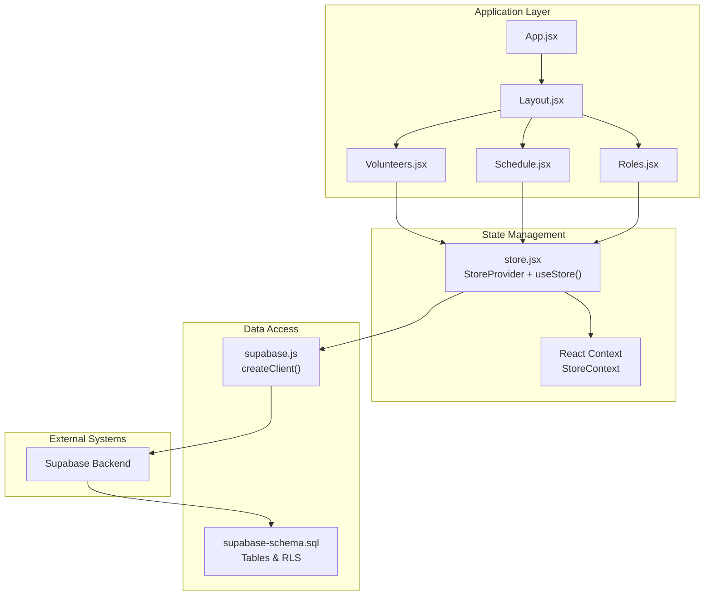
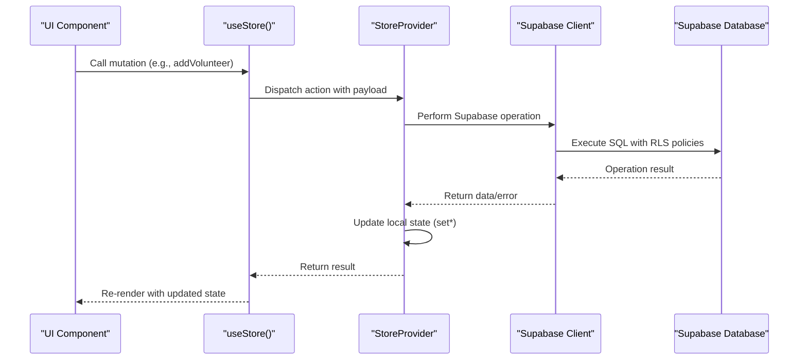
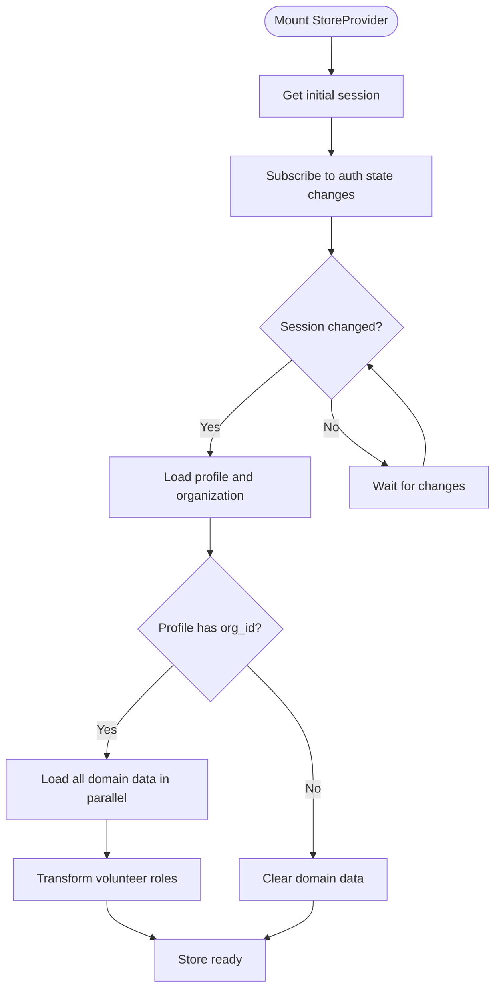
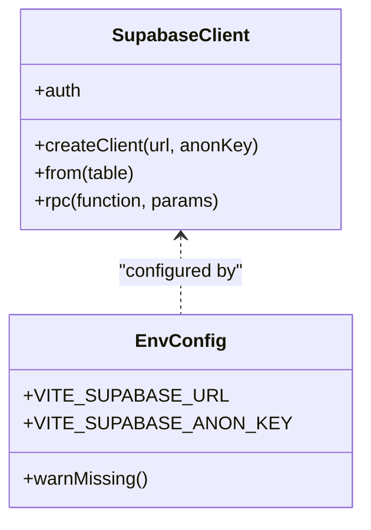
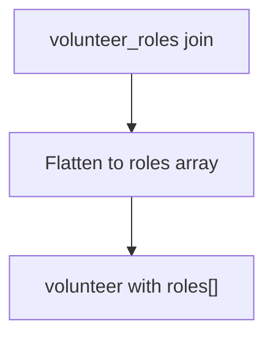
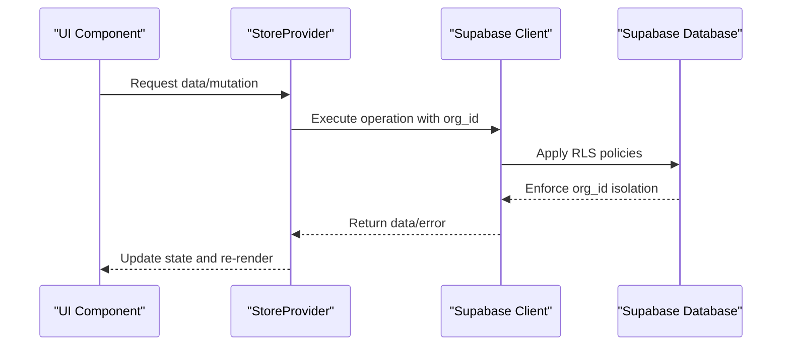
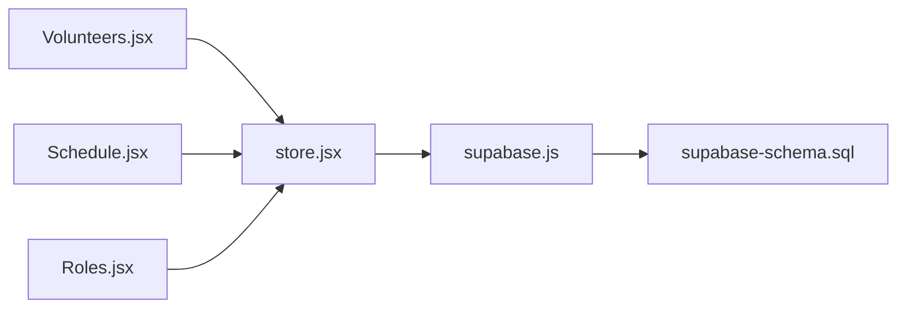

# Data Flow Architecture

<cite>
**Referenced Files in This Document**
- [store.jsx](file://src/services/store.jsx)
- [supabase.js](file://src/services/supabase.js)
- [App.jsx](file://src/App.jsx)
- [main.jsx](file://src/main.jsx)
- [Layout.jsx](file://src/components/Layout.jsx)
- [Volunteers.jsx](file://src/pages/Volunteers.jsx)
- [Schedule.jsx](file://src/pages/Schedule.jsx)
- [Roles.jsx](file://src/pages/Roles.jsx)
- [supabase-schema.sql](file://supabase-schema.sql)
- [.env.example](file://.env.example)
- [package.json](file://package.json)
</cite>

## Table of Contents
1. [Introduction](#introduction)
2. [Project Structure](#project-structure)
3. [Core Components](#core-components)
4. [Architecture Overview](#architecture-overview)
5. [Detailed Component Analysis](#detailed-component-analysis)
6. [Dependency Analysis](#dependency-analysis)
7. [Performance Considerations](#performance-considerations)
8. [Troubleshooting Guide](#troubleshooting-guide)
9. [Conclusion](#conclusion)

## Introduction
This document explains RosterFlow's data flow architecture, focusing on centralized state management using React Context and real-time synchronization with Supabase. It covers how UI components interact with the store hooks, how data flows from components to the Supabase client and database, and how the system maintains consistency across multiple clients. It also documents the current state of real-time subscriptions, optimistic updates, offline-first strategies, and error handling mechanisms.

## Project Structure
RosterFlow follows a React-based frontend architecture with a central store provider wrapping the application routes. The store manages authentication state, organization context, and all domain data (groups, roles, volunteers, events, assignments). Supabase provides the backend client and row-level security policies.

**Diagram sources**
- [App.jsx](file://src/App.jsx#L13-L34)
- [Layout.jsx](file://src/components/Layout.jsx#L14-L107)
- [store.jsx](file://src/services/store.jsx#L6-L467)
- [supabase.js](file://src/services/supabase.js#L1-L13)
- [supabase-schema.sql](file://supabase-schema.sql#L1-L251)

**Section sources**
- [App.jsx](file://src/App.jsx#L1-L37)
- [store.jsx](file://src/services/store.jsx#L1-L472)
- [supabase.js](file://src/services/supabase.js#L1-L13)

## Core Components
- Store Provider: Centralizes authentication, organization, and domain data state. Provides CRUD operations for volunteers, events, assignments, roles, and groups.
- Supabase Client: Creates a typed client configured from environment variables and exposes a singleton instance for all data operations.
- UI Pages: Consume store hooks to render data and trigger mutations. They orchestrate user interactions and present derived views.

Key responsibilities:
- Authentication lifecycle and session management
- Initial data loading and organization-scoped filtering
- Domain mutation operations with error propagation
- Derived user object for UI compatibility

**Section sources**
- [store.jsx](file://src/services/store.jsx#L6-L472)
- [supabase.js](file://src/services/supabase.js#L1-L13)
- [Volunteers.jsx](file://src/pages/Volunteers.jsx#L1-L354)
- [Schedule.jsx](file://src/pages/Schedule.jsx#L1-L731)
- [Roles.jsx](file://src/pages/Roles.jsx#L1-L386)

## Architecture Overview
The system implements a unidirectional data flow:
1. UI components call store hooks to read state or trigger mutations.
2. Store hooks perform Supabase operations and update local state.
3. Local state updates re-render components immediately.
4. Supabase handles persistence and enforces row-level security policies.

**Diagram sources**
- [store.jsx](file://src/services/store.jsx#L162-L194)
- [Volunteers.jsx](file://src/pages/Volunteers.jsx#L45-L66)

## Detailed Component Analysis

### Store Provider and Context
The StoreProvider creates a React Context containing:
- Authentication state: session, profile, organization, loading
- Domain collections: groups, roles, volunteers, events, assignments
- Functions for auth and CRUD operations
- Derived user object for UI compatibility

Initialization flow:
- On mount, retrieves the current session and subscribes to auth state changes.
- When session changes, loads profile and organization, then loads all domain data in parallel.
- Exposes a refreshData function to reload all data.

Data loading strategy:
- Parallel loading of groups, roles, volunteers, events, and assignments.
- Volunteer records are transformed to flatten the many-to-many relationship between volunteers and roles.

Error handling:
- Logs errors during data loading and mutation operations.
- Throws errors from Supabase operations to propagate failures to callers.

**Diagram sources**
- [store.jsx](file://src/services/store.jsx#L21-L52)
- [store.jsx](file://src/services/store.jsx#L78-L111)
- [store.jsx](file://src/services/store.jsx#L98-L104)

**Section sources**
- [store.jsx](file://src/services/store.jsx#L6-L472)

### Supabase Client and Environment Configuration
The Supabase client is created from environment variables:
- VITE_SUPABASE_URL: Supabase project URL
- VITE_SUPABASE_ANON_KEY: Public anonymous key

Environment validation:
- Warns if required environment variables are missing.

**Diagram sources**
- [supabase.js](file://src/services/supabase.js#L1-L13)
- [.env.example](file://.env.example#L1-L5)

**Section sources**
- [supabase.js](file://src/services/supabase.js#L1-L13)
- [.env.example](file://.env.example#L1-L5)

### Real-Time Data Synchronization
Current implementation:
- The store initializes auth state and loads data on mount and session changes.
- There are no explicit Supabase real-time subscriptions in the store.

Implications:
- UI reflects database state after manual refresh or when store reloads data.
- No automatic live updates across clients are implemented.

Recommended enhancements (conceptual):
- Add Supabase channel subscriptions for each domain table.
- Implement a subscription manager to handle connection lifecycle and cleanup.
- Merge server-side changes with local state while preserving optimistic updates.

[No sources needed since this section analyzes current absence of real-time features]

### Conflict Resolution and Optimistic Updates
Current implementation:
- Mutations call loadAllData after successful operations, which overwrites local state with latest server data.
- No optimistic UI updates are implemented.

Implications:
- UI may briefly show stale state until reload completes.
- Conflicts are resolved by server state on next refresh.

Recommended enhancements (conceptual):
- Implement optimistic updates by temporarily applying mutations to local state.
- Queue pending writes and reconcile with server responses.
- Use conflict detection (e.g., timestamps or ETags) to merge concurrent edits.

[No sources needed since this section analyzes current absence of optimistic updates]

### Offline-First Approach
Current implementation:
- No client-side caching or offline storage is implemented.
- All reads and writes go directly to the Supabase client.

Implications:
- Network connectivity is required for all operations.
- No offline capability exists.

Recommended enhancements (conceptual):
- Introduce a local cache layer (e.g., IndexedDB or localStorage) for domain data.
- Track write queues for offline mutations.
- Sync cached writes when online and resolve conflicts.

[No sources needed since this section analyzes current absence of offline-first features]

### Data Transformation Patterns
Volunteer data transformation:
- The store transforms volunteer records by flattening the volunteer_roles join table into a roles array on the volunteer object.
- This simplifies UI rendering and avoids complex joins in components.

**Diagram sources**
- [store.jsx](file://src/services/store.jsx#L98-L104)

**Section sources**
- [store.jsx](file://src/services/store.jsx#L96-L104)

### Caching Mechanisms
Current implementation:
- No explicit caching is implemented in the store.
- Data is fetched fresh on each loadAllData invocation.

Performance considerations:
- Parallel loading reduces round-trips but still requires network calls.
- Consider memoization of derived data (e.g., volunteer-role mapping) to reduce computation overhead.

[No sources needed since this section analyzes current absence of caching]

### Error Handling Strategies
Error handling patterns:
- Errors from Supabase operations are logged and thrown to the caller.
- UI components catch and display errors appropriately (e.g., confirm dialogs for deletions).

Recommended enhancements (conceptual):
- Implement retry logic with exponential backoff for transient failures.
- Provide user-friendly error messages and recovery actions.
- Surface operation-specific errors to UI for targeted feedback.

**Section sources**
- [store.jsx](file://src/services/store.jsx#L61-L64)
- [store.jsx](file://src/services/store.jsx#L176-L179)
- [Volunteers.jsx](file://src/pages/Volunteers.jsx#L33-L37)

### Integration Between Local State and Remote Database
Integration points:
- Auth state drives organization scoping and data loading.
- All domain mutations are scoped to the current organization via Supabase RLS policies.
- Derived user object provides UI compatibility with existing components.

**Diagram sources**
- [store.jsx](file://src/services/store.jsx#L78-L111)
- [supabase-schema.sql](file://supabase-schema.sql#L78-L224)

**Section sources**
- [store.jsx](file://src/services/store.jsx#L78-L111)
- [supabase-schema.sql](file://supabase-schema.sql#L78-L224)

## Dependency Analysis
The store depends on:
- Supabase client for all data operations
- React Context for state distribution
- UI components for triggering actions

UI components depend on:
- Store hooks for state and actions
- Router for navigation

**Diagram sources**
- [Volunteers.jsx](file://src/pages/Volunteers.jsx#L1-L354)
- [Schedule.jsx](file://src/pages/Schedule.jsx#L1-L731)
- [Roles.jsx](file://src/pages/Roles.jsx#L1-L386)
- [store.jsx](file://src/services/store.jsx#L1-L472)
- [supabase.js](file://src/services/supabase.js#L1-L13)
- [supabase-schema.sql](file://supabase-schema.sql#L1-L251)

**Section sources**
- [package.json](file://package.json#L15-L24)

## Performance Considerations
- Parallel data loading reduces latency for initial renders.
- Consider debouncing search/filter operations in UI components.
- Memoize derived data computations to avoid unnecessary re-renders.
- Batch mutations where possible to minimize network requests.

[No sources needed since this section provides general guidance]

## Troubleshooting Guide
Common issues and resolutions:
- Missing environment variables: Ensure VITE_SUPABASE_URL and VITE_SUPABASE_ANON_KEY are set in the environment.
- Authentication failures: Verify session state and re-authenticate if needed.
- Data not loading: Confirm organization is set on the profile and that RLS policies permit access.
- Mutation errors: Check Supabase logs and ensure required fields are provided.

**Section sources**
- [.env.example](file://.env.example#L1-L5)
- [store.jsx](file://src/services/store.jsx#L6-L8)
- [store.jsx](file://src/services/store.jsx#L114-L124)

## Conclusion
RosterFlow currently implements a robust centralized state management system with clear separation of concerns. The store orchestrates authentication, organization scoping, and domain data operations, while Supabase provides secure, policy-enforced persistence. While the current implementation focuses on correctness and simplicity, future enhancements could include real-time subscriptions, optimistic updates, offline-first capabilities, and advanced caching to improve responsiveness and reliability across diverse deployment scenarios.