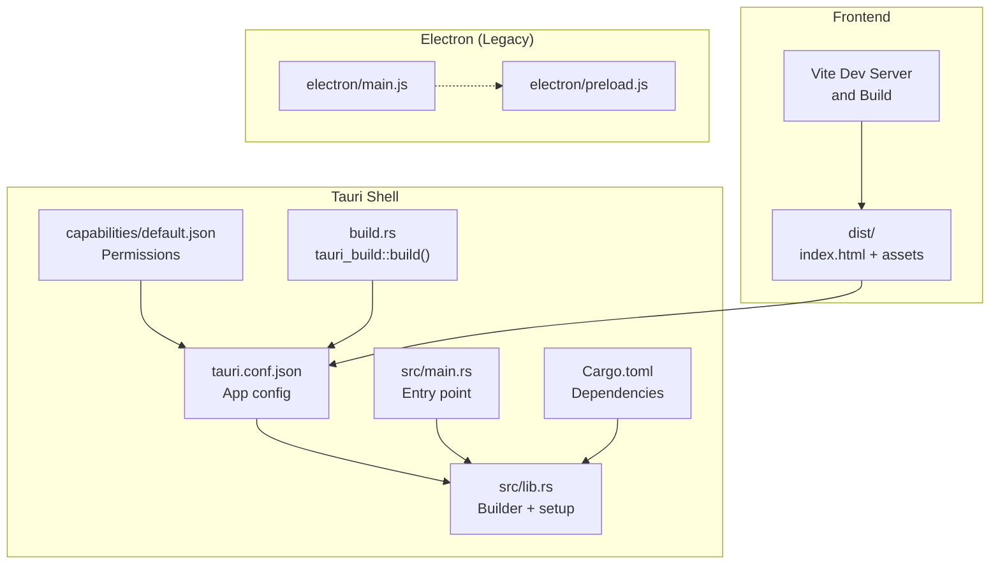
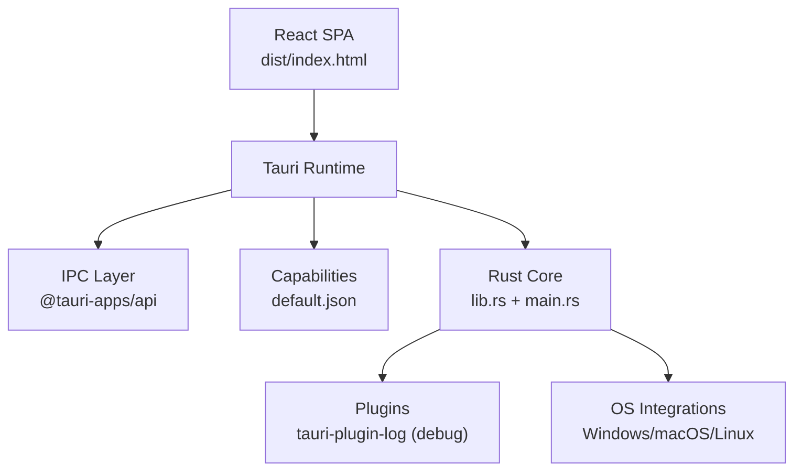
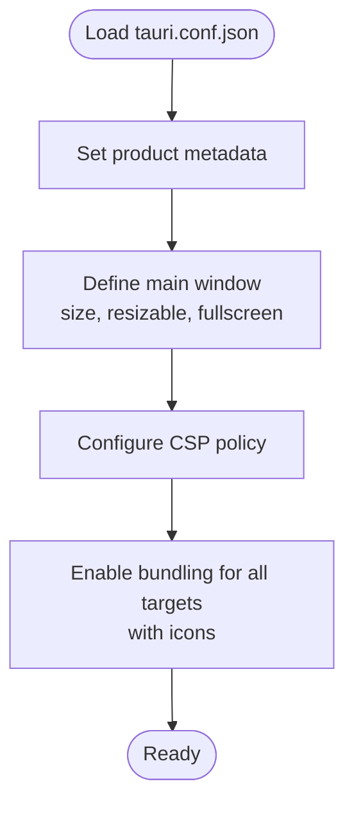
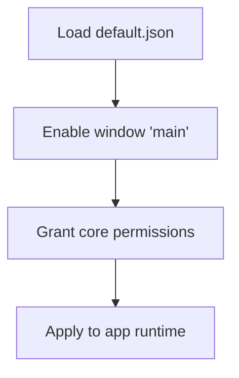
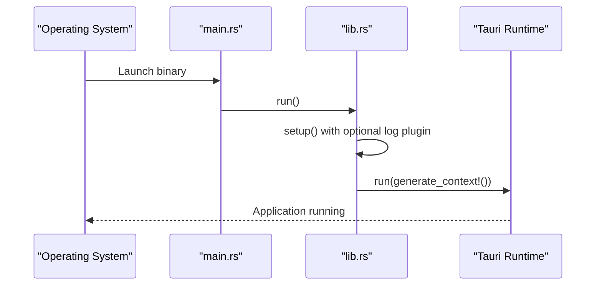
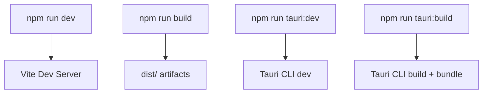
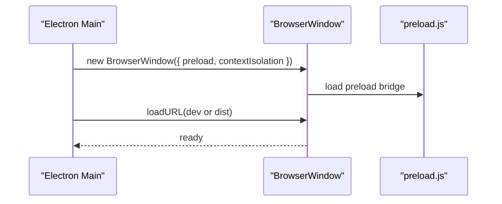
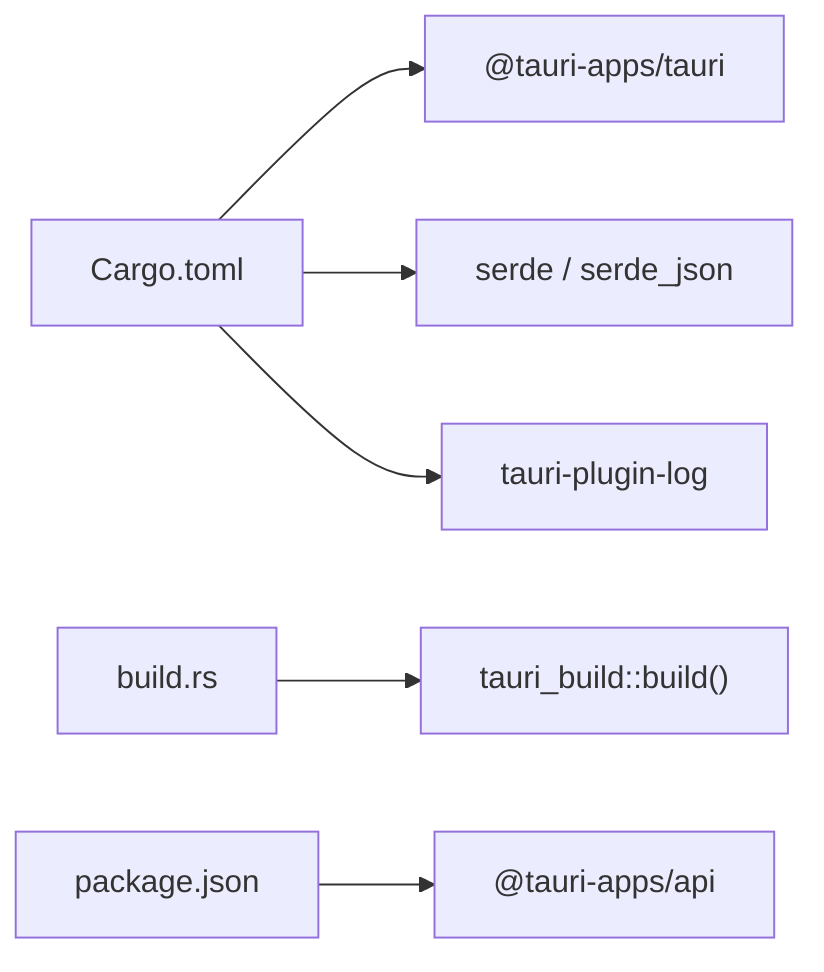
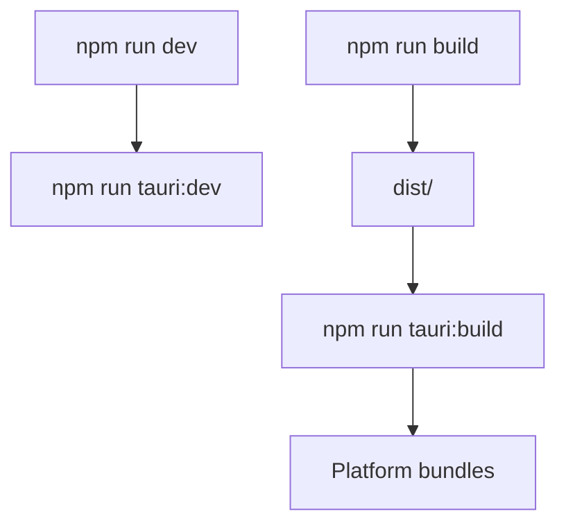
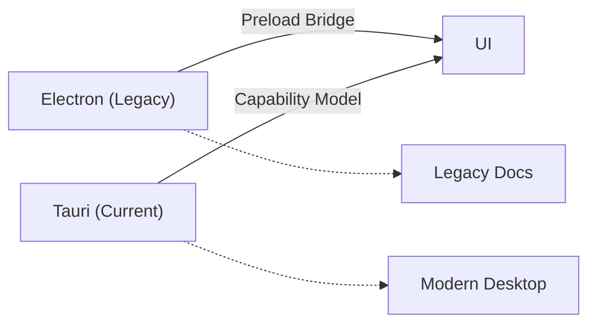

# Desktop Architecture

<cite>
**Referenced Files in This Document**
- [tauri.conf.json](file://src-tauri/tauri.conf.json)
- [Cargo.toml](file://src-tauri/Cargo.toml)
- [build.rs](file://src-tauri/build.rs)
- [main.rs](file://src-tauri/src/main.rs)
- [lib.rs](file://src-tauri/src/lib.rs)
- [default.json](file://src-tauri/capabilities/default.json)
- [package.json](file://package.json)
- [vite.config.js](file://vite.config.js)
- [ELECTRON_BUILD.md](file://ELECTRON_BUILD.md)
- [main.js](file://electron/main.js)
- [preload.js](file://electron/preload.js)
</cite>

## Table of Contents
1. [Introduction](#introduction)
2. [Project Structure](#project-structure)
3. [Core Components](#core-components)
4. [Architecture Overview](#architecture-overview)
5. [Detailed Component Analysis](#detailed-component-analysis)
6. [Dependency Analysis](#dependency-analysis)
7. [Performance Considerations](#performance-considerations)
8. [Security Considerations](#security-considerations)
9. [Build and Distribution](#build-and-distribution)
10. [Migration from Electron](#migration-from-electron)
11. [Troubleshooting Guide](#troubleshooting-guide)
12. [Conclusion](#conclusion)

## Introduction
This document describes the desktop architecture of RosterFlow’s cross-platform application built with Tauri 2.x. It explains the Tauri configuration for window management, capability-based permissions, and bundling. It documents the Rust backend entry points and the frontend integration via Vite and Tauri CLI. It also compares the current Tauri implementation with the legacy Electron setup, outlines build and distribution strategies, and covers security considerations for desktop apps.

## Project Structure
RosterFlow is organized into a frontend (React/Vite) and a Tauri-based desktop shell. The Tauri application resides under src-tauri and is configured via tauri.conf.json. The frontend assets are built into dist/ and served by Tauri. The Electron implementation remains as a historical reference.

**Diagram sources**
- [tauri.conf.json](file://src-tauri/tauri.conf.json#L1-L35)
- [Cargo.toml](file://src-tauri/Cargo.toml#L1-L26)
- [build.rs](file://src-tauri/build.rs#L1-L4)
- [main.rs](file://src-tauri/src/main.rs#L1-L7)
- [lib.rs](file://src-tauri/src/lib.rs#L1-L17)
- [default.json](file://src-tauri/capabilities/default.json#L1-L12)
- [package.json](file://package.json#L1-L44)
- [vite.config.js](file://vite.config.js#L1-L10)
- [main.js](file://electron/main.js#L1-L46)
- [preload.js](file://electron/preload.js#L1-L7)

**Section sources**
- [tauri.conf.json](file://src-tauri/tauri.conf.json#L1-L35)
- [Cargo.toml](file://src-tauri/Cargo.toml#L1-L26)
- [build.rs](file://src-tauri/build.rs#L1-L4)
- [main.rs](file://src-tauri/src/main.rs#L1-L7)
- [lib.rs](file://src-tauri/src/lib.rs#L1-L17)
- [default.json](file://src-tauri/capabilities/default.json#L1-L12)
- [package.json](file://package.json#L1-L44)
- [vite.config.js](file://vite.config.js#L1-L10)
- [main.js](file://electron/main.js#L1-L46)
- [preload.js](file://electron/preload.js#L1-L7)

## Core Components
- Tauri configuration and bundling: Centralized in tauri.conf.json, including product metadata, window defaults, CSP policy, and icon set for multiple targets.
- Capability-based permissions: Defined in capabilities/default.json, enabling default core permissions for the main window.
- Rust backend entry points: src/main.rs sets the subsystem and delegates to src/lib.rs, which initializes Tauri with optional logging plugin in debug builds.
- Frontend build pipeline: Vite builds React app assets into dist/, consumed by Tauri in production and development.
- Electron legacy: electron/main.js and electron/preload.js illustrate the previous Electron architecture for comparison.

Key implementation references:
- Tauri app configuration and window defaults: [tauri.conf.json](file://src-tauri/tauri.conf.json#L10-L23)
- Capability permissions: [default.json](file://src-tauri/capabilities/default.json#L1-L12)
- Rust entry points: [main.rs](file://src-tauri/src/main.rs#L1-L7), [lib.rs](file://src-tauri/src/lib.rs#L1-L17)
- Frontend build script and dev server: [package.json](file://package.json#L7-L14), [vite.config.js](file://vite.config.js#L1-L10)

**Section sources**
- [tauri.conf.json](file://src-tauri/tauri.conf.json#L1-L35)
- [default.json](file://src-tauri/capabilities/default.json#L1-L12)
- [main.rs](file://src-tauri/src/main.rs#L1-L7)
- [lib.rs](file://src-tauri/src/lib.rs#L1-L17)
- [package.json](file://package.json#L7-L14)
- [vite.config.js](file://vite.config.js#L1-L10)

## Architecture Overview
The desktop runtime consists of:
- Frontend: React SPA built by Vite and served by Tauri.
- Backend: Rust-based Tauri application with a Builder pattern for initialization and optional logging plugin.
- Permissions: Capability-driven permission model restricting IPC and system access.
- Bundling: Tauri CLI bundles the app for multiple platforms with icons and metadata.

**Diagram sources**
- [tauri.conf.json](file://src-tauri/tauri.conf.json#L6-L9)
- [default.json](file://src-tauri/capabilities/default.json#L1-L12)
- [lib.rs](file://src-tauri/src/lib.rs#L1-L17)
- [Cargo.toml](file://src-tauri/Cargo.toml#L20-L26)

**Section sources**
- [tauri.conf.json](file://src-tauri/tauri.conf.json#L6-L9)
- [default.json](file://src-tauri/capabilities/default.json#L1-L12)
- [lib.rs](file://src-tauri/src/lib.rs#L1-L17)
- [Cargo.toml](file://src-tauri/Cargo.toml#L20-L26)

## Detailed Component Analysis

### Tauri Configuration and Window Management
- Product identity and build paths: productName, version, identifier, frontendDist, devUrl.
- Single main window with fixed size, resizable flag, and fullscreen disabled.
- Security: CSP is set to null (no CSP enforced).
- Bundling: active, targets all, and icon set for multiple formats.

**Diagram sources**
- [tauri.conf.json](file://src-tauri/tauri.conf.json#L1-L35)

**Section sources**
- [tauri.conf.json](file://src-tauri/tauri.conf.json#L1-L35)

### Capability-Based Permissions
- Identifier and description for the default capability.
- Enables the main window and grants core permissions.

**Diagram sources**
- [default.json](file://src-tauri/capabilities/default.json#L1-L12)

**Section sources**
- [default.json](file://src-tauri/capabilities/default.json#L1-L12)

### Rust Backend Initialization
- Entry point sets subsystem for Windows in release and calls app_lib::run().
- lib.rs uses Builder::default(), conditionally installs tauri-plugin-log in debug builds, then runs Tauri with generated context.

**Diagram sources**
- [main.rs](file://src-tauri/src/main.rs#L1-L7)
- [lib.rs](file://src-tauri/src/lib.rs#L1-L17)

**Section sources**
- [main.rs](file://src-tauri/src/main.rs#L1-L7)
- [lib.rs](file://src-tauri/src/lib.rs#L1-L17)

### Frontend Build Pipeline
- Vite configuration enables React plugin and sets base to relative path.
- NPM scripts orchestrate dev server, Tauri dev, build, and Tauri build.

**Diagram sources**
- [vite.config.js](file://vite.config.js#L1-L10)
- [package.json](file://package.json#L7-L14)

**Section sources**
- [vite.config.js](file://vite.config.js#L1-L10)
- [package.json](file://package.json#L7-L14)

### Electron Legacy Implementation (Comparison)
- Electron main creates a BrowserWindow with preload script, context isolation, and devtools in development.
- Preload exposes a minimal bridge to the main world.

**Diagram sources**
- [main.js](file://electron/main.js#L1-L46)
- [preload.js](file://electron/preload.js#L1-L7)

**Section sources**
- [main.js](file://electron/main.js#L1-L46)
- [preload.js](file://electron/preload.js#L1-L7)

## Dependency Analysis
- Tauri runtime and plugins: tauri, tauri-plugin-log.
- Serialization: serde and serde_json.
- Build-time dependency: tauri-build invoked via build.rs.
- Frontend dependencies include @tauri-apps/api for IPC.

**Diagram sources**
- [Cargo.toml](file://src-tauri/Cargo.toml#L20-L26)
- [build.rs](file://src-tauri/build.rs#L1-L4)
- [package.json](file://package.json#L15-L24)

**Section sources**
- [Cargo.toml](file://src-tauri/Cargo.toml#L20-L26)
- [build.rs](file://src-tauri/build.rs#L1-L4)
- [package.json](file://package.json#L15-L24)

## Performance Considerations
- Tauri’s single binary and reduced overhead compared to Electron can improve startup and memory footprint.
- Capability-based permissions limit unnecessary system access, reducing risk and potential overhead.
- Prefer bundling only required icons and assets to minimize payload size.
- Keep CSP disabled only if intentionally designed; otherwise, configure a restrictive CSP in production builds.

[No sources needed since this section provides general guidance]

## Security Considerations
- Capability-based permissions: Restrict IPC and system capabilities to the minimum required by the app.
- Logging plugin: Enabled only in debug builds to avoid exposing logs in production.
- Frontend isolation: Tauri’s default context isolation and explicit IPC channels reduce attack surface.
- Privilege escalation: Avoid granting broad filesystem or network permissions; scope capabilities per window and command.
- Code signing and notarization: Required for distribution on macOS and recommended for Windows to prevent tampering.

[No sources needed since this section provides general guidance]

## Build and Distribution
- Development:
  - Run Vite dev server and Tauri dev concurrently via npm scripts.
- Production build:
  - Build frontend assets with Vite, then run Tauri build to bundle the app for all targets.
- Icons and metadata:
  - Icons are defined in tauri.conf.json for multiple formats.
- Distribution:
  - Tauri CLI produces platform-specific installers and packages; adjust bundler settings as needed.

**Diagram sources**
- [package.json](file://package.json#L7-L14)
- [tauri.conf.json](file://src-tauri/tauri.conf.json#L24-L34)

**Section sources**
- [package.json](file://package.json#L7-L14)
- [tauri.conf.json](file://src-tauri/tauri.conf.json#L24-L34)

## Migration from Electron
- Differences:
  - Electron used preload bridges and context isolation; Tauri uses capability-based permissions and @tauri-apps/api for IPC.
  - Tauri relies on Rust backend for initialization and optional plugins; Electron used Node/Electron APIs directly.
- Benefits:
  - Smaller binaries and lower memory usage.
  - Stronger permission model and reduced attack surface.
  - Native OS integrations via Tauri plugins.

**Diagram sources**
- [main.js](file://electron/main.js#L1-L46)
- [preload.js](file://electron/preload.js#L1-L7)
- [default.json](file://src-tauri/capabilities/default.json#L1-L12)
- [package.json](file://package.json#L15-L24)

**Section sources**
- [ELECTRON_BUILD.md](file://ELECTRON_BUILD.md#L1-L41)
- [main.js](file://electron/main.js#L1-L46)
- [preload.js](file://electron/preload.js#L1-L7)
- [default.json](file://src-tauri/capabilities/default.json#L1-L12)
- [package.json](file://package.json#L15-L24)

## Troubleshooting Guide
- Tauri dev server not loading:
  - Ensure Vite dev server is running and tauri.conf.json devUrl matches.
- Build failures:
  - Verify Cargo dependencies and tauri-build invocation via build.rs.
- Permission errors:
  - Confirm capabilities/default.json grants only required permissions.
- Logging:
  - Debug logs are enabled only in debug builds via tauri-plugin-log.

**Section sources**
- [tauri.conf.json](file://src-tauri/tauri.conf.json#L6-L9)
- [build.rs](file://src-tauri/build.rs#L1-L4)
- [default.json](file://src-tauri/capabilities/default.json#L1-L12)
- [lib.rs](file://src-tauri/src/lib.rs#L5-L11)

## Conclusion
RosterFlow’s Tauri-based desktop architecture leverages a clean separation between the frontend and a minimal Rust backend, governed by capability-based permissions. The configuration supports multi-platform bundling and aligns with modern desktop security practices. Compared to the legacy Electron setup, Tauri offers improved performance, stronger permissions, and a more maintainable architecture.

[No sources needed since this section summarizes without analyzing specific files]