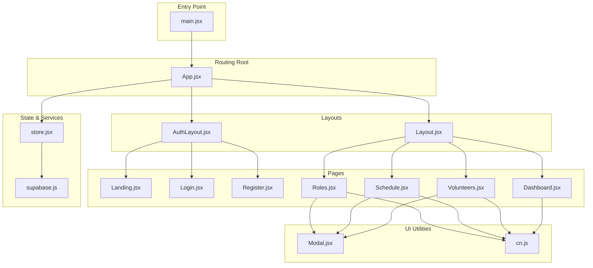
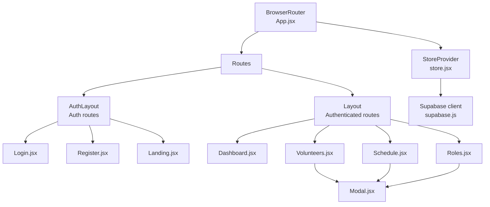
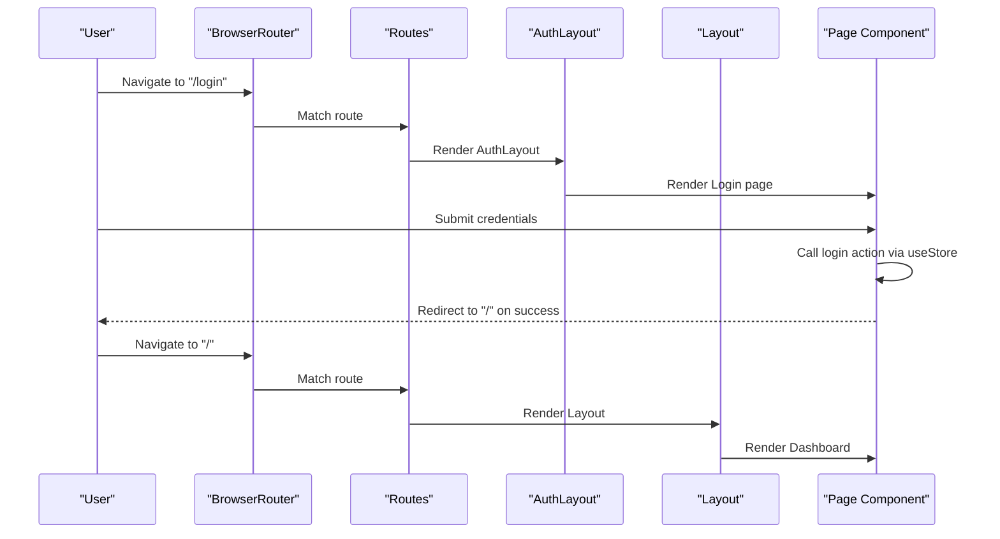
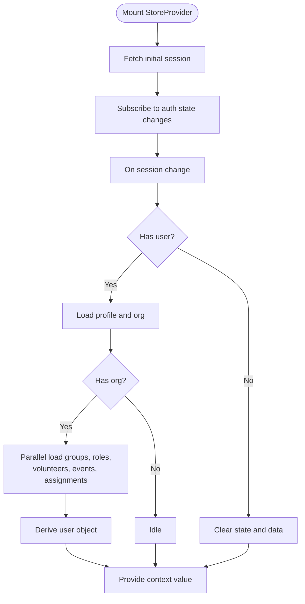
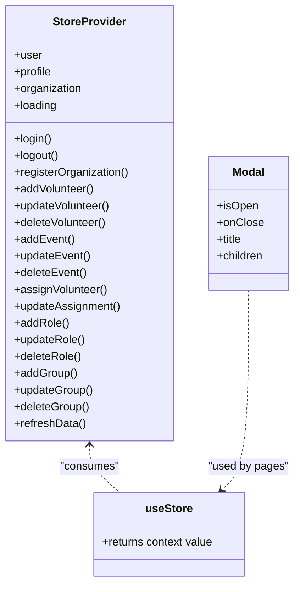
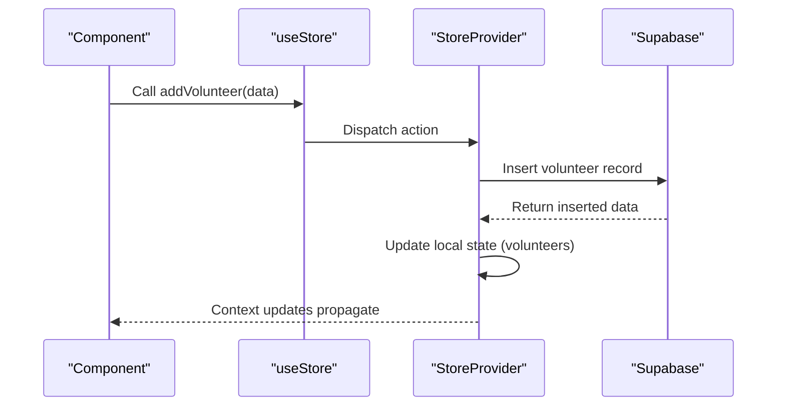
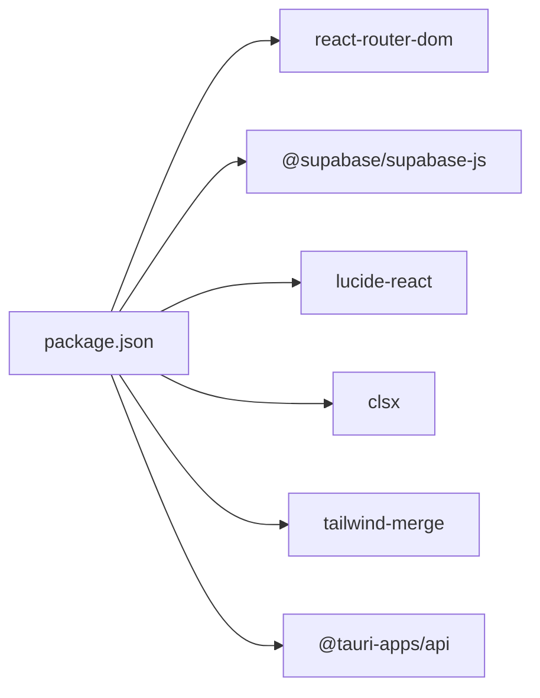

# Frontend Architecture

<cite>
**Referenced Files in This Document**
- [App.jsx](file://src/App.jsx)
- [main.jsx](file://src/main.jsx)
- [store.jsx](file://src/services/store.jsx)
- [supabase.js](file://src/services/supabase.js)
- [AuthLayout.jsx](file://src/components/AuthLayout.jsx)
- [Layout.jsx](file://src/components/Layout.jsx)
- [Modal.jsx](file://src/components/Modal.jsx)
- [Dashboard.jsx](file://src/pages/Dashboard.jsx)
- [Landing.jsx](file://src/pages/Landing.jsx)
- [Login.jsx](file://src/pages/Login.jsx)
- [Register.jsx](file://src/pages/Register.jsx)
- [Volunteers.jsx](file://src/pages/Volunteers.jsx)
- [Schedule.jsx](file://src/pages/Schedule.jsx)
- [Roles.jsx](file://src/pages/Roles.jsx)
- [cn.js](file://src/utils/cn.js)
- [package.json](file://package.json)
- [tailwind.config.js](file://tailwind.config.js)
</cite>

## Table of Contents
1. [Introduction](#introduction)
2. [Project Structure](#project-structure)
3. [Core Components](#core-components)
4. [Architecture Overview](#architecture-overview)
5. [Detailed Component Analysis](#detailed-component-analysis)
6. [Dependency Analysis](#dependency-analysis)
7. [Performance Considerations](#performance-considerations)
8. [Troubleshooting Guide](#troubleshooting-guide)
9. [Conclusion](#conclusion)

## Introduction
This document describes the frontend architecture of RosterFlow’s React application. It focuses on the component hierarchy starting from the root App component, routing with React Router DOM, the provider pattern for centralized state management, and the layout system for authentication and authenticated routes. It also explains how props are managed to avoid deep drilling, the data flow from UI components to state, and the styling and responsiveness approach using Tailwind CSS.

## Project Structure
RosterFlow follows a feature-based organization under src/, separating pages, components, services, utilities, and styles. The application bootstraps via main.jsx and renders App.jsx as the root. Routing is configured in App.jsx with two route groups: authentication routes under AuthLayout and authenticated routes under Layout.

**Diagram sources**
- [main.jsx](file://src/main.jsx#L1-L11)
- [App.jsx](file://src/App.jsx#L1-L37)
- [AuthLayout.jsx](file://src/components/AuthLayout.jsx#L1-L29)
- [Layout.jsx](file://src/components/Layout.jsx#L1-L102)
- [Landing.jsx](file://src/pages/Landing.jsx#L1-L39)
- [Login.jsx](file://src/pages/Login.jsx#L1-L79)
- [Register.jsx](file://src/pages/Register.jsx#L1-L100)
- [Dashboard.jsx](file://src/pages/Dashboard.jsx#L1-L90)
- [Volunteers.jsx](file://src/pages/Volunteers.jsx#L1-L354)
- [Schedule.jsx](file://src/pages/Schedule.jsx#L1-L731)
- [Roles.jsx](file://src/pages/Roles.jsx#L1-L386)
- [store.jsx](file://src/services/store.jsx#L1-L472)
- [supabase.js](file://src/services/supabase.js#L1-L13)
- [Modal.jsx](file://src/components/Modal.jsx#L1-L50)
- [cn.js](file://src/utils/cn.js#L1-L7)

**Section sources**
- [main.jsx](file://src/main.jsx#L1-L11)
- [App.jsx](file://src/App.jsx#L1-L37)

## Core Components
- App.jsx: Configures BrowserRouter, defines nested routes, wraps the app with StoreProvider, and sets up two route groups: AuthLayout for unauthenticated routes and Layout for authenticated routes.
- StoreProvider (store.jsx): Implements a custom provider using React Context to centralize authentication state, organization/profile data, and CRUD actions for groups, roles, volunteers, events, and assignments. It initializes Supabase auth session, subscribes to auth state changes, and loads organization data and all domain entities in parallel when appropriate.
- AuthLayout.jsx: Provides a minimal authenticated-friendly layout for login/register/landing with a centered content outlet and shared header/footer.
- Layout.jsx: Provides the authenticated shell with sidebar navigation, organization branding, user info, and a main content area. It enforces authentication by redirecting unauthenticated users to landing and exposes logout via the store.

Key architectural decisions:
- Provider pattern prevents prop drilling by exposing a single hook (useStore) to access state and actions.
- Supabase integration is encapsulated in a dedicated module, enabling clean separation of concerns.
- Tailwind CSS with a custom color extension and a utility function (cn) ensures consistent, composable styling.

**Section sources**
- [App.jsx](file://src/App.jsx#L1-L37)
- [store.jsx](file://src/services/store.jsx#L1-L472)
- [AuthLayout.jsx](file://src/components/AuthLayout.jsx#L1-L29)
- [Layout.jsx](file://src/components/Layout.jsx#L1-L102)
- [supabase.js](file://src/services/supabase.js#L1-L13)
- [cn.js](file://src/utils/cn.js#L1-L7)

## Architecture Overview
The frontend uses React Router DOM for declarative routing and React Context for state management. The provider pattern isolates state and side effects in store.jsx while keeping UI components pure and focused on rendering and user interactions.

**Diagram sources**
- [App.jsx](file://src/App.jsx#L1-L37)
- [AuthLayout.jsx](file://src/components/AuthLayout.jsx#L1-L29)
- [Layout.jsx](file://src/components/Layout.jsx#L1-L102)
- [Login.jsx](file://src/pages/Login.jsx#L1-L79)
- [Register.jsx](file://src/pages/Register.jsx#L1-L100)
- [Landing.jsx](file://src/pages/Landing.jsx#L1-L39)
- [Dashboard.jsx](file://src/pages/Dashboard.jsx#L1-L90)
- [Volunteers.jsx](file://src/pages/Volunteers.jsx#L1-L354)
- [Schedule.jsx](file://src/pages/Schedule.jsx#L1-L731)
- [Roles.jsx](file://src/pages/Roles.jsx#L1-L386)
- [store.jsx](file://src/services/store.jsx#L1-L472)
- [supabase.js](file://src/services/supabase.js#L1-L13)
- [Modal.jsx](file://src/components/Modal.jsx#L1-L50)

## Detailed Component Analysis

### Routing and Layout System
- Authentication routes (under AuthLayout):
  - Landing page for onboarding
  - Registration form for new organizations
  - Login form for existing users
- Authenticated routes (under Layout):
  - Dashboard overview
  - Volunteers management
  - Schedule management with assignments and sharing
  - Roles and groups management

**Diagram sources**
- [App.jsx](file://src/App.jsx#L1-L37)
- [AuthLayout.jsx](file://src/components/AuthLayout.jsx#L1-L29)
- [Layout.jsx](file://src/components/Layout.jsx#L1-L102)
- [Login.jsx](file://src/pages/Login.jsx#L1-L79)
- [Dashboard.jsx](file://src/pages/Dashboard.jsx#L1-L90)

**Section sources**
- [App.jsx](file://src/App.jsx#L1-L37)
- [AuthLayout.jsx](file://src/components/AuthLayout.jsx#L1-L29)
- [Layout.jsx](file://src/components/Layout.jsx#L1-L102)

### State Management with StoreProvider
StoreProvider centralizes:
- Authentication state (session, profile, organization)
- Domain data (groups, roles, volunteers, events, assignments)
- Actions for CRUD operations and auth flows

**Diagram sources**
- [store.jsx](file://src/services/store.jsx#L1-L472)
- [supabase.js](file://src/services/supabase.js#L1-L13)

**Section sources**
- [store.jsx](file://src/services/store.jsx#L1-L472)

### Component Composition Patterns and Prop Drilling Prevention
- useStore hook: Components consume state and actions without receiving them as props from parents.
- Modal.jsx: Reusable overlay component rendered via portal to avoid DOM nesting issues and maintain composition.
- cn utility: Composes Tailwind classes safely, reducing duplication and ensuring consistent styling.

**Diagram sources**
- [store.jsx](file://src/services/store.jsx#L462-L472)
- [Modal.jsx](file://src/components/Modal.jsx#L1-L50)

**Section sources**
- [store.jsx](file://src/services/store.jsx#L469-L472)
- [Modal.jsx](file://src/components/Modal.jsx#L1-L50)
- [cn.js](file://src/utils/cn.js#L1-L7)

### Data Flow from UI to State
- UI components call actions from useStore to mutate data or trigger auth operations.
- Actions perform Supabase queries and update local state, which propagates to consumers via context.
- Derived data (e.g., derived user object) is computed in the provider for compatibility.

**Diagram sources**
- [Volunteers.jsx](file://src/pages/Volunteers.jsx#L162-L194)
- [store.jsx](file://src/services/store.jsx#L162-L194)
- [supabase.js](file://src/services/supabase.js#L1-L13)

**Section sources**
- [Volunteers.jsx](file://src/pages/Volunteers.jsx#L162-L194)
- [store.jsx](file://src/services/store.jsx#L162-L194)

### Styling Approach and Responsive Design
- Tailwind CSS is configured with extended primary palette and global content scanning.
- Utility function cn merges and cleans class names, enabling dynamic, composable styles.
- Components use responsive utilities (e.g., md:, lg:) and flex/grid layouts for adaptability.

**Section sources**
- [tailwind.config.js](file://tailwind.config.js#L1-L27)
- [cn.js](file://src/utils/cn.js#L1-L7)
- [Dashboard.jsx](file://src/pages/Dashboard.jsx#L1-L90)
- [Volunteers.jsx](file://src/pages/Volunteers.jsx#L1-L354)
- [Schedule.jsx](file://src/pages/Schedule.jsx#L1-L731)
- [Roles.jsx](file://src/pages/Roles.jsx#L1-L386)

## Dependency Analysis
External libraries and their roles:
- react-router-dom: Routing and navigation
- @supabase/supabase-js: Backend-as-a-Client for auth and data
- lucide-react: Icons
- clsx and tailwind-merge: Safe class merging
- @tauri-apps/api: Desktop packaging support (not part of frontend runtime)

**Diagram sources**
- [package.json](file://package.json#L15-L39)

**Section sources**
- [package.json](file://package.json#L15-L39)

## Performance Considerations
- Parallel data loading: The provider loads groups, roles, volunteers, events, and assignments concurrently to reduce initialization latency.
- Derived user object: Computed once per session/profile change to minimize recomputation overhead.
- Modal portals: Rendered outside the main tree to avoid unnecessary re-renders in parent components.
- Tailwind utilities: Keep styles declarative and scoped to components to avoid bloating the DOM.

[No sources needed since this section provides general guidance]

## Troubleshooting Guide
Common issues and remedies:
- Missing Supabase environment variables: The client warns if VITE_SUPABASE_URL or VITE_SUPABASE_ANON_KEY are missing. Ensure .env is populated.
- Authentication redirects: Layout redirects unauthenticated users to landing; verify session state and auth subscription.
- Modal not closing: Ensure the modal receives isOpen and onClose props and that Escape key handling is active when open.
- Styling conflicts: Use cn to merge classes and rely on Tailwind’s utility-first approach to avoid specificity wars.

**Section sources**
- [supabase.js](file://src/services/supabase.js#L6-L8)
- [Layout.jsx](file://src/components/Layout.jsx#L19-L30)
- [Modal.jsx](file://src/components/Modal.jsx#L6-L20)
- [cn.js](file://src/utils/cn.js#L4-L6)

## Conclusion
RosterFlow’s frontend is structured around a clear separation of concerns: routing under App.jsx, a robust provider pattern in store.jsx, reusable layouts, and a consistent styling approach with Tailwind CSS. The provider pattern eliminates prop drilling, while Supabase integration keeps authentication and data operations centralized. The result is a maintainable, scalable, and user-friendly interface suitable for ministry scheduling workflows.