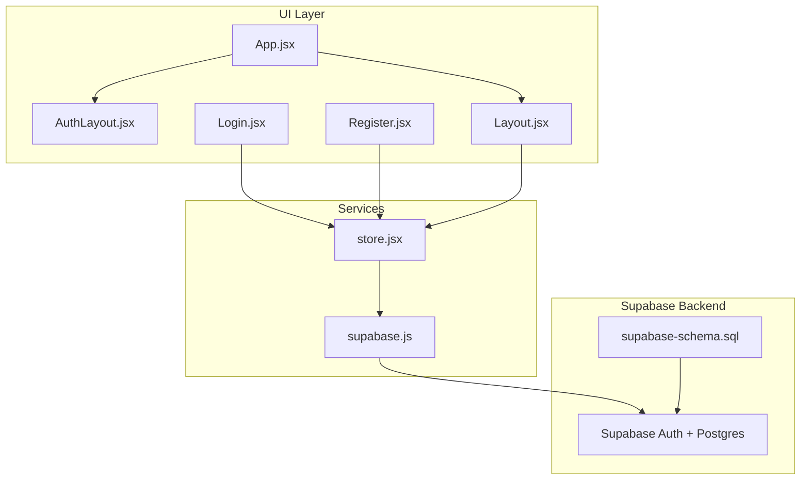
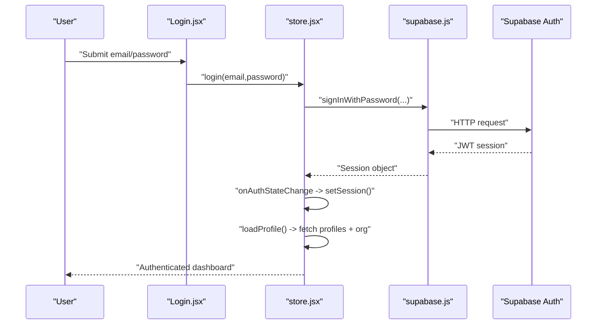
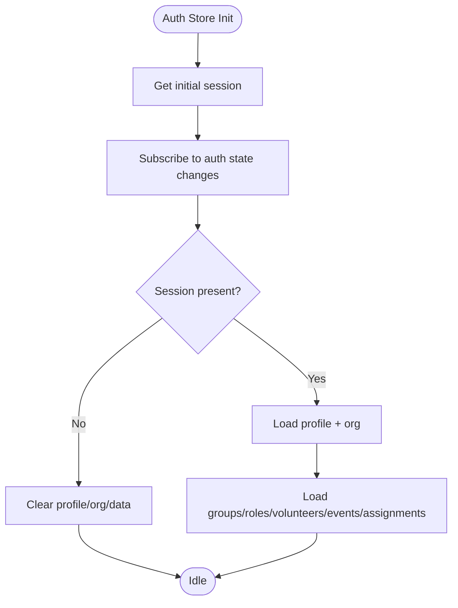
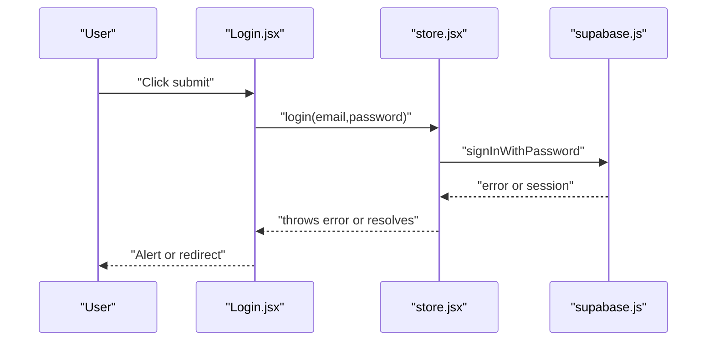
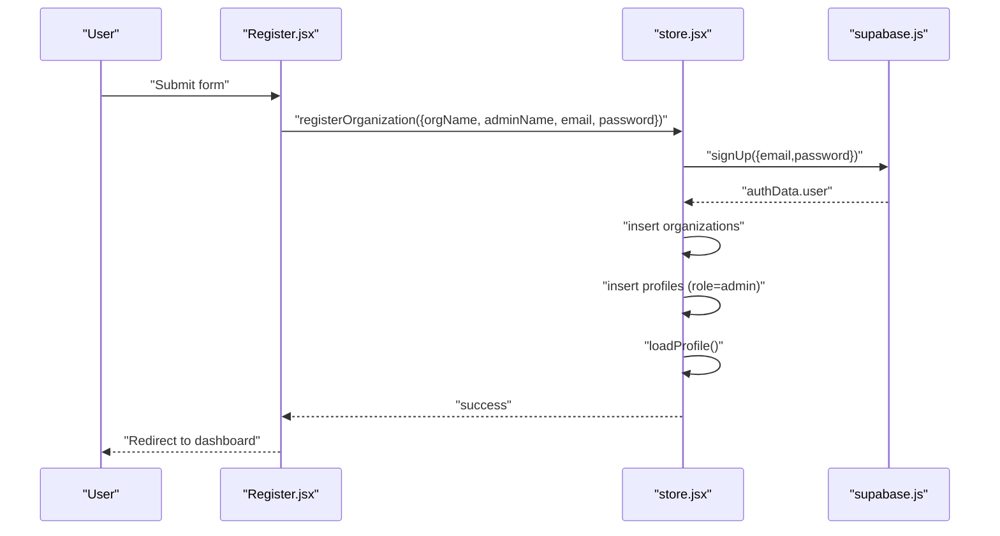
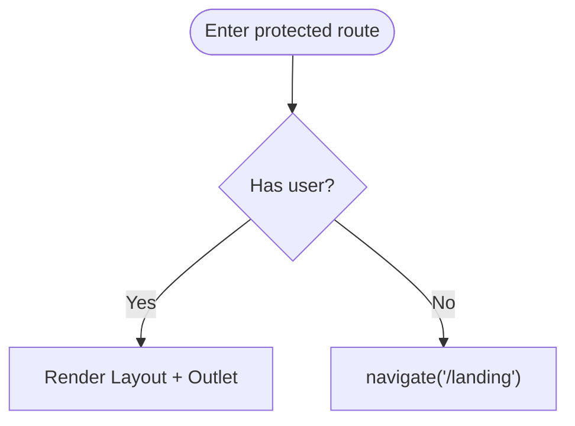
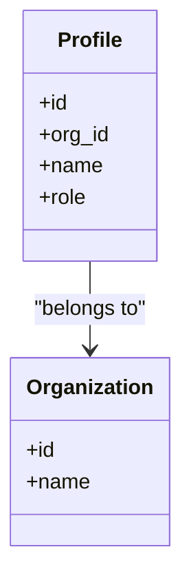
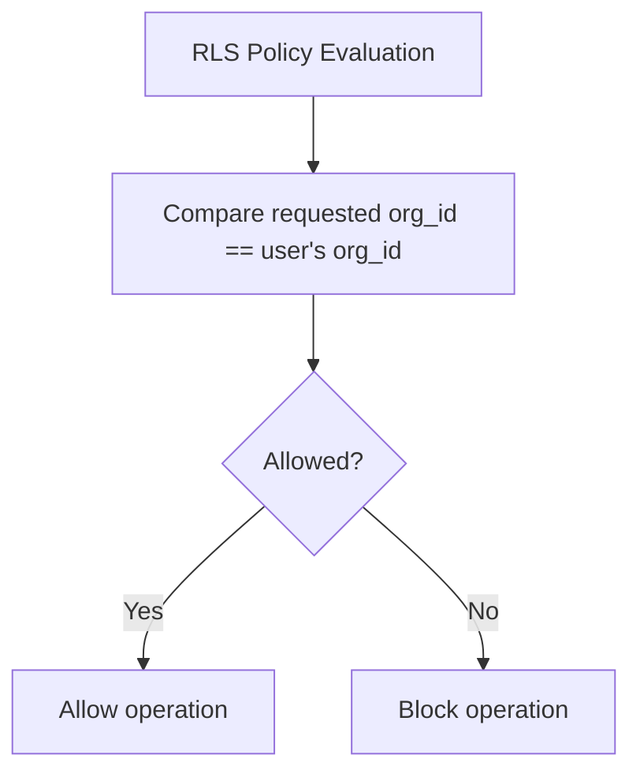
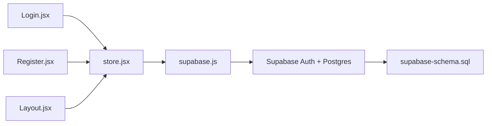

# Authentication & Authorization

<cite>
**Referenced Files in This Document**
- [supabase.js](file://src/services/supabase.js)
- [store.jsx](file://src/services/store.jsx)
- [Login.jsx](file://src/pages/Login.jsx)
- [Register.jsx](file://src/pages/Register.jsx)
- [App.jsx](file://src/App.jsx)
- [Layout.jsx](file://src/components/Layout.jsx)
- [AuthLayout.jsx](file://src/components/AuthLayout.jsx)
- [supabase-schema.sql](file://supabase-schema.sql)
- [.env.example](file://.env.example)
- [package.json](file://package.json)
</cite>

## Table of Contents
1. [Introduction](#introduction)
2. [Project Structure](#project-structure)
3. [Core Components](#core-components)
4. [Architecture Overview](#architecture-overview)
5. [Detailed Component Analysis](#detailed-component-analysis)
6. [Dependency Analysis](#dependency-analysis)
7. [Performance Considerations](#performance-considerations)
8. [Troubleshooting Guide](#troubleshooting-guide)
9. [Conclusion](#conclusion)

## Introduction
This document explains RosterFlow’s authentication and authorization system built on Supabase. It covers the email/password login flow, user registration and organization creation, session lifecycle, role-based access control (RBAC) with organization-level permissions, Row Level Security (RLS) policies ensuring data isolation, and practical guidance for password reset, verification, and security hardening. It also documents the token-based session model and outlines troubleshooting steps for common authentication and permission issues.

## Project Structure
RosterFlow is a React application that integrates with Supabase for authentication and data. Authentication UI routes are protected by a dedicated layout, while authenticated routes render the main application shell. The central store manages Supabase session state, user profile, organization, and data synchronization.

**Diagram sources**
- [App.jsx](file://src/App.jsx#L13-L36)
- [AuthLayout.jsx](file://src/components/AuthLayout.jsx#L5-L28)
- [Login.jsx](file://src/pages/Login.jsx#L5-L25)
- [Register.jsx](file://src/pages/Register.jsx#L5-L27)
- [Layout.jsx](file://src/components/Layout.jsx#L14-L30)
- [supabase.js](file://src/services/supabase.js#L1-L13)
- [store.jsx](file://src/services/store.jsx#L6-L34)
- [supabase-schema.sql](file://supabase-schema.sql#L1-L251)

**Section sources**
- [App.jsx](file://src/App.jsx#L13-L36)
- [AuthLayout.jsx](file://src/components/AuthLayout.jsx#L5-L28)
- [Layout.jsx](file://src/components/Layout.jsx#L14-L30)
- [supabase.js](file://src/services/supabase.js#L1-L13)
- [store.jsx](file://src/services/store.jsx#L6-L34)
- [supabase-schema.sql](file://supabase-schema.sql#L1-L251)

## Core Components
- Supabase client initialization and environment configuration
- Central store managing session, profile, organization, and data
- Authentication pages for login and registration
- Protected layout enforcing session presence
- Supabase schema defining RBAC and RLS

Key responsibilities:
- Authentication: sign-in/sign-up, sign-out, session change handling
- Authorization: profile-driven organization membership and role
- Data isolation: RLS policies per organization
- Token/session model: Supabase JWT-based sessions persisted by Supabase client

**Section sources**
- [supabase.js](file://src/services/supabase.js#L1-L13)
- [store.jsx](file://src/services/store.jsx#L6-L34)
- [store.jsx](file://src/services/store.jsx#L114-L124)
- [store.jsx](file://src/services/store.jsx#L126-L159)
- [Login.jsx](file://src/pages/Login.jsx#L5-L25)
- [Register.jsx](file://src/pages/Register.jsx#L5-L27)
- [Layout.jsx](file://src/components/Layout.jsx#L19-L30)
- [supabase-schema.sql](file://supabase-schema.sql#L14-L21)
- [supabase-schema.sql](file://supabase-schema.sql#L78-L86)

## Architecture Overview
The authentication flow leverages Supabase Auth for identity and session management. The store subscribes to Supabase auth state changes, loads the user profile and organization, and synchronizes application data. All database operations are constrained by RLS policies scoped to the user’s organization.

**Diagram sources**
- [Login.jsx](file://src/pages/Login.jsx#L14-L25)
- [store.jsx](file://src/services/store.jsx#L114-L124)
- [store.jsx](file://src/services/store.jsx#L21-L34)
- [store.jsx](file://src/services/store.jsx#L54-L68)
- [supabase.js](file://src/services/supabase.js#L10-L10)

## Detailed Component Analysis

### Supabase Client Initialization
- Creates a Supabase client using Vite environment variables for URL and anonymous key.
- Validates environment variables and warns if missing.
- Exports a singleton client for use across the app.

Security considerations:
- Environment variables must be configured server-side in production.
- The anonymous key should be restricted via Supabase project settings.

**Section sources**
- [supabase.js](file://src/services/supabase.js#L3-L10)
- [.env.example](file://.env.example#L1-L5)

### Authentication Store
Responsibilities:
- Initialize session and subscribe to auth state changes
- Load profile and organization when session exists
- Provide login, logout, and organization registration functions
- Derive a user object for UI compatibility

Key flows:
- Session retrieval and subscription
- Profile and organization resolution
- Login via email/password
- Registration creates auth user, organization, and profile, then loads profile

**Diagram sources**
- [store.jsx](file://src/services/store.jsx#L21-L34)
- [store.jsx](file://src/services/store.jsx#L37-L52)
- [store.jsx](file://src/services/store.jsx#L54-L68)
- [store.jsx](file://src/services/store.jsx#L78-L111)

**Section sources**
- [store.jsx](file://src/services/store.jsx#L6-L34)
- [store.jsx](file://src/services/store.jsx#L37-L52)
- [store.jsx](file://src/services/store.jsx#L54-L68)
- [store.jsx](file://src/services/store.jsx#L78-L111)

### Login Page
- Captures email and password
- Calls store.login and navigates to dashboard on success
- Displays errors returned by Supabase

**Diagram sources**
- [Login.jsx](file://src/pages/Login.jsx#L14-L25)
- [store.jsx](file://src/services/store.jsx#L114-L124)

**Section sources**
- [Login.jsx](file://src/pages/Login.jsx#L5-L25)
- [store.jsx](file://src/services/store.jsx#L114-L124)

### Registration Workflow
- Captures organization name, admin name, work email, and password
- Creates an auth user, organization, and profile with role set to admin
- Automatically logs in and loads profile

**Diagram sources**
- [Register.jsx](file://src/pages/Register.jsx#L16-L27)
- [store.jsx](file://src/services/store.jsx#L126-L159)
- [store.jsx](file://src/services/store.jsx#L54-L68)

**Section sources**
- [Register.jsx](file://src/pages/Register.jsx#L5-L27)
- [store.jsx](file://src/services/store.jsx#L126-L159)
- [store.jsx](file://src/services/store.jsx#L54-L68)

### Protected Routes and Layout
- Authenticated routes are wrapped in a layout that enforces session presence
- If no session, redirects to landing page
- Provides logout and displays user info

**Diagram sources**
- [Layout.jsx](file://src/components/Layout.jsx#L19-L30)
- [App.jsx](file://src/App.jsx#L24-L29)

**Section sources**
- [Layout.jsx](file://src/components/Layout.jsx#L14-L30)
- [App.jsx](file://src/App.jsx#L24-L29)

### Role-Based Access Control (RBAC) and Organization-Level Permissions
- Profiles link users to organizations and define roles
- Roles are admin/member; admin is set during registration
- All data operations are scoped to the user’s organization via RLS

**Diagram sources**
- [supabase-schema.sql](file://supabase-schema.sql#L14-L21)
- [supabase-schema.sql](file://supabase-schema.sql#L7-L12)
- [store.jsx](file://src/services/store.jsx#L146-L155)

**Section sources**
- [supabase-schema.sql](file://supabase-schema.sql#L14-L21)
- [store.jsx](file://src/services/store.jsx#L146-L155)

### Row Level Security (RLS) Policies
- All tables enable RLS
- Policies restrict visibility and modification to rows within the user’s organization
- Helper function resolves current user’s org_id for policy evaluation
- Triggers assist in setting org_id on insert for certain tables

**Diagram sources**
- [supabase-schema.sql](file://supabase-schema.sql#L78-L86)
- [supabase-schema.sql](file://supabase-schema.sql#L88-L97)
- [supabase-schema.sql](file://supabase-schema.sql#L100-L102)
- [supabase-schema.sql](file://supabase-schema.sql#L225-L250)

**Section sources**
- [supabase-schema.sql](file://supabase-schema.sql#L78-L224)
- [supabase-schema.sql](file://supabase-schema.sql#L88-L97)
- [supabase-schema.sql](file://supabase-schema.sql#L225-L250)

### Token-Based Authentication and Session Persistence
- Supabase manages JWT-based sessions
- The store subscribes to auth state changes to keep session state synchronized
- Session persistence is handled by the Supabase client; the app reacts to changes

Operational notes:
- The store retrieves the initial session and listens for future changes
- Logout clears local state and invokes Supabase sign-out

**Section sources**
- [store.jsx](file://src/services/store.jsx#L21-L34)
- [store.jsx](file://src/services/store.jsx#L119-L124)
- [store.jsx](file://src/services/store.jsx#L42-L44)

### Password Reset and Account Verification
- Password reset: Use Supabase Auth’s built-in mechanisms to send password reset emails
- Account verification: Supabase supports email confirmation; configure it in the Supabase Auth settings
- Application behavior: The UI currently exposes “Forgot?” links; integrate with Supabase Auth flows to handle resets and confirmations

[No sources needed since this section provides general guidance]

### Security Measures
- Transport security: Use HTTPS in production to protect tokens and communications
- Environment variables: Ensure VITE_SUPABASE_URL and VITE_SUPABASE_ANON_KEY are set securely
- Supabase project settings: Restrict anonymous key usage and enforce strong password policies at the Supabase level
- RLS enforcement: All queries are governed by RLS policies; avoid bypassing them
- Session handling: Rely on Supabase client for secure storage and renewal

**Section sources**
- [.env.example](file://.env.example#L1-L5)
- [package.json](file://package.json#L15-L24)

## Dependency Analysis
- UI depends on the store for authentication state and actions
- Store depends on the Supabase client for auth and data operations
- Supabase backend enforces RLS and stores user data linked to organizations

**Diagram sources**
- [Login.jsx](file://src/pages/Login.jsx#L5-L7)
- [Register.jsx](file://src/pages/Register.jsx#L7-L7)
- [Layout.jsx](file://src/components/Layout.jsx#L17-L17)
- [store.jsx](file://src/services/store.jsx#L2-L2)
- [supabase.js](file://src/services/supabase.js#L1-L1)
- [supabase-schema.sql](file://supabase-schema.sql#L1-L251)

**Section sources**
- [store.jsx](file://src/services/store.jsx#L2-L2)
- [supabase.js](file://src/services/supabase.js#L1-L1)
- [supabase-schema.sql](file://supabase-schema.sql#L1-L251)

## Performance Considerations
- Parallel data loading: The store fetches multiple datasets concurrently after login to reduce perceived latency
- Minimal re-renders: React state updates are scoped to auth and data slices
- RLS overhead: Policies are enforced server-side; keep filters efficient and avoid unnecessary joins

**Section sources**
- [store.jsx](file://src/services/store.jsx#L82-L88)

## Troubleshooting Guide
Common issues and resolutions:
- Missing environment variables
  - Symptom: Warning about missing Supabase URL or anonymous key
  - Resolution: Set VITE_SUPABASE_URL and VITE_SUPABASE_ANON_KEY in your environment
  - Section sources
    - [supabase.js](file://src/services/supabase.js#L6-L8)
    - [.env.example](file://.env.example#L1-L5)

- Login fails with error message
  - Symptom: Alert shows Supabase error
  - Resolution: Verify credentials and network connectivity; ensure Supabase Auth is enabled
  - Section sources
    - [Login.jsx](file://src/pages/Login.jsx#L20-L22)
    - [store.jsx](file://src/services/store.jsx#L114-L124)

- Redirect loop to landing after login
  - Symptom: Redirects to landing despite successful login
  - Resolution: Confirm that the layout checks for user presence and navigates appropriately
  - Section sources
    - [Layout.jsx](file://src/components/Layout.jsx#L19-L23)

- Unauthorized access to data
  - Symptom: Cannot see records that should belong to the organization
  - Resolution: Confirm RLS policies are enabled and the user’s org_id matches the row; verify profile and organization linkage
  - Section sources
    - [supabase-schema.sql](file://supabase-schema.sql#L78-L86)
    - [supabase-schema.sql](file://supabase-schema.sql#L108-L119)
    - [store.jsx](file://src/services/store.jsx#L54-L68)

- Registration does not auto-login
  - Symptom: Registration succeeds but no session is loaded
  - Resolution: Ensure the registration flow triggers loadProfile after creating the auth user and profile
  - Section sources
    - [store.jsx](file://src/services/store.jsx#L126-L159)
    - [store.jsx](file://src/services/store.jsx#L54-L68)

- Password reset or email confirmation not working
  - Symptom: No reset email received
  - Resolution: Configure Supabase Auth email templates and external provider settings; test from Supabase dashboard
  - Section sources
    - [package.json](file://package.json#L15-L24)

## Conclusion
RosterFlow’s authentication and authorization rely on Supabase Auth for identity and JWT sessions, with organization-scoped RBAC and robust RLS policies ensuring data isolation. The store centralizes session handling and data synchronization, while the UI remains responsive and secure. For production, enforce HTTPS, secure environment variables, and configure Supabase Auth features like password reset and email confirmation. Monitor RLS policy behavior and leverage the store’s auth state hooks to maintain consistent user experiences.