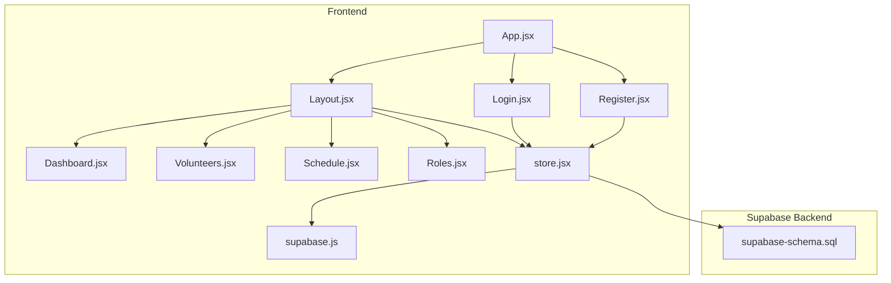
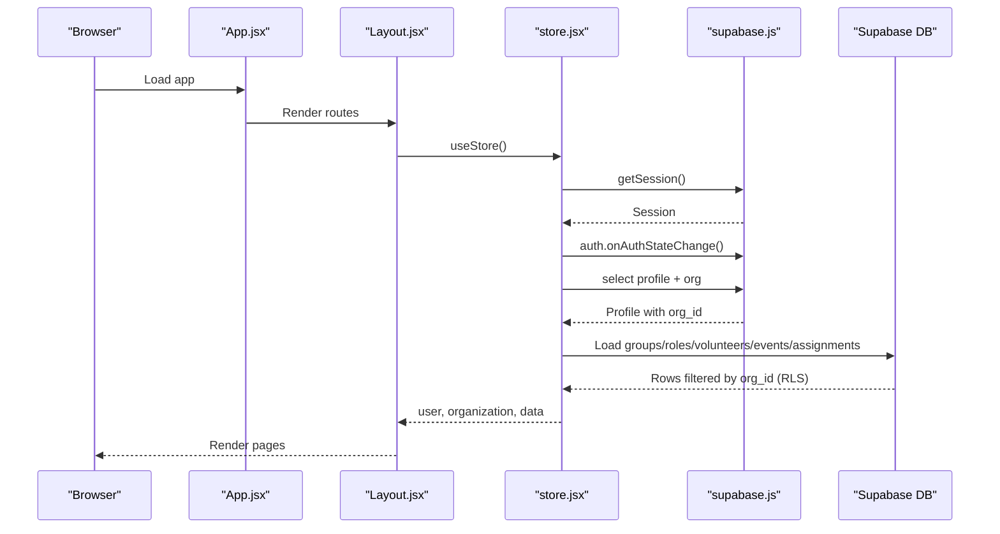
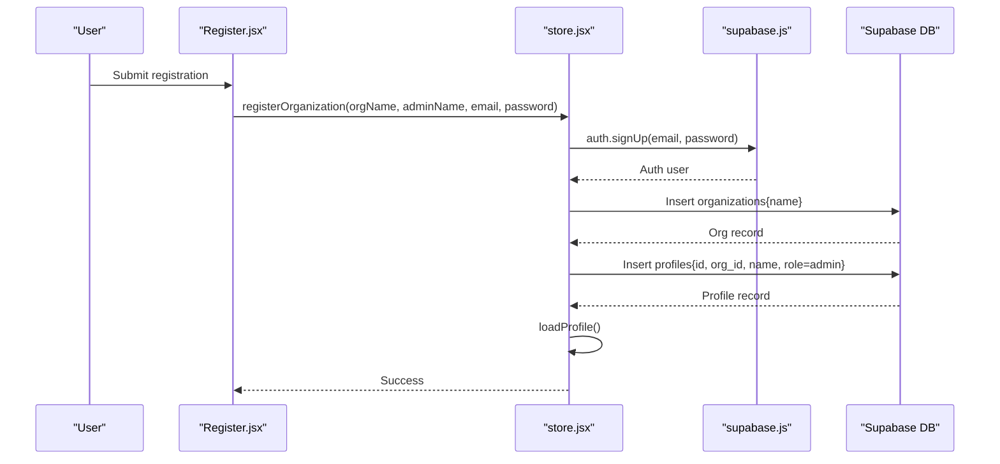
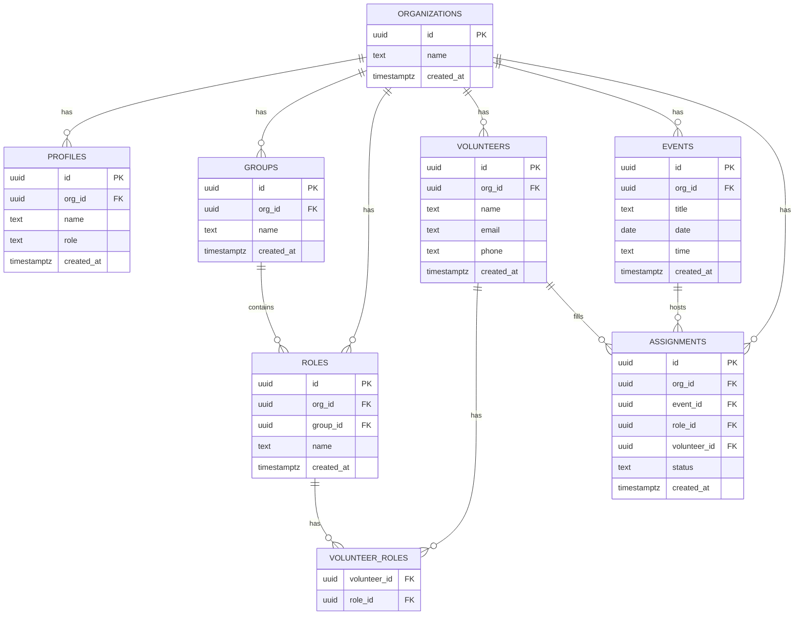
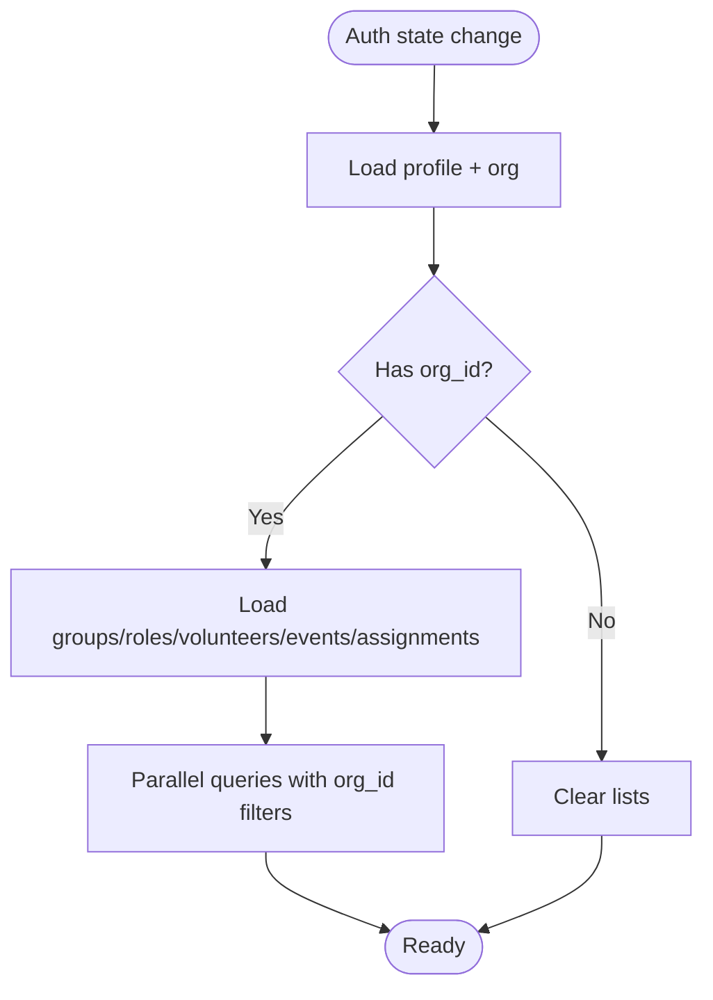
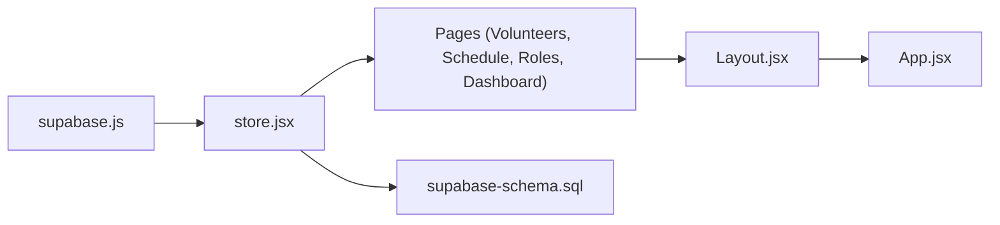

# Organization & Permissions

<cite>
**Referenced Files in This Document**
- [store.jsx](file://src/services/store.jsx)
- [supabase.js](file://src/services/supabase.js)
- [supabase-schema.sql](file://supabase-schema.sql)
- [App.jsx](file://src/App.jsx)
- [Layout.jsx](file://src/components/Layout.jsx)
- [Dashboard.jsx](file://src/pages/Dashboard.jsx)
- [Volunteers.jsx](file://src/pages/Volunteers.jsx)
- [Schedule.jsx](file://src/pages/Schedule.jsx)
- [Roles.jsx](file://src/pages/Roles.jsx)
- [Login.jsx](file://src/pages/Login.jsx)
- [Register.jsx](file://src/pages/Register.jsx)
</cite>

## Table of Contents
1. [Introduction](#introduction)
2. [Project Structure](#project-structure)
3. [Core Components](#core-components)
4. [Architecture Overview](#architecture-overview)
5. [Detailed Component Analysis](#detailed-component-analysis)
6. [Dependency Analysis](#dependency-analysis)
7. [Performance Considerations](#performance-considerations)
8. [Troubleshooting Guide](#troubleshooting-guide)
9. [Conclusion](#conclusion)

## Introduction
This document explains RosterFlow’s organization-based permission system. It describes how the application isolates tenant environments per church organization, how user profiles link to organizations, and how row-level security (RLS) policies enforce access control across data entities. It also documents the role hierarchy present in the schema, the organization creation flow, and how the frontend enforces isolation by filtering data by organization ID.

## Project Structure
RosterFlow is a React SPA that integrates with Supabase for authentication and data persistence. The organization-per-tenant model is enforced both in the database schema and in the frontend store.

**Diagram sources**
- [App.jsx](file://src/App.jsx#L13-L34)
- [Layout.jsx](file://src/components/Layout.jsx#L14-L107)
- [Dashboard.jsx](file://src/pages/Dashboard.jsx#L21-L89)
- [Volunteers.jsx](file://src/pages/Volunteers.jsx#L7-L353)
- [Schedule.jsx](file://src/pages/Schedule.jsx#L7-L730)
- [Roles.jsx](file://src/pages/Roles.jsx#L6-L385)
- [Login.jsx](file://src/pages/Login.jsx#L5-L79)
- [Register.jsx](file://src/pages/Register.jsx#L5-L100)
- [store.jsx](file://src/services/store.jsx#L1-L472)
- [supabase.js](file://src/services/supabase.js#L1-L13)
- [supabase-schema.sql](file://supabase-schema.sql#L1-L251)

**Section sources**
- [App.jsx](file://src/App.jsx#L13-L34)
- [store.jsx](file://src/services/store.jsx#L1-L472)
- [supabase-schema.sql](file://supabase-schema.sql#L1-L251)

## Core Components
- Organization isolation: Each organization has a unique identifier and all data entities include an organization foreign key. Access is enforced via RLS policies.
- User profiles: Profiles link to organizations and define roles. The schema defines two roles: admin and member.
- Frontend store: Loads and filters data by the current user’s organization ID, ensuring tenants cannot see each other’s data.
- Authentication: Supabase handles sign-up/sign-in; the store logs in the user and loads profile/organization data.

Key implementation references:
- Organization and profile tables, roles, and RLS policies: [supabase-schema.sql](file://supabase-schema.sql#L7-L251)
- Frontend store initialization and data loading: [store.jsx](file://src/services/store.jsx#L21-L111)
- Profile and organization linking: [store.jsx](file://src/services/store.jsx#L54-L68)
- Organization creation flow: [store.jsx](file://src/services/store.jsx#L126-L159)
- Supabase client configuration: [supabase.js](file://src/services/supabase.js#L1-L13)

**Section sources**
- [supabase-schema.sql](file://supabase-schema.sql#L7-L251)
- [store.jsx](file://src/services/store.jsx#L21-L111)
- [store.jsx](file://src/services/store.jsx#L54-L68)
- [store.jsx](file://src/services/store.jsx#L126-L159)
- [supabase.js](file://src/services/supabase.js#L1-L13)

## Architecture Overview
The system enforces tenant isolation at three layers:
- Database: RLS policies restrict reads/writes to rows where org_id matches the current user’s org_id.
- Application: The store fetches profile and sets organization context; downstream CRUD operations attach org_id to new records.
- UI: Navigation and page rendering occur only when a user is authenticated; the layout redirects unauthenticated users.

**Diagram sources**
- [App.jsx](file://src/App.jsx#L13-L34)
- [Layout.jsx](file://src/components/Layout.jsx#L14-L107)
- [store.jsx](file://src/services/store.jsx#L21-L111)
- [supabase.js](file://src/services/supabase.js#L1-L13)
- [supabase-schema.sql](file://supabase-schema.sql#L78-L251)

## Detailed Component Analysis

### Organization Creation Flow
- The registration form collects organization name, admin name, email, and password.
- The store signs up the user, creates an organization, creates a profile with role admin, and loads the profile to initialize the session.

**Diagram sources**
- [Register.jsx](file://src/pages/Register.jsx#L16-L27)
- [store.jsx](file://src/services/store.jsx#L126-L159)
- [supabase.js](file://src/services/supabase.js#L1-L13)
- [supabase-schema.sql](file://supabase-schema.sql#L7-L21)

**Section sources**
- [Register.jsx](file://src/pages/Register.jsx#L16-L27)
- [store.jsx](file://src/services/store.jsx#L126-L159)
- [supabase-schema.sql](file://supabase-schema.sql#L7-L21)

### Role Hierarchy and Permissions
- Schema-defined roles: Profiles include a role field constrained to admin or member.
- Current UI does not expose role editing; only organization admin is modeled in the schema.
- Implication: Within the current UI, there is effectively a single effective role per organization (admin), while the schema supports a distinction between admin and member.

References:
- Role column definition: [supabase-schema.sql](file://supabase-schema.sql#L18-L21)
- Profile insertion defaults role to admin: [store.jsx](file://src/services/store.jsx#L146-L155)

**Section sources**
- [supabase-schema.sql](file://supabase-schema.sql#L18-L21)
- [store.jsx](file://src/services/store.jsx#L146-L155)

### Data Entity Isolation and Access Controls
All core entities include org_id and are protected by RLS policies that require org_id to match the current user’s org_id for select/update/delete operations. Inserts are permitted with org_id validation via WITH CHECK.

**Diagram sources**
- [supabase-schema.sql](file://supabase-schema.sql#L7-L76)

**Section sources**
- [supabase-schema.sql](file://supabase-schema.sql#L7-L76)

### Frontend Enforcement of Tenant Isolation
- On auth state change, the store loads the profile and organization, then loads all data entities in parallel.
- Each write operation attaches org_id from the current profile, ensuring new records belong to the user’s organization.
- The store clears data when the user logs out or has no org_id.

**Diagram sources**
- [store.jsx](file://src/services/store.jsx#L21-L111)

**Section sources**
- [store.jsx](file://src/services/store.jsx#L21-L111)

### Role-Based Access Patterns
- Effective role in UI: admin (as stored during registration).
- Member role exists in schema but is not surfaced in the UI; therefore, typical “member” vs “admin” granular permissions are not demonstrated in the current codebase.
- Cross-organization protection: Because all writes attach org_id and RLS enforces org_id matching, users cannot modify another organization’s data.

References:
- Profile role default: [store.jsx](file://src/services/store.jsx#L146-L155)
- RLS policies for updates/deletes/select: [supabase-schema.sql](file://supabase-schema.sql#L108-L223)

**Section sources**
- [store.jsx](file://src/services/store.jsx#L146-L155)
- [supabase-schema.sql](file://supabase-schema.sql#L108-L223)

### Permission Escalation Scenarios and Administrative Controls
- Permission escalation: The schema allows a member role, but the UI does not expose role management. Therefore, there is no in-app mechanism to escalate a member to admin.
- Administrative controls: The organization creation flow assigns admin to the registering user. Beyond that, no explicit admin management UI is present in the current codebase.

References:
- Role constraint: [supabase-schema.sql](file://supabase-schema.sql#L18-L21)
- Registration flow: [store.jsx](file://src/services/store.jsx#L126-L159)

**Section sources**
- [supabase-schema.sql](file://supabase-schema.sql#L18-L21)
- [store.jsx](file://src/services/store.jsx#L126-L159)

## Dependency Analysis
- store.jsx depends on supabase.js for authentication and data operations.
- Pages depend on store.jsx for data and actions.
- RLS policies in supabase-schema.sql govern backend access control.

**Diagram sources**
- [supabase.js](file://src/services/supabase.js#L1-L13)
- [store.jsx](file://src/services/store.jsx#L1-L472)
- [supabase-schema.sql](file://supabase-schema.sql#L1-L251)
- [Layout.jsx](file://src/components/Layout.jsx#L14-L107)
- [App.jsx](file://src/App.jsx#L13-L34)

**Section sources**
- [supabase.js](file://src/services/supabase.js#L1-L13)
- [store.jsx](file://src/services/store.jsx#L1-L472)
- [supabase-schema.sql](file://supabase-schema.sql#L1-L251)
- [Layout.jsx](file://src/components/Layout.jsx#L14-L107)
- [App.jsx](file://src/App.jsx#L13-L34)

## Performance Considerations
- Parallel data loading: The store fetches all entities concurrently to minimize latency on initial load.
- Local filtering: UI components filter lists client-side (e.g., search in Volunteers and Roles), which is efficient for small datasets.
- Recommendations:
  - Consider server-side filtering for large datasets.
  - Paginate heavy lists (e.g., volunteers/events) to reduce payload sizes.
  - Debounce search inputs to avoid frequent re-renders.

[No sources needed since this section provides general guidance]

## Troubleshooting Guide
- Symptom: Cannot see data after login
  - Cause: org_id missing or mismatch
  - Check: Profile load and org_id presence in store
  - References: [store.jsx](file://src/services/store.jsx#L54-L68), [store.jsx](file://src/services/store.jsx#L78-L111)
- Symptom: Write fails with permission error
  - Cause: org_id mismatch or RLS policy violation
  - Check: org_id attached to new records and RLS policies
  - References: [store.jsx](file://src/services/store.jsx#L245-L263), [supabase-schema.sql](file://supabase-schema.sql#L191-L206)
- Symptom: Cross-organization data visible
  - Cause: Missing org_id or RLS not enabled
  - Check: RLS policies and triggers
  - References: [supabase-schema.sql](file://supabase-schema.sql#L78-L251)

**Section sources**
- [store.jsx](file://src/services/store.jsx#L54-L68)
- [store.jsx](file://src/services/store.jsx#L78-L111)
- [store.jsx](file://src/services/store.jsx#L245-L263)
- [supabase-schema.sql](file://supabase-schema.sql#L78-L251)

## Conclusion
RosterFlow implements a robust organization-per-tenant model using Supabase RLS and org_id enforcement. The frontend store ensures isolation by loading only the current organization’s data and attaching org_id to all writes. The schema defines a role column supporting admin/member distinctions, though the UI currently exposes only admin-level operations. Together, these mechanisms prevent cross-organization data access and provide a clear foundation for future permission enhancements.