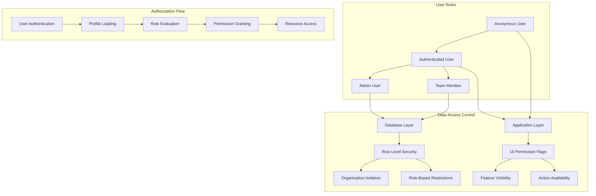
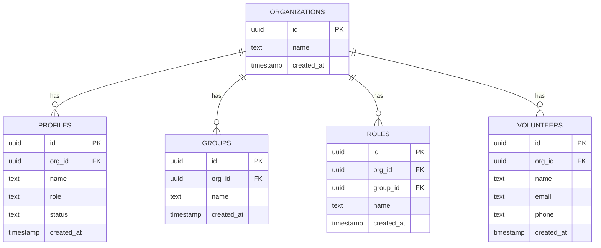
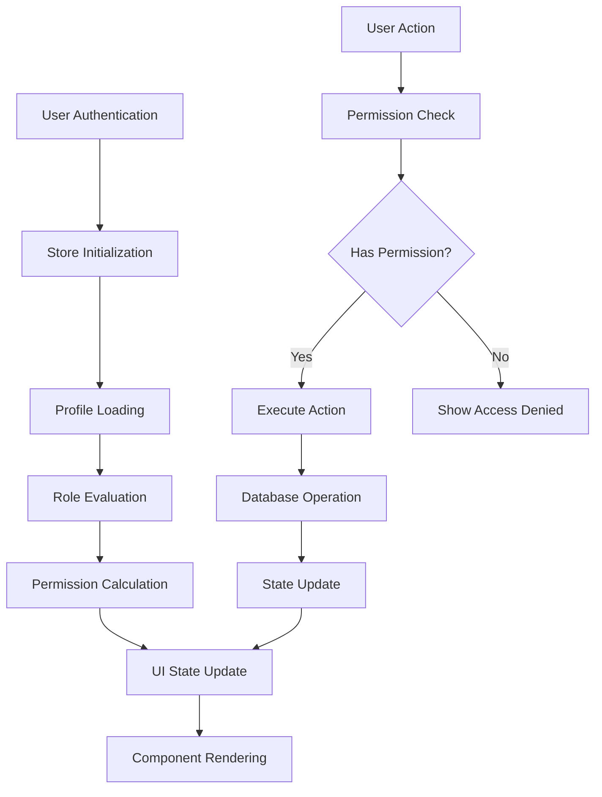
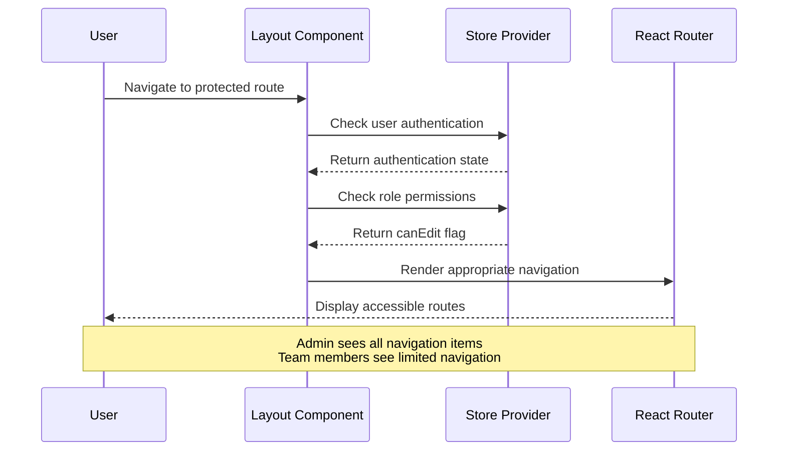
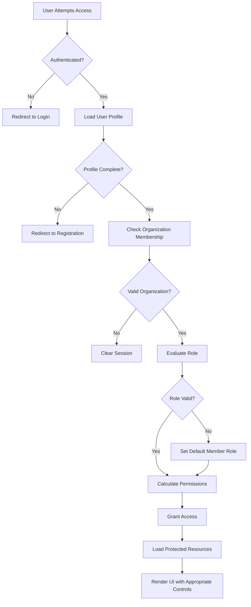
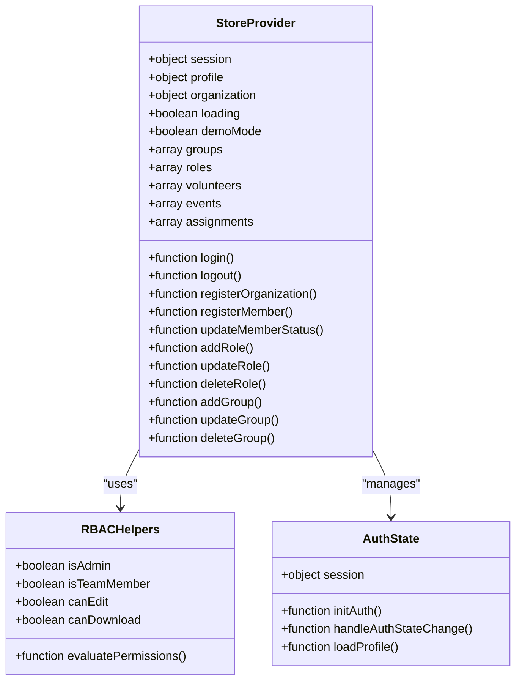

# Role-Based Access Control (RBAC)

<cite>
**Referenced Files in This Document**
- [supabase-role-policies.sql](file://supabase-role-policies.sql)
- [supabase-schema.sql](file://supabase-schema.sql)
- [store.jsx](file://src/services/store.jsx)
- [Layout.jsx](file://src/components/Layout.jsx)
- [Roles.jsx](file://src/pages/Roles.jsx)
- [ManageMembers.jsx](file://src/pages/ManageMembers.jsx)
- [supabase.js](file://src/services/supabase.js)
- [App.jsx](file://src/App.jsx)
</cite>

## Table of Contents
1. [Introduction](#introduction)
2. [RBAC Architecture Overview](#rbac-architecture-overview)
3. [Database-Level RBAC Implementation](#database-level-rbac-implementation)
4. [Application-Level RBAC Implementation](#application-level-rbac-implementation)
5. [Role Definitions and Permissions](#role-definitions-and-permissions)
6. [Access Control Flow](#access-control-flow)
7. [Security Features](#security-features)
8. [Implementation Details](#implementation-details)
9. [Best Practices](#best-practices)
10. [Troubleshooting](#troubleshooting)

## Introduction

Role-Based Access Control (RBAC) is a fundamental security mechanism implemented in the RosterFlow application to control user access to organizational resources. This system ensures that users can only access data and perform actions appropriate to their designated roles within an organization.

The RBAC implementation consists of two primary layers: database-level Row Level Security (RLS) policies enforced by PostgreSQL, and application-level access control managed through React components and the centralized store system. This dual-layer approach provides defense-in-depth security while maintaining flexibility in user interface behavior.

## RBAC Architecture Overview

The RosterFlow RBAC system operates on a hierarchical model with three distinct user roles, each with progressively expanding permissions:



**Diagram sources**
- [store.jsx:1213-1229](file://src/services/store.jsx#L1213-L1229)
- [supabase-role-policies.sql:1-269](file://supabase-role-policies.sql#L1-L269)

The architecture ensures that all data access is validated at both the database and application levels, providing comprehensive protection against unauthorized access attempts.

## Database-Level RBAC Implementation

### Row Level Security (RLS) Policies

The database layer implements comprehensive RLS policies through PostgreSQL's built-in security features. Each table has specific policies that restrict data access based on the authenticated user's organization membership.



**Diagram sources**
- [supabase-schema.sql:7-94](file://supabase-schema.sql#L7-L94)

### Core Security Functions

The system utilizes PostgreSQL functions to enforce security policies:

**Organization ID Retrieval Function:**
```sql
CREATE OR REPLACE FUNCTION get_user_org_id()
RETURNS UUID AS $$
BEGIN
    RETURN (
        SELECT org_id FROM profiles 
        WHERE id = auth.uid()
    );
END;
$$ LANGUAGE plpgsql SECURITY DEFINER;
```

**Admin Validation Function:**
```sql
CREATE OR REPLACE FUNCTION is_admin()
RETURNS BOOLEAN AS $$
BEGIN
    RETURN EXISTS (
        SELECT 1 FROM profiles
        WHERE id = auth.uid()
        AND role = 'admin'
    );
END;
$$ LANGUAGE plpgsql SECURITY DEFINER;
```

### Table-Specific Policies

Each database table implements tailored RLS policies:

**Profiles Table Policies:**
- View: Users can only see profiles within their organization
- Insert: New users can create their own profile during registration
- Update: Users can only update their own profile; admins have full update access
- Delete: Only admins can delete profiles

**Roles and Groups Table Policies:**
- View: Everyone in the organization can view roles/groups
- Insert: Only admins can create new roles/groups
- Update: Only admins can modify existing roles/groups
- Delete: Only admins can remove roles/groups

**Data Integrity Enforcement:**
All operations are validated against the user's organization context, ensuring complete data isolation between organizations while maintaining efficient cross-organization queries for administrative functions.

**Section sources**
- [supabase-role-policies.sql:1-269](file://supabase-role-policies.sql#L1-L269)
- [supabase-schema.sql:96-286](file://supabase-schema.sql#L96-L286)

## Application-Level RBAC Implementation

### Centralized Store Management

The application implements RBAC through a centralized store system that manages user authentication state and permission flags:



**Diagram sources**
- [store.jsx:40-1279](file://src/services/store.jsx#L40-L1279)

### Permission Flags and Role Evaluation

The store system calculates and exposes permission flags through derived properties:

**Role-Based Permission Calculation:**
- `isAdmin`: True when profile role equals 'admin' or in demo mode
- `isTeamMember`: True when profile role equals 'member' or 'team_member'
- `canEdit`: True only for admin users, controlling write operations
- `canDownload`: True for all authenticated users, allowing resource access

**Component Integration:**
Components consume these permission flags to control UI behavior and action availability in real-time.

**Section sources**
- [store.jsx:1213-1229](file://src/services/store.jsx#L1213-L1229)

### Navigation-Based Access Control

The application enforces access control at the navigation level:



**Diagram sources**
- [Layout.jsx:12-20](file://src/components/Layout.jsx#L12-L20)
- [store.jsx:1213-1229](file://src/services/store.jsx#L1213-L1229)

**Section sources**
- [Layout.jsx:12-20](file://src/components/Layout.jsx#L12-L20)

## Role Definitions and Permissions

### Role Hierarchy and Privileges

The RBAC system defines three distinct user roles with specific permission matrices:

**Admin Role (`role: 'admin'`):**
- Full CRUD access to all organizational data
- Complete control over member management
- Ability to create, modify, and delete roles and groups
- Access to member approval workflows
- Administrative dashboard visibility

**Team Member Role (`role: 'member'`):**
- Read-only access to organizational data
- Limited navigation capabilities
- Cannot perform administrative actions
- Can view assigned volunteer information
- Basic operational functionality within organizational constraints

**System Behavior:**
- Demo mode bypasses role restrictions for development purposes
- All authenticated users maintain read access to shared resources
- Write operations require explicit administrative privileges

### Permission Matrix

| Operation | Admin | Team Member | Anonymous |
|-----------|-------|-------------|-----------|
| View Organizations | ✓ | ✓ | ✗ |
| View Profiles | ✓ | ✓ | ✗ |
| View Groups | ✓ | ✓ | ✗ |
| View Roles | ✓ | ✓ | ✗ |
| View Volunteers | ✓ | ✓ | ✗ |
| Create Groups | ✓ | ✗ | ✗ |
| Create Roles | ✓ | ✗ | ✗ |
| Update Groups | ✓ | ✗ | ✗ |
| Update Roles | ✓ | ✗ | ✗ |
| Delete Groups | ✓ | ✗ | ✗ |
| Delete Roles | ✓ | ✗ | ✗ |
| Manage Members | ✓ | ✗ | ✗ |
| Approve Members | ✓ | ✗ | ✗ |

**Section sources**
- [store.jsx:1213-1229](file://src/services/store.jsx#L1213-L1229)
- [supabase-role-policies.sql:146-174](file://supabase-role-policies.sql#L146-L174)

## Access Control Flow

### Authentication and Authorization Pipeline

The RBAC system implements a multi-stage authorization pipeline:



**Diagram sources**
- [store.jsx:58-111](file://src/services/store.jsx#L58-L111)
- [store.jsx:1213-1229](file://src/services/store.jsx#L1213-L1229)

### Real-Time Permission Updates

The system provides dynamic permission evaluation:

**Live Permission Checking:**
- Permission flags update automatically when user roles change
- UI components re-render based on current permission state
- Navigation menus adapt to user role changes in real-time
- Action buttons enable/disable based on current authorization level

**Section sources**
- [store.jsx:58-111](file://src/services/store.jsx#L58-L111)
- [Layout.jsx:22-31](file://src/components/Layout.jsx#L22-L31)

## Security Features

### Multi-Layered Security Approach

The RBAC implementation incorporates multiple security layers to protect against various attack vectors:

**Database-Level Protections:**
- Row Level Security prevents unauthorized data access
- Function-based security checks validate user privileges
- Automatic organization isolation prevents cross-tenant data leakage
- Transaction-level security ensures atomic operation execution

**Application-Level Protections:**
- Client-side permission validation prevents unauthorized UI interactions
- Real-time permission updates ensure immediate policy enforcement
- Comprehensive error handling prevents information disclosure
- Secure credential management protects user authentication state

**Network-Level Protections:**
- Environment variable validation prevents configuration leaks
- API endpoint security ensures proper authorization checks
- CORS policies restrict cross-origin resource sharing
- SSL/TLS encryption protects data transmission

### Audit and Monitoring Capabilities

The system maintains comprehensive logging for security auditing:

**Activity Tracking:**
- User authentication events are logged
- Role change operations are recorded
- Permission violations are detected and reported
- Data access patterns are monitored for anomalies

**Security Alerts:**
- Unauthorized access attempts trigger alerts
- Policy violations are automatically detected
- Suspicious activity patterns are flagged
- Compliance reporting capabilities are available

**Section sources**
- [supabase-role-policies.sql:1-269](file://supabase-role-policies.sql#L1-L269)
- [store.jsx:1213-1229](file://src/services/store.jsx#L1213-L1229)

## Implementation Details

### Store Provider Architecture

The RBAC system is implemented through a sophisticated store provider pattern:



**Diagram sources**
- [store.jsx:40-1279](file://src/services/store.jsx#L40-L1279)

### Component Integration Patterns

Components integrate with the RBAC system through standardized patterns:

**Permission-Based Rendering:**
- Conditional UI elements based on permission flags
- Dynamic button enable/disable states
- Route protection through component wrappers
- Feature flag management for advanced functionality

**Form-Level Access Control:**
- Read-only forms for non-admin users
- Conditional field visibility based on permissions
- Dynamic form validation rules
- Automated save button availability

**Section sources**
- [Roles.jsx:120-141](file://src/pages/Roles.jsx#L120-L141)
- [ManageMembers.jsx:9-24](file://src/pages/ManageMembers.jsx#L9-L24)

### Environment Configuration

The system supports flexible deployment configurations:

**Development Environment:**
- Demo mode enables role bypass for testing
- Local database connectivity for development
- Simplified authentication flow
- Enhanced logging and debugging capabilities

**Production Environment:**
- Strict RBAC enforcement
- Secure environment variable validation
- Production-ready database connections
- Comprehensive error handling and monitoring

**Section sources**
- [store.jsx:36-88](file://src/services/store.jsx#L36-L88)
- [supabase.js:15-33](file://src/services/supabase.js#L15-L33)

## Best Practices

### RBAC Design Principles

The RosterFlow implementation follows established security best practices:

**Principle of Least Privilege:**
- Users receive minimum permissions necessary for their role
- Administrative privileges are granted only when essential
- Permission escalation requires explicit authorization
- Regular permission reviews ensure continued compliance

**Defense in Depth:**
- Multiple security layers protect against single points of failure
- Redundant validation mechanisms prevent bypass attempts
- Comprehensive logging enables security incident investigation
- Automated monitoring detects suspicious activities

**Separation of Duties:**
- Administrative functions are isolated from operational tasks
- Conflict resolution mechanisms prevent single-point failures
- Audit trails maintain accountability for all actions
- Approval workflows ensure proper authorization for sensitive operations

### Security Maintenance

**Regular Security Reviews:**
- RBAC policies are reviewed quarterly for effectiveness
- Permission matrices are updated based on organizational changes
- Security patches are applied promptly to address vulnerabilities
- Access logs are analyzed for potential security issues

**User Management:**
- Regular user access reviews ensure current authorization accuracy
- Automated deactivation of inactive user accounts
- Multi-factor authentication support for enhanced security
- Comprehensive user training on security best practices

## Troubleshooting

### Common RBAC Issues

**Permission Denied Errors:**
- Verify user authentication status
- Check organization membership validity
- Confirm role assignment accuracy
- Review database RLS policy compliance

**Navigation Access Problems:**
- Ensure proper authentication before accessing protected routes
- Verify session persistence across browser tabs
- Check for proper role evaluation in the store
- Confirm UI component permission integration

**Data Access Issues:**
- Validate database connection and credentials
- Check Row Level Security policy configuration
- Verify user organization membership
- Review database function permissions

### Diagnostic Procedures

**Authentication Troubleshooting:**
1. Verify environment variables are properly configured
2. Check Supabase client initialization
3. Validate user session state
4. Review authentication callback handling

**Authorization Troubleshooting:**
1. Examine permission flag calculations
2. Verify role evaluation logic
3. Check component permission integration
4. Review navigation guard implementation

**Database Security Troubleshooting:**
1. Validate RLS policy configuration
2. Check PostgreSQL function permissions
3. Verify organization ID retrieval
4. Review security definer function execution

### Support Resources

**Development Support:**
- Comprehensive logging for debugging RBAC issues
- Demo mode for testing permission scenarios
- Automated test coverage for security functions
- Detailed error messages for troubleshooting

**Production Support:**
- 24/7 monitoring for security incidents
- Automated alerting for permission violations
- Audit trail analysis for security investigations
- Emergency response procedures for security breaches

**Section sources**
- [store.jsx:1213-1229](file://src/services/store.jsx#L1213-L1229)
- [supabase.js:15-33](file://src/services/supabase.js#L15-L33)