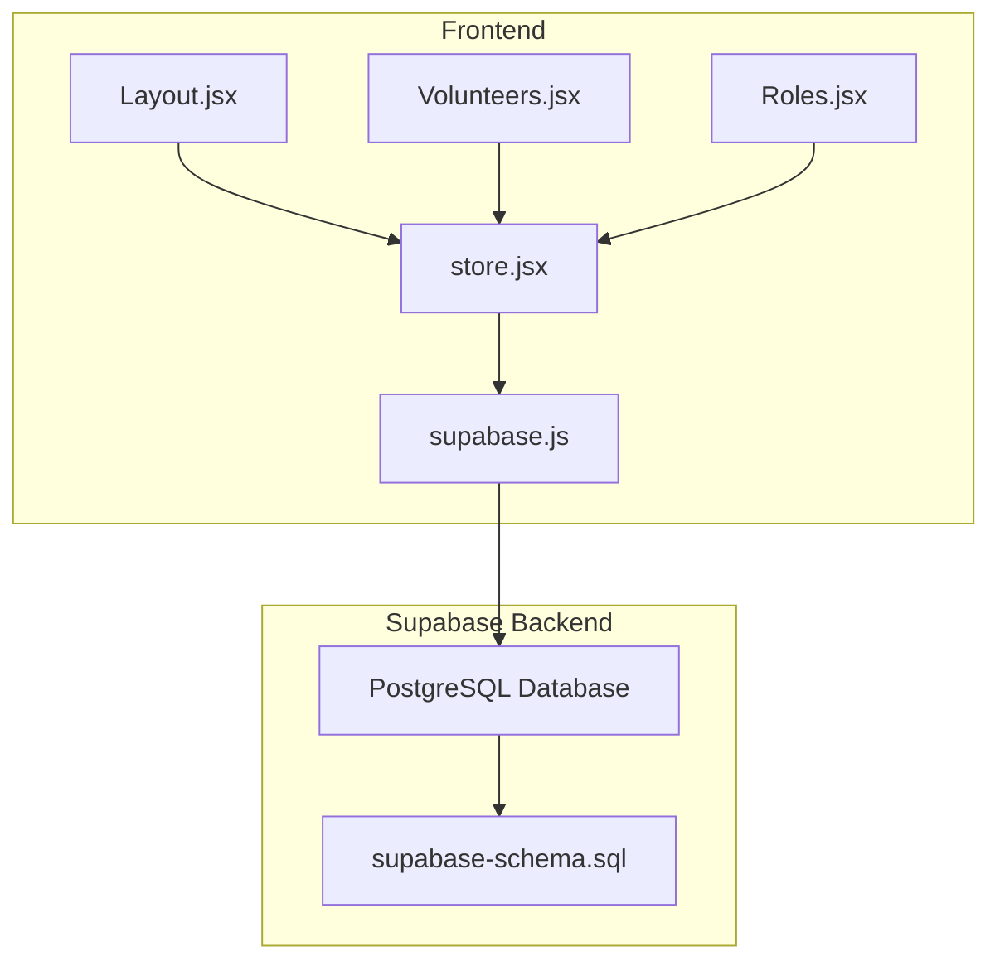
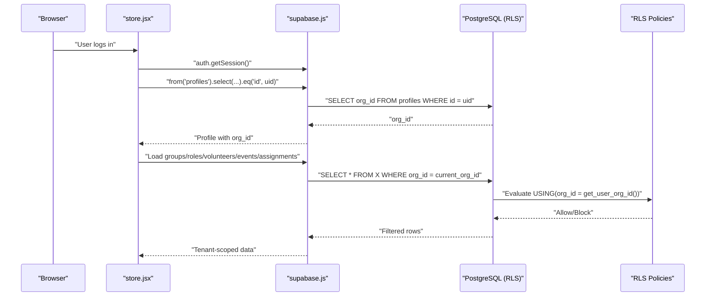
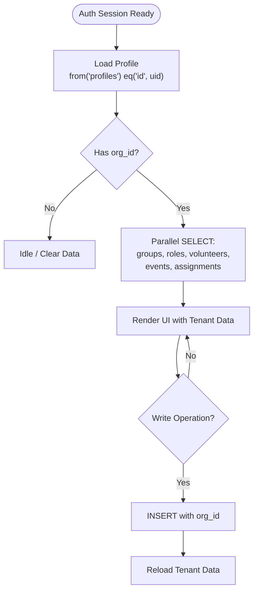
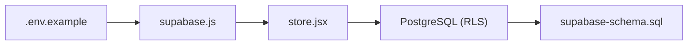

# Row Level Security

<cite>
**Referenced Files in This Document**
- [supabase-schema.sql](file://supabase-schema.sql)
- [store.jsx](file://src/services/store.jsx)
- [supabase.js](file://src/services/supabase.js)
- [.env.example](file://.env.example)
- [Layout.jsx](file://src/components/Layout.jsx)
- [Volunteers.jsx](file://src/pages/Volunteers.jsx)
- [Roles.jsx](file://src/pages/Roles.jsx)
</cite>

## Table of Contents
1. [Introduction](#introduction)
2. [Project Structure](#project-structure)
3. [Core Components](#core-components)
4. [Architecture Overview](#architecture-overview)
5. [Detailed Component Analysis](#detailed-component-analysis)
6. [Dependency Analysis](#dependency-analysis)
7. [Performance Considerations](#performance-considerations)
8. [Troubleshooting Guide](#troubleshooting-guide)
9. [Conclusion](#conclusion)

## Introduction
This document explains RosterFlow’s Row Level Security (RLS) implementation that isolates data between different church organizations. It details how PostgreSQL RLS policies ensure tenant isolation using the org_id field, documents the policies for each table, and describes how the frontend integrates with Supabase to maintain security while preserving application performance. It also covers secure query patterns, potential bypass vectors, and best practices.

## Project Structure
RosterFlow is a React + Vite frontend that communicates with a Supabase-backed PostgreSQL database. The database schema defines tenant-aware tables and enables RLS. The frontend stores and loads data through a centralized store that interacts with Supabase, ensuring org_id is consistently applied during inserts and reads.

**Diagram sources**
- [store.jsx](file://src/services/store.jsx#L1-L472)
- [supabase.js](file://src/services/supabase.js#L1-L13)
- [supabase-schema.sql](file://supabase-schema.sql#L1-L251)

**Section sources**
- [store.jsx](file://src/services/store.jsx#L1-L472)
- [supabase.js](file://src/services/supabase.js#L1-L13)
- [supabase-schema.sql](file://supabase-schema.sql#L1-L251)

## Core Components
- Database schema and RLS policies define tenant isolation via org_id across all tables.
- Frontend store initializes auth state, loads profile and organization, and enforces org_id on inserts.
- Supabase client configuration and environment variables enable secure backend connectivity.

Key implementation points:
- RLS is enabled on all relevant tables and policies restrict access to rows where org_id matches the current user’s organization.
- A helper function retrieves the current user’s org_id for policy evaluation.
- Triggers can auto-fill org_id on insert for selected tables.

**Section sources**
- [supabase-schema.sql](file://supabase-schema.sql#L78-L251)
- [store.jsx](file://src/services/store.jsx#L54-L111)
- [supabase.js](file://src/services/supabase.js#L1-L13)
- [.env.example](file://.env.example#L1-L5)

## Architecture Overview
The system enforces tenant isolation at the database level using RLS. The frontend authenticates users, loads their profile to determine org_id, and performs all CRUD operations through Supabase. Supabase applies RLS policies server-side, preventing cross-tenant access even if the client attempts to query with explicit filters.

**Diagram sources**
- [store.jsx](file://src/services/store.jsx#L21-L111)
- [supabase-schema.sql](file://supabase-schema.sql#L88-L111)

## Detailed Component Analysis

### Database Schema and RLS Policies
- All tenant-facing tables (organizations, profiles, groups, roles, volunteers, volunteer_roles, events, assignments) have RLS enabled.
- A helper function resolves the current user’s org_id from their profile.
- Policies:
  - SELECT: Restrict to rows where org_id equals the current user’s org_id.
  - INSERT: Enforce org_id via WITH CHECK where applicable.
  - UPDATE/DELETE: Restrict to rows owned by the current user’s org_id.
- Additional helper triggers auto-set org_id on insert for specific tables.

Security implications:
- Cross-tenant access is prevented by policy conditions.
- Application logic still sets org_id on inserts to align with policies.

**Section sources**
- [supabase-schema.sql](file://supabase-schema.sql#L78-L251)

### Frontend Store and Data Access Patterns
- Initializes auth session and subscribes to auth state changes.
- Loads profile and organization on login to derive org_id.
- Loads all tenant-scoped data in parallel after org_id is available.
- All write operations include org_id to satisfy INSERT WITH CHECK and trigger behavior.

**Diagram sources**
- [store.jsx](file://src/services/store.jsx#L36-L111)

**Section sources**
- [store.jsx](file://src/services/store.jsx#L36-L111)

### Secure Query Patterns
- Reads: Use Supabase client to select from tables with implicit RLS filtering. The backend enforces org_id equality.
- Writes: Always include org_id in INSERT/UPDATE payloads to satisfy WITH CHECK and trigger behavior.
- Joins: The volunteer endpoint demonstrates joining with a junction table while still relying on RLS for tenant isolation.

Examples (paths):
- Load all tenant data: [loadAllData](file://src/services/store.jsx#L78-L111)
- Add volunteer with org_id: [addVolunteer](file://src/services/store.jsx#L162-L194)
- Add event with org_id: [addEvent](file://src/services/store.jsx#L245-L264)
- Assign volunteer with org_id: [assignVolunteer](file://src/services/store.jsx#L295-L314)

**Section sources**
- [store.jsx](file://src/services/store.jsx#L78-L111)
- [store.jsx](file://src/services/store.jsx#L162-L194)
- [store.jsx](file://src/services/store.jsx#L245-L264)
- [store.jsx](file://src/services/store.jsx#L295-L314)

### Preventing Bypasses
- RLS policies use org_id comparisons and a helper function to resolve the current user’s org_id. This prevents bypassing by passing explicit org_id filters in queries.
- INSERT WITH CHECK ensures org_id is present and correct.
- Triggers can auto-fill org_id on insert for supported tables, reducing risk of omission.

Potential risks and mitigations:
- Risk: Client-side filtering only. Mitigation: Always rely on backend RLS; do not assume client-side filtering provides isolation.
- Risk: Omitting org_id in writes. Mitigation: Centralized store helpers enforce org_id on all inserts.

**Section sources**
- [supabase-schema.sql](file://supabase-schema.sql#L100-L224)
- [store.jsx](file://src/services/store.jsx#L162-L194)

### UI Integration and Navigation
- Layout redirects unauthenticated users to landing.
- Pages consume tenant-scoped data from the store and render lists and forms accordingly.

**Section sources**
- [Layout.jsx](file://src/components/Layout.jsx#L19-L30)
- [Volunteers.jsx](file://src/pages/Volunteers.jsx#L1-L354)
- [Roles.jsx](file://src/pages/Roles.jsx#L1-L386)

## Dependency Analysis
- store.jsx depends on supabase.js for client connectivity and on Supabase backend for RLS enforcement.
- supabase.js depends on environment variables for URL and anonymous key.
- Database schema defines RLS policies and helper functions consumed by the backend.

**Diagram sources**
- [.env.example](file://.env.example#L1-L5)
- [supabase.js](file://src/services/supabase.js#L1-L13)
- [store.jsx](file://src/services/store.jsx#L1-L472)
- [supabase-schema.sql](file://supabase-schema.sql#L1-L251)

**Section sources**
- [.env.example](file://.env.example#L1-L5)
- [supabase.js](file://src/services/supabase.js#L1-L13)
- [store.jsx](file://src/services/store.jsx#L1-L472)
- [supabase-schema.sql](file://supabase-schema.sql#L1-L251)

## Performance Considerations
- RLS adds minimal overhead; policy checks occur server-side and are typically negligible compared to network latency.
- Parallel reads: The store loads multiple datasets concurrently to reduce total latency.
- Indexing: Ensure org_id is indexed on tenant tables to optimize policy evaluation and queries.
- Minimize payload sizes: Only fetch required columns and apply ordering to reduce bandwidth.
- Caching: Consider lightweight client caching for read-heavy lists (e.g., roles, groups) while keeping mutation-sensitive data fresh.

[No sources needed since this section provides general guidance]

## Troubleshooting Guide
Common issues and resolutions:
- Symptom: Empty lists despite data existing.
  - Cause: User belongs to a different organization or org_id mismatch.
  - Resolution: Verify profile org_id and ensure INSERT/UPDATE includes org_id.
  - Reference: [loadProfile](file://src/services/store.jsx#L54-L68), [loadAllData](file://src/services/store.jsx#L78-L111)

- Symptom: Insert errors related to org_id.
  - Cause: Missing or incorrect org_id in payload.
  - Resolution: Use centralized store helpers that inject org_id.
  - Reference: [addVolunteer](file://src/services/store.jsx#L162-L194), [addEvent](file://src/services/store.jsx#L245-L264)

- Symptom: Unexpected cross-tenant data exposure.
  - Cause: Client-side filtering without RLS.
  - Resolution: Rely on backend RLS; avoid manual org_id filters in queries.
  - Reference: [RLS Policies](file://supabase-schema.sql#L100-L224)

- Symptom: Environment variables missing.
  - Cause: Supabase client cannot connect.
  - Resolution: Set VITE_SUPABASE_URL and VITE_SUPABASE_ANON_KEY.
  - Reference: [.env.example](file://.env.example#L1-L5), [supabase.js](file://src/services/supabase.js#L1-L13)

**Section sources**
- [store.jsx](file://src/services/store.jsx#L54-L111)
- [supabase-schema.sql](file://supabase-schema.sql#L100-L224)
- [.env.example](file://.env.example#L1-L5)
- [supabase.js](file://src/services/supabase.js#L1-L13)

## Conclusion
RosterFlow achieves robust tenant isolation by combining Supabase RLS with a centralized store that enforces org_id on all writes. The database schema defines strict policies and helper functions, while the frontend relies on backend enforcement rather than client-side filtering. Following the secure query patterns and best practices outlined here ensures strong security without sacrificing application performance.