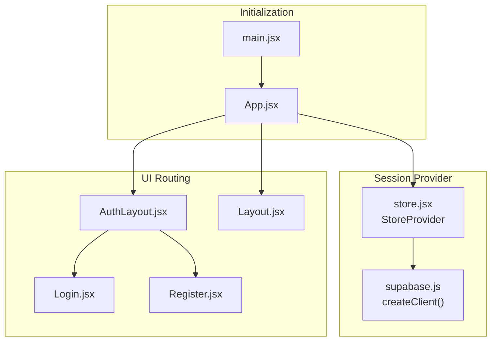
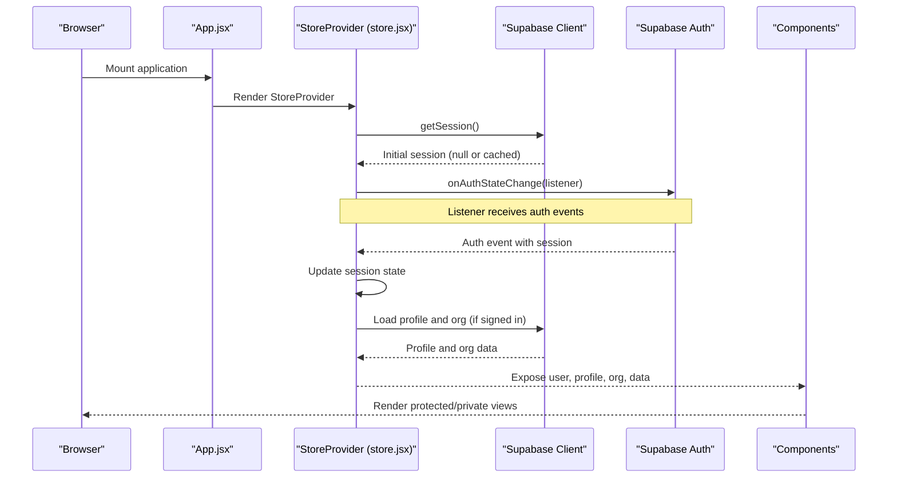
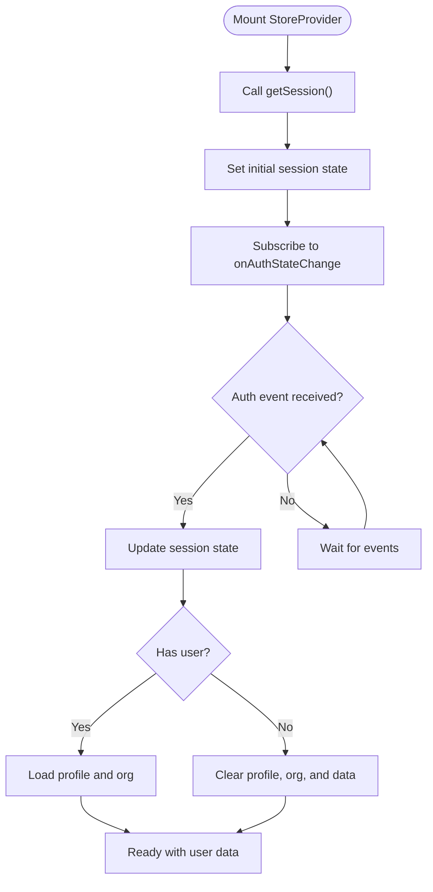
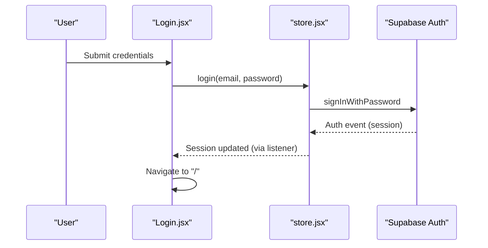
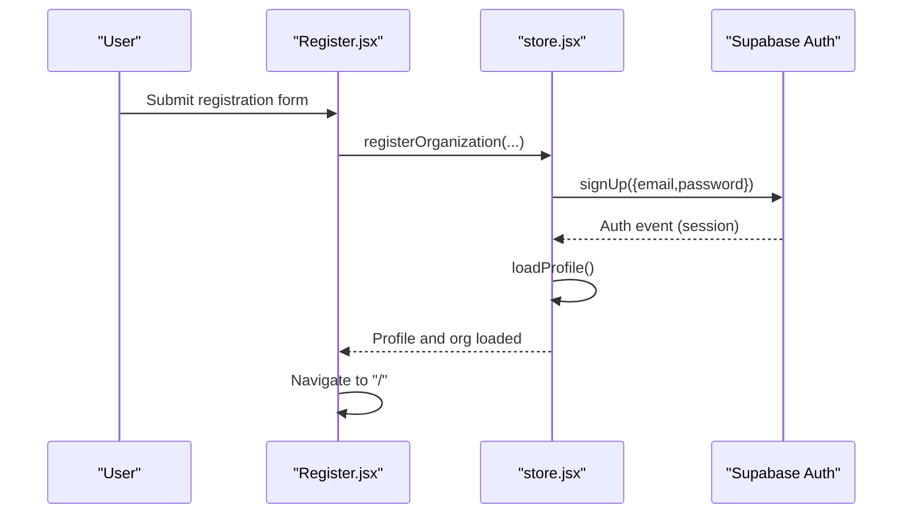
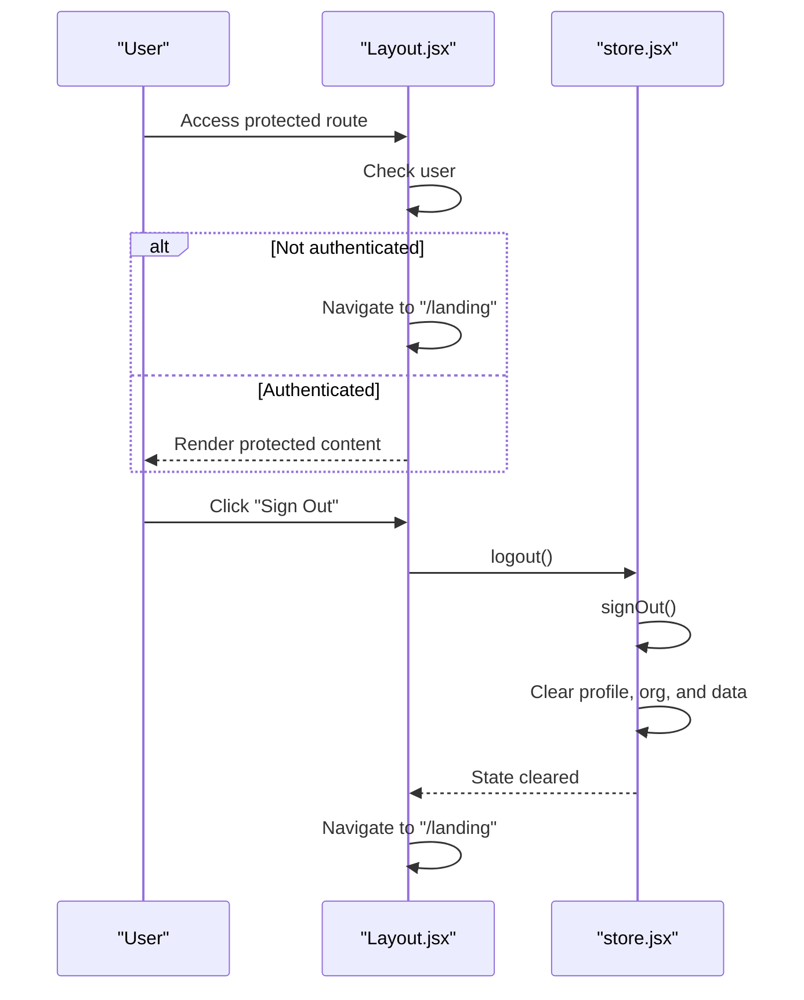
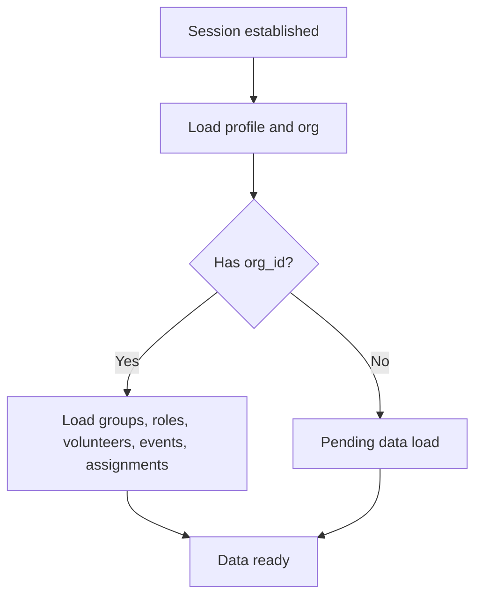
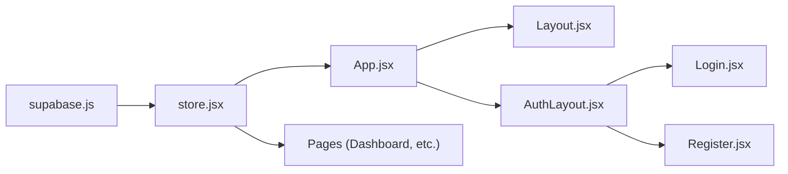

# Session Management

<cite>
**Referenced Files in This Document**
- [src/services/supabase.js](file://src/services/supabase.js)
- [src/services/store.jsx](file://src/services/store.jsx)
- [src/App.jsx](file://src/App.jsx)
- [src/main.jsx](file://src/main.jsx)
- [src/pages/Login.jsx](file://src/pages/Login.jsx)
- [src/pages/Register.jsx](file://src/pages/Register.jsx)
- [src/components/Layout.jsx](file://src/components/Layout.jsx)
- [src/components/AuthLayout.jsx](file://src/components/AuthLayout.jsx)
- [.env.example](file://.env.example)
- [package.json](file://package.json)
</cite>

## Table of Contents
1. [Introduction](#introduction)
2. [Project Structure](#project-structure)
3. [Core Components](#core-components)
4. [Architecture Overview](#architecture-overview)
5. [Detailed Component Analysis](#detailed-component-analysis)
6. [Dependency Analysis](#dependency-analysis)
7. [Performance Considerations](#performance-considerations)
8. [Security Considerations](#security-considerations)
9. [Troubleshooting Guide](#troubleshooting-guide)
10. [Conclusion](#conclusion)

## Introduction
This document explains RosterFlow’s session management system built on Supabase Auth. It covers how authentication state is initialized, persisted, and synchronized across browser refreshes and page reloads. It documents the Supabase auth state change listener mechanism, user data loading on successful authentication, and the logout process. It also addresses session timeout handling, automatic logout procedures, session cleanup, and security considerations for token handling and storage.

## Project Structure
RosterFlow organizes session management around a central provider that initializes Supabase, subscribes to auth state changes, loads user profiles, and exposes a cohesive store to the rest of the app.

**Diagram sources**
- [src/main.jsx](file://src/main.jsx#L1-L11)
- [src/App.jsx](file://src/App.jsx#L1-L37)
- [src/services/store.jsx](file://src/services/store.jsx#L1-L472)
- [src/services/supabase.js](file://src/services/supabase.js#L1-L13)
- [src/components/AuthLayout.jsx](file://src/components/AuthLayout.jsx#L1-L26)
- [src/components/Layout.jsx](file://src/components/Layout.jsx#L1-L108)
- [src/pages/Login.jsx](file://src/pages/Login.jsx#L1-L80)
- [src/pages/Register.jsx](file://src/pages/Register.jsx#L1-L101)

**Section sources**
- [src/main.jsx](file://src/main.jsx#L1-L11)
- [src/App.jsx](file://src/App.jsx#L1-L37)
- [src/services/store.jsx](file://src/services/store.jsx#L1-L472)
- [src/services/supabase.js](file://src/services/supabase.js#L1-L13)
- [src/components/AuthLayout.jsx](file://src/components/AuthLayout.jsx#L1-L26)
- [src/components/Layout.jsx](file://src/components/Layout.jsx#L1-L108)
- [src/pages/Login.jsx](file://src/pages/Login.jsx#L1-L80)
- [src/pages/Register.jsx](file://src/pages/Register.jsx#L1-L101)

## Core Components
- Supabase client initialization and environment configuration
- Central StoreProvider that manages session state, user profile, organization, and data
- Auth state change listener that keeps the app synchronized with server-side auth
- Login and registration flows that trigger Supabase authentication
- Protected layout that enforces authentication and handles logout

Key responsibilities:
- Initialize Supabase client with environment variables
- Persist and synchronize authentication state across reloads
- Load user profile and organization on sign-in
- Clean up data and state on sign-out
- Redirect unauthenticated users to landing/auth routes

**Section sources**
- [src/services/supabase.js](file://src/services/supabase.js#L1-L13)
- [src/services/store.jsx](file://src/services/store.jsx#L1-L472)
- [src/pages/Login.jsx](file://src/pages/Login.jsx#L1-L80)
- [src/pages/Register.jsx](file://src/pages/Register.jsx#L1-L101)
- [src/components/Layout.jsx](file://src/components/Layout.jsx#L1-L108)

## Architecture Overview
The session lifecycle spans initialization, auth state synchronization, user data loading, and logout cleanup.

**Diagram sources**
- [src/App.jsx](file://src/App.jsx#L1-L37)
- [src/services/store.jsx](file://src/services/store.jsx#L21-L45)
- [src/services/supabase.js](file://src/services/supabase.js#L1-L13)

## Detailed Component Analysis

### Supabase Client Initialization
- Creates a Supabase client using Vite environment variables.
- Validates presence of URL and anonymous key; warns if missing.
- Exports a singleton client for use across the app.

Operational implications:
- Environment variables are consumed at build time via Vite.
- Client is shared globally to maintain a single auth state source.

**Section sources**
- [src/services/supabase.js](file://src/services/supabase.js#L1-L13)
- [.env.example](file://.env.example#L1-L5)
- [package.json](file://package.json#L15-L24)

### StoreProvider: Authentication State Persistence and Real-Time Updates
Responsibilities:
- Initialize auth state by fetching the current session.
- Subscribe to Supabase auth state changes to stay synchronized with server-side auth.
- Load user profile and organization when a session exists.
- Clear data and state when signed out.
- Provide login, logout, and registration functions.

Key behaviors:
- Initial session retrieval ensures continuity across browser refreshes.
- Auth state change listener updates local state immediately when Supabase emits events.
- Profile and organization are loaded once a valid session is present.
- Logout triggers Supabase sign-out and clears local state and data.

**Diagram sources**
- [src/services/store.jsx](file://src/services/store.jsx#L21-L45)
- [src/services/store.jsx](file://src/services/store.jsx#L54-L68)
- [src/services/store.jsx](file://src/services/store.jsx#L70-L76)

**Section sources**
- [src/services/store.jsx](file://src/services/store.jsx#L1-L472)

### Login Flow and Session Establishment
- Login form collects credentials and invokes the store’s login function.
- The store signs in via Supabase and expects the auth state change listener to update session state.
- Successful login triggers navigation to the protected dashboard route.

**Diagram sources**
- [src/pages/Login.jsx](file://src/pages/Login.jsx#L14-L25)
- [src/services/store.jsx](file://src/services/store.jsx#L114-L117)
- [src/services/store.jsx](file://src/services/store.jsx#L28-L31)

**Section sources**
- [src/pages/Login.jsx](file://src/pages/Login.jsx#L1-L80)
- [src/services/store.jsx](file://src/services/store.jsx#L114-L117)
- [src/services/store.jsx](file://src/services/store.jsx#L28-L31)

### Registration Flow and Automatic Login
- Registration creates a new user via Supabase sign-up.
- The store auto-loads profile and organization after successful creation.
- Navigation redirects to the protected dashboard route.

**Diagram sources**
- [src/pages/Register.jsx](file://src/pages/Register.jsx#L16-L27)
- [src/services/store.jsx](file://src/services/store.jsx#L126-L159)
- [src/services/store.jsx](file://src/services/store.jsx#L54-L68)

**Section sources**
- [src/pages/Register.jsx](file://src/pages/Register.jsx#L1-L101)
- [src/services/store.jsx](file://src/services/store.jsx#L126-L159)
- [src/services/store.jsx](file://src/services/store.jsx#L54-L68)

### Protected Layout and Logout
- The protected layout checks for a valid user and redirects to the landing route if not authenticated.
- Logout triggers Supabase sign-out and clears local state and data, then navigates to the landing route.

**Diagram sources**
- [src/components/Layout.jsx](file://src/components/Layout.jsx#L19-L30)
- [src/services/store.jsx](file://src/services/store.jsx#L119-L124)

**Section sources**
- [src/components/Layout.jsx](file://src/components/Layout.jsx#L1-L108)
- [src/services/store.jsx](file://src/services/store.jsx#L119-L124)

### User Data Loading on Authentication
- When a session is established, the store fetches the user’s profile and organization.
- Organization data is attached to the profile for downstream UI and feature logic.
- Data loading is deferred until a valid organization ID is present.

**Diagram sources**
- [src/services/store.jsx](file://src/services/store.jsx#L37-L52)
- [src/services/store.jsx](file://src/services/store.jsx#L54-L68)
- [src/services/store.jsx](file://src/services/store.jsx#L78-L111)

**Section sources**
- [src/services/store.jsx](file://src/services/store.jsx#L37-L52)
- [src/services/store.jsx](file://src/services/store.jsx#L54-L68)
- [src/services/store.jsx](file://src/services/store.jsx#L78-L111)

## Dependency Analysis
- The app depends on @supabase/supabase-js for authentication and database operations.
- The store provider depends on the Supabase client and auth state change events.
- UI components depend on the store for user, profile, organization, and data.

**Diagram sources**
- [src/services/supabase.js](file://src/services/supabase.js#L1-L13)
- [src/services/store.jsx](file://src/services/store.jsx#L1-L472)
- [src/App.jsx](file://src/App.jsx#L1-L37)
- [src/components/Layout.jsx](file://src/components/Layout.jsx#L1-L108)
- [src/components/AuthLayout.jsx](file://src/components/AuthLayout.jsx#L1-L26)
- [src/pages/Login.jsx](file://src/pages/Login.jsx#L1-L80)
- [src/pages/Register.jsx](file://src/pages/Register.jsx#L1-L101)

**Section sources**
- [package.json](file://package.json#L15-L24)
- [src/services/supabase.js](file://src/services/supabase.js#L1-L13)
- [src/services/store.jsx](file://src/services/store.jsx#L1-L472)
- [src/App.jsx](file://src/App.jsx#L1-L37)

## Performance Considerations
- Parallel data loading: The store loads multiple datasets concurrently to minimize latency when initializing user data after sign-in.
- Efficient reactivity: Auth state changes trigger targeted updates, avoiding unnecessary re-renders.
- Minimal overhead: The provider initializes once and relies on Supabase’s internal caching and event delivery.

Recommendations:
- Keep the number of concurrent queries reasonable to avoid overwhelming the backend.
- Debounce or throttle frequent UI interactions that trigger data refreshes.
- Consider lazy-loading non-critical data to improve initial render performance.

**Section sources**
- [src/services/store.jsx](file://src/services/store.jsx#L82-L88)

## Security Considerations
- Token handling: Supabase manages tokens internally. The app does not directly manipulate tokens; authentication state is managed through Supabase APIs.
- Secure storage: Supabase persists session state in a secure manner. The app relies on Supabase’s storage mechanisms rather than manual cookie or localStorage management.
- Environment variables: Ensure VITE_SUPABASE_URL and VITE_SUPABASE_ANON_KEY are configured securely and not exposed in client-side code.
- Logout cleanup: The logout function calls Supabase sign-out and clears local state, preventing accidental data leakage.

Best practices:
- Never log sensitive tokens or session details.
- Restrict environment variable exposure in production builds.
- Validate and sanitize all user inputs in authentication flows.
- Monitor Supabase logs and audit trails for suspicious activity.

**Section sources**
- [src/services/supabase.js](file://src/services/supabase.js#L6-L8)
- [src/services/store.jsx](file://src/services/store.jsx#L119-L124)
- [src/services/store.jsx](file://src/services/store.jsx#L28-L31)

## Troubleshooting Guide
Common issues and resolutions:
- Missing environment variables: If VITE_SUPABASE_URL or VITE_SUPABASE_ANON_KEY are not set, the Supabase client warns during initialization. Ensure these are configured in your environment.
- Auth state not updating: Verify that the auth state change listener is active and that the session state updates when events occur.
- Data not loading after login: Confirm that the profile is loaded and contains an organization ID before attempting to load datasets.
- Logout not working: Ensure the logout function is called and that the protected layout redirects to the landing route.

Diagnostics:
- Check console warnings for missing environment variables.
- Inspect the session state in the store to confirm whether a session exists.
- Verify that the auth event listener is subscribed and receiving events.

**Section sources**
- [src/services/supabase.js](file://src/services/supabase.js#L6-L8)
- [src/services/store.jsx](file://src/services/store.jsx#L21-L34)
- [src/services/store.jsx](file://src/services/store.jsx#L37-L52)
- [src/components/Layout.jsx](file://src/components/Layout.jsx#L19-L30)

## Conclusion
RosterFlow’s session management leverages Supabase Auth to provide robust, persistent authentication across browser refreshes and page reloads. The StoreProvider initializes the session, subscribes to auth state changes, loads user data upon successful authentication, and cleans up state on logout. The system is designed for reliability, with clear separation of concerns between authentication, state management, and UI routing. By following the outlined security and troubleshooting guidance, teams can maintain a secure and resilient session lifecycle.