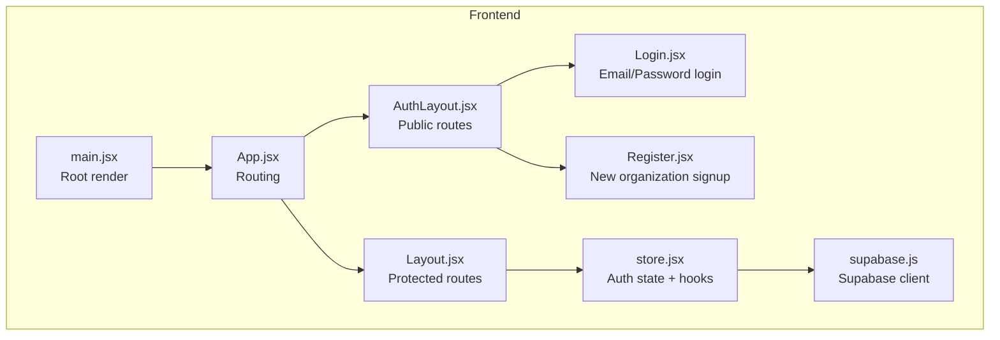
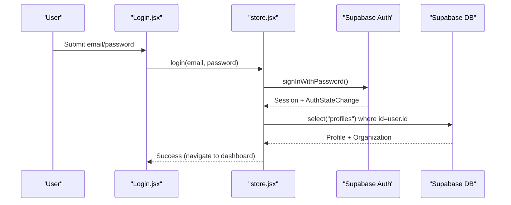
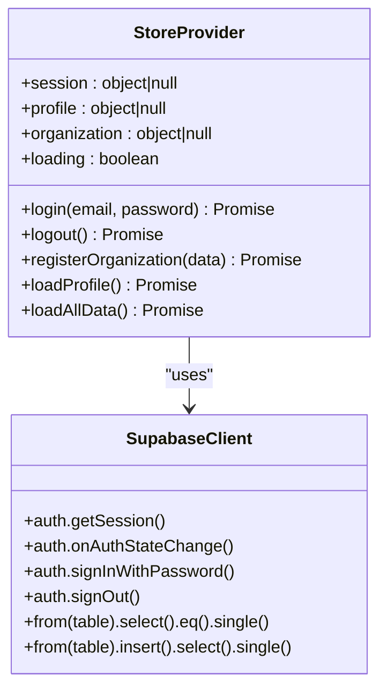
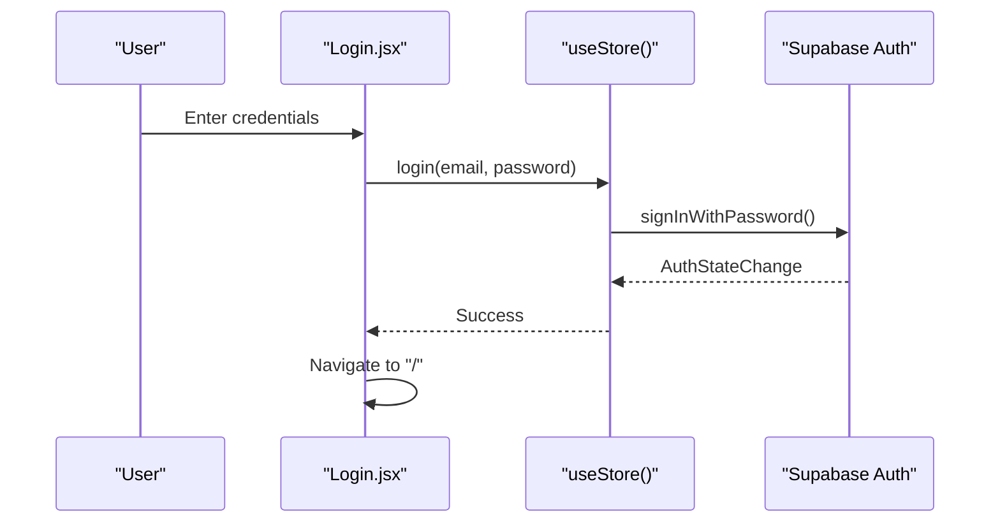
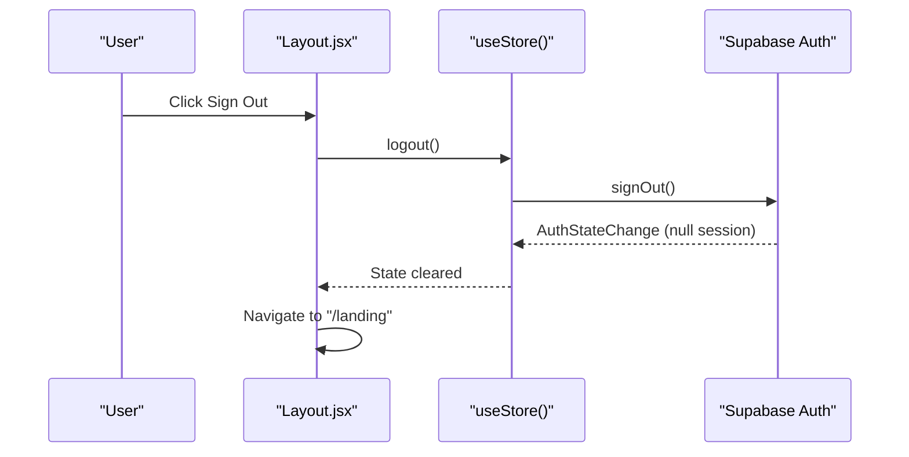
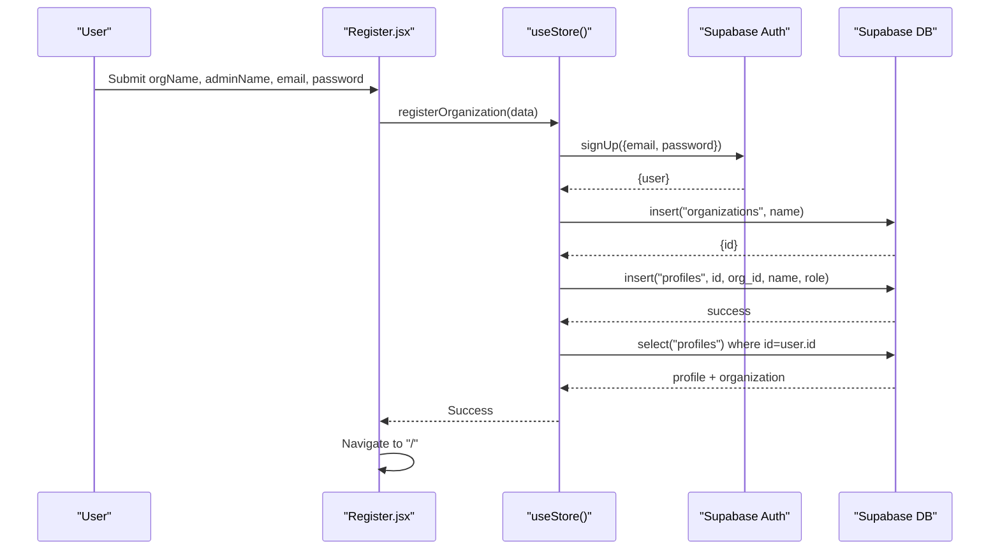
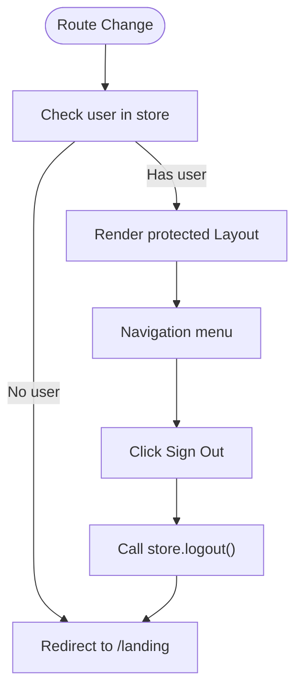
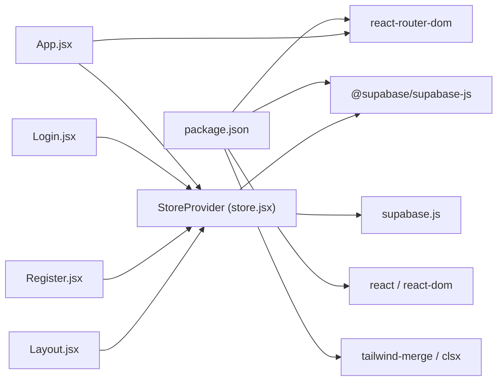

# User Authentication

<cite>
**Referenced Files in This Document**
- [supabase.js](file://src/services/supabase.js)
- [store.jsx](file://src/services/store.jsx)
- [Login.jsx](file://src/pages/Login.jsx)
- [Register.jsx](file://src/pages/Register.jsx)
- [Layout.jsx](file://src/components/Layout.jsx)
- [AuthLayout.jsx](file://src/components/AuthLayout.jsx)
- [App.jsx](file://src/App.jsx)
- [main.jsx](file://src/main.jsx)
- [supabase-schema.sql](file://supabase-schema.sql)
- [.env.example](file://.env.example)
- [package.json](file://package.json)
</cite>

## Table of Contents
1. [Introduction](#introduction)
2. [Project Structure](#project-structure)
3. [Core Components](#core-components)
4. [Architecture Overview](#architecture-overview)
5. [Detailed Component Analysis](#detailed-component-analysis)
6. [Dependency Analysis](#dependency-analysis)
7. [Performance Considerations](#performance-considerations)
8. [Troubleshooting Guide](#troubleshooting-guide)
9. [Conclusion](#conclusion)

## Introduction
This document explains RosterFlow’s user authentication system built on Supabase Auth. It covers the email/password login flow, logout and session lifecycle, Supabase integration, user registration for new organizations, authentication state management via React Context, and practical troubleshooting for common issues like failed logins, session timeouts, and password resets. It also provides code example references showing how authentication hooks are used throughout the application.

## Project Structure
Authentication spans several layers:
- Supabase client initialization and environment configuration
- Centralized authentication state via a React Context provider
- Page-level forms for login and registration
- Protected routing and layout components
- Database schema that enforces row-level security and links auth users to organization profiles

**Diagram sources**
- [main.jsx](file://src/main.jsx#L1-L11)
- [App.jsx](file://src/App.jsx#L1-L37)
- [AuthLayout.jsx](file://src/components/AuthLayout.jsx#L1-L29)
- [Layout.jsx](file://src/components/Layout.jsx#L1-L102)
- [Login.jsx](file://src/pages/Login.jsx#L1-L79)
- [Register.jsx](file://src/pages/Register.jsx#L1-L100)
- [store.jsx](file://src/services/store.jsx#L1-L472)
- [supabase.js](file://src/services/supabase.js#L1-L13)

**Section sources**
- [main.jsx](file://src/main.jsx#L1-L11)
- [App.jsx](file://src/App.jsx#L1-L37)
- [AuthLayout.jsx](file://src/components/AuthLayout.jsx#L1-L29)
- [Layout.jsx](file://src/components/Layout.jsx#L1-L102)
- [Login.jsx](file://src/pages/Login.jsx#L1-L79)
- [Register.jsx](file://src/pages/Register.jsx#L1-L100)
- [store.jsx](file://src/services/store.jsx#L1-L472)
- [supabase.js](file://src/services/supabase.js#L1-L13)

## Core Components
- Supabase client initialization and environment validation
- Centralized authentication state provider with hooks
- Login page with form submission and error handling
- Registration page for new organizations with multi-step backend process
- Protected layout that enforces authentication and provides logout

Key responsibilities:
- Initialize Supabase client with environment variables
- Manage session state, profile, and organization data
- Provide login, logout, and registration functions
- Enforce route protection and redirect unauthenticated users

**Section sources**
- [supabase.js](file://src/services/supabase.js#L1-L13)
- [store.jsx](file://src/services/store.jsx#L1-L472)
- [Login.jsx](file://src/pages/Login.jsx#L1-L79)
- [Register.jsx](file://src/pages/Register.jsx#L1-L100)
- [Layout.jsx](file://src/components/Layout.jsx#L1-L102)

## Architecture Overview
The authentication architecture integrates Supabase Auth with a React Context provider. Supabase manages sessions and emits auth state changes. The provider subscribes to these changes, persists session data, loads user profile and organization, and exposes convenient hooks to pages and components.

**Diagram sources**
- [Login.jsx](file://src/pages/Login.jsx#L14-L25)
- [store.jsx](file://src/services/store.jsx#L114-L124)
- [store.jsx](file://src/services/store.jsx#L21-L34)
- [store.jsx](file://src/services/store.jsx#L54-L68)

## Detailed Component Analysis

### Supabase Client Initialization
- Creates a Supabase client using Vite environment variables
- Validates presence of URL and anonymous key
- Exports a singleton client for use across the app

Implementation highlights:
- Environment variable checks with warnings
- Singleton export for centralized client access

**Section sources**
- [supabase.js](file://src/services/supabase.js#L1-L13)
- [.env.example](file://.env.example#L1-L5)

### Authentication State Provider (React Context)
The provider manages:
- Initial session retrieval and ongoing auth state subscriptions
- Profile and organization loading when a session exists
- Data loading for groups, roles, volunteers, events, and assignments
- Authentication functions: login, logout, and organization registration

Key behaviors:
- Subscribes to Supabase auth state changes and updates local session
- Clears data and resets state on logout
- Loads profile and organization on session change
- Provides derived user object for compatibility with existing components

**Diagram sources**
- [store.jsx](file://src/services/store.jsx#L6-L34)
- [store.jsx](file://src/services/store.jsx#L114-L159)
- [store.jsx](file://src/services/store.jsx#L54-L68)
- [store.jsx](file://src/services/store.jsx#L78-L111)
- [supabase.js](file://src/services/supabase.js#L10-L10)

**Section sources**
- [store.jsx](file://src/services/store.jsx#L1-L472)

### Login Flow
- Form collects email and password
- Calls the provider’s login function
- On success, navigates to the dashboard
- On error, displays the message to the user

**Diagram sources**
- [Login.jsx](file://src/pages/Login.jsx#L14-L25)
- [store.jsx](file://src/services/store.jsx#L114-L117)

**Section sources**
- [Login.jsx](file://src/pages/Login.jsx#L1-L79)
- [store.jsx](file://src/services/store.jsx#L114-L117)

### Logout and Session Management
- Calls Supabase sign out
- Clears profile, organization, and application data
- Redirects to landing page

**Diagram sources**
- [Layout.jsx](file://src/components/Layout.jsx#L27-L30)
- [store.jsx](file://src/services/store.jsx#L119-L124)

**Section sources**
- [Layout.jsx](file://src/components/Layout.jsx#L1-L102)
- [store.jsx](file://src/services/store.jsx#L119-L124)

### Registration Flow (New Organization)
The registration process creates a new user, organization, and profile in a single operation:
1. Create auth user via Supabase sign-up
2. Create organization record
3. Create profile linking the user to the organization
4. Load profile and organization data

**Diagram sources**
- [Register.jsx](file://src/pages/Register.jsx#L16-L27)
- [store.jsx](file://src/services/store.jsx#L126-L159)
- [store.jsx](file://src/services/store.jsx#L54-L68)

**Section sources**
- [Register.jsx](file://src/pages/Register.jsx#L1-L100)
- [store.jsx](file://src/services/store.jsx#L126-L159)
- [store.jsx](file://src/services/store.jsx#L54-L68)

### Protected Routing and Layout
- Public routes (landing, login, register) are wrapped in AuthLayout
- Protected routes (dashboard, volunteers, schedule, roles) are wrapped in Layout
- Layout enforces authentication by redirecting to landing if no user
- Layout provides logout button that clears session and navigates to landing

**Diagram sources**
- [App.jsx](file://src/App.jsx#L18-L29)
- [Layout.jsx](file://src/components/Layout.jsx#L19-L30)

**Section sources**
- [App.jsx](file://src/App.jsx#L1-L37)
- [AuthLayout.jsx](file://src/components/AuthLayout.jsx#L1-L29)
- [Layout.jsx](file://src/components/Layout.jsx#L1-L102)

### Database Schema and Row-Level Security
The Supabase schema defines the relationship between Supabase auth users and organization profiles, and enforces row-level security policies so users can only access data belonging to their organization.

Key schema elements:
- organizations table
- profiles table referencing auth.users and organizations
- RLS policies for all tables
- Helper function to resolve current user’s organization ID

These policies ensure that:
- Users can only view/update/delete data within their organization
- Insertions are constrained to the authenticated user’s organization

**Section sources**
- [supabase-schema.sql](file://supabase-schema.sql#L1-L251)

## Dependency Analysis
- React Router DOM orchestrates public and protected routes
- Supabase JS client provides authentication and database operations
- Tailwind CSS provides styling for forms and layouts
- Tauri APIs are present but not used for authentication in this module

**Diagram sources**
- [package.json](file://package.json#L15-L24)
- [App.jsx](file://src/App.jsx#L1-L37)
- [store.jsx](file://src/services/store.jsx#L1-L4)
- [supabase.js](file://src/services/supabase.js#L1-L1)
- [Login.jsx](file://src/pages/Login.jsx#L1-L3)
- [Register.jsx](file://src/pages/Register.jsx#L1-L3)
- [Layout.jsx](file://src/components/Layout.jsx#L1-L5)

**Section sources**
- [package.json](file://package.json#L1-L44)
- [App.jsx](file://src/App.jsx#L1-L37)

## Performance Considerations
- Session initialization and auth state subscription occur once during app mount
- Data loading uses parallel requests for lists to minimize latency
- Profile and organization are loaded only when a session exists
- Consider caching frequently accessed lists if performance becomes a concern

## Troubleshooting Guide

### Failed Login
Symptoms:
- Error message shown after submitting credentials
- Navigation does not occur to dashboard

Common causes and fixes:
- Incorrect email or password
- Supabase environment variables not configured
- Network connectivity issues

Actions:
- Verify VITE_SUPABASE_URL and VITE_SUPABASE_ANON_KEY are set in environment
- Confirm Supabase project is reachable
- Check browser console for Supabase errors

**Section sources**
- [Login.jsx](file://src/pages/Login.jsx#L20-L22)
- [supabase.js](file://src/services/supabase.js#L6-L8)
- [.env.example](file://.env.example#L1-L5)

### Session Timeout or Unexpected Logout
Symptoms:
- Redirected to landing page unexpectedly
- Protected routes inaccessible

Causes:
- Supabase session expires or is cleared
- Auth state change triggers re-render and redirect

Actions:
- Re-authenticate via login page
- Ensure browser storage is enabled for cookies/localStorage
- Check for cross-origin issues if using custom domains

**Section sources**
- [Layout.jsx](file://src/components/Layout.jsx#L19-L23)
- [store.jsx](file://src/services/store.jsx#L21-L34)

### Password Reset Procedures
Current implementation:
- The login page includes a “Forgot?” link in the password field
- No explicit password reset UI is implemented in the current codebase

Recommended steps:
- Use Supabase Auth’s built-in password reset flow
- Add a dedicated password reset page that calls Supabase’s password reset methods
- Ensure email delivery is configured in Supabase Auth settings

**Section sources**
- [Login.jsx](file://src/pages/Login.jsx#L48-L50)

### Registration Issues
Symptoms:
- Registration fails mid-process
- New user created but organization/profile not set up

Common causes:
- Supabase errors during organization or profile creation
- Missing required fields in form submission

Actions:
- Inspect console for thrown error messages
- Validate form inputs before submission
- Ensure Supabase RLS policies and database constraints are satisfied

**Section sources**
- [Register.jsx](file://src/pages/Register.jsx#L16-L27)
- [store.jsx](file://src/services/store.jsx#L126-L159)

### Environment Configuration
Ensure the following environment variables are set:
- VITE_SUPABASE_URL
- VITE_SUPABASE_ANON_KEY

If either is missing, the Supabase client warns and may fail to initialize.

**Section sources**
- [supabase.js](file://src/services/supabase.js#L6-L8)
- [.env.example](file://.env.example#L1-L5)

## Conclusion
RosterFlow’s authentication system centers on Supabase Auth integrated with a React Context provider. It provides a clean login/logout flow, robust session management, and a streamlined registration process for new organizations. The protected routing ensures users are directed appropriately, while Supabase’s row-level security keeps data scoped to each organization. For production readiness, consider implementing a dedicated password reset flow and validating environment configuration early in the app lifecycle.