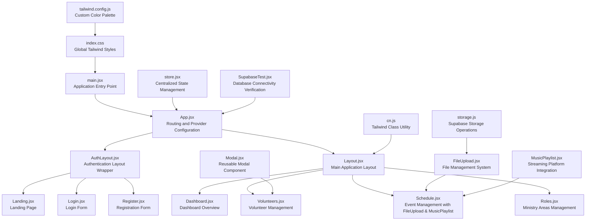
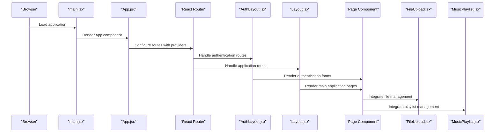
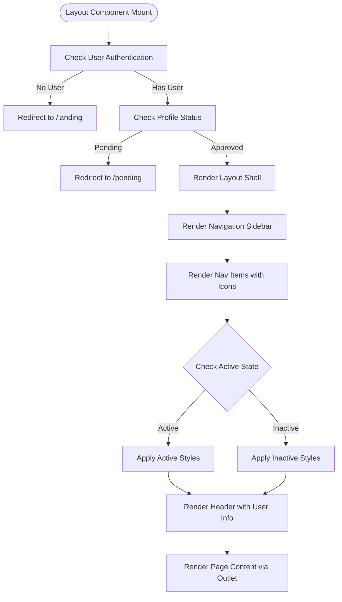
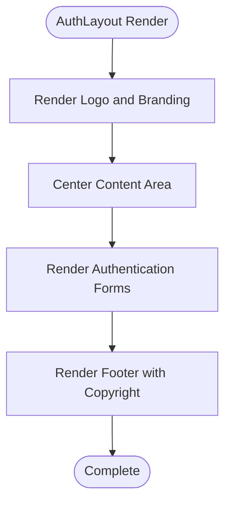
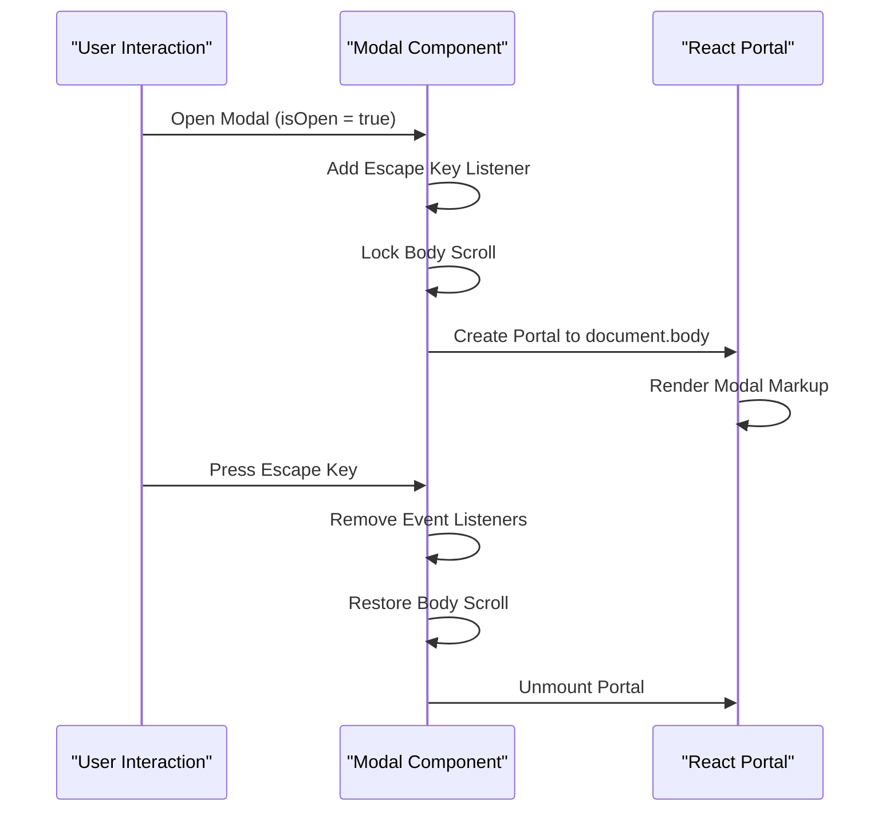
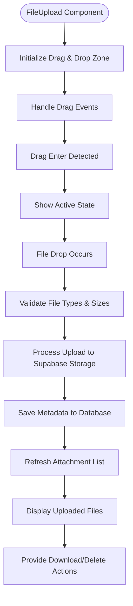
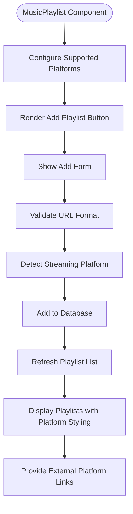
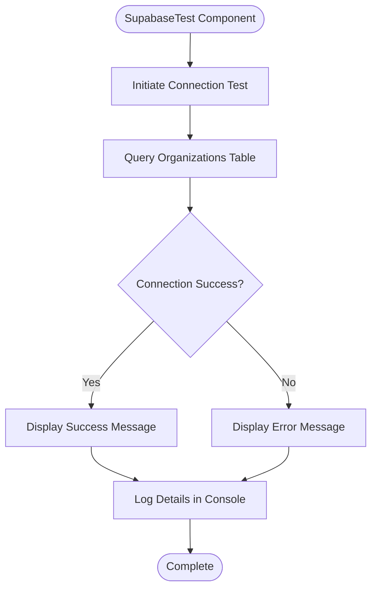
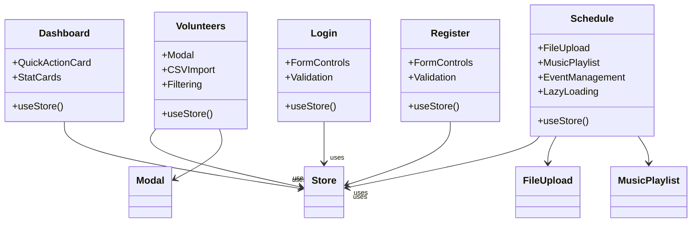
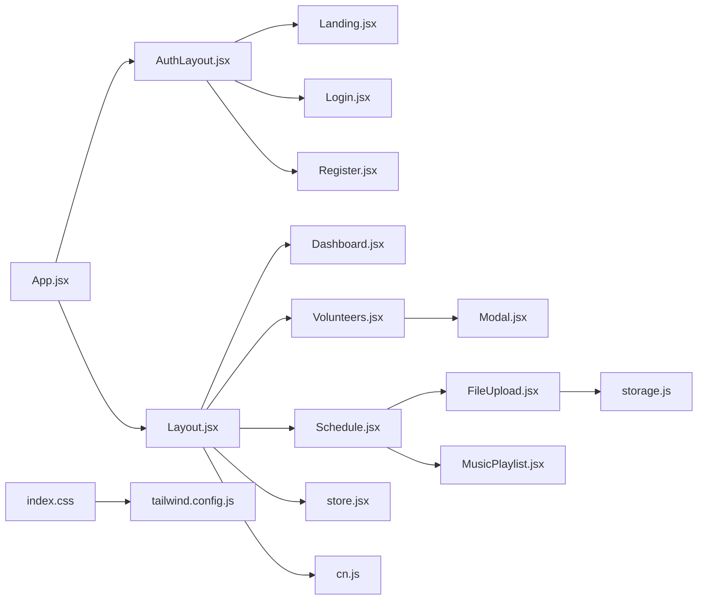

# Component Architecture

<cite>
**Referenced Files in This Document**
- [src/App.jsx](file://src/App.jsx)
- [src/main.jsx](file://src/main.jsx)
- [src/index.css](file://src/index.css)
- [src/components/Layout.jsx](file://src/components/Layout.jsx)
- [src/components/AuthLayout.jsx](file://src/components/AuthLayout.jsx)
- [src/components/Modal.jsx](file://src/components/Modal.jsx)
- [src/components/FileUpload.jsx](file://src/components/FileUpload.jsx)
- [src/components/MusicPlaylist.jsx](file://src/components/MusicPlaylist.jsx)
- [src/components/SupabaseTest.jsx](file://src/components/SupabaseTest.jsx)
- [src/services/store.jsx](file://src/services/store.jsx)
- [src/services/storage.js](file://src/services/storage.js)
- [src/utils/cn.js](file://src/utils/cn.js)
- [src/pages/Dashboard.jsx](file://src/pages/Dashboard.jsx)
- [src/pages/Landing.jsx](file://src/pages/Landing.jsx)
- [src/pages/Login.jsx](file://src/pages/Login.jsx)
- [src/pages/Register.jsx](file://src/pages/Register.jsx)
- [src/pages/Volunteers.jsx](file://src/pages/Volunteers.jsx)
- [src/pages/Schedule.jsx](file://src/pages/Schedule.jsx)
- [tailwind.config.js](file://tailwind.config.js)
- [package.json](file://package.json)
</cite>

## Update Summary
**Changes Made**
- Updated component analysis to include three new reusable components: FileUpload, MusicPlaylist, and SupabaseTest
- Enhanced architecture overview to reflect comprehensive component libraries and modern React patterns
- Updated dependency analysis to include new component integrations and storage services
- Added new sections documenting the three new components and their usage patterns
- Expanded styling approach documentation to cover advanced Tailwind configurations
- Enhanced troubleshooting guide with new component-specific guidance

## Table of Contents
1. [Introduction](#introduction)
2. [Project Structure](#project-structure)
3. [Core Components](#core-components)
4. [Architecture Overview](#architecture-overview)
5. [Detailed Component Analysis](#detailed-component-analysis)
6. [Dependency Analysis](#dependency-analysis)
7. [Performance Considerations](#performance-considerations)
8. [Troubleshooting Guide](#troubleshooting-guide)
9. [Conclusion](#conclusion)
10. [Appendices](#appendices)

## Introduction
This document explains RosterFlow's modern React component architecture and comprehensive UI system. The application follows a sophisticated layout system with reusable UI components, a robust styling approach using Tailwind CSS, and comprehensive component libraries including specialized components for file management and music playlist integration. The architecture emphasizes clean separation of concerns, centralized state management, and responsive design patterns with a mobile-first approach.

## Project Structure
RosterFlow implements a feature-based organization under src with clear separation of concerns:
- Entry point renders the app inside React StrictMode with global styles
- Routing wraps pages with either AuthLayout for authentication routes or Layout for application routes
- Shared UI components live under components/ folder with three new reusable components for file management, music playlist integration, and database connectivity testing
- Page components live under pages/ with comprehensive event management capabilities
- Global state is centralized via StoreProvider that integrates with Supabase for authentication and data operations
- Styling is configured with Tailwind CSS and utility classes with extensive color palette customization

**Diagram sources**
- [src/main.jsx:1-11](file://src/main.jsx#L1-L11)
- [src/App.jsx:1-43](file://src/App.jsx#L1-L43)
- [src/components/AuthLayout.jsx:1-26](file://src/components/AuthLayout.jsx#L1-L26)
- [src/components/Layout.jsx:1-127](file://src/components/Layout.jsx#L1-L127)
- [src/components/Modal.jsx:1-50](file://src/components/Modal.jsx#L1-L50)
- [src/components/FileUpload.jsx:1-212](file://src/components/FileUpload.jsx#L1-L212)
- [src/components/MusicPlaylist.jsx:1-249](file://src/components/MusicPlaylist.jsx#L1-L249)
- [src/components/SupabaseTest.jsx:1-53](file://src/components/SupabaseTest.jsx#L1-L53)
- [src/services/store.jsx:1-1252](file://src/services/store.jsx#L1-L1252)
- [src/services/storage.js:1-59](file://src/services/storage.js#L1-L59)
- [src/utils/cn.js:1-7](file://src/utils/cn.js#L1-L7)

**Section sources**
- [src/main.jsx:1-11](file://src/main.jsx#L1-L11)
- [src/App.jsx:1-43](file://src/App.jsx#L1-L43)
- [src/index.css:1-10](file://src/index.css#L1-L10)
- [tailwind.config.js:1-51](file://tailwind.config.js#L1-L51)

## Core Components
This section documents the reusable UI building blocks and their roles in the modern RosterFlow architecture.

### Layout Components

**Layout.jsx**
- Purpose: Provides the main application shell with sidebar navigation, header, and outlet rendering for authenticated routes
- Props: None (uses react-router hooks and store)
- Behavior: Redirects unauthenticated users to landing; renders nav items with Lucide icons; displays current user info; exposes logout handler
- Composition: Wraps page components via Outlet; integrates with cn for conditional class merging
- Advanced Features: Demo mode banner, responsive design with mobile-first approach, active navigation highlighting

**AuthLayout.jsx**
- Purpose: Provides a minimal authentication-focused layout for landing, login, and registration pages
- Props: None (renders Outlet for child forms)
- Behavior: Hosts branding with logo and footer; centers content; delegates form rendering to children
- Design: Gradient background, centered content area with max-width constraints

**Modal.jsx**
- Purpose: Renders a centered modal overlay with backdrop blur and escape-key support
- Props: isOpen (boolean), onClose (callback), title (string), children (content)
- Behavior: Uses React portals to attach to document body; manages focus lock via body overflow; cleans up event listeners on unmount
- Accessibility: Proper ARIA handling, keyboard navigation support

### Specialized Components

**FileUpload.jsx**
- Purpose: Comprehensive file management component with drag-and-drop support and multiple file type handling
- Props: eventId (required), initialAttachments (optional array)
- Behavior: Handles file uploads to Supabase Storage, validates file types and sizes, supports drag-and-drop, displays upload progress, manages file metadata in the database
- Features: Supports PDF, DOC, DOCX, MP3, JPG, PNG, GIF, and WEBP formats with appropriate icons and color coding; batch upload processing; file size formatting

**MusicPlaylist.jsx**
- Purpose: Event-specific music management component with streaming platform integration
- Props: eventId (required), initialPlaylists (optional array), hideHeader (boolean)
- Behavior: Manages playlist URLs for YouTube, Spotify, Apple Music, and SoundCloud; validates URLs; provides platform-specific styling and icons
- Features: Form validation, platform detection, URL validation, external link opening, dynamic platform styling

**SupabaseTest.jsx**
- Purpose: Database connectivity verification component for debugging and monitoring
- Props: None (self-contained)
- Behavior: Tests Supabase connection by querying the organizations table and displays connection status with error details
- Features: Real-time connection testing, error reporting, status indication, detailed error logging

### Utility Components

**cn utility**
- Purpose: Merges and deduplicates Tailwind classes safely
- Usage: Applied across layouts for dynamic class composition; prevents class conflicts
- Implementation: Combines clsx and tailwind-merge for optimal class handling

**Section sources**
- [src/components/Layout.jsx:1-127](file://src/components/Layout.jsx#L1-L127)
- [src/components/AuthLayout.jsx:1-26](file://src/components/AuthLayout.jsx#L1-L26)
- [src/components/Modal.jsx:1-50](file://src/components/Modal.jsx#L1-L50)
- [src/components/FileUpload.jsx:1-212](file://src/components/FileUpload.jsx#L1-L212)
- [src/components/MusicPlaylist.jsx:1-249](file://src/components/MusicPlaylist.jsx#L1-L249)
- [src/components/SupabaseTest.jsx:1-53](file://src/components/SupabaseTest.jsx#L1-L53)
- [src/utils/cn.js:1-7](file://src/utils/cn.js#L1-L7)

## Architecture Overview
The routing layer determines which layout wraps each page with sophisticated authentication and authorization flows:
- Authentication routes (/landing, /register, /login) are wrapped by AuthLayout
- Application routes (/dashboard and nested routes) are wrapped by Layout with comprehensive navigation
- Both layouts render Outlet to display page content with proper authentication guards
- Global state is provided at the top level via StoreProvider with Supabase integration
- Three new components integrate seamlessly with the existing architecture:
  - FileUpload integrates with Supabase Storage and event attachments
  - MusicPlaylist integrates with event playlists and streaming platforms
  - SupabaseTest provides database connectivity verification

**Diagram sources**
- [src/main.jsx:1-11](file://src/main.jsx#L1-L11)
- [src/App.jsx:1-43](file://src/App.jsx#L1-L43)
- [src/components/AuthLayout.jsx:1-26](file://src/components/AuthLayout.jsx#L1-L26)
- [src/components/Layout.jsx:1-127](file://src/components/Layout.jsx#L1-L127)
- [src/components/FileUpload.jsx:1-212](file://src/components/FileUpload.jsx#L1-L212)
- [src/components/MusicPlaylist.jsx:1-249](file://src/components/MusicPlaylist.jsx#L1-L249)

## Detailed Component Analysis

### Layout.jsx - Main Application Shell
The Layout component serves as the primary application container with sophisticated navigation and user management features:

- **Navigation System**: Defines nav items with Lucide icons and labels; highlights active item based on current path using react-router hooks
- **Header Management**: Displays current page title and user avatar with role information; uses cn for conditional classes
- **Authentication Flow**: Checks user presence and profile status; redirects unauthenticated users to landing or pending status to approval page
- **Responsive Design**: Uses flex utilities and breakpoint classes for sidebar and header adaptation
- **Demo Mode**: Displays prominent banner indicating demo mode when Supabase is not configured

**Diagram sources**
- [src/components/Layout.jsx:15-127](file://src/components/Layout.jsx#L15-L127)

**Section sources**
- [src/components/Layout.jsx:1-127](file://src/components/Layout.jsx#L1-L127)

### AuthLayout.jsx - Authentication Interface
The AuthLayout component provides a clean, focused interface for authentication-related pages:

- **Branding**: Features ServeFlow logo and branding in header
- **Centered Content**: Uses flexbox to center authentication forms
- **Responsive Design**: Adapts to different screen sizes with proper spacing
- **Footer Support**: Includes copyright information and legal notices

**Diagram sources**
- [src/components/AuthLayout.jsx:4-26](file://src/components/AuthLayout.jsx#L4-L26)

**Section sources**
- [src/components/AuthLayout.jsx:1-26](file://src/components/AuthLayout.jsx#L1-L26)

### Modal.jsx - Interactive Overlay System
The Modal component provides a robust overlay system with comprehensive interaction handling:

- **Portal Rendering**: Uses React portals to attach modals to document.body for proper stacking context
- **Keyboard Navigation**: Supports Escape key for dismissal
- **Body Management**: Locks body scroll during modal activation
- **Event Cleanup**: Properly removes event listeners on component unmount

**Diagram sources**
- [src/components/Modal.jsx:5-50](file://src/components/Modal.jsx#L5-L50)

**Section sources**
- [src/components/Modal.jsx:1-50](file://src/components/Modal.jsx#L1-L50)

### FileUpload.jsx - Comprehensive File Management
The FileUpload component implements a sophisticated file management system with multiple features:

- **Drag-and-Drop Interface**: Visual feedback for file drops with active state styling
- **Multi-File Processing**: Batch upload support with progress indication
- **File Type Validation**: Supports 8 different file types with appropriate icons and color coding
- **Storage Integration**: Integrates with Supabase Storage for persistent file storage
- **Metadata Management**: Stores file information in database with automatic refresh

**Diagram sources**
- [src/components/FileUpload.jsx:18-212](file://src/components/FileUpload.jsx#L18-L212)

**Section sources**
- [src/components/FileUpload.jsx:1-212](file://src/components/FileUpload.jsx#L1-L212)

### MusicPlaylist.jsx - Streaming Platform Integration
The MusicPlaylist component provides comprehensive music management with platform-specific features:

- **Platform Support**: Integrates with YouTube, Spotify, Apple Music, and SoundCloud
- **Dynamic Styling**: Platform-specific color schemes and icons
- **Form Validation**: URL validation and platform detection
- **External Integration**: Opens playlists in respective streaming platforms
- **Management Features**: Add, edit, and delete playlist entries

**Diagram sources**
- [src/components/MusicPlaylist.jsx:12-249](file://src/components/MusicPlaylist.jsx#L12-L249)

**Section sources**
- [src/components/MusicPlaylist.jsx:1-249](file://src/components/MusicPlaylist.jsx#L1-L249)

### SupabaseTest.jsx - Database Connectivity Verification
The SupabaseTest component provides essential database connectivity verification:

- **Connection Testing**: Queries organizations table to verify Supabase connectivity
- **Error Handling**: Comprehensive error reporting and user feedback
- **Real-time Status**: Displays connection status with success/error indicators
- **Development Tool**: Essential for debugging and monitoring database connections

**Diagram sources**
- [src/components/SupabaseTest.jsx:4-53](file://src/components/SupabaseTest.jsx#L4-L53)

**Section sources**
- [src/components/SupabaseTest.jsx:1-53](file://src/components/SupabaseTest.jsx#L1-L53)

### Page Components and Composition Patterns
The page components demonstrate sophisticated composition patterns with the new specialized components:

**Dashboard.jsx**
- Uses store to access user, volunteers, events, roles data
- Composes quick action cards and stat cards with Tailwind utilities
- Demonstrates link-based navigation to other pages

**Volunteers.jsx**
- Integrates Modal for add/edit flows
- Implements filtering, CSV import, and CRUD actions via store
- Uses cn for conditional classes and Lucide icons

**Schedule.jsx** - Enhanced with New Components
- **Updated** Integrates FileUpload and MusicPlaylist components for comprehensive event management
- Manages event expansion with lazy loading of attachments and playlists
- Provides file upload functionality with drag-and-drop support
- Includes music playlist management with streaming platform integration
- Implements complex state management for assignments, emails, and event operations

**Login.jsx and Register.jsx**
- Consume store for authentication actions
- Provide form controls with Tailwind styling and focus states

**Diagram sources**
- [src/pages/Dashboard.jsx:1-90](file://src/pages/Dashboard.jsx#L1-L90)
- [src/pages/Volunteers.jsx:1-354](file://src/pages/Volunteers.jsx#L1-L354)
- [src/pages/Schedule.jsx:1-917](file://src/pages/Schedule.jsx#L1-L917)
- [src/pages/Login.jsx:1-79](file://src/pages/Login.jsx#L1-L79)
- [src/pages/Register.jsx:1-100](file://src/pages/Register.jsx#L1-L100)
- [src/services/store.jsx:1-1252](file://src/services/store.jsx#L1-L1252)
- [src/components/Modal.jsx:1-50](file://src/components/Modal.jsx#L1-L50)
- [src/components/FileUpload.jsx:1-212](file://src/components/FileUpload.jsx#L1-L212)
- [src/components/MusicPlaylist.jsx:1-249](file://src/components/MusicPlaylist.jsx#L1-L249)

**Section sources**
- [src/pages/Dashboard.jsx:1-90](file://src/pages/Dashboard.jsx#L1-L90)
- [src/pages/Volunteers.jsx:1-354](file://src/pages/Volunteers.jsx#L1-L354)
- [src/pages/Schedule.jsx:1-917](file://src/pages/Schedule.jsx#L1-L917)
- [src/pages/Login.jsx:1-79](file://src/pages/Login.jsx#L1-L79)
- [src/pages/Register.jsx:1-100](file://src/pages/Register.jsx#L1-L100)

## Dependency Analysis
The modern RosterFlow architecture demonstrates sophisticated dependency management:

### Routing and Layout System
- App.jsx defines routes and wraps them with AuthLayout or Layout based on authentication state
- Layout.jsx depends on react-router for navigation and Outlet rendering
- AuthLayout.jsx provides minimal wrapper for authentication flows

### State Management Architecture
- StoreProvider encapsulates Supabase auth and data operations with comprehensive error handling
- Exposes derived user object, organization data, and CRUD helpers through context
- Pages consume useStore hook to access state and dispatch actions
- **Updated** FileUpload and MusicPlaylist components integrate with store hooks for database operations

### Storage and Database Integration
- **New** FileUpload component uses storage.js utilities for file operations with Supabase Storage
- **New** SupabaseTest component uses supabase client for database connectivity testing
- **Enhanced** StoreProvider manages complex data relationships and transformations

### Styling and Utility Systems
- Tailwind CSS is applied globally with extensive color palette customization
- cn utility merges classes safely preventing conflicts
- Theme extends primary, coral, and navy palettes for consistent brand colors

**Diagram sources**
- [src/App.jsx:1-43](file://src/App.jsx#L1-L43)
- [src/components/AuthLayout.jsx:1-26](file://src/components/AuthLayout.jsx#L1-L26)
- [src/components/Layout.jsx:1-127](file://src/components/Layout.jsx#L1-L127)
- [src/pages/Dashboard.jsx:1-90](file://src/pages/Dashboard.jsx#L1-L90)
- [src/pages/Volunteers.jsx:1-354](file://src/pages/Volunteers.jsx#L1-L354)
- [src/pages/Schedule.jsx:1-917](file://src/pages/Schedule.jsx#L1-L917)
- [src/services/store.jsx:1-1252](file://src/services/store.jsx#L1-L1252)
- [src/components/Modal.jsx:1-50](file://src/components/Modal.jsx#L1-L50)
- [src/components/FileUpload.jsx:1-212](file://src/components/FileUpload.jsx#L1-L212)
- [src/components/MusicPlaylist.jsx:1-249](file://src/components/MusicPlaylist.jsx#L1-L249)
- [src/services/storage.js:1-59](file://src/services/storage.js#L1-L59)
- [src/utils/cn.js:1-7](file://src/utils/cn.js#L1-L7)
- [src/index.css:1-10](file://src/index.css#L1-L10)
- [tailwind.config.js:1-51](file://tailwind.config.js#L1-L51)

**Section sources**
- [src/App.jsx:1-43](file://src/App.jsx#L1-L43)
- [src/services/store.jsx:1-1252](file://src/services/store.jsx#L1-L1252)
- [src/utils/cn.js:1-7](file://src/utils/cn.js#L1-L7)
- [tailwind.config.js:1-51](file://tailwind.config.js#L1-L51)

## Performance Considerations
The modern RosterFlow architecture implements several performance optimization strategies:

### Efficient Rendering Patterns
- Pages rely on store selectors via useStore hook; avoid unnecessary prop drilling by accessing state directly where needed
- Conditional rendering: Layout redirects unauthenticated users early to prevent rendering heavy content
- Modal portal: Rendering modals outside the main tree reduces reflows and improves stacking context

### Data Loading Optimization
- Parallel data loads: The store loads related datasets concurrently to minimize latency
- **New** Lazy loading: Schedule page implements lazy loading for file attachments and playlists to improve performance
- **New** File upload optimization: FileUpload component batches uploads and provides progress indication

### Memory Management
- Proper cleanup of event listeners and subscriptions
- Modal component removes event listeners on unmount
- StoreProvider manages cleanup of Supabase subscriptions

### CSS and Bundle Optimization
- Prefer Tailwind utilities for atomic styling to reduce custom CSS overhead
- Utility classes are merged efficiently using cn utility
- Tailwind JIT compilation optimizes bundle size

## Troubleshooting Guide
Comprehensive troubleshooting for the modern RosterFlow architecture:

### Authentication and Authorization Issues
- **Authentication loops or unexpected redirects**: Verify Layout checks user presence and navigates to landing when missing
- **Profile status issues**: Check profile status handling for pending approvals
- **Session management**: Confirm Supabase session initialization and auth state change subscriptions

### Modal and User Interface Problems
- **Modal not closing or body scroll not restored**: Ensure onClose is called and cleanup runs; confirm portal mounts/unmounts properly
- **Styling inconsistencies**: Use cn for dynamic classes; check Tailwind content paths and ensure build includes all component paths

### Form and Data Management Errors
- **Form submission errors**: Inspect store action handlers for thrown errors and surface user-friendly messages
- **State synchronization**: Verify store updates are properly propagated to components

### **New** Component-Specific Troubleshooting

**File Upload Failures**
- Check Supabase Storage configuration and bucket permissions
- Verify file type validation and size limits in FileUpload component
- Review console logs for upload errors and network issues
- Ensure proper MIME type detection and file extension handling

**Music Playlist Validation Errors**
- Ensure URLs are valid and accessible
- Verify platform support and URL format requirements
- Check platform-specific URL patterns and validation logic
- Validate external link opening functionality

**Database Connectivity Issues**
- Use SupabaseTest component to verify connection status
- Check environment variables and Supabase project configuration
- Verify network connectivity and CORS settings
- Review Supabase dashboard for storage bucket configuration

### **New** Storage and File Management Issues
- **File upload permissions**: Verify Supabase storage bucket policies allow uploads
- **File size limits**: Check Supabase storage configuration for maximum file sizes
- **File type restrictions**: Ensure supported file types match component validation
- **Memory management**: Monitor file upload progress and cleanup resources properly

**Section sources**
- [src/components/Layout.jsx:20-34](file://src/components/Layout.jsx#L20-L34)
- [src/services/store.jsx:58-88](file://src/services/store.jsx#L58-L88)
- [src/components/Modal.jsx:6-20](file://src/components/Modal.jsx#L6-L20)
- [src/components/FileUpload.jsx:24-56](file://src/components/FileUpload.jsx#L24-L56)
- [src/components/MusicPlaylist.jsx:75-82](file://src/components/MusicPlaylist.jsx#L75-L82)
- [src/components/SupabaseTest.jsx:8-35](file://src/components/SupabaseTest.jsx#L8-L35)
- [src/index.css:1-10](file://src/index.css#L1-L10)
- [tailwind.config.js:8-46](file://tailwind.config.js#L8-L46)

## Conclusion
RosterFlow's modern React component architecture demonstrates sophisticated design patterns with clean separation of concerns, centralized state management, and comprehensive component libraries. The addition of three new reusable components (FileUpload, MusicPlaylist, and SupabaseTest) significantly enhances the application's functionality for comprehensive event management, file handling, and database connectivity verification. The architecture leverages Tailwind CSS with extensive customization, implements responsive design patterns with a mobile-first approach, and maintains accessibility standards throughout the interface. Following the documented patterns ensures predictable extension and consistent user experience across devices and browsers, while the comprehensive troubleshooting guide addresses common issues in the modern component ecosystem.

## Appendices

### Styling Approach and Tailwind Configuration
The modern RosterFlow styling system implements advanced Tailwind CSS configurations:

- **Global Base**: Body defaults and text colors are set in index.css with proper typography
- **Theme Extension**: Custom color palette extends primary (teal), coral (warm), and navy (deep blue) families
- **Utility Classes**: Extensive use of Tailwind utilities for responsive layouts, spacing, colors, and interactive states
- **Color System**: Consistent color usage across components with proper contrast ratios and accessibility compliance

**Section sources**
- [src/index.css:1-10](file://src/index.css#L1-L10)
- [tailwind.config.js:8-46](file://tailwind.config.js#L8-L46)

### Accessibility Considerations
The modern architecture prioritizes accessibility across all components:

- **Focus States**: Inputs and buttons use focus rings and outlines for keyboard navigation
- **Semantic Elements**: Proper use of buttons, links, and form controls with appropriate labels
- **Keyboard Interactions**: Escape key support for modals; proper tab order and navigation
- **ARIA Support**: Minimal explicit ARIA usage relying on semantic HTML and proper focus management
- **New** FileUpload accessibility: Proper labeling and screen reader support for drag-and-drop interface
- **New** MusicPlaylist accessibility: Form controls with proper labeling and validation feedback

**Section sources**
- [src/pages/Login.jsx:34-68](file://src/pages/Login.jsx#L34-L68)
- [src/pages/Register.jsx:29-89](file://src/pages/Register.jsx#L29-L89)
- [src/components/Modal.jsx:34-39](file://src/components/Modal.jsx#L34-L39)
- [src/components/FileUpload.jsx:133-147](file://src/components/FileUpload.jsx#L133-L147)
- [src/components/MusicPlaylist.jsx:107-176](file://src/components/MusicPlaylist.jsx#L107-L176)

### Cross-Browser Compatibility
The modern RosterFlow maintains broad browser compatibility:

- **Dependencies**: Modern React, React Router, and Tailwind CSS with autoprefixer support
- **Target Browsers**: Chrome, Firefox, Safari, Edge with progressive enhancement
- **New** FileUpload component uses modern File API for drag-and-drop support across browsers
- **New** MusicPlaylist component uses standard URL validation for cross-browser compatibility

**Section sources**
- [package.json:15-24](file://package.json#L15-L24)

### Component Testing Strategies and Development Patterns
The modern architecture supports comprehensive testing strategies:

- **Unit Testing**: Pure functions and small UI helpers tested in isolation
- **Integration Testing**: Pages rendered with StoreProvider and AuthLayout to validate composition
- **Component Testing**: FileUpload drag-and-drop functionality and MusicPlaylist URL validation
- **Database Testing**: SupabaseTest component for connection verification
- **Snapshot Testing**: Layout renders captured with updates for intentional changes
- **Development Patterns**: Declarative components, props-driven interfaces, centralized logic in store hooks

### Extending the Component Library and Maintaining Design Consistency
Guidelines for extending the modern component architecture:

- **Reuse Patterns**: Leverage Layout and AuthLayout for new pages to preserve navigation and branding
- **Component Organization**: Introduce new shared components under components/ with proper exports
- **Design System**: Enforce class naming via consistent utility patterns and avoid ad-hoc overrides
- **Routing Integration**: Add new routes in App.jsx and wrap with appropriate layout components
- **State Management**: Keep cn usage for dynamic classes; maintain Tailwind content globs
- **New** Component Standards: Follow established patterns for file management and database integration
- **Quality Assurance**: Implement proper validation and error handling for new components
- **Compatibility**: Ensure cross-browser compatibility for new file upload and playlist features

**Section sources**
- [src/App.jsx:24-35](file://src/App.jsx#L24-L35)
- [src/components/Layout.jsx:57-78](file://src/components/Layout.jsx#L57-L78)
- [src/components/AuthLayout.jsx:14-18](file://src/components/AuthLayout.jsx#L14-L18)
- [src/utils/cn.js:4-6](file://src/utils/cn.js#L4-L6)
- [tailwind.config.js:3-6](file://tailwind.config.js#L3-L6)