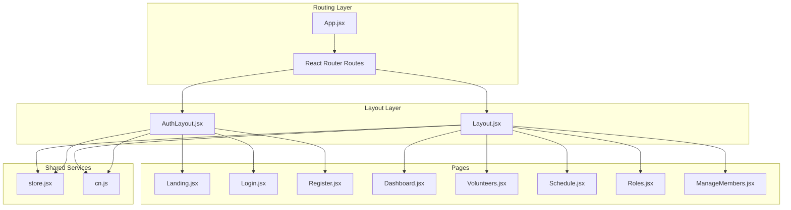
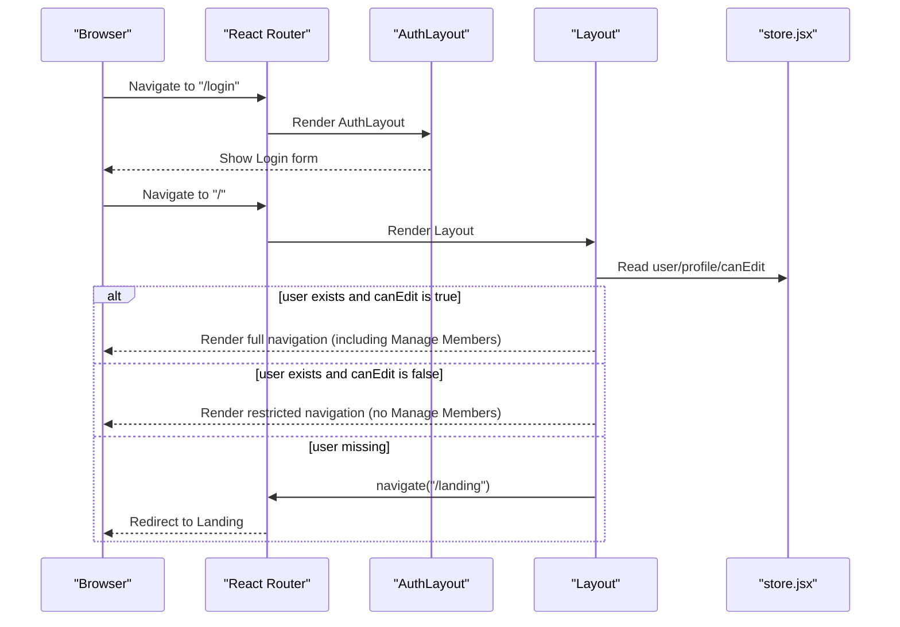
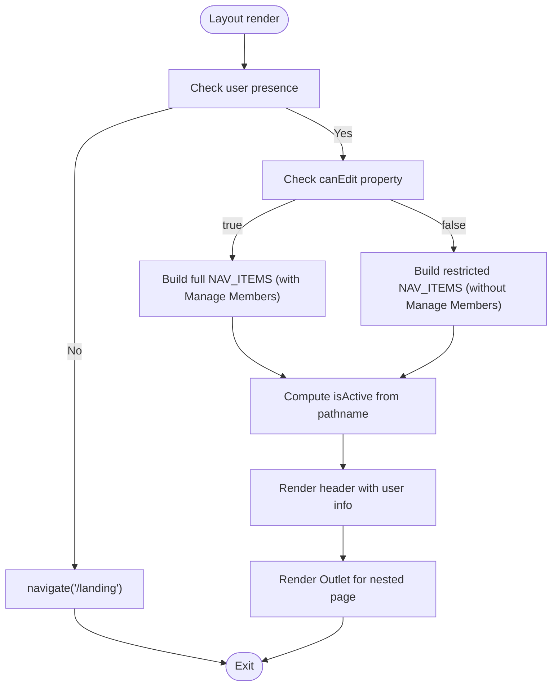
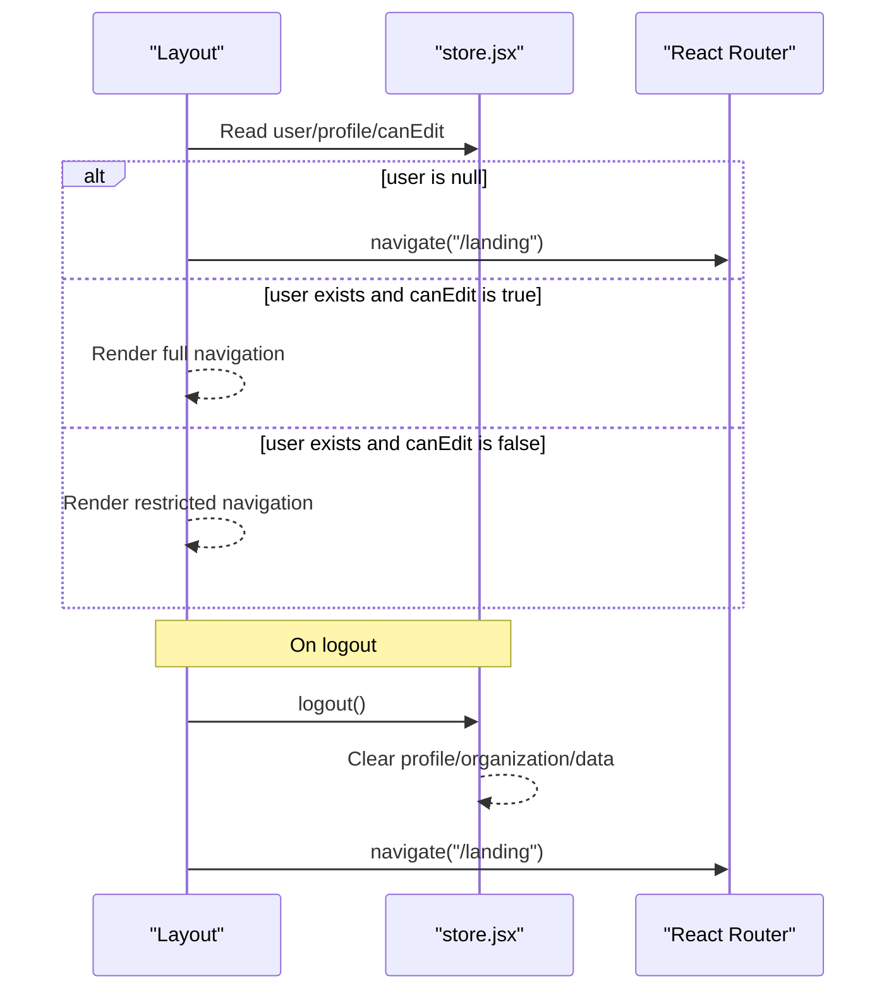
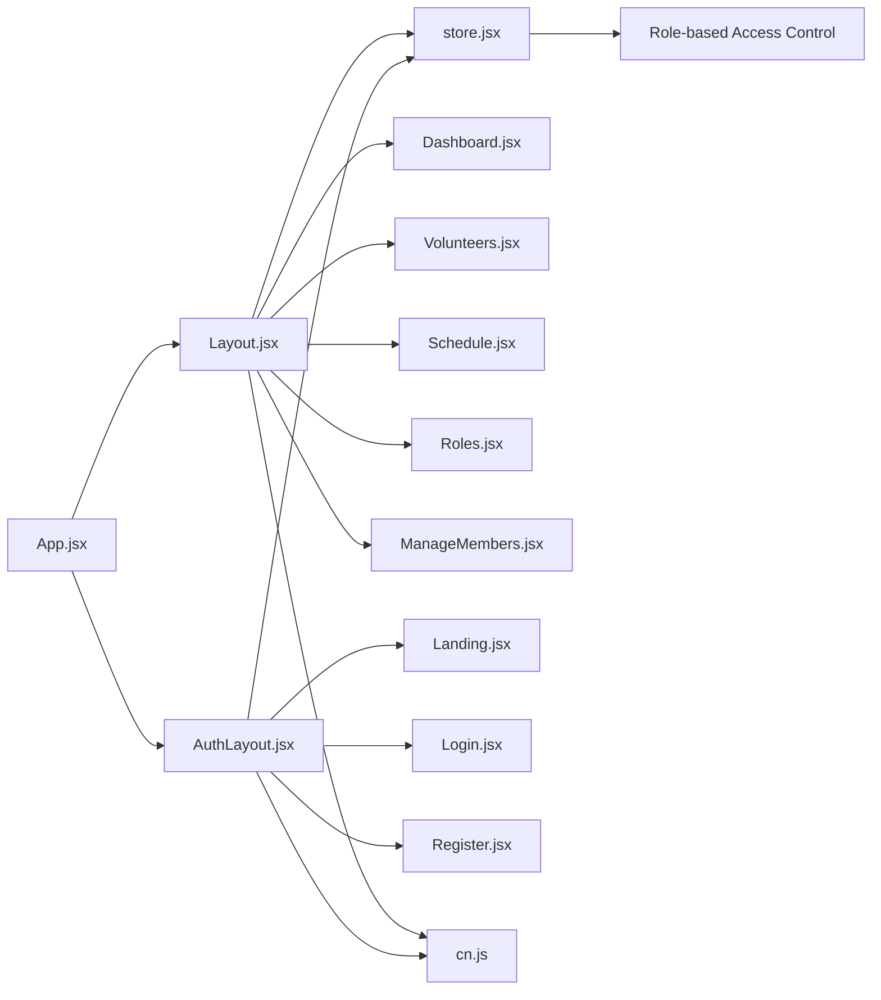

# Layout System

<cite>
**Referenced Files in This Document**
- [Layout.jsx](file://src/components/Layout.jsx)
- [AuthLayout.jsx](file://src/components/AuthLayout.jsx)
- [cn.js](file://src/utils/cn.js)
- [App.jsx](file://src/App.jsx)
- [store.jsx](file://src/services/store.jsx)
- [Dashboard.jsx](file://src/pages/Dashboard.jsx)
- [Landing.jsx](file://src/pages/Landing.jsx)
- [Login.jsx](file://src/pages/Login.jsx)
- [Register.jsx](file://src/pages/Register.jsx)
- [Volunteers.jsx](file://src/pages/Volunteers.jsx)
- [Schedule.jsx](file://src/pages/Schedule.jsx)
- [Roles.jsx](file://src/pages/Roles.jsx)
- [ManageMembers.jsx](file://src/pages/ManageMembers.jsx)
- [index.css](file://src/index.css)
- [tailwind.config.js](file://tailwind.config.js)
</cite>

## Update Summary
**Changes Made**
- Updated navigation filtering section to document role-based menu item visibility
- Added documentation for the `canEdit` property and its role in determining navigation access
- Enhanced security model documentation to explain admin vs team member permissions
- Updated component composition patterns to reflect role-aware navigation
- Added examples for extending navigation with role-based access control

## Table of Contents
1. [Introduction](#introduction)
2. [Project Structure](#project-structure)
3. [Core Components](#core-components)
4. [Architecture Overview](#architecture-overview)
5. [Detailed Component Analysis](#detailed-component-analysis)
6. [Dependency Analysis](#dependency-analysis)
7. [Performance Considerations](#performance-considerations)
8. [Troubleshooting Guide](#troubleshooting-guide)
9. [Conclusion](#conclusion)
10. [Appendices](#appendices)

## Introduction
This document explains RosterFlow's layout system architecture with a focus on:
- The main Layout component structure, including sidebar navigation, header, and responsive design
- Dynamic navigation filtering based on user roles with administrative users seeing full access and team members seeing restricted navigation
- The navigation items array and how routes are dynamically matched for active states
- The AuthLayout component for authentication-required pages and its role in redirecting unauthenticated users
- Component composition patterns, prop handling, and integration with React Router
- Styling approaches using Tailwind CSS and the cn utility function
- Mobile responsiveness, accessibility features, and user session management
- Practical examples for extending the layout system and customizing navigation with role-based access control

## Project Structure
RosterFlow organizes layout-related code under src/components and integrates with routing in src/App.jsx. Pages are located under src/pages and share a common store for authentication, data, and role-based access control.

**Diagram sources**
- [App.jsx:1-43](file://src/App.jsx#L1-L43)
- [AuthLayout.jsx:1-26](file://src/components/AuthLayout.jsx#L1-L26)
- [Layout.jsx:1-129](file://src/components/Layout.jsx#L1-L129)
- [store.jsx:1-1279](file://src/services/store.jsx#L1-L1279)
- [cn.js:1-7](file://src/utils/cn.js#L1-L7)

**Section sources**
- [App.jsx:1-43](file://src/App.jsx#L1-L43)

## Core Components
- Layout.jsx: Provides the main application shell with a persistent sidebar, header, and outlet for routed pages. It dynamically filters navigation items based on user roles using the `canEdit` property and manages logout.
- AuthLayout.jsx: Wraps authentication pages (Landing, Login, Register) with a minimal header and footer, ensuring non-authenticated users see the auth flow.
- cn utility: Merges Tailwind classes safely using clsx and tailwind-merge to avoid conflicts.
- store.jsx: Centralized authentication and data store, exposing user, organization, role-based access control properties like `canEdit`, and actions like logout.

Key responsibilities:
- Navigation: NAV_ITEMS defines sidebar entries; active state is computed from the current pathname; navigation items are dynamically filtered based on user roles.
- Role-based Access Control: The `canEdit` property determines whether administrative features are visible to users.
- Routing: React Router nests AuthLayout and Layout around their respective pages.
- Styling: Tailwind utilities and cn compose styles consistently.
- Session: Layout redirects to landing when user is missing; store manages auth state and data.

**Section sources**
- [Layout.jsx:7-20](file://src/components/Layout.jsx#L7-L20)
- [Layout.jsx:12-20](file://src/components/Layout.jsx#L12-L20)
- [AuthLayout.jsx:1-26](file://src/components/AuthLayout.jsx#L1-L26)
- [cn.js:1-7](file://src/utils/cn.js#L1-L7)
- [store.jsx:1213-1229](file://src/services/store.jsx#L1213-L1229)
- [store.jsx:113-124](file://src/services/store.jsx#L113-L124)

## Architecture Overview
The layout system separates authenticated and unauthenticated flows with role-based access control. AuthLayout handles public pages, while Layout provides the admin shell with dynamic navigation filtering. Both rely on the shared store for user/session state, role determination, and use cn for consistent Tailwind class merging.

**Diagram sources**
- [App.jsx:17-40](file://src/App.jsx#L17-L40)
- [Layout.jsx:19-31](file://src/components/Layout.jsx#L19-L31)
- [store.jsx:1213-1229](file://src/services/store.jsx#L1213-L1229)

## Detailed Component Analysis

### Layout Component
Responsibilities:
- Dynamically filter NAV_ITEMS based on user role using the `canEdit` property
- Compute active state based on current pathname
- Provide header with user info and sign-out
- Render Outlet for nested pages
- Redirect to landing when user is absent

Implementation highlights:
- Uses Lucide icons for each nav item
- Active link styling uses cn to merge conditional classes
- Header displays current page label derived from NAV_ITEMS
- Logout triggers store.logout and navigates to landing
- **Updated**: Navigation items are conditionally rendered based on role-based access control

**Diagram sources**
- [Layout.jsx:12-20](file://src/components/Layout.jsx#L12-L20)
- [Layout.jsx:7-12](file://src/components/Layout.jsx#L7-L12)

**Section sources**
- [Layout.jsx:7-20](file://src/components/Layout.jsx#L7-L20)
- [Layout.jsx:12-20](file://src/components/Layout.jsx#L12-L20)

### AuthLayout Component
Responsibilities:
- Provide a branded header and footer
- Center content in a responsive container
- Expose Outlet for auth pages

Integration:
- Nested under Routes as a child route wrapper
- Used for Landing, Login, and Register

**Section sources**
- [AuthLayout.jsx:1-26](file://src/components/AuthLayout.jsx#L1-L26)
- [App.jsx:24-27](file://src/App.jsx#L24-L27)

### Role-Based Navigation Filtering
**Updated**: The navigation system now implements dynamic filtering based on user roles:

- **Administrative Users** (`canEdit = true`): See full navigation including "Manage Members"
- **Team Members** (`canEdit = false`): See restricted navigation without "Manage Members"
- **Dynamic Rendering**: Uses JavaScript spread operator to conditionally include navigation items
- **Access Control Logic**: Controlled by `canEdit` property from the store

Implementation details:
- `canEdit` is calculated from `isAdmin` which considers both actual admin profiles and demo mode
- The "Manage Members" item is conditionally included using `(canEdit ? [...] : [])` syntax
- This approach maintains clean separation between admin and team member interfaces

**Section sources**
- [Layout.jsx:12-20](file://src/components/Layout.jsx#L12-L20)
- [store.jsx:1213-1229](file://src/services/store.jsx#L1213-L1229)

### Navigation Items and Active State Matching
- NAV_ITEMS is an array of objects with icon, label, and path
- Active state is determined by strict equality of location.pathname against item.path
- Styling toggles between active and hover states using cn
- **Updated**: Navigation items are now dynamically filtered based on user roles

Extensibility tips:
- Add new items to NAV_ITEMS with appropriate Lucide icon and path
- Ensure routes exist under Layout for the new path
- Keep label and path aligned with page semantics
- **Updated**: Consider role-based access when adding new navigation items

**Section sources**
- [Layout.jsx:12-20](file://src/components/Layout.jsx#L12-L20)
- [Layout.jsx:60-79](file://src/components/Layout.jsx#L60-L79)

### Auth-Protected Routing and Redirection
Behavior:
- Layout checks user presence on mount and navigates to landing if missing
- AuthLayout wraps public pages and does not enforce authentication checks itself
- On logout, store.logout clears session and data, and Layout redirects to landing
- **Updated**: Role-based access control affects which pages are accessible

**Diagram sources**
- [Layout.jsx:22-31](file://src/components/Layout.jsx#L22-L31)
- [store.jsx:1213-1229](file://src/services/store.jsx#L1213-L1229)

**Section sources**
- [Layout.jsx:22-31](file://src/components/Layout.jsx#L22-L31)
- [store.jsx:1213-1229](file://src/services/store.jsx#L1213-L1229)

### Component Composition and Prop Handling
- Layout composes Link for navigation and Outlet for page rendering
- AuthLayout composes Outlet for child pages
- Pages receive props via React Router and use store hooks for data/state
- cn merges Tailwind classes for consistent styling across components
- **Updated**: Components now receive role-based access control properties like `canEdit`

**Section sources**
- [Layout.jsx:60-79](file://src/components/Layout.jsx#L60-L79)
- [AuthLayout.jsx](file://src/components/AuthLayout.jsx#L14)
- [Dashboard.jsx:1-90](file://src/pages/Dashboard.jsx#L1-L90)
- [Volunteers.jsx:1-354](file://src/pages/Volunteers.jsx#L1-L354)
- [Schedule.jsx:1-731](file://src/pages/Schedule.jsx#L1-L731)
- [Roles.jsx:1-386](file://src/pages/Roles.jsx#L1-L386)
- [ManageMembers.jsx:1-133](file://src/pages/ManageMembers.jsx#L1-L133)

### Styling Approaches with Tailwind and cn
- Tailwind utilities define responsive layouts, spacing, colors, and shadows
- cn merges conditional classes safely, preventing conflicts from repeated utilities
- Responsive patterns use sm:, md:, lg: prefixes for breakpoints
- Gradients, shadows, and rounded corners are applied consistently

**Section sources**
- [Layout.jsx:43-125](file://src/components/Layout.jsx#L43-L125)
- [AuthLayout.jsx:4-23](file://src/components/AuthLayout.jsx#L4-L23)
- [cn.js:4-6](file://src/utils/cn.js#L4-L6)
- [index.css:1-10](file://src/index.css#L1-L10)
- [tailwind.config.js:1-51](file://tailwind.config.js#L1-L51)

### Mobile Responsiveness and Accessibility
- Mobile-first responsive classes: hidden sm: hides elements on small screens
- Sticky header ensures navigation remains usable while scrolling
- Accessible button and link semantics via native HTML elements
- Focus states and hover effects improve keyboard and pointer usability

**Section sources**
- [Layout.jsx:105-120](file://src/components/Layout.jsx#L105-L120)
- [Dashboard.jsx:6-19](file://src/pages/Dashboard.jsx#L6-L19)
- [Volunteers.jsx:124-157](file://src/pages/Volunteers.jsx#L124-L157)

### User Session Management and Role-Based Access Control
- Authentication state initialized from Supabase getSession and tracked via onAuthStateChange
- Profile and organization loaded when session.user exists
- Data loading runs in parallel for performance
- logout clears session, profile, organization, and local data
- **Updated**: Role-based access control with `canEdit` property
- **Updated**: `isAdmin` considers both actual admin profiles and demo mode
- **Updated**: `isTeamMember` distinguishes between different user types

**Section sources**
- [store.jsx:21-34](file://src/services/store.jsx#L21-L34)
- [store.jsx:37-52](file://src/services/store.jsx#L37-L52)
- [store.jsx:78-111](file://src/services/store.jsx#L78-L111)
- [store.jsx:119-124](file://src/services/store.jsx#L119-L124)
- [store.jsx:1213-1229](file://src/services/store.jsx#L1213-L1229)

### Extending the Layout System and Customizing Navigation
**Updated**: Examples for role-based navigation extension:

- Add a new navigation item with role-based access:
  - Extend NAV_ITEMS with icon, label, and path
  - Add a route under Layout for the new path
  - Create or reuse a page component for the route
  - Use `canEdit` prop to control visibility in the page component
  - Ensure routes exist under Layout for the new path
  - Keep label and path aligned with page semantics

- Customize active state styling:
  - Adjust cn conditions in the Link className to change active/hover styles

- Integrate new pages with role-based access:
  - Place page component under src/pages and export named function
  - Add route in App.jsx under Layout with the same path as NAV_ITEMS
  - Use `canEdit` prop to control feature visibility within the page

**Section sources**
- [Layout.jsx:12-20](file://src/components/Layout.jsx#L12-L20)
- [App.jsx:29-35](file://src/App.jsx#L29-L35)

## Dependency Analysis
The layout system exhibits clear separation of concerns with role-based access control:
- App.jsx orchestrates routing and providers the Store
- Layout and AuthLayout depend on React Router and the store
- Pages depend on the store for data and on Layout/AuthLayout for shell
- cn is a shared utility for class merging
- **Updated**: Role-based access control is centralized in the store

**Diagram sources**
- [App.jsx:1-43](file://src/App.jsx#L1-L43)
- [Layout.jsx:1-129](file://src/components/Layout.jsx#L1-L129)
- [AuthLayout.jsx:1-26](file://src/components/AuthLayout.jsx#L1-L26)
- [store.jsx:1-1279](file://src/services/store.jsx#L1-L1279)
- [cn.js:1-7](file://src/utils/cn.js#L1-L7)

**Section sources**
- [App.jsx:1-43](file://src/App.jsx#L1-L43)
- [Layout.jsx:1-129](file://src/components/Layout.jsx#L1-L129)
- [AuthLayout.jsx:1-26](file://src/components/AuthLayout.jsx#L1-L26)
- [store.jsx:1-1279](file://src/services/store.jsx#L1-L1279)
- [cn.js:1-7](file://src/utils/cn.js#L1-L7)

## Performance Considerations
- Parallel data loading in store.jsx reduces initialization latency
- Conditional rendering avoids unnecessary work when user is missing
- cn minimizes class conflicts and improves maintainability without runtime overhead
- Outlet-based rendering keeps layout lightweight and composable
- **Updated**: Role-based navigation filtering is computed efficiently during render

## Troubleshooting Guide
Common issues and resolutions:
- Unexpected redirect to landing:
  - Verify store session state and onAuthStateChange subscription
  - Confirm Layout's user check and navigation logic
- Active navigation not highlighting:
  - Ensure NAV_ITEMS paths match actual routes
  - Confirm pathname equality logic and trailing slashes
- Styling conflicts:
  - Use cn to merge classes instead of raw concatenation
  - Check Tailwind config for custom colors and utilities
- Logout not clearing state:
  - Confirm store.logout invokes Supabase signOut and clears local state
- **Updated**: Navigation items not appearing for certain users:
  - Verify user profile role in the database
  - Check that `canEdit` property is correctly calculated
  - Ensure role-based access control logic is functioning properly

**Section sources**
- [Layout.jsx:22-31](file://src/components/Layout.jsx#L22-L31)
- [store.jsx:1213-1229](file://src/services/store.jsx#L1213-L1229)
- [cn.js:4-6](file://src/utils/cn.js#L4-L6)

## Conclusion
RosterFlow's layout system cleanly separates authenticated and unauthenticated flows with sophisticated role-based access control. The Layout component provides a robust shell with responsive design, active state detection, dynamic navigation filtering, and consistent styling via cn. The role-based access control system ensures that administrative users see full functionality while team members see a restricted interface. Extending the system involves adding items to NAV_ITEMS, routes under Layout, corresponding page components with role-based access control, and leveraging the centralized store for authentication and authorization.

## Appendices

### Example: Adding a New Navigation Item with Role-Based Access
Steps:
- Add an object to NAV_ITEMS with icon, label, and path
- Add a route under Layout for the new path
- Create a page component under src/pages
- Use `canEdit` prop to control visibility within the page component
- Ensure the page renders inside Outlet

**Section sources**
- [Layout.jsx:12-20](file://src/components/Layout.jsx#L12-L20)
- [App.jsx:29-35](file://src/App.jsx#L29-L35)

### Example: Customizing Active State Styles
Adjust the cn condition inside the Link className to modify active and hover styles.

**Section sources**
- [Layout.jsx:68-73](file://src/components/Layout.jsx#L68-L73)

### Example: Integrating Auth Pages
Ensure AuthLayout wraps public routes and that Login and Register redirect to the main app after successful authentication.

**Section sources**
- [AuthLayout.jsx:1-26](file://src/components/AuthLayout.jsx#L1-L26)
- [Login.jsx:14-25](file://src/pages/Login.jsx#L14-L25)
- [Register.jsx:16-27](file://src/pages/Register.jsx#L16-L27)

### Example: Implementing Role-Based Feature Access
Steps for creating a new role-aware feature:
1. Add a new route under Layout in App.jsx
2. Create a page component that uses the `canEdit` prop from the store
3. Conditionally render features based on `canEdit` value
4. Add the corresponding navigation item to NAV_ITEMS with role-based filtering
5. Test both admin and team member access scenarios

**Section sources**
- [App.jsx:29-35](file://src/App.jsx#L29-L35)
- [store.jsx:1213-1229](file://src/services/store.jsx#L1213-L1229)
- [ManageMembers.jsx:9-24](file://src/pages/ManageMembers.jsx#L9-L24)