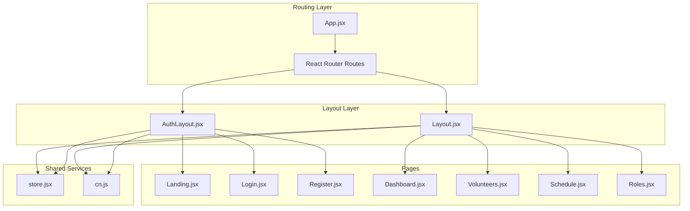
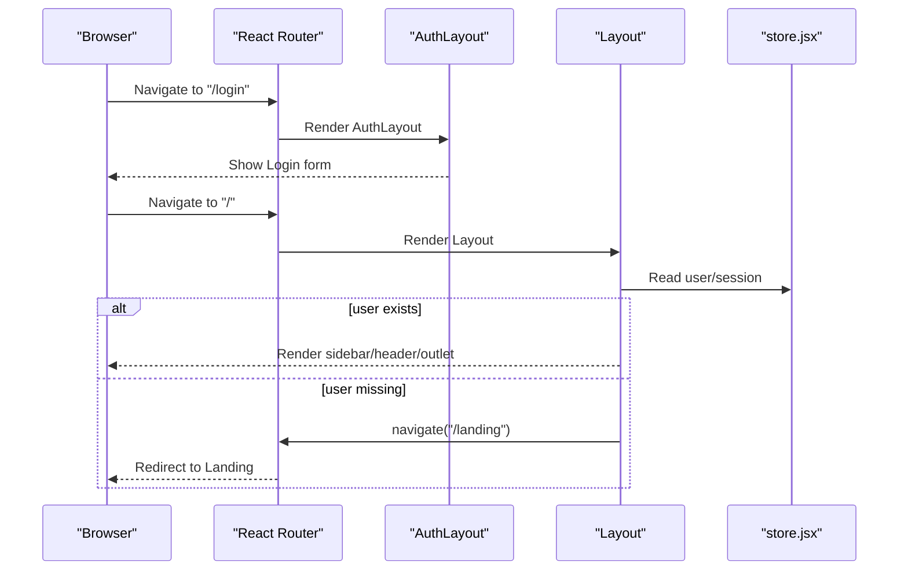
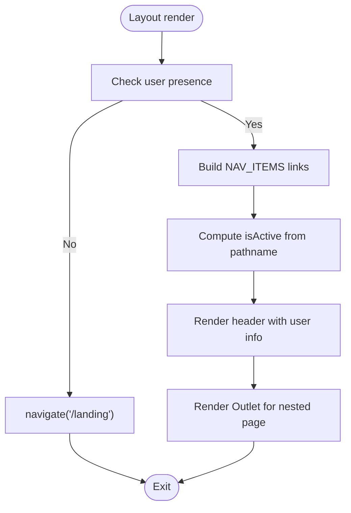
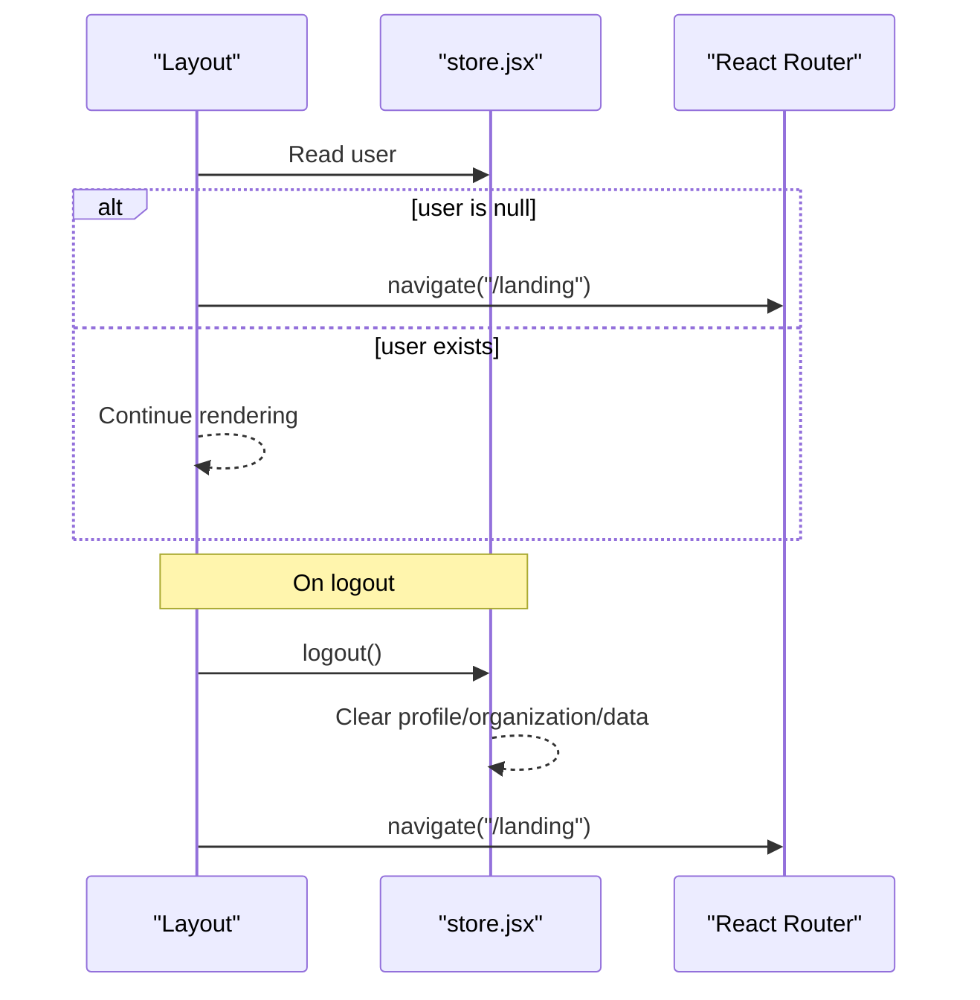
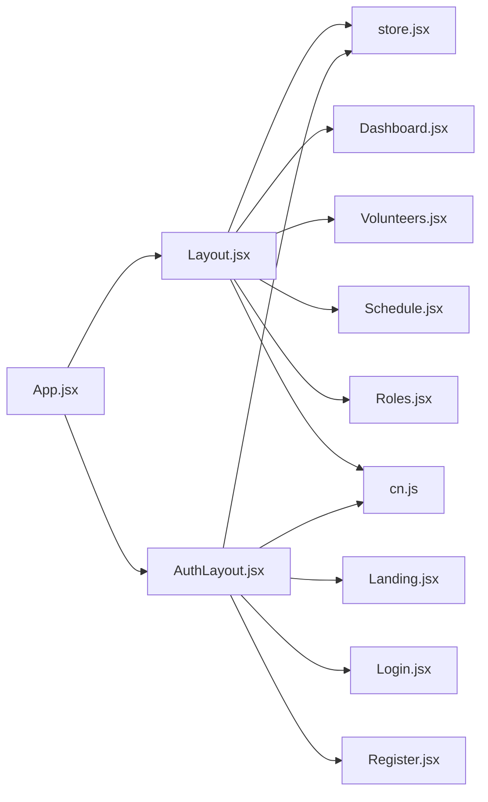

# Layout System

<cite>
**Referenced Files in This Document**
- [Layout.jsx](file://src/components/Layout.jsx)
- [AuthLayout.jsx](file://src/components/AuthLayout.jsx)
- [cn.js](file://src/utils/cn.js)
- [App.jsx](file://src/App.jsx)
- [store.jsx](file://src/services/store.jsx)
- [Dashboard.jsx](file://src/pages/Dashboard.jsx)
- [Landing.jsx](file://src/pages/Landing.jsx)
- [Login.jsx](file://src/pages/Login.jsx)
- [Register.jsx](file://src/pages/Register.jsx)
- [Volunteers.jsx](file://src/pages/Volunteers.jsx)
- [Schedule.jsx](file://src/pages/Schedule.jsx)
- [Roles.jsx](file://src/pages/Roles.jsx)
- [index.css](file://src/index.css)
- [tailwind.config.js](file://tailwind.config.js)
</cite>

## Table of Contents
1. [Introduction](#introduction)
2. [Project Structure](#project-structure)
3. [Core Components](#core-components)
4. [Architecture Overview](#architecture-overview)
5. [Detailed Component Analysis](#detailed-component-analysis)
6. [Dependency Analysis](#dependency-analysis)
7. [Performance Considerations](#performance-considerations)
8. [Troubleshooting Guide](#troubleshooting-guide)
9. [Conclusion](#conclusion)
10. [Appendices](#appendices)

## Introduction
This document explains RosterFlow’s layout system architecture with a focus on:
- The main Layout component structure, including sidebar navigation, header, and responsive design
- The navigation items array and dynamic route matching for active states
- The AuthLayout component for authentication-required pages and redirection behavior
- Component composition patterns, prop handling, and integration with React Router
- Styling approaches using Tailwind CSS and the cn utility
- Mobile responsiveness, accessibility features, and user session management
- Practical examples for extending the layout system and customizing navigation

## Project Structure
RosterFlow organizes layout-related code under src/components and integrates with routing in src/App.jsx. Pages are located under src/pages and share a common store for authentication and data.

**Diagram sources**
- [App.jsx](file://src/App.jsx#L1-L37)
- [AuthLayout.jsx](file://src/components/AuthLayout.jsx#L1-L29)
- [Layout.jsx](file://src/components/Layout.jsx#L1-L102)
- [store.jsx](file://src/services/store.jsx#L1-L472)
- [cn.js](file://src/utils/cn.js#L1-L7)

**Section sources**
- [App.jsx](file://src/App.jsx#L1-L37)

## Core Components
- Layout.jsx: Provides the main application shell with a persistent sidebar, header, and outlet for routed pages. It reads the current location to highlight active navigation items and manages logout.
- AuthLayout.jsx: Wraps authentication pages (Landing, Login, Register) with a minimal header and footer, ensuring non-authenticated users see the auth flow.
- cn utility: Merges Tailwind classes safely using clsx and tailwind-merge to avoid conflicts.
- store.jsx: Centralized authentication and data store, exposing user, organization, and actions like logout.

Key responsibilities:
- Navigation: NAV_ITEMS defines sidebar entries; active state is computed from the current pathname.
- Routing: React Router nests AuthLayout and Layout around their respective pages.
- Styling: Tailwind utilities and cn compose styles consistently.
- Session: Layout redirects to landing when user is missing; store manages auth state and data.

**Section sources**
- [Layout.jsx](file://src/components/Layout.jsx#L7-L12)
- [Layout.jsx](file://src/components/Layout.jsx#L14-L102)
- [AuthLayout.jsx](file://src/components/AuthLayout.jsx#L1-L29)
- [cn.js](file://src/utils/cn.js#L1-L7)
- [store.jsx](file://src/services/store.jsx#L424-L430)
- [store.jsx](file://src/services/store.jsx#L113-L124)

## Architecture Overview
The layout system separates authenticated and unauthenticated flows. AuthLayout handles public pages, while Layout provides the admin shell. Both rely on the shared store for user/session state and use cn for consistent Tailwind class merging.

**Diagram sources**
- [App.jsx](file://src/App.jsx#L17-L30)
- [Layout.jsx](file://src/components/Layout.jsx#L19-L25)
- [store.jsx](file://src/services/store.jsx#L424-L430)

## Detailed Component Analysis

### Layout Component
Responsibilities:
- Define NAV_ITEMS for sidebar navigation
- Compute active state based on current pathname
- Provide header with user info and sign-out
- Render Outlet for nested pages
- Redirect to landing when user is absent

Implementation highlights:
- Uses Lucide icons for each nav item
- Active link styling uses cn to merge conditional classes
- Header displays current page label derived from NAV_ITEMS
- Logout triggers store.logout and navigates to landing

**Diagram sources**
- [Layout.jsx](file://src/components/Layout.jsx#L14-L102)
- [Layout.jsx](file://src/components/Layout.jsx#L7-L12)

**Section sources**
- [Layout.jsx](file://src/components/Layout.jsx#L7-L12)
- [Layout.jsx](file://src/components/Layout.jsx#L14-L102)

### AuthLayout Component
Responsibilities:
- Provide a branded header and footer
- Center content in a responsive container
- Expose Outlet for auth pages

Integration:
- Nested under Routes as a child route wrapper
- Used for Landing, Login, and Register

**Section sources**
- [AuthLayout.jsx](file://src/components/AuthLayout.jsx#L1-L29)
- [App.jsx](file://src/App.jsx#L18-L22)

### Navigation Items and Active State Matching
- NAV_ITEMS is an array of objects with icon, label, and path
- Active state is determined by strict equality of location.pathname against item.path
- Styling toggles between active and hover states using cn

Extensibility tips:
- Add new items to NAV_ITEMS with appropriate Lucide icon and path
- Ensure routes exist under Layout for the new path
- Keep label and path aligned with page semantics

**Section sources**
- [Layout.jsx](file://src/components/Layout.jsx#L7-L12)
- [Layout.jsx](file://src/components/Layout.jsx#L43-L62)

### Auth-Protected Routing and Redirection
Behavior:
- Layout checks user presence on mount and navigates to landing if missing
- AuthLayout wraps public pages and does not enforce authentication checks itself
- On logout, store.logout clears session and data, and Layout redirects to landing

**Diagram sources**
- [Layout.jsx](file://src/components/Layout.jsx#L19-L30)
- [store.jsx](file://src/services/store.jsx#L119-L124)

**Section sources**
- [Layout.jsx](file://src/components/Layout.jsx#L19-L30)
- [store.jsx](file://src/services/store.jsx#L119-L124)

### Component Composition and Prop Handling
- Layout composes Link for navigation and Outlet for page rendering
- AuthLayout composes Outlet for child pages
- Pages receive props via React Router and use store hooks for data/state
- cn merges Tailwind classes for consistent styling across components

**Section sources**
- [Layout.jsx](file://src/components/Layout.jsx#L48-L60)
- [AuthLayout.jsx](file://src/components/AuthLayout.jsx#L19)
- [Dashboard.jsx](file://src/pages/Dashboard.jsx#L1-L90)
- [Volunteers.jsx](file://src/pages/Volunteers.jsx#L1-L354)
- [Schedule.jsx](file://src/pages/Schedule.jsx#L1-L731)
- [Roles.jsx](file://src/pages/Roles.jsx#L1-L386)

### Styling Approaches with Tailwind and cn
- Tailwind utilities define responsive layouts, spacing, colors, and shadows
- cn merges conditional classes safely, preventing conflicts from repeated utilities
- Responsive patterns use sm:, md:, lg: prefixes for breakpoints
- Gradients, shadows, and rounded corners are applied consistently

**Section sources**
- [Layout.jsx](file://src/components/Layout.jsx#L33-L100)
- [AuthLayout.jsx](file://src/components/AuthLayout.jsx#L7-L26)
- [cn.js](file://src/utils/cn.js#L4-L6)
- [index.css](file://src/index.css#L1-L10)
- [tailwind.config.js](file://tailwind.config.js#L1-L51)

### Mobile Responsiveness and Accessibility
- Mobile-first responsive classes: hidden sm: hides elements on small screens
- Sticky header ensures navigation remains usable while scrolling
- Accessible button and link semantics via native HTML elements
- Focus states and hover effects improve keyboard and pointer usability

**Section sources**
- [Layout.jsx](file://src/components/Layout.jsx#L84-L92)
- [Dashboard.jsx](file://src/pages/Dashboard.jsx#L6-L19)
- [Volunteers.jsx](file://src/pages/Volunteers.jsx#L124-L157)

### User Session Management
- Authentication state initialized from Supabase getSession and tracked via onAuthStateChange
- Profile and organization loaded when session.user exists
- Data loading runs in parallel for performance
- logout clears session, profile, organization, and local data

**Section sources**
- [store.jsx](file://src/services/store.jsx#L21-L34)
- [store.jsx](file://src/services/store.jsx#L37-L52)
- [store.jsx](file://src/services/store.jsx#L78-L111)
- [store.jsx](file://src/services/store.jsx#L119-L124)

### Extending the Layout System and Customizing Navigation
Examples:
- Add a new navigation item:
  - Extend NAV_ITEMS with icon, label, and path
  - Add a route under Layout for the new path
  - Create or reuse a page component for the route
- Customize active state styling:
  - Adjust cn conditions in the Link className to change active/hover styles
- Integrate new pages:
  - Place page component under src/pages and export named function
  - Add route in App.jsx under Layout with the same path as NAV_ITEMS

**Section sources**
- [Layout.jsx](file://src/components/Layout.jsx#L7-L12)
- [App.jsx](file://src/App.jsx#L24-L29)

## Dependency Analysis
The layout system exhibits clear separation of concerns:
- App.jsx orchestrates routing and providers the Store
- Layout and AuthLayout depend on React Router and the store
- Pages depend on the store for data and on Layout/AuthLayout for shell
- cn is a shared utility for class merging

**Diagram sources**
- [App.jsx](file://src/App.jsx#L1-L37)
- [Layout.jsx](file://src/components/Layout.jsx#L1-L102)
- [AuthLayout.jsx](file://src/components/AuthLayout.jsx#L1-L29)
- [store.jsx](file://src/services/store.jsx#L1-L472)
- [cn.js](file://src/utils/cn.js#L1-L7)

**Section sources**
- [App.jsx](file://src/App.jsx#L1-L37)
- [Layout.jsx](file://src/components/Layout.jsx#L1-L102)
- [AuthLayout.jsx](file://src/components/AuthLayout.jsx#L1-L29)
- [store.jsx](file://src/services/store.jsx#L1-L472)
- [cn.js](file://src/utils/cn.js#L1-L7)

## Performance Considerations
- Parallel data loading in store.jsx reduces initialization latency
- Conditional rendering avoids unnecessary work when user is missing
- cn minimizes class conflicts and improves maintainability without runtime overhead
- Outlet-based rendering keeps layout lightweight and composable

[No sources needed since this section provides general guidance]

## Troubleshooting Guide
Common issues and resolutions:
- Unexpected redirect to landing:
  - Verify store session state and onAuthStateChange subscription
  - Confirm Layout’s user check and navigation logic
- Active navigation not highlighting:
  - Ensure NAV_ITEMS paths match actual routes
  - Confirm pathname equality logic and trailing slashes
- Styling conflicts:
  - Use cn to merge classes instead of raw concatenation
  - Check Tailwind config for custom colors and utilities
- Logout not clearing state:
  - Confirm store.logout invokes Supabase signOut and clears local state

**Section sources**
- [Layout.jsx](file://src/components/Layout.jsx#L19-L30)
- [store.jsx](file://src/services/store.jsx#L119-L124)
- [cn.js](file://src/utils/cn.js#L4-L6)

## Conclusion
RosterFlow’s layout system cleanly separates authenticated and unauthenticated flows, leverages React Router for navigation, and uses a shared store for session and data management. The Layout component provides a robust shell with responsive design, active state detection, and consistent styling via cn. Extending the system involves adding items to NAV_ITEMS, routes under Layout, and corresponding page components.

[No sources needed since this section summarizes without analyzing specific files]

## Appendices

### Example: Adding a New Navigation Item
Steps:
- Add an object to NAV_ITEMS with icon, label, and path
- Add a route under Layout for the new path
- Create a page component under src/pages
- Ensure the page renders inside Outlet

**Section sources**
- [Layout.jsx](file://src/components/Layout.jsx#L7-L12)
- [App.jsx](file://src/App.jsx#L24-L29)

### Example: Customizing Active State Styles
Adjust the cn condition inside the Link className to modify active and hover styles.

**Section sources**
- [Layout.jsx](file://src/components/Layout.jsx#L51-L56)

### Example: Integrating Auth Pages
Ensure AuthLayout wraps public routes and that Login and Register redirect to the main app after successful authentication.

**Section sources**
- [AuthLayout.jsx](file://src/components/AuthLayout.jsx#L1-L29)
- [Login.jsx](file://src/pages/Login.jsx#L14-L25)
- [Register.jsx](file://src/pages/Register.jsx#L16-L27)