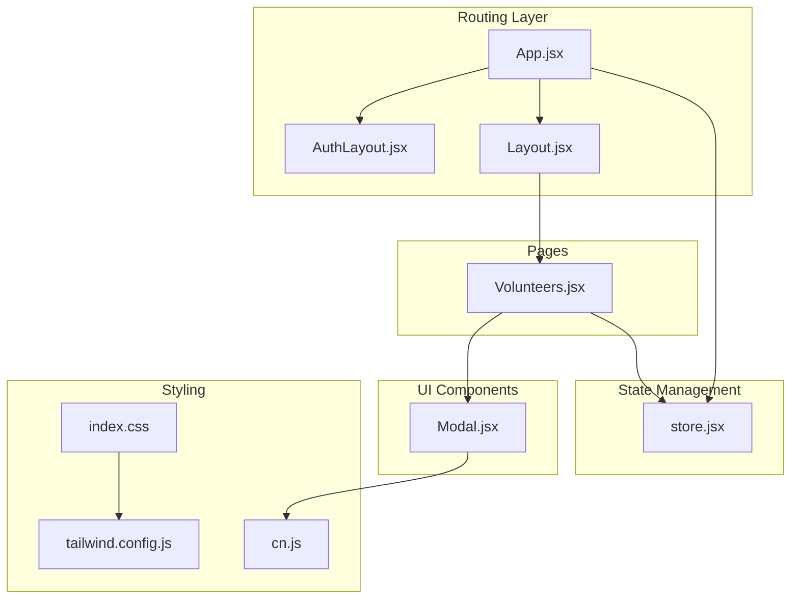
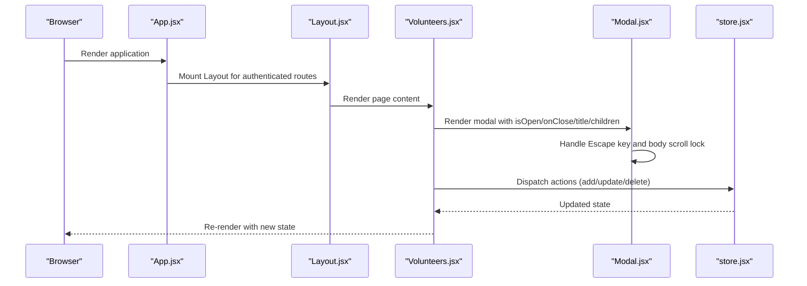
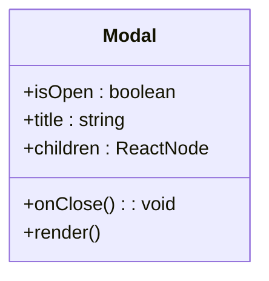
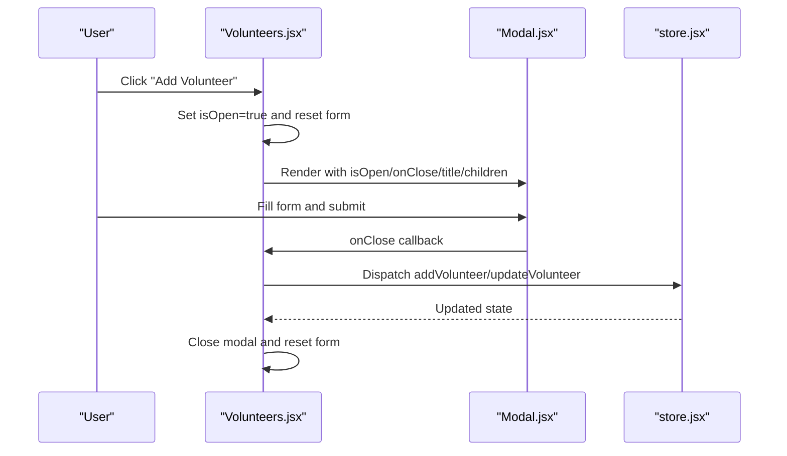
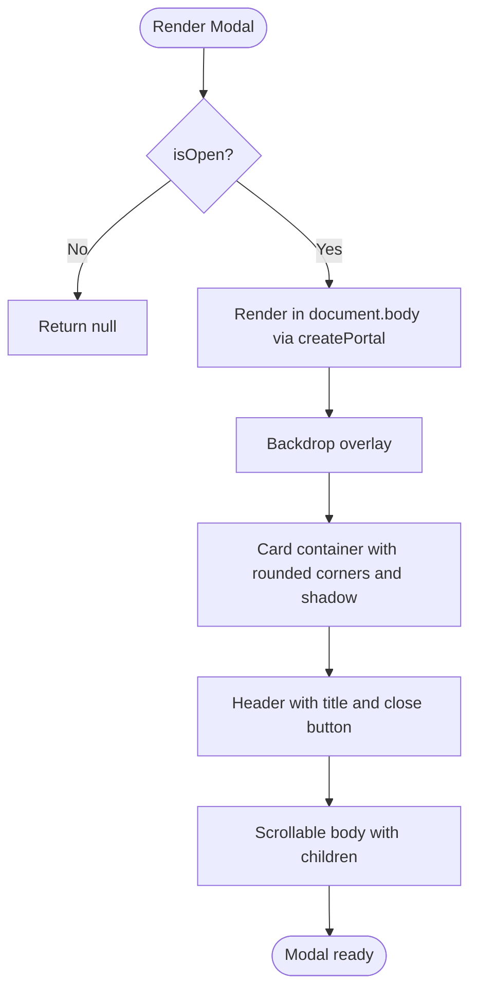
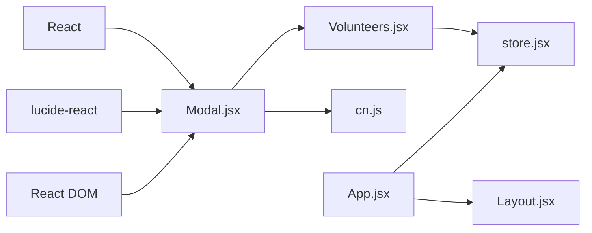

# Reusable UI Components

<cite>
**Referenced Files in This Document**
- [Modal.jsx](file://src/components/Modal.jsx)
- [Layout.jsx](file://src/components/Layout.jsx)
- [App.jsx](file://src/App.jsx)
- [store.jsx](file://src/services/store.jsx)
- [Volunteers.jsx](file://src/pages/Volunteers.jsx)
- [AuthLayout.jsx](file://src/components/AuthLayout.jsx)
- [cn.js](file://src/utils/cn.js)
- [index.css](file://src/index.css)
- [tailwind.config.js](file://tailwind.config.js)
- [package.json](file://package.json)
</cite>

## Table of Contents
1. [Introduction](#introduction)
2. [Project Structure](#project-structure)
3. [Core Components](#core-components)
4. [Architecture Overview](#architecture-overview)
5. [Detailed Component Analysis](#detailed-component-analysis)
6. [Dependency Analysis](#dependency-analysis)
7. [Performance Considerations](#performance-considerations)
8. [Troubleshooting Guide](#troubleshooting-guide)
9. [Conclusion](#conclusion)
10. [Appendices](#appendices)

## Introduction
This document focuses on RosterFlow’s reusable UI components, with a primary emphasis on the Modal component. It explains the component’s props interface, event handlers, rendering patterns, and integration with the application’s layout and state management. Accessibility features, keyboard navigation, and focus management are covered alongside practical usage examples across different modal configurations and content types. Styling approaches, animations, and responsive behavior are documented, along with guidelines for extending the modal and creating similar reusable components throughout the application.

## Project Structure
RosterFlow is a React application structured around a clear separation of concerns:
- Components: Reusable UI building blocks such as Modal, Layout, and AuthLayout
- Pages: Feature-driven views that orchestrate state and render components
- Services: Centralized state and data management via a React Context provider
- Utilities: Utility helpers for class merging and styling
- Styling: Tailwind CSS with a custom color palette and global base styles

**Diagram sources**
- [App.jsx](file://src/App.jsx#L1-L37)
- [AuthLayout.jsx](file://src/components/AuthLayout.jsx#L1-L26)
- [Layout.jsx](file://src/components/Layout.jsx#L1-L108)
- [store.jsx](file://src/services/store.jsx#L1-L472)
- [Modal.jsx](file://src/components/Modal.jsx#L1-L50)
- [Volunteers.jsx](file://src/pages/Volunteers.jsx#L1-L354)
- [tailwind.config.js](file://tailwind.config.js#L1-L51)
- [index.css](file://src/index.css#L1-L10)
- [cn.js](file://src/utils/cn.js#L1-L7)

**Section sources**
- [App.jsx](file://src/App.jsx#L1-L37)
- [Layout.jsx](file://src/components/Layout.jsx#L1-L108)
- [store.jsx](file://src/services/store.jsx#L1-L472)
- [Modal.jsx](file://src/components/Modal.jsx#L1-L50)
- [Volunteers.jsx](file://src/pages/Volunteers.jsx#L1-L354)
- [tailwind.config.js](file://tailwind.config.js#L1-L51)
- [index.css](file://src/index.css#L1-L10)
- [cn.js](file://src/utils/cn.js#L1-L7)

## Core Components
This section introduces the Modal component and its role in the application’s UI ecosystem.

- Modal: A reusable overlay dialog that renders content in a portal, manages escape-key closing, and prevents background scrolling while open.
- Layout: The main application shell that provides navigation, header, and outlet rendering for routed pages.
- AuthLayout: A minimal layout for authentication routes with centered content and branding.
- Store: A centralized React Context provider that supplies authentication state, organization data, and CRUD actions for application entities.

Key integration points:
- Modal is used inside pages (e.g., Volunteers) to present forms and confirmations.
- Layout wraps pages and provides the main app container.
- Store provides state and actions consumed by pages and components.

**Section sources**
- [Modal.jsx](file://src/components/Modal.jsx#L1-L50)
- [Layout.jsx](file://src/components/Layout.jsx#L1-L108)
- [AuthLayout.jsx](file://src/components/AuthLayout.jsx#L1-L26)
- [store.jsx](file://src/services/store.jsx#L1-L472)

## Architecture Overview
The application follows a layered architecture:
- Routing layer: App defines routes and wraps pages with either AuthLayout or Layout.
- State layer: StoreProvider exposes a rich context with authentication and data operations.
- UI layer: Components like Modal encapsulate presentation and interaction patterns.
- Pages: Compose components and state to deliver feature screens.

**Diagram sources**
- [App.jsx](file://src/App.jsx#L1-L37)
- [Layout.jsx](file://src/components/Layout.jsx#L1-L108)
- [Volunteers.jsx](file://src/pages/Volunteers.jsx#L1-L354)
- [Modal.jsx](file://src/components/Modal.jsx#L1-L50)
- [store.jsx](file://src/services/store.jsx#L1-L472)

## Detailed Component Analysis

### Modal Component
The Modal component is a focused, reusable overlay dialog designed for flexible content and straightforward lifecycle management.

- Props interface:
  - isOpen: Boolean controlling visibility
  - onClose: Callback invoked when the modal should close (Escape key or backdrop click)
  - title: String displayed in the modal header
  - children: React nodes rendered in the modal body

- Rendering pattern:
  - Conditionally renders nothing when closed
  - Renders a backdrop overlay and a centered card using React.createPortal into document.body
  - Uses Tailwind classes for layout, spacing, shadows, and responsive constraints

- Event handlers and lifecycle:
  - Adds a keydown listener for Escape when opened
  - Prevents background scrolling by setting body overflow to hidden
  - Removes listeners and restores body overflow on unmount
  - Closes on backdrop click and on the close button

- Accessibility and focus management:
  - The component does not programmatically manage focus trapping or focus restoration
  - Focus remains on the trigger element or the last focused element outside the modal
  - Keyboard navigation relies on Escape key handling

- Styling and animations:
  - Backdrop uses a semi-transparent overlay with blur effect
  - Modal card includes rounded corners, max-width constraint, and vertical scroll for content
  - Transition classes animate opacity and transforms for smooth appearance

- Responsive behavior:
  - Full viewport coverage with centering
  - Max-height constraint and scrollable content area for tall modals
  - Padding adapts to small screens

- Usage examples:
  - Form modal for adding/editing volunteers
  - Confirmation dialogs
  - Informational overlays

- Extensibility guidelines:
  - Add optional props for size variants, close-on-backdrop, or custom transitions
  - Introduce focus trap utilities for improved accessibility
  - Support aria-labelledby and aria-describedby for screen readers

**Diagram sources**
- [Modal.jsx](file://src/components/Modal.jsx#L5-L49)

**Section sources**
- [Modal.jsx](file://src/components/Modal.jsx#L1-L50)

### Modal Integration with Layout and State
The Modal integrates seamlessly with the application’s routing and state layers.

- Routing integration:
  - App.jsx defines routes and wraps pages with AuthLayout or Layout
  - Layout provides the main shell and outlet for page rendering

- State integration:
  - Pages consume the Store context to access data and dispatch actions
  - Modal content often renders forms that submit to Store actions

- Example usage in Volunteers:
  - State variables control modal visibility and form data
  - Modal receives isOpen, onClose, title, and a form as children
  - Submitting the form triggers Store actions and closes the modal

**Diagram sources**
- [Volunteers.jsx](file://src/pages/Volunteers.jsx#L1-L354)
- [Modal.jsx](file://src/components/Modal.jsx#L1-L50)
- [store.jsx](file://src/services/store.jsx#L1-L472)

**Section sources**
- [App.jsx](file://src/App.jsx#L1-L37)
- [Layout.jsx](file://src/components/Layout.jsx#L1-L108)
- [Volunteers.jsx](file://src/pages/Volunteers.jsx#L1-L354)
- [store.jsx](file://src/services/store.jsx#L1-L472)

### Accessibility, Keyboard Navigation, and Focus Management
- Keyboard navigation:
  - Escape key closes the modal
  - Backdrop click closes the modal
- Focus management:
  - No programmatic focus trap is implemented
  - Consider adding focus trap utilities to ensure focus stays within the modal while open
- Screen reader support:
  - Consider adding aria-labelledby and aria-describedby attributes to the modal container
  - Announce title changes when switching between edit and add modes

**Section sources**
- [Modal.jsx](file://src/components/Modal.jsx#L6-L20)

### Styling Approaches, Animations, and Responsive Behavior
- Styling approach:
  - Tailwind utility classes define layout, colors, spacing, and responsive breakpoints
  - A custom color palette is configured in tailwind.config.js
- Animations:
  - Transition classes provide subtle entrance/exit effects
  - Backdrop uses transition-opacity for fade-in/fade-out
- Responsive behavior:
  - Full-viewport overlay with centering
  - Max-height constraint and scrollable content area
  - Padding adjustments for mobile devices

**Diagram sources**
- [Modal.jsx](file://src/components/Modal.jsx#L24-L48)

**Section sources**
- [tailwind.config.js](file://tailwind.config.js#L1-L51)
- [index.css](file://src/index.css#L1-L10)
- [cn.js](file://src/utils/cn.js#L1-L7)
- [Modal.jsx](file://src/components/Modal.jsx#L24-L48)

### Usage Examples and Interaction Patterns
- Adding a volunteer:
  - Open modal, fill form, submit, and close automatically
- Editing a volunteer:
  - Prepopulate form with selected volunteer data, submit to update, then close
- Confirmation dialogs:
  - Pass a message and action buttons as children, close on cancel or confirm

These patterns demonstrate how Modal composes with page state and Store actions to provide cohesive user experiences.

**Section sources**
- [Volunteers.jsx](file://src/pages/Volunteers.jsx#L247-L350)
- [store.jsx](file://src/services/store.jsx#L162-L242)

### Guidelines for Extending the Modal Component
- Add optional props:
  - size: small/medium/large/max
  - closeOnBackdrop: boolean
  - closeOnEsc: boolean
  - className: string for additional styling
- Enhance accessibility:
  - Implement focus trap and restore focus on close
  - Add aria-modal and aria-labelledby/aria-describedby
- Improve UX:
  - Add loading states and disabled submit buttons during async operations
  - Support keyboard shortcuts beyond Escape (e.g., Enter to confirm)
- Animation improvements:
  - Add slide-in/out or scale transitions
  - Allow custom transition durations and easing

[No sources needed since this section provides general guidance]

## Dependency Analysis
The Modal component depends on:
- React for hooks and rendering
- lucide-react for the close icon
- React DOM for portal rendering

Integration dependencies:
- Volunteering page imports Modal and passes state and callbacks
- Store context is consumed by pages to drive modal content and actions
- Tailwind utilities and cn helper are used for styling

**Diagram sources**
- [Modal.jsx](file://src/components/Modal.jsx#L1-L3)
- [Volunteers.jsx](file://src/pages/Volunteers.jsx#L1-L5)
- [store.jsx](file://src/services/store.jsx#L1-L472)
- [cn.js](file://src/utils/cn.js#L1-L7)
- [App.jsx](file://src/App.jsx#L1-L37)
- [Layout.jsx](file://src/components/Layout.jsx#L1-L108)

**Section sources**
- [Modal.jsx](file://src/components/Modal.jsx#L1-L50)
- [Volunteers.jsx](file://src/pages/Volunteers.jsx#L1-L5)
- [store.jsx](file://src/services/store.jsx#L1-L472)
- [package.json](file://package.json#L15-L24)

## Performance Considerations
- Portal rendering:
  - Using createPortal avoids unnecessary DOM nesting and keeps modal content at the root level
- Conditional rendering:
  - Returning null when closed minimizes DOM overhead
- Scroll lock:
  - Setting body overflow to hidden prevents background scroll during modal open
- CSS transitions:
  - Keep transition durations reasonable to avoid jank on low-end devices
- Responsive constraints:
  - Max-height and overflow-y reduce layout thrashing on small screens

[No sources needed since this section provides general guidance]

## Troubleshooting Guide
Common issues and resolutions:
- Modal does not close on Escape:
  - Ensure isOpen is controlled and onClose is passed correctly
  - Verify that the keydown listener is attached when isOpen is true
- Background continues to scroll:
  - Confirm that body overflow is restored when the component unmounts
- Modal content not visible:
  - Check that the portal target (document.body) is available
  - Ensure the modal is rendered conditionally based on isOpen
- Focus management:
  - Consider adding a focus trap library to keep focus within the modal
- Styling conflicts:
  - Use Tailwind utilities consistently and avoid overriding styles inline

**Section sources**
- [Modal.jsx](file://src/components/Modal.jsx#L6-L20)

## Conclusion
The Modal component exemplifies a clean, reusable pattern for overlay dialogs in RosterFlow. It integrates smoothly with the routing and state layers, supports keyboard navigation, and leverages Tailwind for responsive styling. By following the extension guidelines and accessibility recommendations, teams can evolve the Modal into a robust foundation for diverse UI interactions while maintaining consistency across the application.

## Appendices
- Additional resources:
  - Tailwind configuration and color tokens
  - Global base styles and layer composition
  - Package dependencies for UI libraries and utilities

**Section sources**
- [tailwind.config.js](file://tailwind.config.js#L1-L51)
- [index.css](file://src/index.css#L1-L10)
- [package.json](file://package.json#L15-L24)