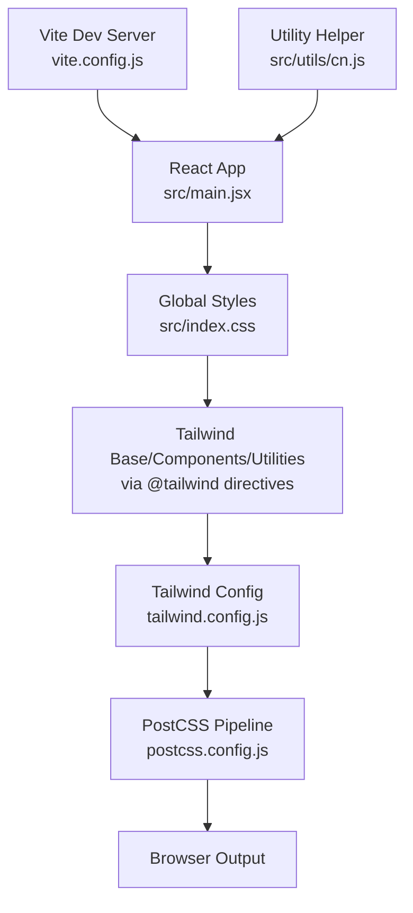
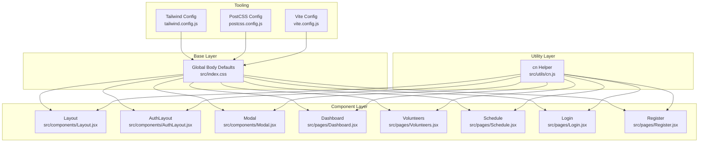
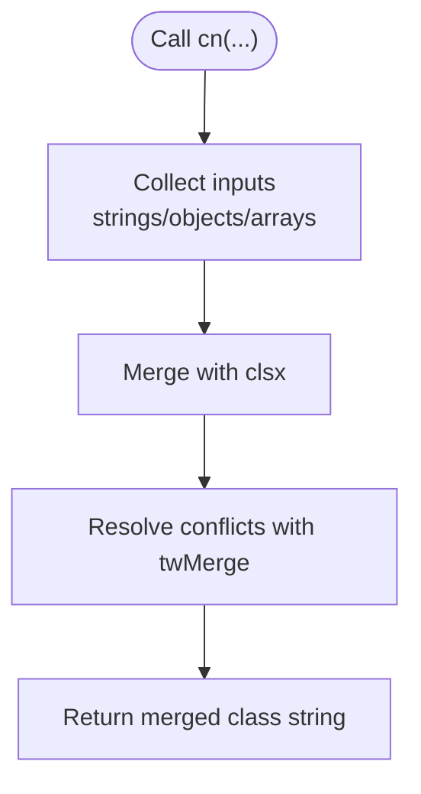
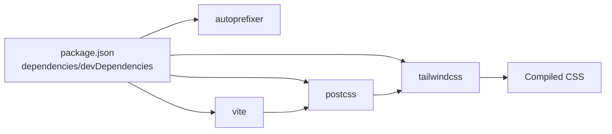

# Styling System & Design Patterns

<cite>
**Referenced Files in This Document**
- [tailwind.config.js](file://tailwind.config.js)
- [src/index.css](file://src/index.css)
- [postcss.config.js](file://postcss.config.js)
- [vite.config.js](file://vite.config.js)
- [package.json](file://package.json)
- [src/utils/cn.js](file://src/utils/cn.js)
- [src/components/Layout.jsx](file://src/components/Layout.jsx)
- [src/components/AuthLayout.jsx](file://src/components/AuthLayout.jsx)
- [src/components/Modal.jsx](file://src/components/Modal.jsx)
- [src/pages/Dashboard.jsx](file://src/pages/Dashboard.jsx)
- [src/pages/Login.jsx](file://src/pages/Login.jsx)
- [src/pages/Register.jsx](file://src/pages/Register.jsx)
- [src/pages/Volunteers.jsx](file://src/pages/Volunteers.jsx)
- [src/pages/Schedule.jsx](file://src/pages/Schedule.jsx)
</cite>

## Table of Contents
1. [Introduction](#introduction)
2. [Project Structure](#project-structure)
3. [Core Components](#core-components)
4. [Architecture Overview](#architecture-overview)
5. [Detailed Component Analysis](#detailed-component-analysis)
6. [Dependency Analysis](#dependency-analysis)
7. [Performance Considerations](#performance-considerations)
8. [Troubleshooting Guide](#troubleshooting-guide)
9. [Conclusion](#conclusion)
10. [Appendices](#appendices)

## Introduction
This document explains RosterFlow’s styling system and design patterns. It focuses on how Tailwind CSS is configured and extended, how the cn utility consolidates conditional class names, and how design tokens (colors, spacing, shadows) are applied consistently across components. It also covers component-level styling patterns, responsive design strategies, and practical guidance for extending the design system while maintaining performance and consistency.

## Project Structure
RosterFlow uses a conventional Vite + React + Tailwind CSS setup with PostCSS autoprefixing. Styles are scoped to components via Tailwind utilities and centralized in a single global stylesheet. Utility helpers encapsulate class merging logic for robust conditional styling.

**Diagram sources**
- [vite.config.js](file://vite.config.js#L1-L10)
- [src/index.css](file://src/index.css#L1-L10)
- [tailwind.config.js](file://tailwind.config.js#L1-L51)
- [postcss.config.js](file://postcss.config.js#L1-L7)
- [src/utils/cn.js](file://src/utils/cn.js#L1-L7)

**Section sources**
- [vite.config.js](file://vite.config.js#L1-L10)
- [src/index.css](file://src/index.css#L1-L10)
- [tailwind.config.js](file://tailwind.config.js#L1-L51)
- [postcss.config.js](file://postcss.config.js#L1-L7)
- [package.json](file://package.json#L15-L38)

## Core Components
- Tailwind CSS configuration extends a three-color palette (primary, coral, navy) and targets HTML and JSX/TSX sources under src/.
- Global styles apply base layer resets and defaults (e.g., body background and text colors).
- PostCSS pipeline enables Tailwind and autoprefixing.
- The cn utility merges clsx inputs with twMerge to safely combine conditional Tailwind classes.

Key implementation references:
- Tailwind content scanning and theme extension: [tailwind.config.js](file://tailwind.config.js#L3-L6), [tailwind.config.js](file://tailwind.config.js#L7-L47)
- Global base styles: [src/index.css](file://src/index.css#L5-L9)
- PostCSS pipeline: [postcss.config.js](file://postcss.config.js#L1-L7)
- cn utility: [src/utils/cn.js](file://src/utils/cn.js#L1-L7)

**Section sources**
- [tailwind.config.js](file://tailwind.config.js#L1-L51)
- [src/index.css](file://src/index.css#L1-L10)
- [postcss.config.js](file://postcss.config.js#L1-L7)
- [src/utils/cn.js](file://src/utils/cn.js#L1-L7)

## Architecture Overview
The styling architecture follows a layered approach:
- Base layer sets global defaults.
- Component layer applies layout, spacing, color, and typography utilities.
- Interaction layer manages hover/focus/active states and transitions.
- Utility layer centralizes class combination logic.

**Diagram sources**
- [src/index.css](file://src/index.css#L5-L9)
- [src/utils/cn.js](file://src/utils/cn.js#L1-L7)
- [tailwind.config.js](file://tailwind.config.js#L1-L51)
- [postcss.config.js](file://postcss.config.js#L1-L7)
- [vite.config.js](file://vite.config.js#L1-L10)
- [src/components/Layout.jsx](file://src/components/Layout.jsx#L1-L108)
- [src/components/AuthLayout.jsx](file://src/components/AuthLayout.jsx#L1-L26)
- [src/components/Modal.jsx](file://src/components/Modal.jsx#L1-L50)
- [src/pages/Dashboard.jsx](file://src/pages/Dashboard.jsx#L1-L90)
- [src/pages/Volunteers.jsx](file://src/pages/Volunteers.jsx#L1-L354)
- [src/pages/Schedule.jsx](file://src/pages/Schedule.jsx#L1-L731)
- [src/pages/Login.jsx](file://src/pages/Login.jsx#L1-L80)
- [src/pages/Register.jsx](file://src/pages/Register.jsx#L1-L101)

## Detailed Component Analysis

### Tailwind CSS Configuration and Design Tokens
- Content scanning includes index.html and all src files to purge unused styles.
- Theme extension adds:
  - primary: 50–900 scale for brand identity
  - coral: 50–900 scale for accents and warnings
  - navy: 50–900 scale for backgrounds and text
- Base layer sets body background and text colors globally.

Practical implications:
- Use primary for main actions and highlights.
- Use coral for destructive or warning states.
- Use navy for backgrounds, borders, and neutral text.

**Section sources**
- [tailwind.config.js](file://tailwind.config.js#L3-L6)
- [tailwind.config.js](file://tailwind.config.js#L9-L45)
- [src/index.css](file://src/index.css#L5-L9)

### cn Utility Function for Conditional Classes
The cn helper:
- Accepts multiple inputs (strings, objects, arrays).
- Merges them with clsx.
- Resolves conflicts with twMerge to avoid duplicate/overlapping utilities.

Usage patterns:
- Combine static base classes with conditional modifiers.
- Switch between variants based on props or state.
- Keep component class lists readable and maintainable.

Example references:
- Sidebar navigation links conditionally styled: [src/components/Layout.jsx](file://src/components/Layout.jsx#L57-L62)
- Card hover and selection states: [src/pages/Schedule.jsx](file://src/pages/Schedule.jsx#L336-L339), [src/pages/Schedule.jsx](file://src/pages/Schedule.jsx#L347-L353)
- Button states and transitions: [src/pages/Login.jsx](file://src/pages/Login.jsx#L62-L68), [src/pages/Register.jsx](file://src/pages/Register.jsx#L83-L89)

**Diagram sources**
- [src/utils/cn.js](file://src/utils/cn.js#L4-L6)

**Section sources**
- [src/utils/cn.js](file://src/utils/cn.js#L1-L7)
- [src/components/Layout.jsx](file://src/components/Layout.jsx#L57-L62)
- [src/pages/Schedule.jsx](file://src/pages/Schedule.jsx#L336-L353)
- [src/pages/Login.jsx](file://src/pages/Login.jsx#L62-L68)
- [src/pages/Register.jsx](file://src/pages/Register.jsx#L83-L89)

### Component-Level Styling Patterns
Common patterns observed across components:
- Consistent spacing: rounded-xl, p-4/p-6/p-8, m/n/margin utilities.
- Shadow system: shadow-sm, shadow-md, shadow-xl, shadow-2xl for depth.
- Color tokens: primary, coral, navy for backgrounds, borders, and text.
- Interactive states: hover:bg-*, focus:ring-*, transition-all/duration-*.
- Responsive breakpoints: sm, md, lg grid layouts and display toggles.

Examples:
- Layout sidebar and header: [src/components/Layout.jsx](file://src/components/Layout.jsx#L32-L99)
- Auth layout gradient and card: [src/components/AuthLayout.jsx](file://src/components/AuthLayout.jsx#L6-L23), [src/pages/Login.jsx](file://src/pages/Login.jsx#L28-L77), [src/pages/Register.jsx](file://src/pages/Register.jsx#L30-L98)
- Dashboard cards and quick actions: [src/pages/Dashboard.jsx](file://src/pages/Dashboard.jsx#L33-L86)
- Volunteers table and modal: [src/pages/Volunteers.jsx](file://src/pages/Volunteers.jsx#L159-L245), [src/components/Modal.jsx](file://src/components/Modal.jsx#L31-L45)
- Schedule cards, selection, and modals: [src/pages/Schedule.jsx](file://src/pages/Schedule.jsx#L305-L508), [src/pages/Schedule.jsx](file://src/pages/Schedule.jsx#L511-L566), [src/pages/Schedule.jsx](file://src/pages/Schedule.jsx#L569-L607), [src/pages/Schedule.jsx](file://src/pages/Schedule.jsx#L609-L727)

**Section sources**
- [src/components/Layout.jsx](file://src/components/Layout.jsx#L32-L99)
- [src/components/AuthLayout.jsx](file://src/components/AuthLayout.jsx#L6-L23)
- [src/pages/Login.jsx](file://src/pages/Login.jsx#L28-L77)
- [src/pages/Register.jsx](file://src/pages/Register.jsx#L30-L98)
- [src/pages/Dashboard.jsx](file://src/pages/Dashboard.jsx#L33-L86)
- [src/pages/Volunteers.jsx](file://src/pages/Volunteers.jsx#L159-L245)
- [src/components/Modal.jsx](file://src/components/Modal.jsx#L31-L45)
- [src/pages/Schedule.jsx](file://src/pages/Schedule.jsx#L305-L508)

### Responsive Design and Mobile-First Strategy
- Mobile-first utilities dominate: text-sm, p-4, rounded-xl, gap-3.
- Progressive enhancement with sm, md, lg breakpoints for larger screens.
- Grid layouts adapt from 1 column on small screens to 2–3 columns on larger screens.
- Sticky headers and overflow containers ensure usability on smaller viewports.

Evidence:
- Responsive grids: [src/pages/Dashboard.jsx](file://src/pages/Dashboard.jsx#L46-L58), [src/pages/Volunteers.jsx](file://src/pages/Volunteers.jsx#L125-L157)
- Breakpoint-specific spacing and typography: [src/pages/Schedule.jsx](file://src/pages/Schedule.jsx#L377-L389)
- Sticky header pattern: [src/components/Layout.jsx](file://src/components/Layout.jsx#L84-L99)

**Section sources**
- [src/pages/Dashboard.jsx](file://src/pages/Dashboard.jsx#L46-L58)
- [src/pages/Volunteers.jsx](file://src/pages/Volunteers.jsx#L125-L157)
- [src/pages/Schedule.jsx](file://src/pages/Schedule.jsx#L377-L389)
- [src/components/Layout.jsx](file://src/components/Layout.jsx#L84-L99)

### Color Palette, Typography, Spacing, and Shadows
- Color palette:
  - primary: brand identity (used for highlights, active states, buttons)
  - coral: accents and destructive actions
  - navy: backgrounds, borders, and neutral text
- Typography:
  - Consistent use of font-semibold and font-bold for emphasis
  - Relative sizing with text-sm/text-base/text-lg and headings
- Spacing:
  - Standardized padding/margin scales using numeric utilities (p-4, p-6, p-8, etc.)
  - Rounded corners with rounded-xl/rounded-2xl for modern UI
- Shadows:
  - Light shadows for cards (shadow-sm/shadow-md)
  - Stronger shadows for modals and floating action bars (shadow-xl/shadow-2xl)

References:
- Colors in use: [src/components/Layout.jsx](file://src/components/Layout.jsx#L33-L79), [src/pages/Dashboard.jsx](file://src/pages/Dashboard.jsx#L33-L43), [src/pages/Login.jsx](file://src/pages/Login.jsx#L62-L68)
- Spacing and rounding: [src/pages/Volunteers.jsx](file://src/pages/Volunteers.jsx#L159-L159), [src/components/Modal.jsx](file://src/components/Modal.jsx#L31-L31)
- Shadows: [src/pages/Schedule.jsx](file://src/pages/Schedule.jsx#L484-L508)

**Section sources**
- [src/components/Layout.jsx](file://src/components/Layout.jsx#L33-L79)
- [src/pages/Dashboard.jsx](file://src/pages/Dashboard.jsx#L33-L43)
- [src/pages/Login.jsx](file://src/pages/Login.jsx#L62-L68)
- [src/pages/Volunteers.jsx](file://src/pages/Volunteers.jsx#L159-L159)
- [src/components/Modal.jsx](file://src/components/Modal.jsx#L31-L31)
- [src/pages/Schedule.jsx](file://src/pages/Schedule.jsx#L484-L508)

### CSS-in-JS Alternatives and Component-Level Styling
- Current approach: Pure Tailwind utilities on JSX elements with cn for conditional combinations.
- Alternative patterns (conceptual):
  - Styled-components/emotion: encapsulated component styles with theme injection.
  - CSS modules: localized class names per component.
  - Inline styles: minimal use-cases only (not recommended for complex UI).
- Recommendation: Prefer Tailwind utilities for consistency; reserve JS-driven styles for rare dynamic needs.

[No sources needed since this section provides conceptual guidance]

### Performance Optimization Techniques
- Purge unused CSS: Tailwind scans src/**/* and index.html to remove unused styles.
- Minimize class churn: Use cn to merge conditionals efficiently.
- Avoid deep nesting: Keep component class lists shallow and declarative.
- Leverage twMerge: Prevents redundant conflicting utilities from stacking.

References:
- Content scanning: [tailwind.config.js](file://tailwind.config.js#L3-L6)
- Tooling: [postcss.config.js](file://postcss.config.js#L1-L7), [vite.config.js](file://vite.config.js#L1-L10)

**Section sources**
- [tailwind.config.js](file://tailwind.config.js#L3-L6)
- [postcss.config.js](file://postcss.config.js#L1-L7)
- [vite.config.js](file://vite.config.js#L1-L10)

## Dependency Analysis
The styling stack depends on Tailwind CSS, PostCSS, and Vite. Dependencies are declared in package.json and wired through configuration files.

**Diagram sources**
- [package.json](file://package.json#L15-L38)
- [postcss.config.js](file://postcss.config.js#L1-L7)
- [vite.config.js](file://vite.config.js#L1-L10)

**Section sources**
- [package.json](file://package.json#L15-L38)
- [postcss.config.js](file://postcss.config.js#L1-L7)
- [vite.config.js](file://vite.config.js#L1-L10)

## Performance Considerations
- Keep class lists concise; use cn to compute only necessary classes.
- Prefer theme tokens over ad-hoc values to reduce CSS bloat.
- Use responsive utilities sparingly; test bundle impact in production builds.
- Avoid runtime style recomputation; compute classes at render boundaries.

[No sources needed since this section provides general guidance]

## Troubleshooting Guide
- Conflicting classes: If two utilities fight (e.g., bg-* and bg-*), rely on twMerge to resolve precedence automatically.
- Missing styles after adding new components: Ensure the new file path is included in Tailwind’s content scan.
- Autoprefixing issues: Verify PostCSS plugin order and presence in postcss.config.js.
- Build differences vs. dev: Confirm base path and asset handling in Vite config.

References:
- cn resolution: [src/utils/cn.js](file://src/utils/cn.js#L4-L6)
- Content scanning: [tailwind.config.js](file://tailwind.config.js#L3-L6)
- PostCSS pipeline: [postcss.config.js](file://postcss.config.js#L1-L7)
- Base path: [vite.config.js](file://vite.config.js#L7-L8)

**Section sources**
- [src/utils/cn.js](file://src/utils/cn.js#L4-L6)
- [tailwind.config.js](file://tailwind.config.js#L3-L6)
- [postcss.config.js](file://postcss.config.js#L1-L7)
- [vite.config.js](file://vite.config.js#L7-L8)

## Conclusion
RosterFlow’s styling system centers on a clean Tailwind configuration, a pragmatic cn utility for conditional classes, and consistent design tokens across components. The approach emphasizes maintainability, performance, and a mobile-first responsive strategy. Extending the system should remain within Tailwind’s utility model, leveraging the established tokens and patterns to preserve consistency.

[No sources needed since this section summarizes without analyzing specific files]

## Appendices

### Design Token Reference
- Colors
  - primary: brand identity
  - coral: accents/warnings
  - navy: backgrounds/borders/text
- Spacing
  - Standard paddings/margins: p-4/p-6/p-8
  - Corner rounding: rounded-xl/rounded-2xl
- Shadows
  - Cards: shadow-sm/shadow-md
  - Modals/FAB: shadow-xl/shadow-2xl
- Interactions
  - Hover/focus states: hover:bg-*, focus:ring-*
  - Transitions: transition-all/duration-*

[No sources needed since this section provides a summary reference]