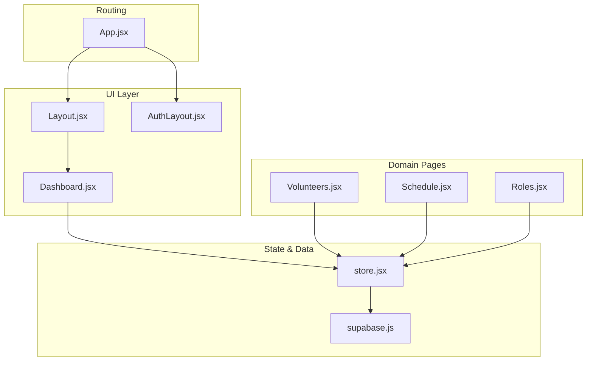
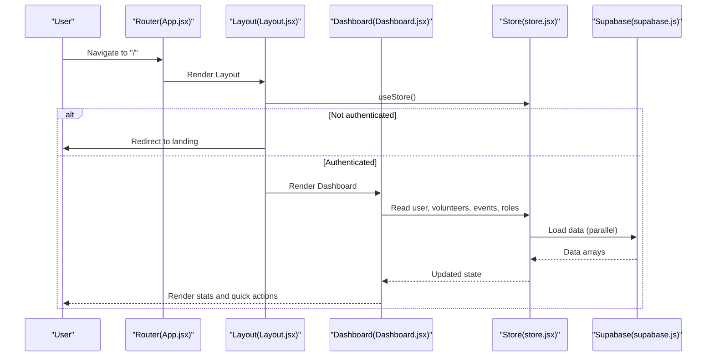
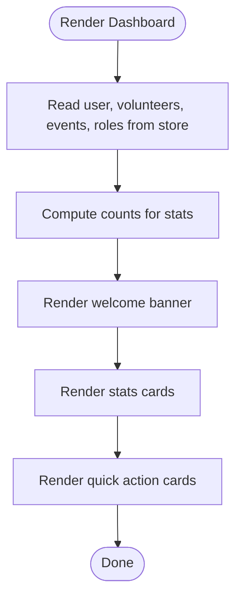
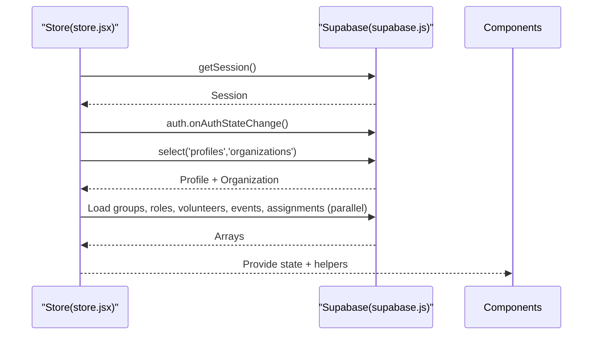
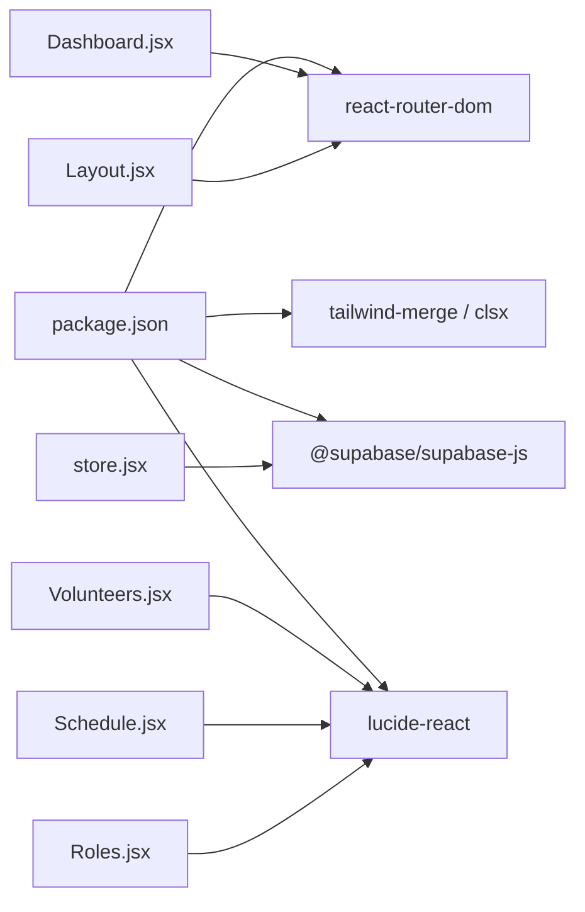

# Dashboard & Analytics

<cite>
**Referenced Files in This Document**
- [Dashboard.jsx](file://src/pages/Dashboard.jsx)
- [store.jsx](file://src/services/store.jsx)
- [supabase.js](file://src/services/supabase.js)
- [App.jsx](file://src/App.jsx)
- [Layout.jsx](file://src/components/Layout.jsx)
- [AuthLayout.jsx](file://src/components/AuthLayout.jsx)
- [Volunteers.jsx](file://src/pages/Volunteers.jsx)
- [Schedule.jsx](file://src/pages/Schedule.jsx)
- [Roles.jsx](file://src/pages/Roles.jsx)
- [supabase-schema.sql](file://supabase-schema.sql)
- [package.json](file://package.json)
- [.env.example](file://.env.example)
</cite>

## Table of Contents
1. [Introduction](#introduction)
2. [Project Structure](#project-structure)
3. [Core Components](#core-components)
4. [Architecture Overview](#architecture-overview)
5. [Detailed Component Analysis](#detailed-component-analysis)
6. [Dependency Analysis](#dependency-analysis)
7. [Performance Considerations](#performance-considerations)
8. [Troubleshooting Guide](#troubleshooting-guide)
9. [Conclusion](#conclusion)
10. [Appendices](#appendices)

## Introduction
This document explains the dashboard and analytics functionality of the application. It covers the dashboard component architecture, quick action buttons, administrative shortcuts, and how statistics are rendered from the centralized store. It also documents how the system loads and maintains data from Supabase, outlines the current analytics capabilities, and provides guidance for extending the dashboard with real-time updates, customizable layouts, and export/reporting features. Finally, it includes practical examples of dashboard customization and common analytical workflows for church administrators.

## Project Structure
The dashboard is part of a React application with routing and a centralized store. The main dashboard page renders quick stats, a welcome banner, and quick action cards. The store manages authentication state, organization context, and all domain data (groups, roles, volunteers, events, assignments). Supabase is used for backend persistence and authentication.

**Diagram sources**
- [App.jsx](file://src/App.jsx#L13-L34)
- [Layout.jsx](file://src/components/Layout.jsx#L14-L101)
- [Dashboard.jsx](file://src/pages/Dashboard.jsx#L21-L89)
- [store.jsx](file://src/services/store.jsx#L6-L467)
- [supabase.js](file://src/services/supabase.js#L1-L13)
- [Volunteers.jsx](file://src/pages/Volunteers.jsx#L7-L354)
- [Schedule.jsx](file://src/pages/Schedule.jsx#L7-L731)
- [Roles.jsx](file://src/pages/Roles.jsx#L6-L386)

**Section sources**
- [App.jsx](file://src/App.jsx#L13-L34)
- [Layout.jsx](file://src/components/Layout.jsx#L14-L101)
- [Dashboard.jsx](file://src/pages/Dashboard.jsx#L21-L89)
- [store.jsx](file://src/services/store.jsx#L6-L467)
- [supabase.js](file://src/services/supabase.js#L1-L13)

## Core Components
- Dashboard page: Renders a welcome banner, summary statistics, and quick action cards. It consumes data from the store to compute counts for volunteers, upcoming events, and roles.
- Centralized store: Provides a single source of truth for user, organization, and domain data. It loads data in parallel from Supabase and exposes CRUD helpers for all entities.
- Supabase client: Initializes the Supabase connection using environment variables and is used throughout the store for queries and mutations.
- Layout and navigation: Provides sidebar navigation, header, and authentication guard behavior.

Key statistics displayed on the dashboard:
- Total Volunteers
- Upcoming Services (events)
- Ministry Areas (roles)

Quick actions:
- Add Volunteer
- Schedule Service
- Manage Areas

These actions route to dedicated pages for administration.

**Section sources**
- [Dashboard.jsx](file://src/pages/Dashboard.jsx#L21-L89)
- [store.jsx](file://src/services/store.jsx#L6-L467)
- [supabase.js](file://src/services/supabase.js#L1-L13)
- [Layout.jsx](file://src/components/Layout.jsx#L14-L101)

## Architecture Overview
The dashboard relies on a provider pattern to distribute state across components. Authentication state is initialized and maintained, and when signed in, the store loads organization and domain data. The dashboard reads from this store to render summaries and quick actions.

**Diagram sources**
- [App.jsx](file://src/App.jsx#L13-L34)
- [Layout.jsx](file://src/components/Layout.jsx#L19-L30)
- [Dashboard.jsx](file://src/pages/Dashboard.jsx#L21-L89)
- [store.jsx](file://src/services/store.jsx#L21-L111)
- [supabase.js](file://src/services/supabase.js#L1-L13)

## Detailed Component Analysis

### Dashboard Page
The dashboard composes three primary sections:
- Welcome banner with personalized greeting and highlights
- Summary statistics cards for volunteers, upcoming services, and roles
- Quick action cards for common administrative tasks

Rendering logic:
- Uses the store to access user, volunteers, events, and roles.
- Computes counts for each stat card.
- Renders quick action cards with icons, titles, descriptions, and links.

**Diagram sources**
- [Dashboard.jsx](file://src/pages/Dashboard.jsx#L21-L89)
- [store.jsx](file://src/services/store.jsx#L22-L28)

**Section sources**
- [Dashboard.jsx](file://src/pages/Dashboard.jsx#L21-L89)

### Store and Data Loading
The store initializes authentication, loads profile and organization, and then fetches all domain data in parallel. It transforms volunteer data to flatten many-to-many role relationships and exposes CRUD functions for all entities. It also provides a refresh function to reload data.

Highlights:
- Parallel loading of groups, roles, volunteers, events, assignments
- Volunteer role transformation for compatibility
- CRUD helpers for volunteers, events, assignments, roles, groups
- Refresh mechanism to reload all data

**Diagram sources**
- [store.jsx](file://src/services/store.jsx#L21-L111)
- [supabase.js](file://src/services/supabase.js#L1-L13)

**Section sources**
- [store.jsx](file://src/services/store.jsx#L6-L467)

### Supabase Client and Environment
The Supabase client is created using Vite environment variables. The project includes an example environment file with placeholders for URL and anonymous key.

- Client initialization and environment variable checks
- Example .env configuration

**Section sources**
- [supabase.js](file://src/services/supabase.js#L1-L13)
- [.env.example](file://.env.example#L1-L5)

### Navigation and Authentication Guard
The layout component enforces authentication by redirecting unauthenticated users to the landing page. It also provides navigation to the dashboard, volunteers, schedule, and roles pages.

**Section sources**
- [Layout.jsx](file://src/components/Layout.jsx#L19-L30)
- [App.jsx](file://src/App.jsx#L18-L29)

### Administrative Pages Accessed from Dashboard
While the dashboard itself does not render analytics charts, the underlying store and pages support analytics-ready data. The following pages are relevant for building analytics and reporting:

- Volunteers: Manages volunteers and roles; supports CSV import and filtering.
- Schedule: Manages events and assignments; supports email distribution and printing.
- Roles: Manages teams and roles; supports grouping and role definitions.

These pages expose data that can be used to derive metrics such as volunteer participation rates, event attendance, and organizational health indicators.

**Section sources**
- [Volunteers.jsx](file://src/pages/Volunteers.jsx#L7-L354)
- [Schedule.jsx](file://src/pages/Schedule.jsx#L7-L731)
- [Roles.jsx](file://src/pages/Roles.jsx#L6-L386)

## Dependency Analysis
External dependencies relevant to dashboard and analytics:
- Supabase client for authentication and data persistence
- React Router for navigation
- Tailwind CSS utilities for styling
- lucide-react for icons

**Diagram sources**
- [package.json](file://package.json#L15-L38)
- [Dashboard.jsx](file://src/pages/Dashboard.jsx#L1-L4)
- [store.jsx](file://src/services/store.jsx#L1-L4)
- [Layout.jsx](file://src/components/Layout.jsx#L1-L5)
- [Volunteers.jsx](file://src/pages/Volunteers.jsx#L1-L5)
- [Schedule.jsx](file://src/pages/Schedule.jsx#L1-L5)
- [Roles.jsx](file://src/pages/Roles.jsx#L1-L4)

**Section sources**
- [package.json](file://package.json#L15-L38)

## Performance Considerations
- Parallel data loading: The store loads multiple datasets concurrently, reducing initial load time.
- Minimal re-renders: The dashboard reads from the store and only re-renders when state changes.
- Local transformations: Volunteer roles are transformed once after data load to avoid repeated computation.
- Recommendations:
  - Consider pagination for large datasets.
  - Debounce search/filter operations where applicable.
  - Implement caching or reactive subscriptions for real-time updates if needed.

[No sources needed since this section provides general guidance]

## Troubleshooting Guide
Common issues and resolutions:
- Missing environment variables: Ensure VITE_SUPABASE_URL and VITE_SUPABASE_ANON_KEY are configured. The client logs a warning if missing.
- Authentication redirects: Unauthenticated users are redirected to the landing page by the layout guard.
- Data not loading: Verify that the user has a valid session and profile; the store loads data when profile/org is available.
- Export/print/email features: These are implemented in the Schedule and Volunteers pages; confirm browser support for print and mailto links.

**Section sources**
- [supabase.js](file://src/services/supabase.js#L6-L8)
- [Layout.jsx](file://src/components/Layout.jsx#L19-L30)
- [store.jsx](file://src/services/store.jsx#L37-L52)

## Conclusion
The dashboard provides a concise overview of key metrics and quick access to administrative tasks. The centralized store ensures consistent data access and enables future enhancements such as real-time updates, customizable widgets, and export/reporting features. By leveraging the existing store and pages, administrators can build robust analytics workflows around volunteer participation, event attendance, and organizational health.

[No sources needed since this section summarizes without analyzing specific files]

## Appendices

### Real-Time Updates and Live Refresh Mechanisms
Current state:
- The store loads data on session/profile changes and provides a refresh function.
- There are no reactive subscriptions or polling in the current implementation.

Recommended approach:
- Integrate Supabase Realtime or server-sent events to subscribe to table changes.
- On receiving updates, call the refresh function to reload affected datasets.
- Debounce frequent updates to avoid excessive re-renders.

[No sources needed since this section proposes future enhancements conceptually]

### Customizable Dashboard Layouts and Widget Configuration
Current state:
- The dashboard renders fixed sections (welcome banner, stats, quick actions).
- No per-user layout preferences or drag-and-drop widgets.

Recommended approach:
- Persist user layout preferences in Supabase (e.g., user preferences table).
- Allow toggling visibility of stats and quick actions.
- Support ordering and adding/removing widgets via a configuration panel.

[No sources needed since this section proposes future enhancements conceptually]

### Export Functionality for Reports and Analytics Data
Current state:
- Volunteers page supports CSV import; export is not implemented.
- Schedule page supports printing and email sharing; export is not implemented.

Recommended approach:
- Add CSV/PDF export for volunteers, events, and assignments.
- Provide filters and date ranges for exports.
- Offer bulk actions for selected events or volunteers.

[No sources needed since this section proposes future enhancements conceptually]

### Integration with External Analytics Tools and Reporting Systems
Current state:
- No built-in integration with external analytics platforms.

Recommended approach:
- Expose endpoints or batch data exports for third-party tools.
- Provide webhook hooks for change notifications.
- Respect privacy and data governance policies when integrating.

[No sources needed since this section proposes future enhancements conceptually]

### Performance Monitoring and System Health Indicators
Current state:
- No explicit health checks or monitoring in the UI.

Recommended approach:
- Track API latency and error rates.
- Surface basic health indicators (data freshness, last sync time).
- Provide admin alerts for persistent failures.

[No sources needed since this section proposes future enhancements conceptually]

### Examples of Dashboard Customization and Analytical Workflows
- Volunteer Participation Rate:
  - Count confirmed assignments per volunteer over a period.
  - Compare against total available slots to compute participation percentage.
- Event Attendance:
  - Aggregate confirmed assignments per event and compare to required roles.
  - Visualize fill rates and trends over time.
- Organizational Health:
  - Measure diversity across roles and teams.
  - Track retention by computing repeat participation over time.

[No sources needed since this section provides conceptual examples]