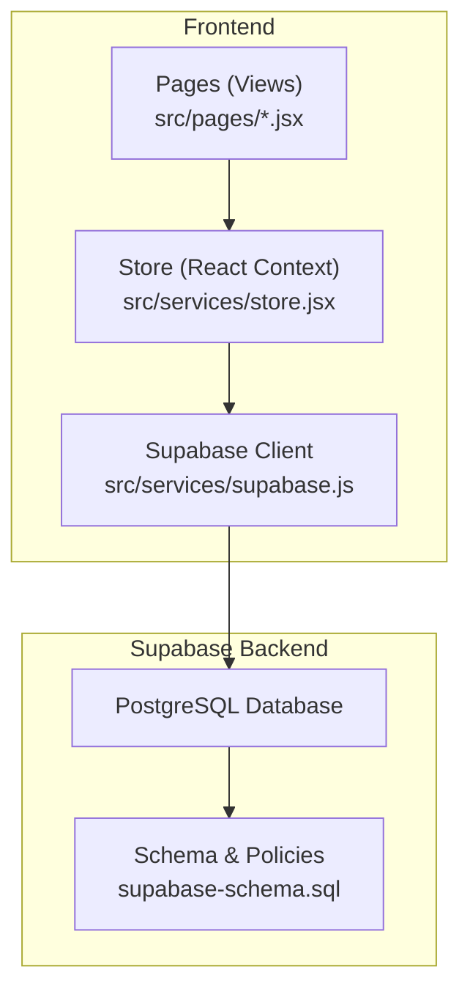
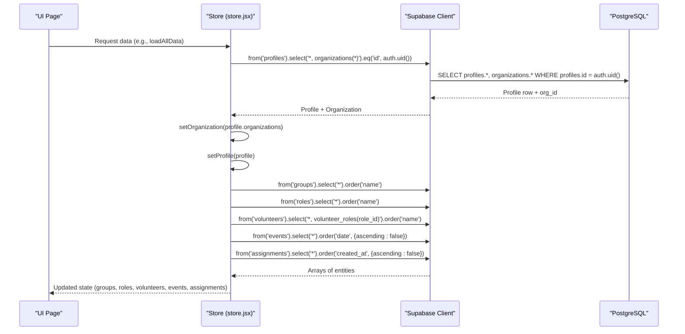
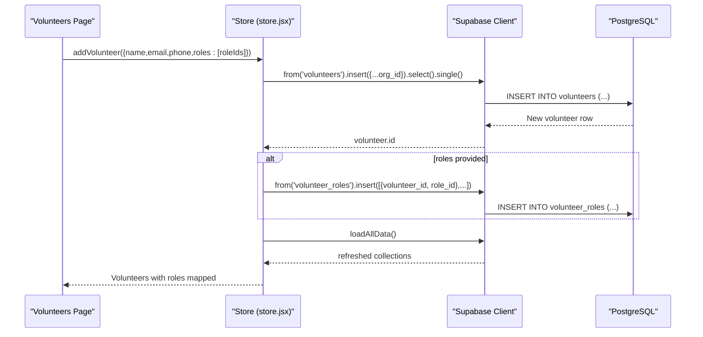
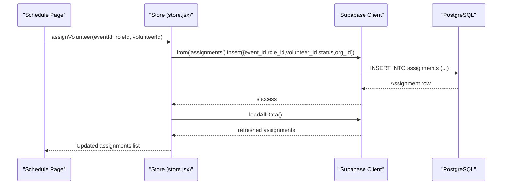
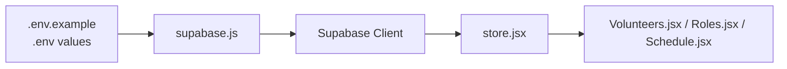

# Core Entities

<cite>
**Referenced Files in This Document**
- [supabase-schema.sql](file://supabase-schema.sql)
- [store.jsx](file://src/services/store.jsx)
- [supabase.js](file://src/services/supabase.js)
- [Volunteers.jsx](file://src/pages/Volunteers.jsx)
- [Roles.jsx](file://src/pages/Roles.jsx)
- [Schedule.jsx](file://src/pages/Schedule.jsx)
- [.env.example](file://.env.example)
</cite>

## Table of Contents
1. [Introduction](#introduction)
2. [Project Structure](#project-structure)
3. [Core Components](#core-components)
4. [Architecture Overview](#architecture-overview)
5. [Detailed Component Analysis](#detailed-component-analysis)
6. [Dependency Analysis](#dependency-analysis)
7. [Performance Considerations](#performance-considerations)
8. [Troubleshooting Guide](#troubleshooting-guide)
9. [Conclusion](#conclusion)

## Introduction
This document provides comprehensive data model documentation for RosterFlow’s core database entities. It covers the seven primary tables: organizations, profiles, groups, roles, volunteers, events, and assignments. It explains table structures, primary and foreign keys, data types, constraints, and business rules. It also documents the hierarchical relationships among organizations and their child entities, the many-to-many relationship between volunteers and roles via the volunteer_roles junction table, and the organization-based tenant isolation enforced by Row Level Security (RLS). Finally, it outlines typical query patterns and data access behaviors observed in the frontend store and pages.

## Project Structure
RosterFlow uses Supabase for backend data and authentication. The frontend interacts with Supabase through a React store that encapsulates CRUD operations and data synchronization. The database schema defines the entities and RLS policies that enforce tenant isolation per organization.



**Diagram sources**
- [store.jsx](file://src/services/store.jsx#L1-L472)
- [supabase.js](file://src/services/supabase.js#L1-L13)
- [supabase-schema.sql](file://supabase-schema.sql#L1-L251)

**Section sources**
- [store.jsx](file://src/services/store.jsx#L1-L472)
- [supabase.js](file://src/services/supabase.js#L1-L13)
- [supabase-schema.sql](file://supabase-schema.sql#L1-L251)

## Core Components
This section documents each of the seven core tables, including primary keys, foreign keys, data types, constraints, and business rules.

- organizations
  - Purpose: Root tenant container for multi-tenant isolation.
  - Primary key: id (UUID, generated by uuid_generate_v4)
  - Fields: id (UUID), name (TEXT, not null), created_at (TIMESTAMP WITH TIME ZONE, default now)
  - Constraints: Unique name per organization; created_at defaults to current timestamp
  - Notes: Used as the tenant discriminator; all other tables link to organizations via org_id

- profiles
  - Purpose: Extends Supabase auth.users with organization membership and role.
  - Primary key: id (UUID, references auth.users.id, cascade delete)
  - Foreign keys: id -> auth.users(id), org_id -> organizations(id) (cascade delete)
  - Fields: id (UUID), org_id (UUID), name (TEXT, not null), role (TEXT, default 'admin', check in ('admin','member')), created_at (TIMESTAMP WITH TIME ZONE, default now)
  - Constraints: role must be 'admin' or 'member'; id must match authenticated user; org_id must belong to the same organization
  - Notes: One-to-one with auth.users; used to derive org_id for data access

- groups
  - Purpose: Ministry teams or departments.
  - Primary key: id (UUID)
  - Foreign keys: org_id -> organizations(id) (cascade delete)
  - Fields: id (UUID), org_id (UUID, not null), name (TEXT, not null), created_at (TIMESTAMP WITH TIME ZONE, default now)
  - Constraints: org_id must reference organizations; name uniqueness not enforced at DB level
  - Notes: Parent of roles; optional hierarchy via roles.group_id

- roles
  - Purpose: Specific positions within groups; supports optional grouping under teams.
  - Primary key: id (UUID)
  - Foreign keys: org_id -> organizations(id) (cascade delete), group_id -> groups(id) (set null on delete)
  - Fields: id (UUID), org_id (UUID, not null), group_id (UUID), name (TEXT, not null), created_at (TIMESTAMP WITH TIME ZONE, default now)
  - Constraints: org_id must reference organizations; group_id must reference groups
  - Notes: Optional parent-child via group_id; used extensively in scheduling and assignments

- volunteers
  - Purpose: Individuals who can be assigned to roles for events.
  - Primary key: id (UUID)
  - Foreign keys: org_id -> organizations(id) (cascade delete)
  - Fields: id (UUID), org_id (UUID, not null), name (TEXT, not null), email (TEXT), phone (TEXT), created_at (TIMESTAMP WITH TIME ZONE, default now)
  - Constraints: org_id must reference organizations
  - Notes: Supports CSV import; linked to roles via volunteer_roles

- volunteer_roles
  - Purpose: Many-to-many relationship between volunteers and roles.
  - Primary key: composite (volunteer_id, role_id)
  - Foreign keys: volunteer_id -> volunteers(id) (cascade delete), role_id -> roles(id) (cascade delete)
  - Constraints: Enforces unique pairs; ensures referential integrity
  - Notes: Transient junction table; used to track which volunteers qualify for which roles

- events
  - Purpose: Scheduled occurrences (e.g., services) where assignments are made.
  - Primary key: id (UUID)
  - Foreign keys: org_id -> organizations(id) (cascade delete)
  - Fields: id (UUID), org_id (UUID, not null), title (TEXT, not null), date (DATE, not null), time (TEXT), created_at (TIMESTAMP WITH TIME ZONE, default now)
  - Constraints: org_id must reference organizations
  - Notes: Central to scheduling; used with assignments and roles

- assignments
  - Purpose: Links volunteers to roles for specific events; tracks status.
  - Primary key: id (UUID)
  - Foreign keys: org_id -> organizations(id) (cascade delete), event_id -> events(id) (cascade delete), role_id -> roles(id) (cascade delete), volunteer_id -> volunteers(id) (set null on delete)
  - Fields: id (UUID), org_id (UUID, not null), event_id (UUID, not null), role_id (UUID, not null), volunteer_id (UUID), status (TEXT, default 'confirmed', check in ('confirmed','pending','declined')), created_at (TIMESTAMP WITH TIME ZONE, default now)
  - Constraints: org_id must reference organizations; status must be one of the enumerated values
  - Notes: Status allows tracking of availability and confirmations

Validation and business constraints summary:
- UUID primary keys with auto-generated identifiers
- created_at defaults to current timestamp with timezone
- RLS policies restrict access to records within the authenticated user’s organization
- Triggers and application logic ensure org_id is set consistently during inserts
- volunteer_roles enforces unique combinations of volunteer and role

**Section sources**
- [supabase-schema.sql](file://supabase-schema.sql#L7-L86)
- [supabase-schema.sql](file://supabase-schema.sql#L225-L251)

## Architecture Overview
RosterFlow follows a multi-tenant architecture using organizations as tenants. The frontend store loads data scoped to the authenticated user’s organization and enforces tenant boundaries through RLS and helper functions.

```mermaid
graph TB
Auth["Supabase Auth<br/>auth.uid()"]
Profile["profiles<br/>org_id"]
Org["organizations"]
Groups["groups"]
Roles["roles"]
Volunteers["volunteers"]
VR["volunteer_roles"]
Events["events"]
Assignments["assignments"]
Auth --> Profile
Profile --> Org
Org --> Groups
Org --> Roles
Org --> Volunteers
Org --> Events
Org --> Assignments
Volunteers --> VR
Roles <- --> VR
Events --> Assignments
Roles --> Assignments
Volunteers --> Assignments
```

**Diagram sources**
- [supabase-schema.sql](file://supabase-schema.sql#L7-L86)
- [supabase-schema.sql](file://supabase-schema.sql#L50-L55)
- [supabase-schema.sql](file://supabase-schema.sql#L67-L76)

**Section sources**
- [supabase-schema.sql](file://supabase-schema.sql#L7-L86)
- [supabase-schema.sql](file://supabase-schema.sql#L50-L55)
- [supabase-schema.sql](file://supabase-schema.sql#L67-L76)

## Detailed Component Analysis

### Organizations and Child Entities
Organizations are the root tenant. All other entities link to organizations via org_id. The frontend store derives org_id from the authenticated user’s profile and scopes all queries accordingly.



**Diagram sources**
- [store.jsx](file://src/services/store.jsx#L54-L111)

**Section sources**
- [store.jsx](file://src/services/store.jsx#L54-L111)
- [supabase-schema.sql](file://supabase-schema.sql#L7-L86)

### Volunteers and Roles Relationship
Volunteers can be associated with multiple roles through the volunteer_roles table. The frontend exposes a checkbox interface to manage these associations.



**Diagram sources**
- [Volunteers.jsx](file://src/pages/Volunteers.jsx#L1-L354)
- [store.jsx](file://src/services/store.jsx#L162-L194)
- [supabase-schema.sql](file://supabase-schema.sql#L50-L55)

**Section sources**
- [Volunteers.jsx](file://src/pages/Volunteers.jsx#L1-L354)
- [store.jsx](file://src/services/store.jsx#L162-L194)
- [supabase-schema.sql](file://supabase-schema.sql#L50-L55)

### Scheduling and Assignments
Events are scheduled and assigned to volunteers for specific roles. The frontend manages assignment creation and updates.



**Diagram sources**
- [Schedule.jsx](file://src/pages/Schedule.jsx#L1-L731)
- [store.jsx](file://src/services/store.jsx#L294-L314)
- [supabase-schema.sql](file://supabase-schema.sql#L67-L76)

**Section sources**
- [Schedule.jsx](file://src/pages/Schedule.jsx#L1-L731)
- [store.jsx](file://src/services/store.jsx#L294-L314)
- [supabase-schema.sql](file://supabase-schema.sql#L67-L76)

### Data Model and Relationships
The following ER-style diagram summarizes the core entities and their relationships.

```mermaid
erDiagram
ORGANIZATIONS {
uuid id PK
string name
timestamptz created_at
}
PROFILES {
uuid id PK FK
uuid org_id FK
string name
string role
timestamptz created_at
}
GROUPS {
uuid id PK
uuid org_id FK
string name
timestamptz created_at
}
ROLES {
uuid id PK
uuid org_id FK
uuid group_id FK
string name
timestamptz created_at
}
VOLUNTEERS {
uuid id PK
uuid org_id FK
string name
string email
string phone
timestamptz created_at
}
VOLUNTEER_ROLES {
uuid volunteer_id PK,FK
uuid role_id PK,FK
}
EVENTS {
uuid id PK
uuid org_id FK
string title
date date
string time
timestamptz created_at
}
ASSIGNMENTS {
uuid id PK
uuid org_id FK
uuid event_id FK
uuid role_id FK
uuid volunteer_id FK
string status
timestamptz created_at
}
ORGANIZATIONS ||--o{ PROFILES : "contains"
ORGANIZATIONS ||--o{ GROUPS : "contains"
ORGANIZATIONS ||--o{ ROLES : "contains"
ORGANIZATIONS ||--o{ VOLUNTEERS : "contains"
ORGANIZATIONS ||--o{ EVENTS : "contains"
ORGANIZATIONS ||--o{ ASSIGNMENTS : "contains"
GROUPS ||--o{ ROLES : "parent"
VOLUNTEERS ||--o{ VOLUNTEER_ROLES : "has"
ROLES ||--o{ VOLUNTEER_ROLES : "has"
EVENTS ||--o{ ASSIGNMENTS : "hosts"
ROLES ||--o{ ASSIGNMENTS : "requires"
VOLUNTEERS ||--o{ ASSIGNMENTS : "fills"
```

**Diagram sources**
- [supabase-schema.sql](file://supabase-schema.sql#L7-L86)
- [supabase-schema.sql](file://supabase-schema.sql#L50-L55)
- [supabase-schema.sql](file://supabase-schema.sql#L67-L76)

**Section sources**
- [supabase-schema.sql](file://supabase-schema.sql#L7-L86)
- [supabase-schema.sql](file://supabase-schema.sql#L50-L55)
- [supabase-schema.sql](file://supabase-schema.sql#L67-L76)

### Sample Data Structures
Below are representative samples for each entity. These illustrate the shape of data returned by the store and used by the UI.

- organizations
  - Example fields: id, name, created_at
  - Typical usage: organization.name for display in layout

- profiles
  - Example fields: id, org_id, name, role
  - Typical usage: derived orgId and user.name for UI

- groups
  - Example fields: id, org_id, name, created_at
  - Typical usage: group.name for role grouping

- roles
  - Example fields: id, org_id, group_id, name, created_at
  - Typical usage: role.name and role.groupId for scheduling

- volunteers
  - Example fields: id, org_id, name, email, phone, created_at
  - Additional computed: roles[] (derived from volunteer_roles join)

- events
  - Example fields: id, org_id, title, date, time, created_at
  - Typical usage: event.title, event.date, event.time

- assignments
  - Example fields: id, org_id, event_id, role_id, volunteer_id, status, created_at
  - Typical usage: assignment.status and assignment.volunteerId

Note: The store augments volunteers with a roles array derived from the volunteer_roles join for UI convenience.

**Section sources**
- [store.jsx](file://src/services/store.jsx#L78-L111)
- [Volunteers.jsx](file://src/pages/Volunteers.jsx#L1-L354)
- [Roles.jsx](file://src/pages/Roles.jsx#L1-L386)
- [Schedule.jsx](file://src/pages/Schedule.jsx#L1-L731)

### Common Query Patterns
- Load organization-scoped data
  - Pattern: Select from groups, roles, volunteers, events, assignments with org_id filter
  - Observed in: loadAllData() and CRUD functions in store.jsx

- Join volunteer_roles to enrich volunteers with roles
  - Pattern: Select volunteers with join to volunteer_roles on role_id
  - Observed in: loadAllData()

- Create/update/delete entities with org_id
  - Pattern: Insert/update with org_id set from profile.org_id
  - Observed in: addVolunteer, updateVolunteer, deleteVolunteer, addEvent, updateEvent, deleteEvent, assignVolunteer, updateAssignment, addRole, updateRole, deleteRole, addGroup, updateGroup, deleteGroup

- Tenant isolation enforcement
  - Pattern: RLS policies restrict access to records where org_id equals get_user_org_id()
  - Observed in: RLS policies in supabase-schema.sql

**Section sources**
- [store.jsx](file://src/services/store.jsx#L78-L111)
- [store.jsx](file://src/services/store.jsx#L162-L242)
- [store.jsx](file://src/services/store.jsx#L244-L292)
- [store.jsx](file://src/services/store.jsx#L294-L375)
- [store.jsx](file://src/services/store.jsx#L377-L422)
- [supabase-schema.sql](file://supabase-schema.sql#L78-L223)

## Dependency Analysis
The frontend depends on Supabase for authentication and data persistence. The store coordinates data fetching and writes, while pages render views and collect user input.



**Diagram sources**
- [.env.example](file://.env.example#L1-L5)
- [supabase.js](file://src/services/supabase.js#L1-L13)
- [store.jsx](file://src/services/store.jsx#L1-L472)
- [Volunteers.jsx](file://src/pages/Volunteers.jsx#L1-L354)
- [Roles.jsx](file://src/pages/Roles.jsx#L1-L386)
- [Schedule.jsx](file://src/pages/Schedule.jsx#L1-L731)

**Section sources**
- [.env.example](file://.env.example#L1-L5)
- [supabase.js](file://src/services/supabase.js#L1-L13)
- [store.jsx](file://src/services/store.jsx#L1-L472)

## Performance Considerations
- Prefer filtering by org_id on all queries to leverage RLS and reduce dataset size.
- Use targeted selects (e.g., select only needed fields) to minimize payload sizes.
- Batch reads/writes when possible (e.g., loadAllData performs parallel fetches).
- Indexes recommended by Supabase for frequently filtered columns (e.g., org_id, id) are implicitly effective due to primary keys and foreign keys.

## Troubleshooting Guide
- Authentication and environment
  - Ensure VITE_SUPABASE_URL and VITE_SUPABASE_ANON_KEY are configured in .env
  - Symptom: Warning about missing environment variables
  - Action: Set values from Supabase project dashboard

- Tenant isolation errors
  - Symptom: Access denied to records despite being logged in
  - Cause: RLS policies restrict access to org_id matching get_user_org_id()
  - Action: Verify profile.org_id is set and consistent with data

- Data not appearing after login
  - Symptom: Empty lists for groups, roles, volunteers, events, assignments
  - Cause: loadAllData requires profile.org_id
  - Action: Confirm loadProfile resolves and sets organization

- Volunteer roles not saving
  - Symptom: Roles not persisted after adding a volunteer
  - Cause: Missing volunteer_roles insert
  - Action: Ensure addVolunteer inserts into volunteer_roles when roleIds are provided

**Section sources**
- [.env.example](file://.env.example#L1-L5)
- [supabase.js](file://src/services/supabase.js#L6-L8)
- [store.jsx](file://src/services/store.jsx#L36-L52)
- [store.jsx](file://src/services/store.jsx#L78-L111)
- [store.jsx](file://src/services/store.jsx#L162-L194)

## Conclusion
RosterFlow’s data model centers on a clean, tenant-aware schema with UUID primary keys and consistent auto-generated timestamps. The organization entity acts as the tenant boundary, enforced by RLS and helper functions. The frontend store orchestrates tenant-scoped reads and writes, while pages provide intuitive forms for managing volunteers, roles, and schedules. The volunteer_roles junction table enables flexible role qualification, and assignments connect volunteers to roles for specific events. Together, these components support scalable, secure multi-tenant operation.