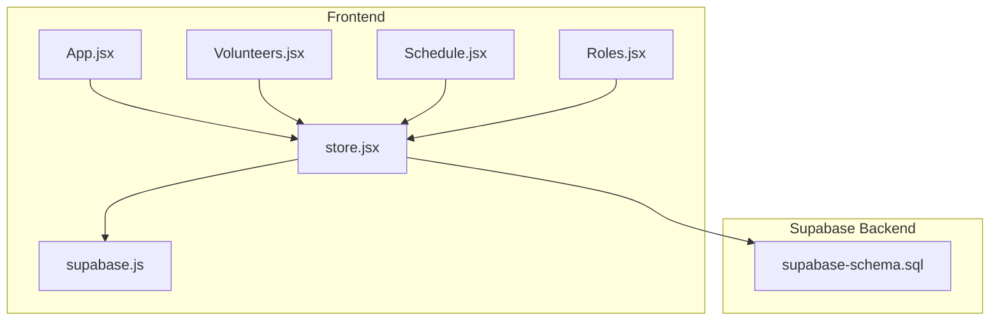
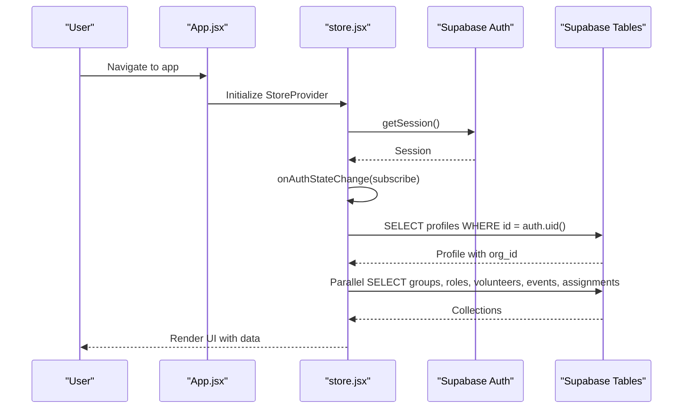
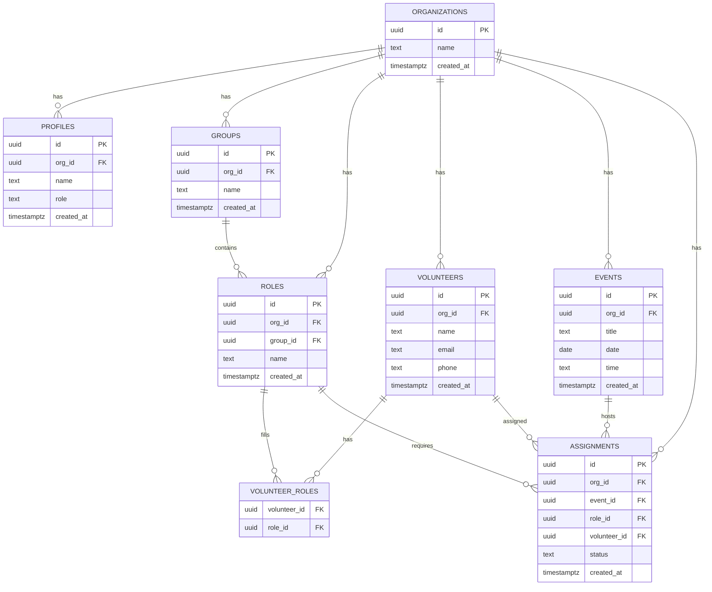
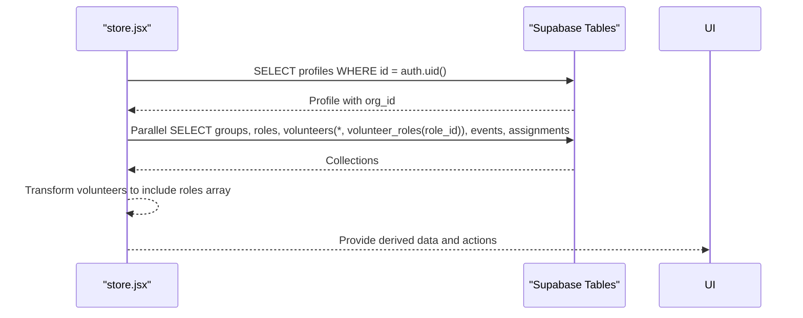
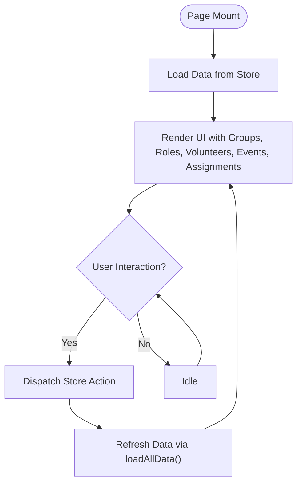
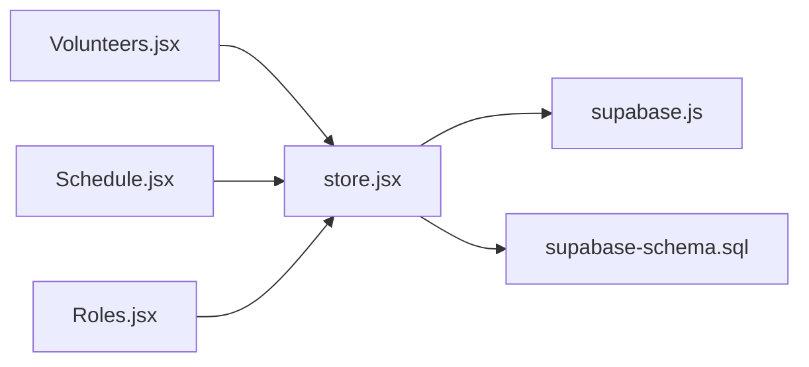

# Data Access Patterns

<cite>
**Referenced Files in This Document**
- [supabase-schema.sql](file://supabase-schema.sql)
- [src/services/supabase.js](file://src/services/supabase.js)
- [src/services/store.jsx](file://src/services/store.jsx)
- [src/pages/Volunteers.jsx](file://src/pages/Volunteers.jsx)
- [src/pages/Schedule.jsx](file://src/pages/Schedule.jsx)
- [src/pages/Roles.jsx](file://src/pages/Roles.jsx)
- [src/App.jsx](file://src/App.jsx)
</cite>

## Table of Contents
1. [Introduction](#introduction)
2. [Project Structure](#project-structure)
3. [Core Components](#core-components)
4. [Architecture Overview](#architecture-overview)
5. [Detailed Component Analysis](#detailed-component-analysis)
6. [Dependency Analysis](#dependency-analysis)
7. [Performance Considerations](#performance-considerations)
8. [Troubleshooting Guide](#troubleshooting-guide)
9. [Conclusion](#conclusion)

## Introduction
This document analyzes RosterFlow’s database access patterns and query optimization strategies. It focuses on:
- Hierarchical retrieval patterns for organizations and related entities
- Many-to-many volunteer-roles relationship handling
- Real-time subscription patterns and their interaction with the database schema
- Organization ID filtering and Row Level Security (RLS) policies
- Examples of complex joins, aggregations, and reporting queries
- Indexing strategies, optimization techniques, and performance monitoring guidance

## Project Structure
RosterFlow is a client-side application that communicates with a Supabase backend. The database schema defines the core entities and RLS policies. The frontend uses a centralized store to fetch and manage data, and pages render views based on that data.

**Diagram sources**
- [src/App.jsx](file://src/App.jsx#L13-L34)
- [src/services/store.jsx](file://src/services/store.jsx#L1-L13)
- [src/services/supabase.js](file://src/services/supabase.js#L1-L13)
- [supabase-schema.sql](file://supabase-schema.sql#L1-L251)

**Section sources**
- [src/App.jsx](file://src/App.jsx#L13-L34)
- [src/services/supabase.js](file://src/services/supabase.js#L1-L13)
- [supabase-schema.sql](file://supabase-schema.sql#L1-L251)

## Core Components
- Supabase client initialization and environment configuration
- Centralized store managing authentication state, profile, organization, and all domain collections
- Pages consuming the store to render UI and trigger CRUD operations

Key responsibilities:
- Authentication session management and subscription
- Initial data load for groups, roles, volunteers, events, and assignments
- CRUD operations for all entities with organization-scoped writes
- Volunteer-roles relationship management via a dedicated junction table

**Section sources**
- [src/services/supabase.js](file://src/services/supabase.js#L1-L13)
- [src/services/store.jsx](file://src/services/store.jsx#L1-L13)
- [src/services/store.jsx](file://src/services/store.jsx#L54-L111)
- [src/services/store.jsx](file://src/services/store.jsx#L161-L242)
- [src/services/store.jsx](file://src/services/store.jsx#L244-L375)

## Architecture Overview
The frontend initializes a Supabase client and subscribes to authentication state. On successful login, it loads profile and organization, then fetches all domain data in parallel. All writes are scoped to the user’s organization via RLS policies and triggers.

**Diagram sources**
- [src/services/store.jsx](file://src/services/store.jsx#L21-L52)
- [src/services/store.jsx](file://src/services/store.jsx#L54-L111)

## Detailed Component Analysis

### Database Schema and RLS
The schema defines core entities and enforces per-organization isolation using RLS policies and helper functions. Organization scoping is applied via org_id columns and policies that reference a user’s org_id.

Highlights:
- UUID primary keys and foreign keys
- RLS enabled on all tables
- Helper function to resolve current user’s org_id
- Policies for select/insert/update/delete across entities
- Triggers to auto-fill org_id on insert for several tables

**Diagram sources**
- [supabase-schema.sql](file://supabase-schema.sql#L7-L76)
- [supabase-schema.sql](file://supabase-schema.sql#L78-L251)

**Section sources**
- [supabase-schema.sql](file://supabase-schema.sql#L7-L76)
- [supabase-schema.sql](file://supabase-schema.sql#L78-L251)

### Data Access Layer (Supabase Client)
- Environment variables are used to initialize the Supabase client
- The client is shared across the app via a module export

Operational notes:
- Ensure VITE_SUPABASE_URL and VITE_SUPABASE_ANON_KEY are configured
- The client is used by the store for all reads/writes

**Section sources**
- [src/services/supabase.js](file://src/services/supabase.js#L1-L13)

### Central Store (Authentication, Data Loading, CRUD)
Responsibilities:
- Authentication lifecycle: session retrieval, auth state subscription, login/logout
- Profile and organization resolution
- Initial data load: parallel fetch of groups, roles, volunteers (with volunteer_roles expansion), events, assignments
- CRUD operations for all entities, scoped to org_id
- Volunteer-roles relationship management via a dedicated junction table

**Diagram sources**
- [src/services/store.jsx](file://src/services/store.jsx#L54-L111)

Key implementation patterns:
- Parallel data loading to minimize latency
- Volunteer-roles expansion via a join-like select pattern
- Organization-scoped writes enforced by RLS and triggers

**Section sources**
- [src/services/store.jsx](file://src/services/store.jsx#L54-L111)
- [src/services/store.jsx](file://src/services/store.jsx#L161-L242)
- [src/services/store.jsx](file://src/services/store.jsx#L244-L375)

### Page-Level Data Usage
- Volunteers page consumes groups, roles, and volunteers to render role checkboxes grouped by team
- Schedule page composes event assignments with roles and volunteers for rendering and email generation
- Roles page organizes roles by groups for display and management

**Diagram sources**
- [src/pages/Volunteers.jsx](file://src/pages/Volunteers.jsx#L1-L354)
- [src/pages/Schedule.jsx](file://src/pages/Schedule.jsx#L1-L731)
- [src/pages/Roles.jsx](file://src/pages/Roles.jsx#L1-L386)
- [src/services/store.jsx](file://src/services/store.jsx#L54-L111)

**Section sources**
- [src/pages/Volunteers.jsx](file://src/pages/Volunteers.jsx#L1-L354)
- [src/pages/Schedule.jsx](file://src/pages/Schedule.jsx#L1-L731)
- [src/pages/Roles.jsx](file://src/pages/Roles.jsx#L1-L386)

### Organization ID Filtering and RLS
- Helper function resolves current user’s org_id
- RLS policies filter all SELECT operations by org_id
- Triggers auto-set org_id on insert for several tables to enforce scoping

Impact on queries:
- Queries are implicitly filtered by org_id without explicit filters in the frontend
- Writes are scoped to org_id via policy checks and triggers

**Section sources**
- [supabase-schema.sql](file://supabase-schema.sql#L88-L97)
- [supabase-schema.sql](file://supabase-schema.sql#L100-L223)
- [supabase-schema.sql](file://supabase-schema.sql#L225-L251)

### Many-to-Many Volunteer-Roles Relationship
Schema:
- Junction table volunteer_roles with composite primary key (volunteer_id, role_id)
- Volunteer records link to roles via this table

Frontend handling:
- Expansion pattern: SELECT volunteers with volunteer_roles(role_id) to flatten relationships
- Update strategy: delete existing rows, then insert new rows reflecting the updated role set

Optimization opportunities:
- Prefer batched inserts/deletes for updates
- Consider denormalizing roles into a JSON column on volunteers if frequent read-heavy access is required
- Add indexes on volunteer_id and role_id for faster lookups

**Section sources**
- [supabase-schema.sql](file://supabase-schema.sql#L50-L55)
- [src/services/store.jsx](file://src/services/store.jsx#L96-L104)
- [src/services/store.jsx](file://src/services/store.jsx#L209-L225)

### Real-Time Subscriptions and Live Updates
Observation:
- The store subscribes to authentication state changes but does not subscribe to table-level real-time events
- After mutations, the store reloads all data to reflect changes

Implications:
- UI remains consistent after CRUD operations
- Real-time push is not currently used for live updates

Recommendations:
- Introduce channel subscriptions for tables that require near-real-time updates (e.g., assignments)
- Scope subscriptions to org_id to avoid cross-organization events
- Debounce frequent updates to reduce re-renders

**Section sources**
- [src/services/store.jsx](file://src/services/store.jsx#L28-L34)
- [src/services/store.jsx](file://src/services/store.jsx#L111-L111)

### Complex Joins, Aggregations, and Reporting Queries
Current frontend usage:
- Uses local joins and aggregations (e.g., grouping roles by group, computing filled slots for required roles)
- Generates reports (email templates) by combining assignments, roles, and volunteers

Examples of patterns:
- Join-like expansion: SELECT volunteers with embedded role IDs via select('*, volunteer_roles(role_id)')
- Local aggregation: compute counts of assigned volunteers per role for progress bars
- Report composition: iterate assignments to build roster text and recipient lists

Note: These are client-side transformations rather than server-side SQL joins/aggregations.

**Section sources**
- [src/services/store.jsx](file://src/services/store.jsx#L84-L87)
- [src/pages/Schedule.jsx](file://src/pages/Schedule.jsx#L27-L87)
- [src/pages/Schedule.jsx](file://src/pages/Schedule.jsx#L193-L216)

## Dependency Analysis
The store depends on the Supabase client and orchestrates data fetching and mutation. Pages depend on the store for data and actions. The schema defines the contract for data access and isolation.

**Diagram sources**
- [src/pages/Volunteers.jsx](file://src/pages/Volunteers.jsx#L1-L10)
- [src/pages/Schedule.jsx](file://src/pages/Schedule.jsx#L1-L10)
- [src/pages/Roles.jsx](file://src/pages/Roles.jsx#L1-L10)
- [src/services/store.jsx](file://src/services/store.jsx#L1-L13)
- [src/services/supabase.js](file://src/services/supabase.js#L1-L13)
- [supabase-schema.sql](file://supabase-schema.sql#L1-L251)

**Section sources**
- [src/services/store.jsx](file://src/services/store.jsx#L1-L13)
- [src/pages/Volunteers.jsx](file://src/pages/Volunteers.jsx#L1-L10)
- [src/pages/Schedule.jsx](file://src/pages/Schedule.jsx#L1-L10)
- [src/pages/Roles.jsx](file://src/pages/Roles.jsx#L1-L10)

## Performance Considerations
Indexing strategies:
- Primary keys: UUIDs are indexed by default in PostgreSQL
- Consider adding composite indexes on:
  - volunteer_roles(volunteer_id) and volunteer_roles(role_id) for fast lookups
  - assignments(event_id), assignments(role_id), assignments(volunteer_id) for scheduling queries
  - volunteers(org_id), roles(org_id), events(org_id), groups(org_id) for scoping

Query optimization techniques:
- Use selective filters (org_id) to limit result sets
- Prefer exact-match filters on indexed columns
- Minimize payload size by selecting only required columns
- Batch operations for many-to-many updates (delete+insert) to reduce round trips

Data lifecycle patterns:
- Creation: Insert into entity table; for volunteer-roles, insert into junction table
- Updates: Update entity; for volunteer-roles, delete old rows and insert new rows
- Deletion: Soft deletion is not implemented; use hard deletes on entities and cascade deletes on junction tables

Production monitoring:
- Track query latency and error rates for SELECT and INSERT/UPDATE operations
- Monitor RLS policy performance and ensure filters are efficient
- Observe frontend re-render frequency and consider memoization for derived data

[No sources needed since this section provides general guidance]

## Troubleshooting Guide
Common issues and resolutions:
- Missing environment variables: Ensure VITE_SUPABASE_URL and VITE_SUPABASE_ANON_KEY are set; otherwise, the Supabase client logs a warning
- Authentication state not persisting: Verify auth state subscription and session retrieval
- Data not appearing: Confirm profile org_id is resolved and initial parallel fetch completes without errors
- Volunteer-roles not updating: Ensure delete-and-insert logic runs for the junction table after updates

**Section sources**
- [src/services/supabase.js](file://src/services/supabase.js#L6-L8)
- [src/services/store.jsx](file://src/services/store.jsx#L21-L34)
- [src/services/store.jsx](file://src/services/store.jsx#L54-L111)
- [src/services/store.jsx](file://src/services/store.jsx#L209-L225)

## Conclusion
RosterFlow employs a clean separation between the frontend store and the Supabase backend, with strong organization scoping via RLS and helper functions. The store performs parallel data loading and manages many-to-many relationships through a dedicated junction table. While the current implementation relies on periodic refreshes rather than real-time subscriptions, the schema and policies support scalable growth. Applying targeted indexing, optimizing many-to-many updates, and optionally introducing real-time channels would further improve performance and user experience.