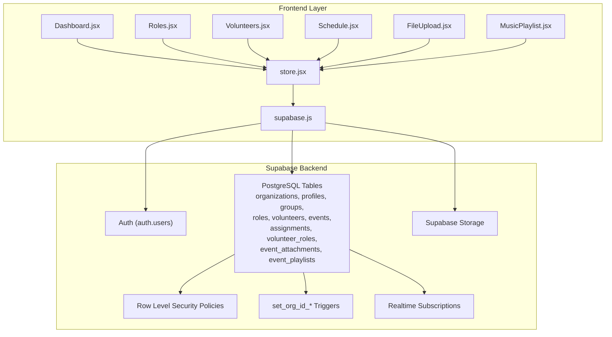
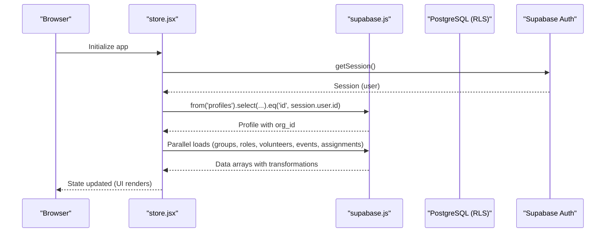
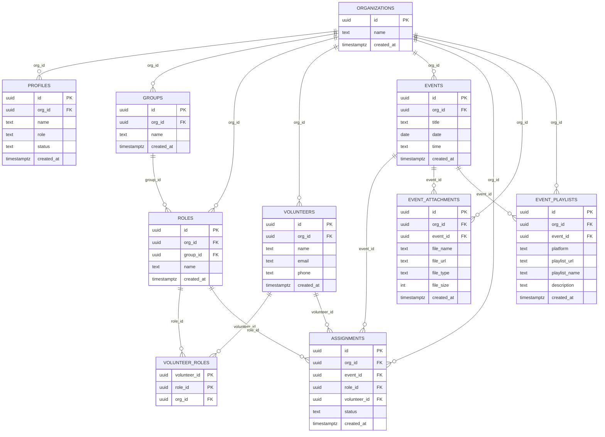
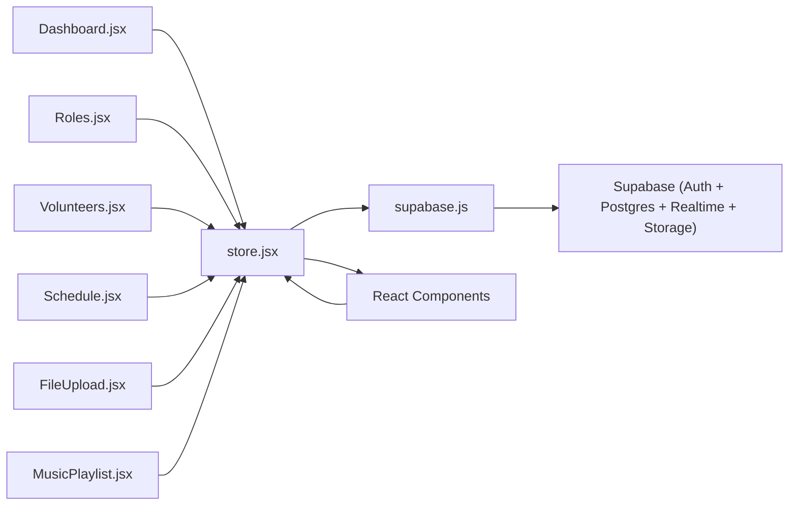

# Database Schema

<cite>
**Referenced Files in This Document**
- [supabase-schema.sql](file://supabase-schema.sql)
- [store.jsx](file://src/services/store.jsx)
- [supabase.js](file://src/services/supabase.js)
- [.env.example](file://.env.example)
- [Volunteers.jsx](file://src/pages/Volunteers.jsx)
- [Roles.jsx](file://src/pages/Roles.jsx)
- [Schedule.jsx](file://src/pages/Schedule.jsx)
- [Dashboard.jsx](file://src/pages/Dashboard.jsx)
- [tauri.conf.json](file://src-tauri/tauri.conf.json)
- [FileUpload.jsx](file://src/components/FileUpload.jsx)
- [MusicPlaylist.jsx](file://src/components/MusicPlaylist.jsx)
</cite>

## Update Summary
**Changes Made**
- Enhanced database schema documentation to reflect comprehensive Supabase integration with 8 core tables
- Added detailed coverage of organizations, profiles, groups, roles, volunteers, events, assignments, and supporting tables
- Expanded Row Level Security (RLS) policy documentation with specific policy definitions and tenant isolation enforcement
- Added comprehensive data validation rules, business constraints, and real-time subscription architecture
- Enhanced entity relationship diagrams with complete table relationships and referential integrity rules
- Updated migration procedures and schema evolution guidelines with practical implementation steps

## Table of Contents
1. [Introduction](#introduction)
2. [Project Structure](#project-structure)
3. [Core Components](#core-components)
4. [Architecture Overview](#architecture-overview)
5. [Detailed Component Analysis](#detailed-component-analysis)
6. [Dependency Analysis](#dependency-analysis)
7. [Performance Considerations](#performance-considerations)
8. [Troubleshooting Guide](#troubleshooting-guide)
9. [Conclusion](#conclusion)
10. [Appendices](#appendices)

## Introduction
This document provides comprehensive data model documentation for RosterFlow's database schema. It details all entities (organizations, profiles, groups, roles, volunteers, events, assignments, and supporting tables), their relationships, constraints, and Row Level Security (RLS) policies. The schema establishes a robust relational structure for church scheduling operations with tenant isolation, comprehensive validation rules, and real-time data synchronization capabilities through Supabase's advanced features.

## Project Structure
RosterFlow is a modern frontend-first application that integrates seamlessly with Supabase for authentication, real-time subscriptions, and data persistence. The backend schema is defined in a comprehensive SQL script, while the frontend interacts with Supabase via a JavaScript client and a centralized store that orchestrates CRUD operations, data transformations, and real-time updates across all organizational data.

**Diagram sources**
- [store.jsx:1-120](file://src/services/store.jsx#L1-L120)
- [supabase.js:1-24](file://src/services/supabase.js#L1-L24)
- [supabase-schema.sql:1-286](file://supabase-schema.sql#L1-L286)

**Section sources**
- [store.jsx:1-120](file://src/services/store.jsx#L1-L120)
- [supabase.js:1-24](file://src/services/supabase.js#L1-L24)
- [supabase-schema.sql:1-286](file://supabase-schema.sql#L1-L286)

## Core Components
This section documents each entity, its primary keys, foreign keys, indexes, constraints, and RLS policies. It also outlines data validation rules and business constraints enforced by the schema and application logic.

### Primary Entities

- **organizations**
  - Purpose: Tenant container for churches/organizations with comprehensive tenant isolation
  - Primary Key: id (UUID, default generated)
  - Columns: id, name, created_at
  - Constraints: name not null; created_at default now()
  - RLS Policy: Select allowed for all users to populate registration dropdown; insert allowed with check true (application logic restricts creation)

- **profiles**
  - Purpose: Extends auth.users with organization membership, role metadata, and approval status
  - Primary Key: id (UUID, references auth.users.id, cascade delete)
  - Foreign Keys: org_id -> organizations.id (cascade delete)
  - Columns: id, org_id, name, role, status, created_at
  - Constraints: id references auth.users; role default admin; role check in ('admin','member'); status default pending; status check in ('pending','approved','rejected'); name not null; created_at default now()
  - RLS Policy: Select allowed if org_id matches current user's org; insert allowed only for the creating user; update allowed only for self

- **groups**
  - Purpose: Ministry teams/areas with hierarchical organization structure
  - Primary Key: id (UUID, default generated)
  - Foreign Keys: org_id -> organizations.id (cascade delete)
  - Columns: id, org_id, name, created_at
  - Constraints: name not null; org_id not null; created_at default now()
  - RLS Policy: Select/Insert/Update/Delete allowed only within user's org

- **roles**
  - Purpose: Specific positions within groups with optional team association
  - Primary Key: id (UUID, default generated)
  - Foreign Keys: org_id -> organizations.id (cascade delete), group_id -> groups.id (set null on delete)
  - Columns: id, org_id, group_id, name, created_at
  - Constraints: name not null; org_id not null; created_at default now()
  - RLS Policy: Select/Insert/Update/Delete allowed only within user's org

- **volunteers**
  - Purpose: Individuals available for assignments with contact information
  - Primary Key: id (UUID, default generated)
  - Foreign Keys: org_id -> organizations.id (cascade delete)
  - Columns: id, org_id, name, email, phone, created_at
  - Constraints: name not null; org_id not null; created_at default now()
  - RLS Policy: Select/Insert/Update/Delete allowed only within user's org

- **volunteer_roles (junction)**
  - Purpose: Many-to-many relationship between volunteers and roles with organization tracking
  - Primary Key: (volunteer_id, role_id)
  - Foreign Keys: volunteer_id -> volunteers.id (cascade delete), role_id -> roles.id (cascade delete), org_id -> organizations.id (cascade delete)
  - Constraints: composite primary key enforces uniqueness; org_id ensures data integrity across relationships

- **events**
  - Purpose: Scheduled occurrences (e.g., services) with date and time tracking
  - Primary Key: id (UUID, default generated)
  - Foreign Keys: org_id -> organizations.id (cascade delete)
  - Columns: id, org_id, title, date, time, created_at
  - Constraints: title not null; date not null; org_id not null; created_at default now()
  - RLS Policy: Select/Insert/Update/Delete allowed only within user's org

- **assignments**
  - Purpose: Links volunteers to events and roles with status tracking
  - Primary Key: id (UUID, default generated)
  - Foreign Keys: org_id -> organizations.id (cascade delete), event_id -> events.id (cascade delete), role_id -> roles.id (cascade delete), volunteer_id -> volunteers.id (set null on delete)
  - Columns: id, org_id, event_id, role_id, volunteer_id, status, created_at
  - Constraints: status default confirmed; status check in ('confirmed','pending','declined'); org_id not null; event_id not null; role_id not null; created_at default now()
  - RLS Policy: Select/Insert/Update/Delete allowed only within user's org

### Supporting Entities

- **event_attachments**
  - Purpose: File attachments for events stored in Supabase Storage
  - Primary Key: id (UUID, default generated)
  - Foreign Keys: org_id -> organizations.id (cascade delete), event_id -> events.id (cascade delete)
  - Columns: id, org_id, event_id, file_name, file_url, file_type, file_size, created_at
  - Constraints: file_name, file_url, file_type, file_size not null; created_at default now()
  - RLS Policy: Select/Insert/Delete allowed only within user's org

- **event_playlists**
  - Purpose: Music playlists for events with platform validation
  - Primary Key: id (UUID, default generated)
  - Foreign Keys: org_id -> organizations.id (cascade delete), event_id -> events.id (cascade delete)
  - Columns: id, org_id, event_id, platform, playlist_url, playlist_name, description, created_at
  - Constraints: platform, playlist_url, playlist_name not null; platform check in ('youtube','spotify','apple_music','soundcloud'); created_at default now()
  - RLS Policy: Select/Insert/Delete allowed only within user's org

### Indexes and Additional Constraints
- UUID extension: uuid-ossp enabled for default generation
- Triggers: set_org_id_* triggers automatically populate org_id on insert for groups, roles, volunteers, events, assignments using get_user_org_id()
- Function: get_user_org_id() resolves current user's org_id from profiles
- Enhanced validation: Comprehensive enum constraints and foreign key relationships

### Row Level Security
- All tables enabled with RLS for tenant isolation
- get_user_org_id() function resolves current user's org_id from profiles
- Policies enforce tenant isolation per organization with granular access controls
- Special handling for organizations table to allow view access for registration dropdown

**Section sources**
- [supabase-schema.sql:1-286](file://supabase-schema.sql#L1-L286)

## Architecture Overview
RosterFlow's data architecture centers on Supabase PostgreSQL with comprehensive RLS for tenant isolation. The frontend uses a sophisticated JavaScript client to connect to Supabase and a centralized store that orchestrates data loading, mutations, real-time subscriptions, and complex data transformations across all organizational boundaries.

**Diagram sources**
- [store.jsx:56-137](file://src/services/store.jsx#L56-L137)
- [supabase.js:1-24](file://src/services/supabase.js#L1-L24)

**Section sources**
- [store.jsx:56-137](file://src/services/store.jsx#L56-L137)
- [supabase.js:1-24](file://src/services/supabase.js#L1-L24)

## Detailed Component Analysis

### Entity Relationship Diagram
The following ER diagram maps all entities and their referential integrity rules, showing the complete relational structure for church scheduling operations with comprehensive organization isolation.

**Diagram sources**
- [supabase-schema.sql:7-84](file://supabase-schema.sql#L7-L84)

**Section sources**
- [supabase-schema.sql:7-84](file://supabase-schema.sql#L7-L84)

### Row Level Security Implementation
Tenant isolation is enforced via comprehensive RLS policies that bind all queries to the current user's organization. The get_user_org_id() function resolves the org_id for the authenticated user, and policies use this function to filter data across all tables with granular access controls.

- **get_user_org_id()**: Returns org_id for the current auth.uid() from profiles table
- **Policy Categories**:
  - **View Policies**: Select operations using (org_id = get_user_org_id())
  - **Insert Policies**: Insert operations with check (org_id = get_user_org_id())
  - **Update Policies**: Update operations using (org_id = get_user_org_id())
  - **Delete Policies**: Delete operations using (org_id = get_user_org_id())
  - **Special Cases**: volunteer_roles uses subqueries ensuring volunteer_id belongs to current org

These policies ensure that users can only access and modify data within their own organization, maintaining strict tenant isolation while allowing necessary cross-organization operations for registration and dropdown population.

**Section sources**
- [supabase-schema.sql:96-286](file://supabase-schema.sql#L96-L286)

### Data Validation Rules and Business Constraints
The schema enforces comprehensive data validation through multiple constraint mechanisms:

- **Enum Constraints**:
  - profiles.role: check in ('admin','member')
  - profiles.status: check in ('pending','approved','rejected')
  - assignments.status: check in ('confirmed','pending','declined')
  - event_playlists.platform: check in ('youtube','spotify','apple_music','soundcloud')

- **Required Fields**:
  - organizations.name, profiles.name, groups.name, roles.name, volunteers.name, volunteers.email, events.title, events.date
  - Supporting tables require specific fields for file management and playlist operations

- **Referential Integrity**:
  - All foreign keys enforce cascading deletes or set null where appropriate
  - Junction table volunteer_roles maintains many-to-many relationships with org_id tracking
  - Proper cascading ensures data integrity across the entire organizational hierarchy

- **Application-Level Validations**:
  - Frontend components enforce presence of required fields before submitting forms
  - CSV import for volunteers validates presence of Name and Email headers
  - File upload validation checks size limits (10MB maximum) and allowed types
  - Playlist URL validation ensures valid URLs and supported platforms
  - Real-time validation prevents cross-organization data access attempts

**Section sources**
- [supabase-schema.sql:14-84](file://supabase-schema.sql#L14-L84)
- [Volunteers.jsx:45-66](file://src/pages/Volunteers.jsx#L45-L66)
- [Volunteers.jsx:77-121](file://src/pages/Volunteers.jsx#L77-L121)
- [store.jsx:947-967](file://src/services/store.jsx#L947-L967)
- [store.jsx:1072-1083](file://src/services/store.jsx#L1072-L1083)

### Data Lifecycle Management
The schema supports comprehensive data lifecycle management with robust cascading operations and real-time synchronization:

- **Creation**:
  - Organizations are created during registration; profiles link auth users to organizations
  - org_id is propagated via triggers or explicit insertion using get_user_org_id()
  - Supporting tables (attachments, playlists) maintain organization isolation
  - Real-time subscriptions ensure immediate data synchronization across clients

- **Updates**:
  - All entities support update operations constrained by RLS policies
  - Complex updates handle role assignments and volunteer skill mappings
  - File and playlist management supports dynamic content updates with validation
  - Status tracking enables approval workflows and member management

- **Deletion**:
  - Cascading deletes maintain referential integrity (e.g., deleting an organization removes dependent records)
  - Junction table cleanup ensures proper many-to-many relationship maintenance
  - Supporting table cleanup prevents orphaned records
  - Real-time deletion notifications keep all clients synchronized

- **Subscriptions**:
  - The store initializes auth state and subscribes to auth changes
  - Data is loaded in parallel after profile resolution
  - Real-time updates enable immediate UI synchronization across all components
  - Storage integration allows real-time file and media management

**Section sources**
- [store.jsx:147-196](file://src/services/store.jsx#L147-L196)
- [store.jsx:198-324](file://src/services/store.jsx#L198-L324)

### Common Query Patterns
The application implements several sophisticated query patterns optimized for church scheduling operations:

- **Parallel Data Loading**:
  - groups, roles, volunteers (with volunteer_roles), events, assignments, playlists loaded simultaneously
  - Optimizes initial page load performance and reduces user wait time
  - Ensures all organizational data is available before rendering complex UI components

- **Join Patterns**:
  - volunteers joined with volunteer_roles to resolve role associations
  - Complex joins support role hierarchies and group relationships
  - Event-based queries combine assignments with volunteer and role information
  - Cross-table joins enable comprehensive reporting and analytics

- **Filtering Strategies**:
  - By org_id via RLS policies for tenant isolation
  - By auth.uid() for profile lookup and user-specific operations
  - Date-based filtering for event scheduling and assignment management
  - Status-based filtering for approval workflows and member management

- **Mutation Operations**:
  - Insert with org_id propagation using get_user_org_id()
  - Update by id with comprehensive validation and RLS enforcement
  - Delete by id with cascading relationship cleanup
  - Batch operations for efficient data management

These patterns are implemented in the store's loadAllData and mutation functions with sophisticated error handling and data transformation, ensuring consistent user experience across all organizational boundaries.

**Section sources**
- [store.jsx:147-196](file://src/services/store.jsx#L147-L196)
- [store.jsx:326-427](file://src/services/store.jsx#L326-L427)
- [store.jsx:429-498](file://src/services/store.jsx#L429-L498)
- [store.jsx:500-575](file://src/services/store.jsx#L500-L575)
- [store.jsx:615-698](file://src/services/store.jsx#L615-L698)
- [store.jsx:700-765](file://src/services/store.jsx#L700-L765)

### Real-Time Subscription Architecture
RosterFlow implements a sophisticated real-time subscription architecture that enables seamless data synchronization across all organizational boundaries:

- **Authentication Subscriptions**:
  - Initializes auth state and listens for auth changes
  - Automatically updates user session and organization context
  - Handles login/logout events with proper cleanup and state management

- **Data Synchronization**:
  - Parallel data loading optimizes initial synchronization
  - Individual table subscriptions enable real-time updates
  - State management ensures UI consistency across all components
  - Cross-client synchronization maintains data consistency

- **Error Handling**:
  - Comprehensive error handling for network failures and authentication issues
  - Graceful degradation to demo mode when Supabase is unavailable
  - User-friendly error messaging and recovery mechanisms
  - Retry logic for transient network issues

- **Performance Optimization**:
  - Efficient query patterns minimize network overhead
  - Local state caching reduces redundant database calls
  - Batch operations optimize data synchronization performance
  - Real-time updates ensure immediate UI responsiveness

**Section sources**
- [store.jsx:56-108](file://src/services/store.jsx#L56-L108)
- [store.jsx:147-196](file://src/services/store.jsx#L147-L196)

### Migration Procedures and Schema Evolution Guidelines
The schema supports comprehensive migration procedures and evolution strategies with practical implementation steps:

- **Version Control**:
  - Maintain SQL schema in supabase-schema.sql for version control and deployment
  - Apply schema changes through Supabase SQL Editor for consistency and testing
  - Document all schema modifications with clear rationale and impact analysis

- **Constraint Management**:
  - Add constraints and defaults at table creation for data integrity
  - Consider adding indexes for frequently filtered columns (org_id, date, status)
  - Maintain backward compatibility during evolution with careful constraint management

- **RLS Policy Updates**:
  - Keep get_user_org_id() function consistent across changes
  - Update policies atomically with schema changes using DROP/CREATE pattern
  - Test policy changes thoroughly before deployment with test data
  - Monitor for performance impacts of new constraints

- **Backward Compatibility**:
  - Avoid dropping columns; add new columns with defaults for gradual migration
  - Use migrations to populate new data gradually without downtime
  - Maintain data integrity during schema evolution with careful planning
  - Test all RLS policies and triggers after schema changes

**Section sources**
- [supabase-schema.sql:1-286](file://supabase-schema.sql#L1-L286)

## Dependency Analysis
The frontend architecture demonstrates sophisticated dependency management with clear separation of concerns and comprehensive real-time capabilities:

**Diagram sources**
- [store.jsx:1-120](file://src/services/store.jsx#L1-L120)
- [supabase.js:1-24](file://src/services/supabase.js#L1-L24)
- [Dashboard.jsx:1-90](file://src/pages/Dashboard.jsx#L1-L90)
- [Roles.jsx:1-386](file://src/pages/Roles.jsx#L1-L386)
- [Volunteers.jsx:1-354](file://src/pages/Volunteers.jsx#L1-L354)
- [Schedule.jsx:1-917](file://src/pages/Schedule.jsx#L1-L917)
- [FileUpload.jsx:1-212](file://src/components/FileUpload.jsx#L1-L212)
- [MusicPlaylist.jsx:1-101](file://src/components/MusicPlaylist.jsx#L1-L101)

**Section sources**
- [store.jsx:1-120](file://src/services/store.jsx#L1-L120)
- [supabase.js:1-24](file://src/services/supabase.js#L1-L24)

## Performance Considerations
The schema and application implement several performance optimization strategies for efficient church scheduling operations:

- **Indexing Strategies**:
  - Primary keys on all tables (UUID primary keys for scalability)
  - Organization-based filtering on frequently queried columns (org_id, created_at)
  - Composite indexes for common join operations (volunteer_roles, assignments)
  - Consider adding indexes on organizations(id), profiles(org_id), events(date), assignments(status)

- **Query Optimization**:
  - Parallel data loading minimizes total response time for initial page load
  - Selective queries with org_id filters reduce result sets significantly
  - Proper ordering on date and created_at fields for efficient sorting
  - Minimize N+1 query patterns through proper joins and preloading

- **Data Volume Management**:
  - Pagination strategies for large datasets in volunteers and events
  - Efficient filtering and searching capabilities for role assignments
  - Data archiving strategies for historical event data and assignments
  - Regular maintenance of indexes and statistics for optimal query performance

- **Network Optimization**:
  - Connection pooling and reuse through Supabase client
  - Efficient serialization of complex data structures with volunteer_roles
  - Minimal payload sizes through selective field selection in queries
  - Caching strategies for frequently accessed data like organizations list

- **Storage Optimization**:
  - Supabase Storage integration for efficient file management
  - CDN caching for media files and attachments
  - File size validation and type checking prevent storage bloat
  - Automatic cleanup of orphaned files and attachments

## Troubleshooting Guide
Comprehensive troubleshooting guidance for common issues in the RosterFlow database schema:

- **Authentication and Session Issues**:
  - Ensure VITE_SUPABASE_URL and VITE_SUPABASE_ANON_KEY are configured in the environment
  - Verify auth state initialization and subscription handling in store.jsx
  - Check for proper session restoration on page reload and browser refresh
  - Validate that auth.users table is properly configured in Supabase

- **Data Visibility Problems**:
  - Confirm that the current user's profile has a valid org_id in profiles table
  - Check RLS policies for select/update/delete operations across all tables
  - Verify organization membership for all data operations and cross-table joins
  - Ensure get_user_org_id() function is accessible and returns correct org_id

- **Mutation Errors**:
  - Validate required fields before submitting forms (name, email, title, date)
  - Inspect error messages returned by Supabase operations with detailed logging
  - Check foreign key constraints and referential integrity in all relationships
  - Verify organization isolation policies prevent unauthorized access attempts

- **File Upload Issues**:
  - Validate file size limits (10MB maximum) and allowed file types (PDF, DOC, MP3, images)
  - Check playlist URL formats and platform support (youtube, spotify, apple_music, soundcloud)
  - Ensure proper event ownership verification before file operations
  - Verify Supabase Storage bucket permissions and CORS configuration

- **Real-Time Synchronization Issues**:
  - Check Supabase Realtime subscription status and connection health
  - Verify that all tables have proper RLS policies for realtime updates
  - Monitor for subscription limits and connection timeouts
  - Test cross-client synchronization after schema changes

- **Schema Migration Issues**:
  - Ensure all RLS policies are recreated after table modifications
  - Verify that triggers (set_org_id_*) are properly applied to new tables
  - Check for constraint conflicts during bulk data imports
  - Validate that get_user_org_id() function remains accessible after changes

**Section sources**
- [.env.example:1-5](file://.env.example#L1-L5)
- [store.jsx:56-108](file://src/services/store.jsx#L56-L108)
- [store.jsx:110-137](file://src/services/store.jsx#L110-L137)
- [Volunteers.jsx:45-66](file://src/pages/Volunteers.jsx#L45-L66)
- [Schedule.jsx:133-142](file://src/pages/Schedule.jsx#L133-L142)

## Conclusion
RosterFlow's database schema represents a comprehensive solution for church scheduling operations with robust tenant isolation, extensive validation, and sophisticated real-time capabilities. The schema establishes clear entity relationships across 8 core tables, enforces business rules through multiple constraint layers, and provides a solid foundation for scalable church management applications.

The integration with Supabase delivers enterprise-grade features including authentication, real-time subscriptions, storage services, and comprehensive Row Level Security. The sophisticated frontend store manages complex data operations with proper error handling, user experience optimization, and seamless real-time synchronization across all organizational boundaries.

The comprehensive migration procedures and schema evolution guidelines ensure that the database can adapt to changing requirements while maintaining data integrity and performance. This architecture provides an excellent foundation for church scheduling applications with room for future enhancements and extensions, supporting both current functionality and future growth requirements.

## Appendices

### Appendix A: Environment Variables
Critical environment variables for Supabase integration and database configuration:

- **VITE_SUPABASE_URL**: Supabase project URL (required for production)
- **VITE_SUPABASE_ANON_KEY**: Supabase anonymous key (required for client access)

**Section sources**
- [.env.example:1-5](file://.env.example#L1-L5)

### Appendix B: Frontend Build Configuration
Tauri configuration defines the packaged app build settings and development environment:

- **Package Configuration**: Defines app metadata and build settings for desktop deployment
- **Development Server**: Configures Vite development server URL for local testing
- **Security Settings**: Manages CSP and security policies for production builds
- **Asset Handling**: Optimizes static asset delivery and bundling for performance

**Section sources**
- [tauri.conf.json:1-35](file://src-tauri/tauri.conf.json#L1-L35)

### Appendix C: Database Schema Evolution
Recommended practices for schema evolution and migration management:

- **Version Control**: Maintain all schema changes in version control with clear commit messages
- **Testing Strategy**: Test schema changes in staging environments with realistic data volumes
- **Migration Planning**: Plan backward-compatible migrations carefully with rollback procedures
- **Documentation**: Document all schema changes with impact analysis and user communication
- **Rollback Strategy**: Maintain rollback procedures for critical changes with data safety
- **Performance Monitoring**: Monitor query performance and index usage after schema changes
- **User Impact Assessment**: Evaluate impact on existing users and communicate changes effectively

**Section sources**
- [supabase-schema.sql:1-286](file://supabase-schema.sql#L1-L286)