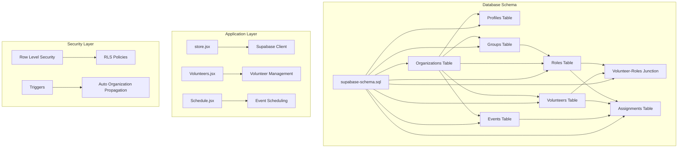
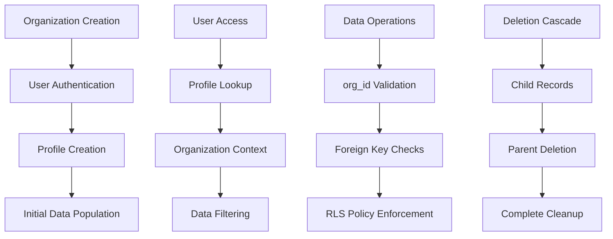
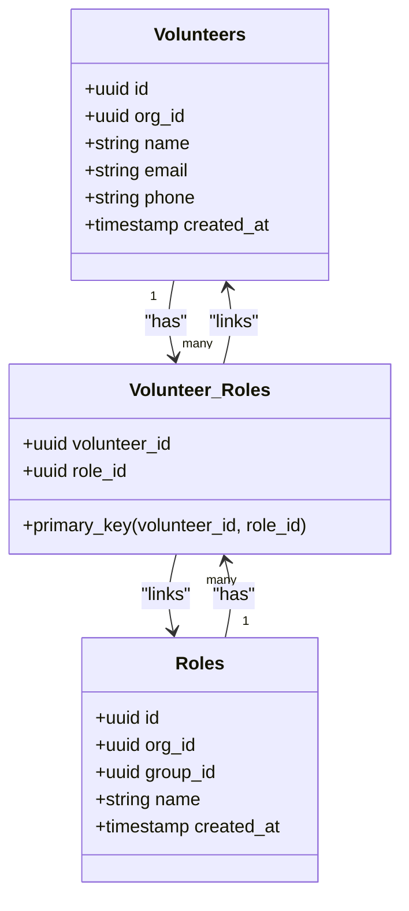
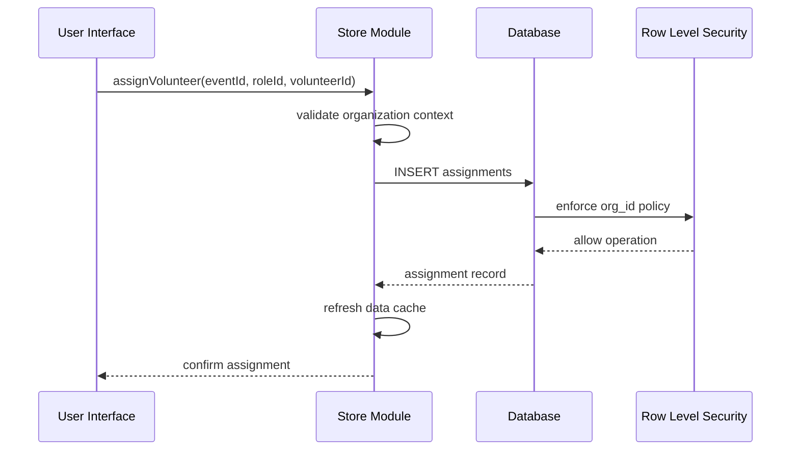
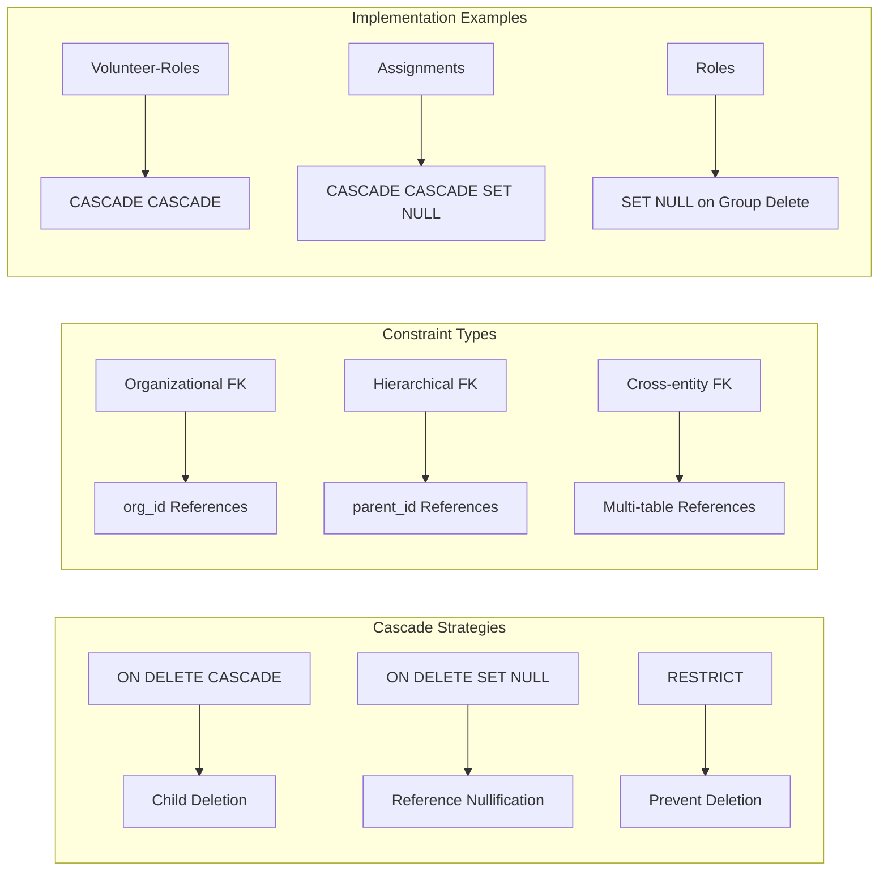
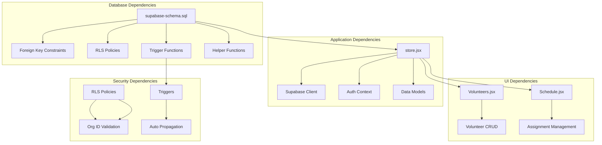

# Relationships and Constraints

<cite>
**Referenced Files in This Document**
- [supabase-schema.sql](file://supabase-schema.sql)
- [store.jsx](file://src/services/store.jsx)
- [supabase.js](file://src/services/supabase.js)
- [Volunteers.jsx](file://src/pages/Volunteers.jsx)
- [Schedule.jsx](file://src/pages/Schedule.jsx)
</cite>

## Table of Contents
1. [Introduction](#introduction)
2. [Project Structure](#project-structure)
3. [Core Components](#core-components)
4. [Architecture Overview](#architecture-overview)
5. [Detailed Component Analysis](#detailed-component-analysis)
6. [Dependency Analysis](#dependency-analysis)
7. [Performance Considerations](#performance-considerations)
8. [Troubleshooting Guide](#troubleshooting-guide)
9. [Conclusion](#conclusion)

## Introduction

RosterFlow is a church scheduling application built with React and Supabase that manages volunteer organizations through a well-designed relational database schema. The application implements a hierarchical organization structure where organizations serve as the root entity, with all other entities functioning as children. This documentation focuses specifically on the database relationships, referential constraints, and data isolation mechanisms that ensure reliable operation and maintain data integrity.

The system employs Supabase's Row Level Security (RLS) policies combined with foreign key constraints to create a robust multi-tenant architecture where each organization maintains complete data isolation while allowing flexible volunteer-role-event assignments.

## Project Structure

The database schema is defined in a single SQL file that establishes the complete relational model for the application:



**Diagram sources**
- [supabase-schema.sql](file://supabase-schema.sql#L1-L251)
- [store.jsx](file://src/services/store.jsx#L1-L472)

**Section sources**
- [supabase-schema.sql](file://supabase-schema.sql#L1-L251)
- [store.jsx](file://src/services/store.jsx#L1-L472)

## Core Components

The database schema consists of eight interconnected tables that form a comprehensive volunteer management system:

### Primary Entities

**Organizations Table**: The root entity containing organization metadata and serving as the primary tenant isolation boundary.

**Profiles Table**: Extends Supabase's authentication system by linking auth.users to organizational context and user roles.

**Groups Table**: Ministry teams or departments within organizations, providing organizational structure.

**Roles Table**: Specific positions within groups, representing job functions or duties.

**Volunteers Table**: Individual team members with contact information and organizational association.

**Events Table**: Scheduled activities or services requiring volunteer assignments.

**Assignments Table**: Many-to-many relationship between volunteers, roles, and events, capturing actual volunteer participation.

**Volunteer-Roles Junction Table**: Many-to-many relationship between volunteers and roles, enabling flexible skill and position assignments.

### Supporting Infrastructure

**Row Level Security**: Comprehensive security policies ensuring data isolation between organizations.

**Triggers**: Automated organization ID propagation to maintain referential integrity.

**Helper Functions**: Utility functions for organization-based access control.

**Section sources**
- [supabase-schema.sql](file://supabase-schema.sql#L7-L66)
- [supabase-schema.sql](file://supabase-schema.sql#L78-L251)

## Architecture Overview

The RosterFlow database architecture implements a strict hierarchical organization model with cascading referential integrity:

```mermaid
erDiagram
ORGANIZATIONS {
uuid id PK
text name
timestamptz created_at
}
PROFILES {
uuid id PK
uuid org_id FK
text name
text role
timestamptz created_at
}
GROUPS {
uuid id PK
uuid org_id FK
text name
timestamptz created_at
}
ROLES {
uuid id PK
uuid org_id FK
uuid group_id FK
text name
timestamptz created_at
}
VOLUNTEERS {
uuid id PK
uuid org_id FK
text name
text email
text phone
timestamptz created_at
}
VOLUNTEER_ROLES {
uuid volunteer_id FK
uuid role_id FK
primary_key (volunteer_id, role_id)
}
EVENTS {
uuid id PK
uuid org_id FK
text title
date date
text time
timestamptz created_at
}
ASSIGNMENTS {
uuid id PK
uuid org_id FK
uuid event_id FK
uuid role_id FK
uuid volunteer_id FK
text status
timestamptz created_at
}
ORGANIZATIONS ||--o{ PROFILES : "has"
ORGANIZATIONS ||--o{ GROUPS : "has"
ORGANIZATIONS ||--o{ ROLES : "has"
ORGANIZATIONS ||--o{ VOLUNTEERS : "has"
ORGANIZATIONS ||--o{ EVENTS : "has"
ORGANIZATIONS ||--o{ ASSIGNMENTS : "has"
GROUPS ||--o{ ROLES : "contains"
VOLUNTEERS ||--o{ VOLUNTEER_ROLES : "has"
ROLES ||--o{ VOLUNTEER_ROLES : "has"
EVENTS ||--o{ ASSIGNMENTS : "scheduled_for"
ROLES ||--o{ ASSIGNMENTS : "filled_by"
VOLUNTEERS ||--o{ ASSIGNMENTS : "assigned_to"
```

**Diagram sources**
- [supabase-schema.sql](file://supabase-schema.sql#L7-L76)

The architecture enforces strict data isolation through organization-based foreign key constraints, ensuring that all child entities maintain referential integrity with their parent organizations.

**Section sources**
- [supabase-schema.sql](file://supabase-schema.sql#L7-L76)

## Detailed Component Analysis

### Organization Hierarchy and Data Isolation

The organization serves as the fundamental unit of data isolation in RosterFlow. Every table except organizations contains an `org_id` field that creates a chain of referential dependencies:



**Diagram sources**
- [supabase-schema.sql](file://supabase-schema.sql#L126-L251)
- [store.jsx](file://src/services/store.jsx#L54-L68)

The organization ID propagation mechanism works through multiple layers:

1. **Database Triggers**: Automatic `org_id` population for new records
2. **Application Logic**: Explicit `org_id` setting during CRUD operations
3. **RLS Policies**: Runtime enforcement of organization boundaries

**Section sources**
- [supabase-schema.sql](file://supabase-schema.sql#L225-L251)
- [store.jsx](file://src/services/store.jsx#L162-L194)

### Many-to-Many Relationships

#### Volunteer-Roles Relationship

The volunteer-roles relationship is implemented through a dedicated junction table that enables flexible skill and position assignments:



**Diagram sources**
- [supabase-schema.sql](file://supabase-schema.sql#L50-L55)

The junction table design provides several advantages:
- **Flexible Skill Assignment**: Volunteers can have multiple roles
- **Role Flexibility**: Roles can be assigned to multiple volunteers
- **Cascade Management**: Proper deletion behavior prevents orphaned records
- **Index Efficiency**: Composite primary key optimizes lookups

**Section sources**
- [supabase-schema.sql](file://supabase-schema.sql#L50-L55)
- [store.jsx](file://src/services/store.jsx#L181-L191)

#### Assignment System Architecture

The assignment system connects volunteers, roles, and events through a sophisticated many-to-many relationship:



**Diagram sources**
- [store.jsx](file://src/services/store.jsx#L295-L314)

The assignment system implements different cascade strategies:
- **ON DELETE CASCADE**: Volunteers and roles deletion affects assignments
- **ON DELETE SET NULL**: Event deletion sets assignment references to NULL

**Section sources**
- [supabase-schema.sql](file://supabase-schema.sql#L67-L76)
- [store.jsx](file://src/services/store.jsx#L295-L314)

### Foreign Key Constraints and Cascade Behaviors

The database enforces referential integrity through carefully designed foreign key constraints:



**Diagram sources**
- [supabase-schema.sql](file://supabase-schema.sql#L14-L76)

The cascade strategies are strategically chosen based on business requirements:
- **CASCADE**: Used for child entities that cannot exist without parents
- **SET NULL**: Used for assignments where event deletion should not destroy assignment records
- **RESTRICT**: Implicitly enforced by foreign key constraints preventing orphaned records

**Section sources**
- [supabase-schema.sql](file://supabase-schema.sql#L14-L76)

### Row Level Security Implementation

RosterFlow implements comprehensive Row Level Security policies that provide automatic data isolation:

```mermaid
flowchart TD
A[User Authentication] --> B[Profile Lookup]
B --> C[Organization Context]
C --> D[RLS Policy Evaluation]
E[Data Access Request] --> F[org_id Comparison]
F --> G{Matches User Org?}
G --> |Yes| H[Allow Access]
G --> |No| I[Deny Access]
J[Policy Definition] --> K[get_user_org_id Function]
K --> L[auth.uid() Context]
L --> M[Profile-Based Organization ID]
```

**Diagram sources**
- [supabase-schema.sql](file://supabase-schema.sql#L88-L97)
- [supabase-schema.sql](file://supabase-schema.sql#L100-L223)

Each table has specific RLS policies that ensure:
- **View Operations**: Users can only see their organization's data
- **Insert Operations**: Data creation respects organization boundaries
- **Update Operations**: Modifications stay within organizational limits
- **Delete Operations**: Deletions maintain referential integrity

**Section sources**
- [supabase-schema.sql](file://supabase-schema.sql#L78-L223)

## Dependency Analysis

The application exhibits strong separation of concerns with clear dependency relationships:



**Diagram sources**
- [supabase-schema.sql](file://supabase-schema.sql#L1-L251)
- [store.jsx](file://src/services/store.jsx#L1-L472)

The dependency analysis reveals:
- **Database-Driven Security**: All security enforced at the database level
- **Application Logic**: CRUD operations coordinate with database constraints
- **UI Integration**: User interfaces operate within established data boundaries
- **Consistent Patterns**: Uniform organization ID propagation across all operations

**Section sources**
- [supabase-schema.sql](file://supabase-schema.sql#L1-L251)
- [store.jsx](file://src/services/store.jsx#L1-L472)

## Performance Considerations

The database design incorporates several performance optimization strategies:

### Indexing Strategy
- **Primary Keys**: UUID primary keys with default PostgreSQL indexing
- **Foreign Keys**: Implicit indexing on foreign key columns
- **Composite Keys**: Volunteer-roles junction table with composite primary key
- **Organization ID**: Separate indexing for org_id columns across tables

### Query Optimization
- **Parallel Loading**: Application loads multiple datasets concurrently
- **Selective Fetching**: UI components request only necessary data
- **Efficient Joins**: Minimal join operations through denormalized volunteer_roles
- **Pagination**: Large dataset handling through Supabase's built-in pagination

### Memory Management
- **Data Transformation**: Efficient volunteer role mapping in application layer
- **State Management**: Centralized data storage reducing redundant queries
- **Cleanup Operations**: Proper resource cleanup on user logout

## Troubleshooting Guide

### Common Constraint Violations

**Organization ID Mismatch**
- **Symptoms**: Insert operations fail with foreign key errors
- **Causes**: Missing or incorrect org_id in requests
- **Solutions**: Ensure organization context is established before data operations

**Cascade Deletion Issues**
- **Symptoms**: Unexpected data loss when deleting records
- **Causes**: Misunderstanding of cascade behavior
- **Solutions**: Review cascade strategies and implement proper deletion sequences

**RLS Policy Conflicts**
- **Symptoms**: Users cannot access their own data
- **Causes**: Profile synchronization or auth session issues
- **Solutions**: Verify auth state and profile loading sequences

### Debugging Strategies

**Database-Level Debugging**
- Use Supabase SQL editor to inspect constraint violations
- Check trigger function execution logs
- Monitor RLS policy evaluations

**Application-Level Debugging**
- Verify organization context in store module
- Check auth session state transitions
- Validate data transformation logic

**Section sources**
- [supabase-schema.sql](file://supabase-schema.sql#L78-L251)
- [store.jsx](file://src/services/store.jsx#L54-L68)

## Conclusion

RosterFlow demonstrates a sophisticated approach to multi-tenant database design through its hierarchical organization structure and comprehensive referential constraint implementation. The system successfully balances flexibility with security through:

**Architectural Strengths**
- **Clear Hierarchy**: Organizations as root entity with predictable child relationships
- **Robust Security**: Multi-layered protection through RLS and foreign key constraints
- **Flexible Relationships**: Well-designed many-to-many relationships supporting complex volunteer management scenarios
- **Automatic Enforcement**: Triggers and policies ensuring consistent data integrity

**Technical Excellence**
- **Cascade Strategy**: Thoughtful use of different cascade behaviors for optimal data management
- **Organization Propagation**: Multiple mechanisms ensuring consistent org_id maintenance
- **Performance Optimization**: Efficient indexing and query patterns supporting scalable operations
- **Error Prevention**: Comprehensive constraint checking preventing data anomalies

The database schema provides a solid foundation for church volunteer management while maintaining strict data isolation and referential integrity. The implementation serves as an excellent example of how modern database design principles can be applied to real-world applications requiring both flexibility and security.