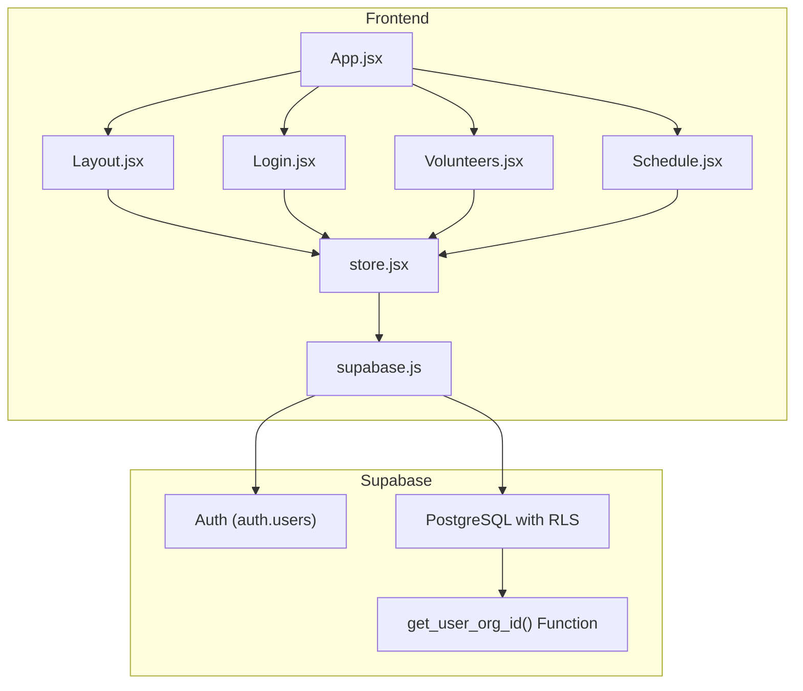
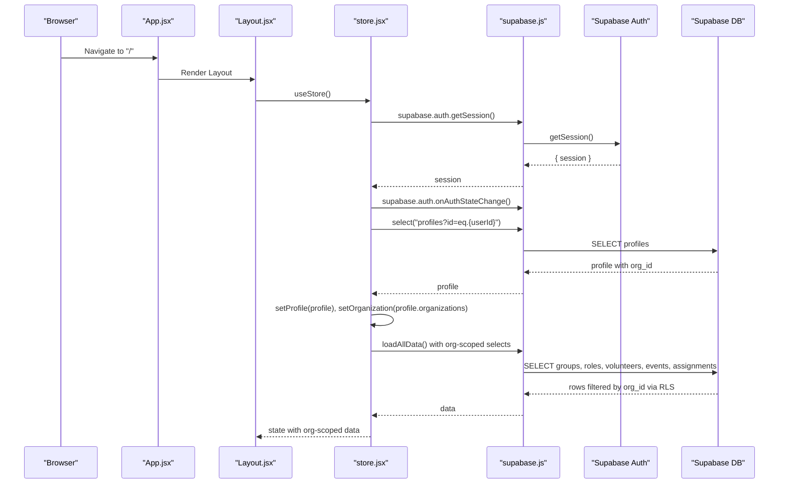
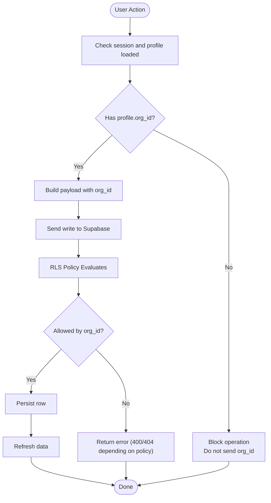
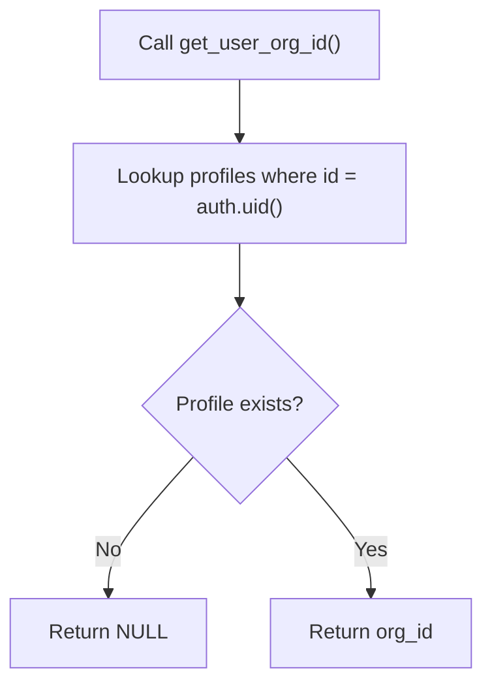
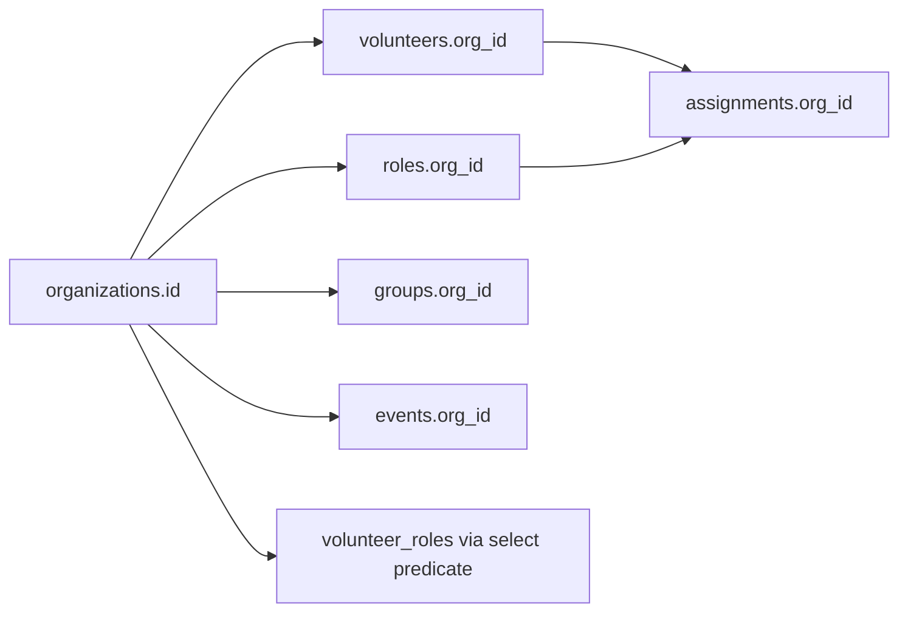
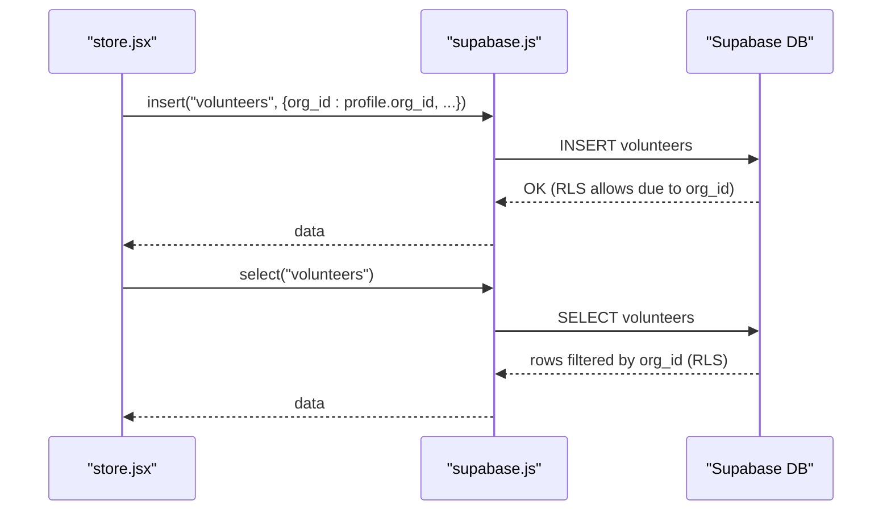
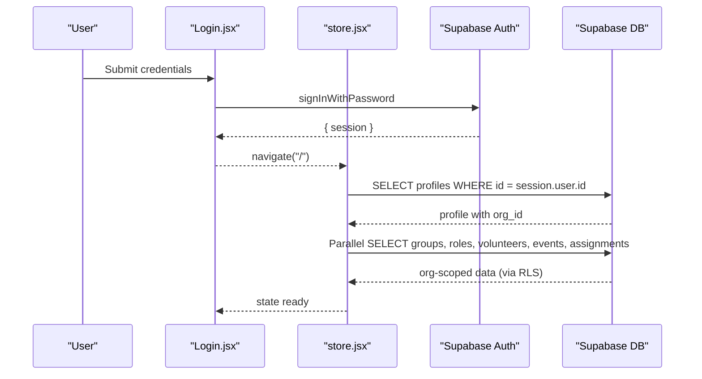
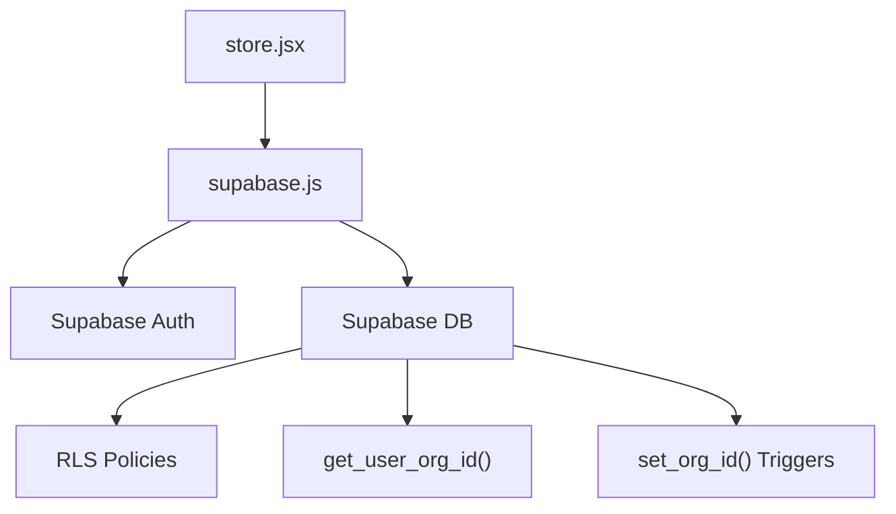

# Security Model

<cite>
**Referenced Files in This Document**
- [supabase-schema.sql](file://supabase-schema.sql)
- [store.jsx](file://src/services/store.jsx)
- [supabase.js](file://src/services/supabase.js)
- [App.jsx](file://src/App.jsx)
- [Layout.jsx](file://src/components/Layout.jsx)
- [Login.jsx](file://src/pages/Login.jsx)
- [Volunteers.jsx](file://src/pages/Volunteers.jsx)
- [Schedule.jsx](file://src/pages/Schedule.jsx)
</cite>

## Table of Contents
1. [Introduction](#introduction)
2. [Project Structure](#project-structure)
3. [Core Components](#core-components)
4. [Architecture Overview](#architecture-overview)
5. [Detailed Component Analysis](#detailed-component-analysis)
6. [Dependency Analysis](#dependency-analysis)
7. [Performance Considerations](#performance-considerations)
8. [Troubleshooting Guide](#troubleshooting-guide)
9. [Conclusion](#conclusion)
10. [Appendices](#appendices)

## Introduction
This document explains RosterFlow’s Row Level Security (RLS) implementation and data access control model. It focuses on organization-based tenant isolation, the get_user_org_id() helper function, and how RLS policies govern select, insert, update, and delete operations across all tables. It also documents the security policy inheritance model where child entities inherit organization context from parent entities, application-level security considerations, and how the frontend interacts with the RLS system. Guidance is included for extending the security model to new entities and custom access patterns.

## Project Structure
RosterFlow’s security model spans three layers:
- Database layer: PostgreSQL with Supabase RLS and helper functions
- Application layer: React frontend using Supabase client for authentication and data access
- Authorization boundary: Organization-based tenant isolation enforced by RLS and enforced in the app

**Diagram sources**
- [App.jsx](file://src/App.jsx#L13-L34)
- [Layout.jsx](file://src/components/Layout.jsx#L14-L107)
- [Login.jsx](file://src/pages/Login.jsx#L5-L25)
- [Volunteers.jsx](file://src/pages/Volunteers.jsx#L7-L123)
- [Schedule.jsx](file://src/pages/Schedule.jsx#L27-L593)
- [store.jsx](file://src/services/store.jsx#L6-L466)
- [supabase.js](file://src/services/supabase.js#L1-L13)
- [supabase-schema.sql](file://supabase-schema.sql#L88-L97)

**Section sources**
- [App.jsx](file://src/App.jsx#L13-L34)
- [store.jsx](file://src/services/store.jsx#L6-L466)
- [supabase.js](file://src/services/supabase.js#L1-L13)

## Core Components
- Organization-based tenant isolation: All tables include org_id and RLS policies enforce per-organization visibility and mutability.
- get_user_org_id(): A server-side helper function that resolves the authenticated user’s organization ID via their profile.
- Frontend enforcement: The store loads the user’s profile and organization, and all writes include org_id to maintain tenant boundaries.

Key implementation anchors:
- RLS enablement and policies across all tables
- get_user_org_id() function definition
- Triggers to auto-fill org_id on inserts
- Frontend store loading profile and organization, and enforcing org_id on writes

**Section sources**
- [supabase-schema.sql](file://supabase-schema.sql#L78-L97)
- [supabase-schema.sql](file://supabase-schema.sql#L88-L97)
- [supabase-schema.sql](file://supabase-schema.sql#L225-L250)
- [store.jsx](file://src/services/store.jsx#L54-L68)
- [store.jsx](file://src/services/store.jsx#L162-L174)
- [store.jsx](file://src/services/store.jsx#L245-L256)
- [store.jsx](file://src/services/store.jsx#L295-L306)
- [store.jsx](file://src/services/store.jsx#L331-L340)
- [store.jsx](file://src/services/store.jsx#L378-L387)

## Architecture Overview
The security architecture enforces organization isolation at two levels:
- Database level: RLS policies and helper function
- Application level: Frontend reads org_id from the user’s profile and writes org_id on all inserts/updates

**Diagram sources**
- [App.jsx](file://src/App.jsx#L13-L34)
- [Layout.jsx](file://src/components/Layout.jsx#L19-L30)
- [store.jsx](file://src/services/store.jsx#L21-L33)
- [store.jsx](file://src/services/store.jsx#L36-L52)
- [store.jsx](file://src/services/store.jsx#L54-L68)
- [store.jsx](file://src/services/store.jsx#L78-L111)
- [supabase.js](file://src/services/supabase.js#L1-L13)

## Detailed Component Analysis

### Organization-based Tenant Isolation
- All tables include org_id and RLS is enabled.
- get_user_org_id() resolves the current user’s org_id from their profile.
- RLS policies use org_id equality checks to enforce tenant boundaries.

**Diagram sources**
- [store.jsx](file://src/services/store.jsx#L162-L174)
- [store.jsx](file://src/services/store.jsx#L245-L256)
- [store.jsx](file://src/services/store.jsx#L295-L306)
- [store.jsx](file://src/services/store.jsx#L331-L340)
- [store.jsx](file://src/services/store.jsx#L378-L387)
- [supabase-schema.sql](file://supabase-schema.sql#L78-L97)

**Section sources**
- [supabase-schema.sql](file://supabase-schema.sql#L78-L97)
- [supabase-schema.sql](file://supabase-schema.sql#L88-L97)

### get_user_org_id() Helper Function
- Purpose: Resolve the authenticated user’s organization ID from their profile.
- Implementation: Reads org_id from profiles where id equals auth.uid().
- Security: Defined with SECURITY DEFINER to execute under database privileges, ensuring reliable access to org_id.

**Diagram sources**
- [supabase-schema.sql](file://supabase-schema.sql#L88-L97)

**Section sources**
- [supabase-schema.sql](file://supabase-schema.sql#L88-L97)

### Security Policy Inheritance Model
Child entities inherit organization context from their parents:
- volunteers inherits org_id from the organization that owns the volunteer record
- roles inherits org_id from the organization that owns the role record
- groups inherits org_id from the organization that owns the group record
- events inherits org_id from the organization that owns the event record
- assignments inherits org_id from the organization that owns the assignment record
- volunteer_roles is scoped via a select predicate that ensures the volunteer belongs to the user’s organization

**Diagram sources**
- [supabase-schema.sql](file://supabase-schema.sql#L40-L76)
- [supabase-schema.sql](file://supabase-schema.sql#L172-L189)

**Section sources**
- [supabase-schema.sql](file://supabase-schema.sql#L40-L76)
- [supabase-schema.sql](file://supabase-schema.sql#L172-L189)

### RLS Policies by Table
Below are the RLS policies applied to each table. The “Using” clauses enforce visibility, while “With CHECK” clauses enforce write constraints.

- organizations
  - Select: id equals get_user_org_id()
  - Insert: permitted with CHECK true (application-enforced org creation)
- profiles
  - Select: org_id equals get_user_org_id()
  - Insert: id equals auth.uid()
  - Update: id equals auth.uid
- groups
  - Select/Insert/Update/Delete: org_id equals get_user_org_id()
- roles
  - Select/Insert/Update/Delete: org_id equals get_user_org_id()
- volunteers
  - Select/Insert/Update/Delete: org_id equals get_user_org_id()
- volunteer_roles
  - Select/Insert/Delete: volunteer_id is in (SELECT id FROM volunteers WHERE org_id equals get_user_org_id())
- events
  - Select/Insert/Update/Delete: org_id equals get_user_org_id()
- assignments
  - Select/Insert/Update/Delete: org_id equals get_user_org_id()

Notes:
- The policies ensure that users can only see and modify records within their own organization.
- The volunteer_roles policy indirectly enforces organization boundaries by constraining the set of allowed volunteer_ids.

**Section sources**
- [supabase-schema.sql](file://supabase-schema.sql#L99-L107)
- [supabase-schema.sql](file://supabase-schema.sql#L108-L120)
- [supabase-schema.sql](file://supabase-schema.sql#L121-L137)
- [supabase-schema.sql](file://supabase-schema.sql#L138-L154)
- [supabase-schema.sql](file://supabase-schema.sql#L155-L171)
- [supabase-schema.sql](file://supabase-schema.sql#L172-L189)
- [supabase-schema.sql](file://supabase-schema.sql#L191-L207)
- [supabase-schema.sql](file://supabase-schema.sql#L208-L224)

### Application-level Security Considerations
- Authentication state: The store subscribes to auth state changes and loads the user’s profile and organization.
- Profile loading: The store queries profiles with a join to organizations to populate org_id and organization name.
- Data loading: All reads are org-scoped by relying on RLS; the store does not manually filter by org_id because RLS handles it server-side.
- Writes: The store injects org_id into all insert/update operations to satisfy RLS “with check” policies and maintain tenant boundaries.
- Triggers: Optional triggers auto-fill org_id on insert for several tables, reducing risk of missing org_id in the application.

**Diagram sources**
- [store.jsx](file://src/services/store.jsx#L162-L174)
- [store.jsx](file://src/services/store.jsx#L78-L111)
- [supabase.js](file://src/services/supabase.js#L1-L13)
- [supabase-schema.sql](file://supabase-schema.sql#L78-L97)

**Section sources**
- [store.jsx](file://src/services/store.jsx#L36-L52)
- [store.jsx](file://src/services/store.jsx#L54-L68)
- [store.jsx](file://src/services/store.jsx#L78-L111)
- [store.jsx](file://src/services/store.jsx#L162-L174)
- [store.jsx](file://src/services/store.jsx#L245-L256)
- [store.jsx](file://src/services/store.jsx#L295-L306)
- [store.jsx](file://src/services/store.jsx#L331-L340)
- [store.jsx](file://src/services/store.jsx#L378-L387)
- [supabase-schema.sql](file://supabase-schema.sql#L225-L250)

### Frontend Interaction with RLS
- Auth guard: Layout redirects unauthenticated users to landing.
- Login: Uses Supabase auth to sign in; on success, the store subscribes to auth state and loads profile/data.
- Data display: Components render lists filtered locally (e.g., Volunteers page filters volunteers by name/email), but the underlying dataset is already org-scoped by the store and enforced by RLS.
- Mutations: Components delegate CRUD actions to the store, which ensures org_id is included in writes.

**Diagram sources**
- [Layout.jsx](file://src/components/Layout.jsx#L19-L30)
- [Login.jsx](file://src/pages/Login.jsx#L14-L25)
- [store.jsx](file://src/services/store.jsx#L36-L52)
- [store.jsx](file://src/services/store.jsx#L54-L68)
- [store.jsx](file://src/services/store.jsx#L78-L111)

**Section sources**
- [Layout.jsx](file://src/components/Layout.jsx#L19-L30)
- [Login.jsx](file://src/pages/Login.jsx#L14-L25)
- [store.jsx](file://src/services/store.jsx#L36-L52)
- [store.jsx](file://src/services/store.jsx#L54-L68)
- [store.jsx](file://src/services/store.jsx#L78-L111)

### Secure Query Patterns and Common Scenarios
- Loading org-scoped data
  - Pattern: After auth state change, load profile and then perform parallel reads against all tables. RLS filters results server-side.
  - Anchor: [store.jsx](file://src/services/store.jsx#L36-L52), [store.jsx](file://src/services/store.jsx#L78-L111)
- Writing with org_id
  - Pattern: On insert/update, include org_id equal to profile.org_id. This satisfies RLS “with check” policies.
  - Anchors: [store.jsx](file://src/services/store.jsx#L162-L174), [store.jsx](file://src/services/store.jsx#L245-L256), [store.jsx](file://src/services/store.jsx#L295-L306), [store.jsx](file://src/services/store.jsx#L331-L340), [store.jsx](file://src/services/store.jsx#L378-L387)
- Relationship-scoped writes
  - Pattern: Assignments require event_id, role_id, and volunteer_id to belong to the same org_id. Since assignments inherit org_id from the organization, and child entities are constrained by foreign keys, the org_id is preserved across relationships.
  - Anchor: [supabase-schema.sql](file://supabase-schema.sql#L67-L76)
- Many-to-many joins
  - Pattern: volunteer_roles is constrained so that volunteer_id belongs to the user’s organization, preventing cross-org linking.
  - Anchor: [supabase-schema.sql](file://supabase-schema.sql#L172-L189)

**Section sources**
- [store.jsx](file://src/services/store.jsx#L36-L52)
- [store.jsx](file://src/services/store.jsx#L78-L111)
- [store.jsx](file://src/services/store.jsx#L162-L174)
- [store.jsx](file://src/services/store.jsx#L245-L256)
- [store.jsx](file://src/services/store.jsx#L295-L306)
- [store.jsx](file://src/services/store.jsx#L331-L340)
- [store.jsx](file://src/services/store.jsx#L378-L387)
- [supabase-schema.sql](file://supabase-schema.sql#L67-L76)
- [supabase-schema.sql](file://supabase-schema.sql#L172-L189)

### Extending the Security Model
Guidance for adding new entities and custom access patterns:
- Add org_id column and foreign key to parent if applicable
- Enable RLS on the new table
- Define policies:
  - Select: org_id equals get_user_org_id()
  - Insert: org_id equals get_user_org_id() via WITH CHECK
  - Update/Delete: org_id equals get_user_org_id()
- Consider a helper function for derived org_id if needed (e.g., for join tables)
- If applicable, add a trigger to auto-fill org_id on insert
- Ensure the frontend:
  - Loads profile and organization on auth state change
  - Injects org_id into all writes
  - Relies on RLS for visibility (do not filter client-side beyond UI concerns)

Anchors for reference:
- [supabase-schema.sql](file://supabase-schema.sql#L78-L97)
- [supabase-schema.sql](file://supabase-schema.sql#L225-L250)
- [store.jsx](file://src/services/store.jsx#L36-L52)
- [store.jsx](file://src/services/store.jsx#L54-L68)
- [store.jsx](file://src/services/store.jsx#L162-L174)

**Section sources**
- [supabase-schema.sql](file://supabase-schema.sql#L78-L97)
- [supabase-schema.sql](file://supabase-schema.sql#L225-L250)
- [store.jsx](file://src/services/store.jsx#L36-L52)
- [store.jsx](file://src/services/store.jsx#L54-L68)
- [store.jsx](file://src/services/store.jsx#L162-L174)

## Dependency Analysis
- Frontend depends on Supabase client for auth and data
- store.jsx orchestrates auth state, profile loading, and org-scoped data loading
- Supabase DB enforces RLS policies and helper function
- Triggers assist in maintaining org_id consistency

**Diagram sources**
- [store.jsx](file://src/services/store.jsx#L6-L466)
- [supabase.js](file://src/services/supabase.js#L1-L13)
- [supabase-schema.sql](file://supabase-schema.sql#L78-L97)
- [supabase-schema.sql](file://supabase-schema.sql#L88-L97)
- [supabase-schema.sql](file://supabase-schema.sql#L225-L250)

**Section sources**
- [store.jsx](file://src/services/store.jsx#L6-L466)
- [supabase.js](file://src/services/supabase.js#L1-L13)
- [supabase-schema.sql](file://supabase-schema.sql#L78-L97)
- [supabase-schema.sql](file://supabase-schema.sql#L88-L97)
- [supabase-schema.sql](file://supabase-schema.sql#L225-L250)

## Performance Considerations
- RLS evaluation occurs server-side; keep policies simple (as in this codebase) to minimize overhead.
- Use targeted selects with ordering and limit where appropriate to reduce payload sizes.
- Parallelize initial data loads to improve perceived performance while preserving org-scoping guarantees.

## Troubleshooting Guide
Common issues and resolutions:
- Unauthorized errors on reads/writes
  - Verify that the user’s profile contains org_id and that the store is loading it on auth state change.
  - Confirm that RLS policies are enabled and that org_id matches the user’s org_id.
  - Anchor: [store.jsx](file://src/services/store.jsx#L36-L52), [store.jsx](file://src/services/store.jsx#L54-L68), [supabase-schema.sql](file://supabase-schema.sql#L78-L97)
- Missing org_id on insert
  - Ensure the frontend injects profile.org_id into writes.
  - Anchor: [store.jsx](file://src/services/store.jsx#L162-L174), [store.jsx](file://src/services/store.jsx#L245-L256), [store.jsx](file://src/services/store.jsx#L295-L306), [store.jsx](file://src/services/store.jsx#L331-L340), [store.jsx](file://src/services/store.jsx#L378-L387)
- volunteer_roles constraint failures
  - Ensure the volunteer_id belongs to the user’s organization; the policy restricts allowed volunteer_ids accordingly.
  - Anchor: [supabase-schema.sql](file://supabase-schema.sql#L172-L189)
- Unexpected empty datasets
  - Confirm that the user is logged into the correct account and that their profile org_id is correct.
  - Anchor: [store.jsx](file://src/services/store.jsx#L54-L68)

**Section sources**
- [store.jsx](file://src/services/store.jsx#L36-L52)
- [store.jsx](file://src/services/store.jsx#L54-L68)
- [store.jsx](file://src/services/store.jsx#L162-L174)
- [store.jsx](file://src/services/store.jsx#L245-L256)
- [store.jsx](file://src/services/store.jsx#L295-L306)
- [store.jsx](file://src/services/store.jsx#L331-L340)
- [store.jsx](file://src/services/store.jsx#L378-L387)
- [supabase-schema.sql](file://supabase-schema.sql#L172-L189)
- [supabase-schema.sql](file://supabase-schema.sql#L78-L97)

## Conclusion
RosterFlow’s security model centers on organization-based tenant isolation enforced by Supabase RLS and a helper function that resolves the current user’s org_id. The frontend complements this by loading the user’s profile and organization, and by injecting org_id into all writes. The inheritance model ensures child entities remain within their parent’s organization, and the many-to-many join is constrained to prevent cross-organization associations. Together, these mechanisms provide strong, layered protection for multi-tenant data.

## Appendices
- Appendix A: Frontend Pages Interacting with Security
  - Login page triggers auth and indirectly leads to org-scoped data loading.
  - Volunteers page displays and edits org-scoped volunteers and roles.
  - Schedule page manages assignments and relies on org-scoped events and roles.
  - Anchors: [Login.jsx](file://src/pages/Login.jsx#L14-L25), [Volunteers.jsx](file://src/pages/Volunteers.jsx#L7-L123), [Schedule.jsx](file://src/pages/Schedule.jsx#L27-L593)

**Section sources**
- [Login.jsx](file://src/pages/Login.jsx#L14-L25)
- [Volunteers.jsx](file://src/pages/Volunteers.jsx#L7-L123)
- [Schedule.jsx](file://src/pages/Schedule.jsx#L27-L593)