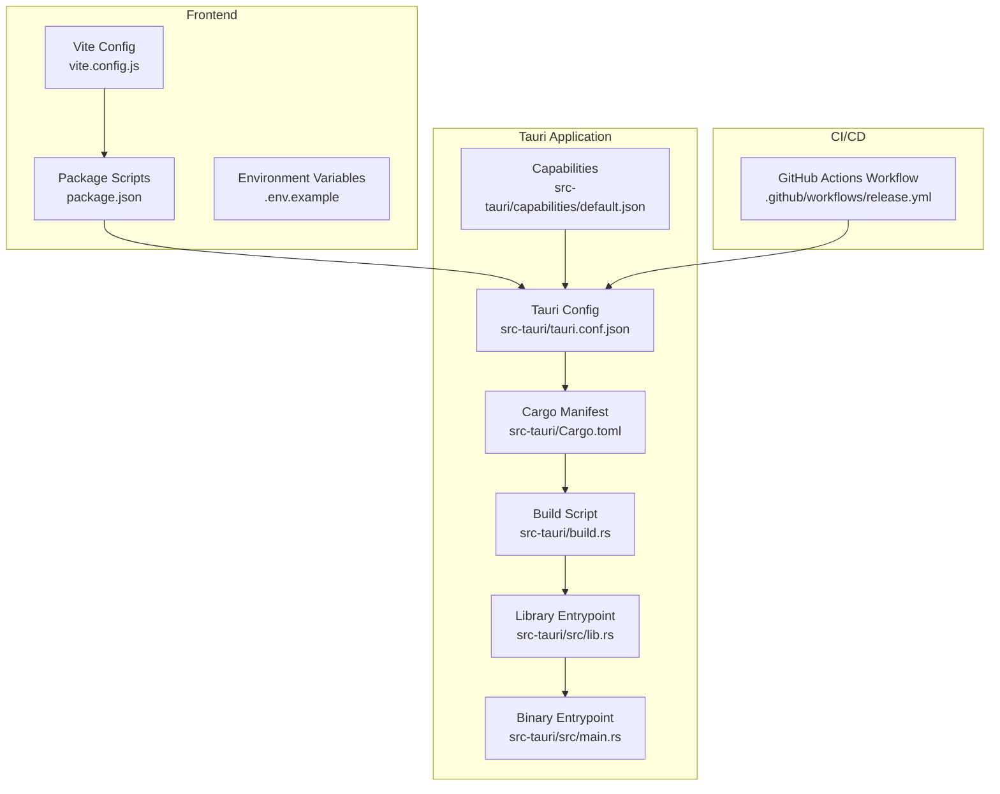
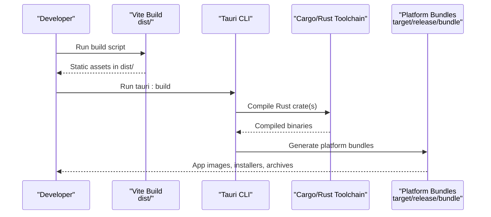
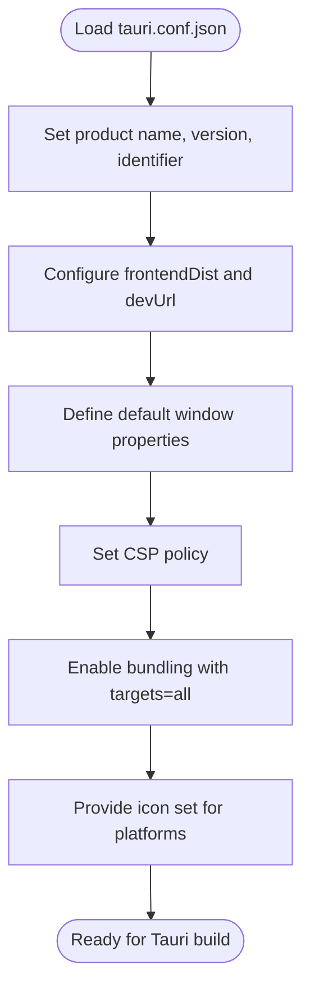
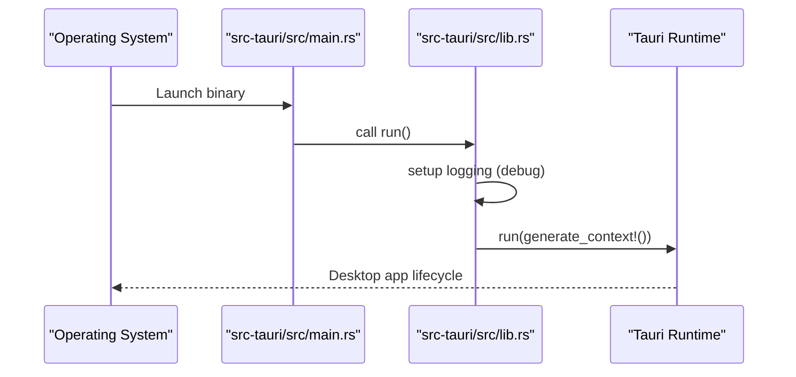
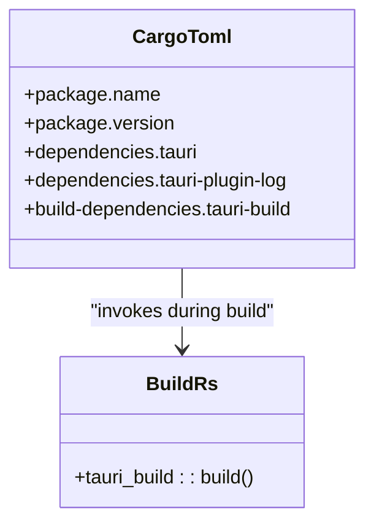
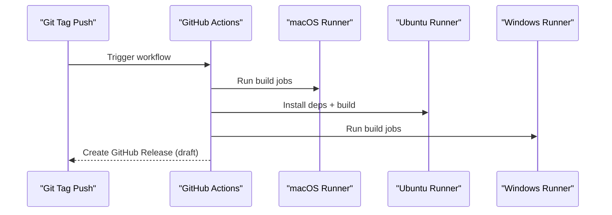
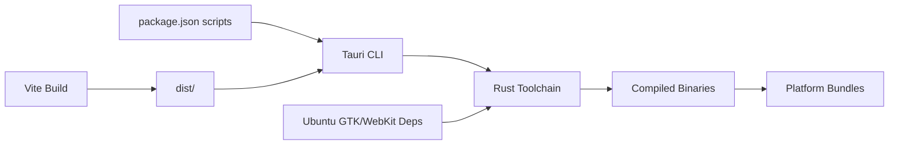

# Cross-Platform Building

<cite>
**Referenced Files in This Document**
- [package.json](file://package.json)
- [vite.config.js](file://vite.config.js)
- [.env.example](file://.env.example)
- [src-tauri/tauri.conf.json](file://src-tauri/tauri.conf.json)
- [src-tauri/Cargo.toml](file://src-tauri/Cargo.toml)
- [src-tauri/build.rs](file://src-tauri/build.rs)
- [src-tauri/src/main.rs](file://src-tauri/src/main.rs)
- [src-tauri/src/lib.rs](file://src-tauri/src/lib.rs)
- [src-tauri/capabilities/default.json](file://src-tauri/capabilities/default.json)
- [.github/workflows/release.yml](file://.github/workflows/release.yml)
- [ELECTRON_BUILD.md](file://ELECTRON_BUILD.md)
</cite>

## Table of Contents
1. [Introduction](#introduction)
2. [Project Structure](#project-structure)
3. [Core Components](#core-components)
4. [Architecture Overview](#architecture-overview)
5. [Detailed Component Analysis](#detailed-component-analysis)
6. [Dependency Analysis](#dependency-analysis)
7. [Performance Considerations](#performance-considerations)
8. [Troubleshooting Guide](#troubleshooting-guide)
9. [Conclusion](#conclusion)
10. [Appendices](#appendices)

## Introduction
This document explains how to build a cross-platform desktop application using Tauri for Windows, macOS, and Linux. It covers build configuration in tauri.conf.json, platform-specific prerequisites, GitHub Actions automation for releases, and step-by-step instructions for development and production builds. It also outlines code signing considerations for macOS and Windows distribution and provides troubleshooting guidance for common build issues.

## Project Structure
The project uses a hybrid frontend (React + Vite) bundled into a Tauri desktop shell. The Tauri application is defined under src-tauri with Rust sources, configuration, and icons. The frontend build artifacts are placed into dist/, which Tauri consumes during bundling.

**Diagram sources**
- [vite.config.js](file://vite.config.js#L1-L10)
- [package.json](file://package.json#L1-L44)
- [.env.example](file://.env.example#L1-L5)
- [src-tauri/tauri.conf.json](file://src-tauri/tauri.conf.json#L1-L35)
- [src-tauri/Cargo.toml](file://src-tauri/Cargo.toml#L1-L26)
- [src-tauri/build.rs](file://src-tauri/build.rs#L1-L4)
- [src-tauri/src/lib.rs](file://src-tauri/src/lib.rs#L1-L17)
- [src-tauri/src/main.rs](file://src-tauri/src/main.rs#L1-L7)
- [src-tauri/capabilities/default.json](file://src-tauri/capabilities/default.json#L1-L12)
- [.github/workflows/release.yml](file://.github/workflows/release.yml#L1-L49)

**Section sources**
- [package.json](file://package.json#L1-L44)
- [vite.config.js](file://vite.config.js#L1-L10)
- [.env.example](file://.env.example#L1-L5)
- [src-tauri/tauri.conf.json](file://src-tauri/tauri.conf.json#L1-L35)
- [src-tauri/Cargo.toml](file://src-tauri/Cargo.toml#L1-L26)
- [src-tauri/build.rs](file://src-tauri/build.rs#L1-L4)
- [src-tauri/src/lib.rs](file://src-tauri/src/lib.rs#L1-L17)
- [src-tauri/src/main.rs](file://src-tauri/src/main.rs#L1-L7)
- [src-tauri/capabilities/default.json](file://src-tauri/capabilities/default.json#L1-L12)
- [.github/workflows/release.yml](file://.github/workflows/release.yml#L1-L49)

## Core Components
- Frontend build pipeline: React + Vite produces static assets in dist/.
- Tauri configuration: tauri.conf.json defines product metadata, bundling targets, icons, and window settings.
- Rust application: src-tauri contains the Tauri app’s Rust crate, with a library entrypoint that initializes logging and runs the Tauri runtime.
- CI automation: A GitHub Actions workflow builds and releases the app for macOS, Ubuntu, and Windows.

Key build commands:
- Development: npm run tauri:dev launches the Tauri dev server with hot reload.
- Production: npm run tauri:build generates platform bundles.

Output directories:
- dist/: Built frontend assets consumed by Tauri.
- src-tauri/target/release/bundle/: Platform-specific bundles generated by Tauri.

**Section sources**
- [package.json](file://package.json#L7-L13)
- [src-tauri/tauri.conf.json](file://src-tauri/tauri.conf.json#L6-L34)
- [src-tauri/src/lib.rs](file://src-tauri/src/lib.rs#L1-L17)
- [src-tauri/src/main.rs](file://src-tauri/src/main.rs#L1-L7)

## Architecture Overview
The build pipeline integrates Vite for frontend compilation and Tauri for native bundling. The Tauri CLI coordinates Rust compilation and packaging, using tauri.conf.json for configuration and icons.

**Diagram sources**
- [package.json](file://package.json#L10-L11)
- [src-tauri/tauri.conf.json](file://src-tauri/tauri.conf.json#L6-L34)
- [src-tauri/Cargo.toml](file://src-tauri/Cargo.toml#L1-L26)

## Detailed Component Analysis

### Tauri Configuration (tauri.conf.json)
- Product identity and version: productName, version, identifier.
- Build integration: frontendDist points to dist/ and devUrl to the Vite dev server.
- Window configuration: default window size, resizable/fullscreen settings.
- Security: CSP set to null.
- Bundling: targets set to "all" to produce bundles for all supported platforms; icons include PNG, ICNS, and ICO variants.

**Diagram sources**
- [src-tauri/tauri.conf.json](file://src-tauri/tauri.conf.json#L1-L35)

**Section sources**
- [src-tauri/tauri.conf.json](file://src-tauri/tauri.conf.json#L1-L35)

### Rust Application Entrypoints
- Library entrypoint: Initializes logging in debug mode and runs Tauri with generated context.
- Binary entrypoint: Prevents extra console window on Windows in release and delegates to the library entrypoint.

**Diagram sources**
- [src-tauri/src/main.rs](file://src-tauri/src/main.rs#L1-L7)
- [src-tauri/src/lib.rs](file://src-tauri/src/lib.rs#L1-L17)

**Section sources**
- [src-tauri/src/main.rs](file://src-tauri/src/main.rs#L1-L7)
- [src-tauri/src/lib.rs](file://src-tauri/src/lib.rs#L1-L17)

### Cargo Manifest and Build Script
- Cargo.toml defines the Rust crate, edition, dependencies (including Tauri and log plugin), and build dependencies (tauri-build).
- build.rs invokes tauri_build::build to generate Tauri scaffolding and resources during compilation.

**Diagram sources**
- [src-tauri/Cargo.toml](file://src-tauri/Cargo.toml#L1-L26)
- [src-tauri/build.rs](file://src-tauri/build.rs#L1-L4)

**Section sources**
- [src-tauri/Cargo.toml](file://src-tauri/Cargo.toml#L1-L26)
- [src-tauri/build.rs](file://src-tauri/build.rs#L1-L4)

### Capabilities and Permissions
- default.json enables default permissions and binds the capability to the main window, ensuring the app has appropriate access during runtime.

**Section sources**
- [src-tauri/capabilities/default.json](file://src-tauri/capabilities/default.json#L1-L12)

### GitHub Actions Release Pipeline
- Triggers on Git tags prefixed with v*.
- Matrix builds on macOS, Ubuntu 22.04, and Windows runners.
- Installs Node.js LTS, Rust stable, and platform-specific GTK/WebKit dependencies on Ubuntu.
- Installs frontend dependencies and runs tauri-action to build and draft releases.

**Diagram sources**
- [.github/workflows/release.yml](file://.github/workflows/release.yml#L1-L49)

**Section sources**
- [.github/workflows/release.yml](file://.github/workflows/release.yml#L1-L49)

### Frontend Build and Environment
- Vite configuration sets base to "./" for relative asset resolution.
- Environment variables for Supabase are defined in .env.example.
- package.json scripts expose tauri:dev and tauri:build for Tauri workflows.

**Section sources**
- [vite.config.js](file://vite.config.js#L1-L10)
- [.env.example](file://.env.example#L1-L5)
- [package.json](file://package.json#L7-L13)

## Dependency Analysis
- Tauri CLI and Rust toolchain are required for building the desktop app.
- Frontend dependencies (React, Vite) are needed to produce dist/.
- Platform-specific system libraries are required on Linux (Ubuntu) for webview and GTK components.

**Diagram sources**
- [package.json](file://package.json#L7-L13)
- [vite.config.js](file://vite.config.js#L1-L10)
- [src-tauri/tauri.conf.json](file://src-tauri/tauri.conf.json#L6-L34)
- [.github/workflows/release.yml](file://.github/workflows/release.yml#L29-L35)

**Section sources**
- [package.json](file://package.json#L7-L13)
- [.github/workflows/release.yml](file://.github/workflows/release.yml#L29-L35)
- [src-tauri/tauri.conf.json](file://src-tauri/tauri.conf.json#L6-L34)

## Performance Considerations
- Keep frontend assets optimized; avoid large static resources in dist/ to reduce bundle size.
- Use debug builds for development and release builds for production to leverage optimizations.
- On Linux, ensure system dependencies are installed to prevent rebuild failures and long compile times.

## Troubleshooting Guide
Common issues and resolutions:
- Missing Rust toolchain: Install Rust stable via rustup or the Rust toolchain action in CI.
- Missing Linux GTK/WebKit dependencies: Install libgtk-3-dev, libwebkit2gtk-4.1-dev, libappindicator3-dev, librsvg2-dev, and patchelf on Ubuntu.
- Vite dev URL mismatch: Ensure devUrl in tauri.conf.json matches the Vite dev server address.
- Empty dist/: Run the frontend build script to generate dist/ before tauri:build.
- Capability permission errors: Verify capabilities/default.json grants required permissions for the main window.
- CI build failures on Ubuntu: Confirm the dependency installation step runs only on ubuntu-22.04 matrix jobs.

**Section sources**
- [.github/workflows/release.yml](file://.github/workflows/release.yml#L26-L35)
- [src-tauri/tauri.conf.json](file://src-tauri/tauri.conf.json#L6-L9)
- [src-tauri/capabilities/default.json](file://src-tauri/capabilities/default.json#L1-L12)
- [package.json](file://package.json#L10-L11)

## Conclusion
This project integrates a React + Vite frontend with a Tauri desktop runtime, configured via tauri.conf.json and built with Rust. The GitHub Actions workflow automates cross-platform builds and releases. By following the prerequisites, build commands, and troubleshooting steps outlined here, you can reliably develop and ship desktop applications for Windows, macOS, and Linux.

## Appendices

### Step-by-Step Build Instructions

- Development environment
  - Install Node.js and npm.
  - Install Rust stable toolchain.
  - Install Linux system dependencies (Ubuntu): libgtk-3-dev, libwebkit2gtk-4.1-dev, libappindicator3-dev, librsvg2-dev, patchelf.
  - Install frontend dependencies: npm install.
  - Start development: npm run tauri:dev.

- Production build
  - Build frontend: npm run build.
  - Build Tauri app: npm run tauri:build.
  - Artifacts appear under src-tauri/target/release/bundle.

- CI/CD (GitHub Actions)
  - Push a tag v* to trigger the workflow.
  - The job matrix builds on macOS, ubuntu-22.04, and windows-latest.
  - The tauri-action step creates a GitHub Release draft with platform bundles.

**Section sources**
- [.github/workflows/release.yml](file://.github/workflows/release.yml#L1-L49)
- [package.json](file://package.json#L7-L13)
- [.github/workflows/release.yml](file://.github/workflows/release.yml#L26-L35)
- [src-tauri/tauri.conf.json](file://src-tauri/tauri.conf.json#L6-L34)

### Platform-Specific Requirements

- Windows
  - Use Windows to build Windows binaries.
  - No additional system libraries required beyond the Rust toolchain and Node.js.

- macOS
  - Use macOS to build macOS binaries.
  - No additional system libraries required beyond the Rust toolchain and Node.js.

- Linux (Ubuntu)
  - Install GTK and WebKit system libraries as shown in the CI workflow.
  - These are required for the webview and app indicators.

**Section sources**
- [.github/workflows/release.yml](file://.github/workflows/release.yml#L29-L35)

### Code Signing and Distribution Notes

- macOS
  - Sign the app and notarize for distribution outside the Mac App Store. Configure signing identities and entitlements in Tauri configuration as needed for your distribution channel.

- Windows
  - Sign the installer and binaries with a trusted code-signing certificate. Use Tauri’s bundler configuration to embed signing certificates and timestamps.

- Linux
  - Distribute as AppImage, DEB, RPM, or tar.gz. Code signing is optional but recommended for enterprise channels.

[No sources needed since this section provides general guidance]

### Related Build Information (Electron)
- The repository includes an Electron build guide and output locations for Windows installers and portable executables. This is separate from the Tauri build described above.

**Section sources**
- [ELECTRON_BUILD.md](file://ELECTRON_BUILD.md#L1-L41)