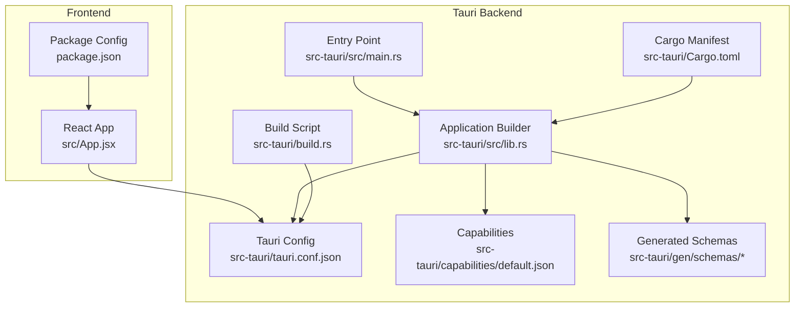
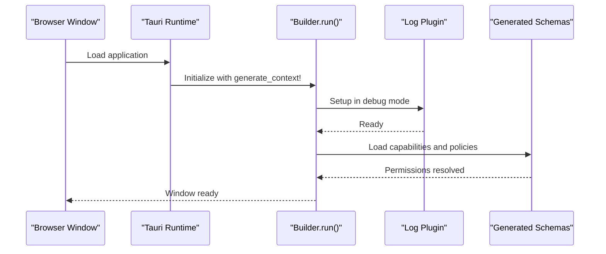
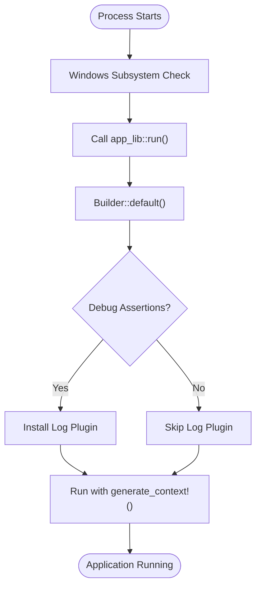
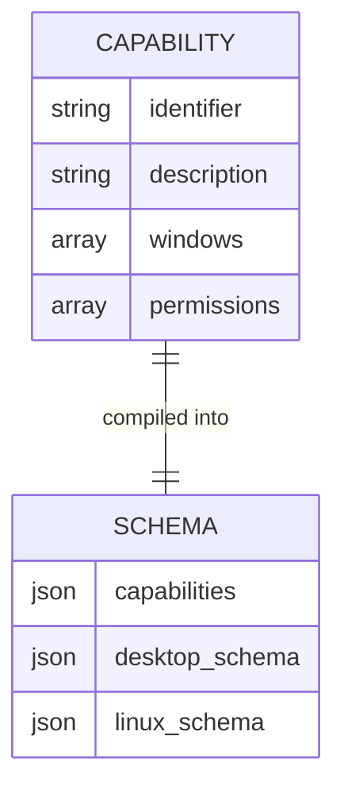
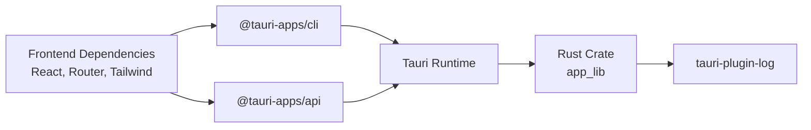

# Desktop API Integration

<cite>
**Referenced Files in This Document**
- [Cargo.toml](file://src-tauri/Cargo.toml)
- [tauri.conf.json](file://src-tauri/tauri.conf.json)
- [main.rs](file://src-tauri/src/main.rs)
- [lib.rs](file://src-tauri/src/lib.rs)
- [default.json](file://src-tauri/capabilities/default.json)
- [capabilities.json](file://src-tauri/gen/schemas/capabilities.json)
- [build.rs](file://src-tauri/build.rs)
- [package.json](file://package.json)
- [App.jsx](file://src/App.jsx)
</cite>

## Table of Contents
1. [Introduction](#introduction)
2. [Project Structure](#project-structure)
3. [Core Components](#core-components)
4. [Architecture Overview](#architecture-overview)
5. [Detailed Component Analysis](#detailed-component-analysis)
6. [Dependency Analysis](#dependency-analysis)
7. [Performance Considerations](#performance-considerations)
8. [Troubleshooting Guide](#troubleshooting-guide)
9. [Conclusion](#conclusion)
10. [Appendices](#appendices)

## Introduction
This document explains how the desktop application integrates with Tauri's desktop APIs, focusing on the Rust-based backend implementation, capability configuration, and permission management. It also outlines how to extend the application with custom commands and system integrations, documents the security model and capability restrictions, and provides guidance on performance, debugging, and accessing system resources.

## Project Structure
The desktop application is organized into two primary parts:
- Frontend: React application built with Vite and served inside the Tauri window.
- Backend: Rust-based Tauri application under src-tauri, responsible for window lifecycle, plugins, and capabilities.

Key configuration and build files:
- Application configuration and bundling settings are defined in tauri.conf.json.
- Build pipeline is driven by build.rs and tauri_build.
- Capabilities define which Tauri APIs and windows are permitted at runtime.
- Cargo.toml defines Rust dependencies and crate types.

**Diagram sources**
- [main.rs](file://src-tauri/src/main.rs#L1-L7)
- [lib.rs](file://src-tauri/src/lib.rs#L1-L17)
- [tauri.conf.json](file://src-tauri/tauri.conf.json#L1-L35)
- [default.json](file://src-tauri/capabilities/default.json#L1-L12)
- [capabilities.json](file://src-tauri/gen/schemas/capabilities.json#L1-L1)
- [build.rs](file://src-tauri/build.rs#L1-L4)
- [Cargo.toml](file://src-tauri/Cargo.toml#L1-L26)
- [package.json](file://package.json#L1-L44)
- [App.jsx](file://src/App.jsx#L1-L37)

**Section sources**
- [tauri.conf.json](file://src-tauri/tauri.conf.json#L1-L35)
- [Cargo.toml](file://src-tauri/Cargo.toml#L1-L26)
- [main.rs](file://src-tauri/src/main.rs#L1-L7)
- [lib.rs](file://src-tauri/src/lib.rs#L1-L17)
- [default.json](file://src-tauri/capabilities/default.json#L1-L12)
- [capabilities.json](file://src-tauri/gen/schemas/capabilities.json#L1-L1)
- [build.rs](file://src-tauri/build.rs#L1-L4)
- [package.json](file://package.json#L1-L44)
- [App.jsx](file://src/App.jsx#L1-L37)

## Core Components
- Application entry point: The Windows subsystem configuration prevents an extra console window in release builds, and the main function delegates to the Rust library's run function.
- Application builder: The builder sets up logging in debug mode and runs the Tauri context, initializing the window and security policies.
- Capabilities: The default capability enables core permissions and targets the main window, forming the baseline for what the frontend can access via Tauri’s IPC.

What this means for desktop integration:
- Window lifecycle and appearance are configured centrally.
- Logging is enabled during development for easier diagnostics.
- Permission boundaries are enforced by the capability manifest.

**Section sources**
- [main.rs](file://src-tauri/src/main.rs#L1-L7)
- [lib.rs](file://src-tauri/src/lib.rs#L1-L17)
- [default.json](file://src-tauri/capabilities/default.json#L1-L12)
- [capabilities.json](file://src-tauri/gen/schemas/capabilities.json#L1-L1)

## Architecture Overview
The desktop architecture follows a clear separation of concerns:
- Frontend (React) renders UI and triggers actions.
- Tauri backend (Rust) manages windows, plugins, and capabilities.
- IPC bridges the frontend and backend, enabling secure access to system features.

**Diagram sources**
- [lib.rs](file://src-tauri/src/lib.rs#L1-L17)
- [default.json](file://src-tauri/capabilities/default.json#L1-L12)
- [capabilities.json](file://src-tauri/gen/schemas/capabilities.json#L1-L1)

## Detailed Component Analysis

### Rust Backend Implementation
The backend is minimal but foundational:
- Entry point: Sets platform-specific subsystem behavior and calls the library run function.
- Library run: Initializes Tauri with a default builder, conditionally installs a log plugin in debug mode, and starts the application with generated context.

**Diagram sources**
- [main.rs](file://src-tauri/src/main.rs#L1-L7)
- [lib.rs](file://src-tauri/src/lib.rs#L1-L17)

**Section sources**
- [main.rs](file://src-tauri/src/main.rs#L1-L7)
- [lib.rs](file://src-tauri/src/lib.rs#L1-L17)

### Capability Configuration and Permission Management
Capabilities define which Tauri APIs and windows are available at runtime:
- Identifier and description: Human-readable metadata for the capability.
- Windows: Lists which windows the capability applies to (e.g., main).
- Permissions: Grants access to core permissions and other Tauri modules.

Generated schemas reflect the compiled capability set and are consumed by the runtime to enforce policy.

**Diagram sources**
- [default.json](file://src-tauri/capabilities/default.json#L1-L12)
- [capabilities.json](file://src-tauri/gen/schemas/capabilities.json#L1-L1)

**Section sources**
- [default.json](file://src-tauri/capabilities/default.json#L1-L12)
- [capabilities.json](file://src-tauri/gen/schemas/capabilities.json#L1-L1)

### Available Tauri APIs and Extensions
Current configuration grants core permissions and targets the main window. To extend functionality:
- Add new capabilities for additional permissions (e.g., dialogs, global shortcuts, system tray).
- Register custom commands in Rust and expose them to the frontend via Tauri’s IPC.
- Integrate system notifications, file system access, and inter-process communication through Tauri plugins and commands.

Note: The current repository does not include custom commands or advanced plugins. Extending the application requires adding Rust command handlers and updating capabilities accordingly.

[No sources needed since this section provides general guidance]

### Security Model and Capability Restrictions
Security is enforced by:
- Capability manifests limiting which APIs can be invoked.
- Generated schemas validating permissions at build/runtime.
- CSP configuration in tauri.conf.json allowing flexible security policies.

Restrictions:
- Without explicit capability grants, certain APIs remain unavailable.
- Plugins and commands require both capability permissions and Rust-side registration.

**Section sources**
- [tauri.conf.json](file://src-tauri/tauri.conf.json#L20-L22)
- [default.json](file://src-tauri/capabilities/default.json#L8-L10)
- [capabilities.json](file://src-tauri/gen/schemas/capabilities.json#L1-L1)

### Implementing Desktop-Specific Features
Examples of desktop integrations (conceptual):
- System tray: Define a capability granting tray permissions and register a Rust command to manage tray state.
- Native menus: Configure menu entries in tauri.conf.json and bind actions to frontend navigation or custom commands.
- Keyboard shortcuts: Register global shortcuts via a capability and handle events in Rust, invoking frontend updates through IPC.

Guidance:
- Extend capabilities with required permissions.
- Implement Rust command handlers and wire them to frontend actions.
- Use the log plugin for debugging during development.

[No sources needed since this section provides general guidance]

## Dependency Analysis
The desktop application depends on:
- Tauri runtime and CLI for building and bundling.
- Tauri log plugin for structured logging in development.
- Frontend dependencies for UI rendering and routing.

**Diagram sources**
- [Cargo.toml](file://src-tauri/Cargo.toml#L20-L26)
- [package.json](file://package.json#L15-L24)
- [lib.rs](file://src-tauri/src/lib.rs#L6-L10)

**Section sources**
- [Cargo.toml](file://src-tauri/Cargo.toml#L1-L26)
- [package.json](file://package.json#L1-L44)
- [lib.rs](file://src-tauri/src/lib.rs#L1-L17)

## Performance Considerations
- Keep the Rust backend minimal to reduce startup overhead.
- Use lazy initialization for heavy plugins and avoid unnecessary allocations in hot paths.
- Prefer batching IPC calls and minimizing cross-process data transfers.
- Monitor memory usage with platform tools and profile long-running sessions.

[No sources needed since this section provides general guidance]

## Troubleshooting Guide
Common issues and remedies:
- No console output in release: Ensure the Windows subsystem is configured correctly in the entry point.
- Missing logs in development: Verify the log plugin is installed during setup in debug mode.
- Capability denied errors: Confirm the capability includes required permissions and the window identifiers match.
- Build failures: Check the build script and generated schemas for mismatches.

**Section sources**
- [main.rs](file://src-tauri/src/main.rs#L1-L7)
- [lib.rs](file://src-tauri/src/lib.rs#L5-L11)
- [default.json](file://src-tauri/capabilities/default.json#L1-L12)
- [capabilities.json](file://src-tauri/gen/schemas/capabilities.json#L1-L1)

## Conclusion
The desktop application establishes a solid foundation for Tauri integration with a minimal Rust backend, capability-driven permissions, and a clear separation between frontend and backend. Extending functionality requires adding capabilities, implementing Rust commands, and integrating Tauri plugins. Following the security model and performance guidelines ensures a robust and maintainable desktop experience.

[No sources needed since this section summarizes without analyzing specific files]

## Appendices
- Build and run scripts are defined in the frontend package configuration, delegating to Tauri CLI for development and production builds.

**Section sources**
- [package.json](file://package.json#L7-L13)