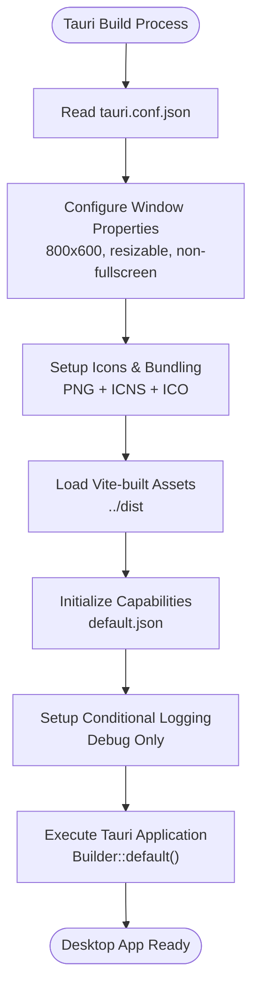
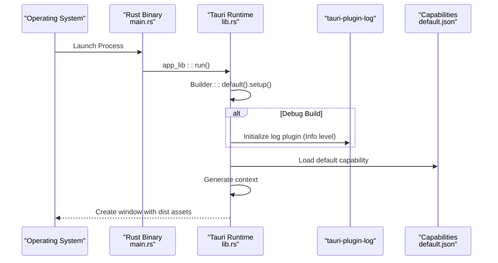
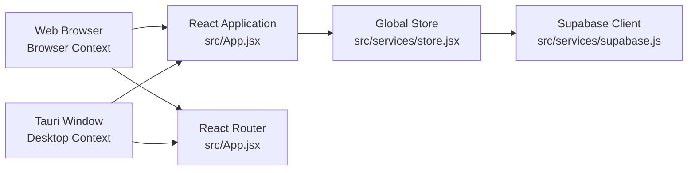
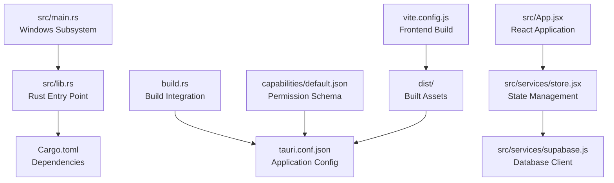

# Desktop Application

<cite>
**Referenced Files in This Document**
- [tauri.conf.json](file://src-tauri/tauri.conf.json)
- [Cargo.toml](file://src-tauri/Cargo.toml)
- [main.rs](file://src-tauri/src/main.rs)
- [lib.rs](file://src-tauri/src/lib.rs)
- [build.rs](file://src-tauri/build.rs)
- [default.json](file://src-tauri/capabilities/default.json)
- [capabilities.json](file://src-tauri/gen/schemas/capabilities.json)
- [package.json](file://package.json)
- [vite.config.js](file://vite.config.js)
- [index.html](file://dist/index.html)
- [main.jsx](file://src/main.jsx)
- [App.jsx](file://src/App.jsx)
- [store.jsx](file://src/services/store.jsx)
- [supabase.js](file://src/services/supabase.js)
</cite>

## Update Summary
**Changes Made**
- Updated Tauri configuration documentation to reflect comprehensive cross-platform desktop integration
- Enhanced Rust backend documentation with capability management and security model
- Added detailed build process documentation for Windows, macOS, and Linux platforms
- Expanded desktop API integration coverage including logging and system-level features
- Updated dependency analysis to include Tauri 2.x ecosystem and modern Rust practices
- Revised security considerations with capability-based permissions model
- Enhanced troubleshooting guide with Tauri-specific build and runtime issues

## Table of Contents
1. [Introduction](#introduction)
2. [Project Structure](#project-structure)
3. [Core Components](#core-components)
4. [Architecture Overview](#architecture-overview)
5. [Detailed Component Analysis](#detailed-component-analysis)
6. [Dependency Analysis](#dependency-analysis)
7. [Performance Considerations](#performance-considerations)
8. [Troubleshooting Guide](#troubleshooting-guide)
9. [Conclusion](#conclusion)
10. [Appendices](#appendices)

## Introduction
This document explains the Tauri-based desktop application, focusing on the comprehensive cross-platform desktop integration with Rust backend and capability management. The application combines a modern React web UI with a Tauri shell, providing native desktop experiences across Windows, macOS, and Linux. The documentation covers Tauri configuration, build and packaging processes, desktop API integration, security posture, and distribution strategies.

## Project Structure
The project implements a hybrid architecture with a React web application and Tauri desktop runtime:

- **Web Application**: React + Vite frontend under src/ built to dist/
- **Desktop Runtime**: Tauri application under src-tauri/ with Rust backend
- **Rust Backend**: Modern Tauri 2.x architecture with capability-based permissions
- **Build System**: Integrated Vite and Tauri build processes
- **Security Model**: Capability-based permission system with granular access control

```mermaid
graph TB
subgraph "Web Frontend Layer"
SRC["src/ (React + Vite)"]
DIST["dist/ (Built Assets)"]
VCFG["vite.config.js"]
APP["App.jsx (Routing)"]
STORE["store.jsx (State Management)"]
SUPA["supabase.js (Database Client)"]
END
subgraph "Tauri Desktop Runtime"
STDIR["src-tauri/"]
CONF["tauri.conf.json (Configuration)"]
LIBRS["src/lib.rs (Rust Entry Point)"]
MAINRS["src/main.rs (Windows Subsystem)"]
BUILDRS["build.rs (Build Script)"]
CAP["capabilities/default.json (Permissions)"]
GEN["gen/schemas/ (Generated Code)"]
END
subgraph "Rust Dependencies"
CARGO["Cargo.toml (Dependencies)"]
TAURI["tauri (Core)"]
LOG["tauri-plugin-log (Debug)"]
SERDE["serde (Serialization)"]
END
SRC --> DIST
DIST --> CONF
STDIR --> CONF
LIBRS --> MAINRS
BUILDRS --> STDIR
CAP --> CONF
GEN --> CONF
CARGO --> TAURI
CARGO --> LOG
CARGO --> SERDE
APP --> STORE
STORE --> SUPA
```

**Diagram sources**
- [tauri.conf.json:1-35](file://src-tauri/tauri.conf.json#L1-L35)
- [Cargo.toml:1-26](file://src-tauri/Cargo.toml#L1-L26)
- [main.rs:1-7](file://src-tauri/src/main.rs#L1-L7)
- [lib.rs:1-17](file://src-tauri/src/lib.rs#L1-L17)
- [build.rs:1-4](file://src-tauri/build.rs#L1-L4)
- [default.json:1-12](file://src-tauri/capabilities/default.json#L1-L12)
- [capabilities.json:1-1](file://src-tauri/gen/schemas/capabilities.json#L1-L1)
- [vite.config.js:1-19](file://vite.config.js#L1-L19)
- [App.jsx:1-43](file://src/App.jsx#L1-L43)
- [store.jsx:1-1252](file://src/services/store.jsx#L1-L1252)
- [supabase.js:1-37](file://src/services/supabase.js#L1-L37)

**Section sources**
- [tauri.conf.json:1-35](file://src-tauri/tauri.conf.json#L1-L35)
- [Cargo.toml:1-26](file://src-tauri/Cargo.toml#L1-L26)
- [main.rs:1-7](file://src-tauri/src/main.rs#L1-L7)
- [lib.rs:1-17](file://src-tauri/src/lib.rs#L1-L17)
- [build.rs:1-4](file://src-tauri/build.rs#L1-L4)
- [default.json:1-12](file://src-tauri/capabilities/default.json#L1-L12)
- [capabilities.json:1-1](file://src-tauri/gen/schemas/capabilities.json#L1-L1)
- [vite.config.js:1-19](file://vite.config.js#L1-L19)
- [App.jsx:1-43](file://src/App.jsx#L1-L43)
- [store.jsx:1-1252](file://src/services/store.jsx#L1-L1252)
- [supabase.js:1-37](file://src/services/supabase.js#L1-L37)

## Core Components
The Tauri desktop application consists of several interconnected components working together:

- **Tauri Application Entry Point**: Rust main function with Windows subsystem directive for clean desktop execution
- **Rust Runtime Configuration**: Builder pattern setup with conditional debug logging and capability initialization
- **Tauri Configuration**: Comprehensive desktop configuration including window properties, security policies, and bundling settings
- **Capability Management**: Granular permission system defining what the desktop app can access
- **Build Integration**: Seamless integration between Vite frontend build and Tauri packaging
- **Cross-Platform Support**: Unified configuration supporting Windows, macOS, and Linux deployment

**Section sources**
- [main.rs:1-7](file://src-tauri/src/main.rs#L1-L7)
- [lib.rs:1-17](file://src-tauri/src/lib.rs#L1-L17)
- [tauri.conf.json:1-35](file://src-tauri/tauri.conf.json#L1-L35)
- [default.json:1-12](file://src-tauri/capabilities/default.json#L1-L12)
- [capabilities.json:1-1](file://src-tauri/gen/schemas/capabilities.json#L1-L1)
- [build.rs:1-4](file://src-tauri/build.rs#L1-L4)

## Architecture Overview
The desktop application implements a layered architecture combining web technologies with native desktop capabilities:

```mermaid
graph TB
subgraph "Presentation Layer"
WEBUI["React Web UI<br/>src/App.jsx + components"]
ROUTER["React Router<br/>src/App.jsx"]
LAYOUT["Layout Components<br/>src/components/"]
END
subgraph "State Management"
STORE["Global Store<br/>src/services/store.jsx"]
AUTH["Authentication State<br/>Supabase Integration"]
DATA["Data Layer<br/>Async Operations"]
END
subgraph "Tauri Desktop Shell"
TAURICONF["tauri.conf.json<br/>Window + Security Config"]
CAP["Capabilities<br/>default.json"]
PLUGIN["Logging Plugin<br/>lib.rs"]
END
subgraph "Rust Backend"
RUNTIME["Tauri Runtime<br/>lib.rs run()"]
SUBSYS["Windows Subsystem<br/>main.rs"]
BUILD["Build System<br/>build.rs + Cargo.toml"]
END
subgraph "External Services"
SUPABASE["Supabase Database<br/>src/services/supabase.js"]
ASSETS["Static Assets<br/>dist/"]
END
WEBUI --> STORE
ROUTER --> LAYOUT
STORE --> AUTH
STORE --> DATA
DATA --> SUPABASE
ASSETS --> TAURICONF
TAURICONF --> CAP
CAP --> PLUGIN
PLUGIN --> RUNTIME
RUNTIME --> SUBSYS
BUILD --> ASSETS
```

**Diagram sources**
- [App.jsx:1-43](file://src/App.jsx#L1-L43)
- [store.jsx:1-1252](file://src/services/store.jsx#L1-L1252)
- [supabase.js:1-37](file://src/services/supabase.js#L1-L37)
- [tauri.conf.json:1-35](file://src-tauri/tauri.conf.json#L1-L35)
- [default.json:1-12](file://src-tauri/capabilities/default.json#L1-L12)
- [lib.rs:1-17](file://src-tauri/src/lib.rs#L1-L17)
- [main.rs:1-7](file://src-tauri/src/main.rs#L1-L7)
- [build.rs:1-4](file://src-tauri/build.rs#L1-L4)

## Detailed Component Analysis

### Tauri Configuration and Build Process
The Tauri configuration establishes a robust foundation for cross-platform desktop deployment:

**Product and Window Configuration**:
- Product metadata: Church Scheduler application with version 0.1.0 and com.church-scheduler.app identifier
- Single resizable, non-fullscreen window with fixed 800x600 dimensions
- Development URL points to local Vite dev server at http://localhost:5173

**Security and CSP Policy**:
- Content Security Policy disabled (set to null) for development flexibility
- Future deployments should consider enabling CSP for enhanced security

**Bundling and Distribution**:
- Active bundling with targets set to "all" platforms
- Comprehensive icon set including PNG (32x32, 128x128, 128x128@2x) and platform-specific formats (ICNS, ICO)
- Frontend distribution path configured to ../dist for Vite-built assets

**Rust Backend Dependencies**:
- Tauri 2.10.0 core with modern feature flags
- tauri-plugin-log 2 for conditional debug logging
- Serde ecosystem for serialization and deserialization
- Staticlib, cdylib, and rlib crate types for maximum compatibility

**Build Integration**:
- Tauri build script generates necessary bindings and schemas
- Cargo build dependencies include tauri-build 2.5.4
- Windows subsystem directive prevents console window in release builds



**Diagram sources**
- [tauri.conf.json:6-34](file://src-tauri/tauri.conf.json#L6-L34)
- [Cargo.toml:13-25](file://src-tauri/Cargo.toml#L13-L25)
- [lib.rs:3-15](file://src-tauri/src/lib.rs#L3-L15)
- [default.json:1-12](file://src-tauri/capabilities/default.json#L1-L12)
- [build.rs:1-4](file://src-tauri/build.rs#L1-L4)

**Section sources**
- [tauri.conf.json:1-35](file://src-tauri/tauri.conf.json#L1-L35)
- [Cargo.toml:1-26](file://src-tauri/Cargo.toml#L1-L26)
- [lib.rs:1-17](file://src-tauri/src/lib.rs#L1-L17)
- [build.rs:1-4](file://src-tauri/build.rs#L1-L4)
- [default.json:1-12](file://src-tauri/capabilities/default.json#L1-L12)
- [capabilities.json:1-1](file://src-tauri/gen/schemas/capabilities.json#L1-L1)

### Desktop API Integration and System-Level Features
The Rust backend provides essential system-level capabilities through Tauri's plugin architecture:

**Conditional Debug Logging**:
- Tauri log plugin initializes only in debug builds with Info level filtering
- Prevents unnecessary overhead in production releases
- Uses log crate 0.4 for structured logging

**Windows Subsystem Integration**:
- Windows subsystem directive prevents console window in release builds
- Ensures clean desktop application appearance
- Maintained for backward compatibility with Windows desktop conventions

**Capability-Based Permissions**:
- Default capability enables core:default permissions
- Scoped to main window only
- Provides foundation for future permission expansions
- Generated schemas ensure type safety



**Diagram sources**
- [main.rs:1-7](file://src-tauri/src/main.rs#L1-L7)
- [lib.rs:3-15](file://src-tauri/src/lib.rs#L3-L15)
- [default.json:8-10](file://src-tauri/capabilities/default.json#L8-L10)

**Section sources**
- [lib.rs:1-17](file://src-tauri/src/lib.rs#L1-L17)
- [main.rs:1-7](file://src-tauri/src/main.rs#L1-L7)
- [default.json:1-12](file://src-tauri/capabilities/default.json#L1-L12)

### Build Configuration for Windows, macOS, and Linux
The build system supports comprehensive cross-platform deployment:

**Cross-Platform Targeting**:
- All platforms enabled through "all" target setting
- Platform-specific icon formats automatically handled
- Unified configuration for Windows, macOS, and Linux

**Development Workflow**:
- Vite development server at localhost:5173 for rapid iteration
- Tauri development command for desktop testing
- npm scripts for streamlined development process

**Production Build Process**:
- Vite builds assets to dist/ directory
- Tauri consumes built assets as frontend distribution
- Platform-specific packaging handled automatically

**Section sources**
- [tauri.conf.json:24-34](file://src-tauri/tauri.conf.json#L24-L34)
- [package.json:7-14](file://package.json#L7-L14)
- [vite.config.js:1-19](file://vite.config.js#L1-L19)

### Packaging, Installers, and Distribution Strategies
The application supports multiple distribution channels and packaging formats:

**Bundling Configuration**:
- Comprehensive icon set including standard PNG sizes and platform-specific formats
- Automatic platform detection and appropriate packaging
- Cross-platform compatibility through unified Tauri configuration

**Distribution Strategy**:
- Installer packages for each target platform
- Portable executables for direct execution
- Automatic asset resolution within Tauri window context

**Section sources**
- [tauri.conf.json:24-34](file://src-tauri/tauri.conf.json#L24-L34)

### Security Considerations and Sandboxing
The application implements a modern capability-based security model:

**Content Security Policy**:
- CSP disabled in current configuration for development flexibility
- Recommended to enable CSP in production for enhanced security
- Balances development convenience with security best practices

**Capability-Based Permissions**:
- Default capability grants core:default permissions
- Limited to main window scope for reduced attack surface
- Expand permissions following principle of least privilege
- Generated schemas ensure compile-time permission validation

**Logging Security**:
- Debug-only logging prevents information disclosure in production
- Structured logging approach minimizes sensitive data exposure
- Conditional compilation ensures logging code elimination in release builds

**Environment Security**:
- Supabase credentials loaded from environment variables
- Runtime validation ensures credentials presence
- Error handling prevents credential leakage in error messages

**Section sources**
- [tauri.conf.json:20-22](file://src-tauri/tauri.conf.json#L20-L22)
- [default.json:8-10](file://src-tauri/capabilities/default.json#L8-L10)
- [lib.rs:5-11](file://src-tauri/src/lib.rs#L5-L11)
- [supabase.js:15-21](file://src/services/supabase.js#L15-L21)

### Desktop-Specific UX Enhancements
The Tauri integration provides native desktop user experience improvements:

**Window Behavior**:
- Resizable main window with fixed aspect ratio
- Non-fullscreen mode preserves desktop workspace
- 800x600 dimensions optimized for desktop applications
- Clean window management through Tauri's native window system

**Asset Loading**:
- Relative base path configuration ensures proper asset resolution
- Vite assets packaged within Tauri distribution
- Automatic asset caching and optimization

**Section sources**
- [tauri.conf.json:10-23](file://src-tauri/tauri.conf.json#L10-L23)
- [vite.config.js:5-8](file://vite.config.js#L5-L8)
- [index.html:1-15](file://dist/index.html#L1-L15)

### Relationship Between Web and Desktop Versions
The same React application runs seamlessly across web and desktop platforms:

**Shared Application Logic**:
- Identical React components and routing logic
- Unified state management through global store
- Consistent authentication and data access patterns

**Database Connectivity**:
- Same Supabase client configuration and connection logic
- Transparent database operations across platforms
- Environment variable handling consistent between web and desktop

**Desktop Shell Benefits**:
- Native window management and system integration
- Optional desktop-specific features through Tauri APIs
- Consistent user experience across deployment methods



**Diagram sources**
- [App.jsx:1-43](file://src/App.jsx#L1-L43)
- [store.jsx:1-1252](file://src/services/store.jsx#L1-L1252)
- [supabase.js:1-37](file://src/services/supabase.js#L1-L37)

**Section sources**
- [App.jsx:1-43](file://src/App.jsx#L1-L43)
- [store.jsx:1-1252](file://src/services/store.jsx#L1-L1252)
- [supabase.js:1-37](file://src/services/supabase.js#L1-L37)

## Dependency Analysis
The application maintains a clean dependency hierarchy supporting both web and desktop functionality:

**Internal Dependencies**:
- Tauri runtime depends on generated schemas and capability definitions
- Build script integrates with tauri_build for code generation
- Rust backend provides foundation for desktop capabilities

**External Dependencies**:
- Tauri 2.10.0 core with modern feature flags
- tauri-plugin-log 2 for conditional debugging
- Serde ecosystem for efficient serialization
- Vite and React for modern web application framework

**State Management Dependencies**:
- Supabase JavaScript SDK for database connectivity
- React Router for navigation and routing
- Tailwind CSS for styling and responsive design



**Diagram sources**
- [lib.rs:1-17](file://src-tauri/src/lib.rs#L1-L17)
- [main.rs:1-7](file://src-tauri/src/main.rs#L1-L7)
- [tauri.conf.json:1-35](file://src-tauri/tauri.conf.json#L1-L35)
- [default.json:1-12](file://src-tauri/capabilities/default.json#L1-L12)
- [build.rs:1-4](file://src-tauri/build.rs#L1-L4)
- [Cargo.toml:1-26](file://src-tauri/Cargo.toml#L1-L26)
- [vite.config.js:1-19](file://vite.config.js#L1-L19)
- [App.jsx:1-43](file://src/App.jsx#L1-L43)
- [store.jsx:1-1252](file://src/services/store.jsx#L1-L1252)
- [supabase.js:1-37](file://src/services/supabase.js#L1-L37)

**Section sources**
- [Cargo.toml:1-26](file://src-tauri/Cargo.toml#L1-L26)
- [lib.rs:1-17](file://src-tauri/src/lib.rs#L1-L17)
- [build.rs:1-4](file://src-tauri/build.rs#L1-L4)
- [tauri.conf.json:1-35](file://src-tauri/tauri.conf.json#L1-L35)
- [default.json:1-12](file://src-tauri/capabilities/default.json#L1-L12)
- [vite.config.js:1-19](file://vite.config.js#L1-L19)
- [App.jsx:1-43](file://src/App.jsx#L1-L43)
- [store.jsx:1-1252](file://src/services/store.jsx#L1-L1252)
- [supabase.js:1-37](file://src/services/supabase.js#L1-L37)

## Performance Considerations
Optimizing the Tauri desktop application requires attention to both web and native performance factors:

**Security vs. Performance Balance**:
- Keep CSP disabled only during development phase
- Enable CSP in production for improved security and performance
- Capability-based permissions reduce runtime overhead compared to broad access

**Memory Management**:
- Leverage Rust's memory safety guarantees in desktop backend
- Minimize heavy synchronous work in main thread
- Use background threads for intensive operations

**Asset Optimization**:
- Lazy loading for large lists and images in React UI
- Efficient state management to reduce re-renders
- Optimized Vite build configuration for production deployment

**Build Performance**:
- Incremental builds and cached Vite output
- Cargo's dependency caching for faster rebuilds
- Parallel compilation where possible

## Troubleshooting Guide
Common issues and solutions for Tauri desktop application development and deployment:

**Build and Compilation Issues**:
- Missing Rust toolchain: Ensure Rust stable is installed with appropriate targets
- Vite build failures: Verify node_modules installation and Vite configuration
- Tauri build errors: Check Cargo.toml dependencies and tauri-build version compatibility

**Runtime and Execution Problems**:
- Windows console window: Verify windows_subsystem directive in main.rs
- Asset loading failures: Confirm dist directory contains built assets
- Capability permission errors: Review default.json permissions and schema validation

**Development Environment Issues**:
- Hot reload not working: Check devUrl configuration in tauri.conf.json
- Debug logging not appearing: Verify debug build and plugin initialization
- Supabase connection errors: Ensure environment variables are properly set

**Platform-Specific Issues**:
- Linux dependencies: Install GTK and WebKit packages as needed
- macOS signing: Configure appropriate codesigning for distribution
- Windows packaging: Verify icon formats and certificate configuration

**Section sources**
- [tauri.conf.json:27-33](file://src-tauri/tauri.conf.json#L27-L33)
- [main.rs:1-2](file://src-tauri/src/main.rs#L1-L2)
- [lib.rs:5-11](file://src-tauri/src/lib.rs#L5-L11)
- [supabase.js:15-21](file://src/services/supabase.js#L15-L21)

## Conclusion
The Tauri-based desktop application demonstrates a modern approach to cross-platform desktop development, combining the flexibility of web technologies with the power of native desktop integration. The comprehensive configuration, capability-based security model, and seamless build process provide a solid foundation for production desktop applications.

Key strengths include the unified React application architecture, robust Rust backend with modern Tauri 2.x features, and comprehensive cross-platform support. The capability-based permission system ensures security while maintaining flexibility for future feature expansion.

Future enhancements could include implementing native menus, system tray functionality, and desktop notifications as outlined in the appendices, while maintaining the current strong foundation for desktop deployment.

## Appendices

### Appendix A: Desktop-Specific Features Implementation Guide
The current Tauri configuration provides a foundation for implementing additional desktop-specific features:

**Native Menus**:
- Define menu structures in tauri.conf.json under menu configuration
- Implement menu item handlers in Rust backend
- Expose JavaScript APIs through Tauri commands for UI interaction

**System Tray Integration**:
- Configure tray icon and menu items in Tauri configuration
- Implement tray event handlers in Rust
- Manage tray lifecycle and state persistence

**Desktop Notifications**:
- Utilize Tauri's notification capabilities
- Implement permission requests for notification access
- Handle notification click events and user interactions

**Auto-Update Mechanisms**:
- Integrate Tauri updater plugin for automatic updates
- Configure update endpoints and security validation
- Implement update progress tracking and user notifications

**Section sources**
- [tauri.conf.json:1-35](file://src-tauri/tauri.conf.json#L1-L35)
- [default.json:1-12](file://src-tauri/capabilities/default.json#L1-L12)

### Appendix B: Migration from Legacy Electron Implementation
The project has transitioned from Electron to Tauri, representing significant architectural improvements:

**Build System Migration**:
- Replaced Electron main/preload scripts with Tauri Rust backend
- Migrated from webpack to Vite for frontend build optimization
- Simplified dependency management through Cargo ecosystem

**Security Improvements**:
- Capability-based permission system replacing broad renderer permissions
- Reduced attack surface through Rust memory safety guarantees
- Enhanced CSP enforcement and security headers

**Performance Benefits**:
- Smaller application size and faster startup times
- Reduced memory footprint compared to Chromium-based Electron
- Native system integration through Tauri plugins

**Development Experience**:
- Unified configuration through single tauri.conf.json file
- Streamlined build process with integrated Vite/Tauri workflow
- Modern Rust toolchain with excellent debugging support

**Section sources**
- [package.json:42-44](file://package.json#L42-L44)
- [Cargo.toml:1-26](file://src-tauri/Cargo.toml#L1-L26)
- [tauri.conf.json:1-35](file://src-tauri/tauri.conf.json#L1-L35)