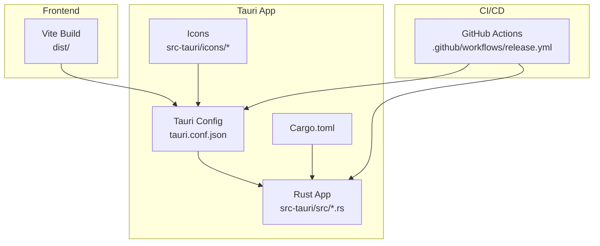
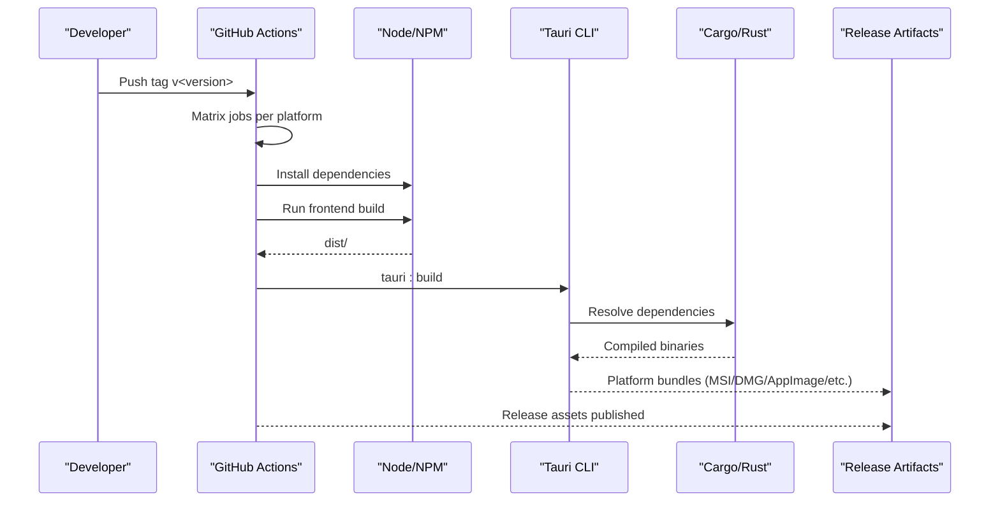
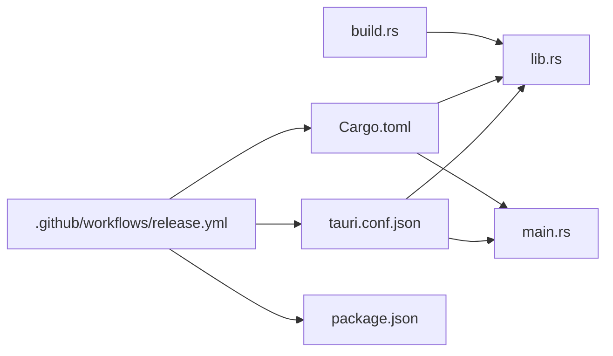

# Distribution and Packaging

<cite>
**Referenced Files in This Document**
- [tauri.conf.json](file://src-tauri/tauri.conf.json)
- [Cargo.toml](file://src-tauri/Cargo.toml)
- [package.json](file://package.json)
- [release.yml](file://.github/workflows/release.yml)
- [main.rs](file://src-tauri/src/main.rs)
- [lib.rs](file://src-tauri/src/lib.rs)
- [build.rs](file://src-tauri/build.rs)
- [default.json](file://src-tauri/capabilities/default.json)
- [ELECTRON_BUILD.md](file://ELECTRON_BUILD.md)
</cite>

## Table of Contents
1. [Introduction](#introduction)
2. [Project Structure](#project-structure)
3. [Core Components](#core-components)
4. [Architecture Overview](#architecture-overview)
5. [Detailed Component Analysis](#detailed-component-analysis)
6. [Dependency Analysis](#dependency-analysis)
7. [Performance Considerations](#performance-considerations)
8. [Troubleshooting Guide](#troubleshooting-guide)
9. [Conclusion](#conclusion)
10. [Appendices](#appendices)

## Introduction
This document explains how the project builds, packages, and distributes the desktop application across Windows, macOS, and Linux. It covers the Tauri-based packaging pipeline, icon and branding assets, bundle configuration, distribution channels, and the current state of auto-updates. It also provides guidance for code signing, notarization, and publisher verification, along with troubleshooting tips for common distribution issues.

## Project Structure
The desktop application is built with Tauri and uses a frontend built with Vite and React. The Tauri configuration defines bundling targets, icons, and build settings. GitHub Actions automates cross-platform releases.

**Diagram sources**
- [tauri.conf.json](file://src-tauri/tauri.conf.json#L1-L35)
- [Cargo.toml](file://src-tauri/Cargo.toml#L1-L26)
- [release.yml](file://.github/workflows/release.yml#L1-L49)

**Section sources**
- [tauri.conf.json](file://src-tauri/tauri.conf.json#L1-L35)
- [package.json](file://package.json#L1-L44)
- [release.yml](file://.github/workflows/release.yml#L1-L49)

## Core Components
- Tauri configuration defines product metadata, bundling targets, and icons.
- Cargo manifest defines Rust crate metadata and dependencies.
- GitHub Actions workflow automates cross-platform builds and releases.
- Frontend build produces the static assets consumed by Tauri.

Key responsibilities:
- tauri.conf.json: Product identity, frontend path, window defaults, security policy, and bundle targets.
- Cargo.toml: Rust crate identity, version, and Tauri-related dependencies.
- release.yml: CI job matrix for macOS, Ubuntu, and Windows runners, installing prerequisites, building, and publishing artifacts.

**Section sources**
- [tauri.conf.json](file://src-tauri/tauri.conf.json#L1-L35)
- [Cargo.toml](file://src-tauri/Cargo.toml#L1-L26)
- [release.yml](file://.github/workflows/release.yml#L1-L49)

## Architecture Overview
The build and distribution pipeline integrates the frontend build with Tauri’s bundler to produce platform-specific installers and artifacts. CI orchestrates the process across platforms.

**Diagram sources**
- [release.yml](file://.github/workflows/release.yml#L1-L49)
- [package.json](file://package.json#L7-L13)
- [tauri.conf.json](file://src-tauri/tauri.conf.json#L6-L9)

## Detailed Component Analysis

### Tauri Configuration and Bundling
- Product identity and version: productName, version, identifier.
- Frontend consumption: frontendDist points to the built static assets.
- Window defaults: title, size, and resizable/fullscreen flags.
- Security: CSP is disabled in the configuration.
- Bundling: targets set to build all supported platforms; icon array lists branding assets.

Supported bundle targets and compression:
- Targets: "all" enables cross-platform bundling.
- Compression: Tauri supports compression features via its build tooling; consult the Tauri CLI schema for explicit compression options.

Platform-specific bundle formats:
- Windows: MSI installer is produced by the Tauri bundler.
- macOS: DMG installer is produced by the Tauri bundler.
- Linux: AppImage and DEB are commonly produced by the Tauri bundler.

Icon configuration and branding:
- The icon list includes generic PNG sizes and platform-specific formats (ICNS, ICO).
- Ensure all required sizes are present for each platform to avoid missing icon warnings during bundling.

Security policy:
- CSP is set to null, which disables a strict Content Security Policy. Consider enabling a CSP in production for enhanced security.

**Section sources**
- [tauri.conf.json](file://src-tauri/tauri.conf.json#L3-L34)

### Rust Application Entrypoints
- main.rs sets the subsystem for Windows in release mode and delegates to the app library.
- lib.rs initializes logging in debug mode and runs the Tauri application with generated context.

These files are part of the compiled Rust binary included in the final bundle.

**Section sources**
- [main.rs](file://src-tauri/src/main.rs#L1-L7)
- [lib.rs](file://src-tauri/src/lib.rs#L1-L17)

### Cargo Manifest
- Crate identity and version.
- Dependencies include Tauri core and a logging plugin.
- Build script integration via tauri_build.

This determines the Rust-side behavior and build-time code generation.

**Section sources**
- [Cargo.toml](file://src-tauri/Cargo.toml#L1-L26)
- [build.rs](file://src-tauri/build.rs#L1-L4)

### Capabilities and Permissions
- default.json defines the default capability enabling core permissions for the main window.
- This affects what the packaged app can do by default at runtime.

**Section sources**
- [default.json](file://src-tauri/capabilities/default.json#L1-L12)

### Frontend Build and Scripts
- package.json defines scripts for dev, build, and Tauri-specific commands.
- The frontend build produces dist/, which is referenced by tauri.conf.json as the frontendDist.

**Section sources**
- [package.json](file://package.json#L7-L13)
- [tauri.conf.json](file://src-tauri/tauri.conf.json#L7-L8)

### CI/CD Release Pipeline
- release.yml triggers on tags prefixed with v*.
- Matrix builds run on macOS, Ubuntu, and Windows runners.
- Installs Node, Rust stable, and platform-specific dependencies.
- Uses tauri-action to build and publish release assets.

Linux prerequisites:
- GTK and WebKit2 development libraries are installed for Linux builds.

Windows prerequisites:
- WebView2 runtime installation is handled by the Tauri bundler; the workflow installs the Rust toolchain and Node.

**Section sources**
- [release.yml](file://.github/workflows/release.yml#L1-L49)

### Auto-Update Mechanism
- The repository does not define an updater configuration in tauri.conf.json.
- As a result, the application does not currently include an embedded auto-update mechanism.
- To enable updates, configure the updater section in tauri.conf.json and integrate with a release channel or CDN.

[No sources needed since this section summarizes absence of configuration]

### Distribution Strategy
- Current state: No explicit distribution channels are configured in the repository.
- Recommended approaches:
  - Direct downloads: Publish release artifacts from CI to GitHub Releases or a CDN.
  - Enterprise deployment: Provide signed installers (see signing section) and internal distribution mechanisms.
  - App stores: Not configured; Windows/macOS app stores would require separate submission processes outside this repository.

[No sources needed since this section provides general guidance]

### Code Signing, Notarization, and Publisher Verification
- Windows:
  - Sign the application and installer using a trusted code-signing certificate.
  - Ensure the installer’s upgrade code remains stable across versions to preserve upgrade continuity.
- macOS:
  - Notarize the app with Apple after signing to satisfy Gatekeeper.
- Publisher verification:
  - Use a valid code-signing certificate recognized by the platform to ensure trust and reduce warnings.

[No sources needed since this section provides general guidance]

### Digital Signature Requirements and Security Best Practices
- Use strong cryptographic algorithms and secure certificate storage.
- Keep signing certificates private and rotate them periodically.
- Consider enabling a CSP in production to mitigate XSS risks.
- Validate and pin update endpoints if implementing an updater.

[No sources needed since this section provides general guidance]

### Creating Custom Installers and Managing Updates
- Custom installers:
  - Modify tauri.conf.json to adjust bundle targets, icon set, and platform-specific settings.
  - Use Tauri CLI to build and test locally before CI automation.
- Managing updates:
  - Define an updater configuration in tauri.conf.json and publish update artifacts to a secure endpoint.
  - Ensure the update channel is versioned and signed.

[No sources needed since this section provides general guidance]

## Dependency Analysis
The Tauri app depends on Rust crates and the Tauri CLI. The CI depends on platform toolchains and the Tauri action.

**Diagram sources**
- [tauri.conf.json](file://src-tauri/tauri.conf.json#L1-L35)
- [lib.rs](file://src-tauri/src/lib.rs#L1-L17)
- [main.rs](file://src-tauri/src/main.rs#L1-L7)
- [Cargo.toml](file://src-tauri/Cargo.toml#L1-L26)
- [build.rs](file://src-tauri/build.rs#L1-L4)
- [release.yml](file://.github/workflows/release.yml#L1-L49)
- [package.json](file://package.json#L1-L44)

**Section sources**
- [tauri.conf.json](file://src-tauri/tauri.conf.json#L1-L35)
- [Cargo.toml](file://src-tauri/Cargo.toml#L1-L26)
- [release.yml](file://.github/workflows/release.yml#L1-L49)
- [package.json](file://package.json#L1-L44)

## Performance Considerations
- Bundle size: Keep icons minimal and only include necessary assets.
- Compression: Enable appropriate compression in the bundler to reduce download sizes.
- CI caching: Cache Node and Rust dependencies to speed up builds.

[No sources needed since this section provides general guidance]

## Troubleshooting Guide
Common issues and resolutions:
- Missing icons or incorrect branding:
  - Ensure all icon entries in tauri.conf.json correspond to existing files in src-tauri/icons/.
- Linux build failures:
  - Verify GTK and WebKit2 development packages are installed as per the CI script.
- Windows installer issues:
  - Confirm WebView2 runtime availability or configure the installer to handle WebView2 installation.
- CSP-related warnings:
  - Consider enabling a CSP in tauri.conf.json for improved security.
- Auto-update not working:
  - Configure the updater in tauri.conf.json and ensure the update endpoint is reachable and properly signed.

**Section sources**
- [tauri.conf.json](file://src-tauri/tauri.conf.json#L20-L34)
- [release.yml](file://.github/workflows/release.yml#L29-L36)

## Conclusion
The project uses Tauri for cross-platform desktop packaging and GitHub Actions for automated releases. The current configuration supports bundling across Windows, macOS, and Linux with a flexible icon set. There is no embedded auto-update mechanism at this time. To harden distribution, enable code signing/notarization, consider CSP, and define an updater configuration for future releases.

[No sources needed since this section summarizes without analyzing specific files]

## Appendices

### Appendix A: Icon and Branding Assets
- Ensure the following icon entries exist and match the icon list in tauri.conf.json:
  - Generic PNG sizes for desktop environments.
  - ICNS for macOS.
  - ICO for Windows.

**Section sources**
- [tauri.conf.json](file://src-tauri/tauri.conf.json#L27-L33)

### Appendix B: Platform-Specific Notes
- Windows:
  - MSI installer is produced; WebView2 runtime handling is managed by the bundler.
- macOS:
  - DMG installer is produced; notarization is required for distribution.
- Linux:
  - AppImage and DEB are commonly produced; ensure required system libraries are installed.

**Section sources**
- [release.yml](file://.github/workflows/release.yml#L29-L36)
- [tauri.conf.json](file://src-tauri/tauri.conf.json#L24-L34)

### Appendix C: Legacy Electron Build Notes
- The project includes Electron build documentation indicating previous Windows packaging workflows. These are not used in the current Tauri-based pipeline.

**Section sources**
- [ELECTRON_BUILD.md](file://ELECTRON_BUILD.md#L1-L41)