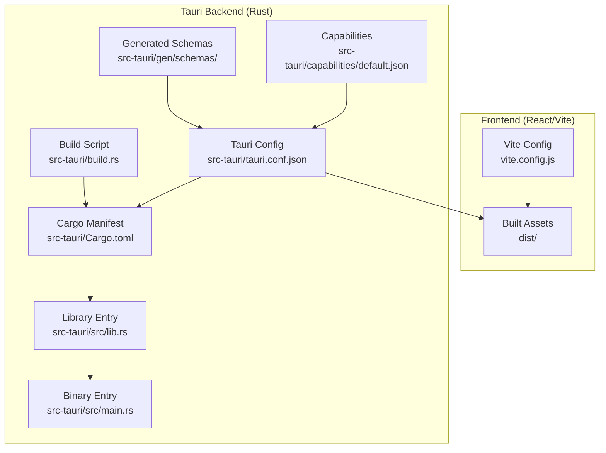
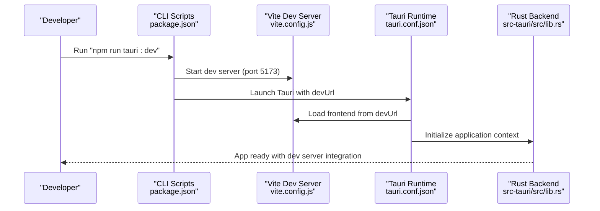
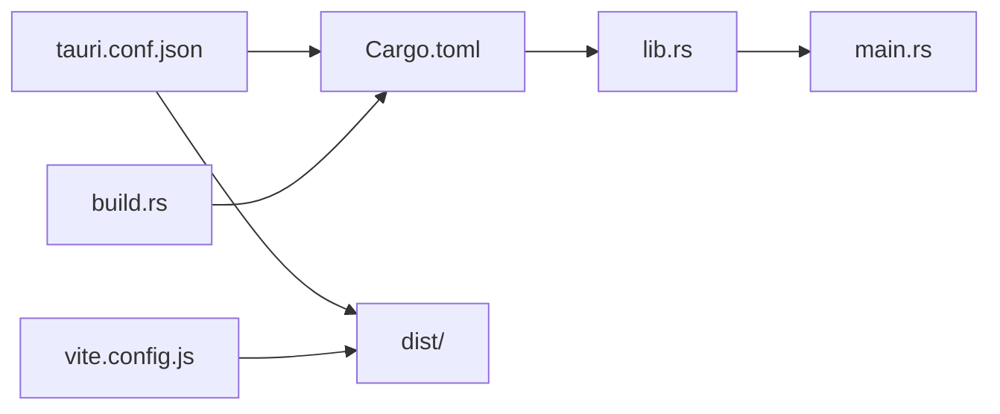

# Tauri Configuration

<cite>
**Referenced Files in This Document**
- [tauri.conf.json](file://src-tauri/tauri.conf.json)
- [Cargo.toml](file://src-tauri/Cargo.toml)
- [build.rs](file://src-tauri/build.rs)
- [main.rs](file://src-tauri/src/main.rs)
- [lib.rs](file://src-tauri/src/lib.rs)
- [default.json](file://src-tauri/capabilities/default.json)
- [capabilities.json](file://src-tauri/gen/schemas/capabilities.json)
- [package.json](file://package.json)
- [vite.config.js](file://vite.config.js)
- [README.md](file://README.md)
</cite>

## Table of Contents
1. [Introduction](#introduction)
2. [Project Structure](#project-structure)
3. [Core Components](#core-components)
4. [Architecture Overview](#architecture-overview)
5. [Detailed Component Analysis](#detailed-component-analysis)
6. [Dependency Analysis](#dependency-analysis)
7. [Performance Considerations](#performance-considerations)
8. [Troubleshooting Guide](#troubleshooting-guide)
9. [Conclusion](#conclusion)

## Introduction
This document explains the Tauri configuration setup for the project, focusing on the tauri.conf.json structure and related build configuration. It covers product configuration, window settings, security policies, bundling options, and how the React frontend distribution integrates with Tauri during development and production builds. It also documents the Rust backend integration, capability permissions, and provides guidance for customization and troubleshooting.

## Project Structure
The Tauri application is organized with a clear separation between the frontend (React/Vite) and the Tauri backend (Rust). The Tauri configuration resides under src-tauri/tauri.conf.json, while the Rust application lives under src-tauri/src. The frontend build artifacts are placed under dist/, which Tauri references for production builds.

**Diagram sources**
- [tauri.conf.json](file://src-tauri/tauri.conf.json#L1-L35)
- [Cargo.toml](file://src-tauri/Cargo.toml#L1-L26)
- [build.rs](file://src-tauri/build.rs#L1-L4)
- [lib.rs](file://src-tauri/src/lib.rs#L1-L17)
- [main.rs](file://src-tauri/src/main.rs#L1-L7)
- [default.json](file://src-tauri/capabilities/default.json#L1-L12)
- [capabilities.json](file://src-tauri/gen/schemas/capabilities.json#L1-L1)

**Section sources**
- [tauri.conf.json](file://src-tauri/tauri.conf.json#L1-L35)
- [Cargo.toml](file://src-tauri/Cargo.toml#L1-L26)
- [build.rs](file://src-tauri/build.rs#L1-L4)
- [lib.rs](file://src-tauri/src/lib.rs#L1-L17)
- [main.rs](file://src-tauri/src/main.rs#L1-L7)
- [default.json](file://src-tauri/capabilities/default.json#L1-L12)
- [capabilities.json](file://src-tauri/gen/schemas/capabilities.json#L1-L1)
- [vite.config.js](file://vite.config.js#L1-L10)
- [package.json](file://package.json#L1-L44)

## Core Components
This section outlines the primary configuration areas and their roles:

- Product configuration: Defines the application’s display name, version, identifier, and build targets.
- Window settings: Controls window dimensions, resizability, fullscreen behavior, and title.
- Security policies: Manages Content Security Policy (CSP) and permission capabilities.
- Bundling options: Specifies platform targets and icon resources for packaging.
- Build configuration: Links the frontend distribution path and development server URL.

Key configuration locations:
- Application metadata and build targets: [tauri.conf.json](file://src-tauri/tauri.conf.json#L3-L9)
- Window properties: [tauri.conf.json](file://src-tauri/tauri.conf.json#L10-L23)
- Security policies and CSP: [tauri.conf.json](file://src-tauri/tauri.conf.json#L20-L22)
- Bundling and icons: [tauri.conf.json](file://src-tauri/tauri.conf.json#L24-L34)
- Frontend build integration: [vite.config.js](file://vite.config.js#L7-L8), [package.json](file://package.json#L7-L13)

**Section sources**
- [tauri.conf.json](file://src-tauri/tauri.conf.json#L3-L34)
- [vite.config.js](file://vite.config.js#L7-L8)
- [package.json](file://package.json#L7-L13)

## Architecture Overview
The Tauri runtime integrates the React/Vite frontend with the Rust backend. During development, Tauri loads the frontend from a local development server. In production, Tauri serves the built frontend assets from the dist/ directory. The Rust backend initializes logging in debug mode and runs the Tauri application context.

**Diagram sources**
- [package.json](file://package.json#L7-L13)
- [vite.config.js](file://vite.config.js#L7-L8)
- [tauri.conf.json](file://src-tauri/tauri.conf.json#L6-L9)
- [lib.rs](file://src-tauri/src/lib.rs#L1-L17)

## Detailed Component Analysis

### Product Configuration
- Product name and version: The application’s display name and semantic version are defined in the configuration.
- Identifier: A reverse-domain-style identifier is set for the application.
- Build targets: The build section references the frontend distribution path and the development server URL.

Customization tips:
- Adjust product name and version for releases.
- Ensure the identifier aligns with platform requirements.
- Verify the frontendDist path matches the Vite output directory.

**Section sources**
- [tauri.conf.json](file://src-tauri/tauri.conf.json#L3-L9)

### Window Settings
- Title: Sets the initial window title.
- Dimensions: Width and height are configured for the main window.
- Resizable: Allows resizing the window.
- Fullscreen: Disabled by default.

Customization examples:
- Change width and height for different screen sizes.
- Enable fullscreen for kiosk-like deployments.
- Add multiple windows by extending the windows array.

**Section sources**
- [tauri.conf.json](file://src-tauri/tauri.conf.json#L10-L23)

### Security Policies and Capabilities
- Content Security Policy (CSP): Currently set to null, indicating no CSP is enforced.
- Capability permissions: A default capability enables core permissions and binds to the main window.

Security recommendations:
- Define a strict CSP for production builds.
- Limit capabilities to only those required by the application.
- Review generated permission files under gen/schemas for visibility into granted permissions.

**Section sources**
- [tauri.conf.json](file://src-tauri/tauri.conf.json#L20-L22)
- [default.json](file://src-tauri/capabilities/default.json#L1-L12)
- [capabilities.json](file://src-tauri/gen/schemas/capabilities.json#L1-L1)

### Bundling Configuration
- Active bundling: Enabled for production builds.
- Targets: Set to build for all supported platforms.
- Icons: Multiple icon sizes and formats are included for cross-platform packaging.

Platform and icon considerations:
- Ensure all required icon sizes are present for each platform.
- Adjust targets if building for specific platforms only.
- Validate icon paths match the actual files in the icons directory.

**Section sources**
- [tauri.conf.json](file://src-tauri/tauri.conf.json#L24-L34)

### Build Configuration and Frontend Integration
- Frontend distribution path: Points to the Vite-built dist/ directory.
- Development URL: Points to the Vite dev server.
- Base path: Vite is configured with a relative base path to support serving from subpaths.

Integration steps:
- Confirm the dist directory is generated by Vite.
- Ensure the devUrl matches the Vite dev server port.
- Keep the base path setting aligned with deployment expectations.

**Section sources**
- [tauri.conf.json](file://src-tauri/tauri.conf.json#L6-L9)
- [vite.config.js](file://vite.config.js#L7-L8)
- [package.json](file://package.json#L7-L13)

### Rust Backend Integration
- Binary entry point: The main binary sets the Windows subsystem for release builds.
- Library entry point: The library initializes logging in debug mode and runs the Tauri application context.
- Build script: Delegates to tauri_build to generate necessary bindings and assets.

Rust integration highlights:
- Logging plugin is conditionally enabled in debug builds.
- The application context is generated at runtime.

**Section sources**
- [main.rs](file://src-tauri/src/main.rs#L1-L7)
- [lib.rs](file://src-tauri/src/lib.rs#L1-L17)
- [build.rs](file://src-tauri/build.rs#L1-L4)
- [Cargo.toml](file://src-tauri/Cargo.toml#L1-L26)

### Capability Permissions
The default capability grants core permissions and binds them to the main window. This defines the baseline permissions available to the application.

Permissions overview:
- Identifier and description clarify the purpose.
- Windows list includes the main window.
- Permissions include core defaults.

**Section sources**
- [default.json](file://src-tauri/capabilities/default.json#L1-L12)
- [capabilities.json](file://src-tauri/gen/schemas/capabilities.json#L1-L1)

## Dependency Analysis
The Tauri configuration depends on the frontend build output and Rust dependencies. The Cargo manifest defines the Tauri framework and logging plugin, while the build script integrates with Tauri’s build pipeline.

**Diagram sources**
- [tauri.conf.json](file://src-tauri/tauri.conf.json#L1-L35)
- [Cargo.toml](file://src-tauri/Cargo.toml#L1-L26)
- [build.rs](file://src-tauri/build.rs#L1-L4)
- [lib.rs](file://src-tauri/src/lib.rs#L1-L17)
- [main.rs](file://src-tauri/src/main.rs#L1-L7)
- [vite.config.js](file://vite.config.js#L1-L10)

**Section sources**
- [tauri.conf.json](file://src-tauri/tauri.conf.json#L1-L35)
- [Cargo.toml](file://src-tauri/Cargo.toml#L1-L26)
- [build.rs](file://src-tauri/build.rs#L1-L4)
- [lib.rs](file://src-tauri/src/lib.rs#L1-L17)
- [main.rs](file://src-tauri/src/main.rs#L1-L7)
- [vite.config.js](file://vite.config.js#L1-L10)

## Performance Considerations
- Keep CSP minimal in development to reduce overhead; tighten it for production.
- Limit bundling targets to reduce build time and artifact size.
- Ensure icons are appropriately sized to avoid unnecessary processing during packaging.
- Use conditional logging in debug builds to minimize overhead in release builds.

## Troubleshooting Guide
Common configuration errors and resolutions:
- Frontend not loading in development:
  - Verify the devUrl matches the Vite dev server address.
  - Confirm the frontendDist path points to the correct dist directory.
  - Check that the Vite base path is set to a relative path.

- Build failures:
  - Ensure all icon paths in the bundling section exist.
  - Confirm the Cargo manifest includes required Tauri dependencies.
  - Verify the build script delegates to tauri_build.

- Permission issues:
  - Review the default capability configuration.
  - Check generated permission files for unexpected grants.

- Debugging:
  - Enable logging in debug builds to inspect runtime behavior.
  - Validate the application context generation process.

**Section sources**
- [tauri.conf.json](file://src-tauri/tauri.conf.json#L6-L34)
- [Cargo.toml](file://src-tauri/Cargo.toml#L17-L26)
- [build.rs](file://src-tauri/build.rs#L1-L4)
- [lib.rs](file://src-tauri/src/lib.rs#L5-L11)
- [vite.config.js](file://vite.config.js#L7-L8)

## Conclusion
The Tauri configuration establishes a clean separation between the React/Vite frontend and the Rust backend, with straightforward integration through tauri.conf.json. By adjusting product metadata, window properties, security policies, and bundling options, developers can tailor the application for various deployment scenarios. Proper validation of paths, permissions, and build scripts ensures reliable development and production workflows.