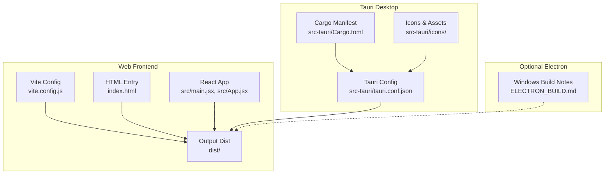
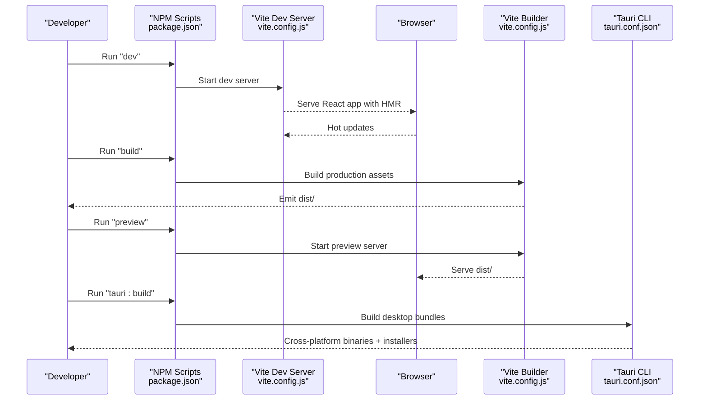
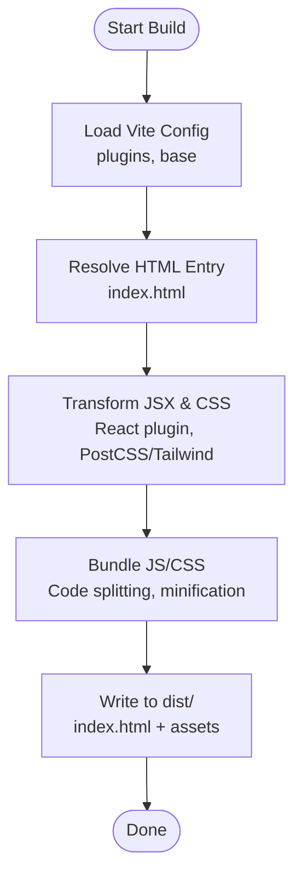
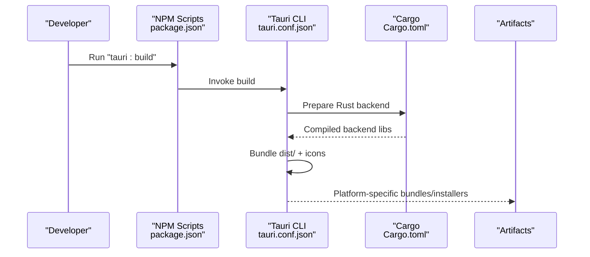
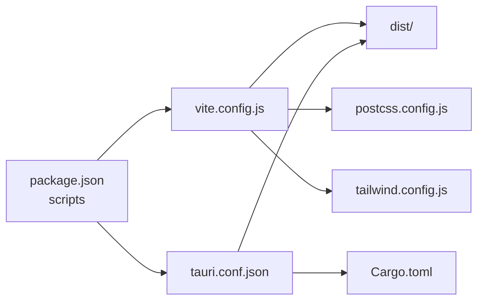

# Build Process

<cite>
**Referenced Files in This Document**
- [package.json](file://package.json)
- [vite.config.js](file://vite.config.js)
- [index.html](file://index.html)
- [dist/index.html](file://dist/index.html)
- [src-tauri/tauri.conf.json](file://src-tauri/tauri.conf.json)
- [src-tauri/Cargo.toml](file://src-tauri/Cargo.toml)
- [postcss.config.js](file://postcss.config.js)
- [tailwind.config.js](file://tailwind.config.js)
- [src/main.jsx](file://src/main.jsx)
- [src/App.jsx](file://src/App.jsx)
- [ELECTRON_BUILD.md](file://ELECTRON_BUILD.md)
</cite>

## Table of Contents
1. [Introduction](#introduction)
2. [Project Structure](#project-structure)
3. [Core Components](#core-components)
4. [Architecture Overview](#architecture-overview)
5. [Detailed Component Analysis](#detailed-component-analysis)
6. [Dependency Analysis](#dependency-analysis)
7. [Performance Considerations](#performance-considerations)
8. [Troubleshooting Guide](#troubleshooting-guide)
9. [Conclusion](#conclusion)

## Introduction
This document explains the build processes for RosterFlow, focusing on:
- Vite-based web application builds: development with hot reload, production builds with asset bundling, and preview server usage.
- Tauri desktop application builds: cross-platform packaging for Windows, macOS, and Linux using Tauri configuration and Rust dependencies.
- Electron build notes for Windows distribution via separate documentation.
It also documents the build scripts defined in package.json, environment-specific behaviors, output directory structure, optimization techniques, and common build errors with solutions.

## Project Structure
RosterFlow is organized into:
- Web frontend built with Vite and React, emitting static assets to the dist/ directory.
- Tauri desktop wrapper configured via src-tauri/tauri.conf.json and Rust dependencies in src-tauri/Cargo.toml.
- Optional Electron build process documented separately in ELECTRON_BUILD.md.

**Diagram sources**
- [vite.config.js](file://vite.config.js#L1-L10)
- [index.html](file://index.html#L1-L14)
- [src/main.jsx](file://src/main.jsx#L1-L11)
- [src/App.jsx](file://src/App.jsx#L1-L37)
- [dist/index.html](file://dist/index.html#L1-L15)
- [src-tauri/tauri.conf.json](file://src-tauri/tauri.conf.json#L1-L35)
- [src-tauri/Cargo.toml](file://src-tauri/Cargo.toml#L1-L26)
- [ELECTRON_BUILD.md](file://ELECTRON_BUILD.md#L1-L41)

**Section sources**
- [package.json](file://package.json#L1-L44)
- [vite.config.js](file://vite.config.js#L1-L10)
- [index.html](file://index.html#L1-L14)
- [src/main.jsx](file://src/main.jsx#L1-L11)
- [src/App.jsx](file://src/App.jsx#L1-L37)
- [dist/index.html](file://dist/index.html#L1-L15)
- [src-tauri/tauri.conf.json](file://src-tauri/tauri.conf.json#L1-L35)
- [src-tauri/Cargo.toml](file://src-tauri/Cargo.toml#L1-L26)
- [ELECTRON_BUILD.md](file://ELECTRON_BUILD.md#L1-L41)

## Core Components
- Vite configuration defines the React plugin and base path for assets.
- Tauri configuration ties the frontend dist output to the desktop app and sets window defaults and bundling targets.
- Tailwind and PostCSS configure CSS processing and content paths.
- Scripts in package.json orchestrate development, production builds, and preview.

Key behaviors:
- Development mode runs Vite’s dev server with hot module replacement.
- Production builds emit optimized static assets to dist/.
- Preview serves the production build locally for testing.
- Tauri builds package the app for Windows, macOS, and Linux using the configured icons and window settings.

**Section sources**
- [vite.config.js](file://vite.config.js#L1-L10)
- [src-tauri/tauri.conf.json](file://src-tauri/tauri.conf.json#L1-L35)
- [postcss.config.js](file://postcss.config.js#L1-L7)
- [tailwind.config.js](file://tailwind.config.js#L1-L51)
- [package.json](file://package.json#L7-L14)

## Architecture Overview
The build pipeline connects the frontend, bundler, and desktop packaging layers.

**Diagram sources**
- [package.json](file://package.json#L7-L14)
- [vite.config.js](file://vite.config.js#L1-L10)
- [src-tauri/tauri.conf.json](file://src-tauri/tauri.conf.json#L6-L9)

## Detailed Component Analysis

### Vite Build Pipeline
- Plugins: React plugin enables JSX transforms and fast refresh.
- Base path: Relative base ensures assets resolve correctly in both dev and production.
- Entry point: index.html loads the React root script.
- Output: dist/ contains the built app with hashed assets and a generated index.html.

**Diagram sources**
- [vite.config.js](file://vite.config.js#L1-L10)
- [index.html](file://index.html#L1-L14)
- [postcss.config.js](file://postcss.config.js#L1-L7)
- [tailwind.config.js](file://tailwind.config.js#L1-L51)

**Section sources**
- [vite.config.js](file://vite.config.js#L1-L10)
- [index.html](file://index.html#L1-L14)
- [dist/index.html](file://dist/index.html#L1-L15)
- [postcss.config.js](file://postcss.config.js#L1-L7)
- [tailwind.config.js](file://tailwind.config.js#L1-L51)

### Tauri Desktop Build Pipeline
- Frontend integration: The tauri.conf.json points Tauri to the dist/ directory as the frontend distribution.
- Window configuration: Defines default window size, title, and resizable/fullscreen flags.
- Security: CSP is set to null in the current configuration.
- Bundling: Targets all platforms; icons are provided for multiple formats.
- Rust dependencies: Cargo.toml lists Tauri and related plugins.

**Diagram sources**
- [package.json](file://package.json#L10-L11)
- [src-tauri/tauri.conf.json](file://src-tauri/tauri.conf.json#L6-L34)
- [src-tauri/Cargo.toml](file://src-tauri/Cargo.toml#L1-L26)

**Section sources**
- [src-tauri/tauri.conf.json](file://src-tauri/tauri.conf.json#L1-L35)
- [src-tauri/Cargo.toml](file://src-tauri/Cargo.toml#L1-L26)
- [package.json](file://package.json#L10-L11)

### Electron Build Notes
- Separate documentation exists for Windows packaging via Electron.
- The process builds the React app to dist/, packages it with Electron, and produces installers and portable executables under out/.

**Section sources**
- [ELECTRON_BUILD.md](file://ELECTRON_BUILD.md#L1-L41)

## Dependency Analysis
- NPM scripts depend on Vite and Tauri CLIs.
- Vite depends on the React plugin and PostCSS/Tailwind for CSS processing.
- Tauri depends on Cargo to compile Rust libraries and bundles them with the frontend dist.

**Diagram sources**
- [package.json](file://package.json#L7-L14)
- [vite.config.js](file://vite.config.js#L1-L10)
- [src-tauri/tauri.conf.json](file://src-tauri/tauri.conf.json#L6-L9)
- [src-tauri/Cargo.toml](file://src-tauri/Cargo.toml#L1-L26)
- [postcss.config.js](file://postcss.config.js#L1-L7)
- [tailwind.config.js](file://tailwind.config.js#L1-L51)

**Section sources**
- [package.json](file://package.json#L7-L14)
- [vite.config.js](file://vite.config.js#L1-L10)
- [src-tauri/tauri.conf.json](file://src-tauri/tauri.conf.json#L6-L9)
- [src-tauri/Cargo.toml](file://src-tauri/Cargo.toml#L1-L26)
- [postcss.config.js](file://postcss.config.js#L1-L7)
- [tailwind.config.js](file://tailwind.config.js#L1-L51)

## Performance Considerations
- Asset base path: Using a relative base in Vite ensures assets load correctly in production without extra server rewrites.
- CSS processing: Tailwind and Autoprefixer reduce CSS payload and improve compatibility.
- Code splitting and minification: Vite’s production build performs module splitting and minification by default.
- Preview server: Use the preview command to test production-like behavior locally before packaging.

[No sources needed since this section provides general guidance]

## Troubleshooting Guide
Common build issues and resolutions:
- Missing dev server or port conflicts
  - Ensure the Vite dev server is started and no other service uses port 5173.
  - Verify the dev URL matches the configured frontend dev URL in Tauri configuration.
- Tauri build failures
  - Confirm Rust toolchain and Tauri prerequisites are installed.
  - Ensure dist/ exists and contains the built frontend assets before running the Tauri build.
- Incorrect asset paths in production
  - Verify the base path setting in Vite configuration and the relative asset references in the generated index.html.
- CSS not applied
  - Check Tailwind content globs and PostCSS configuration to ensure styles are processed and included.
- Electron build discrepancies
  - Follow the Windows build steps in the Electron documentation, ensuring the React app is built to dist/ prior to packaging.

**Section sources**
- [src-tauri/tauri.conf.json](file://src-tauri/tauri.conf.json#L6-L9)
- [vite.config.js](file://vite.config.js#L7-L8)
- [dist/index.html](file://dist/index.html#L5-L9)
- [postcss.config.js](file://postcss.config.js#L1-L7)
- [tailwind.config.js](file://tailwind.config.js#L3-L6)
- [ELECTRON_BUILD.md](file://ELECTRON_BUILD.md#L1-L41)

## Conclusion
RosterFlow’s build system combines Vite for the React frontend with Tauri for cross-platform desktop packaging. The package.json scripts provide straightforward commands for development, production builds, and preview. Tauri configuration integrates the built assets and handles platform-specific bundling. Following the outlined processes and troubleshooting tips ensures reliable builds across environments.