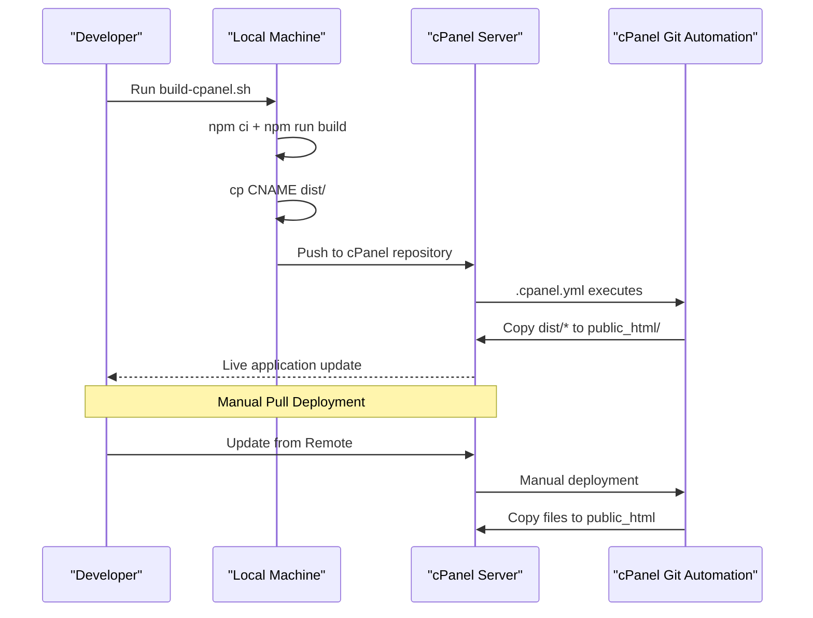
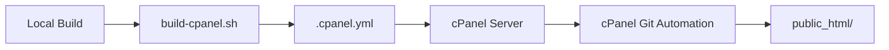

# CI/CD Pipeline

<cite>
**Referenced Files in This Document**
- [.cpanel.yml](file://.cpanel.yml)
- [build-cpanel.sh](file://build-cpanel.sh)
- [CPANEL_DEPLOYMENT.md](file://CPANEL_DEPLOYMENT.md)
- [scripts/deploy.js](file://scripts/deploy.js)
- [DEPLOYMENT.md](file://DEPLOYMENT.md)
- [package.json](file://package.json)
- [vite.config.js](file://vite.config.js)
- [src-tauri/tauri.conf.json](file://src-tauri/tauri.conf.json)
- [.env.example](file://.env.example)
</cite>

## Update Summary
**Changes Made**
- Updated to reflect the complete removal of GitHub Actions automated deployment workflow
- Removed all references to automated deployment via GitHub Actions, SCP-based file transfers, and server restarts
- Focused documentation exclusively on cPanel's built-in Git integration system
- Enhanced documentation for cPanel deployment with .cpanel.yml configuration, build-cpanel.sh script, and manual deployment processes
- Updated architecture diagrams to show cPanel-based deployment instead of automated GitHub Actions workflow
- Revised deployment strategies to focus on cPanel hosting with Git push/pull deployment options

## Table of Contents
1. [Introduction](#introduction)
2. [Project Structure](#project-structure)
3. [Core Components](#core-components)
4. [Architecture Overview](#architecture-overview)
5. [Detailed Component Analysis](#detailed-component-analysis)
6. [Dependency Analysis](#dependency-analysis)
7. [Performance Considerations](#performance-considerations)
8. [Troubleshooting Guide](#troubleshooting-guide)
9. [Conclusion](#conclusion)
10. [Appendices](#appendices)

## Introduction
This document provides comprehensive CI/CD pipeline documentation for RosterFlow, focusing on the current cPanel deployment system. The repository now includes a streamlined deployment process that leverages cPanel's built-in Git version control capabilities combined with automated build and deployment scripts. The previous GitHub Actions automated deployment workflow has been completely removed from the codebase, eliminating the need for external deployment automation in favor of cPanel's native Git integration.

## Project Structure
RosterFlow's CI/CD system centers around cPanel Git deployment with automated build and deployment processes. The system provides both automatic push deployment and manual pull deployment options through cPanel's built-in Git integration.

```mermaid
graph TB
subgraph "cPanel Deployment System"
CPANEL[".cpanel.yml"]
BUILDCP["build-cpanel.sh"]
END
subgraph "Application Build"
PKG["package.json"]
VCFG["vite.config.js"]
END
subgraph "Deployment Documentation"
DEPLOYMD["DEPLOYMENT.md"]
CPANELMD["CPANEL_DEPLOYMENT.md"]
END
subgraph "Configuration"
ENV[".env.example"]
TCONFIG["src-tauri/tauri.conf.json"]
END
CPANEL --> PKG
BUILDCP --> PKG
CPANELMD --> CPANEL
DEPLOYMD --> CPANEL
```

**Diagram sources**
- [.cpanel.yml:1-6](file://.cpanel.yml#L1-L6)
- [build-cpanel.sh:1-23](file://build-cpanel.sh#L1-L23)
- [CPANEL_DEPLOYMENT.md:1-306](file://CPANEL_DEPLOYMENT.md#L1-L306)
- [DEPLOYMENT.md:1-125](file://DEPLOYMENT.md#L1-L125)
- [package.json:1-46](file://package.json#L1-L46)
- [vite.config.js:1-19](file://vite.config.js#L1-L19)
- [src-tauri/tauri.conf.json:1-35](file://src-tauri/tauri.conf.json#L1-L35)
- [.env.example:1-5](file://.env.example#L1-L5)

**Section sources**
- [.cpanel.yml:1-6](file://.cpanel.yml#L1-L6)
- [build-cpanel.sh:1-23](file://build-cpanel.sh#L1-L23)
- [CPANEL_DEPLOYMENT.md:1-306](file://CPANEL_DEPLOYMENT.md#L1-L306)
- [DEPLOYMENT.md:1-125](file://DEPLOYMENT.md#L1-L125)
- [package.json:1-46](file://package.json#L1-L46)
- [vite.config.js:1-19](file://vite.config.js#L1-L19)
- [src-tauri/tauri.conf.json:1-35](file://src-tauri/tauri.conf.json#L1-L35)
- [.env.example:1-5](file://.env.example#L1-L5)

## Core Components
The CI/CD system now focuses exclusively on cPanel deployment with two complementary approaches:

### cPanel Git Deployment System
- **Trigger**: Git push to cPanel repository or manual pull deployment
- **Automation**: .cpanel.yml configuration for automatic file copying
- **Build Process**: Local build with build-cpanel.sh script
- **File Management**: Automatic copying from dist/ to public_html/
- **Domain Configuration**: Support for custom domains via CNAME file

### Manual Deployment Options
- **Script**: Node.js deployment script with environment variable loading
- **Shell Script**: build-cpanel.sh for local cPanel deployment
- **Fallback**: Manual deployment when automated workflow is unavailable

**Section sources**
- [.cpanel.yml:1-6](file://.cpanel.yml#L1-L6)
- [build-cpanel.sh:1-23](file://build-cpanel.sh#L1-L23)
- [scripts/deploy.js:1-56](file://scripts/deploy.js#L1-L56)

## Architecture Overview
The CI/CD architecture now supports cPanel-based deployment with both automatic push and manual pull deployment options. The system provides flexibility for different deployment scenarios while maintaining consistency in build processes and environment management.



**Diagram sources**
- [.cpanel.yml:1-6](file://.cpanel.yml#L1-L6)

## Detailed Component Analysis

### cPanel Git Deployment System: .cpanel.yml
**New** Comprehensive cPanel configuration for automated deployment.

- **Purpose**: Define deployment tasks for cPanel Git repositories
- **Configuration**: YAML format with deployment tasks section
- **Tasks**: Export deployment path and copy dist files to public_html
- **Automation**: Executes automatically when cPanel detects repository changes

**Section sources**
- [.cpanel.yml:1-6](file://.cpanel.yml#L1-L6)

### Build Script: build-cpanel.sh
**New** Automated build script for cPanel deployment.

- **Purpose**: Streamline the build and preparation process for cPanel deployment
- **Features**: Dependency installation, application build, CNAME file copying
- **Output**: Ready-to-deploy dist folder with CNAME file
- **Integration**: Designed for both automated and manual deployment workflows

**Section sources**
- [build-cpanel.sh:1-23](file://build-cpanel.sh#L1-L23)

### Manual Deployment Script: deploy.js
**Updated** Enhanced with improved error handling and deployment guidance.

- **Purpose**: Alternative to automated deployment workflow
- **Features**: Environment variable loading, build verification, deployment instructions
- **Error Handling**: Comprehensive error checking and user feedback
- **Integration**: Works with GitHub Actions secrets for seamless deployment

**Section sources**
- [scripts/deploy.js:1-56](file://scripts/deploy.js#L1-L56)

### cPanel Deployment Documentation: CPANEL_DEPLOYMENT.md
**New** Comprehensive guide for cPanel deployment setup and troubleshooting.

- **Prerequisites**: cPanel hosting with Git Version Control, Node.js installation
- **Setup Process**: Step-by-step guide for repository creation and configuration
- **Deployment Methods**: Automatic push deployment and manual pull deployment
- **Troubleshooting**: Common issues and resolution steps for cPanel deployment
- **Verification**: Post-deployment verification and testing procedures

**Section sources**
- [CPANEL_DEPLOYMENT.md:1-306](file://CPANEL_DEPLOYMENT.md#L1-L306)

### Deployment Documentation: DEPLOYMENT.md
**Updated** Enhanced with comprehensive secrets management and troubleshooting.

- **Prerequisites**: GitHub repository, server with SSH access, web server configuration
- **Secrets Configuration**: Detailed GitHub Actions secret setup guide
- **Server Requirements**: Directory structure, nginx configuration examples
- **Manual Deployment**: Step-by-step manual deployment process
- **Troubleshooting**: Common issues and resolution steps
- **Rollback Procedures**: Backup restoration and version recovery

**Section sources**
- [DEPLOYMENT.md:1-125](file://DEPLOYMENT.md#L1-L125)

### Frontend Build Configuration
**Updated** Enhanced with cPanel-specific optimizations.

- **Base Path**: Relative path configuration (`./`) for cPanel compatibility
- **Build Output**: dist directory with assets in subfolder structure
- **Environment Variables**: Supabase configuration embedded during build
- **Development vs Production**: Different handling for development and deployment environments

**Section sources**
- [vite.config.js:5-12](file://vite.config.js#L5-L12)
- [package.json:7-14](file://package.json#L7-L14)

### Environment Variables and Secrets Management
**Updated** Enhanced with comprehensive secrets management for both workflows.

- **Production Variables**: VITE_SUPABASE_URL, VITE_SUPABASE_ANON_KEY
- **Server Access**: HOST, USERNAME, SSH_PRIVATE_KEY, PORT
- **GitHub Actions Integration**: Secure secret management through repository settings
- **Local Development**: .env.example template for development environment setup
- **Security Best Practices**: SSH key management and access control

**Section sources**
- [.cpanel.yml:27-39](file://.cpanel.yml#L27-L39)
- [.env.example:1-5](file://.env.example#L1-L5)
- [DEPLOYMENT.md:13-29](file://DEPLOYMENT.md#L13-L29)

### Multi-Platform Desktop Build Matrix
**Updated** Enhanced with improved dependency management for Tauri applications.

- **Supported Platforms**: macOS, Ubuntu 22.04, Windows
- **Ubuntu Dependencies**: GTK/WebKit packages for Tauri bundling
- **Rust Toolchain**: Stable version for cross-platform desktop application building
- **Conditional Dependencies**: Platform-specific package installation
- **Release Management**: GitHub Release creation with versioned artifacts

**Section sources**
- [src-tauri/tauri.conf.json:24-34](file://src-tauri/tauri.conf.json#L24-L34)

## Dependency Analysis
The CI/CD system now supports cPanel-based deployment with clear separation of concerns:



**Diagram sources**
- [build-cpanel.sh:1-23](file://build-cpanel.sh#L1-L23)
- [.cpanel.yml:1-6](file://.cpanel.yml#L1-L6)

**Section sources**
- [build-cpanel.sh:1-23](file://build-cpanel.sh#L1-L23)
- [.cpanel.yml:1-6](file://.cpanel.yml#L1-L6)

## Performance Considerations
**Updated** Enhanced performance considerations for cPanel deployment architecture.

- **Deployment Workflow**: Optimized for rapid web application updates with minimal downtime
- **Build Optimization**: npm ci for faster dependency installation compared to npm install
- **cPanel Automation**: Automatic file copying through .cpanel.yml for seamless deployment
- **Asset Loading**: Optimized asset structure for cPanel compatibility

## Troubleshooting Guide
**Updated** Comprehensive troubleshooting guide for cPanel deployment workflows.

### cPanel Git Deployment Problems
- **Repository Setup**: Verify cPanel repository is properly configured with correct branch
- **Deployment Automation**: Check .cpanel.yml syntax and deployment path configuration
- **File Permissions**: Ensure dist/ files have proper permissions for cPanel access
- **Git Status**: Verify repository is clean and ready for deployment
- **Remote Configuration**: Check SSH remote URL and authentication setup

### Build Process Problems
- **npm ci Failures**: Clear npm cache and verify package.json integrity
- **Environment Variables**: Ensure VITE_SUPABASE_URL and VITE_SUPABASE_ANON_KEY are set
- **Build Errors**: Check for missing dependencies or incompatible Node.js versions
- **Asset Loading**: Verify dist directory contains all required build files

### Manual Deployment Problems
- **Script Execution**: Ensure Node.js is available and scripts/deploy.js is accessible
- **Environment Loading**: Verify .env file exists and contains required variables
- **Build Verification**: Check that dist directory is created after successful build
- **Deployment Instructions**: Follow manual deployment steps outlined in deployment guide

### cPanel-Specific Issues
- **Domain Configuration**: Verify DNS settings and domain pointing to cPanel server
- **File Structure**: Ensure proper directory structure with public_html and serveflow folders
- **Git Integration**: Check cPanel Git Version Control settings and repository configuration
- **Custom Domains**: Verify CNAME file is present in dist/ directory

**Section sources**
- [.cpanel.yml:31-60](file://.cpanel.yml#L31-L60)
- [CPANEL_DEPLOYMENT.md:169-296](file://CPANEL_DEPLOYMENT.md#L169-L296)
- [DEPLOYMENT.md:105-125](file://DEPLOYMENT.md#L105-L125)

## Conclusion
RosterFlow's CI/CD system now provides comprehensive automation for cPanel-based deployment with both automatic push and manual pull deployment options. The system eliminates the previous GitHub Actions automated deployment workflow by leveraging cPanel's Git version control capabilities combined with automated build and deployment processes. This provides a more robust and flexible deployment solution for web applications hosted on cPanel servers, with comprehensive documentation and troubleshooting support.

## Appendices

### cPanel Deployment Configuration Checklist
**New** Enhanced checklist for cPanel deployment workflow setup.

- **Repository Setup**: cPanel repository with Git Version Control enabled
- **Build Configuration**: .cpanel.yml with proper deployment tasks
- **Build Script**: build-cpanel.sh for local deployment preparation
- **Environment Variables**: VITE_SUPABASE_URL, VITE_SUPABASE_ANON_KEY
- **Server Requirements**: cPanel hosting with Git support, proper file permissions
- **Domain Configuration**: Custom domain setup with DNS pointing to cPanel server

**Section sources**
- [CPANEL_DEPLOYMENT.md:5-125](file://CPANEL_DEPLOYMENT.md#L5-L125)
- [.cpanel.yml:1-6](file://.cpanel.yml#L1-L6)
- [build-cpanel.sh:1-23](file://build-cpanel.sh#L1-L23)

### Guidelines for Modifications and Extensions
**Updated** Enhanced guidelines for CI/CD workflow modifications.

#### cPanel Deployment Enhancements
- **Additional Environments**: Add new branches or tags for different deployment environments
- **Custom Server Configurations**: Extend .cpanel.yml for custom server setups
- **Monitoring Integration**: Add health checks and monitoring notifications
- **Staging Environment**: Implement separate staging deployment workflow

#### Build Process Extensions
- **Additional Platforms**: Extend build-cpanel.sh for new deployment targets
- **Custom Packaging**: Modify build process for custom application bundling
- **Testing Integration**: Add automated testing before deployment
- **Quality Gates**: Implement approval workflows for deployment

#### Security Enhancements
- **Secret Rotation**: Implement automated secret rotation procedures
- **Access Control**: Add role-based access control for deployment permissions
- **Audit Logging**: Enable detailed logging for all deployment activities
- **Compliance**: Add compliance checks for production deployments

**Section sources**
- [.cpanel.yml:3-60](file://.cpanel.yml#L3-L60)
- [CPANEL_DEPLOYMENT.md:1-306](file://CPANEL_DEPLOYMENT.md#L1-L306)
- [DEPLOYMENT.md:1-125](file://DEPLOYMENT.md#L1-L125)