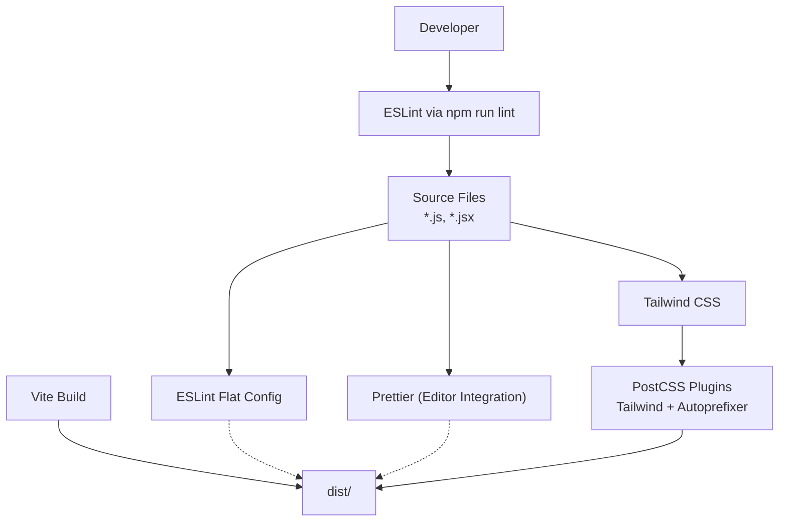
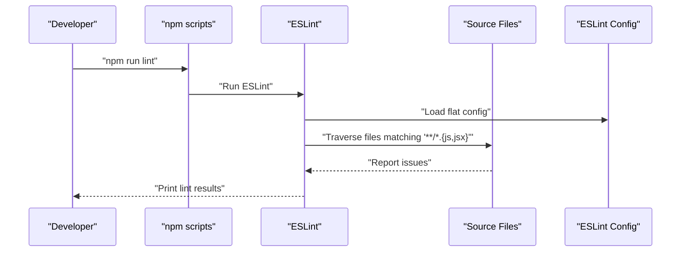
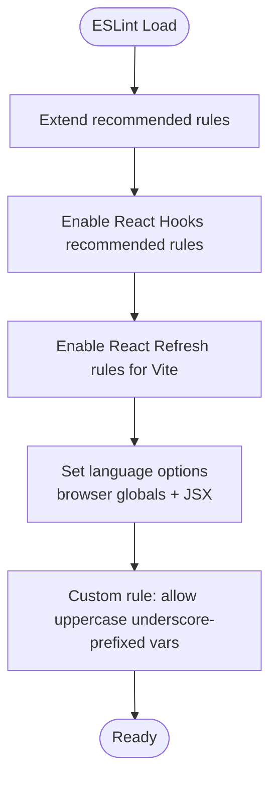
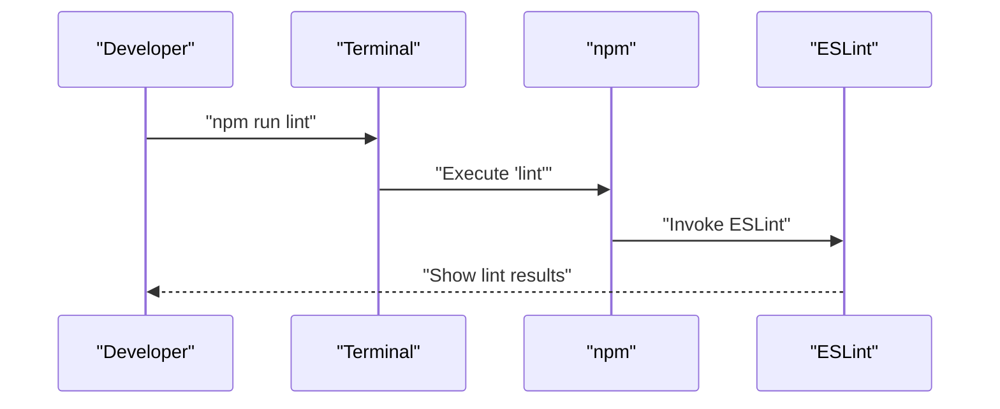
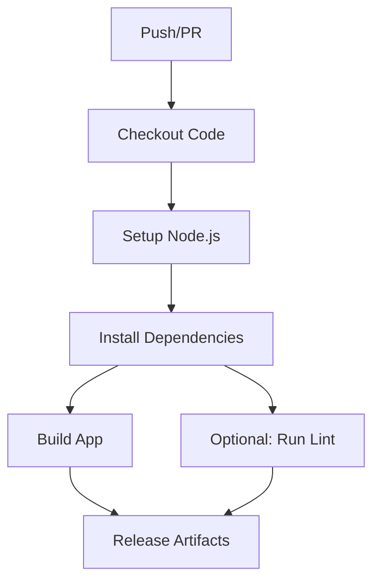
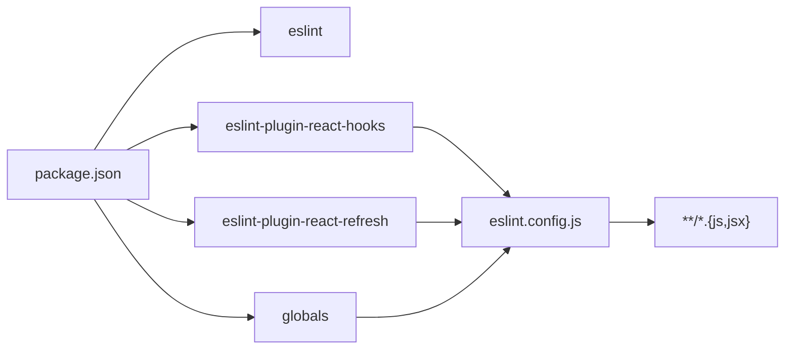

# Code Quality Tools

<cite>
**Referenced Files in This Document**
- [eslint.config.js](file://eslint.config.js)
- [package.json](file://package.json)
- [README.md](file://README.md)
- [.github/workflows/release.yml](file://.github/workflows/release.yml)
- [postcss.config.js](file://postcss.config.js)
- [tailwind.config.js](file://tailwind.config.js)
</cite>

## Table of Contents
1. [Introduction](#introduction)
2. [Project Structure](#project-structure)
3. [Core Components](#core-components)
4. [Architecture Overview](#architecture-overview)
5. [Detailed Component Analysis](#detailed-component-analysis)
6. [Dependency Analysis](#dependency-analysis)
7. [Performance Considerations](#performance-considerations)
8. [Troubleshooting Guide](#troubleshooting-guide)
9. [Conclusion](#conclusion)
10. [Appendices](#appendices)

## Introduction
This document explains the code quality and linting tooling in RosterFlow. It covers the ESLint configuration, recommended formatting standards, editor setup, the linting script, CI/CD integration points, code review expectations, and practical guidance for maintaining consistent, high-quality JavaScript/JSX code.

## Project Structure
RosterFlow uses modern tooling:
- ESLint flat config for maintainable, centralized rules
- Vite for fast development and build
- Tailwind CSS for utility-first styling
- PostCSS with Tailwind and Autoprefixer for CSS processing

**Diagram sources**
- [eslint.config.js](file://eslint.config.js#L1-L30)
- [package.json](file://package.json#L7-L14)
- [postcss.config.js](file://postcss.config.js#L1-L7)
- [tailwind.config.js](file://tailwind.config.js#L1-L51)

**Section sources**
- [eslint.config.js](file://eslint.config.js#L1-L30)
- [package.json](file://package.json#L1-L44)
- [postcss.config.js](file://postcss.config.js#L1-L7)
- [tailwind.config.js](file://tailwind.config.js#L1-L51)

## Core Components
- ESLint flat configuration defines recommended base rules, React Hooks rules, and React Refresh rules tailored for Vite environments. It also sets language options and a custom rule for variable naming.
- The npm script “lint” invokes ESLint against the entire project.
- Formatting is handled by Prettier through editor integrations; Tailwind and PostCSS are configured for CSS processing.

Key elements:
- ESLint flat config extends recommended defaults and integrates React Hooks and React Refresh presets.
- A custom rule allows uppercase underscore-prefixed variables to avoid unused-var warnings.
- Vite is recognized for refresh-related rules.
- Tailwind’s content globs scan the source tree for class usage.

**Section sources**
- [eslint.config.js](file://eslint.config.js#L7-L29)
- [package.json](file://package.json#L12-L12)
- [tailwind.config.js](file://tailwind.config.js#L3-L6)

## Architecture Overview
The linting pipeline ties together source code, ESLint, and editor/formatter integrations. Tailwind and PostCSS are part of the build pipeline and complement code quality by ensuring consistent styling.

**Diagram sources**
- [package.json](file://package.json#L12-L12)
- [eslint.config.js](file://eslint.config.js#L10-L15)

## Detailed Component Analysis

### ESLint Configuration
RosterFlow centralizes lint rules in a flat config:
- Extends recommended base rules
- Adds React Hooks recommended rules
- Adds React Refresh rules optimized for Vite
- Sets language options for browser globals and JSX parsing
- Applies a custom rule allowing uppercase underscore-prefixed variables to pass unused-var checks

**Diagram sources**
- [eslint.config.js](file://eslint.config.js#L11-L27)

**Section sources**
- [eslint.config.js](file://eslint.config.js#L7-L29)

### Linting Script and Usage
- The “lint” script runs ESLint across the project.
- Run locally during development or as part of pre-commit checks.
- Integrate with editors to surface issues inline.

**Diagram sources**
- [package.json](file://package.json#L12-L12)
- [eslint.config.js](file://eslint.config.js#L10-L15)

**Section sources**
- [package.json](file://package.json#L12-L12)
- [README.md](file://README.md#L14-L16)

### Formatting Standards and Prettier Integration
- Formatting is enforced via Prettier through editor integrations. Configure your editor to format on save and show trailing whitespace.
- Keep Prettier settings aligned with team preferences; avoid committing conflicting formatter configs to the repository.
- ESLint and Prettier work together: ESLint focuses on logic and style rules; Prettier ensures consistent formatting.

[No sources needed since this section provides general guidance]

### Editor Configuration Recommendations
- Enable ESLint and Prettier extensions in your editor.
- Configure format-on-save and show formatting errors inline.
- Ensure the editor uses the project’s Node.js runtime and installed tool versions.

[No sources needed since this section provides general guidance]

### CI/CD Integration
- The repository includes a GitHub Actions workflow for building and releasing artifacts across platforms.
- While the workflow does not explicitly run the lint script, it installs dependencies and builds the app. Add the lint job alongside existing steps to enforce quality gates in CI.

**Diagram sources**
- [.github/workflows/release.yml](file://.github/workflows/release.yml#L19-L38)

**Section sources**
- [.github/workflows/release.yml](file://.github/workflows/release.yml#L1-L49)

### Code Review Guidelines and Pull Request Requirements
- Every pull request must pass lint checks locally before opening a PR.
- CI jobs should include a lint step to prevent low-quality changes from merging.
- Keep diffs small and focused; ensure new code adheres to existing patterns and passes lint.

[No sources needed since this section provides general guidance]

### Quality Gates
- Local gate: “npm run lint” must pass.
- CI gate: Add a step to run the lint command in CI to block merges until lint passes.

[No sources needed since this section provides general guidance]

### Common Linting Errors and Fixes
- Unused variables: If a variable is intentionally reserved (e.g., event handlers), prefix with uppercase underscores to satisfy the custom rule.
- Missing React Hooks dependencies: Ensure all values referenced inside hooks are included in dependency arrays.
- Incorrect refresh rules: Confirm React Refresh rules apply only in development with Vite.

**Section sources**
- [eslint.config.js](file://eslint.config.js#L25-L27)

### Best Practices for Consistency
- Keep the ESLint config centralized and minimal; rely on recommended presets.
- Prefer declarative patterns and clear naming to reduce lint noise.
- Use Tailwind utilities consistently; keep content globs up to date so unused styles are purged.

**Section sources**
- [tailwind.config.js](file://tailwind.config.js#L3-L6)

### Pre-commit Hooks and Automated Checks
- Use a pre-commit hook runner (e.g., Husky with lint-staged) to run “npm run lint” and auto-format with Prettier on staged files.
- Fail commits when lint fails to maintain quality at the source.

[No sources needed since this section provides general guidance]

## Dependency Analysis
RosterFlow’s linting stack is defined in the package manifest and ESLint flat config.

**Diagram sources**
- [package.json](file://package.json#L25-L38)
- [eslint.config.js](file://eslint.config.js#L1-L5)

**Section sources**
- [package.json](file://package.json#L25-L38)
- [eslint.config.js](file://eslint.config.js#L1-L5)

## Performance Considerations
- Keep the ESLint ignore list minimal; only exclude truly unnecessary folders (e.g., dist).
- Use Vite’s React Refresh rules to avoid redundant checks in development.
- Avoid overly expensive rules in CI; rely on recommended presets and targeted exceptions.

**Section sources**
- [eslint.config.js](file://eslint.config.js#L8-L8)

## Troubleshooting Guide
- Lint fails locally but passes in CI: verify Node.js and ESLint versions match the project’s devDependencies.
- Missing React Refresh rules: confirm Vite is being used and the React Refresh preset is applied.
- Tailwind classes flagged by lint: ensure Tailwind’s content globs include the relevant files.

**Section sources**
- [package.json](file://package.json#L25-L38)
- [eslint.config.js](file://eslint.config.js#L13-L14)
- [tailwind.config.js](file://tailwind.config.js#L3-L6)

## Conclusion
RosterFlow’s linting setup centers on a clean ESLint flat configuration with React Hooks and React Refresh presets, a simple “npm run lint” script, and strong support for Tailwind and PostCSS. By integrating lint checks into local workflows and CI, teams can maintain consistent, readable, and reliable code.

## Appendices

### Appendix A: ESLint Flat Config Highlights
- Files pattern: matches JS and JSX files
- Presets: recommended, React Hooks recommended, React Refresh Vite
- Language options: browser globals, JSX parsing
- Custom rule: allow uppercase underscore-prefixed variables for unused-var

**Section sources**
- [eslint.config.js](file://eslint.config.js#L10-L27)

### Appendix B: Scripts and Tool Versions
- Lint script: runs ESLint across the project
- ESLint and related plugins are declared as devDependencies

**Section sources**
- [package.json](file://package.json#L12-L12)
- [package.json](file://package.json#L25-L38)