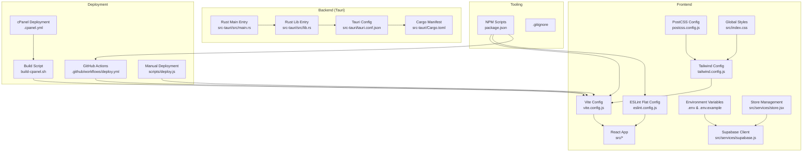
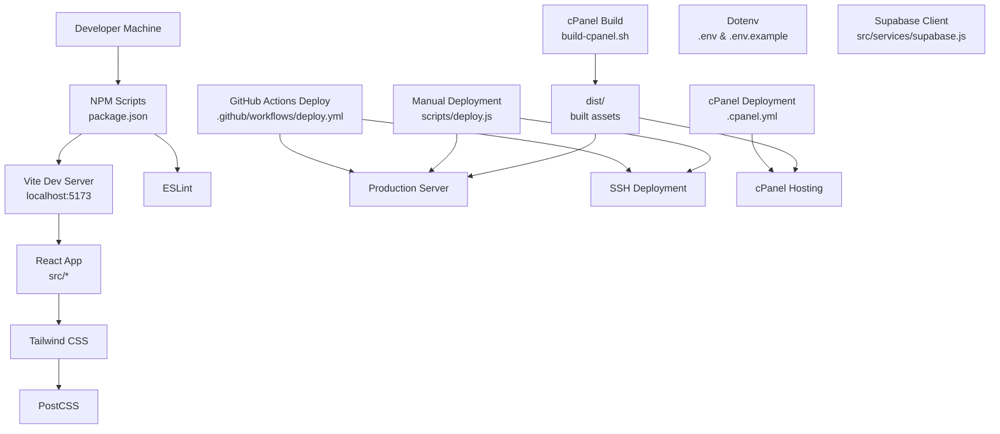
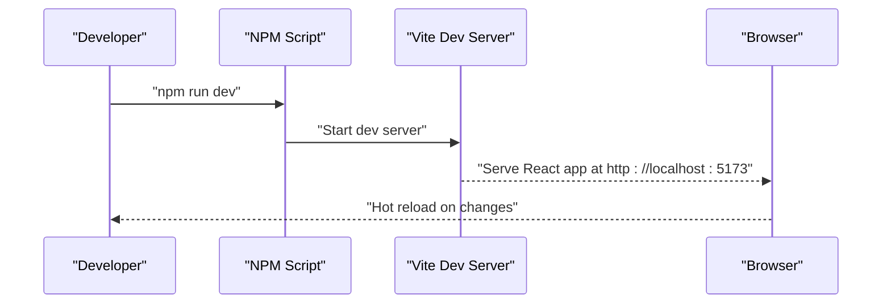
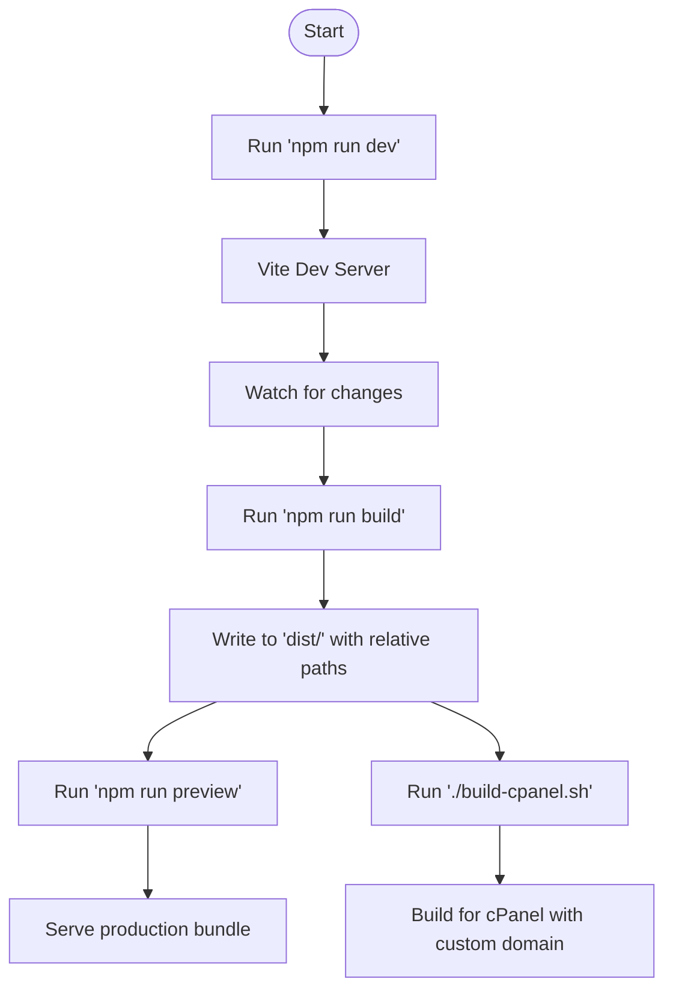
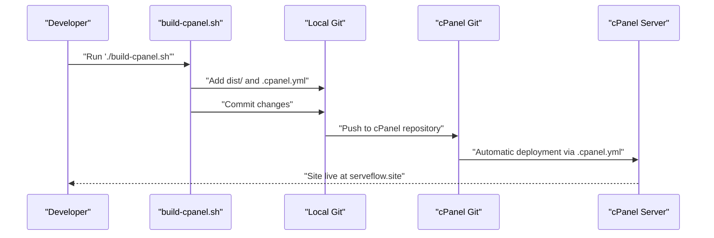
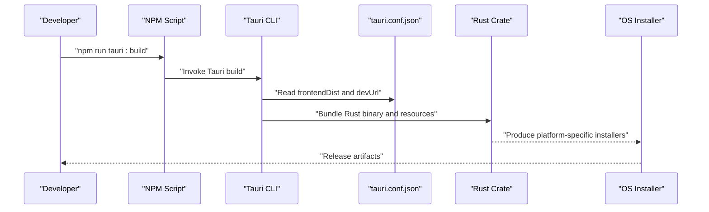
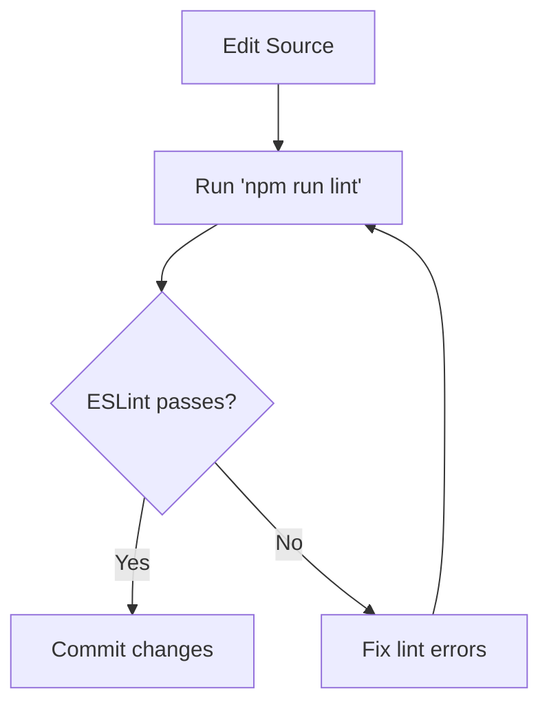
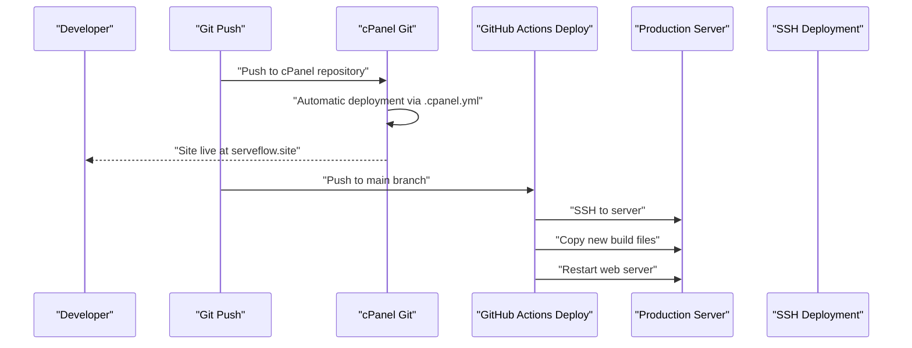
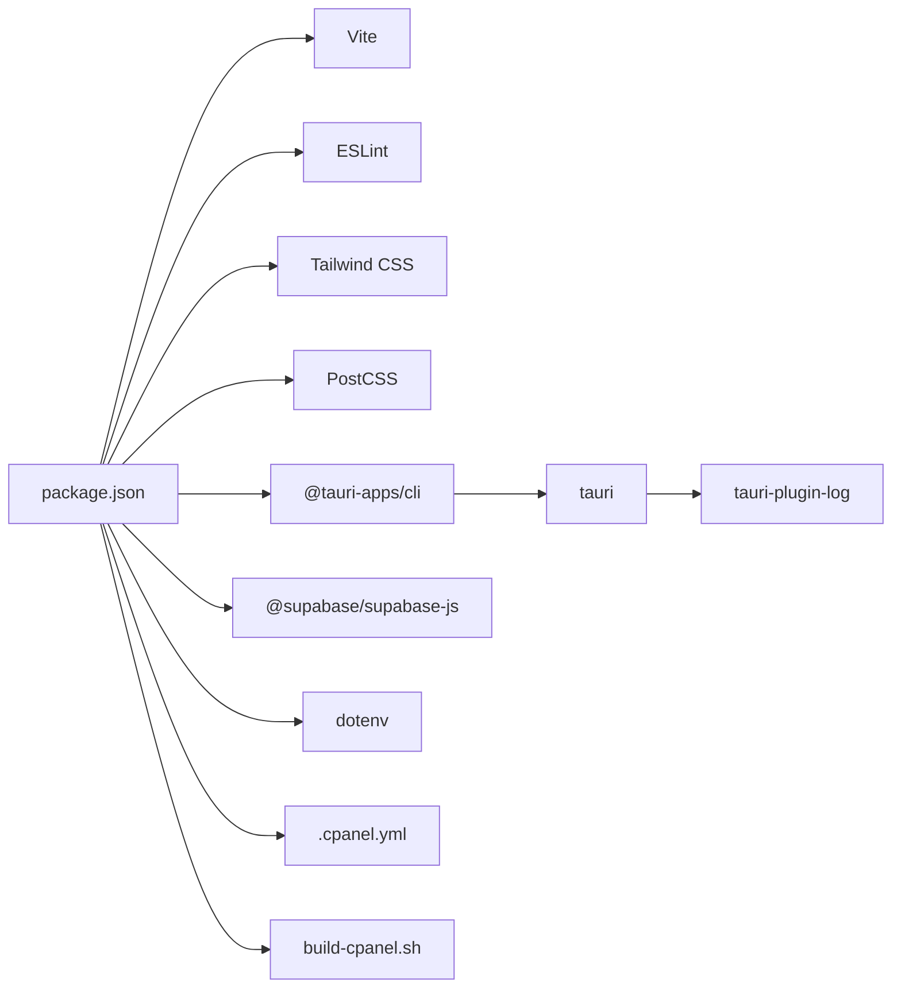

# Development Workflow

<cite>
**Referenced Files in This Document**
- [package.json](file://package.json)
- [vite.config.js](file://vite.config.js)
- [eslint.config.js](file://eslint.config.js)
- [tailwind.config.js](file://tailwind.config.js)
- [postcss.config.js](file://postcss.config.js)
- [src/index.css](file://src/index.css)
- [.cpanel.yml](file://.cpanel.yml)
- [build-cpanel.sh](file://build-cpanel.sh)
- [CPANEL_DEPLOYMENT.md](file://CPANEL_DEPLOYMENT.md)
- [scripts/deploy.js](file://scripts/deploy.js)
- [.env.example](file://.env.example)
- [.env](file://.env)
- [.gitignore](file://.gitignore)
- [src-tauri/tauri.conf.json](file://src-tauri/tauri.conf.json)
- [src-tauri/Cargo.toml](file://src-tauri/Cargo.toml)
- [src-tauri/src/main.rs](file://src-tauri/src/main.rs)
- [src-tauri/src/lib.rs](file://src-tauri/src/lib.rs)
- [.github/workflows/deploy.yml](file://.github/workflows/deploy.yml)
- [DEPLOYMENT.md](file://DEPLOYMENT.md)
- [README.md](file://README.md)
- [src/services/store.jsx](file://src/services/store.jsx)
- [src/services/supabase.js](file://src/services/supabase.js)
</cite>

## Update Summary
**Changes Made**
- Added comprehensive cPanel deployment workflow with dedicated build script and configuration
- Integrated Tailwind CSS with PostCSS for modern styling pipeline
- Implemented ESLint flat configuration for enhanced code quality
- Enhanced Vite configuration with cPanel compatibility settings
- Added automated deployment pipeline for both cPanel and traditional servers
- Introduced environment variable management for production deployments

## Table of Contents
1. [Introduction](#introduction)
2. [Project Structure](#project-structure)
3. [Core Components](#core-components)
4. [Architecture Overview](#architecture-overview)
5. [Detailed Component Analysis](#detailed-component-analysis)
6. [Dependency Analysis](#dependency-analysis)
7. [Performance Considerations](#performance-considerations)
8. [Troubleshooting Guide](#troubleshooting-guide)
9. [Conclusion](#conclusion)
10. [Appendices](#appendices)

## Introduction
This document explains the development workflow and build processes for the project. It covers environment setup, dependency management, local development server configuration, Vite-based builds with cPanel compatibility, comprehensive styling pipeline with Tailwind CSS and PostCSS, ESLint configuration for code quality, testing strategies, CI/CD with GitHub Actions, debugging techniques, contribution guidelines, and release procedures. The project supports both traditional server deployment and cPanel Git-based deployment with automated build processes.

## Project Structure
The repository combines a React frontend built with Vite, Tailwind CSS, and PostCSS, with comprehensive deployment automation for both traditional servers and cPanel hosting. Key areas:
- Frontend: React application under src/, Vite configuration with cPanel compatibility, Tailwind and PostCSS setup
- Styling: Tailwind CSS configuration with custom color palette and PostCSS processing
- Code Quality: ESLint flat configuration with React-specific rules
- Deployment: Multiple deployment strategies including cPanel Git deployment and traditional server deployment
- CI/CD: GitHub Actions workflow for automated deployments
- Environment Management: Centralized dotenv support for development and production

**Diagram sources**
- [vite.config.js:1-19](file://vite.config.js#L1-L19)
- [tailwind.config.js:1-51](file://tailwind.config.js#L1-L51)
- [postcss.config.js:1-7](file://postcss.config.js#L1-L7)
- [eslint.config.js:1-30](file://eslint.config.js#L1-L30)
- [src/index.css:1-10](file://src/index.css#L1-L10)
- [.cpanel.yml:1-6](file://.cpanel.yml#L1-L6)
- [build-cpanel.sh:1-23](file://build-cpanel.sh#L1-L23)
- [.github/workflows/deploy.yml:1-60](file://.github/workflows/deploy.yml#L1-L60)
- [scripts/deploy.js:1-56](file://scripts/deploy.js#L1-L56)
- [src-tauri/tauri.conf.json:1-35](file://src-tauri/tauri.conf.json#L1-L35)
- [src-tauri/Cargo.toml:1-26](file://src-tauri/Cargo.toml#L1-L26)
- [src-tauri/src/lib.rs:1-17](file://src-tauri/src/lib.rs#L1-L17)
- [src-tauri/src/main.rs:1-7](file://src-tauri/src/main.rs#L1-L7)
- [package.json:1-46](file://package.json#L1-L46)

**Section sources**
- [package.json:1-46](file://package.json#L1-L46)
- [vite.config.js:1-19](file://vite.config.js#L1-L19)
- [eslint.config.js:1-30](file://eslint.config.js#L1-L30)
- [tailwind.config.js:1-51](file://tailwind.config.js#L1-L51)
- [postcss.config.js:1-7](file://postcss.config.js#L1-L7)
- [src/index.css:1-10](file://src/index.css#L1-L10)
- [.cpanel.yml:1-6](file://.cpanel.yml#L1-L6)
- [build-cpanel.sh:1-23](file://build-cpanel.sh#L1-L23)
- [.github/workflows/deploy.yml:1-60](file://.github/workflows/deploy.yml#L1-L60)
- [scripts/deploy.js:1-56](file://scripts/deploy.js#L1-L56)
- [src-tauri/tauri.conf.json:1-35](file://src-tauri/tauri.conf.json#L1-L35)
- [src-tauri/Cargo.toml:1-26](file://src-tauri/Cargo.toml#L1-L26)
- [src-tauri/src/lib.rs:1-17](file://src-tauri/src/lib.rs#L1-L17)
- [src-tauri/src/main.rs:1-7](file://src-tauri/src/main.rs#L1-L7)

## Core Components
- NPM scripts orchestrate development, building, previewing, linting, and deployment across multiple platforms.
- Vite provides the dev server and bundling for the React app with cPanel compatibility through relative base paths.
- ESLint flat config enforces code quality with React Hooks and React Refresh plugins.
- Tailwind CSS with PostCSS handles modern styling pipeline with custom color palettes and automatic purging.
- Comprehensive deployment automation supporting both cPanel Git deployment and traditional server deployment.
- GitHub Actions automates production deployments with environment variable management and SSH-based file transfer.
- Dotenv support enables centralized environment variable management for both development and production.
- Tauri integrates the React app into a native desktop application via a Rust backend.

Key responsibilities:
- package.json: defines scripts and dependencies for frontend, deployment, and Tauri CLI integration.
- vite.config.js: enables React plugin, sets base path for cPanel compatibility, and configures asset bundling.
- eslint.config.js: flat config with recommended rules, React-specific plugins, and browser globals.
- tailwind.config.js: content globs, custom color palette, and theme extensions for comprehensive styling.
- postcss.config.js: enables Tailwind and Autoprefixer for modern CSS processing.
- src/index.css: global styles with Tailwind directives and custom layer configurations.
- .cpanel.yml: cPanel deployment configuration for Git-based automatic deployment.
- build-cpanel.sh: specialized build script for cPanel deployment with custom domain support.
- scripts/deploy.js: manual deployment script with dotenv integration for traditional servers.
- .env and .env.example: centralized environment variable management for Supabase configuration.

**Section sources**
- [package.json:1-46](file://package.json#L1-L46)
- [vite.config.js:1-19](file://vite.config.js#L1-L19)
- [eslint.config.js:1-30](file://eslint.config.js#L1-L30)
- [tailwind.config.js:1-51](file://tailwind.config.js#L1-L51)
- [postcss.config.js:1-7](file://postcss.config.js#L1-L7)
- [src/index.css:1-10](file://src/index.css#L1-L10)
- [.cpanel.yml:1-6](file://.cpanel.yml#L1-L6)
- [build-cpanel.sh:1-23](file://build-cpanel.sh#L1-L23)
- [scripts/deploy.js:1-56](file://scripts/deploy.js#L1-L56)
- [.env.example:1-5](file://.env.example#L1-L5)
- [.env:1-5](file://.env#L1-L5)

## Architecture Overview
The system consists of a React frontend served by Vite with Tailwind CSS styling, packaged for multiple deployment targets including cPanel Git deployment and traditional server deployment. The CI pipeline automates deployments with environment variable management, while the development workflow supports both local development and production-ready builds.

**Diagram sources**
- [package.json:1-46](file://package.json#L1-L46)
- [vite.config.js:1-19](file://vite.config.js#L1-L19)
- [tailwind.config.js:1-51](file://tailwind.config.js#L1-L51)
- [postcss.config.js:1-7](file://postcss.config.js#L1-L7)
- [eslint.config.js:1-30](file://eslint.config.js#L1-L30)
- [build-cpanel.sh:1-23](file://build-cpanel.sh#L1-L23)
- [.cpanel.yml:1-6](file://.cpanel.yml#L1-L6)
- [.github/workflows/deploy.yml:1-60](file://.github/workflows/deploy.yml#L1-L60)
- [scripts/deploy.js:1-56](file://scripts/deploy.js#L1-L56)
- [src/services/supabase.js:1-24](file://src/services/supabase.js#L1-L24)
- [src/services/store.jsx:1-1093](file://src/services/store.jsx#L1-L1093)

## Detailed Component Analysis

### Development Environment Setup
- Node.js and npm: Install Node LTS as required by the CI workflow.
- Dependencies: Install frontend dependencies with npm install.
- Environment variables: Copy .env.example to .env and configure Supabase credentials.
- cPanel deployment: Use build-cpanel.sh for cPanel-specific builds with custom domain support.
- Traditional deployment: Use scripts/deploy.js for manual deployments with SSH support.
- Dotenv support: Both deployment scripts load environment variables from .env using dotenv.

Recommended steps:
- Install Node.js LTS.
- Run npm install to fetch dependencies.
- Create .env from .env.example and set VITE_SUPABASE_URL and VITE_SUPABASE_ANON_KEY.
- Start the dev server with npm run dev.
- For cPanel deployment, run ./build-cpanel.sh to build with cPanel compatibility.
- For manual deployment, run npm run deploy to build and prepare for deployment.

**Updated** Enhanced with cPanel deployment workflow and improved environment management

**Section sources**
- [.github/workflows/deploy.yml:16-20](file://.github/workflows/deploy.yml#L16-L20)
- [.env.example:1-5](file://.env.example#L1-L5)
- [.env:1-5](file://.env#L1-L5)
- [package.json:7-15](file://package.json#L7-L15)
- [build-cpanel.sh:1-23](file://build-cpanel.sh#L1-L23)
- [scripts/deploy.js:22-28](file://scripts/deploy.js#L22-L28)

### Local Development Server
- Vite dev server: Starts on localhost:5173 and serves the React app with hot module replacement.
- Tauri dev mode: Uses the configured dev URL to proxy to Vite.
- Environment variable loading: Supabase client reads from import.meta.env for Vite.
- Hot Module Replacement: Enabled via the React plugin in Vite.

**Diagram sources**
- [package.json](file://package.json#L8)
- [vite.config.js:4-7](file://vite.config.js#L4-L7)
- [src-tauri/tauri.conf.json](file://src-tauri/tauri.conf.json#L8)

**Section sources**
- [package.json](file://package.json#L8)
- [vite.config.js:4-7](file://vite.config.js#L4-L7)
- [src-tauri/tauri.conf.json](file://src-tauri/tauri.conf.json#L8)

### Build Process with Vite and cPanel Compatibility
- Development build: npm run dev starts the dev server with hot reloading.
- Production build: npm run build generates optimized assets in dist/ with cPanel compatibility.
- cPanel build: ./build-cpanel.sh builds with custom domain support and relative paths.
- Preview: npm run preview serves the production build locally.
- Asset bundling: Vite bundles JS, CSS, and static assets with relative paths for cPanel.
- Environment variables: Loaded automatically by Vite from .env files during build.

**Diagram sources**
- [package.json:8-13](file://package.json#L8-L13)
- [vite.config.js:4-18](file://vite.config.js#L4-L18)
- [build-cpanel.sh:6-17](file://build-cpanel.sh#L6-L17)

**Section sources**
- [package.json:8-13](file://package.json#L8-L13)
- [vite.config.js:4-18](file://vite.config.js#L4-L18)
- [build-cpanel.sh:6-17](file://build-cpanel.sh#L6-L17)

### cPanel Deployment Workflow
- Git-based deployment: Uses cPanel's Git Version Control with automatic deployment via .cpanel.yml.
- Build script: Specialized build process with custom domain support and CNAME file handling.
- File structure: Builds to dist/ with assets in subdirectories for optimal cPanel performance.
- Domain configuration: Supports custom domains with CNAME file copying during build.
- Automation: Complete deployment pipeline from local build to cPanel hosting.

**Diagram sources**
- [build-cpanel.sh:1-23](file://build-cpanel.sh#L1-L23)
- [.cpanel.yml:1-6](file://.cpanel.yml#L1-L6)
- [CPANEL_DEPLOYMENT.md:1-306](file://CPANEL_DEPLOYMENT.md#L1-L306)

**Section sources**
- [build-cpanel.sh:1-23](file://build-cpanel.sh#L1-L23)
- [.cpanel.yml:1-6](file://.cpanel.yml#L1-L6)
- [CPANEL_DEPLOYMENT.md:1-306](file://CPANEL_DEPLOYMENT.md#L1-L306)

### Tauri Desktop Packaging
- Frontend distribution: The Tauri config points to the Vite dist directory.
- Dev URL: Tauri proxies to the Vite dev server during development.
- Bundling: Tauri packages the app for macOS, Ubuntu, and Windows.
- Rust crate: The Tauri app initializes with logging in debug mode and runs the generated context.

**Diagram sources**
- [package.json:9-11](file://package.json#L9-L11)
- [src-tauri/tauri.conf.json:6-34](file://src-tauri/tauri.conf.json#L6-L34)
- [src-tauri/Cargo.toml:1-26](file://src-tauri/Cargo.toml#L1-L26)
- [src-tauri/src/lib.rs:1-17](file://src-tauri/src/lib.rs#L1-L17)
- [src-tauri/src/main.rs:1-7](file://src-tauri/src/main.rs#L1-L7)

**Section sources**
- [package.json:9-11](file://package.json#L9-L11)
- [src-tauri/tauri.conf.json:6-34](file://src-tauri/tauri.conf.json#L6-L34)
- [src-tauri/Cargo.toml:1-26](file://src-tauri/Cargo.toml#L1-L26)
- [src-tauri/src/lib.rs:1-17](file://src-tauri/src/lib.rs#L1-L17)
- [src-tauri/src/main.rs:1-7](file://src-tauri/src/main.rs#L1-L7)

### Testing Strategy
- Unit and integration testing: Not present in the current repository. Recommended to add Vitest or Jest for unit tests and React Testing Library for component tests.
- End-to-end testing: Not present. Recommended to add Playwright or Cypress for E2E scenarios.
- Test execution: Would be integrated into npm scripts similar to existing lint and build scripts.

### Code Quality Tools
- ESLint: Flat config with recommended rules, React Hooks, and React Refresh plugins.
- Globals: Browser globals enabled for client-side linting.
- Unused variables: Rule configured to ignore uppercase prefixes.
- Formatting: No dedicated formatter is configured; consider adding Prettier and integrating via ESLint.

**Diagram sources**
- [package.json](file://package.json#L12)
- [eslint.config.js:1-30](file://eslint.config.js#L1-L30)

**Section sources**
- [package.json](file://package.json#L12)
- [eslint.config.js:1-30](file://eslint.config.js#L1-L30)

### Continuous Integration and Deployment
- cPanel Deployment Pipeline: Automated Git-based deployment via cPanel's Git Version Control with .cpanel.yml configuration.
- Traditional Server Deployment Pipeline: GitHub Actions workflow deploys to production servers via SSH with environment variable management.
- Environment Management: Production environment variables managed through GitHub Secrets or .env.production files.
- Manual Deployment: Available through scripts/deploy.js with dotenv support for traditional server deployments.

**Diagram sources**
- [.cpanel.yml:1-6](file://.cpanel.yml#L1-L6)
- [.github/workflows/deploy.yml:1-60](file://.github/workflows/deploy.yml#L1-L60)

**Section sources**
- [.cpanel.yml:1-6](file://.cpanel.yml#L1-L6)
- [.github/workflows/deploy.yml:1-60](file://.github/workflows/deploy.yml#L1-L60)

### Production Deployment Workflow
- cPanel Deployment: Git-based automatic deployment using cPanel's built-in Git Version Control with .cpanel.yml configuration.
- Traditional Server Deployment: GitHub Actions workflow deploys to production servers via SSH with environment variable management.
- Environment Variables: Managed through GitHub Secrets for cPanel deployment and .env.production files for traditional deployment.
- Backup System: Automatic backup creation before deployment in traditional server workflow.
- Web Server Integration: Supports nginx and PM2 process management for traditional deployments.

**Updated** Added comprehensive cPanel deployment workflow with dedicated configuration

**Section sources**
- [.cpanel.yml:1-6](file://.cpanel.yml#L1-L6)
- [CPANEL_DEPLOYMENT.md:1-306](file://CPANEL_DEPLOYMENT.md#L1-L306)
- [.github/workflows/deploy.yml:1-60](file://.github/workflows/deploy.yml#L1-L60)
- [scripts/deploy.js:1-56](file://scripts/deploy.js#L1-L56)

### Environment Variable Management
- Centralized Configuration: .env and .env.example files manage Supabase credentials for development.
- cPanel Production: .env.production file for production builds with custom domain support.
- Dotenv Integration: Both deployment scripts use dotenv for environment loading.
- Vite Integration: import.meta.env provides environment variables during build for both development and production.
- Security: Production secrets managed through GitHub Actions secrets for automated deployments.

**Updated** Enhanced with cPanel-specific environment management and production configuration

**Section sources**
- [.env.example:1-5](file://.env.example#L1-L5)
- [.env:1-5](file://.env#L1-L5)
- [CPANEL_DEPLOYMENT.md:155-166](file://CPANEL_DEPLOYMENT.md#L155-L166)
- [scripts/deploy.js:22-28](file://scripts/deploy.js#L22-L28)
- [src/services/supabase.js:1-24](file://src/services/supabase.js#L1-L24)
- [src/services/store.jsx:34-37](file://src/services/store.jsx#L34-L37)

### Debugging Techniques and Development Tools
- Tauri logging: In debug builds, logs are enabled via the log plugin.
- Dev server: Use browser devtools and React devtools for frontend debugging.
- Environment variables: Configure Supabase credentials in .env for backend integration.
- cPanel debugging: Use browser devtools to inspect network requests and console errors.
- Production debugging: Monitor server logs and use browser devtools for client-side debugging.

**Section sources**
- [src-tauri/src/lib.rs:4-11](file://src-tauri/src/lib.rs#L4-L11)
- [.env.example:1-5](file://.env.example#L1-L5)
- [src/services/store.jsx:56-63](file://src/services/store.jsx#L56-L63)
- [src/services/supabase.js:13-19](file://src/services/supabase.js#L13-L19)

### Troubleshooting Procedures
- Missing environment variables: Ensure .env exists with Supabase URL and anonymous key.
- cPanel deployment issues: Check .cpanel.yml configuration and Git repository setup.
- Asset paths: Verify Vite base path is set to "./" for cPanel compatibility.
- Dependency issues: Reinstall with npm install and verify Node.js LTS.
- Tauri build failures: Confirm Rust stable is installed and Linux dependencies are met.
- Deployment failures: Check GitHub Actions logs, verify SSH key permissions, and confirm server disk space.
- Demo mode issues: Ensure VITE_SUPABASE_URL and VITE_SUPABASE_ANON_KEY are properly configured.

**Updated** Added cPanel-specific troubleshooting and enhanced deployment troubleshooting

**Section sources**
- [.env.example:1-5](file://.env.example#L1-L5)
- [.cpanel.yml:1-6](file://.cpanel.yml#L1-L6)
- [vite.config.js:6-7](file://vite.config.js#L6-L7)
- [.github/workflows/deploy.yml:31-40](file://.github/workflows/deploy.yml#L31-L40)
- [src/services/store.jsx:56-63](file://src/services/store.jsx#L56-L63)
- [src/services/supabase.js:13-19](file://src/services/supabase.js#L13-L19)

### Contribution Guidelines and Review Process
- Branching: Use feature branches and open pull requests for reviews.
- Linting: Ensure 'npm run lint' passes before merging.
- Testing: Add unit and integration tests; include E2E coverage as appropriate.
- Reviews: Request reviews from maintainers; address feedback promptly.
- cPanel deployment: Follow CPANEL_DEPLOYMENT.md guidelines for cPanel-specific contributions.
- Traditional deployment: Use GitHub Actions workflow for automated deployments.

**Updated** Added cPanel deployment guidelines and enhanced deployment workflow

**Section sources**
- [.github/workflows/deploy.yml:1-60](file://.github/workflows/deploy.yml#L1-L60)
- [CPANEL_DEPLOYMENT.md:1-306](file://CPANEL_DEPLOYMENT.md#L1-L306)

### Release Procedures
- Version tags: Push a semantic version tag (e.g., vX.Y.Z) to trigger the release workflow.
- Platforms: macOS, Ubuntu, and Windows artifacts are produced for Tauri packaging.
- Artifacts: GitHub Release includes installers and portable executables.
- cPanel deployment: Automated Git-based deployment via cPanel's Git Version Control.
- Traditional deployment: Automated deployment to production servers via SSH on main branch pushes.

**Updated** Added cPanel deployment workflow and enhanced release procedures

**Section sources**
- [.github/workflows/deploy.yml:1-60](file://.github/workflows/deploy.yml#L1-L60)
- [CPANEL_DEPLOYMENT.md:1-306](file://CPANEL_DEPLOYMENT.md#L1-L306)

## Dependency Analysis
- Frontend dependencies: React, React Router, Tailwind Merge, Lucide React, clsx, @supabase/supabase-js, and dotenv.
- Dev dependencies: Vite, React plugin, Tailwind CSS, PostCSS, ESLint, and Tauri CLI.
- Tauri dependencies: tauri, serde, serde_json, and tauri-plugin-log.
- Rust toolchain: Edition 2021, minimum Rust version specified in Cargo manifest.
- cPanel deployment dependencies: Git-based deployment with .cpanel.yml configuration.
- Environment variable management: dotenv for both development and production environments.

**Updated** Added cPanel deployment dependencies and enhanced environment management

**Diagram sources**
- [package.json:16-41](file://package.json#L16-L41)
- [src-tauri/Cargo.toml:20-26](file://src-tauri/Cargo.toml#L20-L26)
- [.cpanel.yml:1-6](file://.cpanel.yml#L1-L6)
- [build-cpanel.sh:1-23](file://build-cpanel.sh#L1-L23)

**Section sources**
- [package.json:16-41](file://package.json#L16-L41)
- [src-tauri/Cargo.toml:1-26](file://src-tauri/Cargo.toml#L1-L26)
- [.cpanel.yml:1-6](file://.cpanel.yml#L1-L6)
- [build-cpanel.sh:1-23](file://build-cpanel.sh#L1-L23)

## Performance Considerations
- Prefer SWC or oxc for faster refresh if performance is impacted by Babel; consult the template note on React Compiler.
- Keep Tailwind purge content scoped to reduce CSS size with custom color palette optimization.
- Minimize heavy assets and split code with dynamic imports where appropriate.
- Use production builds for performance profiling.
- cPanel compatibility: Vite base path set to "./" prevents asset path issues in subdirectory hosting.
- Environment variable caching: Dotenv loads environment variables once during deployment script execution.

**Updated** Added cPanel performance considerations and environment variable caching

## Troubleshooting Guide
- Vite dev server not starting: Verify Node.js LTS and run npm install.
- cPanel deployment not working: Verify .cpanel.yml exists and Git repository is properly configured.
- Assets missing in production: Confirm Vite base path is "./" for cPanel compatibility.
- Tauri dev URL mismatch: Ensure devUrl matches the Vite server address.
- Linux build failures: Install required GTK/WebKit/System Indicator libraries as per CI steps.
- Supabase connection errors: Set VITE_SUPABASE_URL and VITE_SUPABASE_ANON_KEY in .env or .env.production.
- Deployment SSH failures: Verify SSH private key permissions and server connectivity.
- Environment variable loading: Ensure dotenv is properly configured and .env or .env.production file exists.
- cPanel domain issues: Verify CNAME file is copied to dist/ during build process.

**Updated** Added comprehensive cPanel troubleshooting and enhanced environment variable troubleshooting

**Section sources**
- [.github/workflows/deploy.yml:16-20](file://.github/workflows/deploy.yml#L16-L20)
- [vite.config.js:6-7](file://vite.config.js#L6-L7)
- [CPANEL_DEPLOYMENT.md:169-197](file://CPANEL_DEPLOYMENT.md#L169-L197)
- [src-tauri/tauri.conf.json](file://src-tauri/tauri.conf.json#L8)
- [.env.example:1-5](file://.env.example#L1-L5)
- [CPANEL_DEPLOYMENT.md:155-166](file://CPANEL_DEPLOYMENT.md#L155-L166)
- [.github/workflows/deploy.yml:31-40](file://.github/workflows/deploy.yml#L31-L40)
- [scripts/deploy.js:22-28](file://scripts/deploy.js#L22-L28)
- [src/services/store.jsx:56-63](file://src/services/store.jsx#L56-L63)
- [src/services/supabase.js:13-19](file://src/services/supabase.js#L13-L19)

## Conclusion
The project provides a modern React/Vite frontend with comprehensive Tailwind CSS styling, robust Tauri packaging for desktop, and sophisticated deployment automation supporting both cPanel Git-based deployment and traditional server deployment. Development is streamlined with NPM scripts, ESLint, centralized environment variable management through dotenv, and automated deployment workflows. The addition of cPanel-specific deployment workflow, enhanced ESLint configuration, Tailwind CSS integration, and PostCSS support significantly improves the production readiness and developer experience across multiple hosting platforms.

## Appendices
- Additional resources: README mentions official React and ESLint plugins and notes on React Compiler.
- cPanel deployment documentation: Comprehensive guide available in CPANEL_DEPLOYMENT.md for cPanel-specific deployment procedures.
- Traditional deployment documentation: DEPLOYMENT.md provides detailed instructions for GitHub Actions-based deployments.
- Manual deployment: scripts/deploy.js provides a standalone deployment script with dotenv integration for traditional servers.
- Build script: build-cpanel.sh provides specialized build process for cPanel compatibility with custom domain support.

**Updated** Added cPanel-specific documentation and enhanced deployment script references

**Section sources**
- [README.md:1-17](file://README.md#L1-L17)
- [CPANEL_DEPLOYMENT.md:1-306](file://CPANEL_DEPLOYMENT.md#L1-L306)
- [DEPLOYMENT.md:1-125](file://DEPLOYMENT.md#L1-L125)
- [scripts/deploy.js:1-56](file://scripts/deploy.js#L1-L56)
- [build-cpanel.sh:1-23](file://build-cpanel.sh#L1-L23)