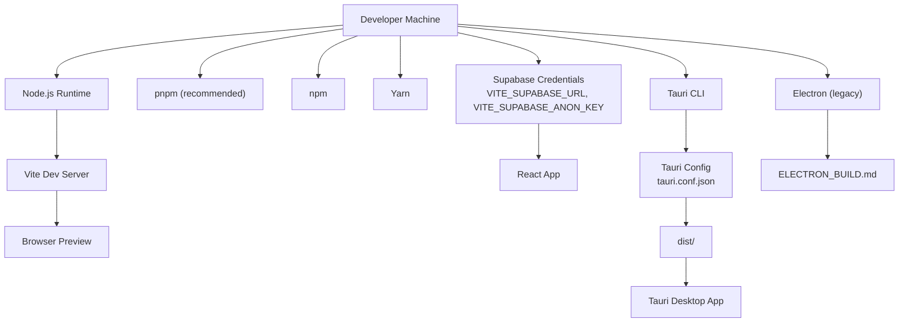
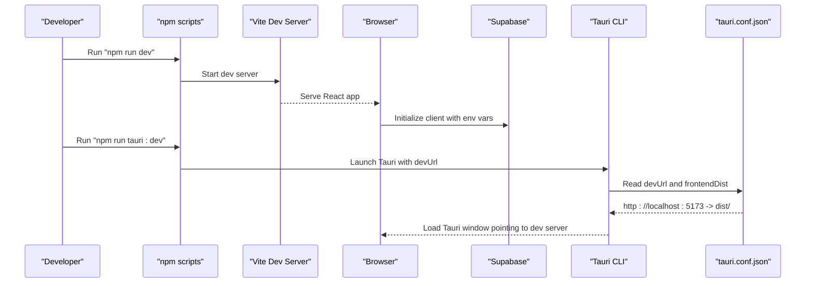
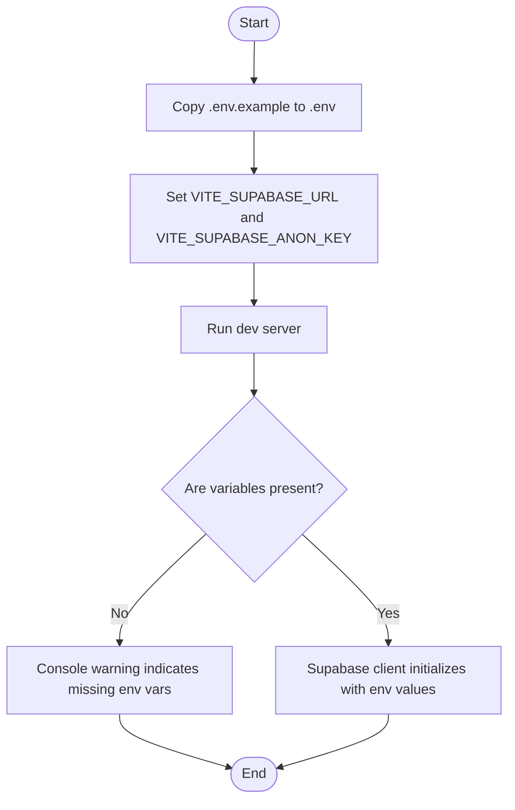
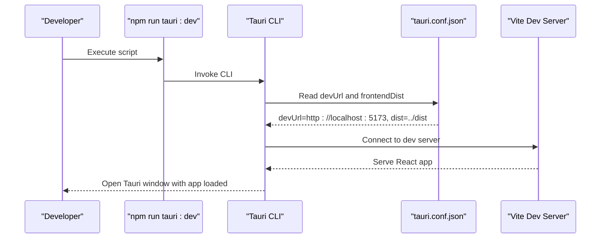
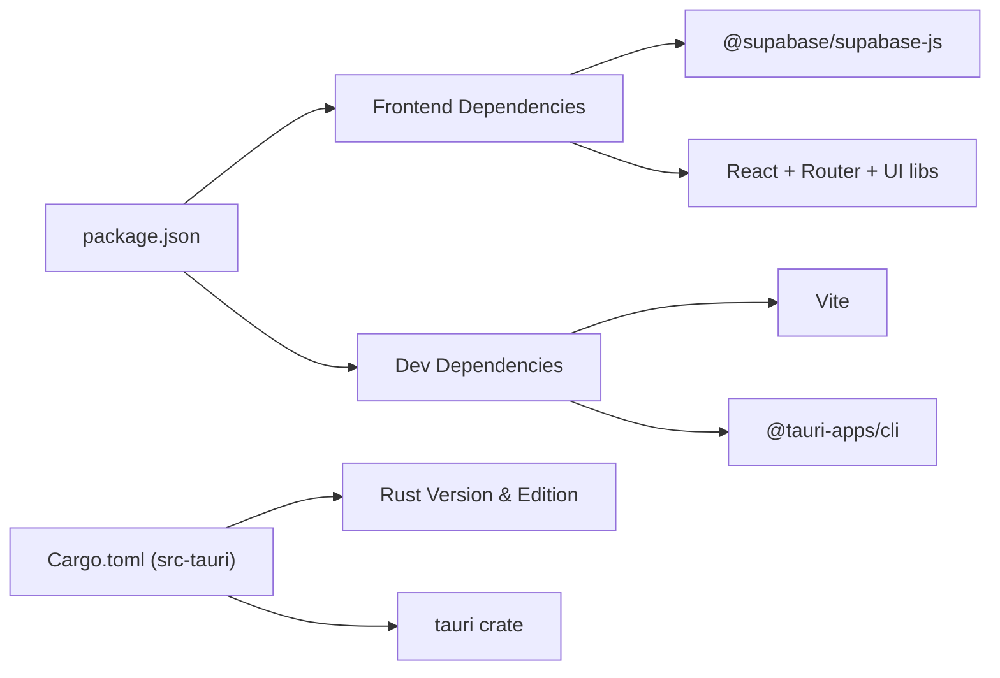

# Environment Setup

<cite>
**Referenced Files in This Document**
- [.env.example](file://.env.example)
- [package.json](file://package.json)
- [vite.config.js](file://vite.config.js)
- [src-tauri/tauri.conf.json](file://src-tauri/tauri.conf.json)
- [src/services/supabase.js](file://src/services/supabase.js)
- [src-tauri/Cargo.toml](file://src-tauri/Cargo.toml)
- [ELECTRON_BUILD.md](file://ELECTRON_BUILD.md)
- [README.md](file://README.md)
</cite>

## Table of Contents
1. [Introduction](#introduction)
2. [Project Structure](#project-structure)
3. [Core Components](#core-components)
4. [Architecture Overview](#architecture-overview)
5. [Detailed Component Analysis](#detailed-component-analysis)
6. [Dependency Analysis](#dependency-analysis)
7. [Performance Considerations](#performance-considerations)
8. [Troubleshooting Guide](#troubleshooting-guide)
9. [Conclusion](#conclusion)
10. [Appendices](#appendices)

## Introduction
This guide helps you set up a complete development environment for RosterFlow. It covers Node.js and package manager requirements, installing dependencies, configuring environment variables, starting the development server, and optional Tauri and Electron builds. It also includes IDE setup recommendations, debugging tips, and troubleshooting steps for common issues.

## Project Structure
RosterFlow is a React + Vite frontend with optional Tauri packaging and legacy Electron support. The key areas for environment setup are:
- Frontend build and dev server configuration
- Environment variables for Supabase
- Tauri configuration for desktop packaging
- Optional Electron build instructions

**Diagram sources**
- [package.json](file://package.json#L7-L13)
- [.env.example](file://.env.example#L1-L5)
- [src/services/supabase.js](file://src/services/supabase.js#L3-L10)
- [src-tauri/tauri.conf.json](file://src-tauri/tauri.conf.json#L6-L8)
- [ELECTRON_BUILD.md](file://ELECTRON_BUILD.md#L1-L41)

**Section sources**
- [package.json](file://package.json#L1-L44)
- [vite.config.js](file://vite.config.js#L1-L10)
- [.env.example](file://.env.example#L1-L5)
- [src/services/supabase.js](file://src/services/supabase.js#L1-L13)
- [src-tauri/tauri.conf.json](file://src-tauri/tauri.conf.json#L1-L35)
- [ELECTRON_BUILD.md](file://ELECTRON_BUILD.md#L1-L41)

## Core Components
- Node.js runtime and package managers
  - Use Node.js LTS recommended by the project’s tooling.
  - Install dependencies with your preferred package manager (npm, pnpm, or Yarn).
- Frontend toolchain
  - Vite dev server runs on the default port configured by the project.
  - React + Vite with Tailwind CSS and PostCSS pipeline.
- Supabase integration
  - Environment variables are consumed at runtime via Vite’s import.meta.env.
- Tauri desktop packaging
  - Tauri CLI is included as a dev dependency.
  - Tauri configuration defines the dev server URL and frontend distribution path.
- Optional Electron build
  - Legacy Electron build instructions are provided for Windows packaging.

**Section sources**
- [package.json](file://package.json#L15-L39)
- [vite.config.js](file://vite.config.js#L1-L10)
- [src/services/supabase.js](file://src/services/supabase.js#L3-L10)
- [src-tauri/tauri.conf.json](file://src-tauri/tauri.conf.json#L6-L8)
- [ELECTRON_BUILD.md](file://ELECTRON_BUILD.md#L1-L41)

## Architecture Overview
The development workflow connects the frontend, environment variables, and optional desktop packaging.

**Diagram sources**
- [package.json](file://package.json#L7-L13)
- [src-tauri/tauri.conf.json](file://src-tauri/tauri.conf.json#L6-L8)
- [src/services/supabase.js](file://src/services/supabase.js#L3-L10)

## Detailed Component Analysis

### Node.js and Package Managers
- Node.js requirement
  - Use a recent LTS version compatible with the project’s toolchain.
- Package managers
  - npm, pnpm, or Yarn are supported. Choose one and stick to it to avoid lockfile conflicts.
- Scripts
  - Development server: npm run dev
  - Tauri development: npm run tauri:dev
  - Production build: npm run build
  - Tauri build: npm run tauri:build
  - Preview build locally: npm run preview
  - Lint: npm run lint

**Section sources**
- [package.json](file://package.json#L7-L13)

### Environment Variables (.env)
- Purpose
  - Configure Supabase client credentials for the frontend.
- Required variables
  - VITE_SUPABASE_URL
  - VITE_SUPABASE_ANON_KEY
- Location
  - Copy .env.example to .env and fill in your Supabase values.
- Runtime usage
  - The Supabase client reads these values from import.meta.env at runtime.

**Diagram sources**
- [.env.example](file://.env.example#L1-L5)
- [src/services/supabase.js](file://src/services/supabase.js#L3-L10)

**Section sources**
- [.env.example](file://.env.example#L1-L5)
- [src/services/supabase.js](file://src/services/supabase.js#L3-L10)

### Vite Dev Server
- Base path
  - The project sets a relative base path for asset resolution.
- Running
  - Use npm run dev to start the Vite dev server.
- Port
  - The default port is determined by Vite; if port 5173 is in use, Vite will pick another port automatically.

**Section sources**
- [vite.config.js](file://vite.config.js#L1-L10)
- [package.json](file://package.json#L7-L8)

### Tauri Desktop Packaging
- CLI availability
  - Tauri CLI is included as a dev dependency.
- Dev mode
  - npm run tauri:dev launches Tauri with the dev server URL.
- Configuration
  - tauri.conf.json defines:
    - devUrl: http://localhost:5173
    - frontendDist: ../dist
- Rust backend
  - The Rust version requirement is specified in src-tauri/Cargo.toml.

**Diagram sources**
- [package.json](file://package.json#L9-L9)
- [src-tauri/tauri.conf.json](file://src-tauri/tauri.conf.json#L6-L8)

**Section sources**
- [package.json](file://package.json#L9-L9)
- [src-tauri/tauri.conf.json](file://src-tauri/tauri.conf.json#L6-L8)
- [src-tauri/Cargo.toml](file://src-tauri/Cargo.toml#L9-L9)

### Electron (Legacy)
- Purpose
  - Legacy build instructions for packaging a Windows executable using Electron.
- Commands
  - Development: npm run dev and npm run electron-dev
  - Build: npm run build:electron
- Notes
  - The project now primarily uses Tauri; Electron is retained for historical reference.

**Section sources**
- [ELECTRON_BUILD.md](file://ELECTRON_BUILD.md#L1-L41)

## Dependency Analysis
- Frontend dependencies
  - React, React DOM, React Router, Tailwind Merge, Lucide React, clsx, and @supabase/supabase-js.
- Dev dependencies
  - Vite, @vitejs/plugin-react, Tailwind CSS, PostCSS, ESLint, and @tauri-apps/cli.
- Tauri backend
  - Rust edition and minimum Rust version are defined in Cargo.toml.
  - Tauri crate and related plugins are declared as dependencies.

**Diagram sources**
- [package.json](file://package.json#L15-L39)
- [src-tauri/Cargo.toml](file://src-tauri/Cargo.toml#L1-L26)

**Section sources**
- [package.json](file://package.json#L15-L39)
- [src-tauri/Cargo.toml](file://src-tauri/Cargo.toml#L1-L26)

## Performance Considerations
- Keep Node.js updated to a recent LTS version for optimal Vite and tooling performance.
- Prefer a single package manager per project to avoid cache and lockfile inconsistencies.
- Use Vite’s built-in HMR for fast iteration; avoid unnecessary dev server plugins that slow startup.
- For Tauri builds, ensure the Rust toolchain meets the minimum version to prevent long compilation times.

## Troubleshooting Guide
- Port conflicts
  - Vite defaults to port 5173. If it is in use, Vite selects another port automatically. Check the terminal output for the actual URL.
- Missing Supabase environment variables
  - The app logs a warning if VITE_SUPABASE_URL or VITE_SUPABASE_ANON_KEY are missing. Set them in your .env file and restart the dev server.
- Tauri devUrl mismatch
  - Ensure tauri.conf.json devUrl matches the Vite dev server address. The project expects http://localhost:5173.
- Dependency resolution errors
  - Clear your package manager cache and reinstall dependencies if you encounter peer dependency warnings or module resolution failures.
- Rust toolchain issues (Tauri)
  - Confirm your Rust version satisfies the minimum requirement declared in Cargo.toml.
- IDE and linting
  - Use ESLint rules defined in the project. If your editor does not auto-apply formatting, run the linter and fix reported issues.

**Section sources**
- [src/services/supabase.js](file://src/services/supabase.js#L6-L8)
- [src-tauri/tauri.conf.json](file://src-tauri/tauri.conf.json#L8-L8)
- [src-tauri/Cargo.toml](file://src-tauri/Cargo.toml#L9-L9)
- [package.json](file://package.json#L25-L39)

## Conclusion
You now have the essentials to set up RosterFlow locally: Node.js, a package manager, environment variables for Supabase, and the ability to run the Vite dev server and Tauri app. Follow the steps below to get started quickly, and consult the troubleshooting section if you encounter issues.

## Appendices

### Step-by-Step First-Time Setup
- Install Node.js (LTS recommended)
- Choose a package manager (npm, pnpm, or Yarn)
- Clone the repository and navigate to the project directory
- Install dependencies using your chosen package manager
- Copy .env.example to .env and set VITE_SUPABASE_URL and VITE_SUPABASE_ANON_KEY
- Start the development server with npm run dev
- For Tauri desktop app, run npm run tauri:dev
- Verify the app loads in the browser and Tauri window

**Section sources**
- [.env.example](file://.env.example#L1-L5)
- [package.json](file://package.json#L7-L13)
- [src-tauri/tauri.conf.json](file://src-tauri/tauri.conf.json#L6-L8)

### IDE and Debugging Recommendations
- Editor: VS Code with ESLint extension for real-time feedback
- Extensions:
  - ESLint
  - Tailwind CSS IntelliSense
  - Prettier (optional, if not using ESLint formatting)
- Debugging:
  - Use browser dev tools to inspect network requests to Supabase
  - For Tauri, open the Tauri window and use the developer menu to inspect the frontend
- Linting:
  - Run npm run lint to check for issues and fix them before committing

**Section sources**
- [README.md](file://README.md#L1-L17)
- [package.json](file://package.json#L25-L39)